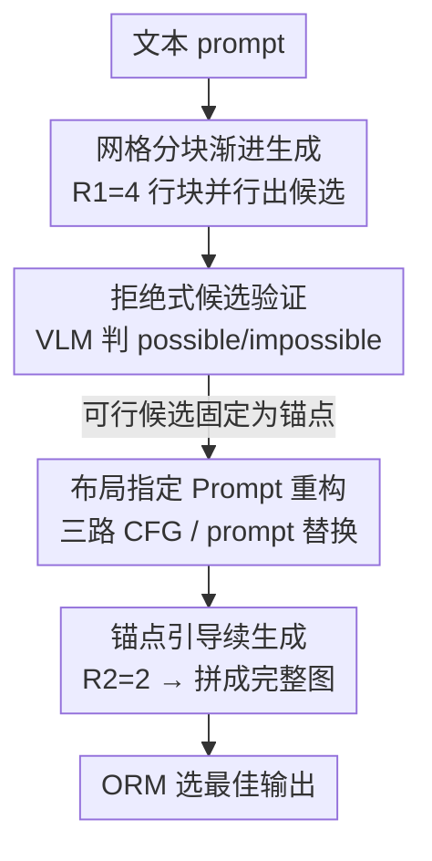

# Progress by Pieces: Test-Time Scaling for Autoregressive Image Generation

**会议**: CVPR 2026  
**论文**: [CVF Open Access](https://openaccess.thecvf.com/content/CVPR2026/html/Park_Progress_by_Pieces_Test-Time_Scaling_for_Autoregressive_Image_Generation_CVPR_2026_paper.html)  
**代码**: https://grid-ar.github.io （项目页）  
**领域**: 图像生成 / 自回归生成 / 测试时计算扩展  
**关键词**: 视觉自回归, 测试时扩展, 网格渐进生成, prompt 重构, 组合式文生图

## 一句话总结
GridAR 提出一套面向视觉自回归（AR）模型的**免训练测试时扩展**框架：把画布按行分块、并行生成多个部分候选并尽早剪枝错误轨迹，再用"布局指定 prompt 重构"给后续解码补上一张全局蓝图，在 T2I-CompBench++ 上用 N=4 就反超 Best-of-N（N=8）14.4% 且省 25.6% 算力。

## 研究背景与动机
**领域现状**：视觉自回归模型（LlamaGen、Janus-Pro、Emu3 等）把图像编码成 VQ token 序列，像 LLM 一样按光栅扫描（逐行 next-token）解码，已经在文生图上能和 DALL·E 3、SD3 这类扩散模型掰手腕。LLM 那边"测试时多花算力换更好结果"（CoT、Best-of-N + 奖励模型）已经被验证非常有效，于是一个自然的问题是：怎么把测试时扩展搬到视觉 AR 上？

**现有痛点**：直接套 Best-of-N 在视觉 AR 上很不划算。其一，AR 的早期 token 错误几乎无法补救——比如 prompt 要"四个包"，前面已经画了五个提手，后续逐 token 生成无力回天，但这条错误轨迹仍然要**烧满整张图的算力**才结束。其二，光栅扫描逐 token 预测时模型**没有整张画布的全局蓝图**：prompt 是"八只熊"，模型若把第一只熊画得很大占满上半区，为了画面合理就常常把下半区剩下的熊省略掉。结果 Best-of-N 采再多次，prompt 对齐的候选也寥寥无几。

**核心矛盾**：测试时扩展的收益来自"在有意义的方向上多探索"，但 AR 的顺序性既让算力浪费在错误轨迹上，又因缺蓝图让候选池整体偏离 prompt——多采样并不能自动转化为更好的候选。

**本文目标**：在**不额外训练**的前提下，把测试时算力**聚焦到值得探索的区域**，并给逐行解码补上一个可行的全局布局，从而在固定甚至更小的采样预算下榨出 AR 模型的最佳输出。

**切入角度**：作者借鉴 LLM 的树搜索推理——既然 AR 是逐行往下长的，那就让"探索"也按行来：在同一画布位置并行生成多个部分候选，错的早早砍掉、对的固定成锚点引导后续，把算力从一开始就导向有希望的延续。同时，逐行解码天然会产出"只画了上半部分"的中间图，正好可以拿来反推一个可行布局。

**核心 idea**：用"网格分块渐进生成 + 拒绝式验证"把 Best-of-N 改造成**分段、可剪枝**的搜索，再用从部分图反推的"布局指定 prompt 重构"补上全局蓝图。

## 方法详解

### 整体框架
GridAR 输入一条文本 prompt，输出一张更符合指令的图，整条流程是"把一张图分段画、边画边筛、并在中途改写 prompt 补蓝图"。具体地，画布被切成横向行块：第一阶段用 $R_1$ 行的网格并行生成 $R_1$ 个"上四分之一"候选，一个 VLM 验证器逐行判定哪些候选已经不可能满足 prompt（如颜色绑错、物体数已超），把这些剪掉、把可行的固定成锚点；进入第二阶段（$R_2$ 行网格）从锚点继续往下长，再验一次，最终拼成若干张完整图，由输出奖励模型（ORM）选最佳。论文取 $(R_1,R_2)=(4,2)$，两张起始画布即对应 $N{=}8$。与此并行，每次验证器评估候选时同步做"布局指定 prompt 重构"，把改写后的 prompt 通过三路 CFG 或直接替换喂给后续解码。

### 关键设计

**1. 网格分块渐进生成：把 Best-of-N 改成可剪枝的分段搜索**

这一设计直击"错误轨迹烧满全图算力"的痛点。把画布 $x\in\{1,\dots,K\}^{h\times w}$ 切成 $R_1=4$ 段连续行块 $x=[x^{(1)};\dots;x^{(4)}]$，每段 $L=\frac{h}{4}\cdot w$ 个 token，模型对同一上四分之一位置**相互独立**地生成四个候选 $p_\phi(x^{(r)}\mid c_T)=\prod_{n=1}^{L}p_\phi(x^{(r)}_n\mid x^{(r)}_{<n},c_T)$（prompt 的 KV 表示只算一次、四行复用以省算力），单次解码前向就能把含四候选的网格画布 $I_{\text{grid}}=D_{VQ}(x_q)$ 解出来。验证后把可行候选固定成锚点 $x_{\text{anchor}}$，第二阶段在 $R_2=2$ 的网格里"上半锁定锚点、下半自回归续写"$p_\phi(x^{(i)}_{\text{gen}}\mid x^{(i)}_{\text{anchor}},c_T)$，最终拼成四张完整图。这套"glimpse-and-grow"让算力一开始就被导向有希望的延续，且除验证开销外**总 token 数与标准 Best-of-N（N=4）持平**——同样预算下探索的有效性却更高。

**2. 拒绝式候选验证：只砍"不可能"，不做 top-k 选优**

针对"部分视图信息不全、过早选优会误杀"的问题，GridAR 用一个零样本 VLM 验证器 $V_\psi$ 对四个行块候选**一次性**逐行判定 $y^{(r)}\in\{\texttt{possible},\texttt{impossible}\}$，只拒绝那些已经明显违背 prompt 的（颜色绑错、数量超标），**保留其余全部**，被拒的候选随机用一个可行候选替换（如 $x^{(2)}$ 被拒则 $x_{\text{anchor}}=[x^{(1)},x^{(4)},x^{(3)},x^{(4)}]$）。作者刻意不像 beam search 那样做 top-k：因为评估的只是部分视图，某个物体可能只是"还没画到下半区而已"，top-k 会因这种假象过早丢弃大量潜在可行候选、损害候选池多样性。这一"宁可错放、不可错杀"的策略是渐进搜索能保住多样性的关键。

**3. 布局指定 prompt 重构：给逐行解码补一张全局蓝图**

光有分段搜索还不够——即便上半锚点选得好，下半解码仍可能重复已画物体或漏掉 prompt 要求的物体，根因就是 AR 缺全局蓝图。作者做了 pilot study（Janus-Pro-7B）：对那些 $N{=}1$ 失败、但上半部分正确的 prompt，固定上半 token 反复重采下半，发现一直坚持原 prompt 时成功率随采样上升很慢；而**在中途把 prompt 改写成具体布局**（如把"八只熊"在已画三只后改成"上面三只、下面五只"）后成功率明显抬升。于是在验证器评估候选的同时，从已观测的部分图反推一个可行布局、改写 prompt，并提供两种注入方式：(i) **三路 CFG**——设无条件/原始/重构 prompt 的 logits 偏移 $d_{o,i}=l^{(o)}_i-l^{(u)}_i$、$d_{r,i}=l^{(r)}_i-l^{(u)}_i$，把布局方向对原方向**正交化** $\tilde d_{r,i}=d_{r,i}-\frac{\langle d_{r,i},d_{o,i}\rangle}{\lVert d_{o,i}\rVert^2}d_{o,i}$，最终 $l^{\text{sample}}_i=l^{(o)}_i+s_o\,d_{o,i}+s_r\,\tilde d_{r,i}$，使布局信号不干扰原 prompt 的引导强度；(ii) **prompt 替换**——直接把后续解码的条件换成重构 prompt（标准 CFG），更省算力但信号更粗。这一步把"缺蓝图"这个 AR 的结构性短板补上，是候选池整体对齐 prompt 的关键。

### 损失函数 / 训练策略
GridAR 是**纯测试时、免训练**框架，不改动也不微调底座 AR 模型，全部增益来自推理期的分段搜索 + prompt 重构。实现上用 GPT-4.1 当验证器 $V_\psi$、Qwen2.5-VL 当 ORM；底座取 Janus-Pro-7B / LlamaGen（文生图）与 EditAR（编辑）；CFG 尺度 $s_o=5$（Janus-Pro）/ $6.5$（LlamaGen），重构 prompt 复用同一尺度 $s_r=s_o$，文生图默认用三路 CFG、编辑默认用 prompt 替换。

## 实验关键数据

### 主实验
在 T2I-CompBench++（2400 条组合式 prompt，8 个维度）上，GridAR 在同 $N$ 下把 Janus-Pro / LlamaGen 的平均分分别提升 **17.5% / 4.9%**；更关键的是 Janus-Pro 上 GridAR（N=4）直接反超 Best-of-N（N=8）14.4%，同时省 25.6% 算力。下表摘录几个最能体现"组合正确性"的维度（指标为 benchmark 原始 BLIP-VQA / UniDet / 3-in-1 分数，越高越好）：

| 维度 | Janus-Pro | +BoN (N=8) | +GridAR (N=4) | +GridAR (N=8) |
|------|-----------|------------|----------------|----------------|
| Color | 0.5388 | 0.7235 | 0.8050 | **0.8172** |
| Shape | 0.3476 | 0.4177 | 0.6014 | **0.6174** |
| Texture | 0.4357 | 0.5600 | 0.7268 | **0.7408** |
| 2D Spatial | 0.1607 | 0.2430 | 0.2833 | **0.3214** |
| Numeracy | 0.4467 | 0.5068 | 0.5684 | **0.5932** |

GenEval（500+ prompt，二值组合正确性）上，多数维度已饱和在 0.90+，作者重点报告 Counting / Position / Color Attribution 三个未饱和维度与总分：

| 方法 | Counting | Position | Color Attr. | Overall |
|------|----------|----------|-------------|---------|
| Janus-Pro | 0.59 | 0.77 | 0.65 | 0.79 |
| + BoN (N=8) | 0.76 | 0.86 | 0.72 | 0.86 |
| + GridAR (N=8) | **0.79** | **0.92** | **0.73** | **0.88** |

图像编辑（PIE-Bench，9 类场景 700 图，用 EditAR 底座）上，GridAR 相比更大 $N$ 的 baseline 取得 **14.5% 更高的语义保留**，在"指令遵循（CLIP 相似度）↔ 源图保留（DINO 结构距离 / 背景 MSE）"的权衡上更优。

### 消融与分析
论文在正文与附录给出多项分析（验证器鲁棒性、两种 prompt 重构策略对比、人类评测、拒绝率统计）。其中两种 prompt 注入方式形成清晰对照：

| 配置 | 特点 | 取舍 |
|------|------|------|
| 三路 CFG（默认文生图） | 把重构布局方向正交化后注入 logits，不干扰原 prompt 引导强度 | 信号更细，文生图效果更好 |
| prompt 替换（默认编辑） | 直接换条件、走标准 CFG | 更省算力，编辑场景够用 |
| 拒绝式验证 vs top-k | 只砍 impossible、保留多样性 | 避免部分视图下过早误杀候选 |

### 关键发现
- **算力效率是核心卖点**：N=4 的 GridAR 反超 N=8 的 Best-of-N，说明"分段剪枝 + 蓝图补全"带来的收益远超单纯加大采样数。
- **底座越强、协同越明显**：Janus-Pro 上提升（17.5%）远大于 LlamaGen（4.9%），因为强模型更能听懂布局指定、初始候选也更准。
- **缺蓝图是真实瓶颈**：pilot study 显示，仅靠重采下半区、坚持原 prompt 时成功率提升缓慢，改写成显式布局后曲线明显抬高——直接验证了 prompt 重构这一步的必要性。

## 亮点与洞察
- **把 LLM 的"分段树搜索"具象成图像的"按行 glimpse-and-grow"**：用画布的空间结构天然定义搜索的分段单元，错误轨迹在第一段就能被砍掉，这是把测试时扩展从"重复整图采样"升级为"分段可剪枝搜索"的关键迁移。
- **"只拒绝、不选优"是反直觉但正确的设计**：在部分视图下，缺席的物体可能只是没画到，top-k 会误杀；保留多样性、只砍确定违规者，恰好契合渐进生成的信息不完整性。
- **用中间产物（部分图）反哺生成**：分块渐进会自然产出"只画了上半"的中间图，作者没把它当副产物而是当作推断布局的线索，再以正交化三路 CFG 注入——这种"从已生成内容反推蓝图"的思路可迁移到任何缺全局规划的顺序生成模型。
- **全程免训练**：所有增益来自推理期调度，可直接套在现成 AR 底座上，部署成本低。

## 局限与展望
- 依赖**外部强验证器/ORM**（GPT-4.1、Qwen2.5-VL）：验证器质量直接影响剪枝与重构，零样本验证器的准确率是误差来源（作者在附录专门分析其影响），实际部署需考虑调用成本与延迟。
- 网格划分 $(R_1,R_2)=(4,2)$ 是经验权衡，对不同分辨率/物体密度是否最优需逐场景调（附录有其他配置分析）。⚠️ 极端情况下所有候选可能被全拒，需额外处理策略（附录 B）。
- 增益高度依赖**底座的布局遵循能力**：弱 AR 模型（LlamaGen）上收益有限，框架更像"把强模型的潜力榨出来"，而非补足弱模型的能力短板。
- 主要面向**组合式/计数/空间**这类对布局敏感的 prompt；对单物体、纹理类已饱和维度提升空间不大。

## 相关工作与启发
- **vs Best-of-N**：BoN 对整图重复采样、错误轨迹照样烧满算力且无蓝图；GridAR 把采样改成分段可剪枝搜索 + 中途补蓝图，同预算下候选池质量更高，N=4 即反超 BoN 的 N=8。
- **vs LLM 风格的 token-wise CoT / RL 方案**（如把 CoT/RL 直接移植到视觉 AR）：这些方法没有反映"图像由 AR 生成"的空间特性；GridAR 利用画布的行结构和部分图线索，是为视觉 AR 量身定制的扩展方式。
- **vs 迭代掩码 AR 的中间验证方法**：同样想在测试时验证中间结果，但 GridAR 额外引入按行剪枝的搜索结构与布局 prompt 重构，针对的是光栅扫描特有的"缺蓝图 + 早错难纠"。
- **vs 显式 planner 先定布局再生成**：作者在 4.4 节比较，GridAR 的"从部分图动态反推布局"优于事先用 planner 指定布局，因为前者基于实际中间结果、更可行。

## 评分
- 新颖性: ⭐⭐⭐⭐⭐ 把测试时扩展为视觉 AR 量身重设计（按行剪枝搜索 + 部分图反推蓝图 + 正交化三路 CFG），角度新且自洽。
- 实验充分度: ⭐⭐⭐⭐ 覆盖文生图（两 benchmark、两底座）+ 编辑，有 pilot study 和验证器分析；但不少消融/人评在附录，正文消融偏少。
- 写作质量: ⭐⭐⭐⭐ 动机—观察—方法链条清晰，pilot study 很有说服力；公式略密、部分细节需翻附录。
- 价值: ⭐⭐⭐⭐⭐ 免训练、即插即用，在固定/更小预算下显著提升组合式生成质量，对 AR 文生图实用价值高。

<!-- RELATED:START -->

## 相关论文

- [\[CVPR 2026\] From Scale to Speed: Adaptive Test-Time Scaling for Image Editing](from_scale_to_speed_adaptive_test-time_scaling_for_image_editing.md)
- [\[CVPR 2026\] Rethinking Prompt Design for Inference-time Scaling in Text-to-Visual Generation](rethinking_prompt_design_for_inference-time_scaling_in_text-to-visual_generation.md)
- [\[CVPR 2026\] Test-Time Alignment of Text-to-Image Diffusion Models via Null-Text Embedding Optimisation](test-time_alignment_of_text-to-image_diffusion_models_via_null-text_embedding_op.md)
- [\[CVPR 2026\] VibeToken: Scaling 1D Image Tokenizers and Autoregressive Models for Dynamic Resolution Generations](vibetoken_scaling_1d_image_tokenizers_and_autoregressive_models_for_dynamic_reso.md)
- [\[CVPR 2026\] Test-Time Instance-Specific Parameter Composition: A New Paradigm for Adaptive Generative Modeling](test-time_instance-specific_parameter_composition_a_new_paradigm_for_adaptive_ge.md)

<!-- RELATED:END -->
