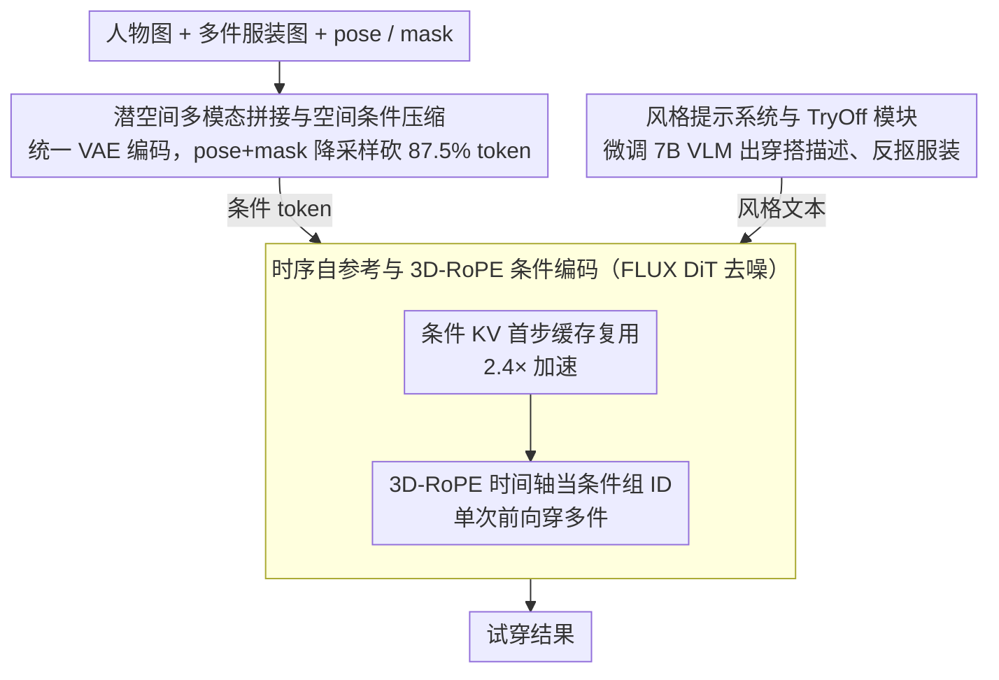

# PROMO: Promptable Outfitting for Efficient High-Fidelity Virtual Try-On

**会议**: CVPR 2026  
**arXiv**: [2603.11675](https://arxiv.org/abs/2603.11675)  
**代码**: 无（小红书团队）  
**领域**: 图像生成 / 虚拟试穿  
**关键词**: 虚拟试穿, Flow Matching DiT, 多条件生成, 时序自参考, 穿搭风格控制  

## 一句话总结
PROMO基于FLUX Flow Matching DiT骨干，通过潜空间多模态条件拼接、时序自参考KV缓存、3D-RoPE分组条件、以及fine-tuned VLM风格提示系统，在去除传统参考网络的前提下实现了高保真且高效的多件服装虚拟试穿，推理速度比无加速版快2.4倍，在VITON-HD和DressCode上超越现有VTON和通用图像编辑方法。

## 背景与动机
虚拟试穿（VTON）是电商的核心能力，帮助消费者在线获取可靠的穿搭参考、减少退货。当前主流方法存在三类问题：(1) 早期warping方法（TPS、appearance flow）在遮挡和大变形下表现差；(2) GAN方法难以保留精细服装细节和自然人体几何；(3) 扩散模型方法虽大幅提升写实度，但普遍依赖参考网络（Reference Net）来编码服装特征——如IDM-VTON、OOTDiffusion、FitDiT等使用一整个额外网络，导致参数量翻倍、初始化和交互逻辑复杂、推理缓慢。此外，现有方法大多忽略穿搭风格控制（如衣服是束入裤子还是放在外面），或依赖闭源VLM（如PromptDresser用GPT-4o）来生成风格描述。

## 核心问题
如何在不使用参考网络的前提下，实现高保真的多件服装虚拟试穿？具体子问题：(1) 如何高效注入多种异构条件（人物图、多件服装、pose、mask）而不膨胀计算量？(2) 如何利用Flow Matching DiT的结构实现推理加速？(3) 如何实现可控的穿搭风格（如"前束""合身"等）？

## 方法详解

### 整体框架
PROMO建立在FLUX.1-dev（Flow Matching DiT）骨干上，采用LoRA（rank=128，580M可训练参数）微调。整体流程：给定人物图$I_P$、服装图$\{I_{G_i}\}$和可选风格文本$T_{style}$，模型生成穿着目标服装的新图像$I_{new}$。条件注入方式是**潜空间多模态拼接**：将mask后的人物图、各件服装图、以及合并后的pose+mask条件，分别通过统一VAE编码到潜空间后拼接为条件token序列，与去噪潜变量$z_t$和文本嵌入一起送入DiT。不同条件根据信息密度使用不同分辨率（服装和人物用原始分辨率，pose+mask降采样到25%），避免了IC-LoRA等方法要求所有拼接图像统一分辨率的问题。

### 关键设计

**1. 时序自参考与 3D-RoPE 条件编码：去掉参考网络，单次前向穿多件衣服**

针对前面说的参考网络参数翻倍、推理缓慢的痛点，PROMO 抓住了一个关键观察：条件 token（每件服装图 $C_i$）在整个去噪过程中语义是不变的，没必要每一步都重算。于是它把条件 token 的 Key-Value 对只在第一个时间步算一次并缓存，后续每步只为去噪潜变量 $z_t$ 和风格文本 $T_{style}$ 计算 Query 去复用这份缓存，推理从 22.2s 压到 9.2s（2.4 倍加速）。注意力可见性上也做了区分：$z_t$ 和 $T_{style}$ 全局可见，而各件服装 $C_i$ 之间互不可见、只做自注意，避免不同服装条件互相串扰。

光有缓存还不够——模型还得知道"哪件衣服该穿到身体的哪个位置"。PROMO 复用了 RoPE 的时间维度当作条件组的"身份标签"：去噪潜变量的时间编码记为 0，空间条件记为 $i$，服装条件记为 $(i, x, y+\Delta)$。这样不加任何额外参数，模型就能从位置编码里读出条件分组，单次前向完成多件服装的试穿，不必像迭代式方法那样一件件叠加、累积误差。也正因为分组靠的是位置编码而非固定数量的输入槽，它能做到训练时只喂单件、推理时穿多件的泛化。

**2. 潜空间多模态拼接与空间条件压缩：异构条件统一编码，token 数砍掉 87.5%**

接着 (1) 里"不膨胀计算量"的目标，麻烦在于人物图、多件服装、pose、mask 这些条件的模态和分辨率都不一样，怎么塞进同一个 DiT。PROMO 的做法是把 mask 后的人物图和各件服装图都用同一个 VAE 编码到潜空间，再拼成条件 token 序列，并按信息密度给不同条件分配不同分辨率——服装和人物保留原始分辨率，pose+mask 这种结构信息则降采样。具体来说，它把 pose 直接粘贴到 agnostic mask 图上再整体 2 倍降采样，原本 2N 个 token 压到 N/4，相当于砍掉 87.5% 的条件 token。这一步绕开了 IC-LoRA 那类方法"所有拼接图必须统一分辨率"的限制，在几乎不损失信息的前提下把注意力计算量压了下来。

身体解析 mask 在这里还兼了第二个用处：做区域感知的损失加权，身体区域权重 $1+\lambda$、背景权重 $1-\lambda$（$\lambda=0.5$），把梯度往服装细节上引，而不是浪费在背景上。

**3. 风格提示系统与 TryOff 模块：把穿搭风格控制做成自训练的小 VLM**

前两点解决的是保真和效率，这一点补的是可控性和适用面。现有方法要么干脆不管穿搭风格（衣服是束进裤子还是放外面），要么像 PromptDresser 那样依赖闭源 GPT-4o、而且只支持单件。PROMO 反过来自己训了个小 VLM：先用 Qwen2.5-VL-72B 标注少量数据，严格过滤后拿去微调 Qwen2.5-VL-7B，让它输出结构化的穿搭描述（用 Pydantic 的 OpenAPI JSON schema 约束输出格式）。有意思的是 7B 反而比 72B 更准——因为它训练时只见过过滤后的合规数据，没被噪声样本带偏。配套的 TryOff 模块则负责从模特图里反向抠出服装区域，既支持非配对数据训练，也覆盖了实际场景中拿不到独立平铺服装图的情况。

### 损失函数 / 训练策略
- Flow Matching目标 + 区域感知加权：$\mathcal{L} = \mathbb{E}_{t,z_0,\epsilon}[\mathbf{W} \odot \|\mathbf{v} - \mathbf{v}_\theta(z_t, t, \mathbf{c})\|^2]$
- 解析mask下采样时的加权损失设计：因16倍下采样丢失细节，对解析区域采用加权方案保留区分度
- 使用Prodigy优化器（自适应学习率，默认lr=1），16×H800 GPU，有效batch size 16，训练90K步
- 训练数据为VITON-HD + DressCode训练集，分辨率1024×768

## 实验关键数据

| 数据集 | 指标 | PROMO | Any2AnyTryon | OOTDiffusion | CatVTON | 提升 |
|--------|------|-------|--------------|--------------|---------|------|
| VITON-HD (paired) | SSIM↑ | 0.8913 | 0.9107 | 0.8883 | 0.8944 | 第二 |
| VITON-HD (paired) | LPIPS↓ | 0.0887 | 0.1208 | 0.0800 | 0.1600 | 第二 |
| VITON-HD (paired) | FID↓ | 3.3103 | 3.0828 | 3.6623 | 6.5372 | 第二 |
| VITON-HD (paired) | KID↓ | 0.4902 | 1.0565 | 0.8550 | 3.9591 | **最佳** |
| VITON-HD (unpaired) | FID↓ | 4.7393 | 5.5404 | 7.0463 | 8.4567 | **最佳** |
| VITON-HD (unpaired) | KID↓ | 0.4992 | 1.5258 | 2.7910 | 4.4897 | **最佳** |
| DressCode (paired) | LPIPS↓ | 0.1111 | 0.1569 | 0.1905 | 0.1882 | **最佳** |

**vs 通用图像编辑模型**: 在VITON-HD和DressCode上全面超越Seedream 4.0、Qwen-Image-Edit、Nanobanana（Gemini 2.5-Flash-Image），通用编辑模型在VTON任务上色彩不一致、伪影明显。

**用户研究（In-The-Wild）**: 13人物×40服装=520组，9名标注者评估：

| 方法 | 纹理一致 | 体型一致 | 风格一致 | 颜色一致 | 总体优秀率 |
|------|----------|----------|----------|----------|------------|
| PROMO | 93.65% | **94.62%** | **96.92%** | 97.88% | **84.42%** |
| Huiwa | **94.42%** | 88.85% | 94.80% | **99.04%** | 78.85% |
| Kling | 87.12% | 93.46% | 79.87% | 96.53% | 60.19% |
| Douyin | 96.73% | 79.04% | 85.19% | 95.77% | 61.54% |

### 消融实验要点
- **3D-RoPE**: 移除后所有指标大幅下降（FID 3.31→6.73，KID 0.49→1.72），模型无法正确区分不同条件组，生成出现明显错穿和伪影。这是最关键的组件。
- **风格提示**: 移除后FID从3.31升至3.72、KID从0.49升至0.89，证明文本引导对质量有正面作用，同时提供风格可控性。
- **区域感知损失**: 移除后unpaired KID从0.50升至0.95，在复杂背景场景中尤为明显。
- **时序自参考**: 从22.2s降至9.2s（2.4倍加速），SSIM/LPIPS/FID几乎不变，证明条件KV缓存近乎无损。
- **空间条件合并**: 从11.1s降至9.2s（1.2倍加速），质量指标无明显变化，验证了利用空间冗余降低token数的合理性。

## 亮点
- **"做减法"的工程哲学**: 不用参考网络、不用显式warping、不用闭源VLM，每个设计选择都在简化系统的同时提升性能。用KV缓存替代参考网络的思路非常巧妙
- **3D-RoPE的妙用**: 将RoPE时间轴重新定义为条件组ID，零参数实现多条件分组，且支持训练时单件→推理时多件的泛化
- **VLM蒸馏的实用范式**: 大模型标注→严格过滤→小模型微调，得到的7B模型反而比72B更准（因为只见过合规数据）。这个模式可广泛复用
- **全面的商业级评估**: 不仅在学术benchmark上评测，还与Huiwa、Kling、抖音等商业产品做用户研究对比，总体优秀率84.42%领先

## 局限与展望
- **Paired SSIM/LPIPS不是最优**: 在paired setting下略逊于Any2AnyTryon的SSIM，说明像素级重建精度还有提升空间
- **依赖人体解析和DensePose**: 前处理流程仍较重，需要分割模型和pose估计模型，端到端简化是一个方向
- **仅公开benchmark评估**: 论文提到自收集的in-the-wild数据集但未公开
- **多件服装推理的质量保证**: 3D-RoPE实现了单件训练→多件推理，但多件服装之间的交互（如上下装搭配协调）在训练时未直接优化
- **LoRA微调限制**: 仅用LoRA微调可能限制模型对VTON特有分布的适应能力，全参数微调可能进一步提升

## 与相关工作的对比
- **vs FitDiT**: 同为DiT-based VTON方法，FitDiT使用双网络架构（主DiT+参考DiT），PROMO通过时序自参考避免参考网络，参数量更少、推理更快
- **vs IDM-VTON/OOTDiffusion**: 使用UNet+参考网络架构，PROMO在DressCode上LPIPS大幅领先（0.111 vs 0.190），体现了DiT骨干的优势
- **vs CatVTON**: 同为拼接式条件注入，但CatVTON在图像空间拼接要求统一分辨率，PROMO在潜空间拼接且不同条件用不同分辨率
- **vs PromptDresser**: 同有风格控制能力，但PromptDresser依赖GPT-4o（闭源、费token、仅支持单件服装），PROMO自训练的7B VLM更高效准确
- **vs 通用编辑模型（Seedream/Qwen/Gemini）**: 通用模型在VTON任务上色彩不一致、细节丢失严重，专用VTON模型仍有明显优势

## 启发与关联
- 时序自参考（KV缓存复用）的思路可迁移到其他多条件生成任务，如图像编辑、多主体定制等
- 3D-RoPE分组条件的设计可能适用于任何需要区分多个参考图的场景
- VLM大→小蒸馏的流程对工业界构建低成本标注pipeline有参考价值
- VTON作为结构化图像编辑的formulation，暗示VTON的训练数据可以反过来用于训练通用编辑模型

## 评分
- 新颖性: ⭐⭐⭐⭐ 时序自参考在DiT上的应用、3D-RoPE分组条件、VLM蒸馏风格系统均有新意，整体是对已有技术的精巧组合
- 实验充分度: ⭐⭐⭐⭐⭐ 在VITON-HD、DressCode、In-The-Wild三个数据集上评测，与VTON方法和通用编辑模型全面对比，消融实验覆盖所有关键设计，还有与商业产品的用户研究
- 写作质量: ⭐⭐⭐⭐ 系统设计讲解清晰，图表丰富，但部分公式符号定义可以更紧凑
- 价值: ⭐⭐⭐⭐ 工业导向的实用框架，多个技术设计可迁移到其他条件生成任务

<!-- RELATED:START -->

## 相关论文

- [\[CVPR 2026\] Garments2Look: A Multi-Reference Dataset for High-Fidelity Outfit-Level Virtual Try-On with Clothing and Accessories](garments2look_a_multi-reference_dataset_for_high-fidelity_outfit-level_virtual_t.md)
- [\[CVPR 2026\] High-Fidelity Virtual Try-On beyond Paired Data Scarcity via Diffusion-based Cycle-Consistent Learning](high-fidelity_virtual_try-on_beyond_paired_data_scarcity_via_diffusion-based_cyc.md)
- [\[CVPR 2025\] Shining Yourself: High-Fidelity Ornaments Virtual Try-on with Diffusion Model](../../CVPR2025/image_generation/shining_yourself_high-fidelity_ornaments_virtual_try-on_with_diffusion_model.md)
- [\[CVPR 2026\] FEAT: Fashion Editing and Try-On from Any Design](feat_fashion_editing_and_try-on_from_any_design.md)
- [\[CVPR 2026\] DiT360: High-Fidelity Panoramic Image Generation via Hybrid Training](dit360_high-fidelity_panoramic_image_generation_via_hybrid_training.md)

<!-- RELATED:END -->
