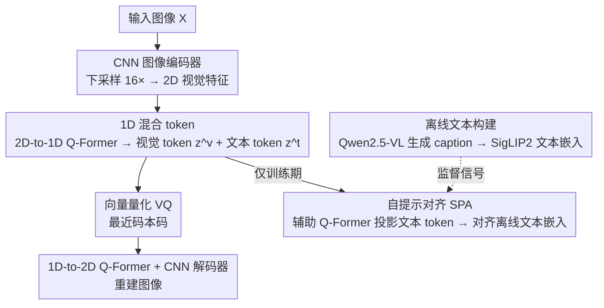

# Prompt Yourself: Awakening Textual Semantics in 1D Visual Tokenizers

**会议**: CVPR 2026  
**论文**: [CVF Open Access](https://openaccess.thecvf.com/content/CVPR2026/html/Wang_Prompt_Yourself_Awakening_Textual_Semantics_in_1D_Visual_Tokenizers_CVPR_2026_paper.html)  
**代码**: 论文未给出仓库链接  
**领域**: 图像生成  
**关键词**: 1D 视觉 tokenizer, 混合 token, 自提示对齐, 图像重建, 图像生成

## 一句话总结
VLTok 把 1D 视觉 token 序列功能性地切成"视觉 token + 文本 token"两段，训练时用自提示对齐（SPA）把预训练文本编码器的细粒度语义蒸馏进文本 token、推理时直接丢掉文本编码器保持纯图像流程，在 ImageNet 上同参数量下相对 GigaTok 把 rFID 降 11.1%、gFID 降 18.7%。

## 研究背景与动机
**领域现状**：视觉 tokenizer 把图像压成离散潜码，是图像重建与生成的基石。传统 2D tokenizer 保留网格、每个 token 对应固定 patch；TiTok 这类 1D tokenizer 干脆丢掉空间网格，把图像编成一条短的一维 token 序列，语义更紧凑、token 更少。

**现有痛点**：1D 表示丢掉了局部空间先验，难以保留细粒度内容——论文 Figure 1 展示 FlexTok（TiTok 增强版）重建出"数错的数量、不真实的人脸、混杂的动物特征、错误的姿态、缺失的物体"等事实性错误。已有补救要么堆模型（GigaTok 把参数推到十亿级），要么动态加 token（ALIT、FlexTok），都只是"表面缓解"且大幅抬高训练/推理预算，1D token 丢细节的**本质问题没解决**。

**核心矛盾**：1D 的紧凑性来自丢弃空间先验，而细粒度保真又恰恰需要这些信息——单纯扩规模/加 token 是在同一条视觉信道里硬填，边际收益递减（GigaTok 从 622M 扩到 2.9B，rFID 只改善 0.02）。

**本文目标**：在不破坏"纯图像、轻量"框架、不在推理期引入外部文本和文本编码器的前提下，给 tokenizer 注入细粒度文本语义，补回 1D 编码丢掉的内容。

**切入角度**：作者观察到 1D tokenizer 把图像建模成"类文本序列"，这种顺序结构天然能在同一条序列里联合编码"图像长什么样（视觉）"和"图像表达什么（文本语义）"。已有引入文本的方法要么强制推理期外部文本（TexTok/TA-TiTok），要么是 2D 上的全局粗对齐（VILA-U/UniTok 靠 token pooling），都不适合 1D 细粒度对齐。

**核心 idea**：提出 **1D 混合 token**——序列里一部分是视觉 token、一部分是文本 token，文本 token 直接从图像自身生成（self-prompted），训练时对齐到预训练文本编码器嵌入，推理时无需任何外部文本。

## 方法详解

### 整体框架
VLTok 沿用 GigaTok 的 CNN-Transformer 混合架构，关键改动是把 1D token 序列功能性切成视觉子序列 $z^v$ 和文本子序列 $z^t$。前向流程：CNN 图像编码器把图像下采样 16 倍得 2D 视觉特征；2D-to-1D 的 Q-Former 把展平的 2D 特征连同视觉/文本 query 一起编成混合 1D token；向量量化器把每个 token 量化到码本最近码；1D-to-2D 的 Q-Former 解码器把量化后的混合 token 还原成 2D 特征；CNN 图像解码器重建图像。训练时旁挂一个自提示对齐（SPA）分支：辅助 Q-Former 把文本 token 投影到预训练文本编码器（默认 SigLIP2）的嵌入空间，用离线生成的图像描述嵌入做监督；推理时只跑前向主干，SPA 分支与文本编码器全部丢弃。

### 关键设计

**1. 1D 混合 token：把序列功能切成视觉子序列 + 文本子序列**

针对"1D token 丢细节、单纯扩规模无效"的痛点，作者不改架构，而是把 2D-to-1D Q-Former 的 query 拆成 $N^v$ 个视觉 query 和 $N^t$ 个文本 query。给定图像特征 $f^{2d}=E(X)$，把展平的 2D 特征与两类 query 拼接喂进编码器得混合 token：$z^v\perp z^t=E_{1d}(q^v\perp q^t\perp f^{2d})$，其中 $z^v\in\mathbb{R}^{N^v\times d}$、$z^t\in\mathbb{R}^{N^t\times d}$，$\perp$ 是 token 级拼接。两段 token 都过同一个 VQ：$\hat{z}_i=Q(z_i)=c_j,\ j=\arg\min_k\lVert z_i-c_k\rVert_2$，再过 1D-to-2D 解码器重建。关键在于视觉 token 负责"图像长什么样"、文本 token 专门捕捉"图像表达什么"的语言线索，用来纠正纯视觉表示的内容偏差——而这一切都在同一条 1D 序列里完成，不增加架构复杂度。实现上默认 256 token 时 $N^v=224,N^t=32$，128 token 时 $N^v=96,N^t=32$。

**2. 自提示对齐 SPA：细粒度蒸馏文本语义、推理期丢弃文本编码器**

光有文本 token 还不够，得有监督信号教它学语义；但常规图文对比损失靠对视觉特征做 token pooling 做的是全局粗对齐，对"把细粒度语义蒸馏进 1D 文本 token"是次优的。SPA 的做法是细粒度特征蒸馏：先用预训练文本编码器 $E_T$（如 SigLIP2/CLIP 的文本编码器）离线把图像配对 caption 编成目标嵌入 $e_t=E_T(T)\in\mathbb{R}^{N^e\times D^e}$；训练时用一个辅助 Q-Former $E_{aux}$（带 $N^e$ 个 query $q^{te}$）把投影后的 1D 文本 token 预测成嵌入 $\hat{e}_t=E_{aux}(q^{te}\perp z^t)$；对齐损失是嵌入空间的 L2 距离 $L_{sp}=\lVert\hat{e}_t-e_t\rVert_2$。因为文本 token 是从图像本身生成的（self-prompted），推理时完全不需要外部文本或文本编码器，纯图像流程不变。SPA 是最大功臣：消融显示加上后 rFID 0.90→0.72、gFID 2.08→1.70、线性探测精度 66.2→69.9（+3.7），后者直接验证了"通过自提示学到文本语义 → 编码偏差更小"的核心假设。

**3. 离线 caption 构建与文本编码器选择**

SPA 需要图文配对，但 ImageNet-1K 没有 caption。作者默认用 Qwen2.5-VL-7B 给 ImageNet 图像自动生成 2-3 句描述，把它扩成图文配对集，文本嵌入离线预提取（推理期零额外开销，训练期 SPA 的辅助 Q-Former 仅增约 2% FLOPs）。文本编码器的选择上，消融对比了判别式（CLIP-B/16、SigLIP2-so-400m）与生成式（T5-XL、Qwen2.5-VL-7B），SigLIP2 在所有指标上最好，说明判别式文本编码器提供的细粒度语义更适合做蒸馏目标。caption 质量也敏感：更强的多模态 captioner（Qwen2.5-VL > InternVL3-8B > LLaVA-Next-3B）给出更好的下游表现，但在高水平模型之间差异趋于边际。

### 损失函数 / 训练策略
总损失在 GigaTok 的标准 tokenizer 损失（图像重建、PatchGAN 对抗、VQ 重建、DINOv2 语义正则 REPA）基础上加 SPA 对齐损失，$L_{sp}$ 权重设为 1，其余权重与 GigaTok 一致。tokenizer 用 batch 256 训 100 epoch；生成框架（MaskGIT-UViT-L 287M / LlamaGen 111M）用 batch 2048 训 300 epoch；均用 AdamW、学习率 $10^{-4}$、cosine 调度。文本 token 数存在权衡：增多会逼模型过度偏向跨模态对齐、损害视觉重建，Figure 4 显示最优区间是 16-32。

## 实验关键数据

### 主实验
ImageNet 256×256 重建与生成（rFID/gFID 越低越好；同结构同 token 用 ⋆ 标注）：

| 方法 | 参数 | Tokens | rFID↓ | 生成框架 | gFID↓ |
|------|------|--------|-------|----------|-------|
| TiTok-S | 72M | 128 | 1.71 | MaskGIT-UViT-L | 1.97 |
| GigaTok-B-L⋆ | 622M | 256 | 0.81 | LlamaGen⋆ 111M | 3.26 |
| GigaTok-XL-XXL | 2.9B | 256 | 0.79 | LlamaGen 111M | 3.15 |
| **VLTok-B-L** | 622M | 128 | 1.01 | MaskGIT-UViT-L | **1.79** |
| **VLTok-B-L⋆** | 622M | 256 | **0.72** | LlamaGen⋆ 111M | 2.65 |

同参数量（622M、256 token）下 VLTok 比 GigaTok-B-L 的 rFID 高 0.09（0.72 vs 0.81，相对 11.1%），甚至超过 4.7 倍参数的 GigaTok-XL-XXL（0.79）；生成上 128-token VLTok 在 MaskGIT 框架把 gFID 从 TiTok 的 1.97 降到 1.79（-0.18），256-token 在 LlamaGen 框架把 gFID 从 GigaTok 的 3.26 降到 2.65（相对 18.7%）。PSNR 上 256-token VLTok 26.12 也优于 TexTok 的 24.38，且不需要 TexTok 那样的外部文本 token、更小 patch（8）和 3B 量级 T5。

### 消融实验
SPA 模块与对齐方式（MaskGIT-UViT-L，256 token）：

| 配置 | rFID↓ | LPIPS↓ | gFID↓ | 线性探测 Acc↑ |
|------|-------|--------|-------|------|
| w/o SPA | 0.90 | 0.211 | 2.08 | 66.2 |
| w/ SPA（完整） | **0.72** | **0.203** | **1.70** | **69.9** |
| Δ | -0.18 | -0.08 | -0.38 | +3.7 |

对齐方式对比（128 token，rFID）：纯视觉无对齐 1.42 → 图文对比损失 w/ CL 1.26 → 自提示对齐 w/ SPA **1.01**，SPA 相对 CL 再降 24%，说明细粒度自提示蒸馏明显优于全局对比对齐。

### 关键发现
- SPA 对"表示能力"的提升最直观：线性探测精度 +3.7（66.2→69.9），证明文本语义被真正蒸馏进了 token 而非只改善了像素级重建。
- 文本 token 数有甜区：16-32 最佳，过多会挤占视觉重建能力，是多模态 token 化的核心权衡。
- 强泛化：仅在 ImageNet（物体中心）训练，却在 AFHQ-Dog/Cat/Wild、FFHQ、COCO 等 OOD 域上 rFID 相对改善 23.9%–43.4%（如 AFHQ-Wild -4.01），说明文本语义补回了纯视觉特征学不到的内容。

## 亮点与洞察
- **"自提示"把多模态收益做成零推理开销**：文本 token 从图像自身生成、训练期对齐、推理期丢弃，既拿到了语言语义的好处，又不破坏纯图像、轻量的推理流程——这是相对 TexTok/TA-TiTok 最聪明的一点。
- **不扩规模也能提保真**：同参数量超过 4.7 倍大的 GigaTok-XL-XXL，说明 1D token 的瓶颈是"信道里缺语义"而非"容量不够"，给"扩规模收益递减"问题指了一条正交的路。
- **细粒度蒸馏 > 全局对比**：把常规图文对比换成嵌入空间 L2 蒸馏（w/ SPA 1.01 vs w/ CL 1.26），这个对比清楚地说明 1D tokenizer 需要的是细粒度而非全局对齐信号，思路可迁移到其他离散表示学习。

## 局限与展望
- SPA 依赖一个外部多模态 captioner（默认 Qwen2.5-VL-7B）离线生成 caption，最终质量受 caption 噪声/幻觉影响；虽然论文做了敏感性分析显示高水平 captioner 之间差异边际，但仍是一条隐性依赖。
- 训练/数据构建阶段有额外成本（caption 生成约 1.03s/图、SPA 辅助 Q-Former +2% FLOPs），推理虽零开销，但端到端管线变重。
- ⚠️ 缓存里 Table 5 / Figure 4 的部分数字（如不同文本 token 数对应的 rFID/gFID 折线值）OCR 排版错位，具体数值以原文表格为准。

## 相关工作与启发
- **vs TiTok / GigaTok / FlexTok（纯 1D 视觉 tokenizer）**：它们靠扩参数或动态加 token 缓解细节丢失，VLTok 在同结构里注入文本语义，同参数量下 rFID/gFID 全面更优，证明问题出在"缺语义信道"。
- **vs TexTok / TA-TiTok（外部文本注入 1D）**：它们推理期强制需要外部文本和重量级文本编码器，VLTok 用自提示让文本 token 由图像生成、推理期丢弃文本依赖，保持纯图像框架且 PSNR 更高。
- **vs VILA-U / UniTok（2D + 图文对比）**：它们在 2D 网格上靠 token pooling 做全局粗对齐，无法给 1D tokenizer 提供有效的细粒度信号；VLTok 在 1D 潜空间做嵌入级细粒度蒸馏，针对性更强。

## 评分
- 新颖性: ⭐⭐⭐⭐⭐ "1D 混合 token + 自提示对齐"是干净且原创的角度，把多模态语义做成零推理开销
- 实验充分度: ⭐⭐⭐⭐ 重建/生成双框架 + 多文本编码器 + OOD 泛化消融完整，但主要在 ImageNet 单数据集
- 写作质量: ⭐⭐⭐⭐ 动机—架构—消融链条清晰，Figure 1/2 把痛点讲得很直观
- 价值: ⭐⭐⭐⭐ 给 1D tokenizer 指出"补语义"而非"扩规模"的正交路线，对图像生成/统一表示有借鉴

<!-- RELATED:START -->

## 相关论文

- [\[CVPR 2026\] VibeToken: Scaling 1D Image Tokenizers and Autoregressive Models for Dynamic Resolution Generations](vibetoken_scaling_1d_image_tokenizers_and_autoregressive_models_for_dynamic_reso.md)
- [\[CVPR 2026\] BioVITA: Biological Dataset, Model, and Benchmark for Visual-Textual-Acoustic Alignment](biovita_biological_dataset_model_and_benchmark_for_visual-textual-acoustic_align.md)
- [\[CVPR 2026\] Thinking-while-Generating: Interleaving Textual Reasoning throughout Visual Generation](thinking-while-generating_interleaving_textual_reasoning_throughout_visual_gener.md)
- [\[CVPR 2026\] Rethinking Prompt Design for Inference-time Scaling in Text-to-Visual Generation](rethinking_prompt_design_for_inference-time_scaling_in_text-to-visual_generation.md)
- [\[ICLR 2026\] AlignTok: Aligning Visual Foundation Encoders to Tokenizers for Diffusion Models](../../ICLR2026/image_generation/aligntok_aligning_visual_foundation_encoders_to_tokenizers_for_diffusion_models.md)

<!-- RELATED:END -->
