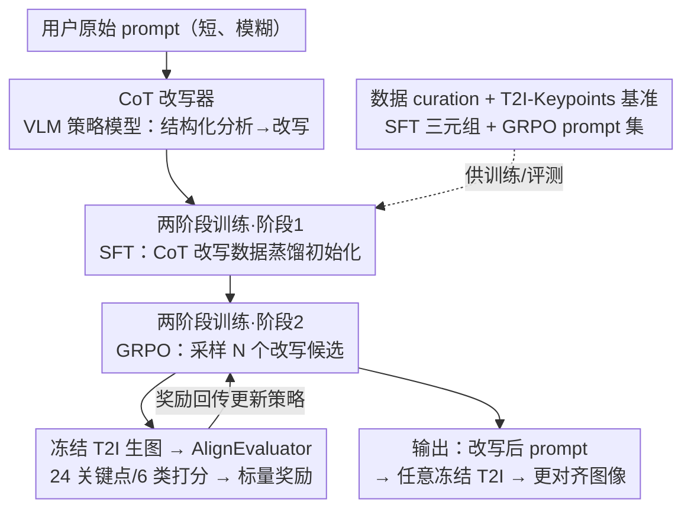

# PromptEnhancer: Taming Your Rewriter for Text-to-Image Generation via Fine-Grained Reward

**会议**: CVPR 2026  
**论文**: [CVF Open Access](https://openaccess.thecvf.com/content/CVPR2026/html/Wang_PromptEnhancer_Taming_Your_Rewriter_for_Text-to-Image_Generation_via_Fine-Grained_Reward_CVPR_2026_paper.html)  
**代码**: 项目页 https://hunyuanpromptenhancer.github.io  
**领域**: 图像生成 / 文生图 / 强化学习对齐  
**关键词**: 文生图, prompt 改写, 细粒度奖励, GRPO, 思维链

## 一句话总结
针对文生图模型"听不懂复杂 prompt"（属性绑定、否定、组合推理常出错）的问题，提出 PromptEnhancer——一个模型无关、不改 T2I 权重的 prompt 改写框架：先用思维链（CoT）改写数据做 SFT 初始化改写器，再用一个按 24 个细粒度关键点打分的专用奖励模型 AlignEvaluator 做 GRPO 强化对齐，让改写器把短而模糊的用户 prompt 重写成结构化、可被任意冻结 T2I 准确执行的详细描述，平均图文对齐准确率提升 5.1 个点。

## 研究背景与动机
**领域现状**：大规模 T2I 扩散模型已能从自然语言生成高保真图像，但输出严重依赖 prompt 质量。实践中用户 prompt 往往短、含糊，导致模型漏掉属性绑定、否定、空间关系等关键约束。prompt 改写（把用户 prompt 自动转写成更明确的版本）被视为解法之一。

**现有痛点**：现有改写方法缺乏通用性。一类与特定生成器深度耦合（联合训练 / 模型特定适配），换个 T2I 就得重训改写器；另一类依赖粗粒度奖励信号（CLIP score、通用人类偏好模型），对"细粒度 prompt 跟随失败"几乎没有纠正力——CLIP 主要做粗语义匹配、对细节不敏感、还有 token 长度限制。

**核心矛盾**：要让改写器既**通用**（即插任意冻结 T2I）又能**精确纠错**（对属性绑定/否定/计数等具体失败模式有针对性），就需要一个既懂 T2I 失败模式、又能给出可解释细粒度反馈的训练信号——而通用 LLM（如 GPT-4）缺乏对 T2I 特定失败模式的专门洞察，粗粒度奖励又不够细。

**本文目标**：训一个解耦于图像生成、模型无关的改写器，把欠定 prompt 重写成结构化详细描述，并用一个 T2I 专用的细粒度奖励把改写策略对齐到"下游图文对齐"上。

**切入角度**：把 prompt 精化从图像生成里彻底**解耦**——改写器只管改 prompt、T2I 全程冻结；改写过程用思维链（CoT）显式做语义分析、消歧、把隐含约束显式化；奖励则按一套 T2I 失败模式分类法（24 关键点）逐点打分。

**核心 idea**：用"CoT 改写器 + 细粒度奖励模型 AlignEvaluator + 两阶段（SFT→GRPO）训练"，让改写器学到的不是"写得更长"，而是"写得更忠于用户意图、更易被 T2I 执行"。

## 方法详解

### 整体框架
PromptEnhancer 由三个部件构成：**CoT 改写器**（基于大型 VLM 的策略模型，把原始 prompt 改写成富信息 prompt）、**AlignEvaluator**（按 24 个细粒度关键点给"图像–prompt"对打标量奖励的奖励模型）、**冻结的现成 T2I 模型**（只生图、权重不动）。改写器用两阶段训练：阶段 1 用从强力闭源模型蒸馏来的 CoT 改写数据做 SFT，获得结构化分析与改写能力；阶段 2 用 GRPO 做策略对齐——改写器对每个 prompt 采样 $N$ 个改写候选，各自喂给冻结 T2I 生图，AlignEvaluator 逐点打分给出标量奖励，回传更新改写策略。整套训练数据由一条多阶段 curation 流水线产出，并配套发布细粒度评测基准 T2I-Keypoints-Align。

### 关键设计

**1. CoT 改写器：把"改 prompt"做成显式的结构化推理**

针对"用户 prompt 短而模糊、T2I 漏约束"的痛点，改写器（建立在大型 VLM 上）不直接吐长 prompt，而是走思维链流程：先识别关键语义元素、消解歧义、把隐含约束（物体属性、空间布局、交互关系）显式化，再产出富信息的改写 prompt。这种"先分析关键点、再改写"的结构让改写不是无脑堆砌形容词，而是有针对性地补全易丢失的约束——论文示例中，原 prompt 只说"a cute Tom"会生成含糊的猫，改写后显式指定角色身份（Tom and Jerry 里的汤姆猫）、动作、服装、画风，图像才对得上意图。

**2. 两阶段训练：SFT 打底 + GRPO 对齐下游生成**

只做 SFT 不够——SFT 后改写器能产出像样的长 prompt，但这些 prompt 并没有针对"下游图文对齐"显式优化。于是分两步：阶段 1 SFT 用蒸馏数据（从 Gemini-2.5-Pro 英文、DeepSeek-V3 中文教师模型产出的"用户 prompt→CoT→改写 prompt"三元组）做监督初始化，标准语言建模损失，目的只是给后续策略对齐一个强起点；阶段 2 GRPO 把改写策略对齐到 AlignEvaluator 捕捉的细粒度偏好上：对每个 prompt $p$ 采样 $N$ 个候选 $\{p'_1,\dots,p'_N\}$，各自经冻结 T2I 生图 $x_i$，奖励 $r_i=\text{AlignEvaluator}(x_i,p'_i)$，再按 GRPO 目标更新策略。消融显示（Table 5）：基线 81.0% → SFT(含 CoT) 85.29% → GRPO 88.15%，说明 CoT 监督的收益要和基于奖励的策略优化结合才能充分兑现。

**3. AlignEvaluator：按 24 个关键点的 T2I 失败模式分类法给细粒度奖励**

这是全框架的奖励核心，针对"CLIP 等粗粒度奖励纠不了细粒度失败"的痛点。AlignEvaluator 不给单一整体相似度，而是把图文对齐拆成 **6 大类、24 个细粒度关键点**：语言/语法理解（如否定、属性一致性、代词指代）、视觉属性（计数、尺寸、材质、表情、画风）、动作与交互（全身动作、手部动作、动物动作、接触/非接触交互、状态）、关系与组合结构（比较、组合、包含、相似、跨实体绑定、实体布局）、世界知识与推理（知识应用、反事实）、图内文字与排版（文字渲染、文字布局）。它由 Qwen2.5-VL-32B-Instruct 在 6,687 条标注样本上微调而来（关键点先由 Gemini-2.5-Pro 自动标、再人工精修），对一张图按 24 个关键点各打分、取平均作为最终标量奖励。这套结构化奖励比 CLIP 对计数、否定、组合等具体失败模式敏感得多，也避免了"多奖励模型加权"带来的不稳定优化。

**4. 数据 curation 流水线与 T2I-Keypoints 基准：规模化造高质量训练/评测数据**

改写器要学好需要大量高质量"用户 prompt→CoT→改写"三元组。论文设计一条多阶段流水线：① 用户 prompt 模拟（从 326 万张图、用 captioning 模型生成 226 万条简洁自然的代理 prompt）；② Gemini-2.5-Pro 生成结构化 CoT + 多个改写候选；③ Gemini 自动过滤语义漂移/信息缺失/推理不连贯样本（226 万→611,921 三元组）；④ 人工在环——T2I 对候选改写生图、专业标注员按忠实度与画质选最优，最终得 485,119 条 SFT 三元组。GRPO 另用 5 万条与 SFT 不相交来源的 prompt（防数据泄漏、促泛化）。同时发布 T2I-Keypoints-Align 基准（6,687 条 prompt，中 55.1%/英 44.9%，每条标注多个关键点类别），中文偏简洁（均长约 100 字、关键点峰值 4）、英文偏长描述（均长约 500 字、关键点 3–6），分别考察"从简洁表达抽意图"与"解析长组合描述"两种能力。

### 损失函数 / 训练策略
SFT 阶段：基模型 Hunyuan-7B-Instruct，学习率 $1\times10^{-5}$、cosine、warmup 0.1、2 epoch、有效 batch 128、bfloat16，标准 next-token 预测损失。GRPO 阶段：从 SFT 模型起，学习率 $1\times10^{-6}$、constant、1 epoch、有效 batch 64、每个 prompt rollout $N=8$、KL 系数 0.001。T2I 基模型为 Hunyuan-Image 2.1，全程冻结以验证即插即用；AlignEvaluator 由 Qwen2.5-VL-32B-Instruct 微调得到。

## 实验关键数据

### 主实验
在公开基准 GenEval 与 T2I-CompBench 上，用 Qwen-Image 与 HY-Image 2.1 作底座 T2I，对比原始 prompt、BeautifulPrompt（BP）与 PromptEnhancer（PE）。GenEval Overall 为综合 prompt 跟随准确率（越高越好）。

| 基准 | 底座 T2I | 原始 | +BP | +PE |
|------|----------|------|-----|-----|
| GenEval Overall↑ | Qwen-Image | 0.84 | 0.85 | **0.86** |
| GenEval Overall↑ | HY-Image 2.1 | 0.80 | 0.81 | **0.82** |
| CompBench Spatial↑ | Qwen-Image | 0.3222 | 0.1945 | **0.4472** |
| CompBench Color↑ | Qwen-Image | 0.7962 | 0.5899 | **0.8442** |
| CompBench Numeracy↑ | HY-Image 2.1 | 0.6772 | 0.4943 | **0.7434** |

PE 在两个底座上都稳定抬高 GenEval；T2I-CompBench 上 PE 改善 Qwen-Image 七维中的六维（Spatial 提升尤其大），而 BP 在这些设置里反而**低于**原始 prompt——说明粗糙的"美化式"改写会损害组合保真度，细粒度奖励驱动的改写才有正收益。

### 消融实验
两阶段训练设计的逐步贡献（内部评测，Score 为整体对齐得分）：

| 配置 | Score | 说明 |
|------|-------|------|
| Baseline（不改写） | 81.0% | 原始 prompt |
| SFT w/o CoT | 86.0% | 仅 SFT、无思维链监督 |
| SFT w/ CoT | 85.29% | 仅 SFT、有思维链监督 |
| GRPO（最终） | **88.15%** | CoT-SFT 再加 GRPO |

按 24 类逐项看，PE 平均提升 5.1 个点、20 类有增益，最大增益集中在推理/组合相关类：相似关系 +17.3、反事实 +17.2、计数 +15.0、代词指代 +13.9、表情 +12.0、跨实体绑定 +11.3；在底座本就强的类（接触交互、尺寸、画风）增益小，文字布局（-0.7）、非接触交互（-0.9）有轻微下降。

### 关键发现
- 单看 SFT，含/不含 CoT 差别不大（85.29% vs 86.0%）；但 CoT 监督的价值在叠加 GRPO 后才放大到 88.15%——CoT 与奖励优化是互补而非冗余。
- 增益高度集中在"需要推理/组合"的难类（相似、反事实、计数、绑定），而非简单属性，说明改写真正补的是模型推理短板。
- BP 这类粗改写在 CompBench 上反而掉点，反证"细粒度奖励"是改写有效性的关键，而非"prompt 变长"本身。

## 亮点与洞察
- 把 prompt 改写从图像生成彻底解耦 + T2I 全冻结，做成真正即插即用的模块——一个改写器服务任意 T2I，这是相对"耦合式/per-model 重训"方案最实用的工程价值。
- 用 24 关键点/6 类的 T2I 失败模式分类法做奖励，把"图文对齐"这件模糊的事拆成可逐点验证的细粒度信号，奖励本身可解释——这套 taxonomy 即使脱离本方法也能当评测维度复用。
- "SFT 给推理形态、GRPO 给对齐方向"的分工很清晰：消融数据显示二者缺一不可，是 RLHF 式 pipeline 在生成式改写上的一个干净落地。

## 局限与展望
- 文字布局、非接触交互等少数类出现轻微负迁移（-0.7 / -0.9），说明细粒度奖励对某些维度可能过度改写，需要更精细的类别权衡。
- 自己观察：方法效果与底座 T2I 强相关（底座已强的类增益小），且整条 pipeline 依赖大量闭源教师模型（Gemini-2.5-Pro/DeepSeek-V3）蒸馏 48 万条数据，复现成本高 ⚠️；AlignEvaluator 的奖励质量上限受其训练标注（仅 6,687 条）约束。
- 改进思路：把 AlignEvaluator 的关键点权重做成可学习/任务自适应，或对负迁移类引入约束式奖励，避免"为提某些类牺牲另一些类"。

## 相关工作与启发
- **vs CLIP/通用偏好奖励的改写**：它们用粗粒度单一相似度，纠不了细粒度失败；PE 用 24 关键点细粒度奖励，对计数/否定/组合等具体失败有针对性。
- **vs 耦合式改写（与特定 T2I 联合训练）**：它们换 T2I 就要重训；PE 解耦 + T2I 冻结，跨底座即插即用。
- **vs CoT 可控生成（把推理器耦进 T2I 架构）**：它们把 CoT 绑死在特定生成器结构上；PE 把 CoT 纯用在 prompt 改写侧，做成模型无关的即插模块。

## 评分
- 新颖性: ⭐⭐⭐⭐ 24 关键点细粒度奖励 + 解耦改写组合得很好，但 SFT+GRPO、CoT 改写各自有先例
- 实验充分度: ⭐⭐⭐⭐ 多底座 + 两公开基准 + 训练消融较全，但缺奖励模型本身的消融与超参敏感性
- 写作质量: ⭐⭐⭐⭐ 框架、taxonomy、数据流水线都讲得清楚
- 价值: ⭐⭐⭐⭐⭐ 即插即用、模型无关、对齐增益实打实，工程落地价值高

<!-- RELATED:START -->

## 相关论文

- [\[CVPR 2026\] SpatialReward: Verifiable Spatial Reward Modeling for Fine-Grained Spatial Consistency in Text-to-Image Generation](spatialreward_verifiable_spatial_reward_modeling_for_fine-grained_spatial_consis.md)
- [\[CVPR 2026\] CogniEdit: Dense Gradient Flow Optimization for Fine-Grained Image Editing](cogniedit_dense_gradient_flow_optimization_for_fine-grained_image_editing.md)
- [\[CVPR 2026\] Fine-Grained GRPO for Precise Preference Alignment in Flow Models](fine-grained_grpo_for_precise_preference_alignment_in_flow_models.md)
- [\[CVPR 2026\] SkyReels-Text: Fine-Grained Font-Controllable Text Editing for Poster Design](skyreels-text_fine-grained_font-controllable_text_editing_for_poster_design.md)
- [\[CVPR 2026\] Enhancing Spatial Understanding in Image Generation via Reward Modeling](enhancing_spatial_understanding_in_image_generation_via_reward_modeling.md)

<!-- RELATED:END -->
