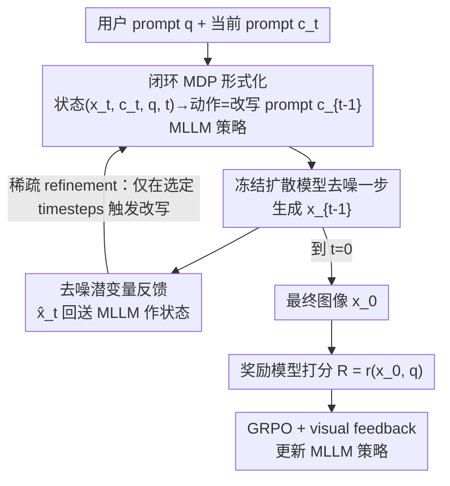

# PromptLoop: Plug-and-Play Prompt Refinement via Latent Feedback for Diffusion Model Alignment

**会议**: CVPR 2026  
**论文**: [CVF Open Access](https://openaccess.thecvf.com/content/CVPR2026/html/Lee_PromptLoop_Plug-and-Play_Prompt_Refinement_via_Latent_Feedback_for_Diffusion_Model_CVPR_2026_paper.html)  
**代码**: 待确认  
**领域**: 扩散模型 / 奖励对齐 / 强化学习  
**关键词**: 扩散模型对齐, prompt refinement, 闭环强化学习, latent feedback, MLLM 策略

## 一句话总结
PromptLoop 用一个 RL 训练的多模态大模型作策略，在扩散采样过程中**逐步**读取中间潜变量、迭代改写 prompt，让"只改 prompt 不改权重"的对齐方式获得与直接微调扩散模型权重同构的闭环结构，从而即插即用地提升奖励对齐、跨模型泛化并抑制 reward hacking，推理开销仅增加约 20%。

## 研究背景与动机
**领域现状**：扩散模型的偏好对齐有两条主流路线。一条是直接对扩散模型权重做 RL 微调（DDPO、Diffusion-DPO、ReFL 等），用 PPO/DPO 把美学、安全、人类偏好等奖励灌进模型参数；另一条是只改输入 prompt（prompt refinement），让 LLM/MLLM 把用户 prompt 改写得更好，甚至用 RL 训练这个改写器。

**现有痛点**：直接改权重的方法泛化差（在一个模型上微调好了换个 backbone 就失效）、不可组合（微调完很难再叠加别的增强）、还容易 reward hacking 和过优化。而现有的 prompt refinement 方法虽然保留了"prompt 跨模型通用、可正交组合"的好处，却几乎都是**前馈式**的：一次性生成一个改好的 prompt，然后整条采样轨迹都用它，完全没利用扩散去噪那种逐步演化的序列特性。

**核心矛盾**：扩散模型 RL 之所以有效，本质是它在一个**闭环反馈**里工作——每一步去噪都以当前潜变量 $x_t$ 为条件生成 $x_{t-1}$，参数与中间状态持续互动。而前馈式 prompt 改写是开环的：动作（改 prompt）只发生一次，看不到中间潜变量怎么变。这就是 prompt 路线与权重路线结构上的根本鸿沟。

**本文目标**：在不碰扩散模型权重的前提下，给 prompt refinement 装上和 Diffusion RL 同构的闭环反馈结构，同时保留 prompt 路线的模块化、泛化性与可组合性。

**切入角度**：既然 Diffusion RL 的精髓是"状态=中间潜变量、动作=下一步去噪"，那就把 prompt 改写也写成一个 MDP——状态里塞进中间潜变量，动作改成"改写后的 prompt"，让 MLLM 策略在每个（或部分）去噪步读潜变量、出新 prompt 注入后续去噪。

**核心 idea**：用"逐步读 latent、逐步改 prompt"的闭环策略，替代"一次改 prompt 走到底"的前馈方式，让纯 prompt 对齐在功能上逼近权重级微调。

## 方法详解

### 整体框架
PromptLoop 把扩散采样的反向过程整体看成一个 $T$ 步的马尔可夫决策过程：每一步的状态是当前潜变量、当前 prompt、用户原始 query 和时间步 $s_t=(x_t,c_t,q,t)$；动作是 MLLM 策略输出的改写 prompt $a_t=c_{t-1}$；冻结的扩散模型拿着新 prompt 把潜变量推进到 $x_{t-1}$，直到 $t=0$ 得到最终图像 $x_0$，再由奖励模型给一个终局奖励 $R=r(x_0,q)$。扩散模型和奖励模型都当黑盒，梯度不回传，只用观测到的奖励经 GRPO 更新 MLLM 策略。这样一来，"改 prompt"就和"改权重"一样处在一个带中间反馈的闭环里。

### 关键设计

**1. 闭环 MDP 形式化：把 prompt 改写写成与 Diffusion RL 同构的逐步决策**

针对"前馈式 prompt 改写看不到中间潜变量、与权重级 RL 结构脱节"这个根本痛点，PromptLoop 把整个反向扩散过程定义成 MDP：状态 $s_t=(x_t,c_t,q,t)$，动作 $a_t=c_{t-1}$ 由 MLLM 策略 $\pi_\theta(\cdot\mid s_t)$ 采样，转移则是冻结扩散模型 $x_{t-1}=f(x_t,z_t,c_{t-1},t)$。对照之下，直接训扩散权重的 Diffusion RL 状态是 $(x_t,q,t)$、动作是 $x_{t-1}$。两者唯一的差别是：Diffusion RL 让扩散模型既当策略又当环境，而 PromptLoop 把 MLLM 当策略、扩散模型当环境。这种 timestep-aware 的闭环让 prompt 级动作在功能上逼近权重级控制，却保留了即插即用、可正交组合、对 reward hacking 更鲁棒的优点——因为 prompt 是离散抽象的，天然在奖励优化和参数更新之间隔了一层缓冲。

**2. 去噪潜变量反馈：用更靠近数据流形的 $\hat{x}_t$ 当 MLLM 输入**

直接把带噪潜变量 $x_t$ 喂给 MLLM 语义太弱，MLLM 看不懂一团噪声。本文把噪声潜变量先转成去噪估计 $\hat{x}_t=\frac{1}{\sqrt{\bar\alpha_t}}\big(x_{t+1}-\sqrt{1-\bar\alpha_t}\,\hat\epsilon_\theta(x_{t+1},c_t,t)\big)$，它更接近真实图像流形，给策略提供语义上有意义的视觉反馈，MLLM 才能据此判断"现在生成偏了哪、prompt 该怎么补"。这一步是闭环里"视觉反馈"的来源，消融显示加入训练期视觉反馈能在不掉其它指标的前提下显著抬高目标奖励，并有助于缓解 reward hacking。

**3. 稀疏 refinement 策略：只在少数 timesteps 改写，把开销压到可忽略**

闭环最大的代价是 MLLM 要在每个去噪步都被调用一次，显存和时间都吃不消（扩散模型和 MLLM 得同驻显卡）。PromptLoop 把改写步限制在一个稀疏时间步集合 $R\subseteq\{1,\dots,T\}$、大小 $|R|=N_R$：策略只在这些步触发，改出的 prompt 一直沿用到下一个改写步。训练时 $R$ 随机均匀采样，推理时按等间隔确定性选取——这让策略能泛化到**任意数量**的改写步。更妙的是，作者发现推理期其实不必真给中间视觉反馈：策略一旦学会环境的转移动态，就能**事先**一次性把所有时间步的 prompt 都生成好，扩散过程无需中断，从而像前馈方法一样易集成，却保留了闭环 RL 的对齐收益。实测在默认 5 步改写下推理时间仅从 15s/img 升到 18s/img（×1.23）。

**4. GRPO 优化 + 黑盒奖励：组归一化优势稳定纯奖励驱动的训练**

由于扩散模型和奖励模型都是黑盒、无梯度可用，策略只能靠观测奖励更新。本文用 token 级 GRPO：对同一 prompt 采样 $G$ 个输出，用组内归一化优势 $A_i=\frac{r_i-\mathrm{mean}(\{r_j\})}{\mathrm{std}(\{r_j\})}$ 替代普通 PPO 的优势估计，配合 clipped surrogate 目标和 KL 惩罚，降低方差、稳住训练。每个 episode 从纯 prompt 数据集采初始 prompt，在线 on-policy 训练。这一设计让"只看终局奖励"的稀疏信号也能稳定收敛。

### 损失函数 / 训练策略
训练用 GRPO（PPO 的组归一化变体），目标为 clipped surrogate 加 KL 惩罚：$L_{\text{PPO}}(\theta)=\mathbb{E}_t[\min(\rho_t\hat{A}_t,\ \mathrm{clip}(\rho_t,1-\epsilon,1+\epsilon)\hat{A}_t)]-\lambda\,\mathrm{KL}[\pi_{\theta_{old}}\Vert\pi_\theta]$，其中重要性比 $\rho_t=\pi_\theta(a_t\mid s_t)/\pi_{\theta_{old}}(a_t\mid s_t)$，优势用组归一化奖励。MLLM 用 LoRA 微调，扩散模型与奖励模型全程冻结、黑盒访问；改写步集合 $R$ 训练随机、推理等间隔；奖励可任意切换（ImageReward、美学、安全、人类偏好或多奖励组合）。

## 实验关键数据

> 指标说明：**ImageReward** 为常用的人类偏好/prompt 对齐神经奖励；**HPSv2** 为人类偏好分数；**Aesthetics** 为美学评分模型；**MLLM Score** 为多模态大模型打的对齐分；**GenEval** 衡量对象中心的 prompt 对齐（数值越高越好）。

### 主实验
单奖励对齐（ImageReward，A100，prompt 取自 Pick-a-Pic v2）：PromptLoop 即插即用地叠加在多种 backbone 与已有对齐方法上，几乎在所有指标上都把它们再往上推。

| 训练设置 | 方法 | ImageReward | HPSv2 | Aesthetics | MLLM Score |
|----------|------|-------------|-------|------------|------------|
| SDXL & IR | SDXL（原始） | 0.7244 | 0.2805 | 6.073 | 0.735 |
| SDXL & IR | + RePrompt | 1.0148 | 0.2796 | 6.518 | 0.763 |
| SDXL & IR | **+ PromptLoop** | **1.0948** | **0.2807** | **6.583** | **0.764** |
| SDXL & IR | SDXL + Diffusion-DPO | 0.9921 | 0.2868 | 6.015 | 0.731 |
| SDXL & IR | + PromptLoop（正交叠加） | **1.2898** | 0.2862 | 6.491 | 0.763 |
| SD1.5 & IR | SD1.5 + DDPO | 0.6051 | 0.2726 | 5.562 | 0.693 |
| SD1.5 & IR | + PromptLoop（正交叠加） | **0.9842** | **0.2742** | **5.926** | **0.726** |

可以看到，PromptLoop 既能单独把原始 SDXL 的 ImageReward 从 0.72 提到 1.09，又能正交叠在 Diffusion-DPO / DDPO 之上继续抬升（如 DPO 上 0.99→1.29），印证"增强而非替代"既有对齐方法的定位。组合奖励（SDXL-turbo，RePrompt 式多奖励）下同样把 ImageReward 从 0.78 拉到 0.85、GenEval 与 HPSv2 也同步提升，且能泛化到训练时未见的扩散 backbone。

### 消融实验
单奖励（ImageReward）+ SD1.5，组件逐项叠加：

| 配置 | ImageReward | HPSv2 | MLLM Score | 说明 |
|------|-------------|-------|------------|------|
| SD1.5 | 0.0816 | 0.2678 | 0.675 | 原始基线 |
| + policy model（不训练） | -0.2315 | 0.2617 | 0.681 | 仅靠 system prompt 让 MLLM 改写，反而掉点 |
| + GRPO 训练 | 0.4344 | 0.2684 | 0.722 | 训练策略后大幅提升 |
| + 多步改写（5 步） | 0.4912 | 0.2690 | 0.724 | 单轨迹内多次 refine 继续涨 |
| + 视觉反馈 | **0.6320** | **0.2701** | **0.725** | 训练期视觉反馈显著抬目标奖励、缓解 reward hacking |

推理开销（A100×1，batch=8）：

| 改写步数 | 推理时间 (s/img) | 相对耗时 |
|----------|------------------|----------|
| 0（原始 SDXL） | 15.00 | 1.00 |
| 1 | 15.73 | 1.05 |
| 3 | 16.95 | 1.13 |
| 5 | 18.43 | 1.23 |

### 关键发现
- **没训练的 MLLM 直接改写会掉点**（-0.2315），说明价值不在"用更强模型改 prompt"，而在 GRPO 把策略训进闭环动态里——训练后立刻回到 0.43。
- **视觉反馈是同构 MDP 的关键拼图**：去掉它，增加改写步数带来的收益大幅缩水甚至消失；有它才形成镜像 Diffusion RL 的闭环结构。
- **增加改写步数不增加扩散采样步数**，却能同步抬高奖励与其它指标，说明收益来自"逐步纠偏 prompt"而非更长采样。
- **定性上能揭示 reward hacking**：ReFL 在 ImageReward 上靠类似 reward hacking 的方式刷分，但 HPS/美学等常用指标看不出退化；PromptLoop 的定性结果更稳，反衬出它对过优化的鲁棒。

## 亮点与洞察
- **"改 prompt = 改权重"的同构洞察**：把前馈 prompt 改写升级成闭环 MDP，让纯 prompt 对齐在结构上对齐 Diffusion RL，这是全文最"啊哈"的点——它解释了为什么 prompt 路线以前打不过权重路线（缺反馈闭环），并给出了补上闭环的具体配方。
- **训练要反馈、推理可省反馈**：一旦策略学会环境动态，推理期能事先把所有时间步的 prompt 一次算好、不打断采样，既拿到闭环 RL 的收益又有前馈方法的易集成性，这个"训练闭环、推理开环"的取巧很可复用。
- **即插即用 + 正交叠加**：MLLM 策略大小固定、换 backbone 不用重训，还能叠在 DPO/DDPO/NPNet 等已有对齐之上继续涨点，工程上极友好。
- **稀疏 refinement 的泛化技巧**：训练随机采改写步、推理等间隔，使同一策略泛化到任意改写步数，这种"训练随机化以获得推理灵活性"的思路可迁移到其它需要变步数推理的任务。

## 局限与展望
- **闭环带来的显存/调用成本**：训练期 MLLM 与扩散模型需同驻显存、每步调用 MLLM，作者用稀疏 refinement 缓解，但训练成本仍高于纯前馈改写。
- **奖励质量的天花板**：方法本质是在优化给定奖励，若奖励模型本身有偏（如 ImageReward 可被 hack），PromptLoop 抑制的是过优化，并不能修复奖励本身的错误；⚠️ 论文主要靠定性图说明缓解 reward hacking，缺乏量化的 hacking 度量。
- **推理免视觉反馈的前提**：事先算好全部 prompt 依赖"策略已学会环境转移动态"，对分布外 prompt 或未见 backbone，这一假设的稳健性边界文中未充分量化。
- **MLLM 改写的可控性**：prompt 被反复改写后是否偏离用户原意、语义漂移多大，缺少专门的保真度评估。

## 相关工作与启发
- **vs Diffusion RL（DDPO / Diffusion-DPO / ReFL）**：它们直接训扩散权重，泛化差、不可组合、易 reward hacking；PromptLoop 不碰权重、只改 prompt，用闭环 MDP 取得同构结构，还能正交叠在这些方法之上增强它们而非替代。
- **vs 前馈 prompt 改写（RePrompt / Qwen2.5-VL / GPT-5 改写）**：它们一次性出一个 prompt 走到底，没有中间潜变量反馈；PromptLoop 在采样过程中逐步读 latent、逐步改 prompt，把开环变闭环，对齐效果系统性更优。
- **vs 外部迭代反馈式改写**：那些方法把反馈放在完整采样之后或外部循环里；PromptLoop 把 refinement 直接嵌进单次扩散采样内部，实现细粒度自适应控制与更高效率。

## 评分
- 新颖性: ⭐⭐⭐⭐⭐ "prompt 改写=闭环 MDP，与 Diffusion RL 同构"的视角清晰且解释力强
- 实验充分度: ⭐⭐⭐⭐ 多 backbone、多奖励、正交性/泛化性/消融/开销都覆盖，但 reward hacking 缓解偏定性
- 写作质量: ⭐⭐⭐⭐ 动机与同构关系讲得透彻，图表清楚
- 价值: ⭐⭐⭐⭐ 即插即用、低开销、可正交叠加，对扩散对齐落地实用性高

<!-- RELATED:START -->

## 相关论文

- [\[CVPR 2026\] DA-VAE: Plug-in Latent Compression for Diffusion via Detail Alignment](da-vae_plug-in_latent_compression_for_diffusion_via_detail_alignment.md)
- [\[CVPR 2026\] RAISE: Requirement-Adaptive Evolutionary Refinement for Training-Free Text-to-Image Alignment](raise_requirement-adaptive_evolutionary_refinement_for_training-free_text-to-ima.md)
- [\[ICLR 2026\] RNE: plug-and-play diffusion inference-time control and energy-based training](../../ICLR2026/image_generation/rne_plug-and-play_diffusion_inference-time_control_and_energy-based_training.md)
- [\[ICCV 2025\] Trans-Adapter: A Plug-and-Play Framework for Transparent Image Inpainting](../../ICCV2025/image_generation/trans-adapter_a_plug-and-play_framework_for_transparent_image_inpainting.md)
- [\[CVPR 2026\] SpeeDiff: Scalable Pixel-Anchored End-to-End Latent Diffusion Model](speediff_scalable_pixel-anchored_end-to-end_latent_diffusion_model.md)

<!-- RELATED:END -->
