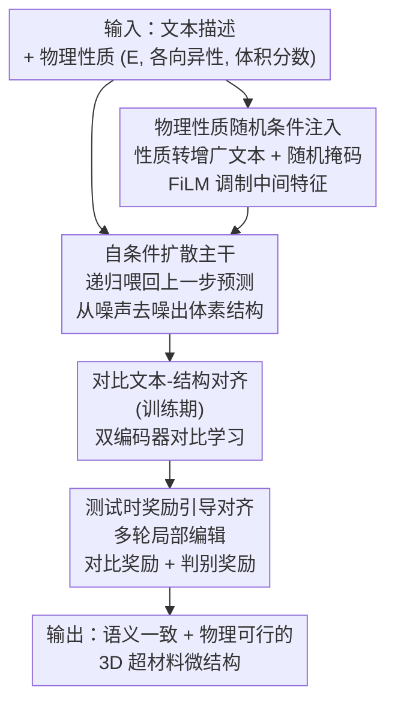

# Property-Informed Diffusion-Based Text-to-Microstructure Generation

**会议**: CVPR 2026  
**论文**: [CVF Open Access](https://openaccess.thecvf.com/content/CVPR2026/html/Dai_Property-Informed_Diffusion-Based_Text-to-Microstructure_Generation_CVPR_2026_paper.html)  
**代码**: https://github.com/hongsong-wang/PropDiff-TMG  
**领域**: 扩散模型  
**关键词**: 文本到结构生成、超材料逆向设计、自条件扩散、跨模态对齐、测试时奖励引导

## 一句话总结
PropDiff-TMG 用一个自条件 3D 扩散模型，直接从自然语言描述（叠加杨氏模量、各向异性、体积分数等物理量）生成三维超材料微结构，再靠"训练期对比对齐 + 测试期奖励引导对齐"双对齐机制保证生成结构既符合文本语义又物理可行，在 Geometries 2000 上把 FID 从 72.08 压到 70.81、CLIP 从 0.56 提到 0.69、CD 从 0.093 降到 0.040。

## 研究背景与动机
**领域现状**：超材料（metamaterial）的宏观性能主要由其内部微结构决定，而非材料本身。给定一组目标物理性质去反推微结构（inverse design，逆向设计）是材料科学的核心任务，传统做法靠相场建模、拓扑优化等数值方法，近年也开始用数据驱动的生成模型（如基于力学性质条件的扩散模型）来加速探索庞大的设计空间。

**现有痛点**：传统数值方法可解释、守物理，但严重依赖领域专家、手工设计的设计空间，以及计算昂贵的迭代求解器；现有深度学习方法虽然让数据驱动设计成为可能，但大多还是要求专家定义的条件或参数控制（即必须把目标写成结构化的数值条件），普通用户难以直接表达需求。少数文本驱动的工作（如 Txt2Microstruct-Net）要么只生成 2D 表示再后处理拼成 3D、不是端到端，要么用简单 MLP 把文本和 3D 体素对齐、对齐效果差且需要多阶段训练。

**核心矛盾**：一边是"用自然语言这种丰富、可交互的接口表达设计意图"的可及性需求，一边是"生成的微结构必须语义对得上、物理上还得真能造/真满足力学指标"的严苛约束——文本语义和物理可行性这两个目标很难同时兜住，尤其当通用语言模型对材料领域的术语本就存在语义偏移时。

**本文目标**：做一个全自动、鲁棒、可泛化的框架，输入文本（可选叠加物理性质）直接端到端生成高质量 3D 超材料微结构，同时保证语义一致与物理合理。

**切入角度**：把"定量物理性质"当作增广的文本条件，和语义描述一起喂给扩散模型，从而用统一的文本接口同时承载语义与物理约束；再在训练和测试两个阶段分别加对齐，把通用语言模型在材料域的偏移纠回来、把生成结果往奖励高的方向推。

**核心 idea**：自条件扩散负责稳定地从文本生成体素微结构，FiLM 随机注入物理性质做细粒度调制，对比对齐（训练）+ 奖励引导对齐（测试）这套双对齐把语义和物理一致性同时锁死。

## 方法详解

### 整体框架
PropDiff-TMG 把每个 3D 微结构表示为一个体素网格（voxel grid，记录空间中材料的占据情况），整条管线分三个阶段：先用**自条件扩散**从语义文本里去噪生成微结构；再用**物理性质随机条件注入**把杨氏模量等定量指标当增广文本、经 FiLM 调制进网络中间特征做细粒度控制；最后用**双对齐策略**——训练期的对比文本-结构对齐 + 测试期的奖励引导对齐——把语义和物理一致性进一步收紧。前两个阶段决定"怎么生成"，第三阶段决定"生成得对不对、好不好"。

### 关键设计

**1. 自条件扩散主干：让去噪不只看当前噪声、还看上一步的自己**

基础是 DDPM：前向过程把干净样本 $x_0$ 按 $x_t = \sqrt{\gamma_t}\, x_0 + \sqrt{1-\gamma_t}\,\epsilon$ 逐步加噪（$\epsilon \sim \mathcal{N}(0, I)$，$\gamma_t$ 从 1 平滑降到 0），反向过程用一个类 U-Net 的 3D 网络从 $x_t$ 重建 $x_0$。痛点是单纯逐步去噪重建质量和稳定性都不够。本文采用**自条件**（self-conditional）扩散：每一步把模型上一步的预测 $\hat{x}'_0$ 也作为辅助输入喂回去，让网络利用"当前噪声之外的上下文"迭代精修估计：

$$\hat{x}_0 = f(x_t,\ \hat{x}'_0,\ t,\ z^d_i)$$

其中 $\hat{x}'_0 = f(x_t, 0, t, z^d_i)$ 在训练时以 50% 概率取上一步预测、否则置零——这种随机置零是为了避免模型过度依赖先前输出、抑制误差累积，提升鲁棒性。文本条件 $z^d_i$ 由预训练文本编码器编码、叠加正弦时间嵌入后，经 classifier-free guidance 注入去噪网络。训练目标是重建损失 $L_{con} = \mathbb{E}_{\epsilon,t}\,\|\hat{x}_0 - x_0\|_2^2$，逼着文本语义和几何结构在迭代去噪中对齐。

**2. 物理性质随机条件注入：把"杨氏模量=3.59"这种数值变成模型能用的条件**

只有语义文本还不够精确控制力学性能。本文把定量物理性质——杨氏模量 $E$、各向同性指数 $I$、体积分数 $V_f$——写成描述性文本形式，和语义描述 $T$ 拼成增广条件 $\tilde{T} = \{T, E, I, V_f\}$，让扩散模型 $G$ 生成的结构 $x \sim G(\tilde{T})$ 既守语义又往指定物理目标靠。关键在**随机掩码**：训练时对每个性质 $p \in \{E, I, V_f\}$ 以概率 $r_p$ 独立保留，使模型既能从完整规格、也能从部分规格的提示里学习，从而在推理时灵活应对"给/不给物理约束"两种场景。注入方式是 **FiLM**（feature-wise linear modulation）：对中间特征张量 $F$ 和文本嵌入 $e$，做仿射变换

$$F' = \gamma \cdot F + \beta$$

其中 $\gamma, \beta$ 由 $e$ 的线性投影生成，从而按语义+物理性质对特征做逐通道的自适应调制。此外训练一个回归网络 $R$ 从生成结构反推性质 $\hat{P} = R(X)$，用预测精度量化生成结构对目标物理性质的符合度。

**3. 对比文本-结构对齐：把通用语言模型在材料域的语义偏移纠回来**

通用语言模型不懂材料术语，文本和 3D 结构的表示天然错位。训练期用两个独立编码器——文本编码器 $f_\theta$ 把描述 $d_i$ 编成 $z^d_i$、视觉编码器 $g_\phi$ 把结构 $x_i$ 编成 $z^x_i$——在共享嵌入空间里做对比学习。跨模态相似度 logits 为 $S_{i,j} = \langle z^d_i, z^x_j\rangle/\tau$（$\tau$ 为温度）。不同于硬标签，本文构造**软目标**：用两个模态各自的内部相似度矩阵 $S^{dd}_{i,j} = \langle z^d_i, z^d_j\rangle$、$S^{xx}_{i,j} = \langle z^x_i, z^x_j\rangle$ 取平均后过 softmax 得到目标分布 $T_{i,j} = \mathrm{softmax}\big(2(S^{dd}_{i,j} + S^{xx}_{i,j})/\tau\big)$。再用双向（前向 + 后向）的软标签交叉熵求对齐损失：

$$L_{align} = \frac{1}{2N}\big(L_{forward} + L_{backward}\big)$$

把"文本-结构跨模态相似度"匹配到"模态内相似度模式的平均"，等于让对齐继承每个模态自身的结构关系，而不是简单拉正负样本，从而缓解语义偏移、提升语义一致性。

**4. 测试时奖励引导对齐：不重训，靠多轮局部编辑把结构往奖励高处推**

为了在不额外训练的前提下进一步提升语义相关性和结构保真度，本文在推理阶段做**奖励引导采样**：从扩散初始样本出发，每一轮采样多个候选、对局部区域做编辑，用奖励反馈评估后保留最优编辑，再用 soft resampling 从奖励加权的最优结构池里挑下一轮输入——高分区域更容易被保留和增强，从而在维持全局一致的同时优化局部物理合理性。奖励由两部分加权归一化合成：**对比奖励** $\tilde{R}^c$ 是文本与结构嵌入（来自前述 CLIP 式对齐编码器）的余弦相似度，管语义一致；**判别奖励** $\tilde{R}^d$ 来自一个 3D 卷积判别器（含 BN + 全连接、用二元交叉熵区分真假结构），管结构合理性。最终分数

$$R_{i,k} = \tilde{R}^c_{i,k} + w \cdot \tilde{R}^d_{i,k}$$

其中 $w$ 为权重超参，两项均按 batch 内减均值除标准差归一化以适配各自尺度。这样语义和结构两个维度被分工把控、又统一进同一个奖励里。

## 实验关键数据

### 主实验
数据集：**Geometries 2000**（2000 对文本-结构）；以及作者新构建的 **GenText-Microstruct**（约 14000 训练 + 2000 评测，文本由 GPT 基于性质条件生成后人工校验）。评测用四个互补指标：分类准确率、FID、CLIP score、Chamfer Distance（CD），外加 R²。

Geometries 2000 上的对比（Table 1）：

| 方法 | Accuracy ↑ | FID ↓ | CLIP ↑ | CD ↓ | R²(Phi/E/Ani) ↑ |
|------|-----------|-------|--------|------|------------------|
| Txt2Microstruct-Net | 0.8695 | 72.08 | 0.5599 | 0.0932 | 0.773 / 0.795 / 0.771 |
| Baseline（文本→扩散直接生成） | 0.8959 | 186.54 | 0.5856 | 0.0694 | 0.849 / 0.772 / 0.886 |
| **PropDiff-TMG（ours）** | **0.9100** | **70.81** | **0.6936** | **0.0395** | **0.961 / 0.928 / 0.956** |

物理性质误差（Table 2，越低越好）：

| 方法 | 杨氏模量 ↓ | 各向异性 ↓ | 体积分数 ↓ |
|------|-----------|-----------|-----------|
| Txt2Microstruct-Net | 0.0118 | 0.0163 | 0.0348 |
| **PropDiff-TMG（ours）** | 0.0175 | **0.0106** | **0.0103** |

PropDiff-TMG 在准确率、FID、CLIP、CD、R² 上全面领先；物理误差上各向异性和体积分数显著更低，但杨氏模量误差（0.0175）反而高于 Txt2Microstruct-Net（0.0118）——⚠️ 这是该方法在杨氏模量一项上的折中，原文未深入解释。

### 消融实验
Geometries 2000 上的逐模块消融（Table 4）：

| 配置 | FID ↓ | CLIP ↑ | CD ↓ | 说明 |
|------|-------|--------|------|------|
| Full model | 70.81 | 0.6936 | 0.0395 | 完整模型 |
| w/o 物理性质条件 | 105.35 | 0.6816 | 0.0651 | 去掉性质注入，FID/CD 大幅恶化 |
| w/o 对比对齐 | 264.63 | 0.5161 | 0.0579 | 去掉训练期对比对齐，FID 暴涨到 264 |
| w/o 奖励引导对齐 | 81.68 | 0.6078 | 0.0412 | 去掉测试期奖励，CLIP 掉到 0.61 |
| w/o 判别器奖励 | 73.51 | 0.7038 | 0.0396 | 只剩对比奖励，CLIP 略高但 FID 升 |
| w/o 归一化 | 77.52 | 0.7189 | 0.0394 | 不归一化，FID 升到 77.5 |

GenText-Microstruct 上（Table 3）：相对 Baseline（84.46 FID / 0.3281 CLIP / 0.0666 CD），完整模型做到 47.74 / 0.6463 / 0.0442，且去掉物理条件或奖励对齐后每个指标都退化。

### 关键发现
- **对比文本-结构对齐贡献最大**：去掉它 FID 从 70.81 飙到 264.63、CLIP 从 0.69 跌到 0.52，说明把通用语言模型在材料域的语义偏移纠正过来是语义一致性的命门。
- **物理性质条件即使推理时不给也有用**：用性质监督训练的模型，哪怕推理不提供任何物理量，结构质量也优于不带性质训练的 baseline（CD 0.0651 → 0.0395），说明物理信息在训练期帮模型学到了更物理合理的表示。
- **判别器奖励 vs 对比奖励分工明确**：只用对比奖励 CLIP 能到 0.7038（语义最优），但加上判别器奖励后 FID 显著降到 70.81（结构更真）——前者管语义、后者管结构合理性，归一化把两者尺度对齐才能兼得。
- **有限元仿真验证**：用 ABAQUS 对生成的负泊松比（auxetic）超材料做几何非线性大变形仿真，生成结构在 x/y 方向都呈现良好的负泊松比，应力-应变趋势与参考结构相似（虽有缺陷导致的波动），从力学层面印证了物理可行性。

## 亮点与洞察
- **把物理量当增广文本 + 随机掩码**：不另起一套数值条件分支，而是把杨氏模量等写成文本拼进 prompt，再随机掩码训练，既统一了接口又让模型能应对"给/不给约束"两种场景——这个"数值即文本"的处理思路可迁移到任何需要混合语义+定量条件的生成任务。
- **训练期对齐 + 测试期对齐的双保险**：一个在表示空间纠偏（对比对齐）、一个在采样阶段免训练精修（奖励引导），互补且解耦，奖励引导那套"多轮局部编辑 + 奖励加权重采样"可直接搬到其他扩散生成里做后处理增强。
- **软目标对比损失**：用模态内相似度的平均当软标签，而非硬正负对，等于让跨模态对齐尊重各模态自身的结构关系，对小数据材料域更稳。

## 局限与展望
- **杨氏模量误差反升**：物理性质误差表里杨氏模量一项不如 Txt2Microstruct-Net，说明对该指标的控制仍有短板，作者未给出明确解释。
- **作者承认提升幅度有限**：结论里自评为 "moderate improvement"，在 Geometries 2000 上 FID（72.08→70.81）相对前作其实只是小幅领先，主要优势集中在 CLIP/CD/R²。
- **仿真有缺陷与波动**：有限元仿真中生成结构变形过程"相对扭曲"、应力-应变曲线有波动，可能源于生成结构的缺陷，物理可制造性仍待加强。
- **数据规模与表示**：体素表示分辨率受限、GenText-Microstruct 的文本由 GPT 生成再人工校验，文本质量和多样性可能影响泛化；更高分辨率/隐式表示是潜在改进方向。

## 相关工作与启发
- **vs Txt2Microstruct-Net**：前作用 VAE 生成 3D 体素 + CLIP 模块在隐空间对齐文本与体素，但简单 MLP 对齐效果差、需多阶段训练；本文用自条件扩散端到端生成、双对齐替代简单 MLP 对齐，FID/CLIP/CD 全面更好（但杨氏模量误差略逊）。
- **vs 基于力学性质条件的扩散逆向设计（如 [53] baseline）**：那类方法依赖领域先验和专家设计的数值条件；本文改用自然语言接口 + 物理量增广文本，可及性更高，且在 GenText-Microstruct 上 FID 从 84.46 降到 47.74。
- **vs 文本引导 3D 物体生成（如各类 text-to-3D）**：通用 3D 物体生成不需兜住力学/功能性约束，而超材料微结构必须物理可行；本文的差异化在于把物理性质约束显式编入文本并用判别器奖励守结构合理性。

## 评分
- 新颖性: ⭐⭐⭐⭐ 首次用自条件扩散从文本端到端生成 3D 超材料微结构，"物理量当增广文本 + 双对齐"组合新颖，但各组件（自条件扩散、FiLM、CLIP 对齐、奖励引导）多为已有技术拼装。
- 实验充分度: ⭐⭐⭐⭐ 两数据集 + 四指标 + 逐模块消融 + 有限元力学仿真，覆盖语义和物理两面；但与更多 3D 生成基线的对比偏少。
- 写作质量: ⭐⭐⭐⭐ 三阶段框架清晰、公式完整，自评诚实（承认 moderate improvement）。
- 价值: ⭐⭐⭐⭐ 把语言接口引入超材料逆向设计，降低专家门槛，对交互式材料设计有实际意义，代码开源。

<!-- RELATED:START -->

## 相关论文

- [\[CVPR 2026\] FabricGen: Microstructure-Aware Woven Fabric Generation](fabricgen_microstructure-aware_woven_fabric_generation.md)
- [\[ICML 2026\] WISE: A World Knowledge-Informed Semantic Evaluation for Text-to-Image Generation](../../ICML2026/image_generation/wise_a_world_knowledge-informed_semantic_evaluation_for_text-to-image_generation.md)
- [\[CVPR 2026\] WiseEdit: Benchmarking Cognition- and Creativity-Informed Image Editing](wiseedit_benchmarking_cognition-_and_creativity-informed_image_editing.md)
- [\[ICML 2026\] Latent Diffusion Pretraining for Crystal Property Prediction](../../ICML2026/image_generation/latent_diffusion_pretraining_for_crystal_property_prediction.md)
- [\[CVPR 2026\] Agentic Retoucher for Text-To-Image Generation](agentic_retoucher_for_texttoimage_generation.md)

<!-- RELATED:END -->
