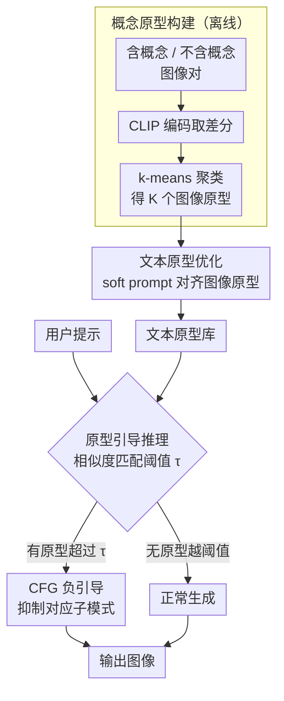

# Prototype-Guided Concept Erasure in Diffusion Models

**会议**: CVPR 2026  
**arXiv**: [2603.08271](https://arxiv.org/abs/2603.08271)  
**代码**: [https://github.com/Cocteau-23/Prototype-Guided-Concept-Erasure](https://github.com/Cocteau-23/Prototype-Guided-Concept-Erasure)  
**领域**: 图像生成  
**关键词**: 概念擦除, 扩散模型安全, NSFW内容过滤, 原型学习, 无训练推理

## 一句话总结
针对扩散模型中宽泛概念（如暴力、色情）难以彻底擦除的问题，提出基于概念原型的 training-free 擦除方法：通过聚类 CLIP 嵌入空间中的概念差分方向获取图像原型，再优化迁移到文本原型空间，推理时选择最匹配的原型作为负引导信号进行 classifier-free guidance 式的概念抑制。

## 研究背景与动机

**领域现状**：T2I 模型（如 SD）在大规模网络数据上训练，不可避免地学到不安全概念（色情、暴力、版权等）。概念擦除方法分为 training-based（修改模型权重如 ESD、RECE、MACE）和 training-free（推理时干预如 SLD、Safree、AdaVD）。

**现有痛点**：现有方法对**窄概念**（如皮卡丘、马斯克这种具体实体）效果很好，但对**宽泛概念**（如"暴力"、"色情"）效果退化。原因是宽泛概念包含多样的视觉形态——暴力可以是流血、枪战、暴动，用单一方向或统一信号无法覆盖所有模式。

**核心矛盾**：先验方法隐式假设宽概念和窄概念具有同等的分布特性，用单一或统一的信号来建模。这在低方差的窄概念上可行，但在高方差、多面相的宽概念上失效——只能抑制最显著的实例化形式（如暴力中的流血），而遗漏其他语义模式（枪战、暴动）。

**切入角度**：受观察启发——生成模型将语义组织为结构化的低维邻域而非随机分散，因此目标概念在嵌入空间中的实例应聚集在若干紧致区域。通过聚类得到的中心可以作为"概念原型"，每个捕捉概念的一个显著模式。

**核心idea**：对比含/不含目标概念的生成图像的 CLIP 嵌入差异，聚类得到图像空间的概念原型，再通过余弦相似度优化迁移到文本空间，推理时选择最匹配的原型作为 negative guidance，精准抑制概念的各个子模式。

## 方法详解

### 整体框架
这篇论文要解决的是宽泛概念（暴力、色情这类含多种视觉形态的概念）难以彻底擦除的问题。它的思路是：先在离线阶段给目标概念造一批"含概念 / 不含概念"的图像对，在 CLIP 空间里把"概念本身"的方向抠出来并聚成若干原型；再把这些活在图像空间的原型翻译成可以直接喂给扩散模型的文本原型；推理时按用户提示挑出最贴合的那个原型当负引导，把对应的概念子模式压下去。整个过程不动扩散模型的权重，属 training-free 干预。

### 关键设计

**1. 概念原型构建：用聚类把"宽概念"拆成多个子模式**

宽概念的麻烦在于方差大——"暴力"可以是流血、枪战、暴动，单一方向只能压住最显著的那一种（流血），其余形态会漏网。这里的做法是对 $N$ 个提示词，每个生成 $M$ 张含概念图像和 $M$ 张不含概念图像，CLIP 编码后取所有配对的差分 $\mathcal{Z}_{\text{diff}} = \{z_{i,j} - z_{i,k}^{-}\}$。关键在概念对比提示词只删掉概念关键词、保留其余描述（比如去掉 "nude" 但保留环境、光照），这样差分方向就只指向概念本身而非上下文差异。再对这些差分向量做 k-means，得到 $K$ 个图像原型 $\{p_{\mathbf{I}}^{(k)}\}_{k=1}^K$，每个原型对应概念的一个语义子模式。$K$ 按概念方差设定：宽概念（暴力等）用 $K=16$，风格类窄概念用 $K=1$，IP 用 $K=2$。

**2. 文本原型优化：把图像方向翻译成扩散模型能用的负条件**

图像原型活在 CLIP 图像空间，没法直接当扩散模型的条件，所以要做一次跨模态迁移。每个文本原型 $p_{\mathbf{T}}^{(k)} \in \mathbb{R}^{L \times d}$ 是一段可学习的 soft prompt，冻结 CLIP 文本编码器、只更新这段 prompt，让它编码后的 EoT token 嵌入与对应图像原型的余弦相似度最大：

$$\max_{p_{\mathbf{T}}^{(k)}} \frac{\langle p_{\mathbf{I}}^{(k)}, \mathcal{E}(p_{\mathbf{T}}^{(k)}) \rangle}{\|p_{\mathbf{I}}^{(k)}\| \, \|\mathcal{E}(p_{\mathbf{T}}^{(k)})\|}$$

优化 2000 步、学习率 5e-2。借 CLIP 本就对齐的图文空间，只调这一段 prompt 就完成了图像原型到文本原型的迁移，全程不碰扩散模型。

**3. 原型引导推理：按提示自适应挑原型做负引导**

推理时先算用户提示嵌入与各原型的余弦相似度，取相似度最高且超过阈值 $\tau$ 的那个原型 $p_{\mathbf{T}}^{(k^*)}$，把它塞进 classifier-free guidance 当负引导项：

$$\tilde{\epsilon}_{\theta}(z_t, c) = \epsilon_{\theta}(z_t) + \alpha(\epsilon_{\theta}(z_t, c) - \epsilon_{\theta}(z_t)) - \beta(\epsilon_{\theta}(z_t, p_{\mathbf{T}}^{(k^*)}) - \epsilon_{\theta}(z_t))$$

阈值 $\tau$ 是这里的关键开关：当提示与概念无关时没有原型能越过阈值，于是不施加任何负引导，正常生成的质量不受影响；多概念擦除则把所有概念的原型并进一个统一原型库，推理时一起参与匹配。

### 一个例子：擦"暴力"
离线阶段给"暴力"造 400 对提示词、每对生成 4 张图，CLIP 差分后 k-means 聚成 16 个原型，分别对应流血、枪战、暴动等子模式，再各优化出一段文本原型。推理时来一句 "a street protest turning violent"，它与"暴动"原型的相似度最高且超过 $\tau$，于是只用这个原型做负引导、把暴动画面压掉，而其余 15 个原型因相似度不足不参与；换成 "a sunny street"，所有原型相似度都低于 $\tau$，一个都不触发，画质照常。这样同一套原型库就能按提示精准命中概念的不同子模式，而不是用一个统一信号一刀切。

### 训练策略
- 基础模型 SD v1.4，DDIM 30 步采样，guidance scale 7.5
- 数据准备：恶意概念每概念 400 对提示词，艺术风格 / IP 每概念 100 对，每对生成 4 张图（固定 seed）
- 文本原型优化 2000 步，完全 training-free（不修改扩散模型权重）

## 实验关键数据

### 主实验（I2P 数据集，Q16 检测率↓）

| 方法 | 类型 | 整体↓ | 色情↓ | 暴力↓ | 自伤↓ |
|------|------|-------|-------|-------|-------|
| SD v1.4 | 基线 | 35.6% | 54.5% | 40.1% | 35.5% |
| ESD | Training | 12.2% | 16.4% | 6.3% | 11.1% |
| TRCE | Training | 5.7% | 1.7% | 6.2% | 5.0% |
| Safree | Free | 8.8% | 5.3% | 9.6% | 7.2% |
| **Ours** | **Free** | **5.2%** | **1.7%** | **5.8%** | **3.8%** |

### 对抗攻击鲁棒性

| 方法 | Ring-a-Bell↓ | P4D↓ | UnDiff↓ | FID↓ |
|------|-------------|------|---------|------|
| SD v1.4 | 71.3% | 91.3% | 63.8% | - |
| TRCE | 6.7% | 2.0% | 7.7% | 48.7 |
| Safree | 22.4% | 38.0% | 28.2% | 36.3 |
| **Ours** | **6.7%** | **14.5%** | **13.3%** | 45.1 |

### 关键发现
- 在 I2P 整体检测率上达到 **5.2%**，是所有方法中最低的（vs TRCE 5.7%），且在所有 7 个子类别上表现一致稳定
- 对抗攻击场景下虽非专门设计但仍有竞争力——Ring-a-Bell 上与 TRCE 相当（6.7%），P4D 上不及 TRCE（14.5% vs 2.0%）但远优于 Safree
- **跨模型泛化性强**：在 SDXL 和 SD 3.5 上均优于 Safree，SD3.5 的 P4D 指标从 Safree 的 0.27 降至 0.09
- FID 略高于 Safree（45.1 vs 36.3），说明多原型负引导可能轻微影响生成多样性

## 亮点与洞察
- **多原型建模宽概念**的思路是核心创新——不盲目用单一方向表示宽泛概念，而是通过 k-means 在嵌入差分空间中捕捉概念的各个语义子模式
- **概念对比提示词设计**非常精巧——通过仅删除目标概念词而保留其他描述，确保差分方向纯粹反映概念差异而非上下文差异
- **跨模态迁移**（图像原型→文本原型）利用 CLIP 的对齐空间，只需优化 soft prompt 而无需修改扩散模型
- 完全 training-free + 多模型兼容（SD1.4/SDXL/SD3.5），部署友好

## 局限与展望
- **对抗鲁棒性不是专门优化目标**：P4D 攻击下明显弱于 TRCE，可结合对抗训练增强
- 原型数 $K$ 需要手动设定（宽概念16、窄概念1），缺乏自动确定机制
- 阈值 $\tau$ 的选择影响误擦除率和漏擦除率的 trade-off，需要仔细调参
- 概念对比提示词的生成依赖 LLM，对于某些模糊概念边界可能不够精确
- FID 略高表明负引导可能部分影响图像多样性和质量

## 相关工作与启发
- **vs Safree**：Safree 在文本嵌入空间投影来远离有毒概念子空间，本文用多原型负引导——后者在宽概念上更全面（整体 5.2% vs 8.8%）
- **vs TRCE**：TRCE 是 training-based 修改交叉注意力权重，本文是 training-free，前者在对抗攻击（P4D）上更强但需要修改模型
- **vs AdaVD**：AdaVD 做交叉注意力的值分解投影，本文做 CFG 层面的负引导——思路正交，有潜力互补组合

## 评分
- 新颖性: ⭐⭐⭐⭐ 多原型建模宽概念的思路新颖且直觉合理，概念对比差分+聚类的流程设计巧妙
- 实验充分度: ⭐⭐⭐⭐ I2P + 3个对抗攻击基准 + 跨模型泛化，覆盖全面
- 写作质量: ⭐⭐⭐⭐ 动机阐述清晰，Fig.2 的宽概念多模态示例很有说服力
- 价值: ⭐⭐⭐⭐ 对 T2I 安全领域有实际价值，training-free 特性利于部署

<!-- RELATED:START -->

## 相关论文

- [\[CVPR 2026\] GrOCE: Graph-Guided Online Concept Erasure for Text-to-Image Diffusion Models](groce_graph-guided_online_concept_erasure_for_text-to-image_diffusion_models.md)
- [\[CVPR 2026\] Neighbor-Aware Localized Concept Erasure in Text-to-Image Diffusion Models](neighbor-aware_localized_concept_erasure_in_text-to-image_diffusion_models.md)
- [\[AAAI 2026\] Mass Concept Erasure in Diffusion Models with Concept Hierarchy](../../AAAI2026/image_generation/mass_concept_erasure_in_diffusion_models_with_concept_hierarchy.md)
- [\[ICML 2026\] Orthogonal Concept Erasure for Diffusion Models](../../ICML2026/image_generation/orthogonal_concept_erasure_for_diffusion_models.md)
- [\[CVPR 2026\] EMMA: Concept Erasure Benchmark with Comprehensive Semantic Metrics and Diverse Categories](emma_concept_erasure_benchmark_with_comprehensive_semantic_metrics_and_diverse_c.md)

<!-- RELATED:END -->
