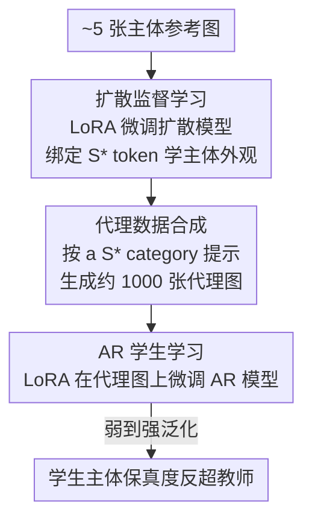

# Proxy-Tuning: Tailoring Multimodal Autoregressive Models for Subject-Driven Image Generation

**会议**: CVPR 2026  
**论文**: [CVF Open Access](https://openaccess.thecvf.com/content/CVPR2026/html/Wu_Proxy-Tuning_Tailoring_Multimodal_Autoregressive_Models_for_Subject-Driven_Image_Generation_CVPR_2026_paper.html)  
**代码**: 待确认  
**领域**: 图像生成 / 多模态自回归 / 主体定制  
**关键词**: 主体驱动生成, 自回归模型, 弱到强泛化, 代理调优, DreamBooth

## 一句话总结
针对多模态自回归（AR）模型直接做 DreamBooth 式主体微调会"学不像 + 丢语义"的问题，本文提出 Proxy-Tuning：先用一个较弱的扩散模型在少量参考图上学会主体，再让它批量合成代理数据来监督 AR 学生模型，结果学生在主体保真度上反超教师，揭示了图像生成中的"弱到强泛化"现象。

## 研究背景与动机
**领域现状**：主体驱动生成（subject-driven generation）要求模型从少量参考图里学会某个特定主体（某只狗、某个背包）的外观，再按文本提示把它放进新场景。这个方向被扩散模型主导，DreamBooth 把主体绑定到一个特殊 token（如 `S*`）并加先验保持损失，已经做得相当成熟；与此同时，基于 next-token 预测的多模态 AR 模型（LlamaGen、Lumina-mGPT、Emu3 等）在通用文生图上已经能和大扩散模型掰手腕。

**现有痛点**：但把 AR 模型直接套到主体驱动任务上几乎全军覆没。作者试了两条常规路线——LoRA 参数高效微调与端到端全量微调：LoRA 能保住语义一致性、却抓不住主体的具体外观；端到端则两头不讨好，既学不像主体，又把 AR 原有的语义跟随能力严重破坏。Table 1 里 Lumina-mGPT 端到端的 CLIP-I 只有 0.6974、DINO 0.5338，远低于扩散基线。

**核心矛盾**：根因在 AR 模型的自回归本性。它通过序列化 token 预测逐个生成，每个 token 高度依赖前文，因此在仅有几张图的少样本微调下对参数扰动极其敏感——token 预测上的微小偏差会沿生成序列传播放大。相比之下扩散模型的并行去噪过程对少样本微调更鲁棒，所以同样的 DreamBooth 范式在扩散上没事、搬到 AR 上就崩。

**本文目标**：在不破坏 AR 模型原有语义理解能力的前提下，让它学会特定主体的外观并能与文本无缝组合。

**切入角度**：既然 AR 直接喂少量真图会崩，那就不让它直接面对"少样本"——换一个对少样本更稳的扩散模型先把主体学下来，再由它生成大量代理图来"喂饱"AR。

**核心 idea**：用一个较弱的扩散模型当"代理教师"，合成代理训练数据来监督更强的 AR 学生——即 Proxy-Tuning，并由此发现 AR 学生会反超教师的弱到强泛化现象。

## 方法详解

### 整体框架
Proxy-Tuning 把"主体驱动 AR 微调"拆成一条三阶段串行流水线：先让扩散模型在 5 张左右参考图上用 LoRA 学会主体（扩散监督学习），再用它按 `a S* {category}` 模板批量生成约 1000 张代理图（代理数据合成），最后用这批代理图通过 LoRA 微调 AR 学生（AR 学生学习）。关键在于：AR 模型从头到尾不直接接触那 5 张稀缺真图，它面对的是一个"被扩散教师放大成上千张、且语义多样"的代理数据分布，从而绕开了 AR 对少样本的脆弱性。整条流水线串完后，作者观察到一个反直觉的结果——学生在主体保真度（CLIP-I / DINO）上稳定超过它的扩散教师。

### 关键设计

**1. 扩散监督学习：用对少样本更稳的扩散模型当"代理教师"**

直接拿少量真图微调 AR 会崩，但同样的少样本对扩散模型不构成问题，所以第一步把"少样本学习"这件难事外包给扩散模型。具体做法是用 LoRA 在约 5 张参考图上微调一个扩散模型（SDXL / SD3 / SD3.5 / FLUX 都可），沿用 DreamBooth 范式把主体绑定到预定义 token `S*`。这一步的目的不是产出最终图，而是得到一个"会画这个主体、且能被文本控制"的教师，为下一步的数据合成提供来源。作者特意选了一系列架构和参数量都不同的扩散模型当教师（U-Net 的 SDXL、DiT 的 SD3/SD3.5/FLUX，2B 到 12B），以验证方法对教师选择不敏感。

**2. 代理数据合成：把稀缺真图扩成上千张语义多样的代理数据**

AR 对少样本脆弱的本质是"训练样本太少、token 预测的微小偏差会被序列放大"，那就用教师把样本量做大。第二步用微调好的扩散教师按 `a S* {category}` 的提示批量生成一个多样化数据集（约 1000 张），作为 AR 的代理训练数据。这一步是和"传统数据增广"区别开来的关键：消融显示几何增广（翻转、$\pm 5°$ 旋转、0.9–1.0 裁剪）只能提供表层变换、容易过拟合且语义可编辑性差，而扩散教师合成的代理图带来的是丰富的、上下文层面的语义变化，让 AR 能调动自己预训练里的语义关系知识去学，而不是只学到表面纹理。消融还表明方法对代理图数量相当鲁棒，较少的合成图也能维持效果。

**3. AR 学生学习与弱到强泛化：学生为何能反超教师**

第三步用 LoRA 在代理数据上微调 AR 学生，让它既学到主体外观又保住广义语义能力。真正反直觉的是结果——学生在 CLIP-I / DINO 上稳定超过教师（如 SDXL 教师 CLIP-I 0.8002，Lumina-mGPT 学生 Proxy-Tuning 后 0.8074、DINO 从教师 0.7272 升到 0.7834），作者称之为弱到强泛化，并首次在多模态 AR 图像生成里证实它。机制解释是：AR 把主体图编码成离散 token 分布，可分成两部分——表征主体局部外观的"主分布"，与扩散教师引入的偏置 token 构成的"次分布"；next-token 预测训练让 AR 倾向于拟合主分布、过滤掉次分布的偏置 token，于是学生学到比教师更干净的主体表征。作者还做了反向对照：把 Proxy-Tuning 用在扩散学生上，结果学生反而比教师更差（Table 4 中 SDXL 学生 CLIP-I 掉 0.61%、DINO 掉 3.82%），说明弱到强泛化是 AR 特有、源于其离散 token 化与序列拟合的过滤性质，而非"代理数据"本身带来的普适红利。

### 损失函数 / 训练策略
全程统一用 LoRA 参数高效微调而非全量微调（除非特别说明）。扩散教师覆盖 SDXL（U-Net, 2.6B）、SD3 Medium（DiT, 2B）、SD3.5 Large（DiT, 8B）、FLUX.1[dev]（DiT, 12B）；AR 学生用 LlamaGen-XL（0.775B）与 Lumina-mGPT 的 FP-SFT@768（7B）。数据沿用 DreamBooth 数据集的 9 个主体（4 活体 + 5 静物），每主体 25 个提示、每提示 4 张图，共 225 张测试图。

## 实验关键数据

### 主实验
主体保真度看 CLIP-I（CLIP 图像嵌入余弦相似度）和 DINO（ViT-S/16 嵌入相似度），提示遵循度看 CLIP-T（生成图 CLIP 图像嵌入 vs 文本嵌入相似度）。

| 教师 | 模型 | CLIP-I | CLIP-T | DINO |
|------|------|--------|--------|------|
| — | LlamaGen（直接 LoRA 微调） | 0.6752 | 0.2956 | 0.5088 |
| SDXL | SDXL 教师 | 0.8002 | 0.3225 | 0.7272 |
| SDXL | Lumina-mGPT w/ Proxy-Tuning | 0.8074 | 0.3118 | 0.7834 |
| SDXL | LlamaGen w/ Proxy-Tuning | 0.8152 | 0.2772 | 0.7436 |
| SD3 | Lumina-mGPT w/ Proxy-Tuning | 0.7977 | 0.3167 | 0.7551 |

直接微调的 AR 学生（CLIP-I 0.67、DINO 0.45–0.51）几乎学不到主体；经过 Proxy-Tuning 后 CLIP-I / DINO 普遍超过对应扩散教师，且这一反超在 SDXL/SD3/SD3.5/FLUX 四种教师下都成立（CLIP-T 略有下降，但用户研究表明这是 CLIP-T 指标的偏差，详见下文）。

### 消融实验
| 配置 | 主要现象 | 说明 |
|------|---------|------|
| 直接 LoRA 微调 AR | CLIP-I≈0.67, DINO≈0.45 | 学不到主体外观，但语义尚可 |
| 直接端到端微调 AR | CLIP-I 0.6974, DINO 0.5338 | 主体与语义双崩，语义跟随退化严重 |
| Proxy-Tuning（完整） | CLIP-I 0.80+，反超教师 | 主体保真 + 语义可编辑性都好 |
| Proxy-Tuning 用于扩散学生 | CLIP-I/DINO 普遍↓ | 弱到强泛化不出现，确认 AR 特有 |
| 几何数据增广替代代理图 | 过拟合、可编辑性差 | 表层变换无法替代语义多样的代理数据 |
| 代理图数量缩减 | 性能稳定 | 对合成图数量鲁棒 |

多主体实验（Table 5）显示：单个 AR 学生能一次联合学会多个主体，CLIP-I/DINO 与各自单主体专门训练的扩散教师持平，而扩散学生联合学多主体会出现严重的主体混淆和质量退化。

### 关键发现
- 弱到强泛化是 AR 模型独有：同样的 Proxy-Tuning 搬到扩散学生上，学生反而比教师差（Table 4），证明红利来自 AR 的离散 token 拟合/过滤机制而非代理数据本身。
- CLIP-T 会低估 Proxy-Tuning 的提示遵循度：用户研究（Table 6）里 Proxy-Tuned AR 在提示保真度上拿到 4.52，远高于直接微调 AR 的 2.98，也高于扩散方法，说明自动指标 CLIP-T 与人类判断脱节。
- AR 在多主体组合上扩展性更好：单模型联合学多主体即可保持各主体区分度，而扩散需要为每个主体单独实例。

## 亮点与洞察
- 把"AR 学不了少样本"这个看似硬伤的问题，转化为"换一个对少样本更稳的模型当数据放大器"，思路干净且即插即用，不改 AR 骨干。
- 最"啊哈"的点是弱到强泛化：学生反超教师，并用"主分布 vs 偏置次分布 + AR 倾向拟合主分布"给出了可解释的机制，而非只报一个 SOTA 数字。
- 反向对照（扩散学生不出现该现象）把"是代理数据的功劳还是 AR 架构的功劳"这个混淆变量干净地切开，方法学上很扎实。
- "弱模型监督强模型、强模型反超"这套范式可迁移到其他 AR 多模态任务（视频、可控生成），是比单一任务结果更有价值的发现。

## 局限与展望
- 自动指标失真：CLIP-T 系统性低估提示遵循度，作者只能靠用户研究纠偏，说明缺乏可靠的 AR 主体生成评测指标。
- 三阶段流水线引入了额外的扩散教师训练与上千张代理图合成成本，比单模型微调更重。
- 机制解释（主分布/次分布、偏置 token 过滤）主要是定性论述，缺少对 token 分布层面的定量证据，⚠️ 这一解释以原文为准。
- 评测仍限于 DreamBooth 的 9 个主体、相对小规模，复杂场景/多主体的系统性边界尚未充分刻画。

## 相关工作与启发
- **vs DreamBooth/DisenBooth/NeTI（调优型扩散主体生成）**: 它们在扩散模型上直接为每个主体微调；本文指出同范式搬到 AR 上会崩，改用扩散当教师、AR 当学生，区别在于"不让 AR 直接吃少样本"，并意外获得反超教师的效果。
- **vs IP-Adapter/PhotoMaker/ELITE（免调优型）**: 它们靠图像编码器 + 跨注意力注入实现零样本主体注入；本文是调优型路线，针对的是 AR 架构特性而非免调优，互为不同技术栈。
- **vs NLP 的弱到强泛化**: 本文首次把弱到强泛化从 NLP 迁移到多模态 AR 图像生成，并给出与扩散对照的架构特异性证据。

## 评分
- 新颖性: ⭐⭐⭐⭐⭐ 首次在多模态 AR 图像生成中证实弱到强泛化，并给出架构特异性对照
- 实验充分度: ⭐⭐⭐⭐ 覆盖 4 种教师 × 2 种学生 + 多主体 + 用户研究，但评测主体规模偏小
- 写作质量: ⭐⭐⭐⭐ 动机—分析—方法链条清晰，机制解释偏定性
- 价值: ⭐⭐⭐⭐ "弱模型放大数据监督强 AR"的范式有较好迁移潜力

<!-- RELATED:START -->

## 相关论文

- [\[CVPR 2026\] FlowFixer: Towards Detail-Preserving Subject-Driven Generation](flowfixer_towards_detail-preserving_subject-driven_generation.md)
- [\[CVPR 2026\] Scone: Bridging Composition and Distinction in Subject-Driven Image Generation via Unified Understanding-Generation Modeling](scone_bridging_composition_and_distinction_in_subject-driven_image_generation_vi.md)
- [\[CVPR 2026\] Beyond Patches: Global-aware Autoregressive Model for Multimodal Few-Shot Font Generation](beyond_patches_global-aware_autoregressive_model_for_multimodal_few-shot_font_ge.md)
- [\[CVPR 2026\] Disentangling to Re-couple: Resolving the Similarity-Controllability Paradox in Subject-Driven Text-to-Image Generation](disentangling_to_re-couple_resolving_the_similarity-controllability_paradox_in_s.md)
- [\[ACL 2026\] Multimodal Large Language Models for Multi-Subject In-Context Image Generation](../../ACL2026/image_generation/multimodal_large_language_models_for_multi-subject_in-context_image_generation.md)

<!-- RELATED:END -->
