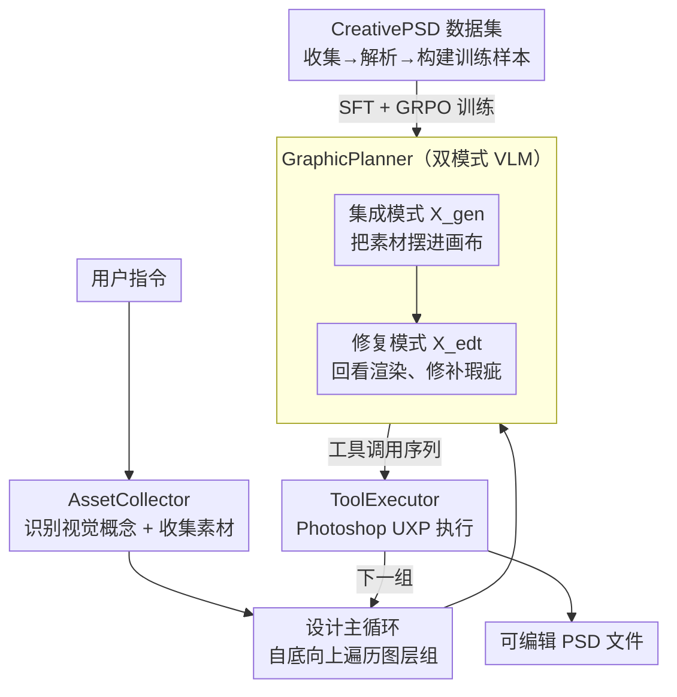

# PSDesigner: Automated Graphic Design with a Human-Like Creative Workflow

**会议**: CVPR 2026  
**arXiv**: [2603.25738](https://arxiv.org/abs/2603.25738)  
**代码**: [https://henghuiding.com/PSDesigner/](https://henghuiding.com/PSDesigner/)  
**领域**: 图像生成 / 自动设计  
**关键词**: 自动图形设计, PSD文件操作, 工具调用, 强化学习, 创意工作流

## 一句话总结

本文提出PSDesigner，一个模拟人类设计师创意工作流的自动图形设计系统，通过AssetCollector（资源收集）、GraphicPlanner（规划工具调用）和ToolExecutor（执行PSD操作）三个模块协作，利用首个PSD格式设计数据集CreativePSD训练模型学习专业设计流程，能直接生成可编辑的PSD设计文件。

## 研究背景与动机

1. **领域现状**：图形设计在电商和广告中至关重要。现有自动化方法主要分两类：(a) 文生图模型（FLUX、Glyph-Byt5等）生成设计图片；(b) MLLM驱动的方法（LaDeCo、COLE等）直接生成JSON格式的可编辑设计文件。

2. **现有痛点**：文生图方法生成的图片不可编辑且文字渲染不准确（尤其中文）；MLLM方法将图层按预定义类别（underlay/text）分组一次性预测所有属性，设计过程不直观且灵活性有限。

3. **核心矛盾**：现有方法大幅简化了专业设计流程——(a) 按类别分组不如按视觉概念分组直观；(b) 一次性预测所有图层属性缺乏渐进式设计的灵活性；(c) 只能处理简单的图层层次和有限的属性类型，距离产品级设计差距很大。

4. **本文目标** 构建一个模拟人类设计师工作流的自动设计系统，能处理复杂的PSD图层层次结构（平均48.35层），支持丰富的图层类型和60+种属性，生成可编辑的专业级PSD文件。

5. **切入角度**：观察人类设计师的工作流——先收集主题资源，然后按视觉概念分组迭代集成资源，每步集成后检修缺陷——将这一过程形式化为VLM的工具调用预测问题。

6. **核心 idea**：将图形设计建模为VLM的工具调用序列预测，通过SFT+GRPO训练使模型学会迭代式的资源集成和缺陷修复操作。

## 方法详解

### 整体框架

PSDesigner想解决的核心问题是：让模型像真人设计师那样，从一句用户指令出发，一步步搭出一个可编辑的专业PSD文件，而不是一锤子生成一张不可改的图片或一份扁平的JSON。它把整个设计过程拆成三个角色接力。先是AssetCollector读懂指令，识别出画面里该有哪些"视觉概念"（比如一张促销海报里的主体商品、标题文字、背景氛围），再为每个概念去搜集或生成对应的图片和文字素材。接着进入设计主循环：模型沿着嵌套的图层层次自底向上遍历，每遍历到一组，GraphicPlanner就先在集成模式（$\mathcal{X}_{gen}$）下把该组素材摆进画布——决定放哪、多大、什么样式，再切到修复模式（$\mathcal{X}_{edt}$）下回看这一组的渲染效果、挑出瑕疵并修补。每一步预测出的都不是像素，而是一串工具调用；最后由ToolExecutor把这些工具调用送进真正的Photoshop执行，落地成PSD文件里的图层与效果。把"画图"重新表述成"预测工具调用序列"，是这套方法能输出可编辑文件、并复用专业软件全部能力的根本原因。

### 关键设计

**1. CreativePSD数据集：先有真实的专业设计流程，模型才学得会迭代式设计**

人类设计师的工作流之所以难复刻，是因为没有数据集记录过"一个专业PSD是怎样一层层搭起来的"——现有的CGL、Crello、Design39K平均只有4-5层、2种图层类型和很有限的属性，学出来的模型自然只会摆几个扁平元素。CreativePSD用三个阶段补上这块拼图：先从互联网和付费来源收集高质量PSD文件，由专业标注员按视觉概念把图层分组；再解析这些PSD，抽出原始素材、图层元数据和中间渲染结果；最后把抽出的信息重组成两种训练模式的样本，每条样本是一个三元组 $(a, \mathcal{C}, x)$，即素材、观察、工具调用序列。其中$\mathcal{X}_{gen}$模式的样本教模型怎么把素材集成进画布，$\mathcal{X}_{edt}$模式的样本教它怎么发现并修复瑕疵。最终拿到10,454个样本，平均48.35层、5种图层类型、60+种属性，量级和真实产品设计对得上，这也是后续模型能学到渐进式设计而非一次性预测的前提。

**2. GraphicPlanner：用双模式VLM把"摆素材"和"修瑕疵"两件事分开学**

资源集成和缺陷修复看似都是预测工具调用，本质却是两种不同的活：前者从无到有决定每个元素的位置与样式，后者在已有画面上做局部订正。如果用同一套参数硬学，两个任务会互相干扰。GraphicPlanner基于Qwen2.5-VL-7B，给两种模式各注入一组模式特定的LoRA模块来隔离它们。$\mathcal{X}_{gen}$模式接收素材$a$和观察$(M, R)$——图层元数据加当前渲染，输出把素材摆进去的工具调用；$\mathcal{X}_{edt}$模式接收的观察是$(M, R, G)$，多了一份组前渲染$G$作对照，好让模型看出"这一组集成后哪里坏了"，再输出修复调用。训练分两步：先用SFT让模型学会基本的工具名到参数的映射，把大致该调哪个工具、填哪些参数学对；再用GRPO强化学习去精修参数值的精确度。之所以补这一步，是因为SFT的交叉熵只能逼近参数的大致分布，而设计对数值很敏感——差几个像素的位置或几度的角度，成品观感就塌了；GRPO的奖励直接拿生成的工具调用和ground truth逐项比对，能把这种精度顶上去。

**3. ToolExecutor：直接操作PSD而非JSON，才接得住产品级的复杂属性**

GraphicPlanner预测出的工具调用要真正变成设计文件，得有一个执行端。ToolExecutor基于Adobe UXP框架，用JavaScript API把70+种Photoshop操作封装成可调用的工具，覆盖插入图片/文字、调整图层、应用内发光与投影等效果、设置混合模式、做裁切蒙版等。关键区别在于它操作的是原生PSD而不是一份简化的JSON：JSON格式只能表达扁平的图层和有限属性，而产品级设计里那些复杂的图层嵌套、效果叠加、混合模式恰恰是靠PSD的原生能力承载的，直接接进Photoshop才不会在表达上打折扣。

### 一个完整示例

以"为一款香水做一张电商主图"为例走一遍。AssetCollector先从指令里读出三个视觉概念：香水瓶主体、品牌标题文字、背景氛围；为每个概念各收集一组素材，比如瓶身去背图、一段标题文案、一张渐变背景。进入主循环后，模型自底向上处理：先到背景这一组，GraphicPlanner在$\mathcal{X}_{gen}$模式下预测出把渐变背景铺满画布、设为底层的工具调用，再切到$\mathcal{X}_{edt}$模式回看，发现背景偏暗，补一条调亮度的修复调用。接着处理香水瓶组，集成时把瓶身居中放大，修复时给它加一层投影让它从背景里"浮"出来。最后处理标题文字组，集成时把文案放到上方，修复阶段发现文字和背景对比不够，补一个描边或内发光。每一步的工具调用都交给ToolExecutor在Photoshop里实际执行，逐组累积后，输出的就是一个图层分明、效果完整、可继续手动微调的PSD文件——这也是它能保证中文文字准确渲染、且整张图可编辑的原因。

### 损失函数 / 训练策略

SFT阶段使用标准的自回归交叉熵损失。GRPO强化学习阶段设计了专用奖励函数$r$，比较生成的工具调用与ground truth的工具名、参数名和参数值。SFT训练15,000步（$\mathcal{X}_{gen}$）/ 12,000步（$\mathcal{X}_{edt}$），batch=64, lr=2e-4, LoRA rank=32。GRPO训练6,000步，group size=8，使用4,000个PSD文件。

## 实验关键数据

### 主实验

用户意图→设计（VLM评分，满分10分）：

| 方法 | 质量 | 布局 | 相关性 | 和谐性 | 创新性 | 可编辑 |
|------|------|------|--------|--------|--------|--------|
| **PSDesigner** | 7.62 | **8.68** | 7.78 | 8.02 | **8.45** | ✓ PSD |
| CanvaGPT | **8.52** | 8.15 | 4.72 | 7.21 | 7.52 | ✓ |
| FLUX | 8.18 | 6.88 | 6.92 | 6.82 | 6.95 | ✗ |
| PosterCraft | 7.95 | 8.35 | **8.42** | **8.05** | 5.87 | ✗ |
| OpenCOLE | 5.12 | 3.66 | 5.25 | 6.68 | 6.08 | 部分 |

Crello-v5上的设计组合（VLM评分）：

| 方法 | 质量 | 布局 | 和谐性 | 创新性 |
|------|------|------|--------|--------|
| **Ours** | **7.85** | **7.43** | 6.77 | **6.94** |
| LaDeCo | 5.95 | 6.03 | **7.22** | 5.75 |
| Ground Truth | 8.13 | 9.18 | 8.90 | 7.12 |

### 消融实验

| 配置 | 质量 | 布局 | 和谐性 | 创新性 |
|------|------|------|--------|--------|
| Full model (Crello) | **7.85** | **7.43** | **6.77** | **6.94** |
| w/o $\mathcal{X}_{edt}$ | 6.05 | 5.88 | 5.90 | 6.75 |
| w/o 层信息M | 6.25 | 6.10 | 6.18 | 6.02 |
| w/o RL (GRPO) | 6.38 | 6.00 | 6.35 | 6.20 |
| Full model (PSD) | **6.28** | **6.15** | **7.02** | **6.88** |
| w/o $\mathcal{X}_{edt}$ (PSD) | 5.32 | 5.15 | 6.22 | 6.05 |

### 关键发现

- 去掉$\mathcal{X}_{edt}$模式（缺陷修复）对质量和布局影响最大（Crello上分别下降1.80和1.55分），说明迭代修复是设计质量的关键
- 去掉层信息M导致模型无法感知同组其他元素，布局和和谐性显著下降
- GRPO强化学习对精确预测工具调用的参数值至关重要，去掉后布局下降1.43分
- PSDesigner是唯一能同时生成可编辑PSD文件且准确渲染中文文字的系统

## 亮点与洞察

- **工作流拟人化设计**：将设计过程分解为"收集→集成→修复"的迭代流程，与人类设计师的思维方式高度一致，这种问题分解思路可迁移到其他需要多步骤创作的任务（如PPT制作、视频剪辑）
- **CreativePSD数据集**：首个PSD格式的设计训练数据集，平均48层、60+属性，极大地扩展了自动设计系统能处理的复杂度层级。数据构建的三阶段pipeline（收集→解析→构建训练数据）也是可复用的方法论
- **GRPO用于工具调用精炼**：将强化学习应用于提升工具调用参数的精确度是一个巧妙的设计，因为SFT只能学习到近似的参数值分布，而GRPO的奖励信号能直接优化输出与GT的匹配度

## 局限与展望

- 评估主要依赖VLM打分和用户研究，缺乏更客观的定量指标（如图层属性预测精度）
- AssetCollector依赖外部图片搜索/生成模型的质量，资源收集的失败会级联影响设计质量
- 仅支持静态设计，未涉及动态/交互式设计（如网页、动画）
- 数据集规模（10,454样本）相比LLM训练数据仍较小，可能限制泛化性
- 与Photoshop的深度耦合（UXP API）限制了向其他工具的扩展

## 相关工作与启发

- **vs LaDeCo**: LaDeCo按预定义类别分组(image/text)，一次性预测同类所有层属性，处理不了复杂层次。PSDesigner按视觉概念分组、迭代集成，在Crello上质量高出1.9分
- **vs COLE/OpenCOLE**: COLE构建多个任务特定模型管线，但输出的可编辑性有限（仅单图层+文字层）。PSDesigner统一用VLM驱动工具调用，支持完整PSD层次
- **vs T2I (FLUX/PosterCraft)**: 这些方法生成视觉质量高但不可编辑的光栅图片，且中文/复杂文字渲染经常出错

## 评分

- 新颖性: ⭐⭐⭐⭐ 首次将VLM工具调用范式应用于PSD级别的自动设计，CreativePSD数据集也是首创
- 实验充分度: ⭐⭐⭐⭐ 对比了多种方法，消融实验充分，但缺乏工具调用精度等客观指标
- 写作质量: ⭐⭐⭐⭐ 人类设计师工作流与PSDesigner的对比图非常直观，问题motivate清晰
- 价值: ⭐⭐⭐⭐ 对自动设计领域有重要推动，展示了VLM+工具调用在创意任务中的潜力

<!-- RELATED:START -->

## 相关论文

- [\[CVPR 2026\] ShowTable: Unlocking Creative Table Visualization with Collaborative Reflection and Refinement](showtable_unlocking_creative_table_visualization_with_collaborative_reflection_a.md)
- [\[CVPR 2025\] From Elements to Design: A Layered Approach for Automatic Graphic Design Composition](../../CVPR2025/image_generation/from_elements_to_design_a_layered_approach_for_automatic_graphic_design_composit.md)
- [\[ICCV 2025\] Rethinking Layered Graphic Design Generation with a Top-Down Approach](../../ICCV2025/image_generation/rethinking_layered_graphic_design_generation_with_a_top-down_approach.md)
- [\[CVPR 2026\] GIST: Towards Design Compositing](gist_towards_design_compositing.md)
- [\[CVPR 2026\] Ar2Can: An Architect and an Artist Leveraging a Canvas for Multi-Human Generation](ar2can_an_architect_and_an_artist_leveraging_a_canvas_for_multi-human_generation.md)

<!-- RELATED:END -->
