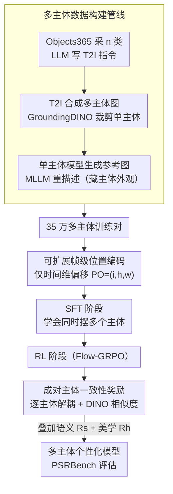

# PSR: Scaling Multi-Subject Personalized Image Generation with Pairwise Subject-Consistency Rewards

**会议**: CVPR 2026  
**arXiv**: [2512.01236](https://arxiv.org/abs/2512.01236)  
**代码**: [https://github.com/wang-shulei/PSR](https://github.com/wang-shulei/PSR)  
**领域**: 扩散模型 / 个性化生成  
**关键词**: 多主体个性化生成、主体一致性、强化学习、成对奖励、位置编码

## 一句话总结
针对多主体个性化图像生成中主体一致性差和文本遵循不足的问题，提出可扩展的多主体数据构建管线和成对主体一致性奖励（PSR），通过两阶段训练（SFT + RL）在自建的 PSRBench 上全面超越现有 SOTA。

## 研究背景与动机

1. **领域现状**：单主体个性化生成模型（如 FLUX.1 Kontext、Qwen-Image-Edit）已展现出优秀能力，能够根据参考图像在新场景中生成保持主体一致性的图像。
2. **现有痛点**：当扩展到多主体场景时，现有模型面临两大挑战：(a) 主体一致性差——生成的主体与参考主体不相似甚至丢失某些主体；(b) 文本遵从性差——无法正确绑定属性，例如提示"狗戴厨师帽、猫戴围巾"时可能生成属性互换的结果。
3. **核心矛盾**：根源在于两个方面——缺乏高质量多主体训练数据集（现有数据集如 OmniGen 的 X2I-subject-driven 主要集中于人脸，通用物体一致性低），以及缺乏精细化后训练策略（SFT 仅在全局图像级别优化，无法保证单个主体的一致性）。
4. **本文目标** (1) 如何大规模构建高质量多主体训练数据？(2) 如何在训练中实现主体级别的精细对齐？(3) 如何全面评估多主体个性化生成？
5. **切入角度**：利用已有的强大单主体个性化模型（如 FLUX.1 Kontext）来"逆向"构建多主体数据，并通过强化学习中的成对奖励机制实现主体级别的精细化对齐。
6. **核心 idea**：用单主体模型构造多主体数据 + 成对主体一致性奖励（PSR）后训练，实现可扩展的高质量多主体个性化生成。

## 方法详解

### 整体框架
多主体个性化生成的两个老大难——主体串味（生成的猫狗跟参考图不像，甚至丢一个）和属性绑错（"狗戴帽、猫戴巾"被画反）——本质都卡在没数据、没主体级监督这两件事上。PSR 的破题方式是：先借一个已经很强的单主体模型反向"造"出 35 万对多主体训练数据，再用两阶段训练把它教会——SFT 让模型先学会"同时摆几个主体"这件事，RL 阶段则用一个能逐主体打分的奖励去抠每个主体的一致性。最后配一个 PSRBench 把主体一致性、语义对齐、美学三件事一起量起来。

### 关键设计

**1. 可扩展的多主体数据构建管线：把"已解决的单主体个性化"反向造成多主体数据**

直接拿 T2I 模型硬生成多主体配对数据（UNO 的做法）一致性很差，而现成的单主体个性化模型（FLUX.1 Kontext 等）恰恰最擅长"保住一个主体"。管线就是把这个能力反过来用，分两步走。图像阶段：从 Objects365 类别池里采 $n$ 个类别，让 LLM 写一条 T2I 指令，T2I 模型合成一张含多个主体的图 $I_{out}$，再用 GroundingDINO 把每个主体检测裁剪成单图 $I_{crop}$，最后让单主体个性化模型据此生成新的参考图 $I_{ref}$——这样得到的参考图与目标图天然高一致。指令阶段：预定义属性、背景、动作、位置、复杂场景、三主体、四主体共七类任务，用 MLLM 重新描述目标图，但刻意不在文本里写出主体长什么样，逼模型必须去看参考图而不是从文字里抄捷径；再加一道"重编辑"增强属性和动作的多样性。

**2. 可扩展帧级位置编码（Scalable Frame-wise PE）：让单主体模型吃多张参考图，又不被空间布局带偏**

单主体模型本来只认一张参考图，要喂多张就得给每张的 latent token 标个位置。UNO 这类方法把偏移加在 h/w 空间维度上，副作用是悄悄注入了"第二张图在右边、第三张在下面"的空间先验，文本想指挥"猫在左、狗在右"反而使不上劲；而且图一多偏移量越堆越大，直接偏离预训练分布。PSR 的做法是只在时间（帧）维度上偏移、空间维度保持不动，即第 $i$ 张参考图取 $PO_i = (i, h, w)$。这相当于告诉模型"这是第几张图"而不告诉它"该摆在画面哪块"，位置控制重新交回给文本。训练时按 0.9/0.05/0.05 的概率分别采 2/3/4 张参考图联合训练，让同一套编码自然支持不同主体数。

**3. 成对主体一致性奖励（PSR）：在 RL 阶段把"全局像不像"拆成"每个主体各自像不像"**

SFT 只在整张图层面优化，几个主体里有一个串味它也察觉不到。RL 阶段的 PSR 奖励走的是"先分再比"：对生成图 $I_{out}$ 用开放词汇检测器按类别 $c_i$ 把每个主体抠出来 $I_{dec}^i = g(I_{out}, c_i)$，对参考图做同样的解耦得到 $I_{gt}^i$，再逐主体算 DINO 特征相似度并平均

$$R_{PSR} = \frac{1}{N}\sum_{i=1}^{N} f(I_{dec}^i, I_{gt}^i)$$

这样监督信号直接落到每个主体上，比拿整图特征比对精确得多。不过只用 PSR 会被模型钻空子——它会干脆把参考主体原样贴过来（copy-paste）骗高分，所以总奖励再叠上 MLLM 语义对齐奖励 $R_s$ 和 HPSv3 美学偏好奖励 $R_h$：

$$R = w_1 R_{PSR} + w_2 R_s + w_3 R_h$$

三者互相牵制，既保一致性又不丢文本遵循和画质。整个 RL 基于 Flow-GRPO 框架优化。

### 损失函数 / 训练策略
- 第一阶段 SFT：学习率 1e-4，LoRA rank 512，在 512×512 分辨率上训练
- 第二阶段 RL：学习率 1e-5，LoRA rank 64，GRPO 组大小 6，奖励权重 $w_1=0.4, w_2=0.4, w_3=0.2$，在原始 28 步扩散时间步上采样和训练

## 实验关键数据

### 主实验
PSRBench 包含 7 个子集，从三个维度评估：主体一致性（SC）、美学偏好（HPS）、语义对齐（SA）。

| 模型 | SC Overall | HPS Overall | SA Overall |
|------|-----------|-------------|------------|
| FLUX.1 Kontext | 0.497 | 0.870 | 0.583 |
| UNO | 0.523 | 1.009 | 0.667 |
| OmniGen2 | 0.587 | 1.020 | 0.758 |
| XVerse | 0.587 | 0.893 | 0.669 |
| Ours-SFT | 0.559 | 0.794 | 0.712 |
| **Ours (PSR)** | **0.673** | **1.124** | **0.783** |

### 消融实验
位置编码策略对比（语义对齐分数）：

| 方法 | 2-subjects | 3-subjects | 4-subjects | Position |
|------|-----------|-----------|-----------|----------|
| w/ h-w offset | 0.929 | 0.831 | 0.808 | 0.469 |
| w/ w offset | 0.915 | 0.824 | 0.777 | 0.459 |
| w/ h offset | 0.925 | 0.840 | 0.805 | 0.437 |
| **w/ ours (frame)** | **0.922** | **0.870** | **0.821** | **0.508** |

### 关键发现
- PSR 奖励的引入使主体一致性从 SFT 的 0.559 大幅提升至 0.673，提升 20.4%，尤其在 Three/Four 子集上优势更明显（0.615/0.571 vs 之前最好 0.552/0.508）。
- SFT 阶段因分辨率降低（1024→512）导致美学分数下降，但 PSR RL 阶段有效恢复并超越了原模型。
- 帧级位置编码在 Position 子集上领先第二名 0.39，说明其他编码方式会引入固定空间布局偏置。
- 用户研究中 PSR 在所有三个维度上均获最高评分（SC 0.92, SA 0.80, HPS 0.82）。

## 亮点与洞察
- **数据构建管线的巧妙闭环**：用 T2I→检测裁剪→单主体个性化模型的流程，巧妙地将"已解决的单主体个性化"能力转化为"多主体训练数据构建"的工具，这种思路具有很强的可迁移性——凡是缺乏配对数据的任务都可以借鉴。
- **主体解耦+成对奖励**：在 RL 中用检测器将全局图像拆解为主体级别的奖励信号，这种"先分再比"的策略比直接比较全局特征更精确，可迁移到任何需要细粒度对齐的生成任务。
- **位置编码的减法思维**：不增加 h/w 偏移反而更好，因为避免了引入不必要的空间先验。

## 局限与展望
- 训练分辨率仅 512×512，限制了生成图像的细节质量
- 小尺寸主体的身份保持仍然困难（作者承认的 failure case）
- 检测器的准确性直接影响 PSR 奖励的质量——检测失败时奖励信号会有噪声
- 当前仅在 FLUX.1 Kontext 上验证，是否可迁移到其他架构（如 DiT、U-Net）尚未探索

## 相关工作与启发
- **vs UNO**: UNO 用 T2I 模型直接生成 diptych 构建训练数据，一致性低；PSR 利用单主体模型构建数据，质量更高。UNO 在 h/w 维度做位置偏移引入空间偏置，PSR 仅在帧维度偏移。
- **vs OmniGen2**: OmniGen2 在文本遵从性上有一定竞争力但主体一致性明显不如 PSR，说明仅靠 SFT 难以同时保证两者。
- **vs Flow-GRPO/DanceGRPO**: 这些工作将 RL 应用于 T2I 模型的通用改进，PSR 是首次将 RL 应用于多主体个性化场景，并设计了主体级别的奖励。

## 评分
- 新颖性: ⭐⭐⭐⭐ 数据构建管线和 PSR 奖励设计巧妙，但整体框架是 SFT+RL 的常规两阶段
- 实验充分度: ⭐⭐⭐⭐⭐ 自建 benchmark 评估全面，消融充分，有用户研究
- 写作质量: ⭐⭐⭐⭐ 条理清晰，图表丰富
- 价值: ⭐⭐⭐⭐ 为多主体个性化生成提供了完整的数据+训练+评估方案

<!-- RELATED:START -->

## 相关论文

- [\[CVPR 2026\] Scaling Multi-Identity Consistency for Image Customization via Multi-to-Multi Matching Paradigm](scaling_multi-identity_consistency_for_image_customization_via_multi-to-multi_ma.md)
- [\[CVPR 2026\] FlowFixer: Towards Detail-Preserving Subject-Driven Generation](flowfixer_towards_detail-preserving_subject-driven_generation.md)
- [\[ACL 2026\] Multimodal Large Language Models for Multi-Subject In-Context Image Generation](../../ACL2026/image_generation/multimodal_large_language_models_for_multi-subject_in-context_image_generation.md)
- [\[CVPR 2026\] Self-Corrected Image Generation with Explainable Latent Rewards](self-corrected_image_generation_with_explainable_latent_rewards.md)
- [\[CVPR 2026\] MultiCrafter: High-Fidelity Multi-Subject Generation via Disentangled Attention and Identity-Aware Preference Alignment](multicrafter_high-fidelity_multi-subject_generation_via_disentangled_attention_a.md)

<!-- RELATED:END -->
