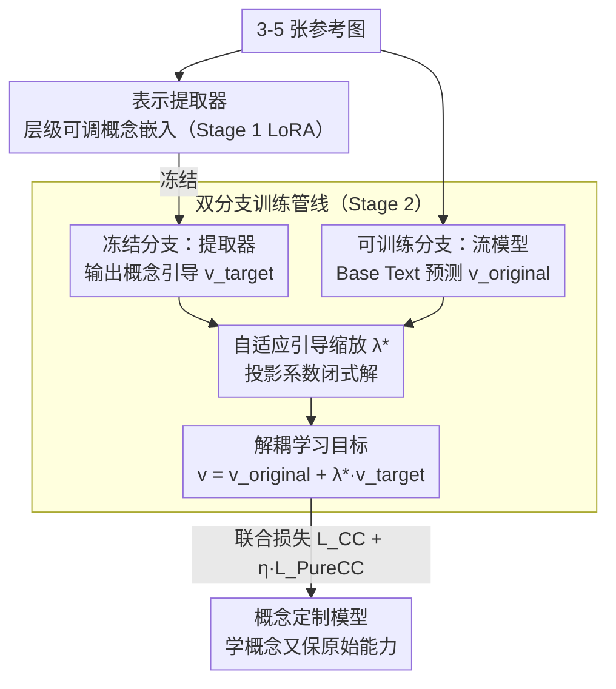

# PureCC: Pure Learning for Text-to-Image Concept Customization

**会议**: CVPR 2026  
**arXiv**: [2603.07561](https://arxiv.org/abs/2603.07561)  
**代码**: [https://github.com/lzc-sg/PureCC](https://github.com/lzc-sg/PureCC)  
**领域**: 图像生成  
**关键词**: 概念定制, 扩散模型微调, 隐式引导, 模型保持, 自适应缩放

## 一句话总结
提出 PureCC 方法，通过分离"目标概念隐式引导"和"原始条件预测"的解耦学习目标，配合冻结表示提取器+可训练流模型的双分支训练管线和自适应引导缩放 $\lambda^{\star}$，实现高保真概念定制的同时最小化对原始模型行为和能力的影响。

## 研究背景与动机

**领域现状**：概念定制（Concept Customization）使用 3-5 张参考图让 T2I 模型学习个性化概念（主体、风格等）。主流方法分为 Tuning-free（如 DreamO、UNO 编码参考图特征注入）和 Tuning-based（如 DreamBooth 全参微调、LoRA 低秩微调）。

**现有痛点**：现有方法聚焦于高保真和多概念定制，忽视了两个重要问题：
   - **原始行为破坏**：学习 [V] dog 后，非目标元素（背景、风格、光照）也被意外改变，因为有限参考图中的冗余信息与目标概念无法解耦
   - **原始能力退化**：微调后模型的文本跟随能力和图像质量下降，KL 散度可视化显示分布产生了明显漂移

**核心矛盾**：现有方法将定制集中的所有语言-视觉知识作为学习源，但参考图太少（3-5张），模型无法区分目标概念和冗余背景信息。且学习目标中缺乏对原始模型的显式考虑，导致学概念时原始分布漂移。

**切入角度**：从 Classifier-Free Guidance 的隐式引导形式获得启发——CFG 将条件生成视为"无条件预测 + 隐式条件引导"，类比地，概念定制可以视为"原始条件预测 + 隐式目标概念引导"。这种解耦形式天然支持在学习概念的同时保持原始模型。

**核心idea**：$v_t^{PureCC} = v_t^{original} + \lambda^{\star} \cdot v_t^{target}$，原始预测由可训练模型提供（保持原始能力），目标引导由冻结提取器提供（纯净概念表示），$\lambda^{\star}$ 通过投影误差自适应平衡。

## 方法详解

### 整体框架
PureCC 想同时做到两件以往互相打架的事：把 3-5 张参考图里的目标概念学进来，又不让原始模型的文本跟随、画质和无关元素跟着被改坏。它的做法是把概念定制借 CFG 的形式拆成"原始预测 + 概念增量"两路，再用一个会随训练自动调整的系数 $\lambda^{\star}$ 把两路加起来。底座是 flow-based 的 SD 3.5-M，训练分两阶段：先在定制集上单独练一个**表示提取器**，让它学会吐出纯净的目标概念引导；再冻住这个提取器，让另一个可训练的流模型只负责"原始预测"那一路，两路联合优化。这样概念引导和原始能力分属两个模型，互不污染。

### 关键设计

**1. 表示提取器：先单独把目标概念蒸成一束纯净引导**

参考图只有几张，目标概念和背景、光照这些冗余信息混在一起，直接让主模型去学就会把冗余一并吃进去。PureCC 在 Stage 1 先用 LoRA 微调一个预训练流模型 $v_t^{\theta_1}$，专门负责"理解概念"。关键不是简单替换 [V] token，而是引入**层级可调概念嵌入** $\{\mathbf{Y}_{tar}^l\}_{l=1}^L$——每个 Transformer 层用各自独立的可学习嵌入去替换 [V]，让浅层和深层分别去抓纹理、形状等不同尺度的细节，比所有层共用一个统一嵌入能装下更丰富的概念信息。这一阶段只用标准 CFM 损失 $\mathcal{L}_{CC}^{Rep}$ 训练，产物就是一个只懂目标概念、能给出干净引导的提取器。

**2. 解耦学习目标：把速度场拆成原始预测加概念增量**

CFG 把条件生成看成"无条件预测 + 隐式条件引导"，PureCC 把同样的思路搬到训练阶段：概念定制可以写成"原始条件预测 + 隐式目标概念引导"。于是完整速度场被拆成

$$v_t^{PureCC} = v_t^{\theta_2}(x_t \mid y_{base}) + \lambda^{\star} \cdot [\,v_t^{\theta_1}(x_t \mid y_{tar}) - v_t^{\theta_1}(x_t \mid \emptyset)\,]$$

前一项 $v_t^{original} = v_t^{\theta_2}(x_t \mid y_{base})$ 用不含 [V] 的 Base Text 作条件，由可训练模型给出，代表原始模型该有的预测能力；后一项 $v_t^{target} = \mathbf{R}(y_{tar})$ 是冻结提取器在 Target Text 和空条件下的预测差，是一束纯净的概念表示偏差。两路用加法组合而非全参覆盖，原始能力天然被保留在第一项里，概念只作为增量叠上去，这正是它能把分布漂移压住的根本原因。

**3. 自适应引导缩放 $\lambda^{\star}$：让概念增量的权重跟着学习进度自己走**

增量该叠多重是个难题：早期硬叠会污染还没站稳的原始模型，后期叠太轻又学不进概念。PureCC 不手调这个超参，而是把它定义成可训练模型当前已学到的概念方向在冻结模型概念引导上的投影系数：

$$\lambda^{\star} = \frac{\langle \mathbf{R}(y_{complete}, y_{base}),\, \mathbf{R}(y_{tar}) \rangle}{\|\mathbf{R}(y_{tar})\|^2}$$

它是个闭式解，不引入任何额外超参。直觉很直接：训练早期可训练模型还没学到概念方向，两个表示几乎正交，投影接近零，$\lambda^{\star}$ 自动压低，避免概念增量去搅乱原始分布；训练后期两边方向对齐，投影变大，$\lambda^{\star}$ 随之增大，概念学习被强化。整个权重曲线由表示对齐程度自己决定，省去了人工调度。

**4. 双分支训练管线：冻结分支供概念，可训练分支保能力**

Stage 2 把前面三件事拼成一条双分支管线。冻结分支就是 Stage 1 练好的表示提取器 $v_t^{\theta_1}$，每步只负责吐出 $v_t^{target}$，不再更新；可训练分支是另一个预训练流模型 $v_t^{\theta_2}$，承担原始预测那一路。优化目标是联合损失

$$\mathcal{L}_{PCC} = \mathcal{L}_{CC} + \eta \cdot \mathcal{L}_{PureCC}$$

其中 $\mathcal{L}_{PureCC}$ 把完整预测往上面那个解耦目标上拉，$\mathcal{L}_{CC}$ 则保住速度场原有的生成先验、防止可训练分支跑偏。代价是每步要跑两个流模型的前向，训练开销约为单分支的两倍。

### 训练策略
基础模型 SD 3.5-M，LoRA rank=4，学习率 1e-4。训练数据用 DreamBooth 的 14 个概念加自建的 16 个概念（含实例和风格），评估基准为 DreamBenchPCC（在 DreamBench 基础上扩展 12 个风格概念）。

## 实验关键数据

### 主实验（DreamBenchPCC，Instance 概念）

| 方法 | ΔCLIP-T↑ | ΔHPSv2.1↑ | Seg-Cons↑ | CLIP-I↑ | DINO↑ |
|------|----------|-----------|-----------|---------|-------|
| DreamBooth | -4.81 | -2.17 | 18.38 | 0.63 | 0.62 |
| Mix-of-Show | -2.71 | -1.08 | 15.72 | 0.72 | 0.61 |
| CIFC | -1.93 | -1.62 | 13.23 | 0.78 | 0.65 |
| DreamO (free) | - | - | - | 0.71 | 0.67 |
| **PureCC** | **-0.31** | **+0.10** | **69.37** | **0.81** | **0.73** |

### 消融实验

| 策略 | ΔCLIP-T↑ | ΔHPSv2.1↑ | Seg-Cons↑ | CLIP-I↑ | DINO↑ |
|------|----------|-----------|-----------|---------|-------|
| $\mathcal{L}_{CC}$（基线） | -4.52 | -2.01 | 23.74 | 0.65 | 0.66 |
| Merged Training | -1.17 | -0.34 | - | - | - |
| **PureCC（完整）** | **-0.31** | **+0.10** | **69.37** | **0.81** | **0.73** |

### 关键发现
- **Seg-Cons 指标是最突出的优势**：PureCC 达到 69.37，远超次优 DreamBooth+EWC 的 26.37，说明原始行为保持极好
- **ΔCLIP-T 接近零**（-0.31 vs DreamBooth 的 -4.81），说明文本跟随能力几乎未受损
- **HPSv2.1 甚至正增长**（+0.10），表明定制后图像质量不降反升
- 概念保真度同时达到最优（CLIP-I 0.81, DINO 0.73），证明保持≠牺牲保真
- 多概念定制中有效避免了语义纠缠（如 [V1] man 和 [V2] sunglasses 的颜色污染）

## 亮点与洞察
- **解耦学习目标**的设计极为优雅——从 CFG 的形式推广到训练阶段，将概念定制问题重新表述为"原始预测 + 概念增量"
- **自适应 $\lambda^{\star}$** 的闭式解设计很精炼——投影系数自动反映学习进度，无需手调超参
- **层级可调概念嵌入**是对标准 Textual Inversion 的有效增强——不同 Transformer 层用不同嵌入，捕捉概念的多尺度特征
- 首次系统性定义并评估了概念定制的"行为保持"（Seg-Cons 指标），填补了评估体系空白

## 局限与展望
- 双分支管线需要维护两个流模型的前向传播，训练成本约为单分支的 2 倍
- 层级嵌入增加了参数量和训练复杂度，对于极少参考图（1-2张）的场景效果待验证
- 实验主要在 SD 3.5-M 上验证，其他架构（如基于 DiT 的 FLUX）的适配性未探究
- 自适应 $\lambda^{\star}$ 依赖两分支的表示对齐质量，若提取器训练不充分可能影响缩放精度
- 仅评估静态图像生成，视频定制场景下的时序一致性未讨论

## 相关工作与启发
- **vs DreamBooth**：DreamBooth 全参微调导致严重分布漂移（ΔCLIP-T -4.81），PureCC 解耦目标+双分支将其限制在 -0.31
- **vs CIFC**：CIFC 用交叉注意力特征约束模型保持，PureCC 直接在速度场空间分离概念和原始分量，更本质
- **vs DreamO/UNO**（Tuning-free）：它们概念保真度（DINO 0.67/0.62）不及 PureCC（0.73），且无法做多概念组合

## 评分
- 新颖性: ⭐⭐⭐⭐⭐ 解耦学习目标的推导从 CFG 自然延伸到训练阶段，并提出闭式自适应缩放，思路新颖且理论优美
- 实验充分度: ⭐⭐⭐⭐ 定量评估引入保持性指标、多概念和风格-实例组合评估，但仅限单一模型
- 写作质量: ⭐⭐⭐⭐ 公式推导清晰，Fig.2 的 pipeline 图直观，但某些符号定义可更简洁
- 价值: ⭐⭐⭐⭐⭐ 首次系统解决概念定制中原始模型保持问题，对实际应用（如持续定制多概念而不退化）价值大

<!-- RELATED:START -->

## 相关论文

- [\[CVPR 2026\] CoLoGen: Progressive Learning of Concept-Localization Duality for Unified Image Generation](cologen_progressive_learning_of_concept-localization_duality_for_unified_image_g.md)
- [\[CVPR 2026\] Neighbor-Aware Localized Concept Erasure in Text-to-Image Diffusion Models](neighbor-aware_localized_concept_erasure_in_text-to-image_diffusion_models.md)
- [\[CVPR 2026\] GrOCE: Graph-Guided Online Concept Erasure for Text-to-Image Diffusion Models](groce_graph-guided_online_concept_erasure_for_text-to-image_diffusion_models.md)
- [\[CVPR 2026\] DreamVideo-Omni: Omni-Motion Controlled Multi-Subject Video Customization with Latent Identity Reinforcement Learning](dreamvideo-omni_omni-motion_controlled_multi-subject_video_customization_with_la.md)
- [\[CVPR 2026\] LumiCtrl: Learning Illuminant Prompts for Lighting Control in Personalized Text-to-Image Models](lumictrl_learning_illuminant_prompts_for_lighting_control_in_personalized_text-t.md)

<!-- RELATED:END -->
