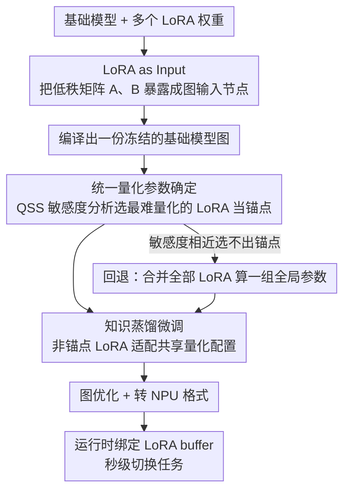

# Quantization with Unified Adaptive Distillation to enable multi-LoRA based one-for-all Generative Vision Models on edge

**会议**: CVPR 2026  
**arXiv**: [2603.29535](https://arxiv.org/abs/2603.29535)  
**代码**: 无  
**领域**: 图像生成  
**关键词**: LoRA量化, 边缘部署, 知识蒸馏, 扩散模型, 运行时任务切换

## 一句话总结

本文提出QUAD框架，将LoRA权重作为运行时输入而非编译到模型图中，结合跨LoRA共享量化参数的蒸馏微调策略，实现单个编译模型在移动端NPU上动态切换多个GenAI任务，达到6倍内存压缩和4倍延迟改善。

## 研究背景与动机

1. **领域现状**：手机上的GenAI功能（图像编辑、物体移除、文本引导变换等）越来越多，通常基于扩散模型（如Stable Diffusion 1.5），使用LoRA进行任务特定适配。

2. **现有痛点**：当前移动端部署流程为**每个LoRA单独编译**——将LoRA权重合并到基础模型后再量化编译，导致每个任务需要独立的模型二进制文件。N个任务 = N份基础模型副本 + N份编译图，ROM用量线性增长。

3. **核心矛盾**：不同LoRA独立训练后的权重分布不同，导致各自的量化参数（scale和zero-point）不一致，无法共享一个静态量化推理图。因此在NPU等固定量化参数的硬件上，每个LoRA必须单独编译，无法运行时切换。

4. **本文目标** 设计一个统一部署框架：(a) 跨多个LoRA共享量化参数；(b) 支持运行时动态注入LoRA权重（无需重新编译）；(c) 在低精度推理下保持生成质量。

5. **切入角度**：改变模型图的构建方式——将LoRA权重从编译时嵌入变为运行时输入张量，然后通过知识蒸馏微调使所有LoRA适配统一的量化配置。

6. **核心 idea**：LoRA as Input + 基于敏感度分析的共享量化参数 + 知识蒸馏微调 = 单图多任务边缘部署。

## 方法详解

### 整体框架

这篇论文要解决的是"一台手机上跑多个 GenAI 任务，却不想为每个任务各存一份模型"的部署难题。传统做法把 LoRA 合并进基础模型后再量化编译，N 个任务就有 N 份基础模型副本，存储随任务数线性膨胀。QUAD 的整条 pipeline 围绕"让多个 LoRA 共用同一份编译好的基础模型图"展开：先把 LoRA 权重从编译时嵌入改成运行时输入，编译出一份冻结图；再为所有 LoRA 选出一组共享的量化参数，并用知识蒸馏微调让每个 LoRA 都能在这组参数下保持质量；最后做图优化、转成 NPU 格式，部署时只需在运行时加载并绑定对应任务的 LoRA buffer，即可秒级切换任务。

### 关键设计

**1. LoRA as Input：把 LoRA 从"模型的一部分"变成"模型的输入"**

痛点在于，只要 LoRA 权重被编译进模型图，每换一个任务就得重新编译、重新存一份基础模型。QUAD 的做法是改写架构：对每个被 LoRA 增强的线性层 $y = Wx + \alpha A(Bx)$，把低秩矩阵 $A$、$B$ 暴露成模型图的额外输入节点，而不是固化在权重里。这样编译时只生成一份冻结的基础模型二进制，推理时不同任务各自把对应的 LoRA 权重以 buffer 形式放在 RAM 里，通过一个轻量 API 绑定到这些输入节点即可。它和传统方案最本质的区别，就像编程里从"静态链接"换成"动态链接"——基础模型这份大块头只存一次，任务切换变成换一个小 buffer。收益随任务数放大：10 个 LoRA（各约 120MB）配 1.4GB 基础模型，传统 merge+compile 要 15GB，QUAD 只需 2.6GB，约 6 倍压缩。

**2. 统一量化参数确定：用敏感度分析挑一个"最难量化"的 LoRA 当锚点**

LoRA as Input 解决了图结构问题，但 NPU 要求一套固定的量化 scale 和 zero-point，而各 LoRA 独立训练后权重分布不同、各自最优的量化参数也不同——直接共享会让某些任务精度崩。QUAD 的策略是先给每个 LoRA 算一个量化敏感度分数（QSS），衡量它被量化后输出偏移多少：

$$QSS = \mathbb{E}_x\big[D\big(f(x;w)\,\|\,f(x;\tilde{w})\big)\big]$$

其中 $D$ 为 JS 散度，$f(x;w)$ 与 $f(x;\tilde{w})$ 分别是全精度和量化后模型的输出。QSS 最高、也就是对量化最敏感的那个 LoRA 被选作锚点，它的量化参数直接拿来当全局共享参数。这是典型的"木桶效应"思路：先照顾最难量化的任务，其余任务后面再靠蒸馏微调向这组参数靠拢。如果所有 LoRA 敏感度都差不多、选不出明显锚点，就退化为合并全部 LoRA 的权重分布算一组全局参数（Unified-LoRA 回退策略）。

**3. 知识蒸馏微调：让非锚点 LoRA 主动适配共享的量化配置**

光选好共享参数还不够——直接拿锚点的量化参数去编码别的 LoRA，精度会直接崩（全 INT8 下 FID 从 5.53 飙到 599）。QUAD 用知识蒸馏把这些 LoRA"拉回来"：构建一个 QuantSim 模型，把待适配的 LoRA（如 LoRA-2）的权重用锚点 LoRA-1 的量化参数做 PTQ 编码；全精度模型当 teacher，QuantSim 模型当 student，优化目标是最小化两者输出间的重建损失，外加原始的 LVM 训练目标（如 DDPM 去噪损失）。迭代优化下，LoRA 权重会在保持任务性能的同时，主动把自己的分布调整到"能被这组共享量化参数良好表示"的形态。换句话说，不是改量化参数去迁就 LoRA，而是微调 LoRA 去迁就固定的量化参数——这正好契合 NPU 量化参数不可变的硬件约束。

### 损失函数 / 训练策略

知识蒸馏损失 = teacher-student输出重建损失 + 原始LVM训练目标（如DDPM去噪损失）。量化配置为W8A16（权重INT8、激活INT16）。实验表明激活进一步压缩到INT8会导致显著精度下降（W8A8下FID从12.2涨到599）。

## 实验关键数据

### 主实验

FP32 vs INT8量化精度对比：

| 用例 | 指标 | 值 |
|------|------|-----|
| Prompt引导图像变换 | $sim_d$ (余弦相似度方向) | 0.9428 |
| Prompt引导图像变换 | $sim_{image}$ (语义相似度) | 0.881 |
| Prompt引导图像变换 | Structure loss | 0.045 |
| 物体移除 (QUAD后) | FID | 5.5287 |
| 物体移除 | SSIM | 0.94 |
| 物体移除 | PSNR | 33.04 |

设备端KPI（SD1.5 1.1B模型）：

| 指标 | Qualcomm (GS25) | LSI (GS25) | MediaTek (Tab S11) |
|------|-----------------|------------|-------------------|
| 端到端延迟(8步) | 8826ms / 3723ms | 12456ms / 4217ms | 15682ms / 5528ms |
| 共享模型ROM | 1375MB | 1125MB | 1177MB |
| LoRA ROM | 119MB | 134MB / 104MB | 31MB / 87MB |
| 峰值RAM | 1739MB | 1259MB | 1590MB |

4用例部署（SD1.5 0.7B模型，GS25，OLSS 8步）：

| 用例 | UNet执行(ms) | 端到端(ms) | LoRA ROM(MB) |
|------|-------------|-----------|-------------|
| Text-to-Image | 48 | 1052 | N/A |
| Sketch-to-Image | 48 | 1527 | 77 |
| Sticker生成 | 48 | 1080 | 77 |
| Portrait Studio | 51 | 1874 | 77 |

### 消融实验

混合精度量化对比（Prompt引导图像变换）：

| 配置 (W8A8:W8A16) | FID | LPIPS | PSNR | SSIM |
|-------------------|-----|-------|------|------|
| 0:100 (全W8A16) | **12.23** | **0.1083** | **32.71** | **0.9808** |
| 40:60 | 13.05 | 0.1086 | 32.68 | 0.9806 |
| 80:20 | 14.28 | 0.1125 | 31.41 | 0.9777 |
| 100:0 (全W8A8) | 599.07 | 0.699 | 5.44 | 0.2324 |

### 关键发现

- **LoRA权重对量化精度要求不高**：LoRA本身INT8量化仅导致ROM缩减1.5倍且精度基本不变，说明低秩适配矩阵的值分布相对简单
- **激活量化是关键瓶颈**：全W8A8下FID暴涨到599，质量完全崩溃。W8A16是目前最佳配置点
- **内存收益随任务数线性增长**：2个任务时内存增益有限，但10个任务时从15GB降至2.6GB（6倍压缩），说明框架的核心价值在多任务场景
- **运行时切换延迟极低**：切换LoRA只需加载权重buffer（100-200MB级），比重新加载整个模型（1-2GB）快约1.5秒
- 方案在三种芯片（Qualcomm/LSI/MediaTek）上均有效，框架具有芯片无关性

## 亮点与洞察

- **LoRA as Input的思维转换**：将LoRA从"模型的一部分"变为"模型的输入"，这个概念转换看似简单但从根本上改变了多任务部署的范式。可以类比为"从静态链接到动态链接"的编程思想
- **QSS敏感度分析选择锚点**：不是随意选一个LoRA的量化参数，而是选最敏感的那个作为共享基准，确保最难量化的任务不会精度崩溃。这种"木桶效应"思维在系统设计中很有价值
- **OTA可扩展性**：新LoRA可以通过OTA推送到设备上直接使用，无需更新base model——这与手机App Store的更新逻辑一致，具有很好的产品化前景

## 局限与展望

- 仅在SD 1.5（1.1B和0.7B）上验证，向更大模型（SDXL/Flux）的扩展性未知
- W8A8精度崩溃的问题限制了进一步的延迟/内存优化空间，需要更先进的激活量化技术
- QUAD的知识蒸馏微调需要对每个非锚点LoRA独立执行，当LoRA数量很多时训练成本线性增长
- 评估指标以FID/SSIM为主，缺乏用户感知质量的主观评估
- 实验主要来自三星研究院的内部用例和芯片平台，与开源社区的LoRA生态（如Civitai）的兼容性未验证

## 相关工作与启发

- **vs QLoRA/QaLoRA**: 这些方法聚焦于训练阶段的量化效率，不关心部署时的多LoRA切换。QUAD解决的是推理部署问题
- **vs MobileDiffusion**: 关注降低扩散推理成本但假设静态模型图，不支持运行时任务切换
- **vs 传统merge+compile**: 每个LoRA merge进base model后独立编译，内存线性增长。QUAD通过共享base model实现常数级（相对于任务数）的存储开销

## 评分

- 新颖性: ⭐⭐⭐⭐ "LoRA as Input"想法直观但有工程巧妙性，QUAD的QSS敏感度分析有一定方法贡献，整体偏系统工程
- 实验充分度: ⭐⭐⭐⭐ 覆盖多芯片平台和多用例，有精度-延迟-内存的全面KPI分析，但用例种类有限（主要2-4个）
- 写作质量: ⭐⭐⭐⭐ 框架描述清晰，但论文结构稍显堆砌，部分图表重复
- 价值: ⭐⭐⭐⭐⭐ 对移动端GenAI部署有直接实用价值，解决了工业界真实痛点——多任务共享单模型部署

<!-- RELATED:START -->

## 相关论文

- [\[CVPR 2026\] All-in-One Slider for Attribute Manipulation in Diffusion Models](all_in_one_slider_attribute_manipulation.md)
- [\[CVPR 2026\] MapReduce LoRA: Advancing the Pareto Front in Multi-Preference Optimization for Generative Models](mapreduce_lora_advancing_the_pareto_front_in_multi-preference_optimization_for_g.md)
- [\[CVPR 2026\] VOSR: A Vision-Only Generative Model for Image Super-Resolution](vosr_a_vision_only_generative_model_for_image_super_resolution.md)
- [\[CVPR 2026\] Language-Free Generative Editing from One Visual Example](language-free_generative_editing_from_one_visual_example.md)
- [\[CVPR 2026\] ChimeraLoRA: Multi-Head LoRA-Guided Synthetic Datasets](chimeralora_multi-head_lora-guided_synthetic_datasets.md)

<!-- RELATED:END -->
