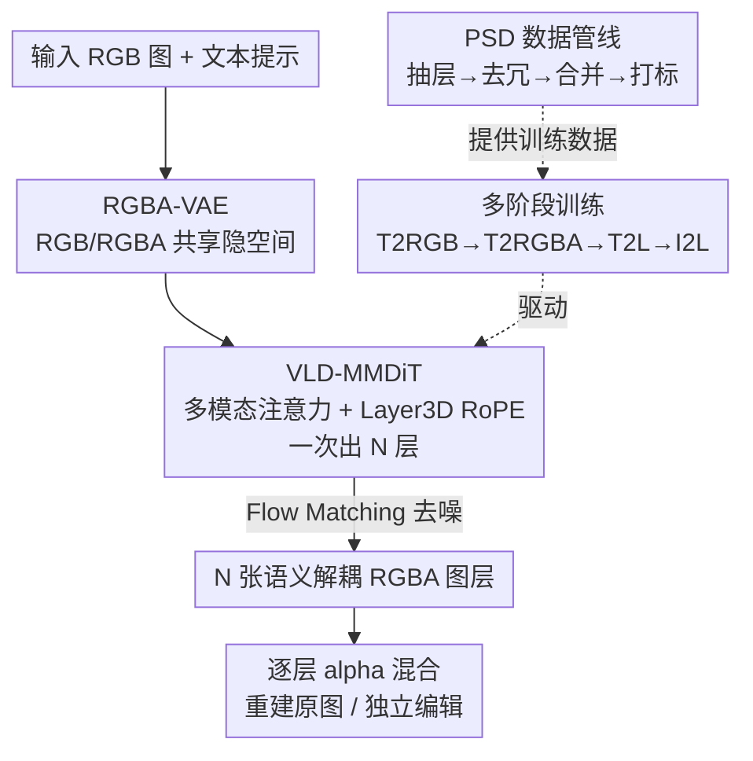

# Qwen-Image-Layered: Towards Inherent Editability via Layer Decomposition

**会议**: CVPR 2026  
**论文**: [CVF Open Access](https://openaccess.thecvf.com/content/CVPR2026/html/Yin_Qwen-Image-Layered_Towards_Inherent_Editability_via_Layer_Decomposition_CVPR_2026_paper.html)  
**代码**: https://github.com/QwenLM/Qwen-Image-Layered  
**领域**: 图像生成  
**关键词**: 图层分解, RGBA, 一致性编辑, 扩散模型, MMDiT

## 一句话总结
把一张 RGB 图直接端到端拆成多张语义解耦的 RGBA 图层，每层可独立编辑而不影响其他内容，从根上解决了栅格图编辑时的语义漂移和几何错位，分解质量显著超过此前递归式方法。

## 研究背景与动机
**领域现状**：图像编辑当前主流分两类。一类是全局编辑（如 Qwen-Image-Edit），在生成模型的隐空间里把整张图重采样一遍来做风格迁移、表情修改；另一类是 mask 引导的局部编辑（如 DiffEdit），先估一个掩码再只在掩码内动手。

**现有痛点**：全局编辑受概率生成的随机性所限，没动的区域也会跟着变，导致**语义漂移**（人脸 identity 莫名其妙变了）和**几何错位**（物体位置 / 尺度偏移）。局部编辑则卡在掩码本身——遇到遮挡、软边界（头发、半透明）时，"真正要改的区域"边界模糊，掩码圈不准，照样保不住一致性。

**核心矛盾**：作者认为问题的根不在模型设计或数据工程，而在**图像表示本身**。传统栅格图是"扁平且纠缠"的——所有视觉内容被压进同一张画布，语义和几何紧紧耦合，于是任何一处编辑都会在这个纠缠的像素空间里传播出去，一致性天然守不住。

**切入角度**：专业设计软件（Photoshop）从来不用扁平画布，而是用**图层**——改一层不碰其他层。作者把这个直觉搬进生成模型：把图像表示成一摞语义分解的 RGBA 图层，编辑只作用在目标层、物理上和其他内容隔离，语义漂移和几何错位就被"消灭在表示层面"。而且图层表示天生支持缩放、平移、改色这类高保真基础操作。

**核心 idea**：训练一个端到端扩散模型，把单张 RGB 图直接分解成**可变数量**的语义解耦 RGBA 图层（而非此前的前景 / 背景两层 + 递归推理），用解耦表示换来"内生的、自带一致性的"可编辑性。

## 方法详解
### 整体框架
模型记作 Qwen-Image-Layered，基于 Qwen-Image 改造。输入一张 RGB 图 $I \in \mathbb{R}^{H\times W\times 3}$，输出 $N$ 张 RGBA 图层 $L \in \mathbb{R}^{N\times H\times W\times 4}$，每层 $L_i=[RGB_i;\alpha_i]$ 含颜色和 alpha 蒙版。原图可由这些层按 alpha 顺序混合无损重建：

$$C_0 = 0,\quad C_i = \alpha_i \cdot RGB_i + (1-\alpha_i)\cdot C_{i-1},\quad I = C_N$$

要让"一张图 → 不定层数 RGBA"这条管线跑通，作者从三处改造 Qwen-Image：① 用一个能同时编码 RGB 和 RGBA 的 **RGBA-VAE**，把输入图和输出层放进同一个隐空间，消掉分布鸿沟；② 设计 **VLD-MMDiT**（可变层数分解 MMDiT），靠一个新增的"图层维度" RoPE 一次性吐出任意层数，不再递归；③ 用**多阶段、多任务训练**把一个预训练文生图模型循序渐进地驯化成图层分解器。另外因为高质量多层数据稀缺，作者还建了一条从真实 PSD 文件抽取并标注图层的**数据管线**。

### 关键设计

**1. RGBA-VAE：让输入 RGB 和输出 RGBA 共用一个隐空间**

此前的分解器（如 LayerDecomp）给输入 RGB 和输出 RGBA 用两套独立 VAE，于是输入和输出的隐分布之间存在鸿沟，模型既要分解又要跨分布对齐，难度陡增。本文的做法是把 Qwen-Image VAE 编码器的第一层卷积、解码器的最后一层卷积从 3 通道扩到 4 通道（受 AlphaVAE 启发），一个 VAE 同时吃 RGB 和 RGBA——RGB 图就把 alpha 通道全置 1。

关键是初始化不能破坏原 RGB 重建能力：把预训练 RGB VAE 的权重拷进前三个通道，新增的第四通道权重清零、解码器对应 bias 设为 1，即 $W^0_E[:,3,:,:,:]=0$、$W^l_D[3,:,:,:,:]=0$、$b^l_D[3]=1$，保证初始状态等价于原 RGB VAE。训练用重建 + 感知 + 正则三项损失。训出来后输入 RGB 图和每张输出 RGBA 层都落在同一隐空间、且各层独立编码（层间无冗余，所以不沿层维度压缩）。消融里它把 Alpha soft IoU 从约 0.58 抬到 0.65（见后表），证明消除分布鸿沟确实有效。

**2. VLD-MMDiT + Layer3D RoPE：一次吐出可变层数，告别递归推理**

以往方法只分前景 / 背景两层，要多层就得递归地"剥一层补一层"，误差会逐层累积。VLD-MMDiT 的目标是**一次前向出任意 $N$ 层**。它把目标 RGBA 层的隐表示 $x_0=E(L)$ 当作要去噪的对象，沿用 Qwen-Image 的 Flow Matching / Rectified Flow：中间态 $x_t = t x_0 + (1-t)x_1$，速度 $v_t = x_0 - x_1$，模型 $v_\theta(x_t,t,z_I,h)$ 以输入图隐编码 $z_I$ 和文本条件 $h$ 为条件，按 $\mathcal{L}=\mathbb{E}\|v_\theta(x_t,t,z_I,h)-v_t\|^2$ 回归速度。注意力上不再像前人那样手工设计层间 / 层内注意力，而是直接把文本、输入图、噪声层三段序列在序列维拼起来做多模态注意力，让层内、层间交互被注意力一把建模。

要支持"层数不定"，核心是 **Layer3D RoPE**：在 Qwen-Image 的 MSRoPE（每层位置编码向中心偏移）基础上，多加一个**图层维度**。中间态 $x_t$ 的层索引从 0 开始递增，条件输入图 $z_I$ 的层索引设为 -1，以此把"条件图"和"待生成的正层"在位置编码上明确区分开，也让同一架构能兼容文生多层等不同任务。消融显示去掉 Layer3D RoPE 模型根本分不清各层、退化到无法产出多张有意义图层（RGB L1 从 0.19 恶化到 0.28）。

**3. 多阶段多任务训练：把文生图模型循序渐进驯成图层分解器**

直接拿预训练文生图模型 finetune 去做分解很难——它既要适应新 VAE、又要学全新任务。作者设计三阶段、由易到难：**Stage 1**（Text-to-RGB → Text-to-RGBA）先换上 RGBA-VAE，联合训文生 RGB 和文生 RGBA，让模型学会画带透明度的图；**Stage 2**（→ Text-to-Multi-RGBA）引入多层生成任务、激活新的图层维度，仿照 ART 让模型同时预测最终合成图和它的各透明层，促进合成图与图层间的信息传递，得到 Qwen-Image-Layered-T2L；**Stage 3**（→ Image-to-Multi-RGBA）才加入图像输入条件，把能力扩展到"给一张 RGB 图、分解成多层"，得到最终的 I2L 模型。三阶段分别训 500K / 400K / 400K 步。消融里多阶段训练贡献最大——加上它 Alpha soft IoU 从 0.65 跳到 0.87。

### 损失函数 / 训练策略
VAE 用重建 + 感知 + 正则三项联合损失；扩散主干用 Flow Matching 的速度回归 MSE（见上式）。Adam 优化器，学习率 $1\times10^{-5}$，最大层数设为 20，三阶段共 1.3M 步。

## 实验关键数据

### 主实验
在 Crello 数据集上按 LayerD 的评测协议（用 order-aware DTW 对齐不同长度的图层序列、允许合并相邻层以容忍分解歧义）比较 Image-to-Multi-RGBA，报告 RGB L1（按 GT alpha 加权的 RGB L1 距离，越低越好）和 Alpha soft IoU（越高越好）。下表为"合并 0 层"（最严格）一列：

| 方法 | RGB L1 ↓ | Alpha soft IoU ↑ |
|------|----------|------------------|
| VLM Base + Hi-SAM | 0.1197 | 0.5596 |
| Yolo Base + Hi-SAM | 0.0962 | 0.5697 |
| LayerD | 0.0709 | 0.7520 |
| **Qwen-Image-Layered-I2L** | **0.0594** | **0.8705** |

Alpha soft IoU 从 LayerD 的 0.752 拉到 0.871，alpha 通道的保真度优势尤其明显。

RGBA 图像重建（AIM-500 数据集）上 RGBA-VAE 也全面领先各家 alpha VAE：

| 模型 | 基座 | PSNR ↑ | SSIM ↑ | rFID ↓ | LPIPS ↓ |
|------|------|--------|--------|--------|---------|
| LayerDiffuse | SDXL | 32.09 | 0.944 | 17.70 | 0.0418 |
| AlphaVAE | FLUX | 36.94 | 0.974 | 11.79 | 0.0283 |
| **RGBA-VAE** | Qwen-Image | **38.83** | **0.980** | **5.31** | **0.0123** |

### 消融实验
在 Crello 上逐个加回三大组件（L=Layer3D RoPE，R=RGBA-VAE，M=多阶段训练），"合并 0 层"列：

| 配置 | L | R | M | RGB L1 ↓ | Alpha soft IoU ↑ |
|------|---|---|---|----------|------------------|
| w/o L,R,M | ✗ | ✗ | ✗ | 0.2809 | 0.3725 |
| w/o R,M | ✓ | ✗ | ✗ | 0.1894 | 0.5844 |
| w/o M | ✓ | ✓ | ✗ | 0.1649 | 0.6504 |
| **Full** | ✓ | ✓ | ✓ | **0.0594** | **0.8705** |

### 关键发现
- **三个组件各司其职、缺一不可**：Layer3D RoPE 是"能不能分多层"的开关——没它模型分不清层、RGB L1 直接烂到 0.28；RGBA-VAE 消除输入输出分布鸿沟，把 IoU 从 0.58 推到 0.65；多阶段训练贡献最大，单独让 IoU 从 0.65 跃到 0.87。
- **端到端 vs 递归**：相比 LayerD 这类"逐层剥离 + inpainting 补背景"的递归方案，本文一次前向出全部层，既避免误差逐层传播，也不会留下 inpainting 伪影和分割不准（定性图里 LayerD 的 Output Layer 1 有明显补全痕迹）。
- **下游编辑一致性**：对比 Qwen-Image-Edit-2509，缩放 / 重定位这类操作对全局编辑很难（会引入像素级偏移），而图层表示天然支持，能在不动其他层的前提下精确改目标层。

## 亮点与洞察
- **把"一致性"从优化目标变成表示性质**：与其在 loss 或采样上费劲保一致，不如换一种解耦表示，让"不该变的物理上就不可能变"——这是最让人"啊哈"的思路转换，可迁移到任何受纠缠表示困扰的编辑任务（视频、3D）。
- **RoPE 多加一维换来"可变输出数量"**：把"层"当作一个新的位置维度、用 -1 区分条件图，这招很巧——让同一个 MMDiT 不改架构就支持不定长输出和多任务，是处理"输出元素数量可变"问题的通用 trick。
- **从 PSD 文件挖训练数据**：用 psd-tools 解析真实 Photoshop 文档、过滤异常层、合并空间不重叠的层来压层数、再用 Qwen2.5-VL 打标，绕开了"高质量多层数据稀缺"的老大难，思路接地气且可复现。

## 局限与展望
- 强依赖大规模真实 PSD 数据，且最大层数被截到 20——层数极多或半透明层叠很复杂的场景能否撑住，原文未充分展示 ⚠️。
- 评测主要在 Crello / AIM-500，且为消除分布差异在 Crello 上做了 finetune，跨域（自然照片、复杂遮挡）的分解鲁棒性还需更多验证。
- 三阶段共 1.3M 步、基座是 Qwen-Image 级别的大模型，训练成本高；分解出的层语义粒度由数据决定，用户对"拆成几层、怎么拆"的可控性有限。

## 相关工作与启发
- **vs LayerD / Accordion（递归分解）**：它们逐层剥离最顶不被遮挡的前景再 inpainting 补背景，需递归推理、误差累积且留补全伪影；本文端到端一次出全部层，分解质量和 alpha 保真度都更高。
- **vs LayerDecomp（双 VAE）**：前者输入 RGB、输出 RGBA 各用一套 VAE，存在分布鸿沟；本文用单个 RGBA-VAE 统一隐空间，消融证明这步把 IoU 抬了一档。
- **vs Qwen-Image-Edit-2509（全局编辑）**：同源基座，但全局编辑靠重采样整图、保不住未编辑区，缩放 / 平移会引入像素偏移；本文靠图层隔离从表示上保证一致性。
- **vs LayerDiffusion / LayerDiff / ART（多层生成）**：它们多靠精心设计的层间 / 层内注意力或匿名区域布局来生成多层图；本文用拼接序列的多模态注意力直接建模交互，且核心落在"分解已有图"，并能把 AI 生成的栅格图反向拆成图层。

## 评分
- 新颖性: ⭐⭐⭐⭐⭐ 把编辑一致性问题归因到图像表示、用端到端可变层 RGBA 分解破题，范式级创新。
- 实验充分度: ⭐⭐⭐⭐ 分解 / 重建 / 消融 / 定性编辑都覆盖，但跨域和大层数场景验证略少。
- 写作质量: ⭐⭐⭐⭐⭐ 动机推导清晰，三大设计与消融一一对应，逻辑自洽。
- 价值: ⭐⭐⭐⭐⭐ 为一致性图像编辑确立新范式，模型与代码已开源，落地潜力大。

<!-- RELATED:START -->

## 相关论文

- [\[CVPR 2026\] From Inpainting to Layer Decomposition: Repurposing Generative Inpainting Models for Image Layer Decomposition](from_inpainting_to_layer_decomposition_repurposing_generative_inpainting_models_.md)
- [\[CVPR 2026\] Cycle-Consistent Tuning for Layered Image Decomposition](cycle-consistent_tuning_for_layered_image_decomposition.md)
- [\[ICLR 2026\] Referring Layer Decomposition](../../ICLR2026/image_generation/referring_layer_decomposition.md)
- [\[CVPR 2025\] Generative Image Layer Decomposition with Visual Effects](../../CVPR2025/image_generation/generative_image_layer_decomposition_with_visual_effects.md)
- [\[CVPR 2025\] Improving Editability in Image Generation with Layer-wise Memory](../../CVPR2025/image_generation/improving_editability_in_image_generation_with_layer-wise_memory.md)

<!-- RELATED:END -->
