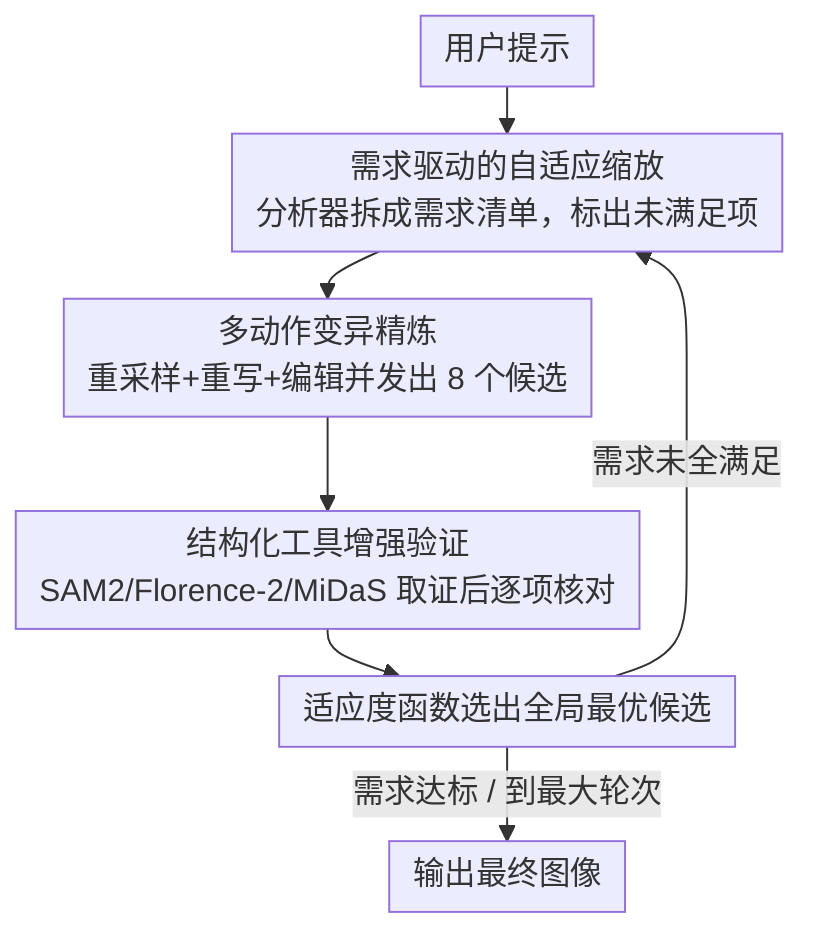

# RAISE: Requirement-Adaptive Evolutionary Refinement for Training-Free Text-to-Image Alignment

**会议**: CVPR 2026  
**arXiv**: [2603.00483](https://arxiv.org/abs/2603.00483)  
**代码**: [https://github.com/LiyaoJiang1998/RAISE](https://github.com/LiyaoJiang1998/RAISE)  
**领域**: 图像生成  
**关键词**: 推理时计算缩放, 文本-图像对齐, 进化优化, 需求驱动, 多智能体

## 一句话总结
提出 RAISE 框架，将 T2I 生成建模为需求驱动的自适应进化过程：通过需求分析器将提示词分解为结构化检查清单，用多动作变异（提示重写+噪声重采样+指令编辑）并发进化候选群体，再通过工具增强的视觉验证逐轮淘汰不满足需求的候选，实现自适应推理时缩放——在 GenEval 上达到 0.94 SOTA，同时比反射微调基线减少 30-40% 生成样本和 80% VLM 调用。

## 研究背景与动机

**领域现状**：T2I 扩散模型虽然能生成逼真图像，但对复杂提示（多物体、空间关系、属性绑定）的忠实度仍有不足。推理时缩放（inference-time scaling）通过在推理时分配额外计算来改善对齐，成为新兴方向，包括噪声级缩放（如随机搜索最优初始噪声）和提示级缩放（用 VLM 重写提示）。

**现有痛点**：
   - **Training-free 方法**（TIR、T2I-Copilot）：依赖固定迭代预算或阈值，无法适应不同提示的难度差异；多轮改进时效果停滞甚至退化；T2I-Copilot 每轮只选单一动作，探索有限
   - **Training-based 方法**（Reflect-DiT、ReflectionFlow）：需要大规模反射数据集+联合微调扩散模型和 VLM，成本高、过拟合反射路径、不易迁移到新基础模型
   - 所有方法都缺乏从提示本身分析"到底哪些需求没满足"的能力

**核心矛盾**：现有方法要么计算分配固定（简单提示浪费、复杂提示不够），要么依赖训练（模型绑定、成本高），没有将"需求满足程度"作为计算分配的驱动信号。

**切入角度**：将 T2I 生成类比为软件工程的"需求分析→实现→验证"流程——先将用户提示分解为可验证需求清单，每轮识别未满足项，仅针对性分配计算，满足即停。

**核心idea**：需求驱动的自适应进化框架——多智能体（分析器、重写器、验证器）协同工作，通过多动作变异并发生成候选群体，工具增强的结构化验证提供精细反馈，计算量自适应于语义复杂度。

## 方法详解

### 整体框架
RAISE 把 training-free 的 T2I 对齐当成一个软件工程流程来做：先把用户提示拆成"需求清单"，再像迭代开发一样反复"实现—验证"，直到清单上的需求都被满足。整套系统由三个共享同一 VLM 骨干（Mistral-Small-3.2）的智能体协作完成——**分析器**负责把提示解析成需求清单 $\mathcal{R}_i$（区分已满足 $\mathcal{R}_i^+$ 与未满足 $\mathcal{R}_i^-$）并配上二值验证问题 $Q_i$ 和是否继续的决策 $d_i^{analyzer}$；**重写器**针对未满足项产出新的提示或编辑指令；**验证器**用视觉工具取证后逐项回答验证问题。

一轮的流转是这样的：分析器看着上一轮的最佳图像和它的验证反馈更新需求清单，重写器和噪声采样并发生成一批候选图像，验证器逐项核对、用适应度函数选出全局最优；如果需求都达标就停，否则把这一轮的最优图带进下一轮继续精炼。关键在于"做几轮、做哪些改动"全都跟着"还差哪些需求"自适应地走，而不是预先写死。

### 关键设计

**1. 需求驱动的自适应缩放：让计算预算跟着"还差哪几项需求"走，而不是固定轮数**

现有 training-free 方法（TIR、T2I-Copilot）用固定迭代预算或阈值，简单提示浪费算力、复杂提示又不够。RAISE 把这件事反过来做：分析器每轮开始时接收用户提示、上轮最佳候选图像及其验证反馈，输出一份更新后的需求清单，迭代在三种条件中任一满足时终止——分析器判定主要需求已满足（$d_i^{analyzer}$）、验证器确认所有需求已满足、或达到最大轮次 $K_{max}=4$。这样一来简单提示一两轮就收敛、复杂提示自动多迭代几轮，计算量自适应于提示的语义复杂度。把分配信号从"整体一个对齐分"换成"逐项需求是否满足"，是它和噪声/提示级缩放的本质区别。

**2. 多动作变异精炼：每轮并发跑多种互补改进，把搜索空间从单一维度撑开**

T2I-Copilot 每轮只选单一动作，探索有限。RAISE 每轮固定产出 $n_i = 8$ 个候选，并把三类互补的变异动作并发执行：**重采样**保持原始提示 $x_{user}$ 不动、只更换随机噪声 $\epsilon \sim \mathcal{N}(0,I)$，用来探索不同的空间布局；**提示重写**让重写器依据 $\mathcal{R}_i^-$ 改写提示语义、再配上多个新噪声生成候选；**指令编辑**则基于上轮最佳图像生成三种编辑指令——只改最重要未满足项的 top edit、随机挑一项的 random edit、一次性改所有未满足项的 comprehensive edit，交给 Flux Kontext 执行。三类动作还按阶段调度：前期（$i \leq K_{min}$）用生成式变异（重采样+重写）做广探索，后期（$i > K_{min}$）切到重写+编辑做定向精修。重采样管布局、重写管语义、编辑管细节，三个维度互补且并行，搜索空间比单动作大得多。

**3. 结构化工具增强验证：给 VLM 喂"硬证据"再判断，治看图幻觉**

直接让 VLM 看图回答"满足了没有"很容易幻觉，尤其是计数和空间关系。RAISE 先用视觉工具把图变成结构化证据：Grounded SAM 2 + Florence-2 做检测与描述、MiDaS 做深度估计，得到

$$G_{i,j} = (caption,\ \{(label_k,\ bbox_k,\ depth_k)\},\ image\_size)$$

也就是一段描述、每个目标的标签/边界框/深度、以及图像尺寸。验证器把这份证据连同验证问题 $Q_i$ 一起喂给 VLM，对每条需求输出（问题、是/否答案、解释）三元组；最后用 NVILA-Lite-2B-Verifier 算用户提示与图像的对齐分数，挑出全局最优候选。目标框给了"在不在、几个、谁压谁"的客观依据，深度给了前后关系的锚点，VLM 的推理就有了可核验的落点而不是凭感觉。

### 一个完整示例：生成"两只猫坐在一个蓝色盒子上方"

假设提示是"两只猫坐在一个蓝色盒子上方"。第 1 轮分析器把它拆成三条需求并配验证问题——计数（是否恰有两只猫）、空间（猫是否在盒子上方）、颜色（盒子是否为蓝色）；因为还在前期（$i \leq K_{min}=2$），走生成式变异，重采样和提示重写并发产出 8 个候选。验证器用 Grounded SAM 2 数出猫的数量、用 bbox 和深度判断"上方"关系、用描述查盒子颜色，发现多数候选猫数和颜色都对，但"在上方"这条普遍不满足，于是 $\mathcal{R}_i^- = \{\text{空间关系}\}$。

第 2 轮分析器据此更新清单，进入后期阶段，切到重写+编辑：以上轮最优图为基础生成"只修空间关系"的 top edit 等指令，交 Flux Kontext 执行，又得 8 个候选。这次验证器确认某个候选三项需求全部满足，触发终止条件，NVILA 适应度函数选出它作为最终输出。整个提示只用了 2 轮、约 16 张候选就命中，远低于 ReflectionFlow 那种固定 32 张的预算——简单需求快收敛、难点才追加算力，正是自适应缩放想要的效果。

### 实现细节
- 生成器：FLUX.1-dev（28 步扩散）；编辑器：FLUX.1-Kontext-dev
- VLM 骨干：Mistral-Small-3.2-24B，由 LangGraph 编排，Ollama 本地推理
- 适应度函数：NVILA-Lite-2B-Verifier
- $K_{max}=4$，$K_{min}=2$

## 实验关键数据

### 主实验（GenEval）

| 方法 | 类型 | 样本数 | VLM调用 | 整体 | Two Obj | Counting | Colors | Position | Attr Bind |
|------|------|--------|---------|------|---------|----------|--------|----------|-----------|
| FLUX.1-dev | 基线 | 1 | 0 | 0.67 | 0.81 | 0.75 | 0.80 | 0.21 | 0.48 |
| ReflectionFlow | Train | 32 | 64 | 0.91 | 0.98 | 0.89 | 0.95 | 0.89 | 0.75 |
| Qwen-Image-RL | UMM | 1 | 1 | 0.91 | 0.95 | 0.93 | 0.92 | 0.87 | 0.83 |
| T2I-Copilot | Free | 11.3 | 22.6 | 0.74 | 0.91 | 0.68 | 0.86 | 0.55 | 0.46 |
| **RAISE** | **Free** | **18.6** | **7.3** | **0.94** | **1.00** | **0.95** | **0.98** | **0.83** | **0.87** |

### DrawBench 对比

| 方法 | 样本数 | VLM调用 | VQAScore↑ | ImageReward↑ | HPSv2↑ |
|------|--------|---------|-----------|-------------|--------|
| FLUX.1-dev | 1 | 0 | 0.778 | 1.06 | 0.298 |
| ReflectionFlow (32) | 32 | 64 | 0.844 | 1.10 | 0.302 |
| T2I-Copilot | 11.2 | 22.3 | 0.820 | 0.94 | 0.298 |
| **RAISE (≤4轮)** | **21.2** | **8.6** | **0.885** | **1.15** | **0.305** |

### 关键发现
- **GenEval 整体 0.94** 超越所有方法，包括需要大规模预训练的统一多模态模型 Qwen-Image-RL（0.91）和 GPT Image 1（0.84）
- **效率优势显著**：比 ReflectionFlow 减少 41.9% 样本（18.6 vs 32）和 88.6% VLM 调用（7.3 vs 64）
- **Two Object 和 Colors 类别达到 100% 和 98%**，展示了需求验证对基础对齐的强保障
- **自适应特性**：GenEval 平均 18.6 样本 vs DrawBench 平均 21.2 样本——更复杂的推理性提示自动获得更多计算
- 与 T2I-Copilot 的差距极大（0.94 vs 0.74），说明多动作变异 + 结构化验证的组合优势
- **Pareto 前沿持续改进**：随样本预算增加，RAISE 持续提升，而基线方法很快进入平台期

## 亮点与洞察
- **需求分析驱动的自适应计算分配**是核心创新——将提示理解从"整体评分"提升到"分项检查清单"，使反馈可操作化
- **多动作并发变异**极大扩展了搜索空间——重采样探索布局、重写修正语义、编辑精炼细节，三个维度互补且并行执行
- **工具增强验证**解决了 VLM 直接判图的幻觉问题——用检测/深度工具提供"硬证据"锚定推理
- **进化框架的适用性**：该框架不绑定特定生成模型，FLUX 可替换为任何 T2I 模型，体现了通用性

## 局限与展望
- 每轮 8 个候选 × 最多 4 轮 = 32 张图的上限，对极复杂提示可能仍不够
- 依赖 VLM（Mistral-Small-3.2）的分析和验证能力，VLM 的推理错误会传播到后续轮次
- 当前不支持超过文本描述的约束（如草图引导、参考图风格等）
- 指令编辑依赖 Flux Kontext 的能力，对于大幅度修改（如完全改变构图）可能不够
- 计算开销仍然较高（平均 ~20 张图 + ~8 次 VLM），实时应用困难
- 未与最新 UMM（如 Qwen-Image-RL 的 0.91）做公平效率对比

## 相关工作与启发
- **vs T2I-Copilot**：同为 training-free 方法，T2I-Copilot 每轮单动作+固定阈值停止（0.74），RAISE 多动作并发+需求自适应（0.94），差距巨大
- **vs ReflectionFlow**：需要构建百万级反射数据集+联合微调，RAISE 完全不需要训练且效果更好（0.94 vs 0.91），同时效率高数倍
- **vs Noise Scaling**：单纯噪声搜索（0.85）的天花板被 RAISE 的语义级精炼突破

## 评分
- 新颖性: ⭐⭐⭐⭐⭐ 将 T2I 对齐建模为需求驱动的进化过程非常新颖，多智能体+多动作变异+结构化验证的系统设计完整
- 实验充分度: ⭐⭐⭐⭐⭐ GenEval+DrawBench 双基准、效率分析、Pareto前沿、完整消融
- 写作质量: ⭐⭐⭐⭐ 框架图清晰，公式化严谨，但符号较多
- 价值: ⭐⭐⭐⭐⭐ SOTA 结果+training-free+模型无关，对 T2I 推理时优化具有高实用价值

<!-- RELATED:START -->

## 相关论文

- [\[CVPR 2026\] TAP: A Token-Adaptive Predictor Framework for Training-Free Diffusion Acceleration](tap_a_token-adaptive_predictor_framework_for_training-free_diffusion_acceleratio.md)
- [\[CVPR 2026\] WISER: Wider Search, Deeper Thinking, and Adaptive Fusion for Training-Free Zero-Shot Composed Image Retrieval](wiser_wider_search_deeper_thinking_and_adaptive_fusion_for_training-free_zero-sh.md)
- [\[CVPR 2026\] PromptLoop: Plug-and-Play Prompt Refinement via Latent Feedback for Diffusion Model Alignment](promptloop_plug-and-play_prompt_refinement_via_latent_feedback_for_diffusion_mod.md)
- [\[CVPR 2026\] Efficient and Training-Free Single-Image Diffusion Models](efficient_and_training-free_single-image_diffusion_models.md)
- [\[ICML 2026\] AdaEraser: Training-Free Object Removal via Adaptive Attention Suppression](../../ICML2026/image_generation/adaeraser_training-free_object_removal_via_adaptive_attention_suppression.md)

<!-- RELATED:END -->
