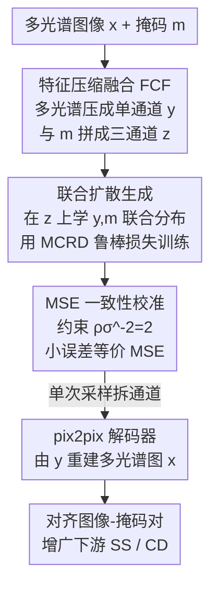

# RDF-MIG: A Robust Diffusion Framework for Masked Image Generation to Augment Semantic Segmentation and Change Detection

**会议**: CVPR 2026  
**论文**: [CVF Open Access](https://openaccess.thecvf.com/content/CVPR2026/html/Cao_RDF-MIG_A_Robust_Diffusion_Framework_for_Masked_Image_Generation_to_CVPR_2026_paper.html)  
**代码**: 待确认  
**领域**: 图像生成 / 扩散模型 / 遥感数据增广  
**关键词**: 掩码图像生成, 鲁棒扩散损失, 相关熵, 多光谱遥感, 变化检测

## 一句话总结
针对遥感里语义分割（SS）与变化检测（CD）标注稀缺、且现有生成方法各管一摊、不支持多光谱、对噪声样本不鲁棒的问题，本文提出 RDF-MIG：用特征压缩融合（FCF）把多光谱图像与掩码塞进一个三通道张量做联合扩散生成，同时用基于相关熵的 MCRD 鲁棒损失加 MSE 一致性校准来抑制重尾噪声，从而一套框架同时为 SS 和 CD 合成对齐的图像-掩码对并提升下游性能。

## 研究背景与动机
**领域现状**：语义分割和变化检测是遥感影像分析的核心技术，但都依赖大量像素级标注，而高分辨率卫星影像采集贵、人工标注累、很多数据集还因安全/政策原因不公开。用生成模型合成带标注数据来扩充训练集，已成为比传统数据增广更强的替代方案。

**现有痛点**：现有遥感生成方法是"单任务割裂"的：面向分割的（SatSynth、SegDiff）生成不了变化掩码；面向变化检测的（ChangeAnywhere、Changen）要么依赖每个时相的语义掩码（用不了 LEVIR-CD+ 这种只有双时相图 + 变化掩码的数据），要么用 copy-paste 只改局部、生成样本和原图差别太小；即便 ChangeDiff 去掉了掩码依赖，也只服务变化检测、做不了语义分割。更普遍的是，这些方法几乎都只生成 RGB、无法利用部分遥感数据集的多光谱信息，且大多只关心图像-掩码合成策略、忽视了噪声样本对训练的影响，缺乏鲁棒性。

**核心矛盾**：联合生成图像和掩码时，对齐误差和标注噪声会诱发重尾（heavy-tailed）残差，而扩散模型默认的 MSE 训练目标对大误差极其敏感——大误差会贡献巨大梯度，把权重往错误方向推；常见的鲁棒替代（L1/Huber）虽比 MSE 温和，但在重尾/非高斯噪声下仍然不够，甚至还会朝错误方向更新。于是"既要联合生成对齐的图像-掩码对、又要扛得住噪声"成了核心难点。

**本文目标**：(1) 一套框架同时支持 SS 和 CD 的图像-掩码对生成，且 CD 不再需要额外的逐时相语义掩码；(2) 支持多光谱生成；(3) 设计一个对重尾噪声鲁棒、又能在干净样本上保持 MSE 精度的扩散损失。

**切入角度**：把"图像特征 + 掩码"建模成一个联合分布，让单次反向扩散过程同时采出图像和掩码；噪声问题则从信息论的相关熵准则切入，用核化的信息势替代矩约束来自适应压制离群梯度。

**核心 idea**：FCF 把多光谱图 + 掩码压成三通道张量喂给 RGB 预训练扩散模型做联合生成，MCRD 损失 + MSE 一致性校准让训练在干净样本上等价于 MSE、在重尾噪声上自动衰减梯度。

## 方法详解

### 整体框架
RDF-MIG 的整条管线是：输入多光谱遥感图像 $x \in \mathbb{R}^{H\times W\times a}$ 和它的掩码 $m$，先由 FCF 把多光谱通道按权重压成一张保结构的单通道特征 $y$，再把 $y$ 和掩码 $m$ 在通道维拼成三通道张量 $z \in \mathbb{R}^{H\times W\times 3}$；扩散模型在 $z$ 上学习 $(y,m)$ 的联合分布，并用 MCRD 鲁棒损失训练；推理时只需一次扩散采样得到 $\tilde z$，按通道拆回 $(\tilde y, \tilde m)$，再由一个 pix2pix 解码器把特征 $\tilde y$ 重建成多光谱图像 $\tilde x$，最终产出严格对齐的图像-掩码对 $(\tilde x, \tilde m)$ 去增广下游 SS / CD。三通道设计是关键工程点——它让框架能直接复用并微调 RGB 预训练的大扩散模型（LDM/SD）。

### 关键设计

**1. 特征压缩融合（FCF）：把多光谱图 + 掩码塞进三通道以联合生成并复用 RGB 先验**

痛点是：要让扩散模型联合采出图像和掩码，若在像素空间直接拼接多光谱图（$a$ 通道）和掩码，会让通道维膨胀、且和 RGB 预训练扩散模型不兼容。FCF 的做法是两步——先对 $a$ 个波段做通道维加权压缩得到保结构的单通道特征图 $y(i,j)=\sum_{k=1}^{a} w_k \cdot x_k(i,j)$，其中 $\sum_k w_k = 1$（实现里用均匀权 $w_k = 1/a$）；再把 $y$ 与掩码 $m$ 沿通道拼接（Concat 算子 $A\oplus B$）凑成三通道张量 $z$。对 CD，双时相图 $x_A, x_B$ 各压成 $y_A, y_B$，与变化掩码 $m_{cd}$ 拼成 $z$；对 SS，多光谱图拆成 RGB 与其它光谱分别编码再与分割掩码拼接。这个三通道结构恰好对上 RGB 预训练扩散模型的输入，于是能直接复用、微调 LDM 这类大模型，同时把多光谱信息和掩码都编码进了扩散学习的目标。FCF 与具体扩散模型（DDPM/LDM/DDIM）和任务无关，只负责"怎么组织输入让扩散去学联合分布"。

**2. MCRD 损失：用相关熵准则把重尾噪声梯度自适应压下去**

扩散默认的 MSE 目标 $\min \mathbb{E}\,\|f_\theta(x_t,t)-\varepsilon\|^2$ 对大误差敏感，L1/Huber 也扛不住重尾。本文从相关熵准则出发，用核化的信息势替代矩惩罚，定义 MCRD 损失 $\text{Loss}_{MCRD}(x)=\mathbb{E}[\rho(1-\exp(-x^2/2\sigma^2))]$，其中 $\exp(-x^2/2\sigma^2)$ 是相关熵项、$\sigma$ 是核宽、$\rho$ 是缩放参数。把它套到逐步噪声预测上，训练目标变成 $\min \mathbb{E}[\rho(1-\exp(-\|f_\theta(x_t,t)-\varepsilon\|^2/2\sigma^2))]$，对应梯度带一个指数加权因子 $\rho\sigma^{-2}\exp(-e^2/2\sigma^2)$（$e=f_\theta(x_t,t)-\varepsilon$ 为误差）。这个因子的妙处在于：误差小时它接近常数、梯度行为像 MSE；误差大时指数项衰减到接近零，于是大误差梯度被强烈下调，强噪声下甚至"停下当前更新"，阻断离群样本把权重往错误方向带。作者据此论证 MCRD 在正常误差下匹配 MSE、在噪声下自动衰减梯度，是首次把相关熵适配到扩散训练。

**3. MSE 一致性校准：用一个闭式约束让 MCRD 干净样本上等价 MSE、还省去重新调参**

引入新损失最怕"得重新调一整套超参"。本文对 MCRD 梯度在 $e\to 0$ 做泰勒展开，得到 $g_{mcrd,\theta}=\mathbb{E}[\rho\sigma^{-2}(e-\frac{e^3}{2\sigma^2}+o(e^3))\frac{\partial e}{\partial \theta}]$，对比 MSE 梯度 $g_{mse,\theta}=\mathbb{E}[2e\frac{\partial e}{\partial \theta}]$，要让一阶项对齐就需约束 $\rho\sigma^{-2}=2$。在此约束下小误差时 $g_{mcrd,\theta}\approx g_{mse,\theta}$，所以干净样本上保持 MSE 级精度、大误差时又自动降权离群；更实用的是，MSE 训练里成熟的超参可几乎原样复用，只需调核宽 $\sigma$。作者还给了选 $\sigma$ 的理论依据：对二阶导分析，给定斜率容差 $\beta\in(0,1)$ 要求 $\frac{3e_{max}^2}{2\sigma^2}\le\beta$，得到核宽选择规则 $\sigma\ge e_{max}\sqrt{3/2\beta}$，并指出损失梯度在 $e=\sigma$ 处由增转减、在 $[\sigma,\sqrt{3}\sigma]$ 区间快速下降。为方便调参又把 $\rho=2\sigma^2$ 重参数化，超参收敛到只剩一个 $\sigma$。

**4. pix2pix 解码器：从单通道特征还原多光谱图像并保持像素对齐**

由于 FCF 在编码时保持了图像-掩码的像素级对齐，解码端用 pix2pix 把低维特征 $\tilde y$ 重建回多光谱图像 $\tilde x$。解码器含一个 U-Net 生成器 $G$（把 $y\in\mathbb{R}^{H\times W\times 1}$ 解码成 $\tilde x\in\mathbb{R}^{H\times W\times a}$）和一个 PatchGAN 判别器 $D$（判局部真实性以引导细节/纹理/边界）。判别器最小化 $L_D=-\mathbb{E}_{y,x}[\log D(y,x)]-\mathbb{E}_y[\log(1-D(y,G(y)))]$，生成器最小化条件对抗损失加 L1 重建项 $L_G=-\mathbb{E}_y[\log D(y,G(y))]+\lambda\mathbb{E}_{y,x}[\|x-G(y)\|_1]$，$\lambda$ 平衡感知质量与重建精度。这一步把"扩散只在压缩特征空间生成"和"最终要多光谱图像"衔接起来。

### 损失函数 / 训练策略
扩散骨干用 DDPM，数据统一裁到 $128\times128$ 训练，学习率 1e-4、batch size 20；SS 在 Hi-CNA 训 300 epoch、WHU Building 600 epoch，CD 在 Hi-CNA 和 LEVIR-CD+ 各训 1000 epoch。FCF 用均匀波段权 $w_k=1/a$。MCRD 取 $\sigma=0.2$、$\rho=0.08$；Huber 取 $\delta=0.2$ 以在相近误差量级触发鲁棒性，其余设置与 MSE 一致。各生成方法均合成两倍于训练集规模的合成数据。

## 实验关键数据

### 主实验
评测方式是"间接评质量"：用各方法合成的数据训练下游 SS（U-Net / Seg-Net）和 CD（SNU-Net / STANet）模型，比下游 IoU/F1/Recall，越高代表合成数据质量越好；下游模型只用合成数据训练。

| 方法 | Hi-CNA(SS) U-Net IoU | Hi-CNA(CD) SNU-Net IoU | LEVIR-CD+ SNU-Net IoU | 适用任务 |
|------|------|------|------|------|
| SatSynth | 41.57 | — | — | 仅 SS |
| ChangeDiff | — | 44.77 | 45.81 | 仅 CD |
| Changen | — | 31.82 | — | 仅 CD（需语义掩码） |
| Ours | 44.13 | 50.00 | 48.26 | SS + CD |
| Ours+NIR | 45.20 | 51.07 | — | SS + CD（多光谱） |

RDF-MIG 是表里唯一同时适用 SS 和 CD、且 CD 不需额外语义掩码的方法，下游性能也普遍最高；引入 NIR 多光谱信息后在 Hi-CNA 上还能进一步提升（SS IoU 44.13→45.20，CD IoU 50.00→51.07）。

### 消融实验
合成图像质量（FID/sFID 越低越好）与不同损失对下游的影响：

| 配置 | Hi-CNA(SS) FID↓ | WHU Building FID↓ | Hi-CNA(CD) FID↓ |
|------|------|------|------|
| Ours(MSE) | 35.23 | 47.16 | 36.01 |
| Ours(MCRD) | 27.38 | 17.05 | 29.85 |
| SatSynth | 33.61 | 45.07 | — |
| ChangeDiff | — | — | 32.15 |

不同损失训练 RDF-MIG 再看下游性能（IoU）：

| 损失 | Hi-CNA(SS) U-Net | WHU(SS) U-Net | Hi-CNA(CD) SNU-Net |
|------|------|------|------|
| MSE | 42.28 | 40.59 | 45.62 |
| Huber | 42.97 | 41.01 | 46.31 |
| MCRD | 44.13 | 41.88 | 50.00 |

### 关键发现
- MCRD 损失是质量提升主力：把 Ours(MSE) 换成 Ours(MCRD)，Hi-CNA(SS) FID 从 35.23 降到 27.38、WHU Building 从 47.16 骤降到 17.05，且下游 IoU 全面优于 MSE 和 Huber（CD 上 SNU-Net 45.62→50.00，提升最明显）。
- 鲁棒性排序 MCRD > Huber > MSE 在 SS 和 CD 上一致成立，印证相关熵对重尾噪声的压制比 L1/Huber 更有效。
- 多光谱有真实增益：Ours+NIR 相比纯 RGB 的 Ours 在下游 SS/CD 上进一步涨点，说明 FCF 确实把多光谱信息用起来了。
- Changen 这类 copy-paste 方法 FID 虚低（Hi-CNA CD 仅 7.98）但下游增益有限，因为它只改局部、生成样本与原图差别太小，FID 低不代表对训练有用。

## 亮点与洞察
- 把"单任务割裂"的遥感生成统一成"联合分布建模"：FCF 用三通道这一巧设计同时塞下图像特征和掩码，还顺带复用了 RGB 大模型先验，一举解决多任务 + 多光谱 + 复用预训练三件事。
- MCRD 最巧的是 MSE 一致性校准：用一个闭式约束 $\rho\sigma^{-2}=2$ 让新损失"小误差等价 MSE、大误差自动降权"，既拿到鲁棒性又几乎不增加调参负担，甚至能直接继承成熟 MSE 模型的参数。
- 核宽 $\sigma$ 的选择有理论规则 $\sigma\ge e_{max}\sqrt{3/2\beta}$，把"调参玄学"变成可解释的工程旋钮，这种可解释性在鲁棒损失工作里不多见。
- "用相关熵替代矩惩罚来抗重尾"的思路可迁移到其他联合生成/对齐噪声场景（如医学图像-掩码联合合成）。

## 局限与展望
- 分辨率受限：为公平对比统一裁到 $128\times128$ 训练，高分辨率需外接超分模块（会引入混淆变量），框架本身的高分能力未充分验证。
- 扩散骨干为 DDPM、采样仍偏慢，未在 LDM/DDIM 等更快采样器上系统验证生成效率。
- FCF 的波段融合用的是均匀权 $w_k=1/a$，未探索学习式波段权重，可能未充分利用不同光谱波段的判别性。
- 评测以遥感 SS/CD 为主，跨域（如自然图像、医学）泛化性尚未验证。

## 相关工作与启发
- **vs SatSynth / SegDiff（分割生成）**: 它们只能联合生成 RGB 图像 + 分割掩码、做不了变化检测且不支持多光谱；RDF-MIG 一套框架覆盖 SS 与 CD，并能多光谱生成。
- **vs Changen / ChangeAnywhere（变化检测生成）**: 它们靠 copy-paste 局部编辑、需逐时相语义掩码，用不了只有双时相图+变化掩码的数据集；RDF-MIG 联合扩散直接生成对齐对、不需额外语义掩码。
- **vs ChangeDiff**: ChangeDiff 去掉了语义掩码依赖但只服务 CD、FID 靠微调 SD 取胜；RDF-MIG 既能做 SS 又能做 CD，且用 MCRD 后在 FID/sFID 上反超 ChangeDiff。
- **vs L1/Huber 鲁棒扩散损失**: 它们对大误差只是"封顶"、重尾下仍朝错误方向更新；MCRD 用相关熵自适应衰减离群梯度，强噪声下直接停更，鲁棒性更强且保持 MSE 一致性。

## 评分
- 新颖性: ⭐⭐⭐⭐ 首次把相关熵适配扩散训练 + 三通道 FCF 统一多任务多光谱生成
- 实验充分度: ⭐⭐⭐⭐ 覆盖 3 数据集 × SS/CD × 多下游模型 + 损失消融，但分辨率与骨干较受限
- 写作质量: ⭐⭐⭐⭐ 损失推导与核宽选择规则给得清楚，符号略密集
- 价值: ⭐⭐⭐⭐ 遥感标注稀缺场景的实用数据增广方案，鲁棒损失思路可迁移

<!-- RELATED:START -->

## 相关论文

- [\[CVPR 2026\] Semantic Scale Space: A Framework for Controllable Image Abstraction](semantic_scale_space_a_framework_for_controllable_image_abstraction.md)
- [\[CVPR 2026\] UniVerse: A Unified Modulation Framework for Segmentation-Free, Disentangled Multi-Concept Personalization](universe_a_unified_modulation_framework_for_segmentation-free_disentangled_multi.md)
- [\[CVPR 2026\] OpenDPR: Open-Vocabulary Change Detection via Vision-Centric Diffusion-Guided Prototype Retrieval for Remote Sensing Imagery](opendpr_open-vocabulary_change_detection_via_vision-centric_diffusion-guided_pro.md)
- [\[CVPR 2026\] MaskFocus: Focusing Policy Optimization on Critical Steps for Masked Image Generation](maskfocus_focusing_policy_optimization_on_critical_steps_for_masked_image_genera.md)
- [\[CVPR 2026\] MRT: Masked Region Transformer for Layered Image Generation and Editing at Scale](mrt_masked_region_transformer_for_layered_image_generation_and_editing_at_scale.md)

<!-- RELATED:END -->
