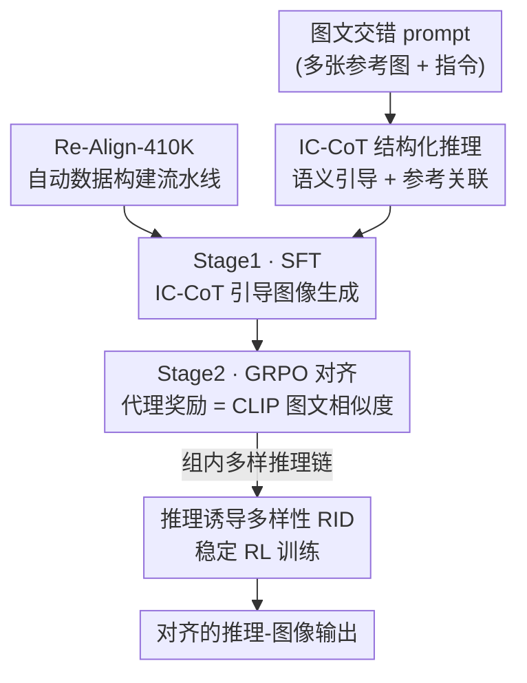

# Re-Align: Structured Reasoning-guided Alignment for In-Context Image Generation and Editing

**会议**: CVPR 2026  
**论文**: [CVF Open Access](https://openaccess.thecvf.com/content/CVPR2026/html/He_Re-Align_Structured_Reasoning-guided_Alignment_for_In-Context_Image_Generation_and_Editing_CVPR_2026_paper.html)  
**代码**: Project Page https://hrz2000.github.io/realign  
**领域**: 扩散模型 / 图像生成 / 多模态VLM  
**关键词**: 图文交错生成, 结构化推理, 链式思考, GRPO, 推理-生成对齐

## 一句话总结
针对统一多模态模型"会推理但推理用不上图像生成"的脱节问题，Re-Align 用结构化的 In-Context Chain-of-Thought（拆成语义引导 + 参考关联）把复杂图文交错任务部分降维成文生图，再用一个基于 CLIP 相似度的代理奖励做 GRPO 强化对齐，在 OmniContext 与 DreamOmni2Bench 上以可比规模刷到同档最优。

## 研究背景与动机
**领域现状**：图文交错生成与编辑（In-Context Image Generation and Editing，ICGE）让用户用「多张参考图 + 一句指令」来表达"把第一张图里的帽子换成第二张图里的杯子"这类视觉概念。近来的统一多模态模型（如 BAGEL）同时具备理解与生成能力，被寄望来扛起这类任务。

**现有痛点**：作者观察到一个很别扭的现象——BAGEL 这类模型**理解没问题、推理也写得有模有样，但最终生成的图却对不上自己写的推理**。也就是说，强大的理解/推理能力没有真正传导到下游图像生成，理解与生成之间存在「错位」(misalignment)。同时，对文生图、单图编辑有效的推理机制，搬到 ICGE 这种多图交错场景就失灵了。

**核心矛盾**：复杂图文交错 prompt 里既要"精确理解"又要"忠实执行"，而非结构化的长篇推理（prompt-expansion 式）既冗长又容易在多张参考图之间产生指代混淆，模型抓不到清晰的生成目标。

**本文目标**：(1) 给 ICGE 设计一种能真正指导生成的推理范式；(2) 让推理与生成的一致性可被优化；(3) 造一批带推理标注的高质量训练数据。

**切入角度**：与其让模型写一大段自由文本推理，不如把推理**结构化、解耦**——一部分专门给生成提供清晰的文本目标（语义引导），另一部分专门厘清每张参考图的角色（参考关联），从根上消除歧义。

**核心 idea**：用结构化的 In-Context Chain-of-Thought 把"图文交错生成"部分降维成"文生图"，再用一个能度量"推理文本 ↔ 生成图像"对齐度的代理奖励做 GRPO 强化，把理解与生成真正缝合起来。

## 方法详解

### 整体框架
Re-Align 基于统一多模态基座 BAGEL 构建。给定图文交错 prompt $P$（含若干参考图 + 一句耦合视觉概念的指令），模型先**顺序生成结构化推理文本** IC-CoT，记作 $R=\{r_1,\dots,r_M\}$，再生成图像 $I$。推理走标准语言建模目标 $L_{\text{cot}}(\theta)=\sum_i \log p_\theta(r_i\mid P, r_{<i})$；图像走 Rectified Flow 的流匹配目标 $L_{\text{img}}(\theta)=\mathbb{E}\big[\lVert v - v_\theta(x_t,t,P,R)\rVert^2\big]$，其中 $x_t=(1-t)x_0+tx_1$、$v=x_1-x_0$。

整套方法是**两阶段训练 + 一条数据流水线**：先用带 IC-CoT 标注的数据做监督微调（SFT），让模型学会"在 IC-CoT 引导下生成图像"；再用 GRPO 做推理-生成对齐（RGA），奖励信号是结构化推理里抽出的目标 caption 与生成图的 CLIP 相似度；为了解决 ICGE 里样本多样性太低导致 RL 失稳的问题，再叠加推理诱导多样性（RID）策略。所有训练数据来自自建的 Re-Align-410K 自动构建流水线。

### 关键设计

**1. IC-CoT 结构化推理：把图文交错任务解耦成"语义目标 + 参考角色"**

针对"自由推理与生成对不上、多图指代混乱"的痛点，IC-CoT 把推理过程显式拆成两个互补部分。**语义引导**用 `<out_caption>...</out_caption>` 预测结果图的 caption——这给生成提供了一个明确的文本目标，等于把复杂的图文交错生成**部分降维成文生图**，大大降低学习难度，且对"指令式"和"描述式"用户输入都兼容。**参考关联**用 `<relation_i>...</relation_i>` 逐张说明第 $i$ 张参考图在最终结果里扮演什么角色，关联数与参考图数严格相等，专门对治用户爱用"把它们放一起"这种省略指代、含糊表达带来的混淆。相比 BAGEL 那种 prompt-expansion 式长推理，IC-CoT 是**紧凑的结构化表示**：既给出清晰的语义与参考线索、降低歧义，又降低了训练与推理开销，还方便后续对齐阶段从固定标签里精确抽取关键元素。

**2. Re-Align-410K 自动数据构建流水线：造带推理标注的高质量 ICGE 数据**

ICGE 需要"多参考图任意交错"的多样组合，现成数据稀缺，作者搭了一条全自动流水线产出 41 万条带 IC-CoT 标注的数据。流程为：(a) 从角色/物体/场景三类源图池里**按任务类型采样参考图**；(b) 用 Gemini 2.5 做**自适应指令生成**（系统 prompt 引导 MLLM 关注次要视觉细节，提升指令复杂度与丰富度）；(c) 用 MLLM 生成结构化 IC-CoT 推理文本——**刻意不喂目标图**，避免额外视觉输入加剧幻觉、干扰对多图关系的判断；(d) 把参考图组 + 指令喂给 GPT-4o 合成目标图；(e) 多维过滤：用 IC-CoT 的 caption 与目标图算图文相似度（低则推理-生成不一致）、用美学/人类偏好评估视觉质量、用 OmniContextScore 评估指令遵循与语义一致性，**剔除约 20%** 后得到 410K。这条流水线区别于 OmniGen2 那种"视频抽帧"做法（基本只能做生成），能覆盖更广的编辑任务。

**3. 面向 ICGE 的代理奖励：用 CLIP 图文相似度间接对齐推理与生成**

ICGE 任务种类多、评测维度多，专门训一个奖励模型代价极高，作者绕过它，设计了一个**代理奖励**：直接度量"推理上下文 ↔ 生成图像"的对齐度。关键在于 IC-CoT 是结构化的，可以**稳定地从 `<out_caption>` 里抽出预测 caption $c$**（自由推理文本很难抽出可用的代表性语义），再用 CLIP 的图像/文本编码器算余弦相似度作为奖励 $s(x,c)=\dfrac{E(x)^\top T(c)}{\lVert E(x)\rVert\cdot\lVert T(c)\rVert}$，其中 $E,T$ 是 CLIP 的图像/文本编码器。这个奖励配合 GRPO（相比 PPO 省掉价值网络、更省显存）做策略优化，把"理解写出来的目标"真正逼着生成去对齐。

**4. 推理诱导多样性 RID：用多样推理链救活塌缩的奖励方差**

ICGE 输入里的显式视觉概念对生成施加了强约束，导致同组样本差异很小、奖励方差塌缩；归一化后即使微小波动也会被不成比例放大，RL 学不到有效信号。先前工作靠加大 SDE 噪声来增多样性，但噪声过大会损图像质量。RID 的做法是**给组内每个样本生成不同的 IC-CoT 推理链**，用多样的推理轨迹自然带出多样的输出，从而以可控方式抬高奖励方差、提供更有信息量的学习信号、稳定 GRPO 训练。消融显示：只加 RGA 不加 RID，PF 几乎不涨（因为多样性不足拖累 RL），叠上 RID 后整体才进一步提升。

### 损失函数 / 训练策略
两阶段：**Stage 1 SFT** 在 64 张 H20 上训练 100,000 步、学习率 $5\times10^{-6}$，采用「带/不带 IC-CoT」混合训练以保留推理时灵活性；**Stage 2 RGA** 只训 200 步、组大小 32、学习率 $1\times10^{-6}$，作者称这足以让对齐收敛、又能避免后续奖励黑客（reward hacking）。默认 1024×1024 分辨率、50 步去噪。

## 实验关键数据

### 主实验
评测基准为 OmniContext（图文交错生成）与 DreamOmni2Bench（生成 + 编辑）。指标用 GPT-4.1 作自动评委：PF（Prompt Following，是否完成编辑意图）、SC（Subject Consistency，视觉概念一致性）、Overall（PF 与 SC 的几何均值）。

OmniContext 平均分（越高越好，⚠️ 数值以原文为准）：

| 模型 | SINGLE Char. | MULTIPLE Char. | SCENE Char. | Average↑ |
|------|------|------|------|------|
| BAGEL | 5.48 | 5.17 | 4.07 | 5.73 |
| OmniGen2 | 8.05 | 7.11 | 6.38 | 7.18 |
| Qwen-Image-Edit-2509 | 8.35 | 7.65 | 5.16 | 7.69 |
| DreamOmni2 | 7.36 | 6.10 | 5.20 | 6.31 |
| **Re-Align（本文）** | 8.25 | **8.25** | **8.21** | **8.21** |

在可比规模/资源的方法里 Re-Align 平均分最高（8.21），尤其在 MULTIPLE / SCENE 两个更难的子任务上拿到最佳；仅在 SINGLE 子任务上略逊 Qwen-Image-Edit。（闭源的 GPT-4o 8.80、Emu3.5 8.82 因规模/资源不可比，不作同档比较。）

DreamOmni2Bench 上的 Overall（节选，越高越好）：

| 模型 | Add | Replace | Global | Local | Generation |
|------|------|------|------|------|------|
| OmniGen2 | 7.52 | 5.60 | 6.88 | 2.99 | 4.99 |
| Echo-4o | 8.51 | 4.51 | 5.16 | 2.41 | 6.59 |
| DreamOmni2* | 6.87 | 7.05 | 7.76 | 5.44 | 6.56 |
| **Re-Align（本文）** | **9.27** | **8.61** | **7.85** | **6.35** | **7.24** |

Re-Align 在编辑各子类与生成上的 PF/SC 都更高，整体优于含独立生成/编辑参数的 DreamOmni2。

### 消融实验
训练阶段与策略消融（OmniContext 子集；CLIPout 为生成图与真值 caption 的文图一致性，⚠️ 指标定义以原文为准）：

| SFT | RGA | RID | PF↑ | SC↑ | Overall↑ | CLIPout↑ |
|-----|-----|-----|-----|-----|----------|----------|
| ✗ | ✗ | ✗ | 6.92 | 5.47 | 5.80 | 32.44 |
| ✓ | ✗ | ✗ | 7.51 | 6.46 | 6.77 | 33.32 |
| ✓ | ✓ | ✗ | 7.46 | 6.54 | 6.80 | 33.50 |
| ✓ | ✓ | ✓ | **7.61** | **6.57** | **6.89** | **33.90** |

推理范式的 GSB（Good/Same/Bad）人评：IC-CoT 对 w/o CoT 净胜率高 **20%**，对 BagelCoT（非结构化推理）净胜率高 **16.25%**。

### 关键发现
- **SFT 是主要涨点来源**：从无推理到 IC-CoT 引导的 SFT，Overall 从 5.80 → 6.77，幅度最大，说明"结构化推理 + 降维到文生图"确实让学习更容易。
- **RGA 单独上不灵、要靠 RID**：只加 RGA，PF 反而从 7.51 微降到 7.46（多样性不足拖累 RL）；叠加 RID 后 PF/SC/Overall/CLIPout 全面回升并超过 SFT，印证"输出多样性是对齐训练的关键"。
- **结构化推理 > 自由推理**：IC-CoT 对非结构化的 BagelCoT 仍有 16.25% 净胜率，说明把推理拆成「语义引导 + 参考关联」比单纯写长推理更能指导生成。

## 亮点与洞察
- **把"图文交错生成"部分降维成"文生图"**：用 `<out_caption>` 预测目标 caption 给生成一个清晰文本锚点，是个很实用的简化思路——复杂多模态条件被显式翻译成一句话目标，可迁移到任何"条件复杂、目标难表达"的生成任务。
- **结构化是为了好抽取**：IC-CoT 的固定标签不仅降歧义，更让奖励阶段能稳定抽出 caption 去算 CLIP 相似度——"为下游对齐而设计的推理格式"这个思路很巧。
- **代理奖励绕开昂贵奖励模型**：用 CLIP 文图相似度当代理，避免为多任务多维度的 ICGE 专门训奖励模型，是 RL 落地复杂生成任务的低成本路径。
- **RID 用"多样推理"而非"多样噪声"**：先前靠加 SDE 噪声增多样会损质量，改成给每个样本不同推理链来抬奖励方差，既稳训练又不伤画质，是个可复用的 GRPO 稳定化 trick。

## 局限与展望
- 作者承认**模型规模与数据量受限**，相比 GPT-4o 这类产品级工作，在多样场景下的表现可能受约束。
- 当前 IC-CoT **纯文本级**，未来可扩展到视觉链式思考（visual CoT），让推理也带上图像中间状态。
- （自己补充）代理奖励依赖 CLIP 的文图相似度，对 CLIP 本身对齐能力的偏差敏感；且 RGA 只训 200 步避免 reward hacking，说明该奖励可能不够鲁棒、长训易被钻空子，奖励设计仍有提升空间。
- （自己补充）数据流水线重度依赖 Gemini 2.5 / GPT-4o 等闭源模型生成指令与目标图，复现成本与数据分布偏置值得注意。

## 相关工作与启发
- **vs BAGEL**：BAGEL 用单 transformer + Mixture-of-Transformers 做统一理解与生成，但其自由式长推理与生成对不上；Re-Align 在同一基座上换成结构化 IC-CoT + RGA 对齐，把"会推理但用不上"补成"推理直接指导生成"。
- **vs OmniGen2 / DreamOmni2**：OmniGen2 靠 MLLM 隐状态做生成、数据多来自视频抽帧（偏生成）；DreamOmni2（并行工作）用生成/编辑分离参数联合训练。两者面对复杂图文交错指令仍吃力，Re-Align 在 DreamOmni2Bench 编辑各子类上整体反超。
- **vs FlowGRPO / DanceGRPO**：它们把 GRPO 扩到文生图/视频，但奖励基本针对文条件生成；Re-Align 首次给更复杂的 ICGE 设计了可用的代理奖励与多样性策略。

## 评分
- 新颖性: ⭐⭐⭐⭐ 结构化 IC-CoT + 代理奖励 + RID 的组合针对 ICGE 的"理解-生成错位"很对症，但各组件（CoT、GRPO、CLIP 奖励）多为已有技术的巧妙拼装。
- 实验充分度: ⭐⭐⭐⭐ 两个主流基准 + 三段式消融 + GSB 人评较完整，但缺与闭源模型同条件比较、数据流水线各环节的独立消融偏弱。
- 写作质量: ⭐⭐⭐⭐ 动机（图 2 的错位对比）讲得清楚，方法解耦逻辑顺，公式与流程图齐全。
- 价值: ⭐⭐⭐⭐ 给"如何让统一模型的推理真正服务生成"提供了可复用范式与开源数据集思路，对 ICGE 社区有实用价值。

<!-- RELATED:START -->

## 相关论文

- [\[CVPR 2026\] ReasonEdit: Towards Reasoning-Enhanced Image Editing Models](reasonedit_towards_reasoning-enhanced_image_editing_models.md)
- [\[CVPR 2026\] Disentangling to Re-couple: Resolving the Similarity-Controllability Paradox in Subject-Driven Text-to-Image Generation](disentangling_to_re-couple_resolving_the_similarity-controllability_paradox_in_s.md)
- [\[CVPR 2026\] Align Images Before You Generate](align_images_before_you_generate.md)
- [\[CVPR 2026\] Thinking-while-Generating: Interleaving Textual Reasoning throughout Visual Generation](thinking-while-generating_interleaving_textual_reasoning_throughout_visual_gener.md)
- [\[CVPR 2026\] LumiX: Structured and Coherent Text-to-Intrinsic Generation](lumix_structured_and_coherent_text-to-intrinsic_generation.md)

<!-- RELATED:END -->
