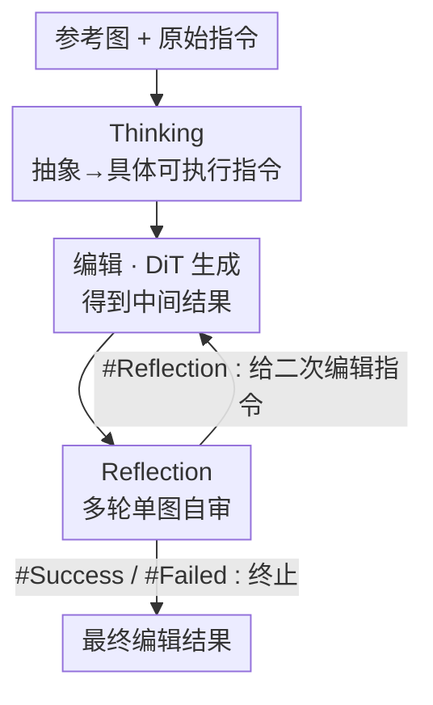

# ReasonEdit: Towards Reasoning-Enhanced Image Editing Models

**会议**: CVPR 2026  
**论文**: [CVF Open Access](https://openaccess.thecvf.com/content/CVPR2026/html/Yin_ReasonEdit_Towards_Reasoning-Enhanced_Image_Editing_Models_CVPR_2026_paper.html)  
**代码**: https://github.com/stepfun-ai/Step1X-Edit  
**领域**: 扩散模型 / 图像编辑 / 多模态VLM  
**关键词**: 指令图像编辑, 推理增强, 思考-编辑-反思, 测试时扩展, 多阶段训练

## 一句话总结
现有"MLLM 编码器 + 扩散解码器"的指令编辑模型把 MLLM 冻住、推理能力没被用上，ReasonEdit 通过联合优化解锁 MLLM 的「思考」（把抽象指令翻成具体可执行步骤）与「反思」（多轮自审自纠并决定何时停），形成 thinking–editing–reflection 闭环，在 Step1X-Edit 与 Qwen-Image-Edit 两个基座上分别带来 ImgEdit/GEdit/Kris 多项一致提升。

## 研究背景与动机
**领域现状**：指令图像编辑从早期 mask-based（BrushNet、PowerPaint）走到指令驱动（InstructPix2Pix、OmniGen），近来主流是"MLLM 编码器 + 扩散解码器"的多模态框架（Step1X-Edit、Qwen-Image-Edit），用 MLLM 同时编码参考图与指令。

**现有痛点**：这些 SOTA 系统**训练时把 MLLM 编码器冻住**，导致模型视觉推理能力很弱——遇到复杂或抽象指令（如"模拟缺钾症状""让沙漠治理显得有效"）就抓瞎。更关键的是，冻结让它们**无法享受测试时扩展（test-time scaling）** 这个在语言模型上验证有效的范式。

**核心矛盾**：推理增强在文生图领域已有不少探索（BAGEL 的 thinking、OmniGen2 的 reflection、各类 CoT），但**搬到图像编辑上几乎空白**。根本难点在于：MLLM 在「成对图像理解」时幻觉严重，尤其难捕捉参考图与编辑结果之间的差异、也难为后续编辑生成合适的修正指令。

**本文目标**：(1) 让 MLLM 学会把抽象指令拆成清晰可执行步骤；(2) 让模型能审视自己的编辑结果、自动纠错并判断何时停止；(3) 设计能稳定训练这两种能力的数据与训练范式。

**切入角度**：把"成对双图理解（原图 vs 编辑图）"这个幻觉重灾区，**重构成多个级联的单图理解任务**——单图更可靠，从而让反思变得稳健。

**核心 idea**：解锁（而非冻结）MLLM 的推理能力，让它与扩散解码器**联合优化**，原生支持 thinking–editing–reflection 工作流，把模糊指令翻清楚、把错误编辑改回来。

## 方法详解

### 整体框架
ReasonEdit 由两大组件构成：作为 **Reasoner 的 MLLM**（负责 Thinking 与 Reflection）和作为 **Generator 的 DiT**（负责出图）。作者直接拿 Step1X-Edit 与 Qwen-Image-Edit 当基座（都用 Qwen2.5VL-7B-Instruct 做文本嵌入 + 一个 DiT 扩散头），分别得到 ReasonEdit-S 与 ReasonEdit-Q 两个变体。

推理时三者交错运转成一个闭环：**Thinking** 先把原始（抽象/口语/不规范）指令翻成具体可执行指令 → **编辑（DiT 生成）** 出一张中间结果 → **Reflection** 对结果做多轮单图自审，给出三种结论之一（成功 `#Success` / 可精修 `#Reflection`+二次指令 / 失败 `#Failed`），可精修则带着新指令回到编辑环节，如此迭代直到判定成功或失败终止。训练侧则用**多阶段策略**把"理解"与"生成"逐步缝合，避免早期联合训练的冲突。

### 关键设计

**1. Thinking 机制：把抽象指令翻成具体、可执行的标准化命令**

针对"冻结 MLLM 应付不了抽象/口语指令"的痛点，Thinking 用 **Thinking Pairs**（抽象→具体指令对）训练模型做指令翻译。每对把一个含糊请求映射到一组精确、标准化、可执行的指令，例如"叶片缺钾症状" → "把叶片渲染成黄色并让叶尖干枯"；复杂请求则被**逻辑分解成一条级联序列**，如"让画面更有戏剧感和复古味" → "提高对比度 + 加棕褐色调滤镜 + 加轻微暗角"。数据构建用"分类→标注→复核"三步、以先进 VLM 当标注员：先把原始指令分成「已清晰」与「抽象复杂」两类，再双向标注（给清晰指令加抽象层、把复杂指令拆成可执行子指令），最后严格复核。最终从 50 万图文对池里（11.2 万复杂 + 38.8 万简单）筛出 **20 万**高质量对（含 5 万"无需改写"的简单指令，保证模型既能拆复杂、也能直出简单）。

**2. Reflection 机制：把成对双图理解重构成多轮单图自审，自动纠错并决定何时停**

针对"双图理解幻觉重、难捕捉编辑前后差异"的痛点，Reflection 用 **Reflection Triples** 训练迭代自纠。核心三元组为 ⟨输入图, 生成图（某次初始编辑的中间产物）, 目标图⟩，建模一条链式编辑过程。为压住单次双图评估的幻觉，作者设计**多轮单图反思流水线**：先基于输入图与指令生成一段「目标图描述」作为忠实蓝图，再做量化评估给出一致性分数与理由（专门检测冲突、遗漏、幻觉），最后据此结合原图/生成图/原指令判定，产出三种结论——**成功**（`#Success`，生成与目标一致）、**可精修**（`#Reflection`，附基于当前生成图的二次编辑指令）、**失败**（`#Failed`，存在不可挽回缺陷）；模型还对生成图做最终打分（评语义准确 + 画质），据此**决定迭代在哪一轮终止**。数据从 50 万编辑对起步，再用四种主流编辑方法额外生成 50 万中间图以丰富模态，经反思流水线 + 人工筛查得 **18 万**有效数据，成功:反思:失败约 **3:1:1**，并用 GPT-4.1 评 VIEScore。

**3. 多阶段训练：把"理解 + 生成"的联合优化拆成三步逐级缝合**

针对"早期直接联合训练理解与生成会相互冲突"的痛点，作者把复杂联合优化分解成三个聚焦阶段。**① 推理学习阶段**：只在 MLLM 的注意力线性层上用 LoRA 训 Thinking/Reflection（DiT 冻结），用标准 NTP 损失 $L_{\text{NTP}}=\mathbb{E}\big[-\sum_{k} \log p_\theta(t_k\mid t_{<k})\big]$，LoRA 既省算力又防灾难性遗忘。**② 编辑学习阶段**：冻结 MLLM、只训 DiT，用流匹配损失 $L_{\text{FM}}=\mathbb{E}\big[\lVert u_t(x\mid c)-v_t(x\mid x_0,c)\rVert_2^2\big]$，并**混入大规模 T2I 数据**（其更大规模与更广域知识能反哺多样编辑场景）。**③ 统一微调阶段**：联合微调 MLLM 与 DiT，损失 $L_{\text{joint}}=L_{\text{FM}}+\omega_{\text{NTP}}\cdot L_{\text{NTP}}$（$\omega_{\text{NTP}}=0.1$）。这种"先各自练、再联合"的渐进式把每阶段学习目标简化，收敛更平滑，也避免理解与生成早期互相干扰。

### 损失函数 / 训练策略
三阶段分别为：阶段①在 32 张 H800 上训 50,000 步、学习率 $1\times10^{-4}$；阶段②扩到 128 GPU 训 28,000 步、学习率 $1\times10^{-5}$，用了 1440 万 T2I + 240 万编辑样本；阶段③训 12,000 步、学习率 $6\times10^{-6}$、$\omega_{\text{NTP}}=0.1$，并借 FlexAttention 与打包数据格式支持理解/生成混合训练。方法对各类编辑基座通用，作者以 Step1X-Edit v1.1 与 Qwen-Image-Edit 作示范实现。

## 实验关键数据

### 主实验
评测基准：GEdit-Bench 与 ImgEdit-Bench 测基础编辑能力，KRIS-Bench 测抽象推理能力。指标由 VIEScore/GPT-4.1/GPT-4o 自动打分（GEdit 报 Overall；KRIS 报四维综合的 Overall；ImgEdit 报 1–5 分综合，⚠️ 数值以原文为准）：

| 模型 | GEdit Overall | KRIS Overall | ImgEdit Overall |
|------|------|------|------|
| Step1X-Edit v1.1（S 基座） | 6.97 | 51.59 | 3.90 |
| ReasonEdit-S（base） | 7.24 | 56.33 | 4.22 |
| ReasonEdit-S（thinking） | 7.36 (+1.7%) | 58.64 (+4.1%) | 4.18 |
| **ReasonEdit-S（thinking+reflection）** | **7.58 (+4.7%)** | **60.93 (+8.2%)** | **4.40 (+4.3%)** |
| Qwen-Image-Edit（Q 基座） | 7.56 | 56.15 | 4.27 |
| ReasonEdit-Q（base） | 7.51 | 58.05 | 4.24 |
| ReasonEdit-Q（thinking） | 7.61 (+1.3%) | 60.81 (+4.8%) | 4.27 |
| **ReasonEdit-Q（thinking+reflection）** | **7.77 (+3.4%)** | **61.57 (+6.1%)** | **4.36 (+2.8%)** |

> 括号内百分比为相对各自 base 配置的提升（ReasonEdit-S 的 GEdit +4.7%、KRIS +8.2%、ImgEdit +4.3%；ReasonEdit-Q 对应 +3.4% / +6.1% / +2.8%）。ReasonEdit-Q 在 GEdit 与 KRIS 上取得开源模型最高 Overall，并与多个闭源模型竞争力相当。

### 消融实验
多阶段训练消融（KRIS-Bench Overall，基于 ReasonEdit-S）：

| 配置 | KRIS Overall | 说明 |
|------|------|------|
| 预训练 Generator（Step1X v1.1） | 51.59 | 基线 |
| + 未微调 Qwen 推理 | 52.41 | 仅 +0.82，基座 MLLM 直接上几乎没用 |
| + 微调后 Qwen 推理 | 56.24 | 推理学习阶段显著涨点 |
| Base Generator（无推理） | 52.74 | 编辑学习阶段单独的增益 |
| Base Generator + 微调 Qwen 推理 | 58.29 | 编辑 + 推理叠加 |
| **Unified Tuned（ReasonEdit-S）** | **60.93** | 统一联合微调最优 |

### 关键发现
- **MLLM 必须做领域微调**：把预训练 Generator 配上**未微调**的 Qwen 推理只涨 0.82 分（51.59→52.41），换成**微调后**的 Qwen 推理直接到 56.24——说明通用 MLLM 不经适配抓不住图像编辑的细微之处，"解锁推理"必须真训。
- **Reflection 是大头**：thinking 单独把 ReasonEdit-S 的 KRIS 推到 +4.1%，叠上 reflection 升到 **+8.2%**，反思的多轮自纠贡献明显大于单纯 thinking。
- **统一微调有协同增益**：从 58.29（编辑+推理）到 60.93（统一微调），验证联合训练让理解与生成互补。
- **复杂任务收益更大**：在简单的 GEdit/ImgEdit 上推理机制收益较温和，在抽象的 KRIS 上提升最猛，与"thinking/reflection 专为复杂多步编辑设计"一致。

## 亮点与洞察
- **把双图理解拆成多轮单图理解**：这是治幻觉的关键 trick——MLLM 对"原图 vs 编辑图"的差异判断不可靠，改成"先写目标描述 → 单图打一致性分 → 再决策"，单图任务可靠得多，可迁移到任何需要"自我评估生成结果"的场景。
- **反思自带停止判据**：三种结论 + 最终打分让模型**自己决定迭代何时终止**，避免多步编辑里错误累积，是 test-time scaling 落地编辑任务的实用机制。
- **方法对基座通用**：同一套 thinking/reflection 在 Step1X-Edit 与 Qwen-Image-Edit 上都涨点，说明这是可插拔的能力增强而非绑死某模型。
- **多阶段防冲突**：先 LoRA 练推理（防遗忘）、再练 DiT、最后联合，是处理"理解 + 生成"互相干扰的稳妥配方。

## 局限与展望
- 作者强调在简单基准（GEdit/ImgEdit）上推理收益**不如复杂任务明显**，因 thinking/reflection 本就针对复杂指令与多步编辑设计——对简单编辑可能是额外开销。
- （自己补充）thinking–editing–reflection 是**多轮迭代**，推理时延与算力成本显著高于单次编辑，论文未充分讨论推理开销与收益的权衡。
- （自己补充）数据流水线重度依赖 GPT-4.1/先进 VLM 做标注、评分与目标描述，复现成本高、且评估器偏置可能传导进训练信号。
- （自己补充）Reflection 的一致性分数与终止判据由模型自评，存在"自评高分但实际未对齐"的潜在风险，鲁棒性需更多验证。

## 相关工作与启发
- **vs Step1X-Edit / Qwen-Image-Edit**：基座把 MLLM 冻住、推理用不上；ReasonEdit 解锁并联合优化 MLLM，在二者之上都拿到一致提升，相当于给现有编辑器"加装推理引擎"。
- **vs BAGEL / OmniGen2**：BAGEL 有 thinking、OmniGen2 有 reflection，但都聚焦图像**生成**；ReasonEdit 把 thinking + reflection 都搬到图像**编辑**，并专门设计成对理解的去幻觉方案。
- **vs Uni-CoT（并行工作）**：Uni-CoT 靠背景知识的序列执行在 KRIS 这类复杂评测上有优势，但在标准 GEdit/ImgEdit 上提升有限；ReasonEdit 在复杂与标准任务上都稳定涨点，泛化性更好。
- **vs CCA（agentic 多图反思）**：CCA 用 Gemini/GPT-4o 搭外部 agent 管线做反思；ReasonEdit 把推理内化进模型本身、端到端训练，而非依赖外部大模型编排。

## 评分
- 新颖性: ⭐⭐⭐⭐ 首次把 thinking + reflection 系统性引入图像编辑，并用"多轮单图反思"治成对理解幻觉，思路扎实；但单看 thinking/reflection 概念在生成领域已有先例。
- 实验充分度: ⭐⭐⭐⭐ 三基准 + 两基座 + 多阶段/分组件消融较完整，但缺推理开销分析、反思自评可靠性的独立验证。
- 写作质量: ⭐⭐⭐⭐ 动机与三种反思结论讲得清楚，图 2/图 3 把闭环与训练流程交代到位。
- 价值: ⭐⭐⭐⭐ 给指令编辑提供了可插拔、对基座通用的推理增强范式与数据构建配方，开源基座（Step1X-Edit）也利于落地。

<!-- RELATED:START -->

## 相关论文

- [\[CVPR 2026\] Re-Align: Structured Reasoning-guided Alignment for In-Context Image Generation and Editing](re-align_structured_reasoning-guided_alignment_for_in-context_image_generation_a.md)
- [\[CVPR 2026\] UniVerse: Empower Unified Generation with Reasoning and Knowledge](universe_empower_unified_generation_with_reasoning_and_knowledge.md)
- [\[CVPR 2026\] Meta-CoT: Enhancing Granularity and Generalization in Image Editing](meta-cot_enhancing_granularity_and_generalization_in_image_editing.md)
- [\[CVPR 2026\] Kontinuous Kontext: Continuous Strength Control for Instruction-based Image Editing](kontinuous_kontext_continuous_strength_control_for_instruction-based_image_editi.md)
- [\[CVPR 2026\] From Scale to Speed: Adaptive Test-Time Scaling for Image Editing](from_scale_to_speed_adaptive_test-time_scaling_for_image_editing.md)

<!-- RELATED:END -->
