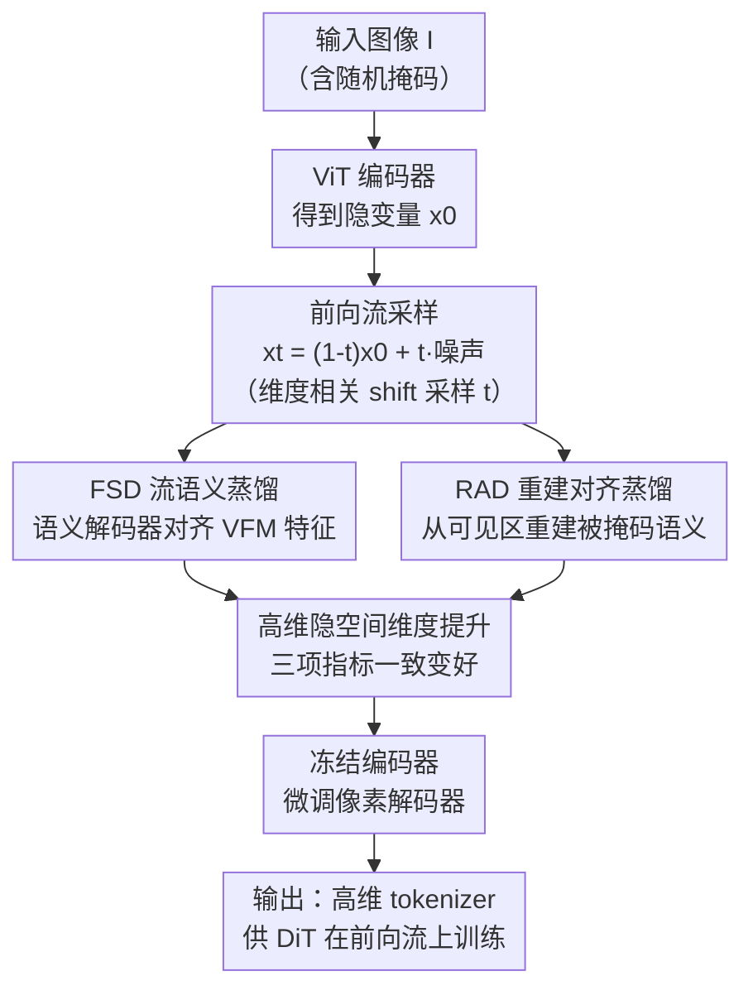

# RecTok: Reconstruction Distillation along Rectified Flow

**会议**: CVPR 2026  
**论文**: [CVF Open Access](https://openaccess.thecvf.com/content/CVPR2026/html/Shi_RecTok_Reconstruction_Distillation_along_Rectified_Flow_CVPR_2026_paper.html)  
**代码**: https://shi-qingyu.github.io/rectok.github.io/  
**领域**: 图像生成 / 扩散模型 / 视觉 tokenizer  
**关键词**: 视觉 tokenizer, 流匹配, 语义蒸馏, 高维隐空间, 扩散模型  

## 一句话总结
针对高维视觉 tokenizer「隐空间维度越高、生成质量反而越差」的矛盾，本文提出 RecTok——不再像以往那样只给干净隐变量 $x_0$ 注入语义，而是沿整条 rectified flow 的前向轨迹 $\{x_t\}$ 做语义蒸馏（FSD）并叠加掩码重建对齐（RAD），从而打破维度瓶颈，让重建/生成/判别性能随维度提升而一致变好，在 ImageNet 256 上无 CFG 即取得 gFID 1.34 的 SOTA，且收敛比以往快 7.75 倍。

## 研究背景与动机

**领域现状**：扩散生成的标准做法是先用视觉 tokenizer 把图像压到一个紧凑隐空间，DiT 完全在隐空间里训练以降低算力。为简化扩散训练，隐空间通常被限制在很低的特征维度（如 32）。近期工作通过把视觉基础模型（VFM，如 DINOv2/v3）的语义蒸馏进隐空间来加速收敛、提升生成质量。

**现有痛点**：① 低维隐空间天然限制了重建保真度与语义表达力，存在「维度 ↔ 生成质量」的根本权衡，迫使现有方法困在低维；② 即便有 VFM 蒸馏，高维 tokenizer 的生成质量**仍然不如**其低维版本，这违反直觉；③ RAE 直接加宽 DiT 来容纳高维隐变量、生成不错，但因冻结 VFM 导致重建明显落后，且没有系统研究维度如何影响重建/生成/语义。

**核心矛盾**：以往方法都把语义注入到**未加噪的 $x_0$**，但 DiT 真正训练时见到的是**前向流上的所有状态 $\{x_t \mid t\in[0,1]\}$**。作者用线性探针发现：代表性 tokenizer 的隐特征沿前向流传播时，判别能力（linear probing 精度）急剧下降——也就是说，DiT 在训练中接收到的恰恰是「语义被噪声稀释后」的特征。语义只在 $x_0$ 处好、在 $x_t$ 处烂，正是高维难训的症结。

**本文目标**：训一个高维视觉 tokenizer，使重建保真、生成质量、语义表达三者同时优秀，且随维度提升一致变好。

**切入角度**：既然 DiT 训练在前向流上，就该让**整条流**都保持语义判别力，而不是只优化 $x_0$。

**核心 idea**：把 VFM 的语义蒸馏进 rectified flow 的前向轨迹（让训练空间本身语义丰富），并用掩码重建进一步加固——用「沿流的语义一致性」代替「只在 $x_0$ 注语义」。

## 方法详解

### 整体框架
RecTok 是一个 ViT 编码器-解码器视觉 tokenizer 的训练方案。输入图像先经编码器得到隐变量 $x_0$，再与高斯噪声 $\epsilon$ 做线性插值得到前向流上的 $x_t=(1-t)x_0+t\epsilon$；$x_t$ 同时喂给两个解码器——**语义解码器**做 VFM 特征对齐（FSD），**像素解码器**做掩码区域重建（RAD）。训练完成后，语义解码器与 VFM 都被丢弃，推理时只剩编码器+像素解码器，零额外开销。关键之处在于：监督信号施加在**整条流的 $x_t$** 上，使 DiT 实际训练所处的空间始终语义丰富，从而解除了高维隐空间的优化瓶颈。

### 关键设计

**1. FSD 流语义蒸馏：让前向流上的每个 $x_t$ 都语义判别，而非只优化 $x_0$**

这是直击「DiT 见到的是被噪声稀释的 $x_t$」这一痛点的核心设计。由于前向流 $x_t=(1-t)x_0+t\epsilon$ 与速度网络无关，可以直接插值得到任意 $x_t$，再用一个**轻量语义解码器** $D_{\text{sem}}$（transformer，仅 1.5M 参数）从 $x_t$ 提语义特征，用 VFM 的图像表征 $E_{\text{VFM}}(I)$ 监督：

$$\mathcal{L}_{\text{sem}} = 1 - \cos\big(D_{\text{sem}}(x_t),\, E_{\text{VFM}}(I)\big)$$

解码器刻意做得很轻，是为了「逼迫编码器自己捕获丰富语义」——若解码器太强，会把语义负担从编码器抢走。采样 $t$ 时用维度相关的 shift 分布 $t=\frac{st'}{1+(s-1)t'},\ t'\sim\mathcal{U}(0,1),\ s=\sqrt{4096/(r^2d)}$（$r,d$ 为分辨率与维度），以适配高维隐空间的冗余。FSD 让 RecTok 在流上的判别精度甚至超过其隐特征本身（linear probing 55.40% vs 无 FSD 44.35%）。

**2. RAD 重建对齐蒸馏：用掩码重建进一步加固沿流语义**

只对齐还不够，作者借鉴掩码图像建模（MIM）「通过预测未见 patch 学到鲁棒表征」的思想，在 FSD 之上引入重建目标。具体：对输入图像施加随机掩码（mask 比例在 −0.1～0.4 之间，负值表示不掩码），只编码可见区得到 $x_0^{\text{vis}}$，再在其前向流 $x_t^{\text{vis}}=(1-t)x_0^{\text{vis}}+t\epsilon$ 上用语义解码器重建被掩码区域的 VFM 特征，$\mathcal{L}_{\text{sem}}$ 同时作用于掩码与非掩码区。消融显示「对齐 + 重建联合」优于任一单独项（gFID 2.27 vs 仅对齐 2.52 / 仅重建 2.97），且增益不来自 transformer 解码器本身（同为 transformer 时，仅对齐 2.52 → 联合 2.27）。

**3. 高维隐空间维度提升：打破「维度越高生成越差」的旧权衡**

前两个设计让语义沿流保持充分后，作者逐步把隐空间维度从 16 提到 128，惊讶地发现重建（rFID/PSNR）、生成（gFID/IS）、语义（linear probing）**三项一致变好**（128 维 vs 16 维：L.P. 55.4% vs 24.1%、gFID 2.27 vs 2.75）。改维度只动 ViT 线性头，参数量与算力几乎不变。这与以往「高维更难训、生成更差」的结论相反，作者推测高维下涌现出一个同时支撑低层重建与高层语义的**共享隐空间**。RecTok 是首个证明三者可随维度一致提升的工作。

### 损失函数 / 训练策略
tokenizer 总损失沿用常规组合再加语义项：$\mathcal{L}=\lambda_{\text{rec}}\mathcal{L}_{\text{rec}}+\lambda_{\text{per}}\mathcal{L}_{\text{per}}+\lambda_{\text{GAN}}\mathcal{L}_{\text{GAN}}+\lambda_{\text{KL}}\mathcal{L}_{\text{KL}}+\lambda_{\text{sem}}\mathcal{L}_{\text{sem}}$，取 $\lambda_{\text{rec}}=\lambda_{\text{per}}=\lambda_{\text{sem}}=1,\ \lambda_{\text{adv}}=0.5,\ \lambda_{\text{KL}}=10^{-6}$。架构为 ViT-B + RoPE + SwiGLU + RMSNorm，ImageNet-1K 训 200 epoch。**解码器微调**：联合训练后冻结编码器以保住语义，仅微调像素解码器、关闭 FSD/RAD 与 $\mathcal{L}_{\text{KL}}/\mathcal{L}_{\text{sem}}$，专门提升重建可靠性（作者明确说这不是主贡献，但对重建质量是关键一步）。DiT 用 DiT$_{\text{DH}}$-XL，ImageNet 训 800 epoch，推理 150 步 Euler、采用 AutoGuidance。

## 实验关键数据

### 主实验

ImageNet 256×256 类条件生成（无/有 guidance，⚠️ gFID 越低越好）：

| 方法 | Epochs | gFID↓ (无 guidance) | IS↑ | gFID↓ (有 guidance) |
|------|--------|--------------------|-----|---------------------|
| REPA-E | 800 | 1.83 | 217.3 | 1.26 |
| l-DeTok | 800 | 1.86 | 238.6 | 1.35 |
| RAE | 80 | 2.16 | 214.8 | — |
| **RecTok（本文）** | 600 | **1.34** | **254.6** | **1.13** |

无 CFG 下 RecTok 即取得 gFID 1.34（迄今 SOTA）；配 AutoGuidance 进一步到 1.13，与 RAE 持平但 IS 明显更高，且仅用 600 epoch（图示收敛比以往快约 7.75 倍）。

tokenizer 横向对比（ImageNet-1K，⚠️ rFID 越低越好、PSNR 越高越好）：

| Tokenizer | Params | GFlops | rFID↓ | PSNR↑ | gFID↓ |
|-----------|--------|--------|-------|-------|-------|
| SD-VAE | 84M | 445 | 0.62 | 26.04 | 8.30 |
| VA-VAE | 70M | 310 | 0.28 | 26.30 | 2.17 |
| DeTok | 176M | 44.4 | 0.52 | 23.53 | 1.86 |
| RAE | 395M | 128.9 | 0.57 | 18.98 | 1.51 |
| **RecTok** | 176M | 44.4 | 0.48 | **26.16** | **1.34** |

RecTok 在 ViT-based tokenizer 中算力最低、生成最好，PSNR 远超 RAE（26.16 vs 18.98），取得重建/生成/语义三者最佳折中。

### 消融实验

| 配置 | 关键指标 (gFID↓ / L.P. Acc.) | 说明 |
|------|------------------------------|------|
| w FSD (Cos Sim) | 2.27 / 55.40 | 完整 FSD，沿流蒸馏 |
| w/o FSD (Cos Sim) | 3.35 / 44.35 | 只对齐 $x_0$，生成与判别都掉 |
| w/o FSD (VF Loss) | 3.91 / 37.52 | 换 VA-VAE 的 VF loss，更差 |
| RAD: 仅对齐 (Transformer) | 2.52 / — | 去掉重建 |
| RAD: 仅重建 (Transformer) | 2.97 / — | 去掉对齐 |
| RAD: 重建 + 对齐 (Transformer) | **2.27** / — | 联合，最佳 |
| 维度 16 → 128 | gFID 2.75 → 2.27 | 维度越高三项一致变好 |

### 关键发现
- **FSD 贡献最大**：把语义从「只在 $x_0$」改为「沿整条流」，gFID 从 3.35 降到 2.27、linear probing 从 44.35% 升到 55.40%，验证「DiT 训练空间需要语义一致性」这一核心假设。
- **重建与对齐互补**：仅对齐 2.52、仅重建 2.97，联合 2.27，且增益不来自 transformer 架构本身。
- **维度反直觉一致提升**：16→128 维，rFID 0.74→0.65、gFID 2.75→2.27、L.P. 24.1%→55.4% 全面变好，打破旧权衡。
- **VFM 选择有维度依赖**：DINOv2 在低维（16）更好，DINOv3 在高维（128）更好；同时用两个 VFM 反而退化。故 16/32 维用 DINOv2、64+ 维用 DINOv3。
- **噪声调度权衡**：uniform 采样重建最好但生成最差，shift 采样重建略低但生成最好；因重建可由解码器微调补回，故默认 shift。

## 亮点与洞察
- **「训练空间」视角的转换很关键**：以往都盯着隐空间 $x_0$ 调语义，RecTok 指出 DiT 真正训练在 $\{x_t\}$ 上，于是把监督搬到整条前向流——一个简单却被忽视的视角切换，直接解锁了高维 tokenizer。
- **轻量语义解码器的「反向激励」很巧**：故意只给 1.5M 参数，逼编码器自己学到语义而非让解码器代劳，这个「弱解码器逼强编码器」的设计思路可迁移到其他蒸馏式表征学习。
- **首次证明维度可与质量同向**：把「高维=难训」的固有认知翻案，并给出「共享隐空间在高维涌现」的解释，对未来 tokenizer 设计有方向性价值。
- **推理零额外开销**：语义解码器与 VFM 训练完即弃，部署时和普通 tokenizer 一样轻。

## 局限与展望
- 作者承认：解码器微调虽对重建关键，但被明确划为非主贡献，其与主训练目标的相互作用未深挖。
- 自己发现：VFM 选择对维度敏感（DINOv2/v3 各擅一段），需要按维度切换，缺乏统一方案；⚠️ 维度只测到 128，更高维是否仍一致提升、何处饱和未给出。
- 改进思路：把维度相关 shift 采样 $s=\sqrt{4096/(r^2d)}$ 做成可学习调度，或探索单一 VFM 跨维度通用的蒸馏目标，减少对维度-VFM 配对的手工调参。

## 相关工作与启发
- **vs VA-VAE / DeTok（$x_0$ 语义蒸馏）**: 它们把 VFM 语义注入未加噪隐变量 $x_0$，但 $x_t$ 沿流判别力骤降；RecTok 把蒸馏搬到整条流，故高维不退化、且 linear probing 大幅领先。
- **vs RAE（直接在 VFM 高维特征空间扩散）**: RAE 加宽 DiT 容纳高维、生成好但因冻结 VFM 重建差（PSNR 18.98）；RecTok 让编码器可训并沿流加固语义，重建（26.16）和生成（1.34）双优。
- **vs SVG（残差编码器增强重建）**: SVG 保 VFM 语义同时补重建，但与 SOTA 仍有差距；RecTok 通过 FSD+RAD 在重建/生成/语义三者上同时领先。

## 评分
- 新颖性: ⭐⭐⭐⭐⭐ 「沿前向流蒸馏」的视角转换 + 首证维度与质量同向，思路新颖且反直觉
- 实验充分度: ⭐⭐⭐⭐ 主结果、tokenizer 对比、FSD/RAD/维度/VFM/噪声多组消融充分，唯维度上限与跨数据集稍欠
- 写作质量: ⭐⭐⭐⭐⭐ 用 linear probing 沿流下降的现象引出动机，逻辑清晰、图表支撑有力
- 价值: ⭐⭐⭐⭐⭐ 无 CFG gFID 1.34 SOTA、收敛快 7.75 倍、推理零额外开销，对生成式 tokenizer 设计有实用与方向价值

<!-- RELATED:START -->

## 相关论文

- [\[CVPR 2026\] Probabilistic Precipitation Nowcasting with Rectified Flow Transformers](probabilistic_precipitation_nowcasting_with_rectified_flow_transformers.md)
- [\[CVPR 2026\] CaReFlow: Cyclic Adaptive Rectified Flow for Multimodal Fusion](careflow_cyclic_adaptive_rectified_flow_for_multimodal_fusion.md)
- [\[CVPR 2026\] gQIR: Generative Quanta Image Reconstruction](gqir_generative_quanta_image_reconstruc_tion.md)
- [\[CVPR 2026\] NAMI: Efficient Image Generation via Bridged Progressive Rectified Flow Transformers](nami_efficient_image_generation_via_bridged_progressive_rectified_flow_transform.md)
- [\[CVPR 2026\] VDE: Training-Free Accelerating Rectified Flow Model via Velocity Decomposition and Estimation](vde_training-free_accelerating_rectified_flow_model_via_velocity_decomposition_a.md)

<!-- RELATED:END -->
