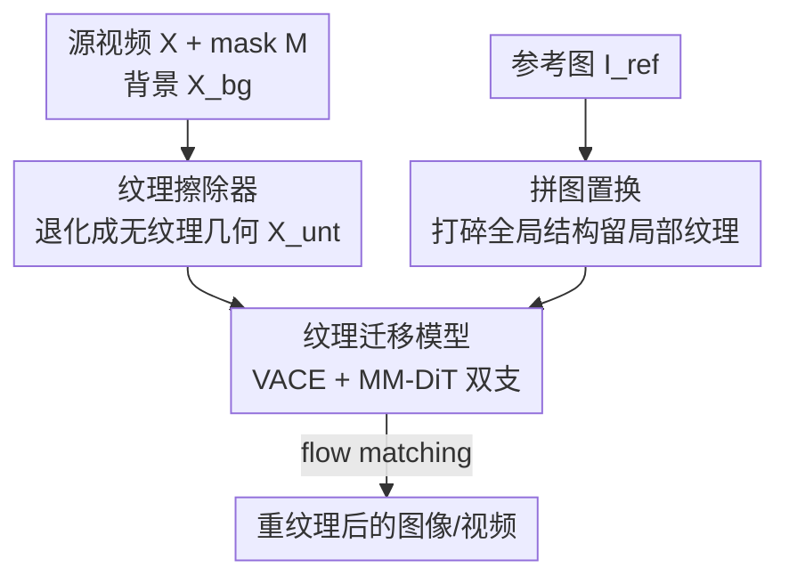

# Refaçade: Editing Object with Given Reference Texture

**会议**: CVPR 2026  
**论文**: [CVF Open Access](https://openaccess.thecvf.com/content/CVPR2026/html/Huang_Refacade_Editing_Object_with_Given_Reference_Texture_CVPR_2026_paper.html)  
**代码**: https://github.com/fishZe233/Refacade  
**领域**: 扩散模型 / 图像视频编辑  
**关键词**: 物体重纹理, 纹理-结构解耦, 拼图置换, 纹理擦除, 视频编辑  

## 一句话总结
Refaçade 把"物体重纹理"（用参考图的局部纹理重绘目标物体、但保住它原本的几何）从图像扩展到视频，核心是两招解耦——训练一个"纹理擦除器"把源物体退化成只剩几何的无纹理视频、再用"拼图置换"把参考图打散成无全局结构的纹理碎片，从而在图像和视频上都做到精准、可控的纹理迁移，定量与人工评测全面超过一众强 baseline。

## 研究背景与动机
**领域现状**：扩散模型在图像/视频编辑上已经很成熟，从 UNet 时代的 SD1.5、AnimateDiff，到 DiT 时代的 Flux、Wan2.1、HunyuanVideo，各类 inpainting 和指令编辑方法层出不穷。但有一类编辑任务一直没被认真做——**物体重纹理（Object Retexture）**：给定一张参考图，把它的表面纹理（花纹、颜色、材质）迁移到目标物体上，同时**保住目标物体原本的形状与几何**、周围区域不动。本文把这个任务首次扩展到视频域。

**现有痛点**：最直接的做法是 ControlNet——用源视频抽出的结构条件（Canny/HED/depth）锁住几何，再拿参考图喂纹理。但作者发现这条路在重纹理任务上**根本行不通**，卡在两处解耦失败：
- **结构条件没把纹理择干净**：Canny、HED、depth、normal 这些条件名义上只描述几何，实际上还残留着表面花纹、材质边界、颜色梯度——这些恰恰是要被改掉的东西，结果它们被当成"结构"保了下来，目标物体的旧纹理擦不掉。
- **参考图直接当条件会泄露结构**：把整张参考图喂进去，模型不光学走了纹理，连参考物体的形状、姿态、空间布局也一起搬过来，污染目标物体、把它的几何带歪。

**核心矛盾**：重纹理任务的本质是要**同时**做两个解耦——从源视频里剥离"纹理"只留"结构"，从参考图里剥离"结构"只留"纹理"，再把目标结构和参考纹理重新拼起来。而现成的条件提取器恰恰在这两端都做不干净。

**本文目标**：设计一套能在源端和参考端都彻底解耦纹理/结构的条件构造方式，让模型只接收"目标的纯几何 + 参考的纯纹理"。

**核心 idea**：与其指望通用条件提取器，不如**专门构造两路干净条件**——源端训一个扩散模型直接把纹理"擦"成无纹理几何，参考端用拼图置换把全局结构打碎只留局部纹理统计。

## 方法详解

### 整体框架
Refaçade 的输入是源视频 $X$、物体 mask $M$、背景视频 $X_{bg}$ 和参考图 $I_{ref}$，输出是把目标物体重纹理后的视频。整条管线就是"两路解耦 + 一次重组"：源端先过**纹理擦除器**得到只剩几何的无纹理视频 $X_{unt}$，参考端先过**拼图置换**得到打散的纹理引导，最后一个纹理迁移模型把"源的几何 + 参考的纹理"融合成结果。

模型基于 VACE 搭建、并借鉴 MM-DiT 处理不同类型条件。条件信号写作

$$c = \{\, E_{VAE}(\mathrm{Jigsaw}(I_{ref})),\; E_{VAE}(X_{unt}),\; M,\; E_{VAE}(X_{bg}) \,\}$$

整个网络用 flow matching 训练：令 $z_0 = E_{VAE}(X)$ 为目标 latent，采样 $t\sim U(0,1)$、$\varepsilon\sim N(0,I)$，定义线性插值路径 $z_t = (1-t)z_0 + t\varepsilon$ 与目标速度 $v^\star(z_t,t) = \varepsilon - z_0$，速度网络 $v_\theta(z_t,c,t)$ 用如下损失训练：

$$\mathcal{L} = \mathbb{E}_{(z_0,c)}\,\mathbb{E}_{t,\varepsilon}\big[\,\|v_\theta(z_t,c,t) - v^\star(z_t,t)\|_2^2\,\big]$$

架构上分两支：**control 分支**把背景、无纹理视频、mask 的 latent 沿通道拼接走专用 condition 层，参考图 latent 走单独的 reference 层（让"参考 token"和"源 token"用不同参数但共享同一注意力）；**main 分支**把参考图 prepend 到带噪 latent 的首帧，control block 的 hidden state 加回对应层。

### 关键设计

**1. 纹理擦除器：把源物体退化成"只剩几何"的无纹理视频**

针对"结构条件择不干净纹理"的痛点，作者不再用 Canny/HED/depth，而是构造一种**无纹理几何表征**作为条件。灵感来自 3D mesh——mesh 天然把几何（顶点/面）和外观（纹理坐标/材质）分开存储，因此把物体重建成 mesh 再用纯灰材质渲染，就能得到只有几何、没有任何颜色纹理的画面。但视频逐帧做 3D 重建太慢（单段视频要几分钟），无法用于大规模训练。于是作者**把"擦纹理"这件事蒸馏进一个 2D 扩散模型**：训一个 texture remover，直接学"有纹理帧 → 无纹理帧"的映射，推理时不需要任何 3D 重建。

训练数据靠 3D 渲染合成：先收集 7.2 万个物体网格（来自真实视频首帧和文生图），每个 mesh 在相同相机/光照下渲染两遍——一遍贴满纹理、一遍用统一灰色 Lambertian 材质去掉所有纹理与 albedo，配上不同相机轨迹/光强/姿态的增强，共得到约 57.6 万对"有纹理-无纹理"视频。擦除器基于 VACE，只更新 control block、冻结 main 分支（把学习限制在"外观→几何"这部分）。为了不让这个擦除器拖慢整套系统，作者再用 **DMD 蒸馏**把采样步数从 50 步压到 3 步，同时仍能输出高质量无纹理视频。

**2. 拼图置换：把参考图打碎成无全局结构的纹理碎片**

针对"参考图直接当条件会泄露结构"的痛点。训练时若直接拿目标视频首帧（去背景）当参考图，参考和目标会共享完全相同的空间结构，模型就会偷懒去学"空间对齐"而不是"纹理迁移"；一到推理阶段参考和目标形状/姿态不同就彻底崩。

拼图置换（Jigsaw Permutation）就是为弥合这个训练-推理鸿沟：从参考图前景区域裁出方块 patch（含背景像素超过 10% 的 patch 丢弃以保证纹理纯度），**随机打乱、随机翻转**后重新拼成一个新的矩形布局。关键细节是——把拼好的参考碎片缩放到训练画布宽度、但高度随 patch 数量自由变化，patch 尺寸从 $16\times16$ 到物体最大内接矩形不等，使得拼出来的参考块和源物体在长宽比、空间布局上都不一样。这样全局轮廓被彻底破坏、但各种尺度的局部纹理统计被保留，逼着模型只能去抽取"局部纹理花纹"而非记忆"全局空间排布"，从而在推理时即便参考和源物体形状/尺寸/姿态差异巨大也能稳定迁移纹理。

### 损失函数 / 训练策略
主模型用上文的 flow-matching 损失训练，分两阶段：**Stage-1 大规模预训练**在约 180 万 WebVid-10M 过滤视频 + 90 万 SelfForcing 合成视频 + 80 万 SD3.5-Large 合成图像上训 2 epoch（96×A800，18k 步，约 120 小时）；**Stage-2 高质量微调**在 18 万 Pexels 真实视频上训 2 epoch（32×A800，2.8k 步，约 28 小时）。两阶段都用常数学习率 $1\times10^{-5}$、梯度检查点、混合精度。纹理擦除器单独训练（VACE 初始化，18k 步约 38 小时）后再做 DMD 蒸馏（300 步）压到 3 步采样。

## 实验关键数据

### 主实验（图像 UHRSD 988 张 + 视频 Pexels 50 段）
背景指标看保真（MSE/PSNR/SSIM/LPIPS），前景指标看与参考纹理的相似度（CLIP/DINO/DreamSim↑、前景 LPIPS↓、GLCM↑），并辅以 GPT-5/Gemini 打分与用户偏好。

| 数据集 | Method | 背景 PSNR↑ | 前景 CLIP↑ | 前景 DINO↑ | DreamSim↑ | GPT-5↑ | 用户偏好↑ |
|--------|--------|------|------|------|------|------|------|
| 图像 | Flux-Fill | 31.92 | 0.6900 | 0.2091 | 0.7134 | 2.71 | 0.16 |
| 图像 | NanoBanana | 27.47 | 0.6981 | 0.2582 | 0.7316 | 2.65 | 0.16 |
| 图像 | **Ours(stage2)** | **36.20** | **0.7774** | **0.4516** | **0.8184** | **2.89** | **0.89** |
| 视频 | VideoPainter | 32.89 | 0.7130 | 0.1554 | 0.7173 | 1.92 | 0.06 |
| 视频 | AnyV2V | 22.77 | 0.7178 | 0.1603 | 0.7253 | 2.21 | 0.09 |
| 视频 | **Ours(stage2)** | **36.48** | **0.7524** | **0.3241** | **0.7742** | **2.82** | **0.74** |

图像上 stage2 在背景重建（PSNR 36.20）和前景对齐（CLIP 0.7774、DINO 0.4516、DreamSim 0.8184，前景 LPIPS 最低 0.6181）全面领先；视频上同样取得最优背景重建并大幅改善前景对齐，时序稳定性（EWarp 1.4248）与 stage1（1.3510）相当。用户偏好从次优方法的 ~0.5 拉到 0.74–0.89，差距悬殊。

### 消融实验（训练管线，表 3）
| 配置 | 参考端 | 结构条件 | 前景 DINO↑ | 前景 LPIPS↓ | GLCM↑ | GPT-5↑ |
|------|--------|----------|------|------|------|------|
| Ab-1 | w/o Jigsaw | Canny | 0.1859 | 0.7674 | 0.7006 | 2.10 |
| Ab-2 | w/ Jigsaw | Canny | 0.1906 | 0.7347 | 0.7297 | 2.42 |
| Ab-3 | w/ Jigsaw | HED | 0.1990 | 0.7484 | 0.7258 | 2.44 |
| Ab-5 | w/ Jigsaw | Depth | 0.1790 | 0.7532 | 0.7608 | 2.21 |
| **Ab-6** | **w/ Jigsaw** | **Untextured** | **0.2622** | **0.6540** | **0.8830** | **2.72** |

### 关键发现
- **两招缺一不可**：对比 Ab-1（w/o Jigsaw + Canny）和 Ab-2（w/ Jigsaw + Canny），仅加拼图置换就把前景 LPIPS 从 0.7674 降到 0.7347、GPT-5 从 2.10 升到 2.42——证明参考端打散结构确实有用；再把结构条件从 Canny/HED/Depth 换成擦除器的 Untextured（Ab-6），前景 DINO 从 ~0.19 跳到 0.2622、GLCM 从 ~0.73 跳到 0.8830，说明"无纹理几何条件"比传统边缘/深度图干净得多。
- **纹理擦除器是前景纹理迁移的主功臣**：传统结构条件残留的纹理会把目标旧纹理保留下来、压低前景与参考的相似度；换成纯几何条件后前景指标整体跃升。
- **Patch 尺寸有讲究**（表 4）：拼图 patch 太小会破坏纹理统计、太大又留住结构，作者做了 patch size 的敏感性分析以取折衷。

## 亮点与洞察
- **"擦纹理"这件事被蒸馏成一个 2D 网络**：用 3D mesh 双渲染（贴纹理 vs 灰材质）合成配对数据，再训一个扩散模型直接在 2D 空间学"擦纹理"，绕开了逐帧 3D 重建的巨大开销——这是把昂贵的 3D 解耦能力"摊还"进一次性训练的巧妙思路，可迁移到任何需要"几何条件但不要外观"的编辑任务。
- **拼图置换是一个极简却对症的正则**：仅靠裁块-打乱-翻转-重排就破坏全局结构、保住局部纹理，干净利落地堵住了"参考结构泄露"，且天然弥合训练（参考=目标首帧）与推理（参考≠目标）的分布鸿沟。
- **DMD 蒸馏让辅助模块不拖累主系统**：把擦除器从 50 步压到 3 步，是工程上让"额外条件提取器"可用的关键。

## 局限与展望
- 整套方案依赖高质量 3D 重建（Hunyuan3D）来构造擦除器训练数据，重建质量差的物体类别可能让无纹理条件不准；⚠️ 论文未充分讨论对薄壳/透明/反光等难重建物体的鲁棒性。
- 纹理迁移本质只搬"表面外观"，对需要改变材质语义（如把布料变金属、伴随光照/高光改变）的场景能力有限。
- 拼图置换破坏了纹理的长程空间规律（如条纹方向、logo 整体性），对**有全局结构的纹理**（文字、图案）可能反而迁移不准——这是"打碎结构"的代价。

## 相关工作与启发
- **vs ControlNet/通用结构条件（Canny/HED/Depth）**: 它们用通用边缘/深度图锁结构，但纹理择不干净；本文用专门训练的纹理擦除器产出"纯几何"条件，消融里前景相似度大幅领先。
- **vs ZeST / Pair Diffusion 等外观编辑**: 它们直接拿参考图做外观条件、易泄露参考结构；本文用拼图置换打散参考全局布局，只迁移局部纹理。
- **vs VACE / VideoPainter 等视频编辑/inpainting**: 本文基于 VACE 但针对重纹理重构了双支条件处理（control 层 + reference 层 + MM-DiT），把"重纹理"作为一个独立任务首次系统化到视频域。

## 评分
- 新颖性: ⭐⭐⭐⭐ 首次把物体重纹理扩展到视频，两路解耦（擦除器+拼图置换）思路清晰对症。
- 实验充分度: ⭐⭐⭐⭐⭐ 图像/视频双 benchmark、十余个强 baseline、自动+LLM+用户三套评测、多组消融。
- 写作质量: ⭐⭐⭐⭐ 痛点-方案对应明确，公式与数据集构建讲得清楚。
- 价值: ⭐⭐⭐⭐ 提供了一个干净的"纹理-结构解耦"范式，擦除器+拼图置换两个组件都有迁移价值。

<!-- RELATED:START -->

## 相关论文

- [\[CVPR 2026\] OneHOI: Unifying Human-Object Interaction Generation and Editing](onehoi_unifying_human-object_interaction_generation_and_editing.md)
- [\[CVPR 2026\] NI-Tex: Non-isometric Image-based Garment Texture Generation](ni-tex_non-isometric_image-based_garment_texture_generation.md)
- [\[CVPR 2026\] Object-WIPER: Training-Free Object and Associated Effect Removal in Videos](object-wiper_training-free_object_and_associated_effect_removal_in_videos.md)
- [\[CVPR 2026\] Semantics Lead the Way: Harmonizing Semantic and Texture Modeling with Asynchronous Latent Diffusion](semantics_lead_the_way_harmonizing_semantic_and_texture_modeling_with_asynchrono.md)
- [\[CVPR 2026\] MultiBanana: A Challenging Benchmark for Multi-Reference Text-to-Image Generation](multibanana_a_challenging_benchmark_for_multi_reference_text_to_image_generation.md)

<!-- RELATED:END -->
