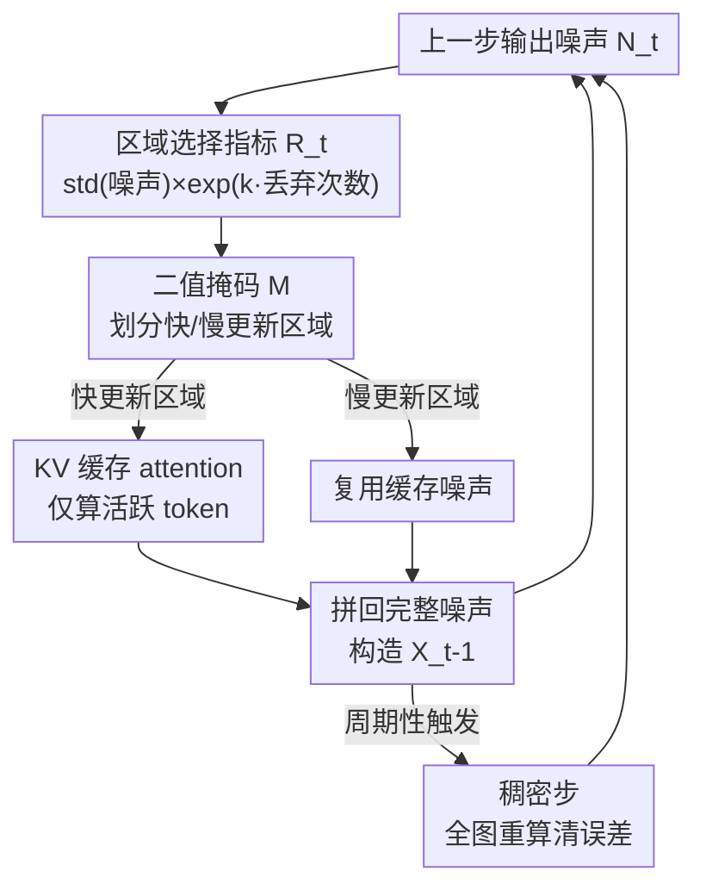

# Region-Adaptive Sampling for Diffusion Transformers

**会议**: CVPR 2026  
**论文**: [CVF Open Access](https://openaccess.thecvf.com/content/CVPR2026/html/Liu_Region-Adaptive_Sampling_for_Diffusion_Transformers_CVPR_2026_paper.html)  
**代码**: 无  
**领域**: 扩散模型 / 图像生成  
**关键词**: 扩散加速、Diffusion Transformer、区域自适应采样、KV 缓存、免训练

## 一句话总结
RAS 是一个免训练的采样策略：每一步只把模型当前关注的「快更新区域」送进 DiT 去噪、其余「慢更新区域」直接复用上一步缓存的噪声，靠这种空间上非均匀的计算分配在 Stable Diffusion 3 和 Lumina-Next-T2I 上拿到 2.36×/2.51× 加速，质量几乎无损。

## 研究背景与动机
**领域现状**：扩散模型生成质量很强，但采样要在反向时间上逐步解 SDE/ODE，每一步都得跑一遍大网络的前向，这种顺序依赖是实时化的根本瓶颈。现有加速主流是两条路——减少采样步数（蒸馏、consistency model、rectified flow）或跨步复用中间特征（DeepCache、Δ-DiT）。

**现有痛点**：这些方法都把整张图的所有区域**一视同仁**地处理，不管某个区域是细节丰富的前景主体还是平滑重复的背景，都给同样多的计算。可一张图里不同区域的结构/语义复杂度差别很大：前景细节需要更多步精修才能保真，平滑背景其实可以更激进地少算。

**核心矛盾**：均匀采样让「省算力」和「保细节」直接对立——想加速只能整体减步数，而整体减步数最先牺牲的恰恰是需要细修的关键区域。问题根子在于**计算被均匀摊到所有 token 上，没有按区域重要性分配**。

**切入角度**：作者观察到两个现象（图 4）：① DiT 在采样过程中会逐渐聚焦到语义上有意义的区域；② 这些聚焦区域在相邻步之间有很强的时间连续性——他们用自己提的 output-noise 指标对 token 排序，再用 NDCG 量化相邻步排序相似度（图 3），发现连续性确实很高。既然某一步几乎不被关注的区域，下一步大概率还是不被关注，那它就可以被跳过。而 DiT 用 RoPE 把位置信息注入 embedding、token 在空间上相互独立，天然支持「掩掉/重排部分 token」而不破坏位置编码——这正是 U-Net 做不到的灵活性。

**核心 idea**：用「按区域分配更新比例」代替「全图均匀采样」——只刷新模型当前聚焦的区域，背景区域复用缓存噪声，让不同区域拥有不同的有效采样步数。

## 方法详解

### 整体框架
RAS（Region-Adaptive Sampling）把 DiT 的每一步去噪从「全图前向」改成「只对快更新区域前向」。整条 pipeline 在一步内是这样转的：拿上一步的输出噪声算一个区域级重要性指标 $R_t$ → 据此生成二值掩码 $M$，把 token 划成快更新区域（送进 DiT）和慢更新区域（复用缓存噪声）→ 只把快区域 patch 化后过模型，得到新噪声 → 把新噪声和慢区域的缓存噪声拼回完整噪声序列，构造下一步输入 $X_{t-1}$。因为 LayerNorm、MLP 都是逐 token 独立运算，token 序列不完整也不影响；唯一需要全局上下文的是 attention，这里用 KV 缓存补上慢区域的键值。此外有两套调度护栏：前几步用 100% 比例打好全局轮廓，过程中周期性插入「稠密步」全图重算以清除累积误差。

### 关键设计

**1. 区域自适应选择性更新：让计算只花在当前重要的区域**

这是 RAS 的骨架，针对的痛点就是均匀采样把算力浪费在不需要精修的背景上。具体做法：每一步用指标 $R_t$ 把 patch 化的 latent token 分成快更新区域和慢更新区域，生成二值掩码 $M$。只有快区域的 token 被送进 DiT 重新预测噪声，慢区域直接沿用上一步缓存的噪声估计。步末，把模型对活跃 token 的新输出和非活跃 token 的缓存噪声**合并**成完整噪声序列，重建下一步 latent——重要 token 沿当前步算出的更新方向前进，次要 token 保持原有轨迹。之所以能这么干而 U-Net 不行：DiT 靠 RoPE 注入位置，掩掉/重排 token 不破坏位置编码；且 LayerNorm/MLP 逐 token 独立，序列残缺也不影响。RAS 因此能把 DiT 的计算量至少按用户设定的采样比例同比例砍掉，而且它和减步数、Δ-DiT 这类方法**正交**，可叠加。

**2. 区域选择指标 + 饥饿防护：用噪声方差找主体，再防背景被永久饿死**

光有 pipeline 还得回答「怎么判断哪些是快更新区域」。作者分析模型预测噪声，发现**预测噪声的标准差**能有效区分语义区域：主体（快更新区域）的噪声方差明显低于背景（慢更新区域），大概是因为加高斯噪声后信息密度不均。直接用 std 当指标就能稳定地高亮语义主体。但单纯按重要性选会带来副作用——背景 token 被反复跳过会导致最终输出过度模糊或噪声累积。为此作者追踪每个 token 被丢弃的次数 $D$，把它作为一个放大因子塞进指标里，保证低重要性 token 也能被周期性「revisit」。最终 patch 级指标定义为：

$$R_t = \text{mean}_{patch}\big(\text{std}(\hat N_t)\big) \cdot \exp(k \cdot D_{patch})$$

其中 $\hat N_t$ 是 $t$ 步预测噪声，$D_{patch}$ 是该 patch 内 token 被丢弃的次数，$k$ 是控制快/慢区域对比度的系数——$k$ 越大，长期不活跃的 patch 被「强制召回」得越激进，以此在效率和质量间找平衡。这一项把「时间连续性假设」（重要的 token 下一步还重要）和「饥饿防护」融进了同一个公式。

**3. 注意力的 KV 缓存：补回被跳过 token 的上下文，避免注意力分布失真**

前两个设计有个隐患：$R_t$ 只看噪声统计来选活跃 token，没考虑这些 token 对 attention 上下文的贡献。如果 attention 时把非活跃 token 直接扔掉，注意力输出会被扭曲、质量下降。解法是引入 KV 缓存：每一步把完整的 K、V 张量缓存下来，只更新活跃 token 对应的部分。利用相邻步 token embedding 平滑演化这一点，非活跃区域的旧缓存仍是其真实值的良好近似。活跃 token 的注意力输出近似为：

$$O_a = \text{softmax}\!\left(\frac{Q_a[K_a, \tilde K_i]^\top}{\sqrt{d}}\right)[V_a, \tilde V_i]$$

其中 $Q_a, K_a, V_a$ 是活跃 token 的查询/键/值，$\tilde K_i, \tilde V_i$ 是非活跃 token 的缓存键值。这样用极小计算量逼近了全注意力输出，质量损失可忽略。

**4. 调度优化：动态采样比例 + 稠密步重置累积误差**

最后两个调度护栏解决「什么时候不该激进跳过」。其一是**动态采样比例**：图 3 显示相邻步的相关性在扩散早期较弱、随过程稳定才增强，过早做选择性采样会破坏图像结构骨架。所以最初几步（如 28 步里的前 4 步）用 100% 比例保住全局轮廓，之后再逐渐降低比例。其二是**累积误差重置**：因为 RAS 聚焦的是跨步持续存在的区域，不被关注的区域可能长期不活跃、累积陈旧的去噪方向，导致 RAS latent 和原始全采样 latent 出现偏差。作者周期性插入「稠密步」（dense step）全图重算——例如 30 步、RAS 从第 4 步开始，就把第 12、20 步设为稠密步，全区域重新过模型，纠正非活跃区域的漂移，保证长程稳定。工程上还把活跃 token 的 scatter 写操作融进前一个 GeMM kernel 的 epilogue（借鉴 PIT），省掉额外的同步和访存开销。

### 损失函数 / 训练策略
RAS 是**完全免训练**的推理期采样策略，不引入任何参数或微调，直接套在已训好的 DiT（SD3、Lumina-Next-T2I）上，基于 diffusers 库的 `FlowMatchEulerDiscreteScheduler` 实现。

## 实验关键数据

### 主实验
在 MS-COCO（10,000 caption-image 对）上，RAS 与均匀减步数的 rectified flow（RFlow）对比，在同等或更高吞吐下普遍取得 Pareto 改进（数据摘自 Table 2，COCO Val2014 1024×1024）：

| 模型 | 方法 | 步数 | 采样比例 | Image/s↑ | FID↓ | sFID↓ | CLIP↑ |
|------|------|------|----------|----------|------|-------|-------|
| SD3 | RFlow | 5 | 100% | 1.43 | 39.70 | 22.34 | 29.84 |
| SD3 | RAS | 7 | 25.0% | 1.45 | **31.99** | **21.70** | **30.64** |
| SD3 | RFlow | 4 | 100% | 1.79 | 61.92 | 27.42 | 28.45 |
| SD3 | RAS | 5 | 25.0% | **1.94** | **51.92** | **25.67** | **29.06** |
| Lumina | RFlow | 5 | 100% | 0.69 | 96.53 | 59.26 | 26.03 |
| Lumina | RAS | 7 | 25.0% | **0.70** | **53.93** | **39.80** | **28.85** |

即在更高吞吐下 FID/sFID/CLIP 同时更好。整体上 SD3 最高 2.36×、Lumina-Next-T2I 最高 2.51× 加速；25% 采样比例 / 30 步可换来 2.25× 吞吐，仅 22.12% FID 上升、0.065% CLIP 下降。显存开销也很小（Table 3）：SD3 +6%、Lumina +4%，且随采样比例稳定不变。

### 消融实验
Table 4 在 SD3 上逐项拆解各调度组件（除标注外 10 步、12.5% 平均采样比例）：

| 配置 | FID↓ | sFID↓ | CLIP↑ | 说明 |
|------|------|-------|-------|------|
| Default | 35.81 | 18.41 | 30.13 | 完整模型 |
| Static Sampling Freq. | 37.92 | 19.11 | 29.98 | 改用静态采样比例 |
| Random Dropping | 43.19 | 22.23 | 29.65 | 随机丢 token（不用 $R_t$） |
| W/O Error Reset | 46.10 | 24.85 | 30.41 | 去掉稠密步重置 |
| W/O KV Caching (28 步) | 31.36 | 20.19 | 31.29 | vs Default 24.30 FID |
| W/O Starvation (10 步) | 39.87 | 19.75 | 29.84 | vs Default 35.81 |

### 关键发现
- **区域识别指标最关键**：把按 $R_t$ 选区域换成随机丢 token，FID 从 35.81 暴涨到 43.19——说明「用噪声 std 找语义主体」这个核心假设是整套方法成立的前提。
- **累积误差重置不可省**：去掉稠密步后 FID 飙到 46.10（最差），证明长期不活跃区域确实会漂移，必须周期性全图纠偏。
- **KV 缓存的收益与步数相关**：长采样调度（28 步）下去掉 KV 缓存 FID 从 24.30 涨到 31.36，损失明显；但短调度（10 步）下影响反而很小（35.81 vs 32.33），说明上下文近似的代价在长程更突出。⚠️ 短步时 W/O 的 FID 略低于 Default，作者未细究，以原文为准。
- **vs 层间缓存**：与 DeepCache、Δ-DiT 对比（图 6），RAS 在更大加速比下 FID/CLIP 都更好，说明「区域级 token 选择」在纯 Transformer 扩散里优于「层级特征缓存」。
- **人评**：1,400 票里 45.21% 认为 RAS 与稠密推理质量相当、26.50% 更偏好 RAS，对应 SD3 1.625×、Lumina 1.561× 吞吐提升，感知质量几乎无损。

## 亮点与洞察
- **把「DiT 逐渐聚焦语义区域」这个观察直接变成省算力的杠杆**：用预测噪声的标准差区分主体/背景，几乎零成本就拿到了一张「该花算力的地方」的图，很巧妙——它不需要额外的显著性网络或注意力图解析。
- **正交可叠加是大优点**：RAS 不和减步数、Δ-DiT 抢同一块收益，可以串起来用，这让它在实际部署里很有吸引力。
- **饥饿防护用 $\exp(k\cdot D)$ 一项就解决**：把「被跳过越久越该被召回」编进同一个选择指标，而不是再加一套独立调度，思路干净，可迁移到任何「选择性更新 + 缓存复用」的系统（如稀疏 attention、KV 驱逐策略）。
- **工程上把 scatter 融进 GeMM epilogue**：把算法上的「只更新部分 token」落实成真实的 latency 收益，提醒做加速论文别只报理论 FLOPs。

## 局限与展望
- **依赖 DiT 的 token 灵活性**：方法吃 DiT「位置由 embedding 注入、token 空间独立」这个特性，U-Net 系扩散模型用不了，适用范围被绑死在 Transformer 架构上。
- **早期步必须全量**：动态比例要求前几步 100% 采样保轮廓，意味着在极少步（< 5 步）的极限加速场景里，RAS 能压缩的空间有限。
- **超参 $k$ 和稠密步位置需人工设**：稠密步插在哪几步（如 12、20）、$k$ 取多大都是经验值，论文没给自适应选取方案，换模型/分辨率可能要重调。⚠️ 不同采样比例下最优配置是否稳定，正文未充分展开。
- **改进方向**：能否让 $R_t$ 直接利用 attention map 而非仅噪声 std（论文承认指标没显式考虑 token 对 attention 上下文的贡献，才不得不补 KV 缓存）；以及把稠密步位置做成根据漂移量自适应触发。

## 相关工作与启发
- **vs Rectified Flow / 蒸馏 / Consistency Model**：它们是**减少步数**（时间维度上均匀压缩），RAS 是**减少每步的空间计算**（空间维度非均匀分配），两者维度不同、可叠加；RAS 在同等吞吐下 FID/CLIP 更优，且降采样比例的质量退化速度明显慢于直接减步数（尤其 < 10 步时）。
- **vs DeepCache / Δ-DiT**：它们做**层级特征缓存**（跨相邻 stage 复用 down/up-sample 特征），但仍均匀处理所有区域；RAS 做**区域级 token 选择**，图 6 显示在更高加速比下质量更好。
- **vs DiTFastAttn**：属于模块级 attention 优化，与 RAS 正交，可结合进一步提速。
- **启发**：「相邻步聚焦区域有强时间连续性」这一现象（用 NDCG 量化）本身就是一个可复用的诊断工具，可指导其它扩散加速里「哪些状态值得缓存」的决策。

## 评分
- 新颖性: ⭐⭐⭐⭐⭐ 首个让扩散采样在空间上区域自适应分配计算的策略，切入角度新且和现有加速正交
- 实验充分度: ⭐⭐⭐⭐ 两个 SOTA 模型 + 多配置 Pareto + 完整消融 + 百人人评，但稠密步/超参的敏感性分析略薄
- 写作质量: ⭐⭐⭐⭐ 观察→假设→方法的逻辑链清晰，公式和图配合到位
- 价值: ⭐⭐⭐⭐⭐ 免训练、即插即用、可叠加，2× 以上加速近乎无损，部署价值高

<!-- RELATED:START -->

## 相关论文

- [\[CVPR 2026\] SpotEdit: Selective Region Editing in Diffusion Transformers](spotedit_selective_region_editing_in_diffusion_transformers.md)
- [\[CVPR 2026\] ProcessMaker: A Generalized Process Visualization Framework with Adaptive Sequence Steps on Diffusion Transformers](processmaker_a_generalized_process_visualization_framework_with_adaptive_sequenc.md)
- [\[CVPR 2026\] Adaptive Spectral Feature Forecasting for Diffusion Sampling Acceleration](adaptive_spectral_feature_forecasting_for_diffusion_sampling_acceleration.md)
- [\[CVPR 2026\] Memory-Efficient Fine-Tuning Diffusion Transformers via Dynamic Patch Sampling and Block Skipping](memory-efficient_fine-tuning_diffusion_transformers_via_dynamic_patch_sampling_a.md)
- [\[CVPR 2026\] Training-free Mixed-Resolution Latent Upsampling for Spatially Accelerated Diffusion Transformers](training-free_mixed-resolution_latent_upsampling_for_spatially_accelerated_diffu.md)

<!-- RELATED:END -->
