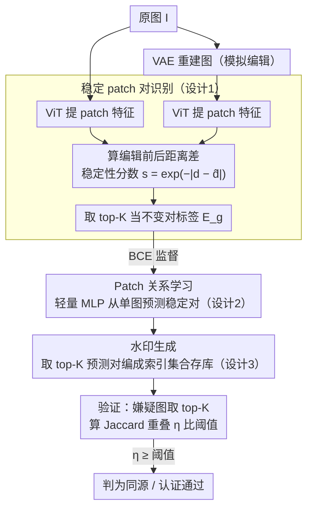

# Rel-Zero: Harnessing Patch-Pair Invariance for Robust Zero-Watermarking Against AI Editing

**会议**: CVPR 2026  
**arXiv**: [2603.17531](https://arxiv.org/abs/2603.17531)  
**代码**: 无  
**领域**: 图像生成  
**关键词**: 零水印, 图像编辑鲁棒性, patch关系不变性, 内容认证, 扩散模型

## 一句话总结
本文发现图像patch对之间的关系距离在AI编辑后保持不变，并利用该不变性构建了一种零水印框架Rel-Zero，无需修改原图即可实现对多种生成式编辑的鲁棒内容认证。

## 研究背景与动机

**领域现状**：数字水印是保护图像版权和认证内容真实性的关键技术。现有方法分为嵌入式水印（在图像中注入信号）和零水印（不修改图像，提取特征指纹存储在外部数据库中）。

**现有痛点**：嵌入式水印（如VINE、RobustWide）为了抵抗扩散模型编辑，必须注入强信号，这不可避免地引入可感知的失真，降低图像质量。零水印方法虽然保持完美图像质量，但依赖全局特征（SIFT、深度分类器的绝对特征描述子），这些特征恰恰是生成模型擅长改变的，导致鲁棒性极低。

**核心矛盾**：保真度与鲁棒性的trade-off——嵌入式方法牺牲质量换鲁棒性，零水印方法保持质量但鲁棒性差。在医学影像、自动驾驶等高精度领域，水印引入的噪声可能导致灾难性后果。

**本文目标** 在不修改原图的前提下（零水印），实现对生成式AI编辑的高鲁棒性认证。

**切入角度**：作者通过大规模实验分析发现，虽然AI编辑会大幅改变单个patch的像素值和绝对特征，但patch对之间的关系距离（pairwise distance）却保持惊人的不变性。$d_{ij}^{\text{after}} \approx \alpha \cdot d_{ij}^{\text{before}} + \beta$，其中 $\alpha \approx 1, \beta \approx 0, R^2 > 0.95$。

**核心 idea**：利用patch对关系距离的编辑不变性作为零水印的基础，将水印构建为一组稳定patch对的索引集合。

## 方法详解

### 整体框架

Rel-Zero 的出发点是一个反直觉的实证观察。作者从 UltraEdit 和 MagicBrush 中随机采样 10000 张图像（确定性重生成 2000、全局编辑 4000、局部编辑 4000），把每张图划成 $N=256$ 个不重叠 patch，用 RGB 均值向量 $\{v_i\}_{i=1}^N$ 表征每个 patch，然后计算所有 $\binom{N}{2}$ 个 patch 对在编辑前后的 L2 距离差异。结果是：单个 patch 的像素和绝对特征被 AI 编辑改得面目全非，但 patch 对之间的距离差异却呈近零均值、紧密分布，没有系统性偏差。把编辑前后的距离画成散点做相关性分析，更得到一条近乎完美的直线 $d_{ij}^{\text{after}} \approx \alpha \cdot d_{ij}^{\text{before}} + \beta$，斜率 $\alpha \approx 1$、截距 $\beta \approx 0$、$R^2 > 0.95$、Spearman $\rho \approx 1$。换句话说，编辑只是把 patch 间的相对距离做了一次几乎均匀的缩放——这就是特征空间里的**近仿射不变性**。

为什么会这样？一方面，扩散编辑模型训练时带着内容/结构保持损失（LPIPS、L1/L2 重建损失），会惩罚不必要的扰动，使跨 patch 的相对关系成为模型刻意维持的核心不变量；另一方面，一次语义编辑对应潜空间里的低维方向，解码回图像后施加的是一个近似均匀的变换。当这个变换近似仿射 $v_i' \approx A v_i + b$ 时，$v_i' - v_j' \approx A(v_i - v_j)$，距离被整体缩放而相对关系原封不动。Rel-Zero 正是把这个不变量做成水印：整条 pipeline 分三步——先用 VAE 模拟编辑造出"哪些 patch 对真正稳定"的训练标签，再训一个轻量 edge predictor 学会从单张图直接预测稳定对，最后取置信度最高的 top-K 对作为零水印索引。关键是推理时只用到第二步的网络，喂进一张图就能吐出水印索引集合，不需要 VAE、也不需要真去跑一遍编辑。

### 关键设计

**1. 稳定 patch 对识别：用 VAE 廉价模拟编辑，造出训练用的「不变对」标签**

edge predictor 要学的是"哪些 patch 对在编辑后会保持稳定"，可监督信号从哪来是第一个难题——给每张训练图都真跑一遍扩散编辑代价高到不可行。作者（受 VINE 启发）改用预训练 VAE 的重建来近似编辑：把原图 $\mathbf{I}$ 和它的 VAE 重建图分别过 ViT 提取 patch 级特征 $\mathcal{F} = \phi_{\text{vit}}(\mathbf{I})$，对每个 patch 对算编辑前后的距离差，并定义稳定性分数 $s_{ij} = \exp(-|d_{ij} - \hat{d}_{ij}|)$，取分数最高的 top-K 对当作 ground-truth 集合 $\mathcal{E}_g$。这样做的底气在于 VAE 重建对 patch 关系的扰动方式和扩散编辑类似，但便宜了一个数量级；同时注意分析阶段用的是 RGB 均值，到方法阶段已升级成 ViT 高维特征，距离度量因此能捕获更丰富的语义关系。

**2. Patch 关系学习：一个轻量 MLP 从单张图预测哪些对稳定，刻意不用注意力**

验证时手里只有一张待认证的图，没有编辑前后的配对，所以必须直接从单图判断哪些 patch 对会稳定。作者把 ViT 抽出的 $N$ 个 patch 特征两两配成全连接 pair 集合 $\mathcal{E}$，每个 pair $(i,j)$ 的输入特征是 $\mathbf{f}_i \oplus \mathbf{f}_j \oplus \|\mathbf{f}_i - \mathbf{f}_j\|_2$（两端拼接再附上距离），送进 MLP $\psi$ 加 sigmoid 得到预测分数 $p_{ij} = \sigma(\psi(\mathbf{f}_i \oplus \mathbf{f}_j \oplus \|\mathbf{f}_i - \mathbf{f}_j\|_2))$。这里有个反直觉的取舍：消融显示把 MLP 换成 Transformer 或 GAT 反而更差（97.43% → 92.11% / 94.45%），因为这是个本质上的距离估计任务，关键信息藏在 pair 的局部距离特征里，而注意力会把不同 patch 的表征混在一起，恰好抹掉了需要精确判别的细微距离差。简单结构在这里是优势而非妥协。

**3. 水印生成与验证：把水印编成 patch 对索引集合，靠 Jaccard 重叠认证**

有了 predictor，生成水印就是取置信度最高的 top-K 预测对 $\mathcal{E}_p = \text{Top-K}(\Phi(\phi_{\text{vit}}(\mathbf{I})))$，把这组索引（而非任何数值特征）存进外部数据库。验证时对嫌疑图同样抽 top-K 得 $\mathcal{E}_p'$，算两者的 Jaccard 重叠率 $\eta = |\mathcal{E}_p \cap \mathcal{E}_p'| / K$，再和按目标误报率 FPR=0.1% 校准出的阈值比较。比如存下 $K=50$ 个 pair 索引，一张图被编辑后若仍有 46 个对重新出现，$\eta = 0.92$ 远高于阈值，即判为同源。之所以编码成索引集合而不是绝对特征，正是为了承接前面的仿射不变性——索引集合记的是关系和保序性而非具体数值，距离整体缩放也不影响哪些对排在前列；索引还能进一步哈希加密存储（论文附录给了安全存储方案）。

### 损失函数 / 训练策略

用标准二元交叉熵训练 edge predictor：$\mathcal{L}_{BCE} = -\sum_{i \neq j} [y_{ij} \log(\hat{y}_{ij}) + (1-y_{ij})\log(1-\hat{y}_{ij})] / N(N-1)$，其中 $y_{ij}=1$ 标记 top-K 不变对（正样本），$y_{ij}=0$ 标记其余 pair（负样本）。正负比约为 $K : \binom{N}{2}-K$，极度不平衡（$K=50$ vs $\sim$19000 负样本），但 BCE 在此场景下仍能有效收敛。实现上 ViT-B/16 作为冻结特征提取器（不参与训练），用 Stable Diffusion v1.4 的 VAE 生成训练目标，$K=50$ pairs，patch 大小 $16 \times 16$（224×224 图像对应 $N=196$ patches），在 COCO 上训练，单卡 NVIDIA A100。

## 实验关键数据

### 主实验

| 方法 | 类型 | PSNR↑ | Regen | Pix2Pix | Magic | Ultra | CtrlN | Cropout | Scale | Contrast | Bright | Gauss |
|------|------|-------|-------|---------|-------|-------|-------|---------|-------|----------|--------|-------|
| DWT-DCT | 嵌入 | 40.38 | 0.09 | 0.04 | 0.05 | 0.32 | 0.56 | 10.35 | 6.78 | 30.18 | 51.88 | 12.45 |
| RobustWide | 嵌入 | 41.93 | 90.41 | 97.23 | 81.97 | 80.45 | 82.11 | 95.31 | 96.45 | 98.93 | 98.89 | 98.12 |
| VINE | 嵌入 | 37.34 | 99.98 | 97.46 | 94.58 | 99.96 | 93.04 | 54.87 | 76.43 | 98.43 | 97.90 | 98.37 |
| ConZWNet | 零水印 | ∞ | 0.10 | 0.02 | 0.01 | 5.13 | 2.41 | 98.75 | 97.43 | 96.22 | 96.56 | 98.75 |
| FGPCET | 零水印 | ∞ | 1.13 | 0.54 | 0.11 | 7.25 | 3.22 | 89.31 | 84.78 | 86.31 | 85.44 | 84.67 |
| **Rel-Zero** | **零水印** | **∞** | **85.13** | **89.65** | **95.63** | **96.55** | **97.43** | **98.45** | **98.57** | **96.45** | **97.93** | **95.12** |

所有TPR@(0.1%FPR)。**核心结论**：
- Rel-Zero在零水印类别中碾压前作（其他零水印在生成编辑下TPR<10%，Rel-Zero达85-97%）
- 在局部编辑（Ultra/CtrlN）上甚至超过嵌入式VINE和RobustWide
- 常规扰动下Rel-Zero也保持98%+鲁棒性，因为unifrom变换保持patch对关系几何
- VINE在Cropout（54.87%）和Scaling（76.43%）上表现较差，而Rel-Zero天然鲁棒

### 消融实验

| 模型配置 | TPR@(0.1%FPR) | 说明 |
|---------|---------------|------|
| Ours (ViT + MLP) | 97.43 | 完整模型 |
| ViT → ResNet-18 | 84.13 | Backbone弱导致特征不够好 |
| ViT → ResNet-50 | 85.21 | ResNet仍不如ViT的patch-level表征 |
| MLP → Transformer+MLP | 92.11 | 注意力模糊了距离差异 |
| MLP → GAT+MLP | 94.45 | GAT有类似问题但稍好 |

### 唯一性分析
在COCO、UltraEdit、MagicBrush三个数据集上各采样1000张图像，计算所有图像对的水印Jaccard重叠率。实验表明不同图像间的 $\eta_{a,b}$ 集中在近零值，方差极小，验证了学到的关系对是**图像特定的签名**而非通用模板。

### 参数分析
- **Top-K影响**：$K$ 增大时鲁棒性稳步提升，但 $K=50$ 后收益饱和。ControlNet-Inpainting和UltraEdit最鲁棒，Regeneration最具挑战性
- **Patch大小影响**：$14 \times 14$ 和 $16 \times 16$ 效果接近，$32 \times 32$ 性能骤降——过粗的划分削弱了关系建模能力，patch对过稀疏

### 关键发现
- ViT backbone贡献最大——因为ViT天然产生patch-level特征，对关系距离变化更敏感。ResNet虽有强特征提取能力但缺乏patch-wise结构
- 简单MLP优于Transformer/GAT——pair预测本质是距离估计任务，注意力机制反而模糊了精细距离差异
- 常规扰动（噪声、缩放、对比度、亮度）本质上是对图像施加均匀变换，不改变patch对的相对关系，故Rel-Zero天然鲁棒
- 全局编辑（如Regeneration）仍是最大挑战——因为大规模语义变化可能破坏部分patch关系

## 亮点与洞察
- **Patch-pair关系不变性的发现**极为巧妙。作者通过10000张图像的统计分析，发现编辑前后patch对距离呈近完美线性关系（$R^2 > 0.95$），这为零水印提供了坚实的理论基础
- **用VAE模拟扩散编辑来生成训练数据**是很聪明的设计——降低了数量级的计算开销，又保持了对扩散过程结构性影响的近似
- **将水印编码为图索引（edge set）**的范式值得借鉴——可迁移到视频水印（时空patch对）、3D模型水印（体素对关系）

## 局限与展望
- **分辨率限制**：训练和测试全部在224×224上进行，实际应用中高分辨率图像（如4K医学影像）的效果未验证。高分辨率下patch数量剧增（$N$ 从196到数千），pair数量呈 $O(N^2)$ 增长，计算效率是问题
- **编辑模型泛化**：仅在5种编辑模型上测试，对未来更强大的编辑器（如基于视频扩散的编辑、3D-aware编辑）的泛化能力未知
- **对抗安全性**：攻击者如果知道patch划分方式、$K$ 值和ViT类型，可能设计针对性攻击来破坏特定patch对的关系
- **正负样本不平衡**：BCE损失下 $K=50$ vs $\sim$19000 的极端不平衡，可以尝试focal loss或自适应采样
- **可扩展方向**：多尺度patch划分增强鲁棒性；时序扩展到视频水印；结合语义分割的自适应patch划分

## 相关工作与启发
- **vs VINE/RobustWide（嵌入式）**: 通过对抗训练将编辑模型纳入优化，鲁棒性强但代价是图像质量下降（VINE的PSNR仅37.34dB）和巨大的训练开销。Rel-Zero在保持完美保真度（PSNR=∞）的同时，在局部编辑（Ultra 96.55% vs VINE 99.96%、CtrlN 97.43% vs VINE 93.04%）和常规扰动上表现相当甚至更优
- **vs ConZWNet/FGPCET（零水印）**: 同为零水印但思路完全不同。前者依赖深度特征的绝对描述子或手工特征，这些恰恰是生成模型擅长改变的，导致AI编辑下几乎完全失效（TPR < 10%）。Rel-Zero通过发现并利用关系不变性，鲁棒性提升了两个数量级
- **vs 传统DWT-DCT**: 频域嵌入方法在AI编辑下完全失效（TPR < 1%），说明频域信号在扩散重建过程中被彻底破坏
- **关联思考**：关系不变性的insight可迁移到其他认证场景——如deepfake检测中利用面部patch间的关系一致性

## 评分
- 新颖性: ⭐⭐⭐⭐ patch对关系不变性的发现有insight，但框架整体较直接
- 实验充分度: ⭐⭐⭐⭐ 跨多种编辑模型测试，有唯一性分析和参数消融，但缺少高分辨率实验
- 写作质量: ⭐⭐⭐⭐⭐ 逻辑清晰，从观察到假设到验证到方法的叙述链条非常流畅
- 价值: ⭐⭐⭐⭐ 为零水印领域提供了新范式，在高保真场景有实际应用价值

<!-- RELATED:START -->

## 相关论文

- [\[CVPR 2026\] Towards Robust Content Watermarking Against Removal and Forgery Attacks](towards_robust_content_watermarking_against_removal_and_forgery_attacks.md)
- [\[ECCV 2024\] Robust-Wide: Robust Watermarking against Instruction-driven Image Editing](../../ECCV2024/image_generation/robust-wide_robust_watermarking_against_instruction-driven_image_editing.md)
- [\[CVPR 2026\] SPDMark: Selective Parameter Displacement for Robust Video Watermarking](spdmark_selective_parameter_displacement_for_robust_video_watermarking.md)
- [\[CVPR 2026\] TRACE: Structure-Aware Character Encoding for Robust and Generalizable Document Watermarking](trace_structure-aware_character_encoding_for_robust_and_generalizable_document_w.md)
- [\[CVPR 2026\] Editing Away the Evidence: Diffusion-Based Image Manipulation and the Failure Modes of Robust Watermarking](editing_away_the_evidence_diffusion-based_image_manipulation_and_the_failure_mod.md)

<!-- RELATED:END -->
