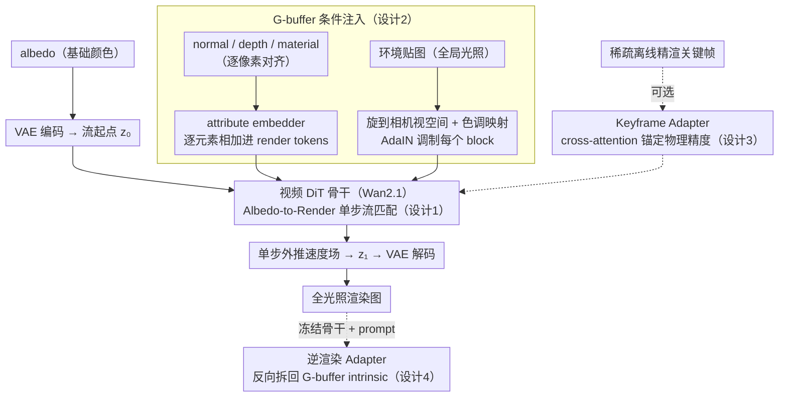

# RenderFlow: Single-Step Neural Rendering via Flow Matching

**会议**: CVPR 2026  
**arXiv**: [2601.06928](https://arxiv.org/abs/2601.06928)  
**代码**: 无（Disney Research 内部项目）  
**领域**: 扩散模型 / 图像生成 / 3D视觉  
**关键词**: 神经渲染、流匹配、单步推理、G-buffer、关键帧引导

## 一句话总结
提出 RenderFlow，将神经渲染重新建模为从 albedo 到全光照图像的单步条件流匹配问题，以 G-buffer 为条件、预训练视频 DiT 为骨干，实现了比扩散方法快 10 倍以上（~0.19s/帧）的确定性渲染，可选的稀疏关键帧引导进一步提升物理精度，还支持通过冻结骨干 + 轻量 adapter 实现逆渲染。

## 研究背景与动机

1. **领域现状**：物理基础渲染（PBR）通过蒙特卡罗路径追踪模拟光传输，是离线渲染的金标准，但计算成本极高。近期基于扩散模型的神经渲染方法（如 RGB-X、DiffusionRenderer）利用 G-buffer 作为条件生成逼真图像，已展示出良好的视觉质量。

2. **现有痛点**：(a) 扩散模型的迭代去噪过程需要 20-50 次网络评估，延迟过高无法用于交互式应用；(b) 扩散采样的随机性导致物理精度不足和时序闪烁，不满足工业级渲染标准。两个问题的核心都源于扩散模型"从噪声生成"的范式。

3. **核心矛盾**：扩散模型的生成能力与实时确定性渲染的需求之间存在根本冲突——需要生成模型的高频细节合成能力，但不能接受迭代采样和随机性。

4. **本文目标**：(a) 实现单步、确定性的神经渲染；(b) 在不依赖显式场景几何和光传输模拟的情况下提升物理精度；(c) 复用同一骨干完成正向渲染和逆渲染。

5. **切入角度**：关键洞察是——渲染可以被理解为从 albedo（漫反射基调颜色）到全光照图像的"残差流"学习问题。albedo 已包含低频颜色信息，模型只需学习添加光照、阴影、反射等高频效果。用 albedo 替代噪声作为流的起点，保留了几何完整性。

6. **核心 idea**：用 flow matching 学习从 albedo 到全光照图像的确定性速度场，以 G-buffer 为条件、预训练视频 DiT 为骨干，在桥匹配框架下实现单步高保真渲染。

## 方法详解

### 整体框架
输入：一组 G-buffer 属性——albedo（基础颜色）、normal（法线）、depth（深度）、material（粗糙度/金属度/镜面反射）和环境贴图（全局光照）。albedo 作为流的起点替代噪声，经 VAE 编码为 latent $\mathbf{z}_0$；目标是路径追踪渲染的真实图像 $\mathbf{z}_1$。模型学习一个速度场 $v_\theta$ 将 $\mathbf{z}_0$ 直接映射到 $\mathbf{z}_1$，单步推理即可得到完整渲染结果。可选的稀疏关键帧通过 cross-attention adapter 提供物理精度锚点。

### 关键设计

**1. Albedo-to-Render 流匹配：把渲染当成"从基础颜色到全光照"的确定性单步流，而不是从噪声去噪**

扩散渲染慢和不稳的根源在于它从纯噪声出发、要迭代去噪 20-50 步。RenderFlow 干脆换掉起点：albedo 已经携带了画面的低频颜色和几何信息，模型不必从零生成，只需在它之上"补上"光照、阴影、反射这些高频效果。形式上在桥匹配（bridge matching）框架里训练——把 albedo latent 记作 $\mathbf{z}_0$、路径追踪真值记作 $\mathbf{z}_1$，训练时采样 $t \in [0,1]$ 并构造带微扰的插值：

$$\mathbf{z}_t = (1-t)\mathbf{z}_0 + t\mathbf{z}_1 + \sigma\sqrt{t(1-t)}\,\epsilon,\qquad \sigma=0.005$$

网络 $v_\theta(\mathbf{z}_t, t)$ 学习逼近目标方向 $\frac{\mathbf{z}_1 - \mathbf{z}_t}{1-t}$；推理时一步外推 $\hat{\mathbf{z}}_1 = \mathbf{z}_t + v_\theta(\mathbf{z}_t, t)(1-t)$ 即得渲染结果。因为流的起点本身就含信息、离目标很近，ODE 路径短而直，单步就能高精度到达——这正是它比"从噪声出发"的扩散快一个量级的原因。训练用 4 步 SDE schedule、推理却只走单步，反而避免了多步采样的误差累积（见消融）。

**2. G-buffer 条件注入：按"空间对齐与否"分两路把几何、材质、光照喂进网络**

光要打在正确的几何和材质上，模型就得知道每个像素的 normal、depth、粗糙度、金属度以及全局光照。难点是这些条件的"性质"不同：G-buffer 属性逐像素与画面对齐，环境贴图却是一张全局信息。RenderFlow 据此分两路注入。骨干用 Wan2.1 视频 DiT：albedo latent 经 input embedder 变成 render tokens，normal/depth/material 用同一个 VAE 编码后过专用 attribute embedder，因为和 render tokens 空间对齐，直接逐元素相加即可（沿用 VACE 架构），这是最省事也最有效的方式。环境贴图则先旋转到相机视空间、再做 Reinhard 色调映射得到 LDR 图，VAE 编码后通过 AdaIN 注入每个 Transformer block——预测 scale $\gamma$ 和 shift $\beta$ 来调制 render features。把环境贴图旋到相机空间这一步很关键：它让网络隐式学到方向性光照，省掉了显式的方向编码。

**3. 稀疏关键帧引导（Keyframe Adapter）：让少量离线精渲的参考帧把生成"锚"在真实光传输上**

纯前馈渲染在物理精度和时序一致性上仍有上限。RenderFlow 允许可选地塞进几张离线路径追踪的高质量关键帧当锚点：在 self-attention 旁并联一条 cross-attention 分支，render tokens 作 query、关键帧 token 作 key/value，并对 key 和 query 施加 RoPE 来编码当前帧与关键帧之间的时间距离——于是近处的关键帧影响大、远处的影响小，模型按时间远近自动调权重。FFN 层再加 LoRA 做轻量适配。训练分两阶段：Stage 1 先把基础渲染模型练好，Stage 2 冻结它、只训 Keyframe Adapter，这样保证即便不给关键帧、模型也能独立工作。代价很小——加关键帧后推理只多 ~0.05s，PSNR 却从 24.214 拉到 26.663。

**4. 逆渲染 Adapter：冻结同一套正向骨干，反过来把图像拆回 G-buffer**

作者想证明这套骨干不是只会"正着渲"。做法是把正向渲染骨干整个冻住，只挂上一组可训练部件：inverse embedder 把 RGB 编码成 token，self-attention 投影上加 LoRA，再用 prompt-conditioned cross-attention 让一句文本 prompt 选择要分解出哪种 intrinsic（albedo/normal/depth/material），每种 intrinsic 配一个轻量 MLP head 出图。训练只动 adapter 这些参数，损失按模态定制：albedo 用 L1+LPIPS、normal 用 cosine similarity、depth 用 scale-and-shift-invariant loss、material 用 L1。一套预训练骨干、靠 prompt 切换正逆两个方向，参数高效地复用了同一份渲染先验。

### 损失函数 / 训练策略
- 总损失 $\mathcal{L}_{\text{total}} = \mathcal{L}_{\text{latent}} + \lambda \mathcal{L}_{\text{pixel}}$
- latent loss：桥匹配速度预测损失
- pixel loss：$\mathcal{L}_{\text{LPIPS}} + \mathcal{L}_{\text{grad}}$（LPIPS 感知损失 + 梯度损失用于恢复接触阴影等高频细节）
- 训练在短片段（5 帧）上进行，长视频推理用重叠 chunk 渐进策略
- 数据集：Unreal Engine 5 自建，包含 ~4,000 独特网格 + 30 张 HDR 环境贴图，约 130K 帧（30K 艺术场景 + 100K 程序化场景），512x512 分辨率，256 SPP + Intel OIDN 降噪

## 实验关键数据

### 主实验

| 方法 | 范式 | 参数量 | PSNR↑ | SSIM↑ | LPIPS↓ | 推理时间(s)↓ |
|------|------|--------|-------|-------|--------|------------|
| Path Tracing | 传统 | - | - | - | - | >10 |
| Deferred Rendering | 传统 | - | 24.649 | 0.927 | 0.097 | - |
| RGB-X | 扩散 | 950M | 20.984 | 0.793 | 0.165 | ~2.19 |
| DiffusionRenderer | 扩散 | 1.7B | 23.758 | 0.863 | 0.128 | ~1.40 |
| **RenderFlow (w/o key)** | **Flow** | **1.4B** | **24.214** | **0.874** | **0.113** | **~0.19** |
| **RenderFlow (w/ key)** | **Flow** | **1.7B** | **26.663** | **0.883** | **0.101** | **~0.24** |

### 消融实验

| 训练策略 | PSNR↑ | SSIM↑ | LPIPS↓ |
|---------|-------|-------|--------|
| Uniform SDE (4步) | 22.192 | 0.858 | 0.120 |
| 4步 ODE (4步推理) | 23.089 | 0.865 | 0.110 |
| 4步 ODE (1步推理) | 23.304 | 0.867 | 0.108 |
| 4步 SDE (4步推理) | 23.384 | 0.865 | 0.111 |
| **4步 SDE (1步推理)** | **23.590** | **0.868** | **0.107** |

| 损失配置 | PSNR↑ | SSIM↑ | LPIPS↓ |
|---------|-------|-------|--------|
| 仅 latent loss | 21.588 | 0.840 | 0.148 |
| + LPIPS | 23.538 | 0.867 | 0.105 |
| + LPIPS + gradient | 23.590 | 0.868 | 0.107 |

### 关键发现
- **单步推理优于多步推理**：4 步 SDE schedule 训练 + 1 步推理（23.590）优于 4 步推理（23.384），因为避免了多步误差累积。这是一个反直觉的发现。
- **SDE 训练优于 ODE 训练**：微小噪声扰动（$\sigma=0.005$）使模型生成更多样的效果，增强鲁棒性。
- **关键帧引导效果显著**：PSNR 从 24.214 提升到 26.663（+2.449），LPIPS 从 0.113 降到 0.101，且推理时间仅增加 ~0.05s。
- **确定性输出零方差**：与扩散方法在多次推理间存在显著方差不同，RenderFlow 是完全确定性的，在 100 帧序列上方差为零，对生产环境至关重要。
- **VAE 是性能瓶颈**：推理 ~0.19s 中，G-buffer 编码 ~0.12s + 图像解码 ~0.04s，VAE 占 ~90% 时间。
- **逆渲染质量有竞争力**：法线 angular error 16.2°远优于 RGB-X 的 46.5°和 DiffusionRenderer 的 47.6°。

## 亮点与洞察
- **albedo-as-flow-start 的设计一石三鸟**：(a) 保留低频颜色使流路径短，单步高精度；(b) 保持几何完整性；(c) 语义上自然——渲染就是在基础颜色上添加光照效果。这种"有意义起点"的流匹配思路可迁移到任何输入输出有结构对应关系的 image-to-image 任务（如深度估计、语义分割的逆过程）。
- **"多步训练+单步推理"的发现非常实用**：SDE 训练引入微噪声增加鲁棒性，推理时无需多步即可达到最佳效果，是一种高效的训练/推理不对称策略。
- **正逆渲染统一框架**：通过冻结骨干 + 轻量 adapter + prompt switching 在同一模型中切换正向和逆向渲染任务，体现了大规模预训练模型的可复用性。

## 局限与展望
- **VAE 编解码占推理 ~90% 时间**：模型本身很快，但 VAE 是瓶颈。轻量 VAE 或端到端像素空间方法可能进一步提速。
- **依赖 UE5 合成数据训练**：在真实照片场景上的泛化能力未充分验证。domain gap 可能限制实际部署。
- **环境贴图假设较强**：实际渲染场景可能有更复杂的直接/间接光源，单张环境贴图未必能完整表达。
- **512x512 分辨率限制**：当前实验在 512x512 上进行，高分辨率（如 4K）的扩展性未验证。
- **不替代显式几何渲染**：作者自己指出，本方法不旨在替代高度优化的工业实时渲染管线，而是在没有显式几何的情况下提供高质量近似。

## 相关工作与启发
- **vs DiffusionRenderer**: DiffusionRenderer 基于视频扩散模型但需 30 步推理（~1.40s），PSNR 23.758；RenderFlow 单步推理（~0.19s）达到 24.214，快 7 倍且质量更高。
- **vs RGB-X**: RGB-X 是图像级扩散模型，50 步推理（~2.19s），PSNR 仅 20.984；RenderFlow 快 10 倍且质量大幅领先。
- **vs LBM（Latent Bridge Matching）**: RenderFlow 借鉴了 LBM 的桥匹配训练策略（$\sigma=0.005$），但针对渲染任务定制了 albedo-as-start、G-buffer 条件注入和关键帧引导等设计。

## 评分
- 新颖性: ⭐⭐⭐⭐ albedo-to-render 的流匹配建模视角新颖，但整体框架建立在已有技术（bridge matching、Wan2.1、adapter）之上
- 实验充分度: ⭐⭐⭐⭐ 定量定性比较充分，消融详尽，但仅在合成数据上评估
- 写作质量: ⭐⭐⭐⭐⭐ 方法动机清晰，技术细节完整，图表设计精良
- 价值: ⭐⭐⭐⭐ 对交互式渲染和虚拟制作有实际应用价值，确定性输出是生产环境的刚需

<!-- RELATED:START -->

## 相关论文

- [\[CVPR 2026\] LeapAlign: Post-Training Flow Matching Models at Any Generation Step by Building Two-Step Trajectories](leapalign_post_training_flow_matching_models_at_any_generation_step.md)
- [\[CVPR 2026\] Frequency-Aware Flow Matching for High-Quality Image Generation](freqflow_frequency_aware_flow_matching.md)
- [\[CVPR 2026\] MPDiT: Multi-Patch Global-to-Local Transformer Architecture for Efficient Flow Matching](mpdit_multi-patch_global-to-local_transformer_architecture_for_efficient_flow_ma.md)
- [\[NeurIPS 2025\] Flow Matching Neural Processes](../../NeurIPS2025/image_generation/flow_matching_neural_processes.md)
- [\[CVPR 2026\] VeCoR — Velocity Contrastive Regularization for Flow Matching](vecor_--_velocity_contrastive_regularization_for_flow_matching.md)

<!-- RELATED:END -->
