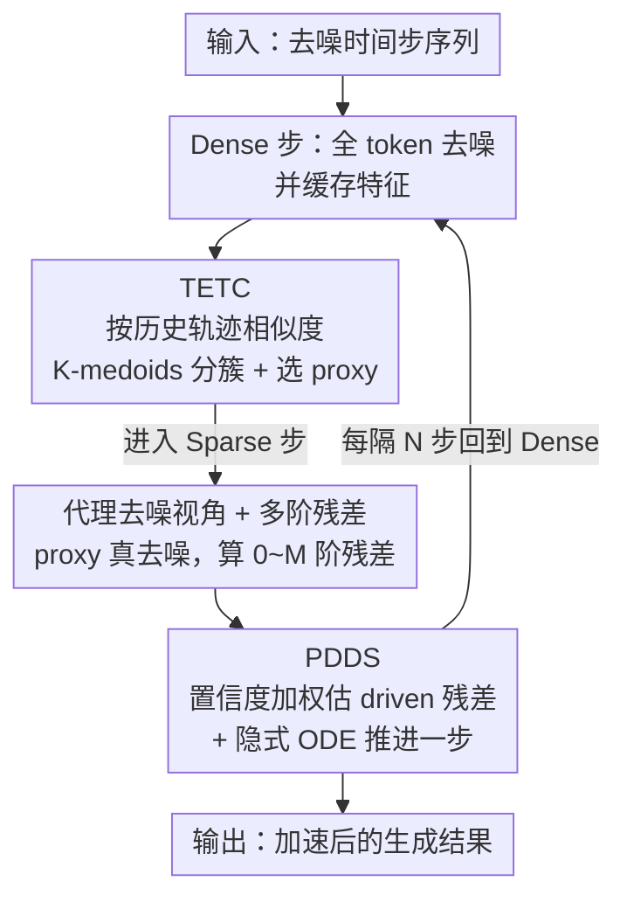

# ResCa: Residual Caching for Diffusion Transformers Acceleration

**会议**: CVPR 2026  
**论文**: [CVF Open Access](https://openaccess.thecvf.com/content/CVPR2026/html/Fang_ResCa_Residual_Caching_for_Diffusion_Transformers_Acceleration_CVPR_2026_paper.html)  
**代码**: 无（项目页 https://fanghaipeng.github.io/ResCa）  
**领域**: 扩散模型 / 推理加速  
**关键词**: Diffusion Transformer, 特征缓存, Token 复用, 多阶残差, 训练免微调

## 一句话总结
ResCa 是一个免训练的扩散 Transformer 加速框架，把每个轨迹簇里只对一个"代理 token"做真去噪、再用它的多阶残差去"模拟"同簇其它 token 的去噪方向，从而在 FLUX 上做到 5.5× GFLOPs 加速且画质几乎无损。

## 研究背景与动机
**领域现状**：DiT、FLUX、HunyuanVideo 这类扩散 Transformer 在高质图像/视频生成上很强，但每一步去噪都要把所有 token 过一遍整个网络，多步采样下算力开销巨大。免训练的"token 缩减"加速由此流行，主要分两条路：缓存（caching）和合并（merging）。

**现有痛点**：作者把这两条路的失效都归到"去噪方向被破坏"上。缓存方法（ToCa、DuCa、TokenCache）直接复用上一时刻的 token 特征，但由于网络里有 skip 残差连接，这个被复用的方向并不会真的"停在原地"，于是得到一个 **non-updated（没更新）** 的去噪方向；合并方法（ToMeSD、SDTM、ToMA）把相似 token 合成一个再用混合特征，得到的是 **non-self（不属于自己）** 的去噪方向。两类都会让实际轨迹偏离原始全计算轨迹，画质下降。

**核心矛盾**：要省算力就得让一部分 token "不算"，但"不算"目前要么靠复用历史（方向陈旧）、要么靠借用邻居（方向不属于自己），没法同时做到 **self（用自己的特征当主方向）且 updated（带上当前时刻的更新）**。

**切入角度**：作者做了两个先导观察。其一，沿相似去噪路径的 token，其残差（相邻时刻的特征变化）走势也相似——所以应该按**历史轨迹**而非末时刻特征来聚类，才能把真正相似的 token 分到一起。其二，把残差做成多阶差分后，**低阶残差（1/2 阶）的簇内复用性远高于 0 阶**（0 阶仍编码了 token 自身表征，高阶则把去噪方向解耦了出来），而且某一阶残差的可用度可以从前几个时刻的轨迹关系估出来。

**核心 idea**：每个轨迹簇里只挑一个 token 做真去噪当"代理"，把它算出的多阶残差当作"前瞻修正"，去引导同簇其它 token 的"模拟去噪"——这样其它 token 既保留自己的特征当主方向（self），又拿到了当前步的更新方向（updated）。

## 方法详解

### 整体框架
ResCa 把采样的时间步切成 **dense（密集）** 和 **sparse（稀疏）** 两类。在 dense 时间步，所有 token 都正常过网络、缓存特征，并触发 **TETC（Temporal-Enhanced Trajectory Clustering）** 按轨迹相似度把 token 分簇；在随后的若干 sparse 时间步（缓存间隔 $N$），每个簇只挑一个 proxy token 真去噪，其余 driven token 交给 **PDDS（Proxy-Driven Denoising Simulation）**：先把 proxy 的多阶残差算出来，再据此估计每个 driven token 下一步的残差，最后用一个**隐式 ODE 更新**把 driven token 往前推一步。整个流程不改网络权重、不需要微调，可直接插到 DiT / FLUX / HunyuanVideo 上。

### 关键设计

**1. 代理去噪视角与多阶残差：把"复用什么"从特征换成残差**

这一设计直接针对"缓存复用特征会让方向陈旧"的痛点。ResCa 不复用 token 的特征值，而是复用它的**残差**（特征沿时间步的变化量），并把残差做成多阶差分。给定 proxy token 的特征 $p_t$，0 阶残差就是特征本身 $\mathcal{F}^{(0)}(p_t)=p_t$，更高阶用递归有限差分定义：

$$\mathcal{F}^{(m)}(p_t) = \mathcal{F}^{(m-1)}(p_t) - \mathcal{F}^{(m-1)}(p_{t+1}),\quad m \ge 1.$$

这一组 $\{\mathcal{F}^{(m)}(p_t)\}_{m=1}^{M}$ 相当于 proxy 轨迹的"多阶导数描述子"。作者在先导实验里量化发现：0 阶残差簇内差距大（因为它还带着 token 自身表征），而 1/2 阶残差差距小、最适合跨 token 复用；3 阶之后又因放大了噪声而略微变差——所以默认只用到 1 阶，把"代理的方向信息"抽出来给同簇 token 用，而不直接搬运代理的特征值。这正是 self（保留自己特征）+ updated（借代理残差注入当前更新）能同时成立的根。

**2. TETC 时序增强轨迹聚类：按"走过的路"而不是"现在长什么样"分簇**

合并类方法常在末时刻按特征相似度聚类，结果会把轨迹其实差很远的 token 错分到一起（先导实验里那条蓝色轨迹就是反例）。TETC 改成按整段历史轨迹聚类，且越近的时刻权重越大，分三步：先对每个时刻算 token 间的余弦相似度矩阵 $\mathcal{S}_t = \frac{X_t X_t^\top}{\|X_t\|_2 \|X_t^\top\|_2}$；再做一个时序滑动平均累积成 $\tilde{\mathcal{S}}_t = \alpha_{\mathcal{S}}\,\mathcal{S}_t + (1-\alpha_{\mathcal{S}})\,\tilde{\mathcal{S}}_{t+1}$，其中 $\alpha_{\mathcal{S}}$ 控制近时刻的权重；最后在这个累积相似度上做 **K-medoids** 聚类（簇心被约束为真实 token，适合高维稀疏特征）：

$$\min_{\{C_1,\dots,C_K\}} \sum_{t=1}^{N}\sum_{k=1}^{K} \mathbb{I}(X_t\in C_k)\cdot \big(1-\tilde{\mathcal{S}}_t(X_t, C_k)\big).$$

每个簇 $C_k$ 里随机选一个 token 当 proxy $p_k$，其余即 driven token $D_k=\{X_i\in C_k\mid X_i\neq p_k\}$。先导实验证明，轨迹聚类得到的簇内残差距离明显小于特征聚类——也就是说它更可靠地把"残差相似"的 token 圈到了一起，这是后面残差复用不出错的前提。

**3. PDDS 代理驱动去噪模拟：用置信度加权 + 隐式 ODE 把 driven token 推一步**

有了簇和多阶残差，PDDS 负责让 driven token 在不过网络的情况下完成一步去噪，分三步。**① 代理去噪**：每个簇只对 proxy 真跑一步网络 $p_{k,t}^l = \mathcal{F}(p_{k,t+1}^l, t+1)$，并按设计 1 构造它的多阶残差。**② 估 driven 残差**：先算一个逐阶置信度，衡量 proxy 与 driven 在第 $m$ 阶残差上的方向是否一致

$$\theta_t^{(m)} = \max\!\Big(0,\ \cos\big(\mathcal{F}^{(m)}(p_t),\ \mathcal{F}^{(m)}(d_t)\big)\Big),\quad \theta_t^{(m)}\in[0,1],$$

再用它把 driven 自己的残差和 proxy 在 $t-1$ 的残差融合，估出 driven 在下一步的残差：

$$\hat{\mathcal{F}}^{(m)}(d_{t-1}) = (1-\theta_t^{(m)})\,\mathcal{F}^{(m)}(d_t) + \theta_t^{(m)}\,\mathcal{F}^{(m)}(p_{t-1}).$$

这里 $\mathcal{F}^{(m)}(d_t)$ 是 driven 自己的基础方向（self），$\mathcal{F}^{(m)}(p_{t-1})$ 是来自代理的前瞻修正（updated）；当两条轨迹高度一致时 $\theta\to1$，强烈对齐代理，否则退回用自己的残差。**③ 隐式 ODE 更新**：把估出的多阶残差当作时间导数的离散近似，按隐式 Taylor 单位步推进

$$d_{t-1} = d_t + \sum_{m=1}^{M}\frac{1}{m!}\,\hat{\mathcal{F}}^{(m)}(d_{t-1}).$$

$M{=}1$ 时退化成隐式 Euler（对应 ResCa-IE）；这套估计出的残差还能直接塞进标准隐式多步格式，例如 BDF2（ResCa-IB）得到 $d_{t-1} = \tfrac{4}{3}d_t - \tfrac{1}{3}d_{t+1} + \tfrac{2}{3}\hat{\mathcal{F}}^{(1)}(d_{t-1})$，高阶 Taylor 即 ResCa-IT。和 TaylorSeer/FoCa 这类"纯靠历史外推"的预测不同，PDDS 在每个稀疏步都用当前 proxy 的真去噪做"on-step 反馈"，方向因此稳定且自适应。

### 损失函数 / 训练策略
ResCa 完全 **training-free**，没有训练目标或可学习参数。主要超参是缓存间隔 $N$、簇数 $K$、残差阶数 $O$，以及 ODE 求解格式（IE / IB / IT）；默认 $K{=}16$、$O{=}1$（只用 1 阶残差以保持简单）。

## 实验关键数据

### 主实验
在 FLUX.1-dev 文生图（DrawBench 200 prompts，Image Reward / CLIP 评测）上，ResCa 在相近加速比下取得更高质量；在极端缓存间隔下也能保住画质。

| 设置（FLUX） | FLOPs 加速 | Image Reward ↑ | CLIP ↑ |
|--------------|-----------|----------------|--------|
| 原始 50 步 | 1.00× | 0.9898 | 19.761 |
| ClusCa (N=5,O=1,K=16) | 4.14× | 0.9825 | 19.481 |
| **ResCa-IE (N=5,K=16)** | 4.14× | **0.9958** | **19.537** |
| ClusCa (N=6,O=1,K=16) | 4.96× | 0.9762 | 19.533 |
| **ResCa-IT (N=6,O=2,K=16)** | 4.96× | 0.9937 | 19.452 |
| TaylorSeer (N=5,O=2) | 4.16× | 0.9864 | 19.406 |
| **ResCa-IB (N=7,K=16)** | 5.51× | 0.9889 | 19.441 |

在 DiT-XL/2 ImageNet 256² 类条件生成上（FID-50k 为主指标），ResCa 在同等或更高加速下 FID 一致更低：

| 设置（DiT-XL/2） | FLOPs 加速 | FID ↓ | sFID ↓ |
|------------------|-----------|-------|--------|
| DDIM-50 步 | 1.00× | 2.32 | 4.32 |
| DuCa (N=3) | 2.49× | 2.85 | 4.64 |
| **ResCa-IE (N=3,K=16)** | 2.58× | **2.37** | **4.63** |
| TaylorSeer (N=3,O=1) | 2.77× | 2.49 | 4.81 |
| **ResCa-IE (N=4,K=16)** | 3.23× | 2.49 | 4.99 |
| ClusCa (N=5,K=16) | 3.97× | 2.65 | 5.13 |
| **ResCa-IE (N=5,K=16)** | 3.96× | **2.62** | 5.08 |

在 HunyuanVideo 文生视频（VBench，946 prompts）上，ResCa-IE 在 5.53× FLOPs 加速下拿到 79.98 的 VBench，比相近加速的 TaylorSeer 高约 0.2 个点。

### 消融实验
| 配置（DiT，N=5） | FID ↓ | sFID ↓ | 说明 |
|------------------|-------|--------|------|
| ResCa-IT, O=1 | 2.62 | 5.08 | 仅 1 阶残差（默认） |
| ResCa-IT, O=2 | 2.57 | 4.98 | 加到 2 阶，FID 最佳 |
| ResCa-IT, O=3 | 2.58 | 5.02 | 继续加阶反而微升 |
| ResCa-IT, O=4 | 2.58 | 5.00 | 收益饱和、算力上升 |

聚类方式的消融（视觉对比，N=8 放大残差复用影响）显示：特征聚类会带来明显的过曝、细节缺失（因为把残差不相似的 token 错并到一起、注入了错误引导），而轨迹聚类则保住了细节——印证了 TETC 的必要性。簇数 $K$ 的消融表明 $K{=}16{\sim}32$ 是质量/效率的最佳权衡，默认取 16。

### 关键发现
- **低阶残差是甜点**：1→2 阶能显著降 FID，再往上（3/4 阶）几乎不再涨还增算力，验证了"高阶残差放大噪声"的先导分析，所以默认只用 1 阶。
- **聚类方式比想象中关键**：把"按末时刻特征聚类"换成"按历史轨迹聚类"，是避免残差复用引入错误方向的根本，去掉它会直接导致可见的画质退化。
- **隐式 ODE 优于纯历史外推**：在同等/更高加速下，ResCa 的隐式预测（估未来态）一致优于 TaylorSeer/FoCa 这类只靠历史外推的方法，作者归因于扩散动力学非平稳、当前步信号能纠偏方向。

## 亮点与洞察
- **把"复用特征"重构成"复用残差方向"**：核心 insight 是缓存的本质问题在"去噪方向"——既要 self 又要 updated。用多阶残差当方向描述子、再用代理残差做前瞻修正，巧妙地把这两个看似冲突的需求一起满足了。
- **置信度门控 $\theta_t^{(m)}$ 很实用**：用余弦相似度按阶自适应决定"信代理还是信自己"，避免了对所有 token 一刀切复用，是可迁移到其它缓存/蒸馏场景的小 trick。
- **和经典 ODE 求解器即插即用**：把估出的多阶残差直接对接隐式 Euler / BDF2 / Taylor，等于把"数值 ODE 工具箱"接到了特征缓存上，给加速方法提供了一个统一且可扩展的更新格式。

## 局限与展望
- 引入了额外超参（$N$、$K$、$O$、ODE 格式）且需按模型调，作者也承认最佳 $K$ 依配置而变；通用默认值能否跨模型稳定迁移待验证。
- proxy token 是**簇内随机选**的，没有显式选"最有代表性"的代理，⚠️ 在簇内方差较大时随机代理可能引入偏差，论文未深入讨论这一点。
- 多阶残差与聚类都额外算了一些统计量，dense 步仍需全计算，极端长步（如 $N{=}8$）下质量虽保住但仍有可见退化空间。
- 评测集中在 DrawBench/ImageNet/VBench 等标准 benchmark，对更复杂可控生成（带 ControlNet 等控制模块）的兼容性还需进一步检验。

## 相关工作与启发
- **vs 缓存类（ToCa / DuCa / TokenCache）**：它们复用历史特征，方向 non-updated；ResCa 改复用低阶残差并用代理做当前步修正，方向变成 updated。
- **vs 合并类（ToMeSD / SDTM / ToMA）**：它们用混合特征，方向 non-self；ResCa 让每个 token 保留自己特征当主方向，是 self 的。
- **vs 预测类（TaylorSeer / FoCa）**：它们靠纯历史外推，扩散非平稳时易偏；ResCa 在每个稀疏步用代理真去噪做 on-step 反馈，外加隐式 ODE，更稳更准。
- **vs 混合类（SDTM / ClusCa）**：它们线性加权时间缓存与空间相似特征、但空间项常被低估；ResCa 把空间相似 token 组织成簇、用代理残差显式注入更新，主实验里在相近加速下普遍优于 ClusCa。

## 评分
- 新颖性: ⭐⭐⭐⭐⭐ "代理去噪 + 多阶残差 + 隐式 ODE"把缓存的方向问题重新框定，视角新颖
- 实验充分度: ⭐⭐⭐⭐ DiT/FLUX/HunyuanVideo 三模型 + 多组消融，扎实；但缺与可控生成模块的兼容性测试
- 写作质量: ⭐⭐⭐⭐ 先导实验把动机讲得很清楚，公式体系完整；部分符号略密
- 价值: ⭐⭐⭐⭐⭐ 免训练、即插即用、5.5× 近无损加速，落地价值高

<!-- RELATED:START -->

## 相关论文

- [\[CVPR 2026\] Forecast the Principal, Stabilize the Residual: Subspace-Aware Feature Caching for Diffusion Transformers](forecast_the_principal_stabilize_the_residual_subspace-aware_feature_caching_for.md)
- [\[AAAI 2026\] ProCache: Constraint-Aware Feature Caching with Selective Computation for Diffusion Transformer Acceleration](../../AAAI2026/image_generation/procache_constraint-aware_feature_caching_with_selective_computation_for_diffusi.md)
- [\[CVPR 2026\] Just-in-Time: Training-Free Spatial Acceleration for Diffusion Transformers](just-in-time_training-free_spatial_acceleration_for_diffusion_transformers.md)
- [\[CVPR 2026\] Adaptive Spectral Feature Forecasting for Diffusion Sampling Acceleration](adaptive_spectral_feature_forecasting_for_diffusion_sampling_acceleration.md)
- [\[CVPR 2026\] TC-Padé: Trajectory-Consistent Padé Approximation for Diffusion Acceleration](tc-padé_trajectory-consistent_padé_approximation_for_diffusion_acceleration.md)

<!-- RELATED:END -->
