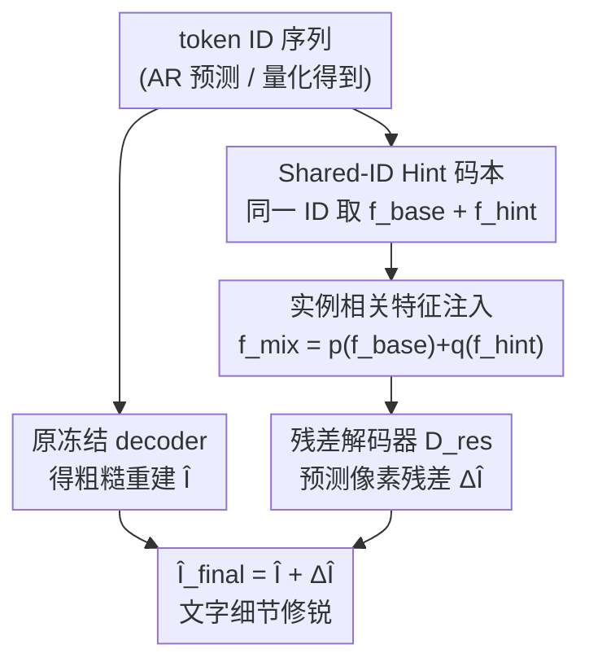

# Residual Decoder Adapter: ID-Preserving Tokenizer Adaption for Autoregressive Text Rendering

**会议**: CVPR 2026  
**arXiv**: [2606.01911](https://arxiv.org/abs/2606.01911)  
**代码**: https://github.com/CSU-JPG/RDA (有)  
**领域**: 图像生成 / 自回归视觉生成  
**关键词**: 视觉 tokenizer, 自回归图像生成, 文本渲染, 残差解码, 即插即用

## 一句话总结
针对自回归（AR）图像生成在"画字"时笔画模糊、字形扭曲的老毛病，本文把根因定位到视觉 tokenizer 的重建能力不足，提出 **Residual Decoder Adapter (RDA)**：冻结原 tokenizer 和 AR 模型，外挂一个共享 token-ID 的 Hint 码本 + 一条像素级残差解码支路，在不改 token 空间、不重训任何模型的前提下把文字重建质量补回来——Janus-Pro 1B 的 OCR 准确率从 24.52% 飙到 58.26%。

## 研究背景与动机
**领域现状**：自回归视觉模型（Janus-Pro、TAR、Lumina-mGPT 等）把图像生成建模成"预测离散视觉 token"的下一 token 预测任务，再由视觉 tokenizer（VQ-VAE 的 decoder）把 token 解码回像素。它们在 GenEval 这类通用文生图榜上已能和扩散模型掰手腕（0.80 vs 0.82）。

**现有痛点**：可一旦要求模型在图里**渲染清晰文字**，AR 模型就明显落后于扩散模型——笔画发虚、字母变形。文字渲染被公认为是"细粒度生成能力"的最严苛考验，而 AR 模型在这上面集体翻车。

**核心矛盾**：作者把问题溯源到 **tokenizer 的重建能力**，而非 token 预测本身。VQ 量化天生会抹掉高频/局部纹理（Fig.1b：Janus-Pro 的 VQ-VAE 在 ImageNet 上 rFID 9.63，弱于 FLUX 的连续 VAE 7.92）。因为 AR 模型只能通过离散 token 说话，量化阶段丢掉的细节在后续生成里根本补不回来——tokenizer 定义了 AR 模型能讲的整套"视觉语言"，文字渲染的天花板就卡在这里。

**本文目标**：能否**不重训 tokenizer、也不重训 AR 模型**，就提升 AR 模型的文字渲染？这是关键约束——直接换个更强的 tokenizer 当然可以，但换码本会改变 token ID 的分布，使之前训练的 AR 模型全部作废、必须从头重训，对十亿参数系统是上千 GPU 小时的代价。

**切入角度**：作者的关键观察是——**重建质量的提升可以和 token 分布解耦**。与其重做 tokenizer 的"输入端"（编码器、码本索引），不如只在"输出端"（解码后的像素）做文章：保留原码本的 ID 映射不变，只学一个补偿模块去修正 decoder 的输出像素。

**核心 idea**：把 tokenizer 从"静态瓶颈"重新理解为"可扩展接口"——外挂一个**共享 ID 的提示码本 + 残差解码器**，专门学习"重建图与真值图之间那一点点像素差（残差）"，从而非侵入式地增强 tokenizer，对下游 AR 模型完全即插即用。

## 方法详解

### 整体框架
RDA 是一个即插即用的精修框架：**全程冻结**原视觉 tokenizer（编码器、量化器、原 decoder）和 AR 模型，只训练两个轻量组件，把"丢失的文字细节"作为残差补回去。

整条链路这样转：给定一张图（训练时）或 AR 模型预测出的 token 序列（推理时），先用**原冻结 decoder $\mathcal{D}$** 解码得到一张粗糙重建图 $\hat{I}$。同时，每个 token ID 既用来从**原冻结码本 $Z$** 取出基础特征 $f_{\text{base}}$，又用**同一个 ID** 从可训练的 **Hint 码本 $Z'$** 取出高频提示特征 $f_{\text{hint}}$（这就是 Shared-ID 的核心）。两路特征经各自投影器融合成 $f_{\text{mix}}$，喂给一条并行的**残差解码器 $\mathcal{D}_{\text{res}}$**，预测像素级残差 $\Delta\hat{I}$。最终输出 $\hat{I}_{\text{final}} = \hat{I} + \Delta\hat{I}$，文字细节被显著修锐。由于 ID 空间分毫未变，AR 模型对此毫无感知，照常预测原 token 分布即可白嫖增益。

### 关键设计

**1. Shared-ID Hint 码本：用同一套 ID 给原码本配一本"高频补充字典"**

痛点直指 VQ 量化把连续特征压成离散码时不可避免地丢高频/局部纹理。作者的做法是再造一本**可训练的 Hint 码本 $Z' = \{z'_k\}_{k=1}^{K}$**，与原冻结码本 $Z = \{z_k\}_{k=1}^{K}$ **共用同一套索引**：给定任意 token id $i$，同时取 $f_{\text{base}}(i) = z_i$ 和 $f_{\text{hint}}(i) = z'_i$。基础特征保留全局结构与语义，提示特征则提供对齐的高频/细节线索。

这个"Shared-ID"设计是 plug-and-play 能成立的关键。因为检索规则共享，两本码本在特征空间上诱导出**完全相同的离散划分（分布）**，于是 $Z'$ 相当于 $Z$ 的"同分布补充"——对每个 token id（即每个语义簇）只学互补的高频细节，绝不改动底层语义。又因为原码本 $Z$ 冻结，**token id → 图像分布的映射保持不变**，所以已经学会预测原 token ID 分布的 AR 模型可以直接受益于 $Z'$ 带来的更好重建，零重训。

**2. 残差解码器 + 实例相关特征注入：只学"那一点差值"，并强制利用 base 分支**

把 tokenizer 丢掉的视觉细节明确定义为真值图与重建图之间的细粒度差 $\Delta I = I - \hat{I}$，让一条并行支路专门去学它。这一步分两小节：

其一是**实例相关特征注入**。融合公式为 $f_{\text{mix}} = p(f_{\text{base}}) + q(f_{\text{hint}})$，其中 $p(\cdot)$ 是原 tokenizer 自带的投影器，$q(\cdot)$ 是随机初始化从头训练的。这一步至关重要：Hint 码本对同一 id 取出的 $f_{\text{hint}}$ 是"实例无关"的（同一 token 永远取到同一向量），若只靠它训练，残差解码器拿不到当前这张图的实例特异信息，训练直接崩（Tab.6：No-Injection 设置下效果甚至**低于 baseline**，准确率 58.04%）。注入 $f_{\text{base}}$ 后，融合特征同时带上"高频线索"和"实例特异信息"，残差学习才能成立。

其二是**像素级残差学习**。残差解码器 $\mathcal{D}_{\text{res}}$ 从 $f_{\text{mix}}$ 预测 $\Delta\hat{I} = \mathcal{D}_{\text{res}}(f_{\text{mix}})$，最终重建为 $\hat{I}_{\text{final}} = \hat{I} + \Delta\hat{I}$。$\mathcal{D}_{\text{res}}$ 与架构无关，实现上直接复用 VQ-VAE decoder 结构，但把最后两层卷积的通道数翻倍以更好捕捉高频细节。"只学残差"而非"重学整图"既轻量，又把模型注意力集中到真正缺的文字高频上。

**3. 面向稀疏残差的多损失监督：把被背景淹没的差值信号"喂起来"**

架构虽简单，但训练并不平凡——核心难点是**残差信号稀疏**，文字残差容易被大面积背景像素主导。作者为此叠了一组损失（见下"损失函数"节），其中**残差感知损失 $\mathcal{L}_{\text{perc}}^{\text{res}}$ 是成败关键**：直接对预测残差 $\Delta\hat{I}$ 施加 VGG 感知监督，迫使模型关注结构信息而非逐像素均值，从而把稀疏信号的监督加强。消融显示去掉它训练直接退化回 baseline。这一设计点是把简单架构真正训练成功的"隐形主角"。

### 损失函数 / 训练策略
总损失为五项之和：

$$\mathcal{L}_{\text{total}} = \mathcal{L}_{\text{rec}} + \mathcal{L}_{\text{perc}}^{\text{final}} + \mathcal{L}_{\text{perc}}^{\text{res}} + \mathcal{L}_{\text{sobel}} + \mathcal{L}_{\text{freq}}$$

- **重建损失 $\mathcal{L}_{\text{rec}}$**：对残差输出用 MAE、对最终重建用 MSE。
- **最终感知损失 $\mathcal{L}_{\text{perc}}^{\text{final}} = \|\phi(I) - \phi(\hat{I}_{\text{final}})\|_2^2$**：VGG 多层特征上的感知监督。
- **残差感知损失 $\mathcal{L}_{\text{perc}}^{\text{res}} = \|\phi(\Delta I) - \phi(\Delta\hat{I})\|_2^2$**：对残差本身做感知监督，最关键一项。
- **边缘感知 Sobel 损失 $\mathcal{L}_{\text{sobel}} = |M_{\text{edge}} \odot (\Delta I - \Delta\hat{I})|_1$**：用 Sobel 边缘掩码 $M_{\text{edge}}$ 强调强梯度处残差，保边。
- **频域损失 $\mathcal{L}_{\text{freq}} = \frac{1}{BCHW}\sum M_q \odot |\mathcal{F}_p - \mathcal{F}_t|^2$**（$\mathcal{F}_t = \text{FFT}(\Delta I)$，$\mathcal{F}_p = \text{FFT}(\Delta\hat{I})$，$M_q$ 为高通掩码）：在谱域保高频。

训练细节：基于 LlamaGen-VQ（`vq_ds16_t2i`，Hint 码本 16384×16）与 Chameleon-VQ（码本 8192×16），从头训练 RDA 而冻结 base tokenizer。256×256 分辨率训练 120k 步，全局 batch 512，64 张 V100（8 节点×8 卡），混合精度，AdamW（$\beta_1{=}0.9, \beta_2{=}0.95$），学习率 1e-4，梯度裁剪 1。数据用 Mario-10M，剔除与 AnyText-Benchmark 重叠样本后随机采 5M 图。

## 实验关键数据

### 主实验

**通用 AR 模型（即插即用，无微调）** —— 每格为 wo/w RDA（Acc.，部分 ×100）：

| 模型 | Res | AnyText Acc.↑ | Mario-Eval Acc.↑ | LongTextBench Acc.↑ | CVTG-2K NED.↑ |
|------|-----|------|------|------|------|
| Janus-Pro 7B | 384 | 8.85/**10.07** | 6.75/**8.33** | 0.47/**0.96** | 20.14/**22.59** |
| TAR 7B | 512 | 30.92/**32.43** | 25.46/**27.89** | 6.92/**7.22** | 47.63/**52.00** |
| Lumina-mGPT 7B | 512 | 2.12/**2.29** | 0.29/**0.32** | 0.14/**0.28** | 13.19/**14.16** |

**文本专用 AR 模型（在 TextAtlas 上微调过）** —— 增益巨大：

| 模型 | Res | 子集 | Acc. wo/w | F1 wo/w | CER wo/w↓ |
|------|-----|------|------|------|------|
| Janus-Pro* 1B | 1024 | StyledTextVisionBlend | 24.52/**58.26** | 29.85/**63.18** | 0.47/**0.23** |
| Janus-Pro* 1B | 1024 | StyledTextSynth | 12.75/**36.81** | 17.37/**41.37** | 0.75/**0.52** |
| Lumina-mGPT* 7B | 1024 | StyledTextVisionBlend | 60.50/**73.14** | 64.53/**77.57** | 0.25/**0.17** |
| Lumina-mGPT* 7B | 1024 | StyledTextSynth | 34.33/**48.96** | 37.91/**53.43** | 0.42/**0.32** |

通用模型只涨约 +1.2 点，而文本专用模型涨 +33.74 点（Janus-Pro 1B StyledTextVisionBlend）。作者解读：通用 AR 模型有"双瓶颈"——文字 token 预测弱 + 重建保真度低；文本微调修好了前者，使 tokenizer decoder 成为主瓶颈，此时 RDA 正好对症下药，把改善后的 token 预测充分兑现成清晰文字。

**重建任务（Tab.3，低分辨率）** —— SSIM/LPIPS ×100：

| Tokenizer | 训练数据 | AR-Free | AnyText Acc. | Mario Acc. | StyledTextSynth Acc. |
|------|------|------|------|------|------|
| LlamaGen-VQ | 50M | ✗ | 21.26 | 15.26 | 4.12 |
| LlamaGen-VQ + RDA | 5M | ✔ | **36.79** | **27.59** | **13.57** |
| Chameleon-VQ + RDA | 5M | ✔ | 27.51 | 19.58 | 7.80 |
| UniTok | 1.28B | ✗ | 62.61 | 55.71 | 62.11 |

RDA 仅用 5M 图就把 OCR Acc/F1 抬约 10 点，且 SSIM/LPIPS 同步改善；相比 UniTok 用 1.28B 图重训整套且改变 token 分布，RDA 数据高效又 AR-training free。

### 消融实验

**损失消融（Tab.4，LlamaGen-VQ 高分辨率）**：

| 配置 | Acc.↑ | F1.↑ | LPIPS↓ | 说明 |
|------|------|------|------|------|
| Baseline | 58.04 | 64.55 | 6.52 | 无 RDA |
| Full (ours) | **66.48** | **70.95** | 6.28 | 完整 |
| w/o $\mathcal{L}_{\text{freq}}$ | 66.13 | 70.36 | 6.24 | 几乎不掉，边际贡献 |
| w/o $\mathcal{L}_{\text{sobel}}$ | 64.31 | 69.39 | 6.44 | 掉 2.17 点，边缘监督重要 |
| w/o $\mathcal{L}_{\text{perc}}^{\text{res}}$ | 58.30 | 64.84 | 6.49 | 训练彻底失败，退回 baseline |
| w/o $\mathcal{L}_{\text{perc}}^{\text{final}}$ | 64.58 | 69.87 | 7.63 | 中等下降 |

**Hint 码本设计 + 注入消融（Tab.5/6）**：

| 配置 | Acc.↑ | 说明 |
|------|------|------|
| Baseline | 58.04 | 无 RDA |
| No Codebook（仅残差学习） | 64.25 | 光残差支路就 +6.2 点 |
| dim=16† (训用测不用) | 65.45 | 训练时挂码本仍优于 No Codebook |
| dim=16 (ours) | **66.48** | 最佳维度 |
| No Injection（仅 $f_{\text{hint}}$） | 58.04 | 不注入 base，甚至不及 baseline |
| Add (ours) | 66.48 | 简单加法 |
| Cross-Attn / Concat+Conv | 65.58 / 66.04 | 与加法相当，故选最省的加法 |

### 关键发现
- **残差感知损失 $\mathcal{L}_{\text{perc}}^{\text{res}}$ 是绝对核心**：去掉它直接训练失败、退回 baseline——稀疏残差必须靠"对残差本身的结构性监督"才喂得起来。
- **实例相关特征注入不可省**：只用实例无关的 $f_{\text{hint}}$ 训练（No Injection），效果甚至低于 baseline，说明残差解码器必须吃到 base 分支带来的实例特异信息。
- **Hint 码本和残差支路各自有效且互补**：光残差支路就 +6.2 点；加上 Hint 码本再涨；有趣的是"训练时挂码本、推理时不挂"也优于完全不挂，说明 Hint 码本在训练阶段就强化了残差表征学习。
- **泛化性强**：仅在 256px 训练，可零微调泛化到 384/512/1024px；一个挂在 LlamaGen tokenizer 上的 RDA 可跨 Janus-Pro / TAR 多个 AR 架构与尺寸通用。

## 亮点与洞察
- **"重建增强可与 token 分布解耦"是全文最妙的洞察**：把改进从"输入端换码本"挪到"输出端修像素"，靠 Shared-ID 保持 token 分布不变，于是 AR 模型完全不用知道 tokenizer 被升级了——"an external tool that improves the base AR model without ever seeing it"。
- **残差学习 + 通道翻倍的 VQ-VAE decoder** 这种"只学差值、且把容量花在高频上"的思路，可迁移到任何"离散瓶颈丢细节"的场景（如离散音频 codec、低码率压缩）。
- **诊断式贡献**：作者先把 AR 文字渲染弱的锅明确扣到 tokenizer 重建（而非 token 预测），并用"通用模型 +1.2 点 vs 文本微调模型 +33.7 点"的对比反向验证了"双瓶颈"假说——这个实验设计本身比方法更有说服力。
- **极致的工程经济性**：5M 图 vs UniTok 的 1.28B 图、且零重训下游 AR 模型，把"换 tokenizer = 重训一切"的死结彻底绕开。

## 局限性 / 可改进方向
- **本质是"事后修锐"而非"从源头生成对"**：RDA 修的是 decoder 输出的像素残差，token 序列本身若预测错了字（语义级错误），残差支路补不回来——它解决的是"重建保真"瓶颈，不解决"token 预测"瓶颈，这也是通用 AR 模型增益有限的根因。
- **OOD 泛化是隐忧**：作者自己在 Discussion 里指出，直接在文字数据上微调 decoder 会有严重 OOD 问题（ImageNet-10K 自然图上崩）；RDA 训练于文字密集的 Mario-10M，在纯自然图上的表现需要谨慎评估（论文用残差设计缓解，但仍是开放问题）。
- **绝对天花板仍低于重训的强 tokenizer**：RDA 后的 Acc 普遍仍逊于 UniTok（1.28B 图重训）这类强 tokenizer——它换来的是"便宜、即插即用"，而非"最强重建"。
- **额外推理开销**：虽宣称开销可忽略，但每张图多走一条残差 decoder（且最后两层通道翻倍），高分辨率/大批量下的实际延迟成本论文未充分量化。

## 相关工作与启发
- **vs 重训强 tokenizer（UniTok / 扩大码本 / 分层量化等）**：它们直接做更强的 tokenizer，但改码本就改 token 分布，必须重训整个 AR 模型；RDA 反其道而行——冻结一切、只外挂残差支路且保 ID 不变，用数据效率和零重训换取"够用"的增益。
- **vs 用扩散/DiT decoder 替换原 decoder**：这类方法（替换 decoder 提升解码能力）仍需 AR–decoder 联合训练和大规模数据，重训成本高；RDA 是纯即插即用、不碰 AR 模型。
- **启发**：当一个系统的瓶颈在"离散接口的重建端"而非"预测端"时，与其推倒重来，不如设计一个"共享接口 ID、只学残差"的旁路适配器——这套"非侵入式升级冻结接口"的范式可能适用于一切"上游已大规模训练、下游依赖固定 token 空间"的多模态系统。

## 评分
- 新颖性: ⭐⭐⭐⭐⭐ Shared-ID 码本 + 像素残差解码这套"解耦重建增强与 token 分布"的范式确实新颖，把"换 tokenizer 必重训"的死结绕开。
- 实验充分度: ⭐⭐⭐⭐⭐ 覆盖 3 类 AR 模型、5 个文字 benchmark、生成 + 重建双设定、损失/码本/注入三组消融，且有"双瓶颈"对照实验佐证假说。
- 写作质量: ⭐⭐⭐⭐ 动机清晰、图示到位，但原文有不少拼写/笔误，个别表格数值排版混乱需对照原文。
- 价值: ⭐⭐⭐⭐⭐ 即插即用、5M 图、零重训下游模型，工程落地价值极高，对所有 VQ-based AR 文生图模型直接可用。

<!-- RELATED:START -->

## 相关论文

- [\[ICML 2026\] End-to-End Autoregressive Image Generation with 1D Semantic Tokenizer](../../ICML2026/image_generation/end-to-end_autoregressive_image_generation_with_1d_semantic_tokenizer.md)
- [\[CVPR 2026\] TextPecker: Rewarding Structural Anomaly Quantification for Enhancing Visual Text Rendering](textpecker_rewarding_structural_anomaly_quantification_for_enhancing_visual_text.md)
- [\[ICCV 2025\] Holistic Tokenizer for Autoregressive Image Generation](../../ICCV2025/image_generation/holistic_tokenizer_for_autoregressive_image_generation.md)
- [\[CVPR 2026\] ResCa: Residual Caching for Diffusion Transformers Acceleration](resca_residual_caching_for_diffusion_transformers_acceleration.md)
- [\[CVPR 2026\] GlyphPrinter: Region-Grouped Direct Preference Optimization for Glyph-Accurate Visual Text Rendering](glyphprinter_region-grouped_direct_preference_optimization_for_glyph-accurate_vi.md)

<!-- RELATED:END -->
