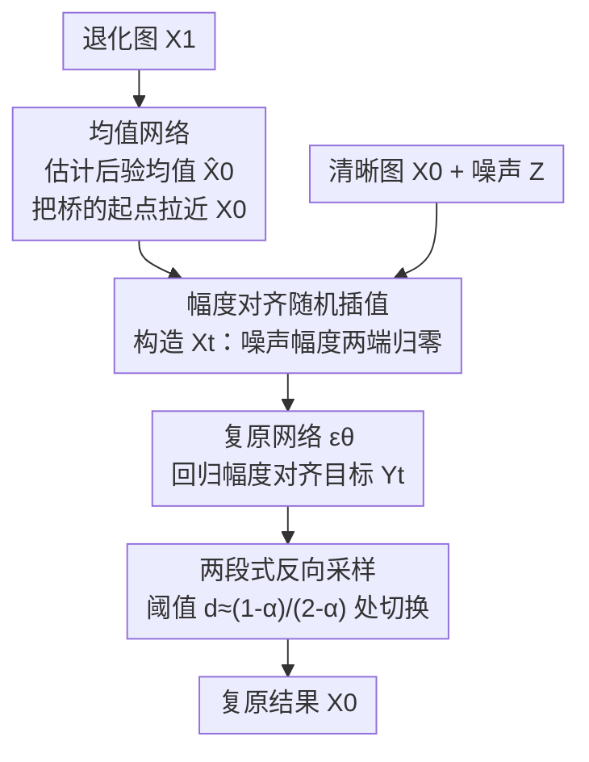

# Resolving Endpoint Underfitting in Diffusion Bridges via Noise Alignment

**会议**: CVPR 2026  
**论文**: [CVF Open Access](https://openaccess.thecvf.com/content/CVPR2026/html/Gao_Resolving_Endpoint_Underfitting_in_Diffusion_Bridges_via_Noise_Alignment_CVPR_2026_paper.html)  
**代码**: https://github.com/gyr02/NADB  
**领域**: 扩散模型 / 图像生成  
**关键词**: 扩散桥, 端点欠拟合, 噪声对齐, 随机插值, 图像复原

## 一句话总结
作者发现以 I2SB 为代表的扩散桥模型在靠近目标端点（$t\to0$）时会出现"端点欠拟合"——预测方差崩塌、方向错乱，根因是网络输入与回归目标的噪声幅度趋势相互矛盾；他们提出 NADB，用一个"幅度对齐的随机插值"修方差、用一个均值网络拉近桥的两端来修方向，在 ImageNet 多个复原/翻译任务上稳定超过 I2SB。

## 研究背景与动机
**领域现状**：图像复原（去模糊、JPEG 去伪影、超分）近年被生成模型主导。标准条件扩散把低质图一路映射到纯高斯噪声、再反向重建，路径"绕远路"。扩散桥（diffusion bridge）则直接在"退化分布"和"清晰分布"之间学一条随机轨迹，天然契合复原任务，I2SB 是其中开创性的工作。

**现有痛点**：I2SB 的做法是"照搬"标准扩散——学一个 score 函数、用和扩散一样的回归目标训练。作者把 I2SB 网络在整个时间轴上的输出画出来后发现：在 $t\to0$ 的**目标端点**附近，网络严重欠拟合，表现为预测方差急剧崩塌、预测方向（与真值的余弦相似度）骤降。而这恰恰是生成最后、最需要补高频细节的阶段，等于给复原质量加了一个天花板。

**核心矛盾**：根因是**输入与目标之间的噪声调度趋势不一致**。看 I2SB 的插值路径（Eq. 2）：网络输入 $X_t$ 的噪声系数随 $t\to0$ 趋于 0，输入几乎变成确定性的清晰图 $X_0$；但训练目标 $\frac{X_t-X_0}{\sigma_t}$（Eq. 3、展开为 Eq. 4）的噪声系数却趋于 1，目标几乎变成纯噪声 $Z$。于是网络被迫"从一个确定性的干净输入去预测随机噪声"——这是一个病态（ill-conditioned）的学习任务。

**本文目标**：把端点欠拟合拆成两个可分别解决的子问题——**幅度失败**（方差对不上）和**方向失败**（方向对不上），并分别修掉。

**核心 idea**：不再照搬 score-matching，而是从更灵活的随机插值（Stochastic Interpolants）视角重新设计映射，让输入和目标的噪声幅度"对齐"在同一量级，并用均值网络把桥的两端拉近。

## 方法详解

### 整体框架
NADB 的输入是退化图 $X_1$，输出是复原后的清晰图 $X_0$，整条管线在 I2SB 的基础上动了两处。第一处在桥的"起点"：先用一个冻结的**均值网络**把退化图 $X_1$ 预处理成它的后验均值估计 $\hat{X}_0=\mathbb{E}[X_0\mid X_1]$，用 $\hat{X}_0$ 取代原来的 $X_1$ 当作桥的代理端点——这一端比 $X_1$ 离目标 $X_0$ 近得多。第二处在桥的"形状"：用一个**幅度对齐的随机插值**重新定义 $X_0$ 与 $\hat{X}_0$ 之间的轨迹 $X_t$ 和回归目标，使输入和目标的噪声幅度在 $t=0$ 和 $t=1$ 两端同时归零。复原网络 $\epsilon(X_t,t;\theta)$ 在这条新插值上训练；推理时反向采样，并在临近端点处切换成一个端点条件化的两段式过程。

### 关键设计

**1. 均值网络：把桥的起点从"退化图"挪到"后验均值"，先修方向失败**

幅度对齐（设计 2）能把方差拉回来，但回归目标里始终留着一项确定性的位移 $(X_1-X_0)$。当退化图 $X_1$ 和清晰图 $X_0$ 的分布差距很大时，这一项很难回归准，于是预测方向就会出错。作者的对策是引入一个均值网络 $M(\cdot;\phi)$，它被单独训练去逼近后验均值 $\mathbb{E}[X_0\mid X_1]$：

$$\mathcal{L}_{\text{MSE}}(\phi)=\mathbb{E}_{(X_0,X_1)}\big[\|M(X_1;\phi)-X_0\|^2\big]$$

输出记为 $\hat{X}_0=M(X_1;\phi)$。它带来两个好处：其一，把要回归的位移从复杂的 $(X_1-X_0)$ 简化成更短的 $(\hat{X}_0-X_0)$，直接缓解方向误差；其二，$\hat{X}_0$ 形成的分布 $\hat\rho_0$ 比原始 $\rho_1$ 离目标 $\rho_0$ 更近——论文用 Theorem 2 给出 Wasserstein-2 意义下的保证 $W_2(\rho_0,\hat\rho_0)\le W_2(\rho_0,\rho_1)$。在更近的一对分布之间建桥，拟合自然更稳。$\hat{X}_0$ 可能偏平滑（over-smoothed），但它只是桥的端点、不是最终输出，后续复原网络仍会补回细节。训练时 $M$ 先在每个任务上独立训练到 MSE 收敛、再冻结，喂给它的时间步恒为 0。

**2. 幅度对齐的随机插值：让输入和目标的噪声同涨同落，根治方差崩塌**

I2SB 病在输入噪声系数趋于 0、目标噪声系数却趋于 1。作者直接重新设计插值路径和训练目标，要求二者的噪声幅度"耦合"、且在两个端点都消失。定义幅度对齐插值（用 $\hat{X}_0$ 当端点的最终形式）：

$$X_t := (1-t^\alpha)X_0 + t^\alpha \hat{X}_0 + kt(1-t)Z$$

对应的训练目标取"缩放位移"：

$$Y_t := \frac{X_t-X_0}{t^\alpha} = (\hat{X}_0-X_0) + kt^{1-\alpha}(1-t)Z$$

其中 $\alpha\in(0,1)$、$k$ 为有限常数，$Z\sim\mathcal{N}(0,I)$。这样输入 $X_t$ 的噪声系数 $\gamma_X(t)=kt(1-t)$ 与目标 $Y_t$ 的噪声系数 $\gamma_Y(t)=kt^{1-\alpha}(1-t)$ 在 $t=0$ 和 $t=1$ 处**同时归零**（Proposition 1），整段时间里二者都保持在同一量级——这正是 I2SB 缺的"幅度对齐"。复原网络用如下目标训练：

$$\mathcal{L}_{\text{NADB}}=\mathbb{E}_{t,X_0,X_1,Z}\Big[\big\|\epsilon(X_t,t;\theta)-\tfrac{X_t-X_0}{t^\alpha}\big\|^2\Big]$$

和均值网络是互补关系：消融显示只做幅度对齐能修好方差、但方向仍崩；只加均值网络则方差、方向都救不回来——两者缺一不可。

### 损失函数 / 训练策略
两个网络都用相同的 U-Net 结构（用 ImageNet 256×256 上预训练的 ADM checkpoint 初始化）。先把均值网络 $M_\phi$ 在每个任务上独立训练到收敛并冻结，再用 $\mathcal{L}_{\text{NADB}}$ 训练复原网络 $\epsilon_\theta$（Algorithm 1）。超参 $\alpha=0.4$、$k=0.75$，Adam，学习率 $1\times10^{-4}$，batch 256，8×A100。推理（Algorithm 2）先一次性算出 $\hat{X}_0$，反向采样时在时间阈值 $d\approx\frac{1-\alpha}{2-\alpha}$ 处切换：$t\ge d$ 用常规转移、$t<d$ 用端点条件化的转移，以保证临近 $t\to0$ 时方差项非负。

## 实验关键数据

### 主实验
在 ImageNet 256×256 的三类复原任务上与直接对标的 I2SB 头对头比较（训练预算一致），NFE=10 与 100 两档。NADB 在感知指标（FID/LPIPS）和保真指标上几乎全面占优，去模糊任务提升尤其大：

| 任务 (NFE=10) | 指标 | I2SB | NADB |
|------|------|------|------|
| JPEG QF5 | FID↓ / LPIPS↓ | 8.0 / 0.30 | 6.9 / 0.30 |
| 4× 超分 (Pool) | FID↓ / LPIPS↓ | 7.3 / 0.27 | 5.3 / 0.23 |
| 去模糊 (Uniform) | FID↓ / PSNR↑ / LPIPS↓ | 10.3 / 24.19 / 0.32 | 4.8 / 27.70 / 0.18 |
| 去模糊 (Gaussian) | FID↓ / PSNR↑ / SSIM↑ | 7.4 / 25.42 / 0.71 | 4.2 / 30.03 / 0.87 |

和主流条件扩散模型对比（NFE=100，FID 为主指标）：

| 任务 | 最优 baseline | NADB FID↓ |
|------|---------------|-----------|
| JPEG QF5 | Palette 8.3 | 4.3 |
| 4× 超分 (Pool) | DDNM/ΠGDM 3.8 | 1.1 |
| 去模糊 (Uniform) | DDNM 3.0 | 3.4 ⚠️ 此项略逊 |

图像翻译（64×64，edges→handbags / edges→shoes）上也优于 I2SB 与强基线 DDBM，且低 NFE 下质量更稳（DDBM 退化明显）：

| 任务 | DDBM | I2SB | NADB |
|------|------|------|------|
| Edges→Handbags FID↓ | 114.3 | 116.0 | 111.3 |
| Edges→Shoes FID↓ | 120.1 | 119.5 | 117.8 |

### 消融实验
在退化最重、最能放大端点失败的 JPEG-5 上比较四个模型（NFE=10）：

| 配置 | FID↓ | PSNR↑ | 说明 |
|------|------|-------|------|
| I2SB | 8.0 | 24.50 | 原始基线，方差+方向双崩 |
| I2SB w. Mean | 8.8 | 24.51 | 只加均值网络，欠拟合没救回来 |
| NADB w/o Mean | 7.0 | 24.36 | 只做幅度对齐，方差好了但方向仍崩 |
| NADB (Full) | 6.9 | 24.45 | 两者齐全才完整解决 |

### 关键发现
- **两个组件分工明确、互不可替代**：均值网络专修"方向"（余弦相似度），幅度对齐插值专修"方差"（幅度）。单独任一个都不够——"只加均值网络"甚至 FID 还略升到 8.8，说明底层映射仍病态时光预处理端点没用。
- **端点是胜负手**：增益集中在 $t\to0$ 的最后精修阶段，这也是去模糊任务（PSNR 从 ~24 跳到 ~30）提升最猛的原因——重退化任务对端点拟合最敏感。
- **低 NFE 鲁棒**：在图像翻译上 NADB 随 NFE 下降仍保持质量，而 DDBM 显著退化，说明噪声对齐让采样轨迹更"好走"。

## 亮点与洞察
- **把"端点欠拟合"诊断成噪声趋势矛盾**：作者没有泛泛说"扩散桥不好训"，而是把网络输入与回归目标的噪声系数曲线摆在一起，指出二者在 $t\to0$ 一个趋 0、一个趋 1 是病根——诊断本身就很有说服力，且把问题干净地拆成"幅度+方向"两个可分别攻克的轴。
- **"幅度对齐"是个可迁移的设计原则**：让网络输入和回归目标的噪声系数在端点同时归零（$\gamma_X,\gamma_Y$ 都含 $t(1-t)$ 因子），这个约束对任何"桥式/插值式"生成框架都适用，不限于复原。
- **均值网络 = 用一个便宜的确定性预测器缩短桥**：先回归后验均值把端点拉近、再让扩散桥补细节，这种"粗到细两段接力"思路可迁移到其他配对生成/翻译任务。

## 局限与展望
- **多了一个网络的训练/存储成本**：均值网络需为每个任务单独训练并冻结，整体是"双 U-Net"，比单网络的 I2SB 重。
- **端点采样需要分段技巧**：反向过程要在阈值 $d$ 处切换才能保证方差非负，$d$ 与 $\alpha$ 耦合，超参（$\alpha=0.4,k=0.75$）的普适性未充分讨论。
- **个别任务未全面领先**：去模糊 Uniform 核下 FID（3.4）略逊于 DDNM（3.0），说明在某些核/退化下条件扩散仍有优势。
- ⚠️ 桥的反向采样推导、Theorem 2 证明都放在补充材料，正文只给结论，复现细节需结合代码核对。

## 相关工作与启发
- **vs I2SB**：I2SB 照搬标准扩散的 score-matching 目标，导致端点处输入/目标噪声趋势矛盾、欠拟合；NADB 改从随机插值视角重设映射（幅度对齐）+ 均值网络拉近端点，本质是"让训练目标和插值路径耦合"，这是本文反复强调的核心价值。
- **vs 条件扩散（DDRM/DDNM/ΠGDM/Palette）**：它们把低质图映射到纯噪声再重建、路径绕远，且常受 perception-distortion trade-off 影响输出偏糊；扩散桥直接在退化↔清晰两个流形间建轨迹，NADB 在 FID 上整体更优。
- **vs 其他扩散桥（DDBM/I3SB/RDBM/GOUB）**：多数沿着标准扩散的改进路径走（h-transform、加速采样等），NADB 转而从 Stochastic Interpolants 重新构造桥，直指端点失败这一被忽视的结构性缺陷。

## 评分
- 新颖性: ⭐⭐⭐⭐ 把"端点欠拟合"诊断为噪声趋势矛盾并给出幅度对齐+均值网络的针对性修法，视角新且干净。
- 实验充分度: ⭐⭐⭐⭐ 覆盖三类复原 + 图像翻译、多 NFE，消融把两组件分工讲透；个别核下未全面领先。
- 写作质量: ⭐⭐⭐⭐ 问题—诊断—解法逻辑闭环，公式清晰；采样/证明放补充材料略影响自洽。
- 价值: ⭐⭐⭐⭐ "幅度对齐"原则可迁移到广义桥式生成，对扩散桥社区有方法论意义。

<!-- RELATED:START -->

## 相关论文

- [\[CVPR 2026\] Resolving the Identity Crisis in Text-to-Image Generation](resolving_the_identity_crisis_in_text-to-image_generation.md)
- [\[CVPR 2026\] Elucidating the Design Space of Arbitrary-Noise-Based Diffusion Models](eda_arbitrary_noise_diffusion_design_space.md)
- [\[ICML 2026\] Restoring Initial Noise Sensitivity in Text-to-Image Distillation via Geometric Alignment](../../ICML2026/image_generation/restoring_initial_noise_sensitivity_in_text-to-image_distillation_via_geometric_.md)
- [\[CVPR 2026\] Beyond the Golden Data: Resolving the Motion-Vision Quality Dilemma via Timestep Selective Training](beyond_the_golden_data_resolving_the_motion-vision_quality_dilemma_via_timestep_.md)
- [\[CVPR 2026\] Correspondence-Attention Alignment for Multi-View Diffusion Models](correspondence-attention_alignment_for_multi-view_diffusion_models.md)

<!-- RELATED:END -->
