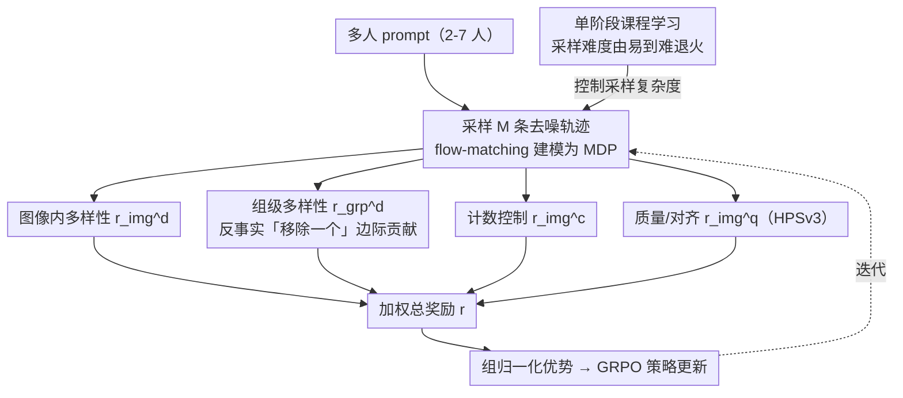

# Resolving the Identity Crisis in Text-to-Image Generation

**会议**: CVPR 2026  
**arXiv**: [2510.01399](https://arxiv.org/abs/2510.01399)  
**代码**: [https://qualcomm-ai-research.github.io/disco/](https://qualcomm-ai-research.github.io/disco/)  
**领域**: 扩散模型  
**关键词**: 身份多样性, 多人图像生成, 强化学习, GRPO, 文本到图像

## 一句话总结
本文揭示了文本到图像模型在多人场景生成中的"身份危机"问题（重复面孔、身份合并），提出 DisCo 框架，通过组合式奖励函数和 GRPO 强化学习微调 flow-matching 模型，实现了 98.6% 的唯一面孔准确率，超越包括 GPT-Image-1 在内的闭源模型。

## 研究背景与动机
1. **领域现状**：当前文本到图像模型（FLUX、SD3.5 等）在生成单人图像时已达到很高质量，但在多人场景生成中仍存在严重缺陷。
2. **现有痛点**：多人生成时频繁出现三个问题——重复面孔（不同人有相同面孔）、身份合并（多人特征混杂）、人数错误（生成的人数与 prompt 不符）。即使图像整体质量很高，身份差异化也不足。
3. **核心矛盾**：现有方法和 RL 微调工作主要优化美学、文本一致性和人类偏好，但从未显式地优化身份多样性，特别是跨样本的身份多样性。
4. **本文目标** (a) 图像内部的身份重复 (b) 跨样本的身份重复 (c) 人数计数准确性 (d) 保持图像质量不下降。
5. **切入角度**：作者发现仅优化图像内多样性会导致"全局多样性崩塌"——重复身份从同一图像转移到不同图像中。这个关键发现驱动了组级奖励的设计。
6. **核心 idea**：通过 GRPO 强化学习框架和精心设计的四项组合奖励（图像内多样性 + 跨样本多样性 + 计数控制 + 质量保持），在不需要真实数据标注的情况下解决多人生成的身份危机。

## 方法详解

### 整体框架
DisCo 基于 Flow-GRPO 框架，将 flow-matching 模型的去噪过程建模为马尔可夫决策过程（MDP）。给定文本 prompt，采样一组 $M$ 条轨迹，对每条轨迹的最终图像计算组合奖励，通过组归一化优势函数进行策略更新。训练使用较少的去噪步数以提高效率，测试时使用完整步数。

### 关键设计

DisCo 的核心是把"身份危机"拆成四个可独立检测的奖励信号，再叠一层课程学习稳住训练。四项奖励里前两项管多样性、后两项防止优化跑偏，缺一不可。

**1. 图像内多样性奖励 $r_{\text{img}}^d$：先治"同一张图里几个人长一样"**

这是最直觉的入口。用 RetinaFace 检出每张脸、ArcFace 抽身份嵌入，然后看同一张图内所有面孔两两之间最像的那一对：$r_{\text{img}}^d = 1 - \max_{j \neq k} s(f_j, f_k)$，$s$ 是余弦相似度；图里不足两人时无从比较，给中性值 0.5。只要图内最相似的一对越不像，奖励越高。但作者很快发现这个奖励有个隐患——它只盯单张图，模型可以把重复的脸从"同一张图内"挪到"不同图之间"，照样拿高分。这个迁移现象正是下一个设计要堵的口子。

**2. 组级多样性奖励 $r_{\text{grp}}^d$：堵住重复身份在样本之间"流动"**

这是全文最关键的设计。它要回答的是图像内奖励答不上的问题：同一个 prompt 采出来的 $M$ 张图，彼此之间会不会都长成同一批人。难点在于"集合层面的多样性"本身不可微、也无法直接归因到某一张图上。作者用一个反事实的"移除一个"统计来破题——先算这组 $M$ 张图所有面孔的平均成对相似度 $S_G$，再把图像 $i$ 的脸全部抽掉重算一遍得到 $S_{G-i}$，二者之差 $\Delta_i = S_G - S_{G-i}$ 就是图像 $i$ 对整组重复度的边际贡献。$\Delta_i > 0$ 意味着拿掉它之后整组更"散"了，说明它在制造重复，该罚；于是奖励取 $\sigma(-\lambda \Delta_i)$，用 sigmoid 把这个边际贡献压到 $[0,1]$。这一招把不可微的集合级目标，干净地拆成了每张图各自的可优化信号，正面对治了"全局身份分布崩塌"。

**3. 计数控制奖励 $r_{\text{img}}^c$：堵住模型靠"少画几个人"作弊**

多样性奖励一旦上去，会诱发一种典型的 reward hacking：既然人越多越容易撞脸被罚，模型干脆少生成几个人来规避惩罚。计数奖励直接对着这个漏洞——检测到的面孔数恰好等于 prompt 要求的人数就给 1，否则给 0。一个简单的二值约束，逼着模型在"多样"和"足量"之间都达标，而不是用减员换多样性。

**4. 质量/对齐奖励 $r_{\text{img}}^q$：防止画面塌成"网格脸"、prompt 也跟丢**

光追多样性还会带出两个副作用：面孔被排成生硬的网格状伪影，以及对 prompt 的遵循度下滑。这里直接拿 HPSv3 的人类偏好评分当奖励、归一化到 $[0,1]$ 兜住整体质量与对齐。作者还观察到一个意外收获——这项奖励顺带提升了模型对组合式 prompt 的遵循能力。

**5. 单阶段课程学习：让专家模型也能在复杂多人场景上收敛**

像 Krea-Dev 这类专家模型直接上 2-$N_{\max}$ 人的复杂 prompt 很难收敛。课程学习的做法是训练初期偏向简单场景（2-4 人），再按退火权重 $\lambda_t = (t/t_{\text{curriculum}})^{\gamma_c}$ 逐步过渡到对所有复杂度均匀采样，$\gamma_c$ 控制由易到难的快慢。整个过程仍是单阶段、不切换训练目标，只是采样难度在动。实验里通用模型（Flux-Dev）对它依赖不大，但专家模型几乎靠它才跑得通。

### 损失函数 / 训练策略
总奖励 $r(\tau_i, c, G) = \alpha r_{\text{img}}^d + \beta r_{\text{grp}}^d + \gamma r_{\text{img}}^c + \zeta r_{\text{img}}^q$，四项均归一化到 [0,1]。训练使用 30,000 个 GPT-5 生成的多人场景 prompt（2-7人），不需要任何真实数据标注。

## 实验关键数据

### 主实验（DiverseHumans-TestPrompts）

| 模型 | Count Acc | UFA | GIS | HPS | 平均 |
|------|----------|-----|-----|-----|------|
| GPT-Image-1 | 90.5 | 85.1 | 89.8 | 33.4 | 78.7 |
| DisCo(Flux) | **92.4** | **98.6** | **98.3** | 33.4 | **81.7** |
| DisCo(Krea) | 83.5 | 89.7 | 90.6 | 32.2 | 76.8 |
| Flux-Dev (基线) | 70.8 | 48.2 | 50.5 | 31.7 | 56.0 |
| Krea-Dev (基线) | 73.6 | 45.8 | 50.6 | 31.2 | 57.8 |

### 消融实验（Krea-Dev 基线）

| 配置 | Count Acc | UFA | GIS | HPS |
|------|----------|-----|-----|-----|
| 基线 | 73.6 | 45.8 | 50.6 | 31.2 |
| +图像内多样性 | 66.2 | 78.6 | 50.8 | 31.7 |
| +组级多样性 | 67.3 | 80.2 | 72.5 | 32.0 |
| +计数控制+HPS | 79.2 | 82.6 | 73.7 | 32.4 |
| +课程学习(完整DisCo) | **83.5** | **89.7** | **90.6** | 32.2 |

### 关键发现
- **全局身份崩塌现象**：仅使用图像内多样性奖励时，UFA 从 45.8% 提升到 78.6%，但 GIS 几乎不变（50.6→50.8）。加入组级奖励后 GIS 大幅提升至 72.5%，验证了跨样本多样性是独立且关键的优化目标。
- **Reward hacking**：多样性奖励导致计数准确率下降（73.6→66.2），模型通过生成更少人来投机。计数奖励有效解决了这一问题。
- **DisCo 超越闭源模型**：在 UFA（98.6% vs 85.1%）和 GIS（98.3% vs 89.8%）上显著超越 GPT-Image-1，HPS 质量评分保持不变。
- **课程学习对专家模型至关重要**：Krea-Dev（专家模型）依赖课程学习才能收敛，Flux-Dev（通用模型）对课程学习依赖较小。

## 亮点与洞察
- **组级反事实奖励设计**非常巧妙——通过"移除一个样本"计算边际贡献，将不可微的集合级多样性目标转化为可归因到单样本的奖励信号。这种设计思路可迁移到任何需要集合级属性优化的 RL 场景。
- **发现并解决了 RL 微调中的三种 reward hacking 模式**：欠计数、网格伪影、prompt 不遵循。每种 hacking 都有对应的对抗机制，形成了完整的鲁棒优化框架。
- **零标注训练**：整个训练流程不需要任何人工标注的真实数据，仅需 GPT-5 生成的 prompt + 预训练的面孔检测/识别模型作为奖励信号。

## 局限与展望
- 依赖 RetinaFace 和 ArcFace 作为面孔检测和识别工具，这些模型本身在侧脸、遮挡等场景下可能不准确。
- 仅关注面部身份多样性，未显式处理其他属性（如体型、年龄分布）的多样性，虽然实验发现面部多样性训练副产品式地改善了这些。
- 训练 prompt 仅覆盖 2-7 人场景，更大规模人群的泛化未验证。
- 未探索将此方法扩展到视频生成中多角色一致性问题。

## 相关工作与启发
- **vs Flow-GRPO**: DisCo 构建在 Flow-GRPO 之上，但加入了身份多样性特有的奖励设计。Flow-GRPO 仅优化通用的文本对齐和质量，不处理身份问题。
- **vs MultiHuman-TestBench**: 该 NeurIPS 2025 工作识别了多人生成的偏差问题，但仅诊断未解决；DisCo 正是针对其未来工作方向的直接解决方案。
- **vs 对抗训练方法**: DisCo 通过 RL 微调而非对抗训练，更灵活地优化多个异质、不可微的目标。

## 评分
- 新颖性: ⭐⭐⭐⭐ 首次将身份多样性作为显式优化目标，组级反事实奖励设计有原创性
- 实验充分度: ⭐⭐⭐⭐⭐ 两个测试集、多个基线（含闭源）、详细消融、泛化分析
- 写作质量: ⭐⭐⭐⭐ 问题定义清晰，reward hacking 分析有深度
- 价值: ⭐⭐⭐⭐ 解决了实际应用中的重要问题，方法可扩展

<!-- RELATED:START -->

## 相关论文

- [\[CVPR 2026\] Disentangling to Re-couple: Resolving the Similarity-Controllability Paradox in Subject-Driven Text-to-Image Generation](disentangling_to_re-couple_resolving_the_similarity-controllability_paradox_in_s.md)
- [\[CVPR 2026\] PositionIC: Unified Position and Identity Consistency for Image Customization](positionic_unified_position_and_identity_consistency_for_image_customization.md)
- [\[CVPR 2026\] Synthetic Curriculum Reinforces Compositional Text-to-Image Generation](synthetic_curriculum_reinforces_compositional_text-to-image_generation.md)
- [\[CVPR 2026\] When Safety Collides: Resolving Multi-Category Harmful Conflicts in Text-to-Image Diffusion via Adaptive Safety Guidance](when_safety_collides_resolving_multi-category_harmful_conflicts_in_text-to-image.md)
- [\[CVPR 2026\] Extending One-Step Image Generation from Class Labels to Text via Discriminative Text Representation](emf_meanflow_text_to_image.md)

<!-- RELATED:END -->
