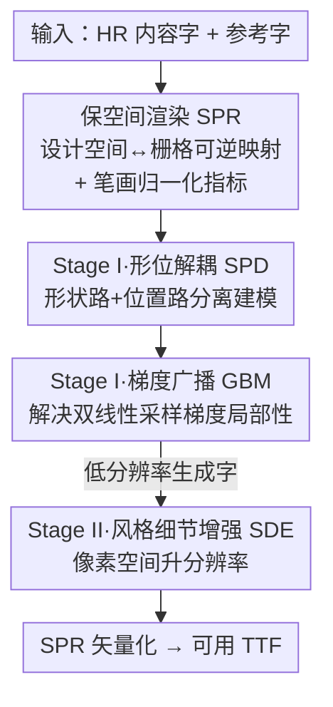

# Rethinking Glyph Spatial Information in Font Generation

**会议**: CVPR 2026  
**论文**: [CVF Open Access](https://openaccess.thecvf.com/content/CVPR2026/html/Su_Rethinking_Glyph_Spatial_Information_in_Font_Generation_CVPR_2026_paper.html)  
**代码**: https://github.com/sp777g/GlyphSpatialNet （有）  
**领域**: 扩散模型 / 图像生成  
**关键词**: 少样本字体生成, 中文字体, 空间信息, 形位解耦, 矢量化

## 一句话总结
针对少样本中文字体生成（FFG），本文指出现有方法忽略了"字形空间信息"，既在数据管线层面用失真渲染破坏了控制点坐标、又在模型层面把字形的"形状"和"位置"隐式耦合在一起优化；为此提出一套保空间渲染方案 SPR（配 OFL 中文字体数据集与归一化指标）打通栅格↔矢量的可逆映射，并设计两阶段的 GlyphSpatialNet（形位解耦 SPD + 梯度广播 GBM + 风格细节增强 SDE）在像素空间显式建模空间变换，无需任何部件/笔画标签即在统一基准上刷新 SOTA。

## 研究背景与动机
**领域现状**：少样本字体生成希望从极少参考字（如 $N=8$）自动生成一整套字库。主流是"栅格驱动"路线——把字形渲染成图像后用 GAN / 扩散模型做风格迁移，因为栅格表示确定、易建模；相比之下矢量驱动方法因控制点表示非唯一，在复杂字形（尤其中文）上极易产生笔画错误。

**现有痛点**：作者发现两个层面的硬伤。① 管线层面：字体本是矢量存储，但渲染成图时常用的"包围盒居中 + 非均匀缩放"会破坏控制点的绝对坐标，引入**空间偏置**，既损害后续矢量化精度、又污染数据集质量；加上版权限制导致各家自采数据、渲染方案各异，根本无法形成统一基准。② 模型层面：早期方法做风格-内容解耦、后续方法建模"源字→目标字"的形变，但都缺乏对空间信息的显式建模，把**形状误差和位置偏置塞进同一个优化目标**里隐式耦合，导致细粒度形状学习受阻、泛化能力被空间变换轻易破坏。

**核心矛盾**：手工字体设计本来是"几何编辑"和"空间编辑"分开处理的；而现有模型把两者拧成一团优化——空间上的平移/缩放一旦扰动，就会把已学到的形状映射打乱，这正是泛化崩坏的根源。

**本文目标**：(1) 在渲染/评测层面消除空间偏置、建立可逆的栅格↔矢量桥梁与统一基准；(2) 在模型层面把"形状"与"位置"显式拆开建模。

**切入角度**：既然问题来自"空间信息被破坏 + 形位耦合"，那就从源头保住空间信息（保空间渲染），并在像素空间里借鉴空间变换网络 STN 的思路，把位置预测单独拉出一条路。

**核心 idea**：用"保空间渲染 + 形位解耦"代替"失真渲染 + 隐式耦合"，在像素空间显式建模字形空间信息，从而打通端到端可用字库生成。

## 方法详解

### 整体框架
方法分两条主线：一套**数据/评测基建（SPR 方案）**和一个**两阶段生成模型（GlyphSpatialNet）**。SPR 负责把字形从设计空间无失真地渲染到栅格、并能把模型输出可逆地矢量化回 TTF；GlyphSpatialNet 则在像素空间先做低分辨率的形位解耦风格迁移（Stage I），再做高分辨率细节增强（Stage II）。输入是高分辨率内容字图 $I_C^h$ 加少量参考字图，输出是可直接落地为字库的目标字图，最终经 SPR 矢量化成 TTF。

SPR 涉及三个坐标系：像素空间栅格 $\mathcal{R}$、浮点矢量 $\mathcal{V}$、字体设计空间字形 $\mathcal{G}$（以 EM 单位定义，如 1000 单位）。渲染时直接按字形度量（基线位置、控制点坐标）定义参数，把 $\mathcal{G}$ 的原点平移到栅格中 $(T_x,T_y)$：$\begin{bmatrix}T_x\\T_y\end{bmatrix}=\frac{H}{2}\big(\begin{bmatrix}1-F_{scale}\\1+F_{scale}\end{bmatrix}-\begin{bmatrix}0\\2B_{offset}\end{bmatrix}\big)$，其中 $F_{scale}$ 是 EM→像素的缩放比、$B_{offset}$ 补偿基线以下部分以保证视觉居中。矢量化时用 Potrace 把灰度图转成矢量轮廓 $\mathcal{V}$，再按逆变换 $\begin{bmatrix}x'\\y'\end{bmatrix}=\frac{EM}{F_{scale}\cdot H}\begin{bmatrix}x-T_x\\T_y-y\end{bmatrix}$ 映回 $\mathcal{G}$，绕开了"直接预测矢量坐标"的难题。

### 关键设计

**1. SPR 保空间渲染方案：从源头消除空间偏置并打通可逆矢量化**

针对"失真渲染破坏控制点坐标"这一管线痛点，SPR 彻底抛弃包围盒居中、非均匀缩放等操作，直接用字形设计空间里精确定义的度量去设定渲染参数，从而在 $\mathcal{G}\leftrightarrow\mathcal{R}$ 之间建立可逆映射（上文式 (1)(2)）。它的价值不只是"渲得准"：因为映射可逆，模型在像素空间的推理结果能被原样还原回矢量坐标、直接拼成 TTF，实现端到端自动化。配套还提出**笔画归一化指标**来公平评测——作者指出更大的 padding 会在字图里留更多空白，从而虚高 SSIM/PSNR 等指标、掩盖真实性能。其定义为 $\mathbf{N}[d](I,\hat I)=\frac{d(I,\hat I)}{\mathcal{W}_{stroke}(I)+\delta}$，其中笔画权重 $\mathcal{W}_{stroke}(I)=\frac{1}{|\Omega|}\iint_\Omega\big(1-I(x,y)\big)dxdy$（$I=1$ 为背景），把绝对损失换算成"笔画内的相对损失密度"，让 $\mathbf{N}[L1]$、$\mathbf{N}[RMSE]$ 能跨渲染方案公平比较。作者同时坦言 SSIM/PSNR/LPIPS 这类非线性指标缺乏数学上合理的归一化形式，这反过来佐证了统一渲染方案的必要性。

**2. SPD 形位解耦架构：把"形状误差"和"位置偏置"拆成两条路分开学**

这是针对"模型层面隐式耦合"的核心解药。SPD 借鉴空间变换网络 STN，把扩散模型的反向过程拆成两条路：**形状路**用 $I_\theta(\cdot)$ 和 $\epsilon_\theta(\cdot)$ 分别预测初始形状估计 $I_G^{l,init}$ 和噪声；**位置路**从 U-Net 不同层抽降维特征 $\{F_l\}$，flatten 拼接后过 MLP 预测一个空间校正偏移 $\varphi_\Delta\in\mathbb{R}^{2\times1}$（即平移量）。再由网格生成器 $\mathcal{T}_{\varphi_\Delta}(G)$ 产生空间偏移场，对初始形状做空间校正得到 $\hat I_G^l$。基础扩散模型用的是 RDDM（残差去噪扩散），前向过程把目标字 $I_G^l$ 注入残差 $I_{res}^l=I_C^l-I_G^l$ 与噪声、终态为 $I_T^l=I_C^l+\epsilon$。这样形状学习不再被空间平移干扰，恰好对应手工设计里"几何"和"空间"分开编辑的工作流，泛化也更稳。

**3. GBM 梯度广播模块：让位置路能纠正"大范围"空间偏置**

只把位置拆出来还不够——双线性采样器存在**梯度局部性**问题：采样点的梯度只回传到邻近几个像素，位置路要纠正较大的空间偏置时学不动。GBM 借鉴 VQ-VAE 的直通式技巧，在保证前向输出不变的前提下让梯度跨像素传播：$\mathrm{GBM}(I)=\mathcal{B}_\sigma(I)+\big(I-\mathcal{B}_\sigma(I).\mathrm{detach}()\big)$，其中 $\mathcal{B}_\sigma$ 是标准差为 $\sigma$ 的高斯模糊。前向上两项相消、输出等于 $I$ 本身；但反向时梯度被拆成两项：$\frac{\partial\mathcal{L}}{\partial I_{i,j}}=\underbrace{\sum_{p,q}\frac{\partial\mathcal{L}}{\partial Y_{p,q}}\mathcal{K}_\sigma(p-i,q-j)}_{\text{广播项}}+\underbrace{\frac{\partial\mathcal{L}}{\partial Y_{i,j}}}_{\text{直接项}}$，广播项用高斯核 $\mathcal{K}_\sigma$ 把邻域梯度"播撒"过来、控制传播范围，直接项保留当前位置梯度。于是位置路得以感知更远处的目标、纠正更大的偏置。

**4. SDE 风格细节增强：在像素空间把低分辨率结果升清并补细节**

Stage I 为了效率只在低分辨率（$64^2$）做风格迁移，Stage II 的 SDE 负责升到高分辨率（$128^2$）并保住细节。之所以不走 LDM 这类潜空间方法，是因为潜空间里很难显式建模字形的空间变换——会丢空间信息和语义可解释性。SDE 因此**全程留在像素空间**：含一个无参数双线性下采样器 $DS$ 和一个上采样器 $US$，$US$ 吸收来自参考风格条件 $\mathcal{F}_S$ 的风格细节来增清。其中 $\mathcal{F}_S$ 由"平均条件机制"得到——对 $k$ 张参考图做 $\mathcal{F}_S=\frac{1}{k}\sum_{i=1}^k\mathcal{E}_{style}(I_{S,i}^h)$，天然支持任意数量参考字、且不依赖部件/笔画标签。训练损失为 $\mathcal{L}_{StageII}=\|US(DS(I_G^h),\mathcal{F}_S)-I_G^h\|_2^2$。推理时把两阶段串起来：内容字下采样→Stage I 用 DDIM（$\eta=0$，仅 5 步采样）生成低分辨率字→SDE 上采样出高分辨率成品。

### 损失函数 / 训练策略
两阶段分别训练。Stage I 损失 $\mathcal{L}_{StageI}=\|\hat I_G^l-I_G^l\|_2^2+\|\epsilon_\theta-\epsilon\|_2^2$（形状项 + 噪声项）；Stage II 冻结风格编码器、只训 SDE，损失即上文式 (14)。关键超参：$F_{scale}=0.8$、$B_{offset}=0.1$、低分辨率 $64^2$、高分辨率 $128^2$，扩散总步数 $T=1000$ 但推理仅需 5 步采样。

## 实验关键数据

### 主实验
数据集为作者自建的 OFL 许可中文字库（1.5M 字形、222 套字，覆盖 GB/T 2312 的 6763 个简体字），Song 为源字、其余 221 套为目标字；测试分 UFSC（未见字体+已见字）与 UFUC（未见字体+未见字）两种场景。在统一基准上对比 LF-Font、MX-Font、NTF、MSD-Font：

| 配置 | RMSE↓ | PSNR↑ | SSIM↑ | LPIPS↓ |
|------|-------|-------|-------|--------|
| LF-Font（需部件标签） | 0.2224 | 13.91 | 0.7381 | 0.1300 |
| MX-Font（需部件标签） | 0.2357 | 13.27 | 0.7154 | 0.1271 |
| NTF（GAN） | 0.2055 | 14.69 | 0.7702 | 0.1134 |
| MSD-Font（扩散，全局风格） | 0.1038 | 22.68 | 0.9050 | 0.0529 |
| **本文（8-shot UFSC）** | **0.0916** | **25.86** | **0.9136** | **0.0479** |

在更难的 8-shot UFUC（未见字）上本文同样领先（RMSE 0.1588 vs MSD-Font 0.1638，PSNR 17.55 vs 17.18）。作者指出 MSD-Font 已基本触到"无部件标签 + 全局风格"扩散范式的天花板，而显式空间建模正好突破这个瓶颈。本文还**不需要任何部件标签**，可用性和参考字选择灵活性都更好。

### 消融实验
| 配置 | RMSE↓ | PSNR↑ | SSIM↑ | LPIPS↓ | 说明 |
|------|-------|-------|-------|--------|------|
| Base | 0.1295 | 19.14 | 0.8835 | 0.0563 | 8-shot UFSC 基线 |
| Base + SDE | 0.0994 | 25.29 | 0.9045 | 0.0503 | 加风格细节增强，已追平 MSD-Font |
| + SPD w/o GBM | 0.1007 | 24.97 | 0.9015 | 0.0516 | 只加形位解耦、无梯度广播反而略降 |
| + SPD w/ GBM（Full） | **0.0916** | **25.86** | **0.9136** | **0.0479** | 完整模型 |

### 关键发现
- **GBM 是 SPD 能否生效的开关**：单加 SPD 而不配 GBM 时，RMSE 反而从 0.0994 微升到 0.1007——因为双线性采样的梯度局部性让位置路学不动；补上 GBM 后才降到 0.0916。这印证了"显式拆出位置路"必须配"能跨像素传梯度"才成立。
- **像素空间 vs 潜空间**：Base+SDE 已能追平 SOTA 的 MSD-Font，作者归因于全程像素空间避免了潜表示里空间信息/语义的丢失，为后续空间变换打好底子。
- **分辨率权衡**：SPR 误差随分辨率升高而下降，选 $128^2$ 时其引入的误差已显著低于生成模型自身的误差，说明性能瓶颈主要在生成能力而非渲染矢量化环节。

## 亮点与洞察
- **把"评测指标"也当成研究对象**：作者指出 padding 大小会虚高 SSIM/PSNR，进而提出笔画归一化指标，把"换个渲染方案分数就变"这件容易被忽略的事摆上台面——这是字体生成领域少见的、对基准公平性本身的反思。
- **GBM 的直通式技巧很可复用**："前向相消、反向用高斯核广播梯度"这个写法（$\mathcal{B}_\sigma(I)+(I-\mathcal{B}_\sigma(I).\text{detach})$）本质是给任何"采样/插值导致梯度局部"的模块加一条远程梯度通道，可迁移到光流、可变形卷积、STN 类任务。
- **"保住空间信息"贯穿数据—模型—评测三层**：从渲染（不破坏坐标）到模型（显式建位置路）到指标（笔画归一化），一条主线打到底，且最终能直接吐 TTF，工程闭环完整。

## 局限与展望
- 作者承认：书法体、极端风格等高制作成本字体数量稀缺，数据覆盖受限。
- SPD 的位置路目前只预测一个 $2\times1$ 的平移偏移 $\varphi_\Delta$，主要纠正平移类空间偏置；旋转、非刚性形变等更复杂空间变换是否同样可解，文中未充分展开。
- 方法聚焦中文复杂字形，对拉丁等简单脚本的增益空间可能有限（这类脚本本就空间偏置小）。
- 改进思路：把位置路扩展为预测稠密形变场而非单一平移，或将笔画归一化指标推广为可微训练目标。

## 相关工作与启发
- **vs MSD-Font（扩散，全局风格无部件标签）**：两者都不用部件标签，但 MSD-Font 把字形编码进潜空间、复杂结构会糊；本文全程像素空间 + 显式空间建模，正好突破其"全局风格范式天花板"。
- **vs LF-Font / MX-Font（部件级局部风格）**：它们需要额外部件标签、限制了模型可用性与参考字选择自由度；本文用平均条件机制支持任意参考字数、零标签。
- **vs NTF（GAN，连续像素增减建模风格迁移）**：GAN 在大规模数据、未见字上易出明显笔画错误；本文用扩散 + 形位解耦在数据丰富时显著占优。
- **vs 矢量驱动方法（DeepVecFont / SVG 类）**：它们直接预测控制点，受矢量表示非唯一性困扰、复杂字易出错；本文绕开直接预测，靠 SPR 把像素结果可逆矢量化。

## 评分
- 新颖性: ⭐⭐⭐⭐⭐ "字形空间信息"这个视角 + SPR 可逆渲染 + 形位解耦三件套，确实重新定义了 FFG 的问题。
- 实验充分度: ⭐⭐⭐⭐ 自建统一基准 + 多 SOTA 对比 + 模块消融到位，但旋转/非刚性形变、跨脚本泛化未充分验证。
- 写作质量: ⭐⭐⭐⭐ 三层主线清晰、公式完整；部分指标归一化的数学合理性论述偏简。
- 价值: ⭐⭐⭐⭐⭐ 开源 OFL 中文字库 + 统一基准 + 可直出 TTF，对字体生成社区的基建价值很高。

<!-- RELATED:START -->

## 相关论文

- [\[CVPR 2026\] VecGlypher: Unified Vector Glyph Generation with Language Models](vecglypher_unified_vector_glyph_generation_with_language_models.md)
- [\[CVPR 2026\] Beyond Patches: Global-aware Autoregressive Model for Multimodal Few-Shot Font Generation](beyond_patches_global-aware_autoregressive_model_for_multimodal_few-shot_font_ge.md)
- [\[CVPR 2026\] SpatialReward: Verifiable Spatial Reward Modeling for Fine-Grained Spatial Consistency in Text-to-Image Generation](spatialreward_verifiable_spatial_reward_modeling_for_fine-grained_spatial_consis.md)
- [\[CVPR 2026\] FaithFusion: Harmonizing Reconstruction and Generation via Pixel-wise Information Gain](faithfusion_harmonizing_reconstruction_and_generation_via_pixel-wise_information.md)
- [\[CVPR 2026\] FontCrafter: High-Fidelity Element-Driven Artistic Font Creation with Visual In-Context Generation](fontcrafter_high-fidelity_element-driven_artistic_font_creation_with_visual_in-c.md)

<!-- RELATED:END -->
