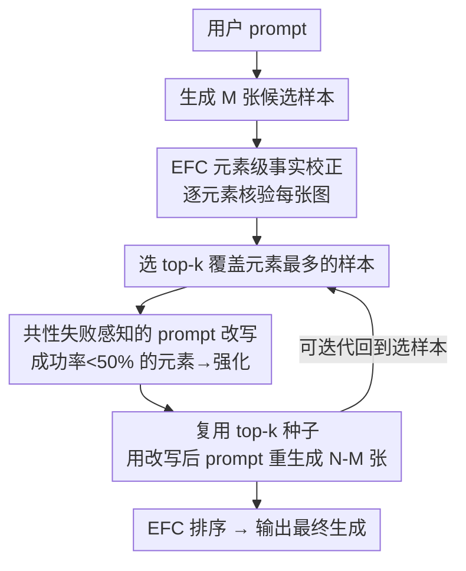

# Rethinking Prompt Design for Inference-time Scaling in Text-to-Visual Generation

**会议**: CVPR 2026  
**论文**: [CVF Open Access](https://openaccess.thecvf.com/content/CVPR2026/html/Kim_Rethinking_Prompt_Design_for_Inference-time_Scaling_in_Text-to-Visual_Generation_CVPR_2026_paper.html)  
**代码**: https://subin-kim-cv.github.io/PRIS （项目页）  
**领域**: 扩散模型 / 图像生成 / 推理时扩展  
**关键词**: text-to-visual、inference-time scaling、prompt redesign、MLLM verifier、text-to-video

## 一句话总结
本文提出 PRIS：在文生图/文生视频的推理时扩展里，不再只把算力堆在「多采几张图」，而是用一个细粒度验证器（EFC）找出多张生成图里反复出现的「共性失败元素」，据此改写 prompt 再重生成，让 prompt 和 visual 一起随算力扩展，从而在 GenAI-Bench 上 +7%、VBench 2.0 上 +15%。

## 研究背景与动机

**领域现状**：在文生图（T2I）、文生视频（T2V）中，单次采样常常无法精确对齐用户意图，于是出现了「推理时扩展（inference-time scaling）」——给定一条 prompt，要么加大单个候选的解码算力（更多采样步），要么生成大量候选再用奖励模型挑最好的（Best-of-N、Search-over-Paths）。

**现有痛点**：这些方法只在「视觉」这一侧扩展，prompt 始终是固定的、与扩展过程解耦。作者观察到一个关键现象：当你不断多采样时，失败模式是**反复出现的**——比如 prompt 是「一只没有鞋带、单独摆放的鞋」，每一张图里「鞋」都画对了，但「鞋带」却**每张都出现**。继续多采样只是把同一个错误重复几十遍，prompt-adherence 很快进入平台期（plateau）。

**核心矛盾**：在一条**次优 prompt** 的条件下扩展视觉，收益递减——因为 prompt 才是条件生成的主要 guidance。而现有的 prompt-refinement 方法是**逐样本**的，只盯单张图的偶发偏差，对「跨样本反复出现的群体级失败模式」视而不见，错过了同时改进文本与视觉的机会。

**本文目标**：把推理时扩展从视觉域**延伸到 prompt 域**，让 prompt 随着生成样本数的增长一起被自适应修订，同时不破坏用户原始意图。这要拆成两个子问题：(1) 怎么**精确诊断**一张生成图到底漏掉/画错了 prompt 里的哪些元素；(2) 怎么把跨样本的诊断**聚合**成对 prompt 的有效改写。

**切入角度**：作者认为「失败是有信息量的」——与其丢掉低分样本，不如分析它们的共性失败，把这些信号回灌到 prompt。这要求一个比「单一标量对齐分」更细粒度、可解释的验证器。

**核心 idea**：用一句话概括——**把 prompt 也当作推理时扩展的一根轴**：用细粒度验证器 EFC 找出跨样本的共性失败元素，改写 prompt 去强化这些被反复忽略的元素，再复用好种子重生成，让 prompt 与 visual 联合扩展。

## 方法详解

### 整体框架
PRIS（Prompt Redesign for Inference-time Scaling）建立在一个细粒度验证器 EFC 之上，整体是一个「生成 → 诊断 → 改写 prompt → 重生成」的可迭代闭环。给定用户 prompt，先生成 $M$ 张候选并用 EFC 逐元素核验；从中选出覆盖元素最多的 top-$k$ 样本，统计哪些元素在这批好样本里仍然**成功率 <50%**（即共性失败）；据此把原 prompt 改写成强化这些薄弱元素的 $p'$；再复用 top-$k$ 样本的噪声种子，用 $p'$ 重生成剩余 $N-M$ 张，最后用 EFC 排序选出。整个流程可重复多轮，正文主实验只迭代一次就已有明显增益。

### 关键设计

**1. EFC：元素级事实校正验证器，把「这张图对不对」拆成「每个语义元素对不对」**

整体对齐分（如 VQAScore 这类单标量）只告诉你「整体像不像」，却说不清到底哪个元素满足了、哪个漏了——prompt 越复杂这个问题越严重。EFC（Element-level Factual Correction）用一个无需训练的现成 MLLM（Qwen2.5-VL）做三步细粒度核验。第一步**分解**：把原 prompt $p$ 拆成一组互不重叠的原子语义元素 $p=\{p_1,\dots,p_s\}$，按预定义类别抽取（图像级：物体存在/属性/空间关系；运动级：物体运动/镜头移动/场景转场/时序顺序），并把每个 $p_i$ 标为 `core`（客观、事实性、对意图至关重要）或 `extra`（偏主观/风格、可灵活解释）。第二步**事实校正**：对每张生成图 $D$，EFC 不直接做二元 VQA（yes/no），而是先给 $D$ 生成一句自然语言 caption，再把「元素 $p_i$ 与 caption 的关系」当成自然语言推理（NLI）任务判定为 entailment / contradiction / neutral——这种「文本对文本」比较能缓解 MLLM 在视觉问答里常见的肯定偏置（affirmative bias），从而更准、更可解释。对初判为 neutral（caption 没提到或描述含糊）的元素，EFC 再生成一个开放式问题 $q_i$ 去问图、拿到自由回答后做第二轮 NLI，把它重判为 entailment 或 contradiction。第三步**打分**：按 entailment 元素数打分，且**优先 core 元素**（因为它们客观、不易主观解读），当多个候选 core 准确率打平时，再用 extra 元素准确率破平。作者还配套提出了首个「在推理时扩展场景下评估验证器」的 benchmark，每条 prompt 配多张对齐/部分对齐的图，EFC 在区分 ground-truth 与貌似合理但实则错位的干扰项上显著优于已有验证器。

**2. 共性失败感知的 prompt 改写：只改写「大家都错的地方」，而不是逐张纠偏**

这是 PRIS 区别于以往逐样本 prompt-refinement 的核心。先生成 $M$ 张、用 EFC 拿到逐样本核验结果 $C_1\dots C_M$；再选 **top-$k$** 样本——挑的标准是「这一小批合起来覆盖的元素最多」，打平时用人类偏好奖励模型的标量分破平，保证选出的样本更贴近人类偏好。然后在 top-$k$ 子集里定义**共性失败**：成功率低于 50% 的元素。基于这些共性失败把原 prompt $p$ 改写成 $p'$——显式强化被反复忽略的元素，同时保留已经画对的部分。这种「针对群体级失败、而非孤立单样本噪声」的改写，正是 prompt-adherence 能随算力持续上升、而非很快 plateau 的原因。一个特例：如果所有元素成功率都 >50%（没有共性失败），PRIS 就转而把 prompt 本身当作改写对象，鼓励探索 prompt 的变体。论文还给了直观例子：对「叉子不是木头做的」这种**否定**约束，BoN 仍反复画出木叉，而 PRIS 诊断后把 prompt 显式改成「银色叉子」，直接化解了模型对否定的误解。

**3. 复用好种子重生成：把先前花掉的算力当作可继承的财富**

拿到改写后的 $p'$，PRIS 用它重生成 $N-M$ 张，但**复用 top-$k$ 样本的噪声 latent（种子）**而不是随机初始化。动机很具体：某些噪声条件天然更利于特定类型 prompt 的对齐，复用这些已被验证「部分成功」的种子，比随机重来更能保住先前的成功部分。重生成后再用 EFC 核验排序。整体上，PRIS 把「部分正确的生成」当成有信息量的反馈而非废弃品——既复用了生成器先前已经花掉的算力，又把它转化为更高保真的输出，这就是它在固定算力预算下仍优于 BoN 的根因。

## 实验关键数据

### 主实验
T2I 在 GenAI-Bench 用 FLUX.1-dev（采样 320 条 prompt，NFE=2000，N=20），引导奖励用 VQAScore，留出评测用 DA-Score（细粒度对齐）和美学预测器（图像质量）。`*` 表示叠加了标准 prompt 扩展。

| 方法（GenAI-Bench / FLUX.1-dev） | VQAScore (Given) | DA-Score (Unseen) | Aesthetic (Unseen) |
|--------|------|------|------|
| FLUX.1-dev | 0.718 | 0.681 | 5.764 |
| +BoN | 0.783 | 0.682 | 5.761 |
| **+PRIS** | **0.854** | **0.707** | 5.765 |
| FLUX.1-dev* | 0.769 | 0.695 | 5.824 |
| +BoN* | 0.829 | 0.710 | 5.820 |
| **+PRIS*** | **0.853** | **0.713** | **5.841** |

PRIS 在 prompt-adherence（VQAScore、DA-Score）上一致超过 BoN 和标准 prompt 扩展，同时美学质量保持相当——说明 prompt 扩展只有在「被视觉反馈引导」时才有效，单纯堆砌细节（标准扩展）收益有限。综合论文给出的整体提升：**GenAI-Bench 上 +7%（T2I）**。

T2V 在 VBench 2.0 用 Wan2.1-1.3B/14B（VideoAlign 引导），从可控性、创造力、常识、物理合理性四维度评估。

| 维度（VBench 2.0 / Wan2.1） | 小模型 1.3B | 大模型 14B |
|------|------|------|
| Controllability & Creativity 增益 | **+13.88%** | **+15.19%** |
| Commonsense 增益 | +3.46% | +3.46%（⚠️ 论文仅给一处汇总值，以原文为准） |
| Physics 增益 | +6.53% | +6.53%（⚠️ 同上） |

最大增益出现在 **Dynamic Attribute** 和 **Motion Order Understanding** 这类需要时序推理的维度（「A 然后 B」「A 转变为 B」）——PRIS 诊断出初始输出的时序失败、改写 prompt 去澄清序列如何展开。整体 **VBench 2.0 上 +15%**。

### 消融实验
论文在 4.2–4.4 节给出多组分析：扩展生成器算力 / 迭代改写 prompt 的 scaling 行为、与为固定 prompt 设计的视觉搜索算法（如 Search-over-Paths）的集成，以及对 PRIS 与 EFC 的消融。

| 对比配置 | 现象 | 结论 |
|------|---------|------|
| 固定 prompt 扩展（BoN） | adherence 很快进入平台期 | 次优 prompt 下视觉扩展收益递减 |
| 标准 prompt 扩展（*） | 优于无扩展，但弱于 PRIS | 盲目加细节不如失败感知改写 |
| EFC（文本-文本 NLI） vs 二元 VQA | EFC 区分对齐/错位样本更准 | 缓解肯定偏置是关键 |
| PRIS（共性失败改写 + 复用种子） | 固定算力下一致超 BoN | prompt 与 visual 联合扩展是核心 |

### 关键发现
- **失败模式是群体级、可复用的**：多采样揭示的不是随机偏差，而是反复出现的同一类失败；这正是「逐样本改写」方法看不到、PRIS 能利用的信号。
- **文本-文本核验 > 直接视觉 VQA**：EFC 先把图转 caption 再做 NLI，绕开了 MLLM 在视觉问答里「倾向于回答 yes」的肯定偏置，核验更准也更可解释。
- **时序/否定类约束受益最大**：需要序列推理（Motion Order）或带否定（「不是木头」）的复杂 prompt，是 BoN 反复栽跟头、PRIS 显式改写后提升最明显的场景。

## 亮点与洞察
- **把「prompt」提升为一根独立的扩展轴**：这是最让人「啊哈」的视角转换——以往推理时扩展默认 prompt 不变只扩视觉，本文指出在次优 prompt 下扩视觉是事倍功半，prompt 必须跟着一起扩展。
- **「共性失败 <50%」这个判据简单但有效**：不依赖逐样本纠偏，而是统计 top-$k$ 好样本里仍普遍失败的元素，天然过滤掉随机噪声、聚焦真正的系统性问题，可迁移到任何「多候选 + 验证器」的生成场景。
- **EFC 的 caption→NLI→follow-up 三段核验**可单独复用：它本质是一个通用的、无需训练的细粒度文-视对齐验证器，能给任意 T2I/T2V 生成器当 reward/诊断模块。
- **复用种子的工程 trick**：把部分成功样本的噪声 latent 当作「可继承资产」，是在不额外花算力的前提下保住先前成功的巧妙做法。

## 局限与展望
- **依赖 MLLM 验证器的能力上限**：EFC 完全建立在现成 Qwen2.5-VL 之上，prompt 分解、caption、NLI 任一环节的错误都会传导到 prompt 改写；对超出 MLLM 认知的细粒度/专业域元素，诊断可能失准。
- **改写引入额外算力**：虽然论文在固定 NFE 预算下比较，但 EFC 的多步核验（caption + 多轮 NLI + follow-up 问答）本身消耗 MLLM 推理，真实端到端开销与「纯多采样」的可比性需要按场景再核（⚠️ 具体开销拆解以原文 Appendix 为准）。
- **主实验只迭代一轮**：闭环理论上可多轮迭代，但论文主结果只跑一次；多轮的收益/成本曲线、是否会过度改写偏离用户意图，值得进一步研究。
- **base 生成器需预筛**：作者会先按 base prompt fidelity 筛掉太弱的生成器，说明方法对「本身就画不对」的弱生成器帮助有限。

## 相关工作与启发
- **vs Best-of-N / Search-over-Paths**：它们只在视觉侧扩展（多采样、挑高分轨迹），prompt 固定不变；PRIS 把丢弃的低分样本当反馈、联合改写 prompt，让 adherence 随算力持续上升而非 plateau。
- **vs 逐样本 prompt-refinement（交互式改写/自动重写）**：以往方法盯单张图的偶发偏差、且常需人参与；PRIS 聚合跨样本的共性失败、全自动、且同时适用 T2I 与 T2V（以往多只做 T2I）。
- **vs CoT/统一模型的视觉生成推理**：CoT 类方法多在单样本层面反思、或需联合训练；PRIS 用现成 MLLM 免训练、跨样本聚合趋势更新 prompt，与统一模型兼容可作即插即用模块。

## 评分
- 新颖性: ⭐⭐⭐⭐⭐ 「把 prompt 当作推理时扩展的一根独立轴 + 共性失败感知改写」是清晰且少见的视角转换。
- 实验充分度: ⭐⭐⭐⭐ T2I/T2V 双任务、多基线、配套验证器 benchmark 都有，但部分维度增益只给汇总值、消融细节需查 Appendix。
- 写作质量: ⭐⭐⭐⭐ 动机与 EFC/PRIS 流程讲得清楚，图例直观；个别表格被 OA 版排版打散。
- 价值: ⭐⭐⭐⭐ EFC 作为通用细粒度验证器、PRIS 作为即插即用的推理时改写框架，对 T2I/T2V 落地有直接可复用价值。

<!-- RELATED:START -->

## 相关论文

- [\[CVPR 2026\] Progress by Pieces: Test-Time Scaling for Autoregressive Image Generation](progress_by_pieces_test-time_scaling_for_autoregressive_image_generation.md)
- [\[CVPR 2026\] Tiny Inference-Time Scaling with Latent Verifiers](tiny_inference-time_scaling_with_latent_verifiers.md)
- [\[CVPR 2026\] From Scale to Speed: Adaptive Test-Time Scaling for Image Editing](from_scale_to_speed_adaptive_test-time_scaling_for_image_editing.md)
- [\[ICML 2025\] Performance Plateaus in Inference-Time Scaling for Text-to-Image Diffusion Without External Models](../../ICML2025/image_generation/performance_plateaus_in_inference-time_scaling_for_text-to-image_diffusion_witho.md)
- [\[CVPR 2026\] Rethinking UMM Visual Generation: Masked Modeling for Efficient Image-Only Pre-training](rethinking_umm_visual_generation_masked_modeling_for_efficient_image-only_pre-tr.md)

<!-- RELATED:END -->
