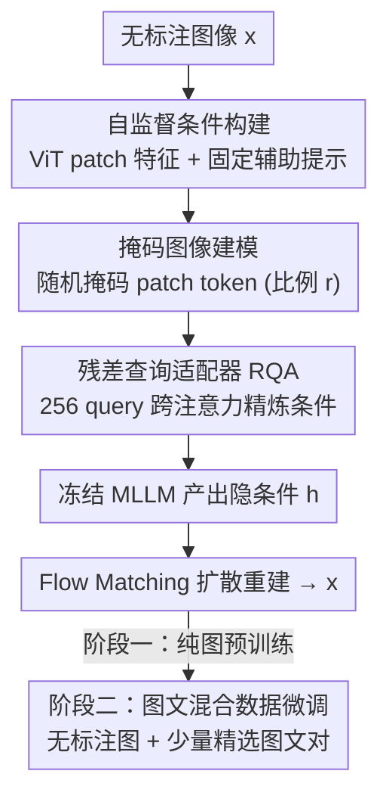

# Rethinking UMM Visual Generation: Masked Modeling for Efficient Image-Only Pre-training

**会议**: CVPR 2026  
**论文**: [CVF Open Access](https://openaccess.thecvf.com/content/CVPR2026/html/Sun_Rethinking_UMM_Visual_Generation_Masked_Modeling_for_Efficient_Image-Only_Pre-training_CVPR_2026_paper.html)  
**代码**: https://github.com/LINs-lab/IOMM  
**领域**: 图像生成 / 统一多模态模型  
**关键词**: 统一多模态模型, 纯图像预训练, 掩码图像建模, 自监督条件, Flow Matching

## 一句话总结
针对统一多模态模型（UMM）视觉生成部分「依赖稀缺图文对、训练又低效」两大瓶颈，本文提出两阶段框架 IOMM：先用海量无标注图像、以图像自身语义当条件做掩码重建预训练，再用少量高质量图文对混合微调，仅 ~1050 H800 GPU 小时从头训出 3.6B 模型，GenEval 达 0.89、WISE 0.55，超过 BAGEL-7B、BLIP3-o 等强基线。

## 研究背景与动机
**领域现状**：统一多模态模型（UMM）想把「理解」和「生成」装进同一个模型，主流做法是把一个冻结的多模态大模型（MLLM）和一个扩散骨干用可学习 query / 多阶段协议桥接起来（如 MetaQuery、BLIP3-o、BAGEL、Qwen-Image），由 MLLM 提供语义条件、扩散负责像素生成。

**现有痛点**：训这些 UMM 的视觉生成组件，几乎都重度依赖**大规模、高质量、且常常是私有的图文配对数据**，采集与清洗成本极高，阻碍了开放、可复现的研究；同时训练流程本身**计算极其低效**，要烧掉海量算力。作者还观察到，在有限数据上微调出的 UMM 经常生成「细节缺失、不忠实于 prompt」的图（图 6a 里连 Qwen-Image 这种强基线都会翻车）。

**核心矛盾**：监督信号的稀缺性其实是把双刃剑——文本描述虽稀缺却天然「稀疏」，逼模型学会组合式地补全场景；而如果直接用图像自身当条件，条件是「稠密、完整」的，模型很容易退化成一个平凡的恒等映射（直接把输入抄回去），学不到真正的生成先验。

**本文目标**：① 把昂贵的预训练阶段彻底从「图文对依赖」里解放出来；② 让被冻结的理解型 MLLM 在不微调、不灾难性遗忘的前提下也能为生成提供合适条件；③ 系统厘清「预训练 / 微调各用什么数据」最优。

**切入角度**：作者假设——**显式文本只是承载高层语义的一种模态，图像自身蕴含的丰富语义同样足以充当条件信号**。于是可以完全用无标注图像语料来设计训练范式。

**核心 idea**：用「图像自条件 + 掩码重建」替代「图文对监督」来做生成预训练，再靠混合数据微调补回指令对齐——即纯图预训练（image-only）打底、图文混合微调收尾的两阶段范式 IOMM。

## 方法详解

### 整体框架
IOMM 的输入是一张无标注图像，输出是能按文本指令生成图的 UMM。整条管线先把图像送进冻结 MLLM 的 ViT 编码成 patch 特征，拼上一句固定的辅助提示词构成「自监督条件」；对图像 patch token 随机掩码后，过一个轻量「残差查询适配器（RQA）」精炼条件，再交给冻结 MLLM 产出隐条件 $h$，最后由一个 Flow Matching 扩散网络在 $h$ 指导下把噪声还原成原图。这一切只发生在**阶段一（纯图像预训练）**；**阶段二**再换上「无标注图像 + 少量精选图文对」的混合数据微调，把指令对齐能力补回来。

### 关键设计

**1. 图像自条件预训练：用图自己的语义当 condition，彻底甩掉图文对**

这一招直击「预训练依赖稀缺图文对」的痛点。作者不再喂文本，而是把待生成图像 $x$ 先用冻结 MLLM 里的 ViT 编码成 patch 嵌入 $c_{img}=v(x)\in\mathbb{R}^{P^2\times D}$，再和一句通用固定提示（如「Generate an image that is identical to the reference image:」）的 token 嵌入 $c_{aux}$ 拼接，构成完整条件 $c=\mathrm{concat}(c_{aux},c_{img})$，送进冻结 MLLM $g$ 得到隐条件 $h=g(c)$ 去指导扩散。其底层假设是「文本只是传递高层语义的一种模态，图像自身的语义就够当条件」。这样预训练阶段只需无标注图像语料（Megalith-10M、text-to-image-2M），把最昂贵的阶段从图文对依赖里解放出来。

**2. 残差查询适配器（RQA）：不动 MLLM 一根参数，就把理解型表征拨向生成**

直接拿冻结 MLLM 的输出 $g(c)$ 当扩散条件效果很差（图 2b 的「Raw」只有 0.44），因为理解型 MLLM 的表征并未为「生成所需的精细控制」优化，存在领域错配。但全量微调 MLLM 又有两难：参数量太大（MetaQuery-XL 的 MLLM 有 7B，而扩散仅 0.6B），且在纯图重建任务上微调会灾难性遗忘掉原本的理解能力。RQA 的解法是：一个仅 **29M 参数**的可训练适配器 $q_\theta$，用 **256 个可学习 query token** 对 $c$ 做跨注意力，生成一段「残差 query」附加回条件序列 $c\leftarrow\mathrm{concat}(c,q_\theta(c))$，相当于给冻结 MLLM 喂了个可学习的「软提示」，引它抽出对生成更有用的特征，全程不改 MLLM 权重。消融显示加上 RQA 后 GenEval 从 0.44 直接 +0.38 跳到 0.82，且比同样 256 query 的 MetaQuery 收敛快得多。

**3. 掩码图像建模（MIM）：把稠密条件改成稀疏到稠密的重建，逼出真正的生成先验**

自条件的隐患在于条件是「稠密、完整」的图像表征，模型大可走捷径学成恒等映射，学不到组合式的生成能力。作者借鉴 MAE，在训练时对图像 patch token 以掩码比例 $r\in[0,1]$ 随机置零：用伯努利采样的二值掩码 $M$ 做逐元素乘 $c_{img}\leftarrow c_{img}\odot M$，把训练目标从「稠密重建」改成更难的「稀疏到稠密重建」，迫使模型从可见 patch 推断被掩盖内容，从而学到鲁棒、上下文感知的视觉先验——这正好模拟了文本监督天然稀疏带来的好处。掩码比例不是越高越好：$r=0.45$ 时 GenEval 峰值 0.88、DPGBench 79.79；但 $r=0.95$ 信息丢太多，骤降到 0.77 / 69.41。

**4. 两阶段范式与混合数据微调：纯图打底、图文混合收尾**

作者系统比较了「预训练 / 微调」两阶段各取 {纯图, 图文对, 混合} 的六种配方（图 1c）。核心结论是：**纯图像预训练 + 混合数据微调**最优。规律有二——预训练用纯图，无论后续怎么微调，都持平或优于用图文对预训练；微调阶段则混合数据最好，纯图微调最差（会把指令对齐能力训没，见表 2 里 Qwen-Image 纯图微调 GenEval 暴跌 0.43）。这套微调策略还是即插即用的：套到 OpenUni-L 上把 GenEval 从 0.85 提到 0.88，套到 20B 的 Qwen-Image（用 LoRA, $r{=}64,\alpha{=}64$）上把 512px 从 0.85 提到 0.89。

### 损失函数 / 训练策略
生成骨干用 Flow Matching：在数据 $x$ 与噪声 $z\sim\mathcal{N}(0,I)$ 之间定义直线路径 $x_t=(1-t)x+tz$，网络 $F_\theta(x_t,t,c)$ 学习恒速向量场 $z-x$，目标 $L(\theta)=\mathbb{E}\big[\lVert F_\theta(x_t,t,h)-(z-x)\rVert_2^2\big]$（条件即 RQA + 冻结 MLLM 产出的 $h$）。推理时从先验积分 PF-ODE $\mathrm{d}x_t/\mathrm{d}t=F_\theta$ 反解出 $x_0$。骨干采用 FLUX 实现的 MM-DiT，三档规模 IOMM-B(1.6B)/L(2.7B)/XL(6B, Z-Image)，辅助 MLLM 用冻结 InternVL3-2B；优化器 AdamW（B/L）/ Muon（XL），EMA 衰减 0.999，结果均取 EMA 权重。

## 实验关键数据

> 指标说明：**GenEval**（组合式文生图，按单物体/双物体/计数/颜色/位置/颜色属性综合打分，越高越好）；**WISE**（考察生成是否保留世界知识）；**DPGBench**（稠密 prompt 对齐）；**ImgEdit-Bench**（图像编辑能力，0–5 打分）；**NFE** 为扩散采样函数调用数；**H800 GPU 小时**衡量训练成本。

### 主实验
| 模型 | 规模/数据 | GenEval ↑ | DPGBench ↑ | WISE ↑ | 训练成本 |
|------|-----------|-----------|------------|--------|----------|
| BLIP3-o-8B* | +30M 私有图文对 | 0.84 | 81.60 | 0.62 | — |
| Janus-Pro-7B | — | 0.80 | 84.19 | 0.35 | — |
| BAGEL-7B | — | 0.88 | — | 0.52 | — |
| MetaQuery-XL | — | 0.80 | 82.05 | 0.55 | — |
| **IOMM-B 512** | 1.6B, 全公开数据 | **0.89** | 82.95 | 0.55 | **~1050 H800h** |
| IOMM-L 512 | 2.7B | 0.87 | 76.09 | 0.53 | — |

IOMM-B（512px）以 1.6B 生成骨干、纯公开数据、~1050 H800 GPU 小时（其中 1000 小时花在高效的纯图预训练阶段）就拿下 GenEval 0.89，超过 BAGEL-7B（0.88）和用了额外 30M 私有图文对的 BLIP3-o-8B（0.84），WISE 0.55 说明世界知识没被削弱。⚠️ 文中正文与表 1 对 BAGEL/IOMM 的小数点存在 0.88/0.89 的并列表述，以原文为准。

### 消融实验
| 配置 | GenEval | 说明 |
|------|---------|------|
| Raw（冻结 MLLM 直连） | 0.44 | 理解型表征与生成错配 |
| ⊕ Residual Query Adapter | 0.82 | +0.38，最大增益来源 |
| ⊕ Masked Image Modeling | 0.88 | 再 +0.06，防恒等捷径 |
| 掩码比例 $r=0.45$ | 0.88 | 峰值；$r=0.95$ 骤降到 0.77 |

| 微调策略（应用到 Qwen-Image-512） | GenEval | 变化 |
|------|---------|------|
| 基线（预训练模型） | 0.85 | — |
| ⊕ 纯图微调 | 0.42 | ↓0.43，指令对齐崩塌 |
| ⊕ 图文对微调 | 0.88 | ↑0.03 |
| ⊕ 混合微调 | 0.89 | ↑0.04，最佳 |

### 关键发现
- **RQA 贡献最大**：从 Raw 0.44 跳到 0.82（+0.38），是架构里增益最显著的一环；MIM 再补 +0.06。两者缺一，自条件要么错配要么退化成恒等。
- **掩码比例有甜点**：$r=0.45$ 最优，过低监督太密、过高（0.95）信息损失过大反而掉点，呼应「稀疏到稠密」的设计初衷。
- **涌现出零样本图像编辑**：纯图预训练的 IOMM-B 在 ImgEdit-Bench 上 training-free 拿到 2.82，优于同模型图文对预训练版（2.61），甚至超过显式在编辑数据上训练的 UltraEdit（2.70）——一个意外但有力的证据，说明自条件 + 掩码重建学到了可迁移的视觉操作先验。
- **正向 scaling**：IOMM-L 表观偏低是因训练 epoch 只有 IOMM-B 一半；控制训练时长（5 epoch）后 IOMM-L 反超 IOMM-B（0.87 vs 0.86）。

## 亮点与洞察
- **「图像即条件」的范式转换**：把生成预训练从图文对依赖里解放出来，让海量无标注图像可用，这对开放、可复现研究的成本结构是实质性松绑——最贵的阶段不再需要私有数据。
- **冻结大模型 + 轻量适配器的性价比**：29M 的 RQA 用软提示「拨动」7B 级冻结 MLLM 而不动它一根参数，既避开灾难性遗忘又省算力，这套「不微调主干、只学条件预处理」的思路可迁到任何「拿理解模型当生成条件源」的场景。
- **掩码重建治「自条件退化」**：当条件信息过于完整时人为制造稀疏、逼模型补全，是一个通用的「防捷径」技巧，可迁到其他自重建/自蒸馏训练里。

## 局限与展望
- **依赖一个高质量冻结 MLLM**：整套自条件建立在 InternVL3-2B 的表征之上，若换成更弱的视觉编码器，自条件能否仍提供足够语义有待验证。
- **辅助提示是固定模板**：自条件用的是一句通用固定提示，作者未深究提示设计对条件质量的影响空间。
- **scaling 受算力制约**：IOMM-L/XL 受 epoch 数限制未充分训练，更大规模下的真实上限尚未跑满；混合微调里图文对仍不可或缺，纯图微调会崩，说明指令对齐这一环还逃不开少量配对监督。
- **改进思路**：可探索自适应掩码比例（按训练进度或样本难度动态调）、或把辅助提示也变成可学习 token，进一步压缩对配对数据的残余依赖。

## 相关工作与启发
- **vs MetaQuery / BLIP3-o（冻结 MLLM + 可学习 query 桥接）**：它们仍靠大规模图文对训生成端，本文用纯图自条件 + 掩码重建替代，RQA 收敛更快（MetaQuery 多训 8K 步也只到 0.82），且省掉私有配对数据。
- **vs Lumos-T2I（纯图像预训练文生图）**：同样主张图像预训练，但 Lumos 是单向 T2I 专用模型、缺理解能力；IOMM 面向统一理解+生成的 UMM，并引入掩码建模与系统的两阶段数据配方研究。
- **vs MAE（掩码自编码表示学习）**：借用「mask-and-predict」思想，但目标不是学判别表征，而是为生成防止自条件退化、逼出组合式生成先验。
- **vs 并发的混合微调工作**：并发工作只研究微调且用标准重建、在小模型上验证；本文同时研究预训练与微调、用掩码图像建模、并在 Qwen-Image-20B 等大模型上验证泛化。

## 评分
- 新颖性: ⭐⭐⭐⭐⭐ 「图像即条件 + 掩码重建」把生成预训练从图文对依赖里解放，范式层面的重构
- 实验充分度: ⭐⭐⭐⭐⭐ 六种数据配方系统消融 + 多基准 + 套用到 OpenUni/Qwen-Image 验证泛化，还意外发现零样本编辑
- 写作质量: ⭐⭐⭐⭐ 动机与消融讲得清楚，部分小数点表述（BAGEL/IOMM 0.88 vs 0.89）略有出入
- 价值: ⭐⭐⭐⭐⭐ 仅 ~1050 H800h、纯公开数据即达 SOTA，对低成本可复现 UMM 训练有实际意义

<!-- RELATED:START -->

## 相关论文

- [\[CVPR 2026\] Black-box Membership Inference Attacks on the Pre-training Data of Image-generation Models](black-box_membership_inference_attacks_on_the_pre-training_data_of_image-generat.md)
- [\[CVPR 2026\] Depth Adaptive Efficient Visual Autoregressive Modeling](depthvar_depth_adaptive_var.md)
- [\[CVPR 2026\] SparVAR: Exploring Sparsity in Visual Autoregressive Modeling for Training-Free Acceleration](sparvar_exploring_sparsity_in_visual_autoregressive_modeling_for_training-free_a.md)
- [\[CVPR 2026\] Rethinking Prompt Design for Inference-time Scaling in Text-to-Visual Generation](rethinking_prompt_design_for_inference-time_scaling_in_text-to-visual_generation.md)
- [\[CVPR 2026\] DPAR: Dynamic Patchification for Efficient Autoregressive Visual Generation](dpar_dynamic_patchification_for_efficient_autoregressive_visual_generation.md)

<!-- RELATED:END -->
