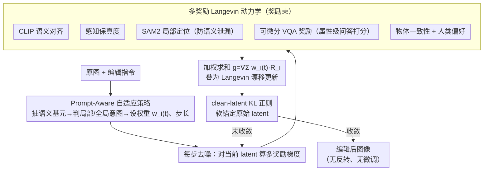

# RewardFlow: Generate Images by Optimizing What You Reward

**会议**: CVPR 2026  
**arXiv**: [2604.08536](https://arxiv.org/abs/2604.08536)  
**代码**: [https://huggingface.co/onkarsus13/RewardFlow](https://huggingface.co/onkarsus13/RewardFlow)  
**领域**: 图像生成/编辑  
**关键词**: 奖励引导生成, 扩散模型, Langevin动力学, 图像编辑, 组合式生成

## 一句话总结

RewardFlow 提出一种无需反转的推理时框架，通过多奖励 Langevin 动力学融合语义对齐、感知保真度、局部定位、物体一致性和人类偏好等多种可微分奖励信号，在图像编辑和组合式生成任务上实现 SOTA 的编辑保真度和组合对齐效果。

## 研究背景与动机

**领域现状**：扩散模型和 flow-matching 模型在图像生成领域取得了巨大成功，但在可控编辑和组合式生成方面仍面临挑战。现有方法通常依赖文本引导或模型微调来实现特定编辑效果。

**现有痛点**：当前的图像编辑方法主要存在三个问题：(1) 基于反转(inversion)的方法计算开销大且容易引入噪声累积；(2) 单一奖励信号无法同时兼顾语义正确性、视觉保真度和局部精确性；(3) 编辑过程中容易出现语义泄漏——即编辑效果不小心扩散到目标区域之外。

**核心矛盾**：多种异构奖励目标（语义对齐、感知质量、区域精度、人类偏好等）之间的协调问题。简单加权会导致某些目标被压制，且不同编辑意图需要不同的奖励权重配置。

**本文目标**：设计一个统一的推理时框架，无需微调或反转即可将多种互补的可微分奖励信号融合到扩散/flow-matching模型的采样过程中。

**切入角度**：作者从 Langevin 动力学出发，将奖励引导的采样过程理论化为一个目标为 prompt-tilted 密度的 Langevin SDE 的有效离散化，为稳定收敛提供了理论保证。

**核心 idea**：将一束互补的可微分奖励（CLIP 语义对齐、感知保真度、SAM2 局部定位、物体一致性、人类偏好）外加本文新提出的可微分 VQA 属性级奖励，通过 Langevin 动力学统一融合到采样过程，并设计 prompt-aware 自适应策略动态调节各奖励权重。

## 方法详解

### 整体框架

RewardFlow 想解决的事情很直接：在不微调模型、也不反转原图的前提下，让一个预训练的扩散 / flow-matching 模型按编辑指令把图改对。它的做法是把"编辑"重新理解成"在采样过程中优化你真正想要的那些奖励"——给定原图和指令，模型照常一步步去噪，但每一步都额外算几个可微分奖励对当前 latent 的梯度，用这些梯度把去噪方向往"更符合指令"的地方推一把。为了不让图被推得面目全非，整条采样轨迹还被一个 clean-latent KL 正则项软锚在原始 latent 附近。整个过程被作者证明等价于一个目标为 prompt-tilted 密度的 Langevin SDE 的离散化，因此收敛是有理论依据的、而非纯启发式的拼凑。

下图给出这条推理时采样回环：prompt-aware 策略先据指令配好权重，之后每步去噪叠加多奖励梯度、再被 KL 正则拉回，循环到收敛。

### 关键设计

**1. 多奖励 Langevin 动力学：用一束互补奖励同时盯住编辑的多个维度**

一张图编辑得好不好，从来不是单一标准——语义要对、画质不能崩、改动要落在该改的地方、还得让人看着舒服。任何单一奖励都顾此失彼：只盯 CLIP 语义可能把画质牺牲掉，只盯感知质量又可能改错对象。RewardFlow 因此把五类可微分奖励合成一束：语义对齐（CLIP 类的文本-图像匹配度）、感知保真度（编辑后图像质量）、局部定位（SAM2 圈出的区域约束）、物体一致性、以及人类偏好（如 ImageReward）。每一步采样时，这几个奖励各自对当前 latent 求梯度，再加权求和成一个统一的修正信号：

$$g(x_t) = \nabla_{x_t} \sum_i w_i(t)\, R_i(x_t)$$

把它叠到原本的去噪更新上，就相当于在 Langevin 采样的"随机游走"之上叠加了一个朝多目标最优区域的漂移。和简单事后加权不同的是，这里的融合发生在采样的每一步、且权重随时间步变化，因此不会出现某个目标一开始就被另一个压死的情况。

**2. 可微分 VQA 奖励：把指令拆成问答对，逼出属性级的精准反馈**

CLIP 这类全局语义模型擅长判断"整体像不像"，但对"车是不是红色""背景是不是夜晚"这种细粒度属性分辨力有限——而图像编辑恰恰常常就是改一两个具体属性。RewardFlow 的办法是把编辑指令拆成若干属性相关的问答对，再用一个可微分的 VQA 模型对当前图像逐题打分，把答对的概率当成奖励。因为 VQA 走的是语言-视觉推理，它能给出"这个属性到底改没改对"这种指令级别的精准信号，正好补上全局语义奖励看不清的盲区；又因为它可微分，这份反馈能像其他奖励一样直接回传梯度参与采样修正。

**3. Prompt-Aware 自适应策略：让指令自己决定哪个奖励该使劲**

不同编辑任务对各奖励的依赖天差地别——局部改色最该信任 SAM2 的区域约束，全局风格迁移则更该听感知奖励的，用一套固定权重去套所有任务必然有任务被亏待。这一策略先从编辑指令里抽出语义基元（编辑类型：颜色变换 / 风格迁移 / 物体添加…），据此推断意图是局部还是全局，再在采样过程中据意图动态调制每个奖励的权重 $w_i(t)$ 和步长。于是局部颜色编辑时局部定位奖励被自动顶上去，全局风格迁移时则让感知奖励主导，免去了为每类编辑手工调参。

### 一个例子：把一辆红色的车改成蓝色

输入是一张街景图和指令"把车改成蓝色"。Prompt-aware 策略先解析出这是一次**局部 + 颜色变换**编辑，于是把 SAM2 局部定位奖励的权重调高、限定改动只能发生在车体区域；VQA 奖励则被拆出"车的颜色是否为蓝色？"这道题持续打分。采样开始后，每一步去噪都叠加这束奖励的梯度：语义对齐奖励把整体往"蓝色车"的语义拉，VQA 奖励盯着颜色这一个属性逐步逼近，SAM2 定位奖励把试图溢出到马路、天空的改动压回去（这正是防止"语义泄漏"的关键），感知奖励维持车漆质感不糊。与此同时 clean-latent KL 正则把背景和车的形状锚在原图上，保证只有颜色在变。几十步采样下来，得到一辆颜色干净替换、背景纹丝不动的蓝色车——全程没有反转原图，也没有训练任何专用编辑模型。

### 损失函数 / 训练策略

RewardFlow 是纯推理时框架，不需要任何额外训练，"损失"完全体现在采样阶段的奖励梯度引导上：多奖励融合信号 $\nabla_x \sum_i w_i(t)\cdot R_i(x_t)$ 提供朝多目标最优的漂移；clean-latent KL 正则把采样轨迹锚在原始 latent 附近，相当于在"奖励最大化"和"忠实于原始内容"之间加了一道软约束，防止过度偏移。作者进一步证明这套更新对应于一个有效的 Langevin SDE 离散化、目标分布为 prompt-tilted 密度，为稳定收敛提供了理论保证。

## 实验关键数据

### 主实验

| Benchmark | 指标 | RewardFlow | 之前SOTA | 提升 |
|-----------|------|-----------|----------|------|
| EMU-Edit | Edit Fidelity | SOTA | - | 显著提升 |
| T2I-CompBench | Compositional Alignment | SOTA | - | 显著提升 |
| MagicBrush | CLIP-I / DINO Score | 最佳 | InstructPix2Pix等 | 多项第一 |
| InstructPix2Pix Bench | 编辑质量 | 最佳 | SDEdit, P2P | 超越所有baseline |

### 消融实验

| 配置 | 编辑保真度 | 说明 |
|------|----------|------|
| Full RewardFlow | 最佳 | 所有奖励 + 自适应策略 |
| w/o VQA Reward | 下降明显 | 缺少细粒度属性监督 |
| w/o SAM Localization | 语义泄漏增加 | 编辑区域控制变差 |
| w/o Adaptive Policy | 权重固定性能降 | 无法适应不同编辑意图 |
| w/o KL Regularizer | 编辑偏移过大 | 失去原始内容锚定 |

### 关键发现

- VQA 奖励对细粒度编辑（颜色、纹理变换）贡献最大，移除后属性级准确率显著下降
- SAM2 定位奖励有效防止语义泄漏，尤其在局部编辑场景中不可或缺
- 自适应策略能根据编辑意图自动调整权重分配，避免人工调参
- 无需反转的设计大幅降低了计算开销，同时保持了生成质量

## 亮点与洞察

- **多奖励 Langevin 动力学的理论优雅性**：将多目标优化统一为 Langevin SDE 的离散化，既有理论保证又实用高效。这种"在采样过程中优化你想奖励的东西"的思路非常直觉且通用
- **VQA 作为细粒度奖励的创新**：用 VQA 模型提供属性级反馈是一个巧妙设计，可以迁移到任何需要细粒度语义控制的生成任务
- **无需训练的推理时方法**：避免了为每种编辑类型训练专用模型的代价，只需组合不同奖励即可实现多样化编辑

## 局限与展望

- 多个奖励函数的梯度计算增加了推理时延，对实时应用可能是瓶颈
- 奖励函数本身的质量决定了编辑效果的上限——如果某个奖励模型在特定场景下不准确，会影响整体效果
- 自适应策略目前依赖启发式的语义基元提取，可学习的意图推断可能效果更好
- 在高度复杂的组合式编辑(如同时修改多个物体的不同属性)场景中的鲁棒性有待验证

## 相关工作与启发

- **vs SDEdit / DDIM Inversion**: 这些方法需要先反转原图到噪声空间再编辑，计算开销大且误差累积。RewardFlow 完全无需反转，直接在采样过程中引导
- **vs InstructPix2Pix**: InstructPix2Pix 需要训练专用的编辑模型，RewardFlow 是纯推理时方法，不修改模型权重
- **vs 单一奖励引导方法(如 DPS)**: DPS 等方法通常只用单一奖励引导，RewardFlow 的多奖励融合 + 自适应权重策略更灵活

## 评分

- 新颖性: ⭐⭐⭐⭐ 多奖励Langevin框架有理论贡献，但奖励引导生成的大方向已有先例
- 实验充分度: ⭐⭐⭐⭐ 多个benchmark验证，消融完整
- 写作质量: ⭐⭐⭐⭐ 理论与实验结合紧密，结构清晰
- 价值: ⭐⭐⭐⭐ 推理时多奖励引导的思路通用性强，有较好的实践价值

<!-- RELATED:START -->

## 相关论文

- [\[CVPR 2026\] Align Images Before You Generate](align_images_before_you_generate.md)
- [\[CVPR 2026\] Low-Resolution Editing is All You Need for High-Resolution Editing](low-resolution_editing_is_all_you_need_for_high-resolution_editing.md)
- [\[CVPR 2026\] Enhancing Spatial Understanding in Image Generation via Reward Modeling](enhancing_spatial_understanding_in_image_generation_via_reward_modeling.md)
- [\[CVPR 2026\] Language-Free Generative Editing from One Visual Example](language-free_generative_editing_from_one_visual_example.md)
- [\[CVPR 2026\] Pixel Motion Diffusion Is What We Need for Robot Control](pixel_motion_diffusion_is_what_we_need_for_robot_control.md)

<!-- RELATED:END -->
