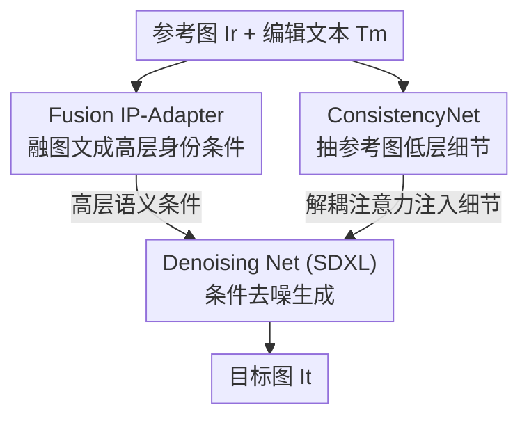

# Say Cheese! Detail-Preserving Portrait Collection Generation via Natural Language Edits

**会议**: CVPR 2026  
**论文**: [CVF Open Access](https://openaccess.thecvf.com/content/CVPR2026/html/Sun_Say_Cheese_Detail-Preserving_Portrait_Collection_Generation_via_Natural_Language_Edits_CVPR_2026_paper.html)  
**代码**: 无  
**领域**: 图像生成  
**关键词**: 肖像生成, 自然语言编辑, IP-Adapter, 细节保持, 扩散模型

## 一句话总结
本文提出"肖像合集生成（PCG）"新任务——给一张参考肖像和自然语言编辑指令，生成一组身份/细节一致但姿态、视角、构图各异的写真；为此构建了首个大规模数据集 CHEESE（约 24K 合集、576K 三元组，用大视觉语言模型标注 + 反演验证），并设计 SCheese 框架（Fusion IP-Adapter 管身份、ConsistencyNet + 解耦注意力管细节），在指令遵循（PF）和细节保持（DP）上达到 SOTA。

## 研究背景与动机
**领域现状**：社交媒体时代，用户希望用一张参考照片就能"复刻"出一整套风格统一、姿态多样的写真合集。这本质是参考图编辑问题：现有做法要么靠 ControlNet 这类结构条件（深度图、Canny 边缘）做细粒度控制，要么靠在指令数据集上微调的指令编辑模型（如 InstructPix2Pix 一类）。

**现有痛点**：两条路都不够用。结构条件（ControlNet/ControlNet++）会把空间布局"锁死"，参考图摆什么姿势、什么构图，生成结果就被强约束成什么样，无法满足写真摄影所需的布局自由度；指令编辑模型的指令往往是单一维度（改个表情、换个背景），扛不住写真里"同时改姿态 + 改机位 + 改构图"的复合指令。而在细节保持上，DreamBooth / LoRA 需要每个主体单独训练、不可扩展；IP-Adapter / InstantID 这类零样本方法快，但它们依赖高层语义嵌入，**保不住像素级细节**（妆容、衣服花纹、首饰），在复杂改动下细节就糊掉。

**核心矛盾**：PCG 要同时满足两个互相拉扯的目标——既要**大幅改动**（姿态/机位/构图的复合变换），又要**严格保细节**（身份 + 服饰 + 配饰像素级一致）。改得越狠越容易丢细节，保得越死越容易"复制粘贴"原图、不执行指令。现有方法只优化了其中一端。

**本文目标**：(1) 造一个能支撑"复合改动 + 细节保持"的训练数据；(2) 设计一个能在这对矛盾间取得平衡的生成框架。

**切入角度**：把"保身份"和"保细节"在结构上分层——高层语义（身份、整体风格）用一个条件分支，低层像素细节（花纹、首饰）用另一个分支，各管各的，避免一个嵌入同时承担两件事而两头都做不好。

**核心 idea**：用"融合了编辑文本的图像条件（Fusion IP-Adapter）"提供精确的高层身份引导，用"额外的 UNet 编码器 + 解耦注意力（ConsistencyNet）"把参考图低层细节直接注入去噪过程，二者协同实现复合改动下的高保真细节保持。

## 方法详解

### 整体框架
SCheese 要解决的是：给定三元组 $(I_r, T_m, I_t)$——参考图 $I_r$、编辑文本 $T_m$、目标图 $I_t$（训练时已知，推理时要生成）——生成满足 $T_m$ 指令、又保住 $I_r$ 细节的目标图。整套系统分两半：**数据侧**先用大视觉语言模型（LVLM）把网上抓来的写真合集自动标注成带"复合编辑指令"的三元组并做反演验证（得到 CHEESE 数据集）；**模型侧**以 Stable Diffusion（SDXL）为去噪骨干，挂上两个条件模块——Fusion IP-Adapter 注入高层身份语义，ConsistencyNet 通过解耦注意力注入低层细节，最后由 Denoising Net 生成目标图。

下图是生成侧（SCheese 模型）的数据流：参考图与编辑文本分别进入两个条件分支，再汇入主去噪网络。

> 注：数据集构建管线（关键设计 1）是离线产出训练数据的流程，不在上面这张生成图里；模型正是用它产出的 CHEESE 三元组训练的。

### 关键设计

**1. CHEESE 数据构建：LVLM 标注 + 反演验证**

PCG 缺数据——现成的指令编辑数据集只有单维度改动，撑不起"同时改姿态/机位/构图"的复合指令训练。作者用三步自动化管线造数据。**图像配对**：从网上收集约 24K 个写真合集（每个合集是同一主体、同一风格的多张图），在合集内枚举所有图对 $(I_i, I_j)$，用 LVLM 滤掉近重复对和背景/场景漂移过大的对——前者没编辑价值，后者会让"身份/细节是否保住"和"场景是否变了"混在一起、干扰监督。**指令标注**：对保留下来的图对 $(I_r, I_t)$，用 LVLM 生成描述 $I_r{\to}I_t$ 变换的编辑文本 $T_m$，提示词显式要求覆盖机位（景深/视角）、空间布局、主体级变化（姿态/表情/朝向），从而让一条文本能从单维度改动覆盖到多维度复合改动。

光靠 LVLM 直接标注质量不稳，于是加了**反演验证**这一关键一环：给定 $(I_r, T_m)$，再让 LVLM 生成一个"反演目标描述" $\hat c$——即根据参考图加这条指令、预测目标图应该长什么样的文字描述；然后算它与真实目标图的 CLIP 相似度 $s = \cos(f_I(I_t), f_T(\hat c))$，若 $s > \tau$ 则接受这条 $T_m$，否则把失败样本 $(T_m, s)$ 作为反馈重新提示 LVLM 生成精修版 $T'_m$，最多重试 $M$ 次。直觉是：如果指令写得准、信息够全，那么"照着指令反推出的目标描述"就该和真实目标图高度一致；这条 score 把标注质量量化了，专门救复杂多属性指令的标注。论文取 $\tau=0.45$、$M=5$。最终得到约 24K 合集、约 40K 图、约 576K 三元组（训练枚举合集内所有图对，测试每个身份只采一条三元组以最大化身份多样性、约 2K 条）。⚠️ 摘要写 573K 样本、引言写 575K triplets、实验写约 576K，数字略有出入，以原文实验节为准。

**2. Fusion IP-Adapter：把编辑文本融进图像条件来精确控身份**

普通 IP-Adapter 只编码参考图 $I_r$ 得到一个图像条件，问题是这个条件只"描述参考图本身"，并不知道用户想怎么改，导致条件和真正想要的目标特征有偏差、指令遵循差。本文的改法是：受 Composed Image Retrieval（CIR，"图+文检索"）启发，额外引入文本编码器抽取编辑文本 $T_m$ 的语义，把图像特征 $f_r = f_{img}(I_r)$ 和文本特征 $f_m = f_{txt}(T_m)$ 拼接后过一个基于 query 的投影网络融合：$f_{fused} = \mathrm{Proj}([f_r; f_m])$。这样得到的融合条件直接逼近"目标图特征"，而不是停留在"参考图特征"，给去噪网络的条件更贴合用户想要的结果，减少歧义、提升指令遵循。

为了让融合质量真的逼近目标，加了**对齐损失**：用 KL 散度约束融合特征向目标图的图像特征看齐，$L_{align} = \mathrm{KL}(f_{fused} \,\|\, f_{img}(I_t))$。同时训练时用 **teacher forcing**：以概率 $p_{ro}$ 把融合特征直接替换成真实目标图特征 $f_{img}(I_t)$。这就给了两种训练模式——用目标特征时提供"精确监督信号"让模型学得更准，用融合特征时模拟推理时的真实场景（推理时拿不到目标图，只能靠融合特征）。两者交替，模型既享受强监督，又不至于过拟合到"必须有目标特征"而在推理时崩。论文 $p_{ro}=0.35$。

**3. ConsistencyNet + 解耦注意力：低层细节的像素级注入**

即便有了 Fusion IP-Adapter 管高层语义，当参考图带复杂花纹、印花、繁复首饰时，高层嵌入仍然保不住这些像素级细节。对策是再挂一个 UNet 编码器 **ConsistencyNet** 专门抽参考图 $I_r$ 的低层中间表示，并通过**解耦注意力（Decoupled-Attention）**注进生成过程。具体地，在去噪 UNet 的每个 block 里，在原有自注意力旁**并联**一条交叉注意力层：交叉注意力的 query 来自当前生成图 $I_t$，key/value 来自参考图 $I_r$；把自注意力和交叉注意力的输出**取平均**，再与文本编码器、Fusion IP-Adapter 的特征通过一个解耦交叉注意力层进一步融合。

这个"解耦 + 相加"的设计是关键：自注意力专注于生成图内部的空间依赖，交叉注意力专门处理"生成状态↔参考特征"的显式对齐，二者保持各自的特征空间、以加法叠加，使模型能**有选择地**吸取参考细节而不扰乱生成主流程（不会被参考图带偏成复制粘贴）。一个实现上的巧思：ConsistencyNet 直接用预训练的 inpainting 模型并**移除其 mask 相关层**，因为 inpainting 模型天生擅长像素级对应/补全，去掉 mask 约束后正好最大化保留参考图细节。

### 损失函数 / 训练策略
总目标 = 扩散去噪损失 + 融合对齐损失 $L_{align}$（KL）。训练用 teacher forcing（概率 $p_{ro}=0.35$ 替换为目标特征）。实现：Denoising Net 用 SDXL，ConsistencyNet 用 SDXL inpainting 模型，Fusion IP-Adapter 用 IP-Adapter+ 并以 Kolors 权重初始化；8×H800 80GB，等效 batch 64，训练 50k 步，AdamW，学习率 1e-5。数据侧 LVLM 用 Qwen2.5-VL 72B，文/图编码器用 OpenCLIP ViT-G/14。

## 实验关键数据

### 主实验
测试集为 CHEESE 约 2K 三元组。指标：CLIP-I / DINO-I 衡量与参考图的细节相似度（但偏全局、易被"复制粘贴"刷高），CLIP-T 衡量指令遵循，外加用 Qwen2.5-VL 72B 做的两个 LVLM 评测——Qwen-DP（细节保持）、Qwen-PF（指令遵循），并在提示里加入惩罚"复制粘贴"的去偏机制。

| 方法 | CLIP-I | DINO-I | CLIP-T | Qwen-DP | Qwen-PF |
|------|--------|--------|--------|---------|---------|
| DreamBooth | 0.642 | 0.636 | 0.375 | 0.305 | 0.443 |
| DB LoRA | 0.738 | 0.677 | 0.395 | 0.458 | 0.579 |
| IP-Adapter | 0.764 | 0.663 | 0.386 | 0.464 | 0.511 |
| IP-Adapter+ | 0.794 | 0.699 | 0.376 | 0.659 | 0.549 |
| EasyRef | 0.783 | 0.687 | 0.358 | 0.647 | 0.545 |
| Emu2 | 0.849 | 0.821 | 0.379 | 0.767 | 0.352 |
| Kolors | 0.853 | 0.824 | 0.406 | 0.808 | 0.428 |
| Kontext | 0.857 | 0.791 | 0.413 | 0.792 | 0.679 |
| **SCheese (本文)** | 0.839 | 0.773 | **0.436** | **0.855** | **0.793** |

SCheese 在 CLIP-T、Qwen-DP、Qwen-PF 上全部最高。Kontext / Emu2 的 CLIP-I、DINO-I 略高，但作者指出这恰恰反映它们"复制粘贴"参考图的倾向（PF 大幅偏低，Emu2 仅 0.352），即靠抄原图刷高了参考相似度却没执行指令——这正是 LVLM 去偏指标要揭穿的。

**用户研究**（50 样本，0–4 打分，含 Collection Coherence "愿不愿把生成图放进同一合集"）：

| 指标 | Target(上界) | Emu2 | Kolors | Kontext | SCheese |
|------|------|------|--------|---------|---------|
| Human-DP | 0.936 | 0.158 | 0.410 | 0.653 | **0.778** |
| Human-PF | 0.930 | 0.138 | 0.397 | 0.670 | **0.803** |
| Human-CC | 0.915 | 0.115 | 0.293 | 0.467 | **0.688** |

人评与 LVLM 评测结论一致，SCheese 三项均居模型之首；Target 的 PF 近满分也反证了标注质量过硬。

### 消融实验
组件增量消融（从零样本 IP-Adapter 逐步叠加）：

| 配置 | CLIP-I | DINO-I | CLIP-T | Qwen-DP | Qwen-PF | 说明 |
|------|--------|--------|--------|---------|---------|------|
| IP-Adapter (零样本) | 0.853 | 0.824 | 0.406 | 0.808 | 0.428 | 起点，PF 极低 |
| + SFT | 0.822 | 0.728 | 0.421 | 0.783 | 0.683 | 在 CHEESE 上微调，指令遵循大涨 |
| + ConNet | 0.826 | 0.732 | 0.418 | 0.832 | 0.673 | 加 ConsistencyNet，DP 明显升 |
| + Fusion IP-A | 0.828 | 0.732 | 0.416 | 0.828 | 0.723 | 加融合文本条件，PF 再升 |
| + Align Loss | 0.837 | 0.753 | 0.426 | 0.836 | 0.777 | 对齐损失，整体提升 |
| + Teacher (Full) | 0.839 | 0.773 | 0.436 | 0.855 | 0.793 | 加 teacher forcing，全指标最优 |

另有"反演验证"消融（图示对比）：无验证 vs CLIP ViT-B/32 vs ViT-G/14，验证能引导 LVLM 发现更细微差异、标注更全面，且 ViT-G/14 优于 ViT-B/32（更强的图文理解给出更准的监督信号）。

### 关键发现
- **PF（指令遵循）的最大功臣是 SFT**：在 CHEESE 上微调让 Qwen-PF 从 0.428 跳到 0.683，说明这套复合指令数据本身是关键——没有合适数据，任何零样本模型都扛不住复合编辑。
- **DP（细节保持）的最大功臣是 ConsistencyNet**：+ConNet 让 Qwen-DP 从 0.783 升到 0.832，但 PF 略降，印证"细节注入会稍稍把模型拉向参考图"，需要后续 Fusion IP-Adapter 把指令遵循补回来——两个分支确实在分管两件相互拉扯的事。
- **teacher forcing 是临门一脚**：最后一步全指标再小幅抬升，说明"用真实目标特征做精确监督"对融合模块和去噪网络都有额外增益。
- **CLIP-I/DINO-I 会误导**：高参考相似度可能只是复制粘贴，必须配 LVLM/人评的 PF 才看得出真本事——这是本文方法学上一个值得复用的评测观点。

## 亮点与洞察
- **"高层语义 / 低层细节"双分支分管**是核心巧思：一个嵌入同时背"保身份"和"保花纹"两个担子注定都做不好，本文把它拆成 Fusion IP-Adapter（高层）+ ConsistencyNet（低层）两条独立通路，正好对应 PCG 的两难。这种"按特征层级分工"的思路可迁移到任何"既要大改又要保细节"的条件生成任务。
- **反演验证把"标注质量"变成可量化的 score**：让 LVLM 从指令反推目标描述、再用 CLIP 相似度卡阈值，失败就反馈重标——这是一个通用的"自动标注闭环"，可复用到其他需要 LVLM 生成高质量条件文本的数据构建场景。
- **复用 inpainting 模型当 ConsistencyNet**（去掉 mask 层）是个低成本却合理的工程选择：inpainting 模型天生擅长像素级补全/对应，正好契合"保细节"需求，省去从头训练一个细节编码器。
- **teacher forcing 用在扩散条件上**：把序列生成里的 teacher forcing 概念搬到"融合特征 vs 目标特征"的替换上，平衡强监督与推理一致性，是个可借鉴的训练 trick。

## 局限与展望
- **数据来源与版权/隐私**：CHEESE 抓自网络真实写真，肖像数据的授权与隐私风险作者未充分讨论；身份一致性生成也存在被滥用（伪造他人写真）的隐患。
- **依赖重型 LVLM 标注**：整套数据构建依赖 Qwen2.5-VL 72B，标注成本与可复现性受限；反演验证的阈值 $\tau=0.45$、重试 $M=5$ 等超参对最终数据质量影响有多大未见敏感性分析。⚠️
- **指标自身偏置**：作者自评指出 CLIP-I/DINO-I 易被复制粘贴刷高，但其主推的 Qwen-DP/PF 又依赖另一个 LVLM 评判，存在"用 LVLM 评 LVLM 标注的数据"的潜在循环偏置，人评样本仅 50 个略偏小。
- **数字口径不一**：合集/三元组规模在摘要、引言、实验三处有 573K/575K/576K 的小幅出入（⚠️ 以实验节为准），细节处可更严谨。
- **改进思路**：可探索轻量化标注（小模型蒸馏 LVLM 标注能力）、把反演验证阈值做成自适应、以及在更极端的大幅改动（换装、换场景）下评估细节-指令平衡是否仍稳。

## 相关工作与启发
- **vs IP-Adapter / IP-Adapter+**：IP-Adapter 只编码参考图作图像条件，靠高层语义嵌入，复杂改动下保不住像素细节、且条件不含"想怎么改"的信息；本文 Fusion IP-Adapter 把编辑文本融进图像条件、用 KL 对齐目标特征，并另立 ConsistencyNet 管低层细节，在 PF/DP 上全面超越。
- **vs DreamBooth / LoRA**：它们靠每主体微调保身份，需要多张参考样本、不可扩展，且本任务里 DreamBooth 的 DP/PF 最低（0.305/0.443）；本文是零样本前向，一张参考图即可，规模化更友好。
- **vs Emu2 / FLUX.1 Kontext / Kolors**：这些强通用编辑/生成模型在参考相似度（CLIP-I/DINO-I）上更高，但以"复制粘贴、不执行指令"为代价（PF 偏低）；本文在"既改得动又保得住"的平衡点上更优，这也正是 PCG 任务相对一般图像编辑的独特难点。
- **vs ControlNet / ControlNet++**：用深度/边缘等结构条件做控制会锁死空间布局，牺牲写真所需的构图自由度；本文走文本指令 + 双分支条件的路线，保留布局多样性。

## 评分
- 新颖性: ⭐⭐⭐⭐ 提出 PCG 新任务、首个大规模数据集 + 双分支保真框架，问题定义清晰且有现实需求，但单个模块（IP-Adapter 改造、参考 UNet 注入）多为已有技术的巧妙组合。
- 实验充分度: ⭐⭐⭐⭐ 主实验对比 9 个 baseline、含 LVLM 评测与人评、组件 + 数据双消融，较完整；但人评样本偏小、关键超参缺敏感性分析。
- 写作质量: ⭐⭐⭐⭐ 动机与方法叙述清楚、图表到位；规模数字三处口径不一稍欠严谨。
- 价值: ⭐⭐⭐⭐ 任务与数据集对写真/电商/社媒生成有实用价值，"双分支分管 + 反演验证标注"两个思路可迁移性强。

<!-- RELATED:START -->

## 相关论文

- [\[CVPR 2026\] FlowFixer: Towards Detail-Preserving Subject-Driven Generation](flowfixer_towards_detail-preserving_subject-driven_generation.md)
- [\[CVPR 2026\] FG-Portrait: 3D Flow Guided Editable Portrait Animation](fg-portrait_3d_flow_guided_editable_portrait_animation.md)
- [\[CVPR 2026\] Organizing Unstructured Image Collections using Natural Language](organizing_unstructured_image_collections_using_natural_language.md)
- [\[CVPR 2026\] HiFi-Inpaint: Towards High-Fidelity Reference-Based Inpainting for Generating Detail-Preserving Human-Product Images](hifi-inpaint_towards_high-fidelity_reference-based_inpainting_for_generating_det.md)
- [\[CVPR 2026\] ExpPortrait: Expressive Portrait Generation via Personalized Representation](expportrait_expressive_portrait_generation_via_personalized_representation.md)

<!-- RELATED:END -->
