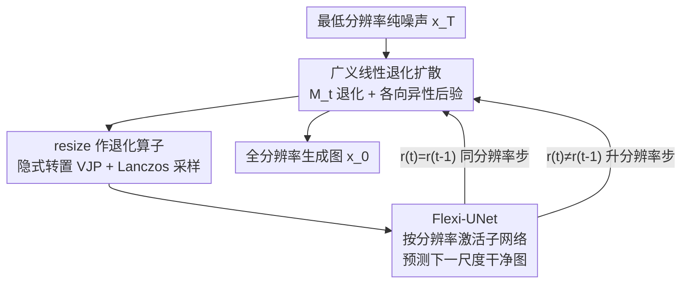

# Scale Space Diffusion：把尺度空间塞进扩散过程

**会议**: CVPR 2026  
**论文**: [CVF Open Access](https://openaccess.thecvf.com/content/CVPR2026/html/Mukhopadhyay_Scale_Space_Diffusion_CVPR_2026_paper.html)  
**代码**: 无（项目页 prateksha.github.io/projects/scale-space-diffusion）  
**领域**: 扩散模型 / 图像生成  
**关键词**: 尺度空间, 像素扩散, 广义线性退化, 多分辨率生成, Flexi-UNet

## 一句话总结
这篇论文指出"扩散加噪"和"尺度空间下采样"在信息退化上几乎等价——高噪声状态携带的信息量不比一张小图多，于是把"逐步下采样"当作扩散的退化算子，推导出一族广义线性退化扩散（Scale Space Diffusion, SSD），让模型在低分辨率上跑高噪声步、在高分辨率上跑低噪声步，并配套提出只激活相关网络层的 Flexi-UNet，在 CelebA / ImageNet 上以 FID 略升的代价把训练时间和 FLOPs 砍掉一半以上。

## 研究背景与动机
**领域现状**：像素域扩散模型（DDPM 系）在所有时间步 $t$ 都在**全分辨率**上去噪。已有观察发现，扩散不同阶段编码的信息层次不同——噪声越大，先丢失精细纹理、再丢失粗结构，本质上时间步构成了一个"信息层级"。计算机视觉里另一个经典工具尺度空间（高斯金字塔）也是通过逐级低通滤波/下采样得到一个信息层级。

**现有痛点**：既然高噪声的扩散状态只剩粗结构，信息量等价于一张很小的图，那为什么还要在全分辨率张量上处理它？这是纯粹的算力浪费。已有把多分辨率引入扩散的尝试要么只在最高分辨率上算（Cascaded Diffusion、Matryoshka，仍然贵），要么靠各向同性协方差等简化假设（UDPM，而 resize 核会重叠、假设并不成立），要么靠在跨尺度时**额外注入高频/去相关噪声**来对齐分布（Relay Diffusion、Pyramidal Flow Matching）——但后者本质是**推理时的近似**，扩散过程本身在数学上并没有被建模成"会改变分辨率"。

**核心矛盾**：把不同分辨率的独立扩散过程"跳着拼"会累积误差，而打补丁式地加噪声也没真正解决——根因是**扩散的前向过程数学形式里压根没有"分辨率变化"这一项**。

**核心 idea**：把扩散前向里 $x_{t-1}$ 的标量系数 $\sqrt{\alpha_t}$ 换成一个**通用线性算子** $M_t$（取 resize 就实现了尺度空间），从头推一族"广义线性退化扩散"，让分辨率变化天然嵌进前向/后向公式里——DDPM 只是 $M_t$=恒等算子的特例。

## 方法详解

### 整体框架
SSD 把"加噪"和"降分辨率"统一成同一种信息退化：前向过程从干净图 $x_0$ 出发，每一步既乘一个线性退化算子 $M_t$（这里是 resize，会真的把张量变小）又加高斯噪声，于是越往后 $x_t$ 既更噪、分辨率也更低；采样时反过来，从**最低分辨率**的纯噪声出发，模型在每一步预测"下一个分辨率上的干净图"，再用后验分布去噪并逐级**上采样**，直到还原到目标分辨率。因为不同步的 $x_t$ 尺寸不同、且偶尔要输出更高分辨率，普通 UNet 不够用，所以配一个能按分辨率动态激活子网络的 Flexi-UNet。

### 关键设计

**1. 广义线性退化扩散：把"降分辨率"写进前向公式而非推理时补丁**

标准 DDPM 的前向是 $x_t = \sqrt{\alpha_t}\,x_{t-1} + \sqrt{1-\alpha_t}\,\epsilon$，边际为 $x_t = \sqrt{\bar\alpha_t}\,x_0 + \sqrt{1-\bar\alpha_t}\,\epsilon$。作者把 $x_{t-1}$ 前的标量 $\sqrt{\alpha_t}$ 换成任意线性算子 $M_t$，转移分布写成 $x_t = M_t x_{t-1} + \eta_t,\ \eta_t \sim \mathcal{N}(0, \Sigma_{t|t-1})$，并**不**假设 $\Sigma_{t|t-1}$ 各向同性。在"边际各向同性"这一个约束 $\Sigma_t = \sigma_t^2 I$ 下，累乘得到边际

$$x_t = M_{1:t}\,x_0 + \sigma_t\,\epsilon,\qquad M_{1:t} = M_t M_{t-1}\cdots M_1.$$

逐步转移的噪声协方差为 $\Sigma_{t|t-1} = \sigma_t^2 I - \sigma_{t-1}^2 M_t M_t^T$，要保持半正定就得满足 $\sigma_t^2 \ge \sigma_{t-1}^2\,\lambda_{\max}(M_t M_t^T)$——这把"噪声调度"和"退化强度"耦合了起来。反向后验 $q(x_{t-1}\mid x_t, x_0)$ 仍是高斯，用 Woodbury 恒等式化简后为

$$\Sigma_{t\to t-1} = \sigma_{t-1}^2 I - \frac{\sigma_{t-1}^4}{\sigma_t^2} M_t^T M_t,\qquad \mu_{t\to t-1} = \mu_{t-1} + \frac{\sigma_{t-1}^2}{\sigma_t^2} M_t^T\big(x_t - M_t \mu_{t-1}\big).$$

当 $M_t = \sqrt{\bar\alpha_t}\,I$、$\sigma_t = \sqrt{1-\bar\alpha_t}$ 时，上面所有式子退回 DDPM——所以 DDPM 是 SSD 的特例。和 Pyramidal Flow 那类"推理时打补丁对齐尺度"的根本区别在于：这里分辨率变化是**前向过程的一等公民**，后验和噪声分布都是从带 $M_t$ 的数学形式严格推出来的，不是事后近似。

**2. resize 作退化算子：用隐式算子规避显式矩阵，各向异性后验用 Lanczos 采**

把 $M_t$ 具体取成"先 resize（双线性、抗锯齿，本质是模糊+下采样）再乘 $a_t = \sqrt{\bar\alpha_t}$"，就把高斯金字塔嵌进了扩散，并定义一个**分辨率调度** $r(t)$ 把时间步映到分辨率（$t$ 增大分辨率单调减小）。难点是 $M_t$ 是函数调用、没有显式矩阵，而后验里要用到它的转置 $M_t^T$ 和非各向同性协方差 $\Sigma_{t\to t-1}$ 的平方根：

- **转置 $M_t^T$**：利用线性算子的向量-雅可比积，$M_t^T v = \nabla_x \langle v, M_t x\rangle$，直接用 `torch.autograd.grad(M(x), x, grad_outputs=v)` 算（对线性算子结果与 $x$ 无关）。
- **各向异性噪声采样**：要从 $\mathcal{N}(0, \Sigma_{t\to t-1})$ 取样，需要 $\Sigma_{t\to t-1}^{1/2}\epsilon$。由于 $\Sigma_{t\to t-1}$ 只能隐式作用，用 **Lanczos 算法**对隐式对称算子 $A(\cdot)=I - \rho\,M_t^T M_t$（$\rho=\sigma_{t-1}^2/\sigma_t^2$）施加平方根谱函数，得到 $\Sigma_{t\to t-1}^{1/2}\epsilon$。文中提到若强行用各向同性近似这一步，会出现饱和伪影，说明各向异性采样是必要的。

当某步不改变分辨率（$r(t)=r(t-1)$）时 $M_t$ 退化为标量乘 $\sqrt{\alpha_t}$，后验就退回普通 DDPM，可以直接 `torch.randn()`，Lanczos 只在跨分辨率步用、开销可忽略。

**3. Flexi-UNet：按输入分辨率动态激活网络层，避免小图走完整网络**

SSD 的 $x_t$ 尺寸随步变化，且升分辨率步要求"输入小、输出大"。直接拿一个 Full UNet 有两个毛病：一是它要求输入输出同尺寸，升分辨率步得手动先上采样再喂进去；二是 UNet 的深度决定它能表达的尺度数——$L$ 个下采样块最小内部分辨率是 $R/2^{L-1}$，尺度数被钉死在 $L$（ADM 在 64/128/256 上分别只有 4/5/6 个尺度），高分辨率下根本表达不了尺度空间里那么多层级。Flexi-UNet 的做法是：**不同分辨率的输入只激活 UNet 中相关的一段层**——高分辨率走完整网络，低分辨率只穿过更深的中间层、跳过首尾块；因为每个块期望特定通道数，用 $1\times1$ 卷积把输入特征映射到对应通道维（保持空间分辨率）。同分辨率步走对称路径（下采样块数=上采样块数）；升分辨率步走**非对称**路径（多用一个上采样块），此时本该来自被跳过编码器块的跳连用**零张量**填充。这样既在不同分辨率间共享参数，又支持分辨率转移时的合法扩散动态。

### 损失函数 / 训练策略
模型预测的是"下一分辨率上的（未缩放）干净图" $x_{0,\theta}^{r(t-1)}(x_t, t)$，训练目标在 $x_0$-参数化下用信噪比加权，并采用 Min-SNR-$\gamma$（$\gamma=5$）裁剪权重：

$$L = \mathbb{E}_{x_0,t,\epsilon}\Big[\min\big(s^2(t),\gamma\big)\,\big\|\,x_{0,\theta}^{r(t-1)}(x_t,t) - \tfrac{1}{a_{t-1}}M_{1:t-1}x_0\,\big\|_2^2\Big],$$

其中 $s(t)=\sqrt{\bar\alpha_t}/\sqrt{1-\bar\alpha_t}$ 是信噪比系数的平方根。训练时有个工程细节：由于 $(r(t), r(t-1))$ 这对分辨率可能不一致，没法像标准扩散那样一个 batch 里随便采不同 $t$。做法是先采一个 $t$：若 $r(t)=r(t-1)$（同分辨率步），就在所有同分辨率的 $t_i$ 里采满整个 batch；若 $r(t)\neq r(t-1)$（升分辨率步），整个 batch 用同一个 $t$，避免尺寸不匹配。分辨率调度 $r(t)$ 的形状直接影响效果（见实验），作者最终用在最高分辨率上停留最久的 ConvexDecay 0.5。

## 实验关键数据

任务为**无条件图像生成**（便于干净地研究尺度空间如何融进扩散），数据集 CelebA（约 20 万张，64/128/256 三种分辨率）和 ImageNet（约 130 万张，64×64）。指标为 50k 样本对训练集的 FID，并报告训练时间与每次迭代平均 GFLOPs。SSD(nL) 中 n 为分辨率层级数。

### 主实验（CelebA 多分辨率，节选自 Table 2）

| 方法 | CelebA-64 FID | CelebA-64 训练时长(h) | CelebA-256 FID | CelebA-256 训练时长(h) | CelebA-256 GFLOPs |
|------|------|------|------|------|------|
| DDPM-$\epsilon$ | 2.22 | 70.30 | 5.52 | 87.31 | 497.0 |
| DDPM-$x_0$ | 2.98 | 70.71 | 5.47 | 87.33 | – |
| Blurring Diffusion | 2.06 | 71.79 | 4.76 | 88.08 | – |
| **SSD (2L)** | **2.14** | **62.63** | – | – | – |
| **SSD (4L)** | 4.28 | 52.38 | 10.52 | 51.70 | 273.0 |
| **SSD (6L)** | – | – | 13.50 | **42.88** | 209.7 |

读法：层级数越多，训练时间和 GFLOPs 越省、但 FID 越差——这是一条清晰的"质量 vs 效率"权衡曲线。在 256 分辨率上 SSD(6L) 的训练时长 42.88h 不到 DDPM 87.31h 的一半，GFLOPs 也从 497 降到 210；而 2 层档（SSD(2L)）在 CelebA-64 上 FID 2.14 与 DDPM/BD 基本持平，却已快出约 12%。

ImageNet-64（Table 3）上，SSD(2L) FID 13.08，和 DDPM-$\epsilon$ 12.82 / DDPM-$x_0$ 13.07 相当，说明方法在更复杂多样的分布上也能学；SSD(4L) 升到 17.89，再次印证层级越多越偏效率。

### 消融实验

| 维度 | 配置 | 关键指标 | 说明 |
|------|------|---------|------|
| 架构（CelebA-64, 500k iter） | Full UNet 2L | FID 2.33 / 推理 16.19s | 基线 |
| | **Flexi-UNet 2L** | **FID 2.26 / 推理 15.38s** | FID 略好且更快 |
| | Full UNet 4L | FID 4.90 / 推理 16.28s(res64) | |
| | **Flexi-UNet 4L** | **FID 4.87 / 推理 13.43s(res64)** | 4 层时提速更明显 |
| 分辨率调度（4 尺度, 500k iter） | ConvexDecay 2（高分辨率停留最少） | FID 11.03 / 11.71h | 最快但最差 |
| | **ConvexDecay 0.5（高分辨率停留最多）** | **FID 4.87 / 13.81h** | 最好 FID，最终采用 |
| | equal | FID 9.64 / 12.88h | 均匀分配 |

### 关键发现
- **层级数是核心旋钮**：增加分辨率层级单调地降训练时间/FLOPs、升 FID，给了用户一条可调的质量-效率曲线；省算力主要来自"高噪声步在小图上算"。
- **分辨率调度决定上限**：在最高分辨率上停留的步数越多 FID 越好（ConvexDecay 0.5 最优）、但训练越久；只在低分辨率猛省（ConvexDecay 2）则 FID 崩到 11。说明高分辨率步承担了大部分细节质量。
- **各向异性采样不可省**：用各向同性高斯近似后验噪声会产生饱和伪影，Lanczos 各向异性采样虽多一步但开销可忽略。
- **采样步数鲁棒**：作者称 SSD 在减少采样步时不像 DDPM 那样明显掉点（细节在补充材料，⚠️ 以原文为准）。

## 亮点与洞察
- **"高噪声=小图"的信息等价是全文支点**：用信噪比系数 $s(t)$ 把"信号占主导的像素比例"建模成 Info($t$)，再用 Info($r$)$=r^2$ 建模分辨率信息，两条曲线趋势吻合——一个直觉被量化成了可操作的设计原则，非常漂亮。
- **DDPM 是特例**这个结论让框架站得住：不是又发明一个并行机制，而是把 DDPM 嵌进更一般的"广义线性退化"里（$M_t$=恒等），可解释性和兼容性都好。
- **隐式算子工程化很巧**：resize 没有显式矩阵，作者用 VJP 算转置、用 Lanczos 算协方差平方根，把"理论上漂亮但实现困难"的非各向同性后验真正落地，这套技巧可迁移到任何"退化算子只有函数调用、没有矩阵"的线性扩散变体。
- **Flexi-UNet 的零跳连填充**是个干净的小设计：升分辨率步缺失的编码器跳连用零张量补，既保持网络结构合法又能跨分辨率共享参数。

## 局限与展望
- **质量有代价**：要拿到明显的效率收益（多层级），FID 会肉眼可见地上升（如 CelebA-256 上 6L 的 13.50 vs DDPM 5.47），目前更像"用质量换速度"，并非帕累托全面占优。
- **只验证了无条件生成 + 像素域**：没做文生图/类条件、也没结合 latent diffusion 或 DiT 主干，能否扩展到大规模条件生成是未知数。
- **退化算子选择单一**：正文只深入了 resize，虽然框架号称支持任意线性 $M_t$，但其他退化（如真正的模糊）只在补充里带过，⚠️ 通用性的实证有限。
- **Lanczos / VJP 引入额外实现复杂度**：虽说开销可忽略，但跨分辨率步的非各向同性采样让训练/采样管线比标准扩散复杂不少，复现门槛更高（且暂无公开代码）。

## 相关工作与启发
- **vs DDPM / Blurring Diffusion**：DDPM 全程固定分辨率；Blurring Diffusion 在 DCT 频域做退化但仍不改尺寸。SSD 把两者都纳为 $M_t$ 的特例，并真正改变空间分辨率，从而省下高噪声步的算力——这是它和所有"固定分辨率退化"方法的本质分界。
- **vs Cascaded / Matryoshka Diffusion**：它们用多个模型或在多分辨率上联合去噪来实现"由粗到细"，但要么各阶段独立、要么仍在高分辨率上算；SSD 用**单个模型**端到端处理所有分辨率，且分辨率转移有严格的数学后验。
- **vs Relay / Pyramidal Flow Matching / UDPM**：这些方法靠推理时补噪声（block noise / 去相关噪声）或简化的各向同性协方差假设来对齐跨尺度分布，本质是近似；SSD 直接把分辨率变化写进前向过程并精确推导各向异性后验，作者认为这才真正解决了"分布不匹配"的根因（⚠️ 优劣对比以原文实验为准）。

## 评分
- 新颖性: ⭐⭐⭐⭐⭐ 把尺度空间与扩散的信息层级统一，并推出含 DDPM 为特例的广义线性退化框架，视角原创
- 实验充分度: ⭐⭐⭐⭐ CelebA 多分辨率 + ImageNet 覆盖较全、消融到位，但限于无条件生成、缺大规模/条件场景
- 写作质量: ⭐⭐⭐⭐⭐ 从直觉到信息量量化再到数学推导，逻辑链清晰，公式与算法伪代码完整
- 价值: ⭐⭐⭐⭐ 提供了一条可调的"质量-效率"权衡新轴，思路可迁移到任意线性退化扩散；但当前以质量换速度、且无开源代码

<!-- RELATED:START -->

## 相关论文

- [\[CVPR 2026\] Semantic Scale Space: A Framework for Controllable Image Abstraction](semantic_scale_space_a_framework_for_controllable_image_abstraction.md)
- [\[CVPR 2026\] DiP: Taming Diffusion Models in Pixel Space](dip_taming_diffusion_models_in_pixel_space.md)
- [\[CVPR 2026\] Latent Diffusion Inversion Requires Understanding the Latent Space](latent_diffusion_inversion_requires_understanding_the_latent_space.md)
- [\[CVPR 2026\] Elucidating the Design Space of Arbitrary-Noise-Based Diffusion Models](eda_arbitrary_noise_diffusion_design_space.md)
- [\[CVPR 2026\] Functional Mean Flow in Hilbert Space](functional_mean_flow_in_hilbert_space.md)

<!-- RELATED:END -->
