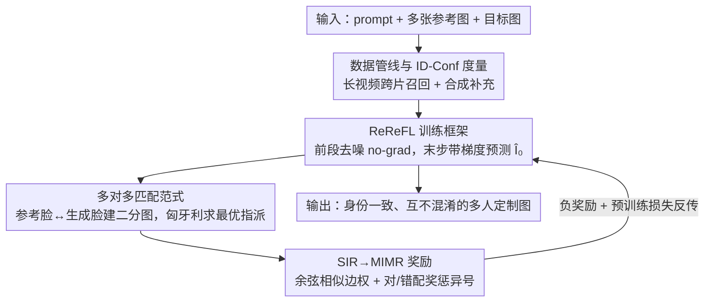

# Scaling Multi-Identity Consistency for Image Customization via Multi-to-Multi Matching Paradigm

**会议**: CVPR 2026  
**论文**: [CVF Open Access](https://openaccess.thecvf.com/content/CVPR2026/html/Cheng_Scaling_Multi-Identity_Consistency_for_Image_Customization_via_Multi-to-Multi_Matching_Paradigm_CVPR_2026_paper.html)  
**代码**: https://github.com/bytedance/UMO  
**领域**: 图像生成 / 扩散模型  
**关键词**: 图像定制、多人身份保持、奖励反馈学习、二分图匹配、身份混淆

## 一句话总结
UMO 把"多人身份定制"重新表述成多参考图与多生成人脸之间的全局指派问题，用一套即插即用的奖励反馈学习（ReReFL）+ 匈牙利匹配奖励（MIMR），在不重训基座的前提下显著提升身份相似度并压住身份混淆。

## 研究背景与动机
**领域现状**：图像定制（image customization）要让生成图既听文本指令又长得像参考图，其中"人脸身份（ID）定制"最受关注也最难——人对脸极其敏感，细微偏差就会被察觉。现有多人定制方法（DreamO、OmniGen、MSDiffusion、RealCustom++ 等）要么堆更大的多人配对数据，要么用 mask 显式约束每个 ID 的生成位置。

**现有痛点**：随着参考人数增加，这些方法的身份相似度下降、身份混淆加剧——生成图里某些参考人会"消失"，或者出现"A 的脸配 B 的衣服"这种张冠李戴。

**核心矛盾**：作者把根因归结为现有方法都在用**一对一映射（one-to-one mapping）**范式——学的是"每个参考 ID ↔ 它对应的生成 ID"的直连。这种范式同时要应对两件相互纠缠的事：**intra-ID variability**（同一个人在参考图和生成图里姿态/表情不同）和 **inter-ID distinction**（不同人之间要拉开、互不串味）。人一多，"人内差异"和"人际差异"的边界会越来越模糊，一对一映射顾此失彼，身份可扩展性（identity scalability）被卡死。

**本文目标**：在不为每个基座定制结构、不依赖昂贵偏好标注的前提下，做到"加人不掉点"——既保身份保真，又抑混淆。

**切入角度**：与其逐个硬连，不如把"哪张生成脸该对哪个参考 ID"当成一个**全局指派**来一次性优化，让每个生成身份都匹配到最合适的参考。这恰好对应检测/跟踪里的二分图匹配思路（DETR、Multi-Object Tracking）。

**核心 idea**：用"多对多匹配（multi-to-multi matching）"范式替代一对一映射——把多人生成转成最大化整体匹配质量的全局指派问题，并通过一套可直接反传奖励的微调框架（ReReFL）落地到任意现成定制模型上。

## 方法详解

### 整体框架
UMO（Unified Multi-identity Optimization）是一个**套在现成定制模型外面的强化微调框架**，输入是"文本 prompt + 多张参考图 + 目标图"，训练目标是让基座模型生成的多张人脸既像各自参考、又彼此可区分。它不改基座结构，只用 LoRA（rank 512）在基座上微调。

整条管线分三块：(1) 先用一条数据管线攒出"每个身份有多张参考图、且人数 >2"的多人数据集；(2) 训练时走 **ReReFL（Reference Reward Feedback Learning）**——大部分去噪步不带梯度地前向，只在最后一步带梯度前向并预测出干净图 $\hat I_0$；(3) 对 $\hat I_0$ 检测人脸、与参考人脸做二分图匹配，用匈牙利算法求最优指派，再据此算 **MIMR（Multi-Identity Matching Reward）**，把负奖励连同预训练损失一起反传更新参数。

### 关键设计

**1. 多对多匹配范式：把"谁对谁"交给全局指派而非逐个硬连**

这是全文的概念支点，针对一对一映射"人一多就混淆"的痛点。作者把生成结果 $\hat I_0$ 里检测到的 $N$ 张人脸与 $M$ 个参考身份摆成一张二分图：一侧是 $N$ 张生成脸 $\hat F$，另一侧是 $M$ 张参考脸 $F$，边权用两端人脸 embedding 的余弦相似度 $e_{F_j,\hat F_k}=\cos(\phi(\hat I_0)_j,\phi(I_r^k))$。然后在所有可能的指派 $S_n$ 中找一个总代价最低（等价于总相似度最高）的最优匹配：

$$\hat\sigma = \arg\min_{\sigma\in S_n}\sum_{i} L_{match}(F_i,\hat F_{\sigma(i)}) = \arg\max_{\sigma\in S_n}\sum_{i} e_{F_i,\hat F_{\sigma(i)}}$$

其中 $L_{match}=-e$ 是一对参考-生成身份的匹配代价，这个最优指派用**匈牙利算法**高效求解。和逐个硬连比，全局指派天然兼顾了"每个生成脸尽量像某个参考（保真）"和"不同参考别抢同一张脸（拉开 inter-ID distinction）"，人数增加时也不会塌——这正是它能 scale 的原因。

**2. ReReFL：让奖励信号直接反传，比 GRPO 收敛更快**

针对"扩散模型很难直接套 RL"以及"直接拿数据微调（SFT）几乎无效"的痛点。作者观察到，单纯用构造好的数据微调基座，身份保真只有微弱提升（Table 4 里 SFT 相对基座几乎不动），因为人脸监督在扩散目标里占比太小、注意力被稀释。于是把 ReFL 扩展到定制场景：对每个样本随机挑一个去噪时间步 $t\in[T_s,T_e]$，从 $x_T$ 开始**前段去噪步全程 no-grad 前向**，只在第 $t$ 步带梯度前向得到 $x_{t-1}$，并由 noise scheduler 反推出预测干净图 $\hat I_0$；再对 $\hat I_0$ 算奖励，loss 取 $L=\beta L_{diff} + L_{ReReFL}$（$L_{ReReFL}=-R(\hat I_0)$，即负奖励）一并反传。与 GRPO 那类"对自身 rollout 做加权 SFT"的算法不同，ReReFL 把奖励梯度直接回传到推理结果上，作者称收敛更快。时间步范围按"奖励分数趋稳"来定（UNO 用 $T=25,[1,10]$，OmniGen2 用 $T=50,[1,20]$，因为 SIR 分数大约第 5 步后才稳定）。

**3. 从 SIR 到 MIMR：用对配/错配异号的奖励同时拉保真、压混淆**

针对"既要像、又要互不串味"这对张力。最简单的单参考情形用 **SIR（Single Identity Reward）**——预测脸和参考脸 embedding 的余弦相似度 $R_{SIR}=\cos(\phi(\hat I_0),\phi(I_r^1))$，作者验证它在去噪后段相对稳定、且高分结果确实比低分结果更像参考，可作可靠奖励。扩到多人后，光最大化每张脸的相似度还不够（会出现两张脸都像同一个参考、另一个参考丢失），所以在拿到最优指派 $\hat\sigma$ 后定义 **MIMR**：

$$R_{MIMR}=\frac{1}{MN}\sum_{j=1}^{N}\sum_{k=1}^{M}\big(\lambda_1\mathbb{1}_{\{k=\hat\sigma(j)\}}+\lambda_2\mathbb{1}_{\{k\neq\hat\sigma(j)\}}\big)e_{F_j,\hat F_k}$$

其中 $\lambda_1>0,\lambda_2<0$（实验取 $\lambda_1=1,\lambda_2=-1$）。直观说就是：**被指派为正确对应的边（$k=\hat\sigma(j)$）给正奖励、拉近**；其余错配边给负奖励、推远。这一正一负让梯度方向同时服务"提保真"和"扩 inter-ID 距离"，正是它比只用 SIR 在多人场景大幅领先（Table 4）的根本。

**4. 多人数据管线 + ID-Conf 混淆度量：补齐训练与评测两块短板**

针对公开数据集里"身份数 >2 的样本极少"以及"没有专门量化混淆的指标"两个工程缺口。数据侧借鉴 MovieGen，从同一长视频里**用含多人的帧作 query、再从其它片段召回每个身份**，凑出人数多、姿态/表情变化大的真实数据；同时按 UNO 思路补一批合成数据，但因合成身份相似度偏低，只保留经过严格人脸相似度过滤后的高想象力/部分风格化场景作补充。评测侧提出 **ID-Conf**：对每个参考身份，取生成结果里与之最相似的两张候选脸（top-1 的 $j^{[1]}_i$ 与 top-2 的 $j^{[2]}_i$），用两者相似度的相对 margin 衡量混淆——$\text{ID-Conf}=\frac{1}{n}\sum_i \text{clip}(1-\frac{\cos(\phi(F_i),\phi(\hat F_{j^{[2]}_i}))}{\cos(\phi(F_i),\phi(\hat F_{j^{[1]}_i}))},0,1)$，值越大表示混淆越轻（top-1 明显高于 top-2，说明对应明确）。

### 损失函数 / 训练策略
总损失 $L=\beta L_{diff}+L_{ReReFL}$，$\beta=1$；$L_{ReReFL}$ 即负的 MIMR 奖励。LoRA rank 512，学习率 $5\times10^{-6}$，总 batch 8，8×A100 训练；其余超参沿用各基座原设置。

## 实验关键数据

在 XVerseBench、OmniContext 上、分别以 UNO 和 OmniGen2 两类 SOTA 为基座验证 UMO 的"通用增益"。

### 主实验

XVerseBench 单主体（Table 1，ID-Sim / IP-Sim / AVG）：

| 方法 | ID-Sim | IP-Sim | AVG |
|------|--------|--------|-----|
| OmniGen | 76.51 | 78.46 | 77.49 |
| XVerse | 79.48 | 76.86 | 78.17 |
| UNO（基座） | 47.91 | 80.40 | 64.16 |
| **UMO (UNO)** | 80.89 | 77.09 | 78.99 |
| OmniGen2（基座） | 62.41 | 74.08 | 68.25 |
| **UMO (OmniGen2)** | **91.57** | 79.74 | **85.66** |

XVerseBench 多主体（Table 2，含 ID-Conf）——混淆指标提升尤为明显：

| 方法 | ID-Sim | ID-Conf† | IP-Sim | AVG |
|------|--------|----------|--------|-----|
| XVerse | 66.59 | 72.44 | 71.48 | 70.17 |
| UNO（基座） | 31.82 | 61.06 | 67.00 | 53.29 |
| **UMO (UNO)** | 69.09 | 78.06 | 68.57 | 71.91 |
| OmniGen2（基座） | 40.81 | 62.02 | 67.15 | 56.66 |
| **UMO (OmniGen2)** | **71.59** | 77.74 | 73.80 | **74.38** |

OmniContext（Table 3，GPT-4.1 评分 + 补充 ID 指标）：UMO 把 OmniGen2 的 ID-Sim 从 3.51→**7.07**、ID-Conf 从 6.35→**7.60**，AVG 5.68→**7.28**，身份维度大幅拉升的同时整体分基本持平（7.18→7.16）。

### 消融实验

以 UNO 为基座、XVerseBench 多主体（Table 4）：

| 配置 | ID-Sim | ID-Conf† | IP-Sim | AVG | 说明 |
|------|--------|----------|--------|-----|------|
| UNO | 31.82 | 61.06 | 67.00 | 53.29 | 基座 |
| SFT | 33.94 | 62.88 | 65.17 | 54.00 | 同数据普通微调，几乎不动 |
| ReReFL w/ SIR | 65.16 | 65.28 | 67.25 | 65.90 | 只用单身份奖励，保真上去但混淆仍重 |
| **UMO（ReReFL + MIMR）** | 69.09 | 78.06 | 68.57 | 71.91 | 完整模型 |

### 关键发现
- **普通 SFT 基本无效**：和基座比 ID-Sim 仅 31.82→33.94，印证"人脸监督在扩散目标里占比太小、被注意力稀释"的判断——必须用聚焦人脸的奖励 RL 才能解锁身份一致性。
- **MIMR 是压混淆的关键**：从 SIR 换到 MIMR，ID-Conf 从 65.28 猛升到 78.06；可视化里 SIR 会出现"两张脸都像同一参考、另一参考丢失"或发色串味，而 MIMR 通过给每张脸分配正确监督把它们拉开。
- **增益跨基座通用**：在 UNO 和 OmniGen2 上都成立，且从单身份到多身份场景可扩展，说明这是范式层面的改进而非对某个基座的过拟合。

## 亮点与洞察
- **把多人定制重述成指派问题**最让人"啊哈"：借检测/跟踪里成熟的二分图 + 匈牙利匹配，一举把"保真"和"区分"两个纠缠目标解耦到边权与对/错配符号上，思路干净且可扩展。
- **ReReFL 即插即用**：不改基座结构、只用 LoRA 外挂，对 UNO/OmniGen2 都能涨，是可复用的"身份增强插件"型训练范式，迁移成本低。
- **ID-Conf 这个度量可单独拿走**：用 top-1/top-2 相似度相对 margin 量化"混淆"，简单、无需额外标注，适合任何多人生成任务做诊断。
- **奖励要稳定才反传**：观察到 SIR 分数前几步剧烈波动、约第 5 步后趋稳，据此只在后段时间步反传奖励——这种"等奖励稳了再回传"的工程细节值得借鉴。

## 局限与展望
- 奖励完全建立在**人脸识别 embedding** 的余弦相似度上，强依赖识别网络质量；对非人脸主体（通用物体）的身份一致性，本文增益主要是"保持/略升"，并非该奖励直接优化的目标。
- ID-Conf 用 top-2 相对 margin 定义，⚠️ 当生成人数与参考人数不一致（漏人/多检）时该度量的行为，原文未充分展开，以原文为准。
- 训练需 8×A100、LoRA rank 512，且要先攒出"人数 >2 的多参考"数据集，复现门槛不低；合成数据因相似度偏低只能小比例补充，真实多人数据的获取仍是瓶颈。
- 仅在 UNO / OmniGen2 两类基座上验证，对更多架构（如纯 mask 引导类方法）是否同样有效有待观察。

## 相关工作与启发
- **vs 一对一映射方法（DreamO / OmniGen / MSDiffusion / RealCustom++）**：它们靠堆多人配对数据或用 mask 约束每个 ID 的位置来减混淆；UMO 不做位置约束，而是把"谁对谁"交给全局指派优化，人数越多越显出多对多范式的可扩展优势。
- **vs Identity-GRPO**：同样用 RL 提升身份相似度，但 Identity-GRPO 需要昂贵的偏好数据生成/过滤/标注来训奖励模型；UMO 直接复用现成人脸识别模型（如 PuLID 式）当奖励，更省、更经济，且 ReReFL 直接反传奖励比 GRPO 类加权 SFT 收敛更快。
- **vs DETR / Multi-Object Tracking**：方法论上直接借用了它们"二分图 + 匈牙利匹配"的指派思想，把检测/跟踪里的"框-目标匹配"迁移到"生成脸-参考身份匹配"。

## 评分
- 新颖性: ⭐⭐⭐⭐⭐ 把多人身份定制首次重述为多对多全局指派，范式级创新
- 实验充分度: ⭐⭐⭐⭐ 跨两个基座、两个 benchmark + 用户研究，消融清晰；但基座/数据多样性仍有限
- 写作质量: ⭐⭐⭐⭐ 动机—范式—奖励的逻辑链顺畅，公式与图配合到位
- 价值: ⭐⭐⭐⭐⭐ 即插即用、跨模型通用，对多人定制这个高频痛点直接有效

<!-- RELATED:START -->

## 相关论文

- [\[CVPR 2026\] PositionIC: Unified Position and Identity Consistency for Image Customization](positionic_unified_position_and_identity_consistency_for_image_customization.md)
- [\[CVPR 2026\] PSR: Scaling Multi-Subject Personalized Image Generation with Pairwise Subject-Consistency Rewards](psr_scaling_multi-subject_personalized_image_generation_with_pairwise_subject-co.md)
- [\[CVPR 2026\] Aligning Multi-Character Narrative Image Generation with Multi-Aspect Human Preferences](aligning_multi-character_narrative_image_generation_with_multi-aspect_human_pref.md)
- [\[CVPR 2026\] MultiCrafter: High-Fidelity Multi-Subject Generation via Disentangled Attention and Identity-Aware Preference Alignment](multicrafter_high-fidelity_multi-subject_generation_via_disentangled_attention_a.md)
- [\[CVPR 2026\] MPDiT: Multi-Patch Global-to-Local Transformer Architecture for Efficient Flow Matching](mpdit_multi-patch_global-to-local_transformer_architecture_for_efficient_flow_ma.md)

<!-- RELATED:END -->
