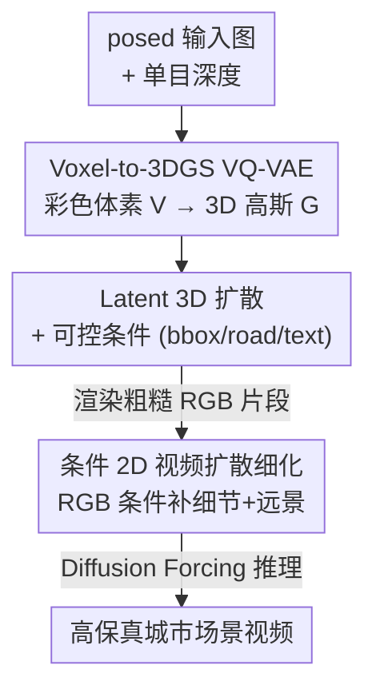

# ScenDi: 3D-to-2D Scene Diffusion Cascades for Urban Generation

**会议**: CVPR 2026  
**论文**: [CVF Open Access](https://openaccess.thecvf.com/content/CVPR2026/html/Guo_ScenDi_3D-to-2D_Scene_Diffusion_Cascades_for_Urban_Generation_CVPR_2026_paper.html)  
**代码**: 无（仅项目页 https://xdimlab.github.io/ScenDi）  
**领域**: 扩散模型 / 3D视觉  
**关键词**: 城市场景生成, 3D高斯泼溅, 级联扩散, 视频扩散, 相机可控性

## 一句话总结
ScenDi 把城市场景生成拆成「3D 粗生成 → 2D 细化」的级联扩散：先用 3D 隐扩散生成带粗糙外观的 3D 高斯场景（保证相机可控），再用视频扩散模型在渲染图上补细节、画远景，从而在 Waymo / KITTI-360 上同时拿到高保真画质和精确相机轨迹。

## 研究背景与动机
**领域现状**：从零生成城市 3D 场景（无条件，或给 text / layout 这类粗引导）是搭建游戏、自动驾驶仿真等开放世界的关键一步。它和「图生视频（I2V）」不同——I2V 只是给定视角延拓输入帧，而场景生成要造出几何一致、外观真实、可从任意视角自由渲染的整个环境。

**现有痛点**：两条主流路线各有硬伤。① 纯 3D 路线（直接在 3D 空间生成 occupancy / 语义体素）有显式空间结构、天然支持相机控制，但受限于 3D 表示的低分辨率，渲染出来的图细节糊；而且要拿到能直接渲染高保真图的 3D GT 数据极其稀缺。② 「3D 几何 + 2D 渲染」混合路线：先生成 3D 语义体素，再渲染出 depth / semantic map 作为条件喂给视频扩散——但最终外观**全部**由 2D 凭空合成，模型得学一个从深度 / 语义到 RGB 的复杂映射，训练低效，而且重访同一地点时缺乏一致性。

**核心矛盾**：生成过程里「多少该在 3D 空间做、多少该交给 2D」？纯 3D 牺牲画质、纯 2D（或 3D 只给几何）牺牲一致性与训练效率。

**核心 idea**：让 3D 阶段不止给几何，还要给**粗糙的 RGB 外观**——这是和此前「3D 只提供几何线索」方法的关键区别。2D 模型只需在这个粗外观上做细化（类似超分），而不是从零合成所有外观，由此同时提升训练效率和回环一致性；显式 3DGS 骨架则保住相机可控性。

## 方法详解

### 整体框架
ScenDi 是一条 3D→2D 的级联扩散管线（论文名 ScenDi 取意大利语 "descend"，正对应从 3D 降到 2D 的级联），分两大阶段。**3D 生成阶段**：先用现成的单目深度估计器把若干 posed 输入图反投影、融合成全局彩色点云，离散化成带颜色的体素网格 $V$；一个 Voxel-to-3DGS VQ-VAE 把 $V$ 前馈映射成一组 3D 高斯基元 $G$（可低分辨率渲染多视一致图）；再在 VQ-VAE 的隐空间训一个 3D 隐扩散模型，从纯噪声采样出粗糙 3D 场景，可选地受 3D bbox / road map / text 控制。**2D 细化阶段**：把 3DGS 渲染出的视频片段 $\tilde{C}$ 作为条件，微调一个条件视频扩散模型，给前景补高频细节、并合成体素范围之外的远景背景；推理时用 Diffusion Forcing 保证跨片段一致。

### 关键设计

**1. Voxel-to-3DGS VQ-VAE：从 2D 监督学一个前馈的体素→3D高斯重建器**

痛点是：训 3D 扩散需要海量 3D GT，但城市场景的 3D 高斯要逐场景优化、慢到没法规模化。ScenDi 绕开这点——不要 3D GT，改用现成单目深度估计器：给定体积内的 posed 图 $\{I_i\}$，估深度 $\{D_i\}$，反投影并按相机位姿融合到统一坐标系，配一个一致性检查模块滤掉不准的深度和离群点，得到全局 RGB 点云，再离散成彩色体素 $V \in \mathbb{R}^{H\times W\times D\times 3}$（落在网格外的点丢弃，记为前景）。VQ-VAE 把 $V$ 编码、量化、解码成 3D 高斯：$z^V = E^{3D}_\theta(V),\ z^V_q = Q^{3D}_\theta(z^V),\ G = D^{3D}_\theta(z^V_q)$。解码器走两条支路——occupancy 支路预测每个体素是否占用 $O$，feature 支路给出特征体 $F$；被判占用的体素经各 MLP 头预测一颗高斯的属性：颜色 $c$、不透明度 $\alpha$、尺度与旋转 $s,R$、相对体素中心的偏移 $\Delta o$，再用渲染函数 $\pi$ 渲成图。这样把"获取 3D 表示"从逐场景优化变成一次前馈，且监督完全来自 2D 图，规模化才成立。

**2. Latent 3D 扩散 + 显式可控条件：在 3D 隐空间里生成、用 3D 条件直接约束**

VQ-VAE 训好后，在它的隐空间上训一个 DiT 风格的 3D 噪声估计器，前向加噪 $z^V_t = \sqrt{\alpha_t}z^V_0 + \sqrt{1-\alpha_t}\epsilon$，采用 v-prediction，从网络输出反解干净隐码 $\hat{z}^V_0 = \sqrt{\alpha_t}z^V_t - \sqrt{1-\alpha_t}\epsilon^{3D}_\theta(z^V_t;t,c)$，推理用 DDIM 从纯噪声去噪。可控性是这一设计的重点：因为生成发生在 3D 空间，layout 条件无需先渲成 2D——直接从语义基元构造一个 3D 条件体（每个体素一个 one-hot 语义标签，如车辆 / 道路 / 空），下采到隐分辨率后和初始隐码 $z_0$ 拼接进扩散训练；text 条件则把场景标注成含天气 / 路型 / 背景的句子，文本嵌入经 cross-attention 注入。"在 3D 里生成 + 用显式 3D 表示"正是相机可控性的来源，2D-only 方法因为没有显式 3D 信息做不到这点。

**3. 条件 2D 视频扩散细化：用渲染 RGB（而非 depth）做条件补细节、画远景**

3D LDM 渲出的图跨视一致、相机解耦，但受分辨率所限发糊，远处区域也建模不了。ScenDi 借预训练视频扩散的先验来补——这是把 2D 当"细化器"而非"从零生成器"。设目标 RGB 视频片段 $C$、对应的 VQ-VAE 渲染片段 $\tilde{C}$，用冻结 VAE 把两者映到隐空间得 $z^C, z^{\tilde{C}}$，只对 $z^C$ 加噪得 $z^C_t$，再沿通道与 $z^{\tilde{C}}$ **concat** 作为 U-Net 输入，学条件噪声估计器 $\epsilon_\phi(z^C_t; t, z^{\tilde{C}})$。关键在于条件用的是**渲染 RGB** 而不是 depth/semantic：RGB 直接给纹理信息，2D 模型只做超分式细化，训练更高效、重访一致性更好（消融 Tab.3 直接证明：KITTI-360 上 RGB 条件 FID 36.9 vs depth 条件 78.6）。

**4. Diffusion Forcing 推理：让跨片段的远景背景不再突变**

由于训练只在最多 5/17 帧的短片段上做，朴素的 replacement 拼接会让长序列里相邻片段的远景"跳变"。ScenDi 改用 Diffusion Forcing：微调时给片段内每帧独立采样不同噪声水平（而非整段共用一个 $t$）；采样时把前面已生成的 $W$ 帧条件给后面 $F-W$ 帧，整段时间嵌入设为 $t=[\underbrace{t_\epsilon,\dots,t_\epsilon}_{W},\underbrace{t,\dots,t}_{F-W}]$，其中 $t_\epsilon$ 是很小的时间步、$t$ 来自标准调度器。这样后续帧以已生成帧为条件去噪，跨片段背景才连贯（消融图显示 w/o DF 背景会剧烈变化）。

### 损失函数 / 训练策略
训练分三阶段。① VQ-VAE 重建：几何用 BCE 约束预测 occupancy 与输入体素一致，外观沿用 3DGS 的 L1+SSIM、加前景掩码损失，每场景采 $M$ 帧渲染算 2D 损失，$L_{recon}=L_{3D}+\sum_m L^m_{2D}$，其中 $L_{3D}=\lambda_{bce}L_{bce}+\lambda_{vq}L_{VQ}$、$L_{2D}=\lambda_{rgb}L_1+\lambda_{ssim}L_{ssim}+\lambda_{fg}L_{fg}$（$\lambda_{bce}=1,\lambda_{vq}=0.25,\lambda_{rgb}=0.8,\lambda_{ssim}=0.2,\lambda_{fg}=0.5$）。② 3D 扩散：MSE 监督干净样本 $L^{3D}_{diff}=\|z^V_0-\hat{z}^V_0\|^2$。③ 2D 扩散微调：沿用预训练 backbone 的损失 $L^{2D}_{diff}=\|z^C_0-\hat{z}^C_0\|^2$。2D 端训了两个变体（SVD 和 Wan2.1-1.3B-i2v）；KITTI-360 与 Waymo 联合训练并注入 dataset ID 嵌入；用 8×A100，VQ-VAE ~2 天、3D 扩散 ~3 天、2D 微调 ~5 天。

## 实验关键数据

### 主实验
KITTI-360 上与 3D 生成 / I2V baseline 的对比（FID/KID/FVD 越低越好，TransErr/RotErr 衡量相机可控性）：

| 方法 | 类型 | Backbone | FID↓ | KID↓ | FVD↓ | Met3R↓ | TransErr↓ | RotErr↓ |
|------|------|----------|------|------|------|--------|-----------|---------|
| DiscoScene | 3D Gen | 3D GAN | 135.3 | 0.093 | 2025.9 | 0.544 | 5.45 | 2.07 |
| CC3D | 3D Gen | 3D GAN | 90.8 | 0.091 | 706.1 | 0.248 | 1.82 | 1.76 |
| UrbanGen | 3D Gen | 3D GAN | 33.0 | 0.017 | 300.1 | 0.220 | 0.21 | 0.25 |
| **Ours** | 3D Gen | SVD | 36.9 | 0.026 | 400.3 | 0.214 | 0.23 | 0.13 |
| **Ours** | 3D Gen | WAN2.1-1.3B | **22.9** | **0.016** | **262.6** | **0.125** | **0.06** | 0.23 |
| Vista | I2V | SVD | 25.6 | 0.016 | 234.0 | 0.091 | 2.33 | 0.74 |
| Gen3C | I2V | Cosmos | 24.1 | 0.012 | 426.1 | 0.148 | 0.04 | 0.11 |

WAN 变体在 3D 生成类里全面领先（FID 22.9 / Met3R 0.125），相机精度也远超纯 3D GAN baseline。与 I2V 方法比 FID/FVD 并不完全公平（它们生成帧常与 GT 重叠），但 ScenDi 给出相当画质，且在输入与当前视角重叠很小时不像 Gen3C 那样质量崩坏。

### 消融实验
| 配置 | 关键指标 | 说明 |
|------|---------|------|
| w/o $L_{bce}$, G=1 | PSNR 21.47 / SSIM 0.750 / LPIPS 0.327 | 去掉占用监督，几何变差 |
| w/ $L_{bce}$, G=6 | PSNR 21.53 / SSIM 0.753 / LPIPS 0.317 | 每体素 6 颗高斯，仅小幅提升 |
| w/ $L_{bce}$, G=1 (Ours) | PSNR 21.56 / SSIM 0.753 / LPIPS 0.321 | 平衡显存与性能的默认配置 |

2D 条件信号消融（同样训练步数）：

| 条件 | KITTI-360 FID↓ | KITTI-360 KID↓ | Waymo FID↓ | Waymo KID↓ |
|------|----------------|----------------|------------|------------|
| Depth 条件 | 78.6 | 0.070 | 77.4 | 0.071 |
| RGB 条件 (Ours) | **36.9** | **0.026** | **41.3** | **0.030** |

### 关键发现
- **RGB 条件碾压 depth 条件**：相同训练步数下 FID 从 78.6 降到 36.9，因为 RGB 直接给纹理、2D 只需细化；depth 条件下房屋表面更糙、噪声更多，且重访同地点外观不一致——直接验证了"3D 也要给粗外观"的核心假设。
- **每体素多颗高斯收益不大**：G 从 1 增到 6 仅微提升，作者推测从共享体素特征预测多样高斯本身就难；为省显存默认 G=1。
- **BCE 占用监督有用**：纯 2D 监督 VQ-VAE 也能收敛，但占用预测不准、性能略降。
- **Diffusion Forcing 解决跨片段跳变**：不用它远景背景会剧烈变化，用了相邻片段背景才连贯。

## 亮点与洞察
- **重新切分 3D 与 2D 的职责边界**：核心洞见是"3D 阶段该输出粗 RGB 外观，而不只是几何"。这把 2D 模型的任务从"从语义/深度凭空造 RGB"降级为"在已有粗外观上做超分式细化"，训练效率和一致性同时受益——一个朴素但效果显著的分工再设计。
- **用单目深度 + 一致性检查造伪 3D GT**：绕开城市 3DGS 逐场景优化的规模化瓶颈，让 VQ-VAE 能完全从 2D 监督学到体素→高斯的前馈映射，这套"现成深度估计器当 3D 数据工厂"的思路可迁移到其他缺 3D GT 的生成任务。
- **3D 显式骨架 = 相机可控性的根**：相比 I2V / 2D-only 方法，显式 3DGS 让大视角外推（OOD 平移 / 旋转轨迹）下相机精度依然稳，而纯 3D GAN 在大位移下直接画质崩坏、连 DUSt3R 都估不出位姿。

## 局限与展望
- **2D 质量被 3D 阶段卡脖子**（作者承认）：视频扩散的上限取决于前置 3D LDM，3D 生成不好时 2D 细化只能缓解部分伪影、补不回根本性的崩坏。
- **训练数据受限、靠空间重叠扩样**：Waymo ~20k、KITTI-360 ~35k 样本，且要过滤大转弯 / 慢自车 / 大动态物体的场景，适用范围偏向前向行驶轨迹（虽然作者展示了一定的相机外推能力）。⚠️ 动态物体场景的表现论文未充分展开。
- **改进方向**：扩大训练数据与模型规模以提升原生 3D 场景生成质量；尤其把 3D 阶段做强，整条级联的天花板才能抬高。

## 相关工作与启发
- **vs 纯 3D 生成（DiscoScene / CC3D / UrbanGen / GaussianCity）**: 它们只靠 3D backbone，有显式空间结构和相机可控性，但受 3D 表示分辨率限制、细节糊；ScenDi 保留显式 3DGS 骨架的同时，用 2D 视频扩散先验补回高频细节，画质与一致性都更好。
- **vs 「3D 几何 + 2D 渲染」混合（UrbanGen 类先生成语义体素再渲 depth/semantic 喂 2D）**: 它们的 3D 只给几何线索、外观全由 2D 凭空合成，映射复杂、重访不一致；ScenDi 让 3D 也产出粗 RGB，2D 只做细化，训练更高效、回环更一致（消融直接对比）。
- **vs 图生视频（Vista / Gen3C）**: 它们靠 internet-scale 2D 先验画质高，但缺显式 3D 信息、相机控制弱（小角度弯道常被拉直成直行）；ScenDi 用显式 3D 表示拿到更准的相机轨迹。
- **vs SDS 蒸馏类（Urban Architect 等）**: 用 LG-VSD / VSD 把 2D 先验蒸馏进 3D 表示，单场景处理时间极长且易过饱和；ScenDi 是前馈采样 + 一次细化，速度与稳定性更优。

## 评分
- 新颖性: ⭐⭐⭐⭐ 「3D 出粗外观、2D 做细化」的职责再切分朴素但切中要害，3D-to-2D 级联框架完整
- 实验充分度: ⭐⭐⭐⭐ 两数据集、3D 与 I2V 双类 baseline、画质 + 相机可控性 + 一致性多维评测，消融清晰；但缺代码与动态场景的深入分析
- 写作质量: ⭐⭐⭐⭐ 动机与方法链路讲得清楚，公式与图表配合到位
- 价值: ⭐⭐⭐⭐ 为自动驾驶仿真 / 开放世界场景生成提供了兼顾画质与相机可控的实用路线

<!-- RELATED:START -->

## 相关论文

- [\[CVPR 2025\] Lifting Motion to the 3D World via 2D Diffusion](../../CVPR2025/image_generation/lifting_motion_to_the_3d_world_via_2d_diffusion.md)
- [\[CVPR 2026\] StyleTextGen: Style-Conditioned Multilingual Scene Text Generation](styletextgen_style-conditioned_multilingual_scene_text_generation.md)
- [\[CVPR 2026\] 3D Space as a Scratchpad for Editable Text-to-Image Generation](3d_space_as_a_scratchpad_for_editable_text-to-image_generation.md)
- [\[CVPR 2025\] Move-in-2D: 2D-Conditioned Human Motion Generation](../../CVPR2025/image_generation/move-in-2d_2d-conditioned_human_motion_generation.md)
- [\[CVPR 2026\] PhysGen: Physically Grounded 3D Shape Generation for Industrial Design](physgen_physically_grounded_3d_shape_generation_for_industrial_design.md)

<!-- RELATED:END -->
