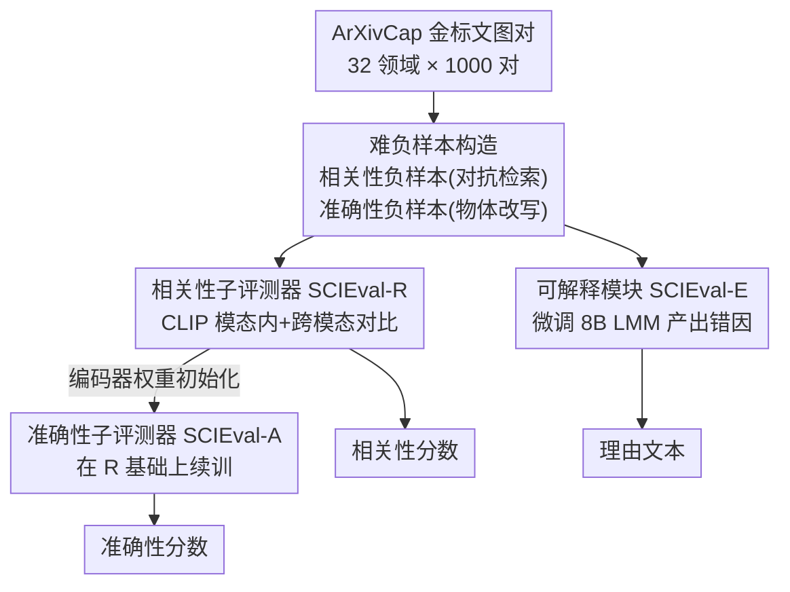

# SCIEval: Evaluating and Benchmarking the Faithfulness of Scientific Image Generation and Interpretation with Large Multimodal Models

**会议**: CVPR 2026  
**论文**: [CVF Open Access](https://openaccess.thecvf.com/content/CVPR2026/html/Ye_SCIEval_Evaluating_and_Benchmarking_the_Faithfulness_of_Scientific_Image_Generation_CVPR_2026_paper.html)  
**代码**: 项目页 https://SCIEval.github.io  
**领域**: 扩散模型 / 图像生成评测  
**关键词**: 科学图像、忠实度评测、CLIP 对比学习、可解释评测、benchmark

## 一句话总结
针对"科学图像"（折线图、二叉树、分子式等带精确数值/属性的图）专门设计的忠实度评测器 SCIEval，把忠实度拆成相关性、准确性、可解释性三个维度，用 CLIP 对比学习训练两个打分子模块 + 微调一个轻量 LMM 产出错因说明，并配套 6,000 样本的人工标注 benchmark SCIEval-Bench，在和 GPT-4o 等 24 个对手的对比中与人类判断的相关性显著最高。

## 研究背景与动机

**领域现状**：科学交流高度依赖图像，催生了两类反向任务——科学文生图（Sci-T2I，给定文本生成科学图）和科学图像描述（Sci-IC，给定科学图生成描述文本）。要衡量这两类生成结果好不好，公认的核心标准是"忠实度"（faithfulness）：生成的图/文有没有精确还原文本/图中的科学细节。

**现有痛点**：现有忠实度评测手段都不称手。①现成指标（TIFA 靠视觉问答评 T2I、VALOR-Eval 靠物体幻觉检测评 IC）都是为**自然图像**设计的，只能处理单一任务，且只吐一个合并分数、不给解释；②请科学家人工打分最准但贵到离谱——ScImage 让 11 位科学家评 3,000 张图就花了约 3,000 美元，无法规模化；③直接拿通用 LMM（如 Qwen-VL、ALIGNScore、CLIPScore）当裁判，和人类判断相关性很弱（ScImage 上 Kendall 系数低于 0.3）；④目前最强的自动裁判 GPT 系列（GPT-4o）受困于高昂 API 费用和黑盒不透明。

**核心矛盾**：科学图像的忠实度要求"4 条蓝线""二叉树共 7 个节点"这种**精确的数值与属性**对齐，而不是"大致画出了线/树"。为自然图像设计的指标只看"实体出现了没有"，根本无法分辨这种细粒度的对错。

**本文目标**：做一个对 Sci-T2I 与 Sci-IC 统一适用、自动、无参考（reference-free）、细粒度、轻量且能给出错因解释的忠实度评测器，并补上一个专门的人工标注 benchmark。

**切入角度**：作者把"忠实度"显式拆成三个互补维度——相关性（Relevance，整体文图对应）、准确性（Accuracy，科学物体的技术细节）、可解释性（Explainability，指出哪里不忠实）。前两个是可量化的分数，第三个是自由文本的理由。

**核心 idea**：用 CLIP 当底座，通过精心构造的"难负样本 + 模态内/跨模态对比学习"把科学图像的细粒度感知能力注入编码器（得到 SCIEval-R、SCIEval-A 两个打分器），再用监督理由信号微调一个 8B 轻量 LMM 产出错因说明（SCIEval-E），三者拼成一个低成本却比 GPT-4o 更贴近人类的评测器。

## 方法详解

### 整体框架
SCIEval 的目标是：输入一对科学文-图（T2I 任务是 ⟨文本 T, 图 I⟩，IC 任务是 ⟨图 I, 描述 C⟩），输出相关性分数、准确性分数和一段说明不忠实之处的理由文本。整个系统靠"任务对齐的三阶段训练框架"撑起来：先从 ArXivCap 构造带难负样本的训练数据，再用 CLIP 对比学习依次训出相关性子评测器 SCIEval-R 和准确性子评测器 SCIEval-A，最后用监督理由信号微调一个轻量 LMM 得到可解释模块 SCIEval-E。训练完只需保留两个 CLIP 编码器和这个 LMM，推理时直接出分/出理由。

### 关键设计

**1. 忠实度的三维度分解：把"像不像"拆成可分别优化的相关/准确/解释**

作者反对前人那种"一个合并分数走天下"的做法，因为科学图像的失败模式很不同：有的是整体画错了对象（相关性问题），有的是对象大致对但数值/属性错了（准确性问题，如"二叉树 7 节点"画成 5 节点）。于是把忠实度显式拆成三维：相关性 R 衡量文图整体对应、准确性 A 检查科学物体的细粒度技术细节、可解释性 E 指出具体哪个元素不忠实。R 与 A 的分数被约束在 $[0,1]$ 区间，E 则是无约束的自由文本。这样不同失败模式被路由到不同子模块，既提高了判别精度，也让分数自带"为什么扣分"的说明。

**2. 难负样本构造：用对抗检索造相关性负样本、用物体改写造准确性负样本**

光有金标正样本 ⟨I_T, C_T⟩ 训不出细粒度判别力，关键在负样本要"够难"。作者分两路造硬负样本。相关性负样本：借鉴 SciFIBench 的对抗过滤，用 CLIP 把每条 caption 编码成向量 $x_C \in \mathbb{R}^d$ 存进 Faiss 向量库，对目标 caption 做欧氏距离最近邻检索，取最相似的 caption $C_R$ 及其原配图 $I_R$，于是得到两个相关性硬负对 ⟨I_T, C_R⟩ 和 ⟨I_R, C_T⟩——它们语义高度相近却不匹配，逼模型学会细分。准确性负样本：对真 caption $C_T$ 做有针对性的文本编辑（改物体数量、属性、空间关系等细粒度细节）得到 $C_A$，再用轻量 LMM（SEED-X）当图像编辑器、以 $I_T$ 为底、$C_A$ 为指令生成被改动的图 $I_A$，得到两个准确性硬负对 ⟨I_T, C_A⟩ 和 ⟨I_A, C_T⟩。最后把 $C_T$ 与 $C_A$ 之间的改动 $\mathrm{diff}(C_T, C_A)$ 抽出来，作为后续训练 SCIEval-E 的理由监督信号。

**3. 模态内 + 跨模态对比学习：把科学细粒度感知注入 CLIP 编码器**

SCIEval-R 与 SCIEval-A 都用同一套 CLIP 对比策略训练（A 在 R 的编码器权重上续训，以保留已学到的科学知识）。模态内对比损失 $L_{IM}$ 把同模态内对比样本在特征空间推远：视觉侧 $L_{IMv} = \max\{0, s(Z_{I_T}, Z_{I_F}) - \epsilon_v\}$，其中 $s$ 是余弦相似度、$\epsilon_v$（如 0.2）是间隔阈值——相似度低于阈值就不再惩罚；文本侧 $L_{IMt}$ 同理。跨模态对比损失 $L_{CM}$ 则拉近匹配文图对、推远错配对，正损 $L^P_{CM} = \exp(s(Z_{I_T}, Z_{C_T})/\tau) + \exp(s(Z_{I_F}, Z_{C_F})/\tau)$，负损 $L^N_{CM}$ 用错配对 ⟨I_F, C_T⟩、⟨I_T, C_F⟩ 构造，再借鉴 InfoNCE 写成 $L_{CM} = -\log \frac{L^P_{CM}}{L^P_{CM} + L^N_{CM}}$。总目标 $L = L_{CM} + \frac{1}{2}(L_{IMt} + L_{IMv})$。选 CLIP 当底座正是图省钱：整个训练+推理只用 4 张 RTX 3090 跑 3 小时。

**4. SCIEval-E 监督理由微调 + SCIEval-Bench 人工 benchmark**

可解释模块 SCIEval-E 用三元组 $(I_T, C_A, \mathrm{diff}(C_T, C_A))$ 微调 mPLUG-owl3（8B），让它学会按"该有的科学细节应为 [真值] 而非 [假值]"这种结构化模板指出错因；推理时直接生成理由。为了验证整套指标，作者另建 SCIEval-Bench：从 SciCap 抽 600 对高质量金标文图（涵盖 CS、生物、经济、物理等，非 CS 统称 General），对 T2I 用 Llama-python/Llama-tikz/Stable Diffusion/DALL-E 四个模型各生成一张图（含原图共 3,000 样本），对 IC 用 LLaVA-1.6/IDEFICS-2/Qwen-VL/DeepSeek-VL 四个模型各生成一条 caption（含原 caption 共 3,000 样本）；每个样本由 3 名 CS 博士在 1–5 分制上独立标注相关性与准确性，取均值为 ground-truth，标注者间一致性较强（相关性/准确性 Spearman 0.78/0.74、Kappa 0.83/0.79），总成本约 1,200 美元——远低于 ScImage 的约 3,000 美元。

### 损失函数 / 训练策略
- CLIP 子模块总损失 $L = L_{CM} + \frac{1}{2}(L_{IMt} + L_{IMv})$，跨模态损失用 InfoNCE 形式，模态内损失用带间隔的 hinge。
- 训练顺序：先训 SCIEval-R，用其编码器权重初始化 SCIEval-A 后续训（迁移科学知识），最后独立 SFT 微调 SCIEval-E。
- 训练数据取自 ArXivCap 的 32 个科学领域、每领域 1,000 对共 32,000 对；评测在自建 SCIEval-Bench 上。

## 实验关键数据

### 主实验
忠实度评测的可靠性以"自动分数与人类判断的 Spearman / Pearson 相关系数（%）"衡量，越高越接近人类。下表摘录 Sci-T2I 与 Sci-IC 在 CS 子集上的相关性/准确性维度（数值为 Spearman/Pearson）：

| 方法 | T2I·CS 相关性 | T2I·CS 准确性 | IC·CS 相关性 | IC·CS 准确性 |
|------|------|------|------|------|
| GPT-4o（前 SOTA 自动裁判） | 71.3 / 70.5 | 66.7 / 66.0 | 72.8 / 72.4 | 67.2 / 67.3 |
| Gemini 1.5 Pro | 70.9 / 70.2 | 66.5 / 66.1 | 71.4 / 70.9 | 66.8 / 66.3 |
| TIFA（T2I 专用指标） | 45.2 / 44.3 | 42.6 / 42.1 | — | — |
| CLIPScore | 42.6 / 42.5 | 40.4 / 39.6 | 45.5 / 44.7 | 38.2 / 37.8 |
| **SCIEval（本文）** | **74.1 / 73.2** | **69.4 / 68.2** | **75.9 / 75.6** | **69.9 / 69.1** |

SCIEval 在全部 4 个 CS 列上都超过包括 GPT-4o 在内的 24 个对手；General 子集结论一致（如 T2I·General 相关性 68.5/68.2，仍领先 GPT-4o 的 64.9/65.1）。

理由质量评测（5 分制，Human-as-Judge / LMM-as-Judge）：

| 模型 | 人评·正确性 | 人评·完整性 | LMM 评·正确性 | LMM 评·完整性 |
|------|------|------|------|------|
| InstructBLIP | 3.6 | 2.8 | 3.3 | 2.7 |
| Gemini 1.5 Pro | 4.4 | 3.3 | 4.2 | 3.8 |
| GPT-4V | 4.5 | 3.5 | 4.4 | 3.9 |
| **SCIEval（本文）** | **4.7** | **4.2** | **4.4** | **4.3** |

SCIEval 产出的错因说明在完整性上明显优于 GPT-4V（人评 4.2 vs 3.5），说明三维度分解和专门的理由监督确实让解释更到位。

### 消融实验
论文未给传统"逐模块去掉"的消融表，而是用 24 个对手的横向对比 + 不同模型规模/类别的分组分析来定位增益来源：

| 对比维度 | 关键指标 | 说明 |
|------|------|------|
| 闭源 vs 开源 LMM | T2I·CS 相关性差 ~30.1% | 最好闭源 LMM 大幅超过最好开源 LMM，最强开源（InstructBLIP-Vicuna-13b）甚至输给最弱闭源（Claude 3 Haiku） |
| 任务专用指标 vs 通用 LMM | TIFA 45.2 > 开源 LMM | TIFA/VALOR-Eval 这类任务专用指标优于裸 LMM，印证"为任务定制"有价值 |
| 模型规模 | 大≠更好 | InstructBLIP 多个尺寸下，更大模型未必带来显著提升，>10B 参数对评测未必必要 |

### 关键发现
- SCIEval 用 4 张 RTX 3090 训+推共 3 小时即超过 GPT-4o，说明把忠实度感知"蒸"进 CLIP 编码器是高性价比路线，无需大模型推理。
- 闭源与开源 LMM 之间存在巨大鸿沟（最弱闭源都赢最强开源），但任务专用指标能部分弥合这一差距。
- Sci-T2I 对 LMM 评测器**不一定**比 Sci-IC 更难——虽然图像生成本身更难，但作为评测者，多数 LMM 在两类任务上表现接近，颠覆了"生成更难、评起来也更难"的直觉。

## 亮点与洞察
- **难负样本的两路造法很可复用**：相关性靠 CLIP+Faiss 对抗检索取语义近邻、准确性靠 LMM 对图做"小幅定向改写"，把"哪里不忠实"显式写进 $\mathrm{diff}$，这套构造同样能迁到任何需要细粒度判别的对齐评测任务。
- **"分数自带理由"的设计**：把可解释性当成独立维度而非事后解释，让评测器不仅说"扣分"还说"扣在 [真值] 应为 X 而非 Y"，对调试生成模型直接有用。
- **省钱是核心卖点**：3 小时 / 4×3090 / ~1,200 美元标注，对比 GPT-4o 的 API 成本和 ScImage 的 3,000 美元人评，证明"小而专"在评测场景能打过"大而通"。

## 局限与展望
- benchmark 仅 600 个金标对扩增而来、标注者只有 3 名 CS 博士，General 领域是"非 CS 一锅烩"，对生物/物理等具体学科的细分忠实度覆盖可能不足。
- SCIEval-R/A 基于 CLIP，受限于 CLIP 对极端细粒度科学符号（如公式、复杂图表轴标）的感知上限；论文未充分讨论在这类极难样本上的失败模式。
- 准确性负样本依赖 SEED-X 这类 LMM 编辑器生成被改图，编辑质量会引入噪声；理由监督模板较结构化，面对开放式科学错误时泛化性待验证。⚠️ 部分细节（如各 $\epsilon$、$\tau$ 取值）以原文为准。

## 相关工作与启发
- **vs TIFA / VALOR-Eval**: 它们各自只覆盖 T2I 或 IC、为自然图像设计、只出合并分数无解释；SCIEval 用统一框架同时覆盖两任务、专攻科学图像、且分数细粒度并附理由。
- **vs GPT-4o 等通用 LMM 裁判**: 通用 LMM 靠强多模态能力但贵且黑盒、与人类相关性受限；SCIEval 把感知能力蒸进轻量 CLIP+8B LMM，成本极低却相关性更高。
- **vs CLIPScore / BLIP2Score**: 它们只算一次性的联合文图对齐相似度，对科学细节迟钝；SCIEval 通过难负样本对比把科学细粒度判别力专门训进编码器。

## 评分
- 新颖性: ⭐⭐⭐⭐ 首个面向科学图像、统一覆盖 T2I/IC 且自带可解释理由的忠实度指标，三维度分解+难负样本造法有新意。
- 实验充分度: ⭐⭐⭐⭐ 对比 24 个方法、双任务双领域、理由质量人评+LMM 评，但缺逐模块消融。
- 写作质量: ⭐⭐⭐⭐ 动机与三维度拆解清晰，图示（数据构造/训练流程）到位。
- 价值: ⭐⭐⭐⭐ 低成本、可解释的科学图像评测器 + 6,000 样本 benchmark，对科学生成/描述研究是实用基础设施。

<!-- RELATED:START -->

## 相关论文

- [\[CVPR 2026\] MICON-Bench: Benchmarking and Enhancing Multi-Image Context Image Generation in Unified Multimodal Models](micon-bench_benchmarking_and_enhancing_multi-image_context_image_generation_in_u.md)
- [\[ACL 2026\] Multimodal Large Language Models for Multi-Subject In-Context Image Generation](../../ACL2026/image_generation/multimodal_large_language_models_for_multi-subject_in-context_image_generation.md)
- [\[CVPR 2026\] Evaluating Reasoning Fidelity in Visual Text Generation](evaluating_reasoning_fidelity_in_visual_text_generation.md)
- [\[CVPR 2026\] Omni IIE Bench: Benchmarking the Practical Capabilities of Image Editing Models](omni_iie_bench_benchmarking_the_practical_capabilities_of_image_editing_models.md)
- [\[CVPR 2026\] Evaluating Generative Models via One-Dimensional Code Distributions](evaluating_generative_models_via_one-dimensional_code_distributions.md)

<!-- RELATED:END -->
