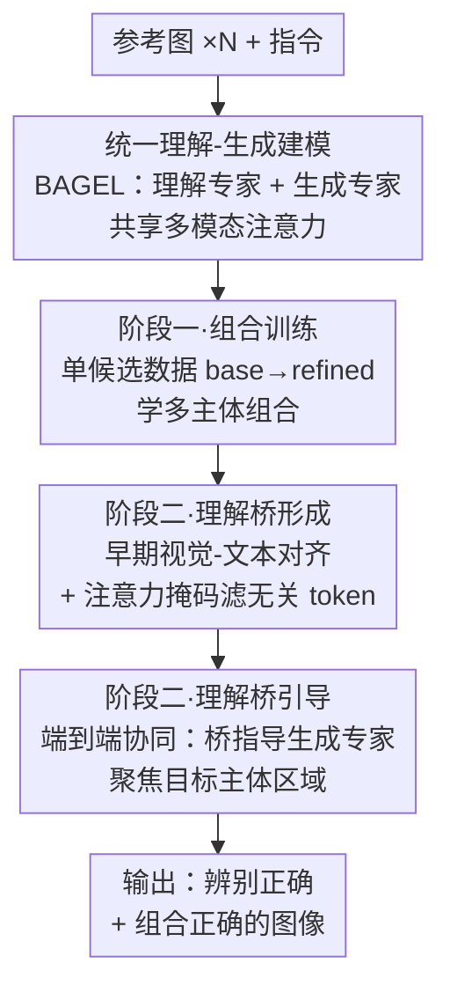

# Scone: Bridging Composition and Distinction in Subject-Driven Image Generation via Unified Understanding-Generation Modeling

**会议**: CVPR 2026  
**arXiv**: [2512.12675](https://arxiv.org/abs/2512.12675)  
**代码**: https://github.com/Ryann-Ran/Scone (有)  
**领域**: 扩散模型 / 主体驱动图像生成  
**关键词**: 主体驱动生成, 统一理解-生成模型, 语义桥, 注意力掩码, 主体辨别

## 一句话总结
Scone 在统一理解-生成模型 BAGEL 上，把"理解专家"改造成一座**语义桥**——通过早期多模态对齐和注意力掩码筛除参考图中的无关主体，再端到端引导"生成专家"，从而在一张参考图含多个候选主体时也能准确"认对人再画对人"，在 OmniContext 上拿到开源模型第一。

## 研究背景与动机
**领域现状**：主体驱动图像生成（subject-driven generation）这两年从单主体走向多主体组合（composition），主流做法是给扩散模型/DiT 喂入若干张参考图，按指令把多个主体拼到同一张输出图里，比赛点是"能塞进几张参考图、能组合几个主体"。

**现有痛点**：这些方法默认参考图是"干净的"——每张图只有一个显眼主体。但现实图片往往充满干扰：一张参考图里可能同时出现好几个候选主体，而指令只要其中一个。此时现有模型暴露出一个被忽视的能力缺口——**辨别（distinction）**：它们分不清该画谁，要么漏画（候选主体一个都没出现），要么画错（认错目标主体）。作者把这个能力短板命名为 distinction 问题。

**核心矛盾**：辨别本质上是个**语义理解**任务（要读懂指令"绿头发的那个男人"指向参考图里的哪一块），而纯生成模型的强项在像素重建、弱项恰恰是语义对齐。论文用相似度可视化（Fig.1b/2a）证明：在统一模型里，理解专家编码的参考图信息与指令的语义相似度明显高于生成专家，且理解专家在更浅的层就开始关注"指令相关区域"。但单纯依赖理解专家也不行——理解模型自身带偏置（bias），直接拿去指挥生成，会出现"语义对了但生成没对齐"的错位（Fig.1c）。

**本文目标**：(1) 在保持多主体组合能力的同时，新增"在多候选参考图中辨别并只生成目标主体"的能力；(2) 不引入外部理解模块、不加额外参数、不依赖测试时技巧。

**切入角度**：用**统一理解-生成模型**（一个模型里同时含理解专家和生成专家，共享多模态注意力）。它天然具备两个优势：理解专家比生成专家更早捕获语义线索（可用来定位候选主体）；统一架构支持端到端协同，让生成的反馈反过来修正理解专家的偏置。

**核心 idea**：把理解专家当成一座"语义桥"——先让它通过多模态对齐+注意力掩码学会"看懂指令、滤掉无关主体"，再让它把这份干净的语义引导传给生成专家，全程端到端共同优化。

## 方法详解

### 整体框架
Scone 以 BAGEL（一个 Mixture-of-Transformer-Experts 架构，理解专家处理 ViT 图像 token + 指令 token，生成专家处理 VAE 图像 token，两者共享多模态注意力）为底座，**不加任何额外参数**，沿用原始 MSE 损失。整条流水线是**两阶段训练**：阶段一在"单候选"数据（每张参考图只有一个主体）上学会基础的多主体组合；阶段二引入"多候选"数据，通过**理解桥策略（understanding bridge strategy）**注入辨别能力。理解桥策略本身又拆成两步——先**形成**语义桥（让理解专家学会对齐语义并掩掉无关 token），再用这座桥**引导**生成专家。输入是若干张参考图 + 一条指令，输出是只含目标主体、且组合正确的图像。

### 关键设计

**1. 统一建模 + 理解专家充当语义桥：让"懂"的人去指挥"画"的人**

论文的根基洞察是：辨别难在语义，而生成专家语义弱、理解专家语义强（Fig.2a 显示理解专家的图像 token 与文本 token 在浅层就有更高相似度，能关注到候选主体所在区域）。Scone 没有像以往工作那样外挂一个独立的理解模块（那会带来额外延迟、破坏端到端优化），而是直接复用 BAGEL 内部已有的理解专家，把它定位成"语义桥"：理解专家负责读懂"指令指向哪个主体、参考图哪些区域相关"，然后把这份高层语义传给生成专家。因为两个专家在同一个统一架构里共享注意力，这种引导是端到端可学的——生成的反馈能反过来修正理解专家的偏置，避免"理解单方面跑偏"。这也是统一模型相对纯生成模型的结构性优势。

**2. 阶段一·组合训练：先把"多主体拼图"这件基本功练扎实**

在注入辨别能力之前，模型得先会基础的组合。这一阶段在**单候选数据**（每张参考图只含一个主体，因此没有辨别歧义）上微调理解专家、生成专家及各自的 MLP connector，ViT 和 VAE 冻结。训练分两步走质量梯度：先用 70K 条 base 单候选数据训一个 epoch，让模型同时具备单主体和多主体生成能力；再用经 Qwen3-VL 按"主体一致性 + 指令遵循"打分筛出的 22K 条 refined 数据训第二个 epoch，进一步拉高主体一致性。消融（Tab.4）显示这一步把 BAGEL 的 Overall 从 6.03 抬到 8.02。

**3. 理解桥形成：用早期对齐 + 注意力掩码，把无关主体"挡在门外"**

这是 distinction 能力的核心。阶段二引入多候选数据后，第一步让理解专家学会做语义桥。设理解专家浅层的视觉隐状态为 $\mathbf{h}^v=\{\mathbf{h}^v_i\}_{i=1}^{N_v}$、文本隐状态为 $\mathbf{h}^t=\{\mathbf{h}^t_j\}_{j=1}^{N_t}$，先 L2 归一化后算余弦相似度矩阵 $S_{i,j}=\hat{\mathbf{h}}^v_i\cdot\hat{\mathbf{h}}^t_j$，再把每个视觉 token 对所有文本 token 的相似度求平均，得到它的**语义相关度** $s_i=\frac{1}{N_t}\sum_{j=1}^{N_t}S_{i,j}$。然后用阈值 $\tau$ 构造一个二值**语义掩码** $\mathbf{M}$，作用在生成专家里"目标 token → 参考图 token"的注意力 logits 上：

$$\tilde{A}_{k,i}=A_{k,i}+M_i,\quad M_i=\begin{cases}0,& s_i>\tau,\\ -\infty,& \text{otherwise}.\end{cases}$$

相关度低于阈值的参考图 token 被加上 $-\infty$，softmax 后注意力归零，等于让目标 token"看不见"这些无关区域。关键在于它**不是直接丢弃 token**，而是只在注意力层面屏蔽，从而既保留信息流的完整性、又能精准抑制干扰主体。阈值 $\tau$ 越接近 1，被挡掉的无关 token 越多（Tab.6 中 $\tau$ 从 0.82→0.88，Overall 8.46→8.50 稳步上升）。这一步训练 1k 步。

**4. 理解桥引导：端到端协同，让生成专家"对齐"这座桥**

桥搭好后，第二步把理解专家和生成专家**一起**再训 1k 步，让生成的表示对齐理解专家给出的语义线索、聚焦到桥所标定的关键区域。这一步的意义是闭环修正前面提到的"理解偏置"——光有干净语义还不够，还要保证生成专家真的按这份语义去画，否则会出现"语义对了、生成没对齐"的错位（Fig.1c）。端到端的协同让理解专家在生成反馈中持续精修语义、生成专家在复杂组合场景下稳定保住主体细节。消融（Tab.5）显示：直接联合微调（Direct）Overall 7.94，改成两步且不带桥升到 8.43，带桥再升到 8.50，验证了"先形成桥再引导"这套拆解的价值。

**5. SconeEval 基准：第一个同时考组合与辨别的评测集**

现有基准（DreamBench++、OmniContext 等）只在"干净单主体"上考组合，且靠 DINOv2/CLIP 的平均相似度打分——在多主体且发生漏画/冗余时，平均相似度根本测不准。作者构建 SconeEval：409 个测试样例，覆盖角色/物体/场景三域、19 种 case 类型、6 个子任务，按难度递增分三类任务——composition（每图单主体）、distinction（每图多主体须挑出目标）、distinction & composition（多图各含多主体）。构造管线分三步：用 Qwen3-VL 过滤/识别单候选图建池子 → 用 Qwen-Image-Edit 往单候选图里"加塞"其他主体造多候选图 → 用"先识别主体名再生成指令"的两步解耦策略写指令（指令显式给出目标索引或区分性特征，如"Image 1""左边的绿头发男人"）。评测用 GPT-4.1：组合维度按 0–10 给 prompt following + 目标主体一致性打分；辨别维度判断"被指代主体是否出现"，算出 accuracy/precision/recall/F1，**distinction score 定义为 accuracy 与 F1 的均值**（再从 [0,1] 线性放缩到 [0,10] 以对齐组合分），overall 为组合分与辨别分的平均。

### 损失函数 / 训练策略
全程沿用 BAGEL 原始的 MSE 生成损失，**不新增任何参数或额外损失项**。两阶段共四步：阶段一 step1（70K base，1 epoch）→ step2（22K refined，1 epoch）；阶段二 step1 理解桥形成（1k steps）→ step2 理解桥引导（1k steps），阶段二共 2k steps。训练数据汇集 X2I、MUSAR-Gen、UNO-1M、Echo-4o-Image 等开源数据并自合成 15K 条 3–4 输入图样本；多候选样本（20K）由 Qwen-Image-Edit 往单候选图加塞 cross/intra-category 主体构造，原图作为目标。推理在 1024×1024 下采样，跑 3 轮、每轮打分 3 次取 9 组均值以降随机性。

## 实验关键数据

### 主实验
两个基准上 Scone 均为开源/统一模型中的最佳；闭源 GPT-4o / Gemini-2.5-Flash-Image 仍领先。

| 基准 | 指标 | Scone | 基座 BAGEL | 开源前最佳 | 闭源最佳(GPT-4o) |
|------|------|-------|-----------|-----------|------------------|
| OmniContext | Average | **8.01** | 6.03 | Echo-4o 7.95 | 8.78 |
| SconeEval | Overall | **8.50** | 6.97 | Echo-4o 8.09 | 8.94 |
| SconeEval | Composition (avg) | **8.21** | 6.74 | Echo-4o 8.05 | 8.98 |
| SconeEval | Distinction (avg) | **8.79** | 7.20 | Echo-4o 8.14 | 8.90 |

- 在 OmniContext 上 Scone 以 8.01 拿下开源模型第一（base BAGEL 仅 6.03，提升 +1.98），逼近闭源 Gemini-2.5-Flash-Image 的 8.07。
- 在自家 SconeEval 上，Scone 的辨别分 8.79 显著拉开开源对手，验证理解桥确实提升了"认对主体"的能力。
- 一个有意思的横向现象：组合分较低的统一模型 OmniGen2 在辨别上仍胜过组合分更高的纯生成模型 Qwen-Image-Edit-2509，佐证了"理解能力对辨别的增益"这一核心论点。

### 消融实验
| 阶段/配置 | COM ↑ | DIS ↑ | Overall ↑ | 说明 |
|-----------|-------|-------|-----------|------|
| BAGEL 基座 | 6.74 | 7.20 | 6.97 | 起点 |
| Stage I | 7.94 | 7.78 | 7.86 | 组合训练后整体抬升 |
| Stage II (a) Direct | 7.64 | 8.23 | 7.94 | 两专家直接联合微调 |
| Stage II (b) Two-step, w/o bridge | 8.15 | 8.70 | 8.43 | 先训理解再联合，但不用桥 |
| Stage II (c) Two-step, w/ bridge | **8.21** | **8.79** | **8.50** | 完整理解桥（本文） |

阶段一内部消融（Tab.4，OmniContext）：70K base 数据把 Overall 从 6.03 抬到 7.95，22K refined 数据再到 8.02——说明**数据质量的边际增益**实打实存在。

### 关键发现
- **理解桥是辨别能力的主要来源**：从 Direct(7.94) → Two-step w/o bridge(8.43) → w/ bridge(8.50)，"先形成桥再引导"的两步拆解贡献最大（+0.49），桥本身再补 +0.07，且主要体现在 DIS 维度。
- **阈值 $\tau$ 越严越好（在测试范围内）**：$\tau=0.82/0.85/0.88$ 对应 Overall 8.46/8.47/8.50，挡掉越多无关 token 表现越稳，说明语义引导鲁棒、没有过度屏蔽掉有用信息。
- **稳定性最佳**：Fig.8 中 Scone 在 SconeEval 上得分标准差最低，复杂上下文里输出最稳。
- **用户研究印证**：30 名评测者三方对比，归一化得分 OmniGen2 0.27 / UniWorld-V2 0.27 / Scone 0.46；带桥版（0.42）也优于不带桥版（0.31）和 Echo-4o（0.27）。

## 亮点与洞察
- **"理解专家当语义桥"是一个轻量却到位的复用**：不外挂模块、不加参数，直接利用统一模型里现成的理解专家做语义筛选，避免了外部理解模块带来的延迟和端到端断裂——这是相对一众"外接 VLM"方案的结构性优势。
- **注意力掩码"屏蔽而非丢弃"很巧**：把无关 token 的注意力 logits 加 $-\infty$ 而不删 token，既精准抑制干扰、又不破坏序列与信息流，是个可迁移到任何"需要软性筛选条件区域"任务的 trick。
- **把"辨别"单拎出来定义并造基准**，是这篇真正的"啊哈"点：整个领域都在卷"能组合几个主体"，作者指出大家其实连"在多候选里挑对主体"都没解决，并用 distinction score（accuracy 与 F1 的均值）把这个能力量化出来。
- **思路可迁移**：理解桥这套"理解专家筛语义 → 注意力掩码注入 → 端到端协同"的范式，可推广到任何统一理解-生成模型需要按指令做细粒度条件选择的场景（如指代分割引导生成、复杂版面控制）。

## 局限性 / 可改进方向
- **仍明显落后闭源模型**：SconeEval overall 8.50 vs GPT-4o 8.94、Gemini 8.70；OmniContext 8.01 vs GPT-4o 8.78，主体驱动生成的天花板还在闭源大模型手里。
- **依赖 GPT-4.1 做评测主裁**：组合与辨别分都靠 GPT-4.1 打，虽有 30 人用户研究背书，但 LLM-as-judge 的系统性偏差仍可能影响绝对数值的可信度。
- **辨别能力的边界**：基准里 intra-category（同类多候选，如两个都是女人）本就最难，论文虽覆盖但未深入分析在极端相似主体、或候选数 >2 时的退化曲线。
- **改进思路**：阈值 $\tau$ 目前是全局固定的；可探索随 token/层自适应的软掩码，或把辨别信号显式回灌到训练损失而不仅靠注意力屏蔽。

## 相关工作与启发
- **vs 纯生成模型（UNO / USO / Qwen-Image-Edit-2509）**：它们假设参考图干净、靠扩散/DiT 直接组合，在多候选复杂上下文里缺乏抑制干扰的机制，辨别分明显偏低；Scone 借统一模型的理解专家做语义筛选，辨别分领先。
- **vs SSR-Encoder 类"特征隔离"方法**：SSR-Encoder 试图隔离主体特征，但只能处理单参考图的简单提示，理解能力受限；Scone 的语义桥直接建立在指令-参考图的跨模态对齐上，能应对复杂指令与噪声输入。
- **vs 其他统一理解-生成模型（OmniGen2 / Echo-4o / BAGEL）**：同为统一架构，但它们在参考图含大量无关内容时缺乏防干扰机制；Scone 的贡献正是补上这块——用理解语义主动辨别目标条件并引导更干净的生成，把基座 BAGEL 的 overall 从 6.97 拉到 8.50。

## 评分
- 新颖性: ⭐⭐⭐⭐ 把被忽视的"distinction"问题单独提出并定义、用理解专家做语义桥的复用思路清晰且不加参数，benchmark 也是实打实的新贡献。
- 实验充分度: ⭐⭐⭐⭐ 两基准 + 完整阶段消融 + 阈值参数研究 + 两组用户研究，链条完整；略欠对 intra-category 极端难例的深入分析。
- 写作质量: ⭐⭐⭐⭐ 动机用相似度可视化层层递进、方法两步拆解清楚；图表编号偶有内部引用混乱。
- 价值: ⭐⭐⭐⭐ 开源放出模型/基准/数据，且指出并量化了主体驱动生成里一个被普遍忽视的真实痛点，对后续工作有实际牵引力。

<!-- RELATED:START -->

## 相关论文

- [\[CVPR 2026\] FlowFixer: Towards Detail-Preserving Subject-Driven Generation](flowfixer_towards_detail-preserving_subject-driven_generation.md)
- [\[CVPR 2026\] Proxy-Tuning: Tailoring Multimodal Autoregressive Models for Subject-Driven Image Generation](proxy-tuning_tailoring_multimodal_autoregressive_models_for_subject-driven_image.md)
- [\[CVPR 2026\] Enhancing Spatial Understanding in Image Generation via Reward Modeling](enhancing_spatial_understanding_in_image_generation_via_reward_modeling.md)
- [\[CVPR 2026\] Learning to Generate via Understanding: Understanding-Driven Intrinsic Rewarding for Unified Multimodal Models](learning_to_generate_via_understanding_understanding-driven_intrinsic_rewarding_.md)
- [\[CVPR 2026\] Unified Customized Generation by Disentangled Reward Modeling](unified_customized_generation_by_disentangled_reward_modeling.md)

<!-- RELATED:END -->
