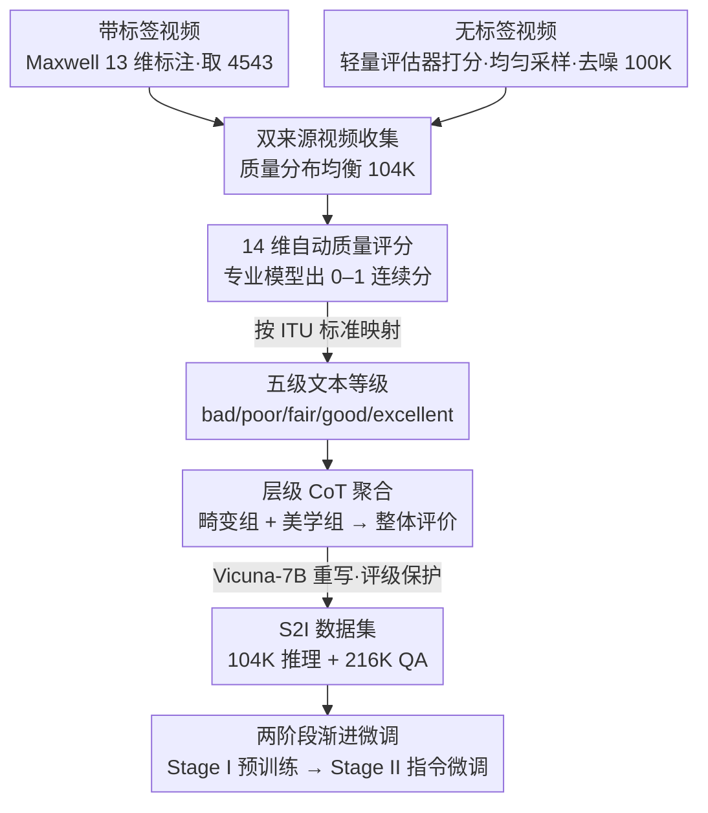

# Score2Instruct: Scaling Up Video Quality-Centric Instructions via Automated Dimension Scoring

**会议**: CVPR 2026  
**arXiv**: [2506.21011](https://arxiv.org/abs/2506.21011)  
**代码**: [https://github.com/KeiChiTse/S2I](https://github.com/KeiChiTse/S2I)  
**领域**: 图像生成  
**关键词**: 视频质量评估、指令微调、自动化评分、质量推理、大规模语言模型

## 一句话总结
Score2Instruct 提出了一个无需人工标注和闭源 API 的自动化视频质量指令生成管线 SIG，通过自动评估 14 个质量维度并用层级 CoT 聚合为完整质量推理文本，构建了 320K+ 条指令数据集 S2I，配合两阶段渐进式微调策略，使多个视频 LMM 同时获得质量评分和质量推理能力，在 5 个 VQA 数据集上 SRCC 平均提升 26-31%。

## 研究背景与动机

**领域现状**：传统视频质量评估（VQA）方法通过深度学习回归一个总体质量分数（MOS），但这种单一数值无法描述视频中复杂的多维质量问题（如噪声、运动模糊、闪烁等）。随着 LMM 的出现，通过自然语言输出质量解释（quality justification）成为可能。

**现有痛点**：(1) 现有质量指令数据生成严重依赖人工主观评估——如 Q-Instruct 需要 39 位专家为 18,973 张图写 58K 条描述，耗时且成本高；(2) 数据生成依赖闭源 API（如 GPT-4），限制了可扩展性和可复现性；(3) 大多数工作聚焦于图像质量评估（IQA），缺少对视频特有的时序因素（如闪烁、运动模糊）的深度理解；(4) 现有方法无法让模型同时具备精确评分和质量推理两种能力。

**核心矛盾**：高质量的视频质量指令数据既需要丰富的维度覆盖（不只是整体分数），又需要可扩展的生成方式（不依赖人工或闭源系统）。这两者在过去是矛盾的——维度越丰富越需要专家标注。

**本文目标** (1) 设计完全自动化的视频质量指令生成管线；(2) 覆盖 14 个质量维度并用认知推理聚合；(3) 同时提升模型的评分精度和推理解释能力。

**切入角度**：利用已有的专业视频质量评估模型（来自实用视频处理平台）自动打质量维度分数，将连续分数映射为 ITU 标准 5 级文本等级，再用层级 CoT 模拟人类视觉系统（HVS）的推理过程生成完整质量描述。

**核心 idea**：用自动化质量维度评分替代人工标注，用层级 CoT 替代闭源 LLM 生成质量推理，实现大规模、低成本的视频质量指令数据构建。

## 方法详解

### 整体框架
SIG（Score-based Instruction Generation）管线分三步：(1) 视频源收集——从带标签的 VQA 数据集（Maxwell，4543 个视频）和无标签通用视频库（100K 个视频）中收集 104K 个质量分布均衡的视频；(2) 自动维度评分——用专业模型对每个视频评估 14 个质量维度并映射为文本等级；(3) 层级 CoT 聚合——模拟人类视觉系统的推理过程，将维度评级聚合为完整的质量推理文本，再用 LLM 扩展为多种 QA 对。最终产出 S2I 数据集（104K 推理 + 216K QA 对 = 320K 指令），再用两阶段渐进微调把这批指令灌进视频 LMM。

### 关键设计

**1. 双来源视频收集：用带标注数据补「质量知识」，用无标签数据补「规模」**

VQA 数据集天生稀缺——MOS 标注要靠人工打分，整体规模往往只有其他视觉任务数据集的 1/10 到 1/100，光靠它撑不起一个 320K 的指令库。但若直接抓无标签视频，质量分布又容易严重偏斜（大量平庸视频、缺少极好极差的两端）。这篇论文把两类来源拆开各取所长：带标签一侧不看数量看「标注维度数」，Maxwell 每个视频标了 13 个维度（KoNViD 等只标一个 MOS），信息密度最高，于是只从中取 4543 个；无标签一侧则先用一个轻量质量评估器给候选视频打分当作噪声标签，按这个分数做均匀采样把质量分布拉平，再剔除噪声标签明显不准的视频，最终留下 100K 个。两路合起来得到 104K 个质量分布均衡、又带足够标注信息的视频。

**2. 14 维自动质量评分：把「需要专家主观打分」换成「专业模型自动出连续分再映射成文本等级」**

要让模型理解视频质量，得先有覆盖全面、又不依赖人工的多维画像。论文沿视频生命周期的四个环节（拍摄、剪辑、压缩、传输）系统枚举出 14 个维度——镜头清晰度、噪声、闪烁、运动模糊、帧间平滑度等，是目前覆盖最全的一套。打分不靠众包，而是调用知名视频处理平台部署的专业模型，每个维度输出 $0\text{–}1$ 的连续分，规避了众包评分的主观偏差。难点在于连续分和语言 token 之间有鸿沟：模型无法直接「读」一个 0.73 的分数，于是按 ITU 标准把连续分离散成五级文本等级（bad / poor / fair / good / excellent），这套映射有人类主观实验背书，验证后映射精度 SRCC/PLCC 均 >0.95。还有一个细节是消歧——「flicker is good」这种表述容易让模型误解维度本身的好坏，所以把维度名统一替换成简短定义（如 flicker → "the variation smoothness between adjacent frames"），让评级语义无歧义。

**3. 层级 CoT 聚合：仿照人类视觉系统从局部到整体地推理，把零散的维度评级串成完整质量描述**

光把 14 个维度评级罗列出来还是一堆离散标签，缺的是人类评审那种「综合权衡」的认知过程——人不是独立看每个维度，而是先分别掂量畸变和美学，再合到一起下判断。论文照这个逻辑把 14 维按 HVS 偏好分成畸变相关（distortion-related）和美学相关（aesthetic-related）两组，CoT 自底向上跑三步：先评估每个维度的影响，再在组内得出该组的中间评级，最后综合两组中间评级给出整体质量评价。生成的推理骨架再交给开源 LLM（Vicuna-7B）做语言多样化重写，并融入 ShareCaptioner-Video 产出的高层内容描述来丰富语义——因为人对质量的感知离不开内容（一个模糊但内容丰富的视频和一个清晰但无聊的视频，评价机制本不相同）。重写这一步最大的风险是 LLM 顺手改掉原始评级，所以末尾的摘要环节用专门设计的提示约束它「只改措辞、不动评级」，这条约束在实验里被证明对评分精度至关重要。

### 损失函数 / 训练策略
两阶段渐进式微调：**Stage I 预训练**——冻结 LLM，仅训练视觉编码器和投影器，让模型学习简单的"维度名→评级"映射任务（100K 条），建立初步的质量感知能力。**Stage II 指令微调**——解冻 LLM（用 LoRA, r=16），在 220K 条推理和 QA 数据上训练，提升质量推理和评分能力。两阶段均用交叉熵损失，只监督 Assistant 回复部分。

## 实验关键数据

### 主实验（质量评分能力 - SRCC / PLCC）

| 模型 | S2I | Maxwell | LSVQtest | LSVQ1080p | KoNViD-1k | LIVE-VQC |
|------|-----|---------|----------|-----------|-----------|----------|
| LLaVA-OV-7B | 否 | 0.474/0.428 | 0.449/0.438 | 0.337/0.311 | 0.392/0.394 | 0.397/0.410 |
| LLaVA-OV-7B | **是** | **0.795/0.812** | **0.751/0.730** | **0.671/0.634** | **0.726/0.689** | **0.738/0.752** |
| LLaVA-Video-7B | 否 | 0.564/0.557 | 0.494/0.446 | 0.422/0.380 | 0.535/0.488 | 0.572/0.530 |
| LLaVA-Video-7B | **是** | **0.826/0.774** | **0.760/0.734** | **0.667/0.652** | **0.773/0.769** | **0.730/0.765** |

### 消融实验

| 消融配置 | CI↑ | CU↑ | DO↑ | TU↑ | Maxwell SRCC/PLCC | 说明 |
|---------|-----|-----|-----|-----|-------------------|------|
| Full (S2I) | 3.02 | 2.49 | 2.13 | 2.24 | 0.795/0.812 | 完整模型 |
| w/o labeled videos | 2.44 | 1.76 | 1.68 | 1.59 | 0.738/0.702 | 去掉 Maxwell 带标签数据影响推理能力 |
| w/o unlabeled videos | 2.57 | 2.08 | 2.10 | 2.14 | 0.506/0.553 | 去掉无标签数据影响评分能力 |
| w/o 层级 CoT | 2.96 | 2.41 | 2.08 | 2.16 | 0.786/0.810 | 推理能力下降 |
| w/o 高层caption | 2.54 | 2.35 | 1.98 | 2.09 | 0.750/0.723 | CU/DO/TU 明显下降 |
| w/o 评级保护 prompt | 3.02 | 2.49 | 2.13 | 2.24 | 0.604/0.658 | 评分能力大幅下降 |
| w/o Stage I 预训练 | 2.86 | 2.49 | 2.10 | 2.19 | 0.638/0.592 | 评分能力显著下降(-15.7% SRCC) |

### 关键发现
- **带标签数据主要贡献推理能力，无标签数据主要贡献评分能力**：这说明 Maxwell 的 13 维标注提供了"质量知识"，而大规模无标签数据通过自动评分提供了"量化校准"
- **Stage I 预训练对评分至关重要**：去掉后 Maxwell SRCC 从 0.795 降到 0.638，表明简单的维度评分任务帮助模型建立了基础的质量维度理解
- **"评级保护"prompt 是评分精度的关键**：不控制 LLM 重写时的评级一致性，SRCC 从 0.795 暴跌到 0.604，说明 LLM 在改写过程中容易无意修改评级信息
- **数据规模效应未饱和**：用 20%/50%/100% 数据训练，性能持续提升，暗示进一步扩展 SIG 管线可能带来更大收益

## 亮点与洞察
- **"自动评分→文本映射→CoT聚合"的数据生成范式**是本文最大贡献：它将"需要人类主观的质量评估"转化为"可自动化的工程流程"，打通了自动化标注的最后一公里。这个思路可以迁移到任何需要多维度主观评价的领域（如音频质量、字体美学）
- **两阶段渐进策略**证明了"先学维度、再学推理"的课程学习思路在质量评估中的有效性。Stage I 类似于"预热"——让模型先建立质量词汇表，再学复杂推理
- **质量与内容的交织**：融入高层 caption 后 CU/DO/TU 都提升，验证了人类质量感知不可能脱离内容理解——一个模糊但内容丰富的视频和一个清晰但无聊的视频，人类评价机制本质不同

## 局限与展望
- **14 维度评分模型的精度未充分验证**：虽然分数→文本映射精度很高（SRCC>0.95），但底层评分模型本身的误差对最终指令质量的影响未被量化
- **S2I-Bench 规模较小**（仅 400 个问题），且 ground truth 基于自动化管线生成（虽经人工审核），与真正的人工 ground truth 仍有差距
- **仅考虑视觉质量维度**：缺少音频质量、音画同步等多模态质量维度，而在 UGC 视频中这些因素同样重要
- **Vicuna-7B 用于重写和扩展**：模型能力偏弱可能导致语言多样性不够，换用更强的开源 LLM 或许效果更好

## 相关工作与启发
- **vs Q-Instruct**: Q-Instruct 需要 39 位专家写描述+ChatGPT 扩展，SIG 完全自动化且覆盖更多维度。代价是 SIG 的推理文本可能不如人工描述自然
- **vs Chat-UniVi-VQA**: 类似视频 VQA 指令微调工作，但数据生成仍依赖 VQA 数据集和手动标注，可扩展性不如 SIG
- **启发**：SIG 管线的"自动评分+映射+CoT"三步法可以推广到图像美学评估、音频质量评估等领域，核心是找到领域专属的自动化评分工具

## 评分
- 新颖性: ⭐⭐⭐⭐ 管线设计巧妙，将自动评分与 CoT 推理有机结合，解决了数据可扩展性问题
- 实验充分度: ⭐⭐⭐⭐⭐ 6 个开源模型 + 3 个闭源模型，5 个 VQA 数据集，消融分析全面且有洞察
- 写作质量: ⭐⭐⭐⭐ 管线描述清晰，但 Related Work 篇幅过长，正文与附录之间内容分配可优化
- 价值: ⭐⭐⭐⭐ 提出了可复现的自动化数据管线，对视频 LMM 的质量理解能力提升有实际意义

<!-- RELATED:START -->

## 相关论文

- [\[CVPR 2026\] CREval: An Automated Interpretable Evaluation for Creative Image Manipulation under Complex Instructions](creval_an_automated_interpretable_evaluation_for_creative_image_manipulation_und.md)
- [\[CVPR 2026\] Preserving Source Video Realism: High-Fidelity Face Swapping for Cinematic Quality](preserving_source_video_realism_high-fidelity_face_swapping_for_cinematic_qualit.md)
- [\[CVPR 2026\] EffectErase: Joint Video Object Removal and Insertion for High-Quality Effect Erasing](effecterase_joint_video_object_removal_and_insertion_for_high-quality_effect_era.md)
- [\[ICCV 2025\] Video Color Grading via Look-Up Table Generation](../../ICCV2025/image_generation/video_color_grading_via_look-up_table_generation.md)
- [\[CVPR 2026\] PSDesigner: Automated Graphic Design with a Human-Like Creative Workflow](psdesigner_automated_graphic_design_with_a_human-like_creative_workflow.md)

<!-- RELATED:END -->
