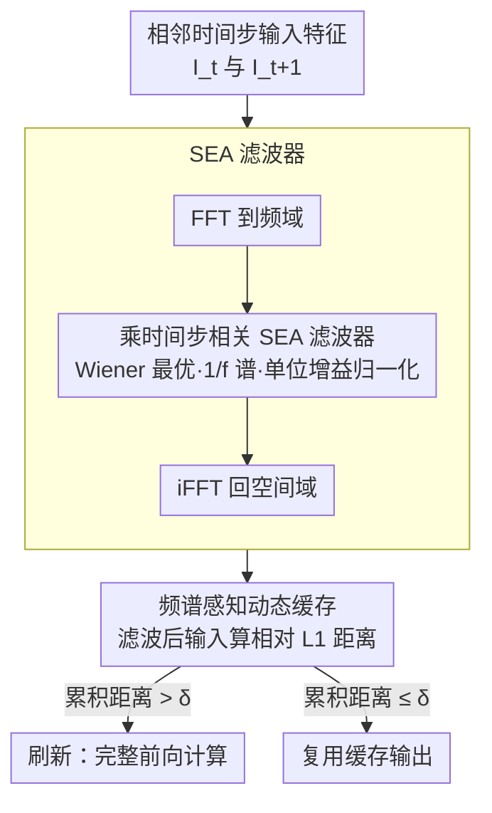

<!-- 由 src/gen_stubs.py 自动生成 -->
# SeaCache: Spectral-Evolution-Aware Cache for Accelerating Diffusion Models

**会议**: CVPR2026  
**arXiv**: [2602.18993](https://arxiv.org/abs/2602.18993)  
**代码**: [jiwoogit/SeaCache](https://github.com/jiwoogit/SeaCache)  
**领域**: 图像生成  
**关键词**: 扩散模型加速, 缓存策略, 频谱演化, 频域滤波, 无训练加速

## 一句话总结

提出 SeaCache，一种基于频谱演化感知（SEA）滤波器的无训练动态缓存策略，通过在频域中分离信号与噪声分量来测量时间步间的冗余度，显著提升扩散模型推理的延迟-质量权衡。

## 背景与动机

1. **推理延迟瓶颈**：扩散模型和整流流模型需要数十到数百步的迭代去噪，导致用户端应用延迟严重。
2. **现有加速手段的局限**：蒸馏、量化、高效注意力等方法虽有效，但引入额外训练开销和对特定任务/数据的依赖。
3. **缓存加速的潜力**：缓存复用相邻时间步的中间特征可减少前向传播次数，且无需重训练，是一条互补路线。
4. **静态 vs 动态调度**：早期方法（如 DeepCache）采用固定间隔缓存，无法适应输入多样性；TeaCache/DiCache 引入动态调度但仍在原始特征空间度量距离。
5. **忽视频谱演化**：扩散去噪过程存在明确的频谱演化——早期时间步建立低频结构，后期时间步精炼高频细节，但现有缓存策略将所有频谱分量一视同仁。
6. **内容与噪声纠缠**：原始特征距离将承载内容的信号分量和随机噪声分量混合在一起，导致缓存决策受高频噪声干扰，偏离最优调度。

## 方法详解

### 整体框架

SeaCache 要解决的是缓存加速里一个被忽视的问题：扩散去噪有明确的频谱演化（早期建低频结构、后期精修高频细节），但 TeaCache、DiCache 这些动态缓存都在**原始特征空间**量时间步间的距离，把承载内容的信号和随机噪声混在一起，导致缓存决策被高频噪声带偏。SeaCache 的做法很轻：在现有缓存策略的距离度量前插一个「频谱演化感知（SEA）滤波」步骤。

具体地，给定相邻时间步的输入特征 $I_t$、$I_{t+1}$，先 FFT 到频域，乘上一个时间步相关的 SEA 滤波器 $G_t^{\text{norm}}$，再 iFFT 回空间域，最后在滤波后的特征上算相对 $\ell_1$ 距离；该距离累积超过阈值 $\delta$ 就触发刷新，否则复用缓存输出。整套只在距离计算前加一步 FFT-滤波-iFFT，不动网络结构和采样器。

### 关键设计

**1. SEA 滤波器：从 Wiener 最优去噪推出时间步相关的频谱重加权**

缓存决策被噪声干扰，根子在于「用什么空间量距离」。SeaCache 从线性最小均方误差（MMSE）去噪器出发，推导出最优线性去噪滤波器的频率响应 $G_t(f) = a_t S_x(f) / (a_t^2 S_x(f) + b_t^2)$，正是 Wiener 滤波器的形式。再假设自然图像功率谱服从 $1/f$ 幂律，这个滤波器会在早期时间步主要放过低频、后期逐步纳入高频，恰好与扩散去噪的频谱演化对齐。

直接用这个滤波器还有个坑：原始 $G_t(f)$ 的平均增益随时间步变化，会让跨时间步的距离不可比。于是引入归一化因子 $\nu_t$，使 $G_t^{\text{norm}}(f)$ 在径向频率上具有单位平均增益，稳定滤波后特征的能量。最终滤波操作为 $\mathcal{P}(G_t^{\text{norm}}, I_t) = \text{iFFT}(G_t^{\text{norm}}(f) \odot \text{FFT}(I_t))$，逐通道在空间轴（图像）或时空轴（视频）上应用。

**2. 频谱感知动态缓存：用滤波后输入当代理，只替换距离度量**

理想上该比「滤波后输出特征」的距离，但那需要完整前向、违背缓存初衷。作者用滤波后的**输入**特征 $\mathcal{P}(G_t^{\text{norm}}, I_t)$ 作代理，并验证它与滤波后输出距离高度吻合。距离度量改为 $\widetilde{\Delta}_t = \text{L1}_{\text{rel}}(\mathcal{P}(G_t^{\text{norm}}, I_t), \mathcal{P}(G_{t+1}^{\text{norm}}, I_{t+1}))$，累积阈值刷新逻辑完全沿用 TeaCache、只换这一处距离。因为滤波在频域抑噪、强调内容，缓存调度能更忠实地追踪全计算轨迹；又因为是即插即用，可直接嵌进 TeaCache、DiCache 等现有方法。

## 实验关键数据

### 文本到图像（FLUX.1-dev，50步，DrawBench 200 prompts）

| 方法 | 延迟(s) | TFLOPs | PSNR↑ | LPIPS↓ | SSIM↑ |
|------|---------|--------|-------|--------|-------|
| Original | 20.9 | 2976 | – | – | – |
| TeaCache (δ=0.3) | 11.4 | 1547 | 20.76 | 0.211 | 0.810 |
| TaylorSeer (S=3) | 9.8 | 1191 | 22.78 | 0.163 | 0.828 |
| **SeaCache (δ=0.3)** | **9.4** | **1098** | **26.29** | **0.106** | **0.893** |
| TeaCache (δ=0.6) | 7.1 | 892 | 17.21 | 0.348 | 0.714 |
| TaylorSeer (S=5) | 7.5 | 834 | 19.97 | 0.236 | 0.762 |
| **SeaCache (δ=0.6)** | **6.4** | **773** | **21.33** | **0.226** | **0.798** |

### 文本到视频（HunyuanVideo / Wan2.1 1.3B，50步，VBench 944 prompts）

- **HunyuanVideo ~50%**：SeaCache PSNR 32.39 vs TeaCache 23.40（+9 dB），延迟 90.8s vs 98.5s
- **HunyuanVideo ~30%**：SeaCache PSNR 26.46 vs TeaCache 20.42（+6 dB），延迟 58.1s vs 64.4s
- **Wan2.1 ~50%**：SeaCache PSNR 26.60 vs TeaCache 20.84（+5.8 dB），延迟 83.9s vs 86.6s
- **Wan2.1 ~30%**：SeaCache PSNR 21.78 vs TeaCache 18.88（+2.9 dB），延迟 56.6s vs 63.6s

### 消融实验

| 变体 | 效果 |
|------|------|
| SEA 滤波器（完整） | 最优 PSNR-刷新率权衡 |
| 1−SEA（互补滤波） | 略差，追踪噪声分量不如信号分量有效 |
| 无增益归一化 | PSNR 下降，跨时间步距离偏置 |
| 静态低通滤波（LPF 30%） | 明显差于 SEA，说明时间步相关的频谱演化至关重要 |

## 亮点

- **理论驱动设计**：从 Wiener 最优滤波器推导出时间步相关的频谱演化滤波器，理论与实践紧密结合。
- **即插即用**：仅替换距离度量中的一步滤波操作，可直接嵌入 TeaCache、DiCache 等现有缓存方法。
- **跨模型泛化**：在 FLUX（图像）、HunyuanVideo 和 Wan2.1（视频）上均一致优于基线。
- **自适应早期刷新**：自然将更多计算预算分配给早期时间步，无需手动设置"前 N 步必计算"的超参数。
- **显著的 PSNR 提升**：尤其在 HunyuanVideo 上 +9 dB 的 PSNR 提升非常突出。

## 局限与展望

- **线性去噪器假设**：SEA 滤波器基于最优线性去噪器推导，实际扩散模型是高度非线性的，滤波器仅是近似。
- **功率谱先验固定**：假设自然 $1/f$ 功率谱，对非自然图像（如文字、图表）的适用性待验证。
- **仅解决"何时复用"**：未探索"如何复用"的频谱感知策略（如不同频带差异化复用）。
- **评测以重建指标为主**：PSNR/LPIPS/SSIM 衡量与全计算参考的偏差，对下游感知质量（FID、用户偏好）的报告相对有限（仅 CycleReward）。
- **FFT 额外开销**：虽然轻量，但 FFT/iFFT 操作在每个时间步引入额外计算，在极端加速场景下占比可能不可忽略。

## 与相关工作的对比

| 方法 | 调度类型 | 距离空间 | 频谱感知 | 训练需求 |
|------|---------|---------|---------|---------|
| DeepCache | 静态 | – | 否 | 无 |
| PAB | 静态（按块） | – | 否 | 无 |
| TeaCache | 动态 | 原始特征 | 否 | 无 |
| TaylorSeer | 动态（Taylor展开） | 原始特征 | 否 | 无 |
| DiCache | 动态（中间块） | 原始特征 | 否 | 无 |
| **SeaCache** | **动态** | **SEA滤波特征** | **是** | **无** |

SeaCache 是首个将显式频率先验注入缓存复用决策的方法，通过在频域中重加权抑制噪声、强调内容，使缓存调度更忠实地追踪全计算轨迹。

## 评分

- 新颖性: ⭐⭐⭐⭐ — 将频谱演化先验引入缓存调度是新颖的视角，SEA 滤波器的理论推导优雅
- 实验充分度: ⭐⭐⭐⭐ — 覆盖图像和视频生成、多个模型、消融完整、plug-and-play 验证充分
- 写作质量: ⭐⭐⭐⭐ — 动机清晰、理论推导自洽、图表丰富
- 价值: ⭐⭐⭐⭐ — 即插即用且效果显著，对扩散模型部署有直接实用价值

<!-- RELATED:START -->

## 相关论文

- [\[NeurIPS 2025\] Emergence and Evolution of Interpretable Concepts in Diffusion Models](../../NeurIPS2025/image_generation/emergence_and_evolution_of_interpretable_concepts_in_diffusi.md)
- [\[AAAI 2026\] HACK: Head-Aware KV Cache Compression for Efficient Visual Autoregressive Modeling](../../AAAI2026/image_generation/head-aware_kv_cache_compression_for_efficient_visual_autoreg.md)
- [\[CVPR 2026\] SegQuant: A Semantics-Aware and Generalizable Quantization Framework for Diffusion Models](segquant_a_semantics-aware_and_generalizable_quantization_framework_for_diffusio.md)
- [\[ICCV 2025\] From Reusing to Forecasting: Accelerating Diffusion Models with TaylorSeers](../../ICCV2025/image_generation/from_reusing_to_forecasting_accelerating_diffusion_models_with_taylorseers.md)
- [\[ICML 2026\] Spectral Guidance for Flexible and Efficient Control of Diffusion Models](../../ICML2026/image_generation/spectral_guidance_for_flexible_and_efficient_control_of_diffusion_models.md)

<!-- RELATED:END -->
