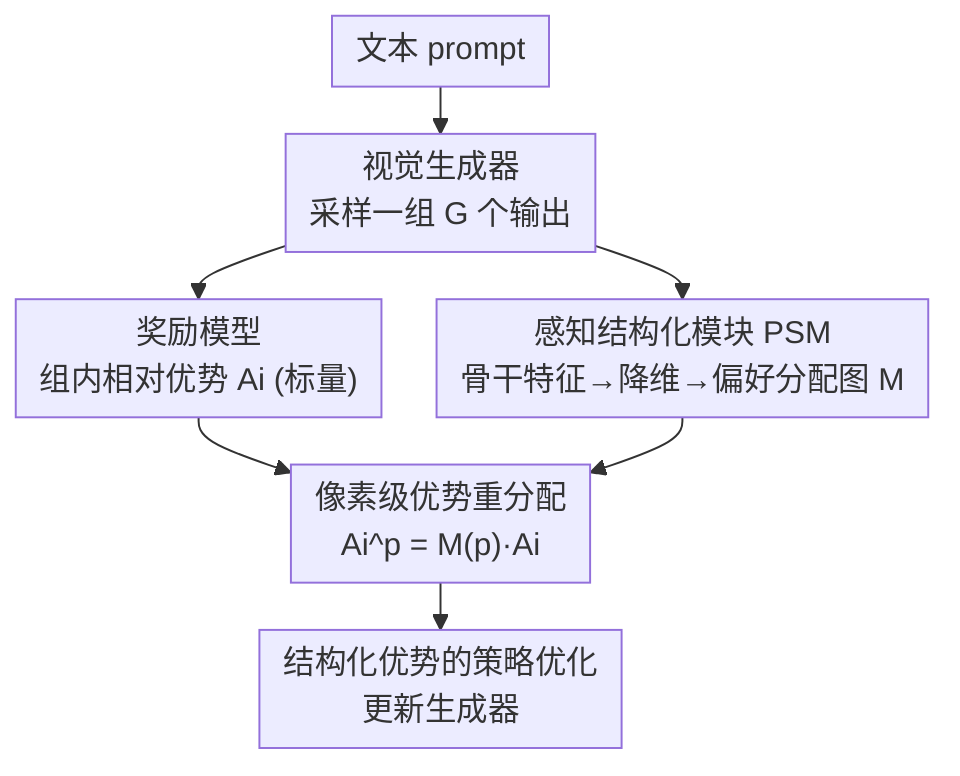

# Seeing What Matters: Visual Preference Policy Optimization for Visual Generation

**会议**: CVPR 2026  
**论文**: [CVF Open Access](https://openaccess.thecvf.com/content/CVPR2026/html/Ni_Seeing_What_Matters_Visual_Preference_Policy_Optimization_for_Visual_Generation_CVPR_2026_paper.html)  
**代码**: 无  
**领域**: 图像生成 / 强化学习对齐  
**关键词**: GRPO, 视觉偏好对齐, 像素级优势, 扩散/流匹配, 感知结构化

## 一句话总结
ViPO 把 GRPO 里每个样本一个标量优势的「整图打分」改造成像素级、感知感知的结构化优势——用一个免训练的感知结构化模块（PSM）从预训练视觉骨干里提取偏好分配图，乘到标量优势上，让优化压力流向人眼真正在意的区域，从而在图像和视频生成上同时打败原版 GRPO（DanceGRPO）。

## 研究背景与动机
**领域现状**：用强化学习给视觉生成模型做后训练、对齐人类偏好已成主流，其中 GRPO（Group Relative Policy Optimization）因为靠组内相对比较算优势、训练稳定，被 DanceGRPO、FlowGRPO 等工作搬到扩散和流匹配生成器上，取得不错效果。

**现有痛点**：GRPO 最初是给语言/推理这类 token 级或序列级输出设计的，它假设一整张图或一段视频可以用**一个标量优势** $A_i$ 来代表。直接搬到视觉数据上时，这个标量被均摊到所有像素——等于认定画面里每个区域对感知质量的贡献完全一样。于是局部瑕疵（比如多出来的一条腿、重复的前景物体）得不到针对性修正，模型对细粒度感知线索也无从建模。

**核心矛盾**：这本质是强化学习里的**空间信用分配（spatial credit assignment）问题**——无差别的奖励会把梯度推向不该改的地方，放大无关或误导性线索。现代视觉奖励模型（HPSv2、PickScore、VideoAlign 等）其实编码了丰富的空间结构，但一个标量把这些空间证据全压成一个数，GRPO 框架根本用不上。

**本文目标**：设计一个**细粒度、感知引导**的策略优化框架，让优势能在空间和时间维度上差异化分配，同时不破坏 GRPO 的稳定性和即插即用性。

**切入角度**：人类视觉偏好天生是**选择性、空间偏置**的——观察者盯着语义信息丰富的区域、忽略冗余背景。预训练视觉骨干（DINOv2、SAM、ResNet）的特征本身就携带这种空间/语义结构，可以免标注地蒸馏出「哪块区域更重要」的分布。

**核心 idea**：用预训练骨干提取的感知相关性图 $M$ 去重新分配标量优势——$A_i^p = M(p)\,A_i$，把「整图一个分」变成「每个位置一个分」，但乘法形式保证优化方向在样本内一致，不引入混合符号梯度，从而既细粒度又稳定。

## 方法详解

### 整体框架
ViPO 是对 GRPO 的一次「优势表示 + 信用分配」改写，目标是把粗糙的标量反馈升级为结构化的像素级反馈，而 GRPO 的组内奖励计算流程**原封不动**。整条 pipeline：给定文本 prompt，生成器先采样出一组（group size $G$）输出；这组输出一路送进奖励模型，按 GRPO 标准方式算出每个样本的标量优势 $A_i$；另一路并行送进**感知结构化模块（PSM）**，由它产出一张反映区域感知相关性的**偏好分配图** $M$；最后把分配图和标量优势相乘，得到像素级、偏好感知的优势 $A_i^p$，再喂进策略优化目标。整套设计 architecture-agnostic、轻量、完全兼容现有 GRPO 训练管线。

### 关键设计

**1. 感知结构化模块 PSM：把预训练骨干的特征蒸馏成免标注的偏好分配图**

这是 ViPO 唯一新增的可计算组件，专门解决「标量奖励不知道画面哪块重要」的问题，而且**不需要任何像素级标注或区域标签**。PSM 由两部分组成：视觉偏好提取器（VPE）和视觉偏好分配器（VPA）。给定生成的图像或视频帧 $x \in \mathbb{R}^{H\times W\times 3}$，VPE 用一个预训练视觉骨干 $\Phi$ 提取携带空间组织和高层语义的特征图 $F$；接着用一个降维算子 $R(\cdot)$（如主成分投影 / 特征空间分解）找出主导特征方向，得到紧凑表示

$$Z = R(F) \in \mathbb{R}^{N\times K},$$

其中 $K$ 是保留的成分数。然后 VPA 把这些成分聚合成一张空间相关性图 $S \in \mathbb{R}^{H_p\times W_p}$，采用**方差加权求和**：

$$S = \mathrm{Reshape}\Big(\sum_{j=1}^{K} \lambda_j z'_j\Big),$$

$\lambda_j$ 是第 $j$ 个成分的解释方差比、$z'_j$ 是其归一化投影。$S$ 经可选的平滑和上采样到 latent 分辨率，形成最终分配图 $M$。对视频，逐帧计算并在时间上对齐成时空体 $M \in \mathbb{R}^{T_\ell\times H_\ell\times W_\ell}$。方差加权是关键——它给「解释方差更大」的方向更高权重，等于优先采信携带更强语义信号的成分，比简单平均更能反映语义重要性（消融里方差加权 ImageReward 1.1883 vs 平均 1.1318）。

**2. 像素级优势重分配：把标量优势乘上分配图，做空间/时间信用分配**

有了 $M$，ViPO 改写 GRPO 的优势表示。标准 GRPO 给每个样本一个标量 $A_i$（由组内奖励归一化得到，见下方公式），ViPO 让这个优势在空间和时间上铺开。记 $p \in \mathcal{P}$ 为 latent 空间里横跨空间与时间维度的一个位置索引，空间分辨的优势定义为

$$A_i^p = M(p)\,A_i.$$

对应的策略目标变成

$$\mathcal{J}(\theta) = \mathbb{E}\Big[\frac{1}{G\,T_s\,|\mathcal{P}|}\sum_{i=1}^{G}\sum_{t=1}^{T_s}\sum_{p\in\mathcal{P}} \min\big(\rho_{t,i}^p A_i^p,\ \mathrm{clip}(\rho_{t,i}^p, 1-\epsilon, 1+\epsilon)A_i^p\big)\Big],$$

其中 $\rho_{t,i}^p$ 是局部似然比、$T_s$ 是扩散/流的步数。为什么是**乘法**而不是替换或加权奖励？因为乘 $M$ 保持了样本内优化方向一致（$M\ge 0$，不翻转 $A_i$ 的符号），避免了混合符号奖励带来的梯度互相干扰，又天然即插即用。消融证实了这点：把分配图直接乘到**奖励**上反而掉点（ImageReward 1.0058），因为同一概念在不同样本里出现在不同位置、权重不同，会产生错配的优势、甚至在同一物体上分配冲突梯度；乘到**优势**上则保留了稳定的相对信号。

> ⚠️ 作为背景，GRPO 的标量优势由组内奖励归一化得到：$A_i = \dfrac{r_i - \mathrm{mean}(\{r_1,\dots,r_G\})}{\mathrm{std}(\{r_1,\dots,r_G\})}$；ViPO 这一步完全不动，只是在它之后把 $A_i$ 按 $M(p)$ 重分配。

### 损失函数 / 训练策略
为了在流匹配框架里做 RL，需要把确定性的 ODE 采样 $\mathrm{d}z_t = u_t\,\mathrm{d}t$ 转成随机微分方程（SDE）以引入探索：$\mathrm{d}z_t = (u_t - \tfrac{1}{2}\varepsilon_t^2\nabla\log p_t(z_t))\,\mathrm{d}t + \varepsilon_t\,\mathrm{d}w$，其中 $\varepsilon_t$ 控制随机性、$\mathrm{d}w$ 是布朗运动；假设中间态服从高斯 $p_t(z_t)=\mathcal{N}(z_t\mid\alpha_t x, \sigma_t^2 I)$，log 密度项可解析展开，从而得到可做策略梯度的条件采样策略。除此之外，ViPO 不改 GRPO 的训练目标结构，只是优势从标量变成像素级。

## 实验关键数据

### 主实验
图像生成微调 FLUX.1-dev、奖励用 HPSv2.1（in-domain），OOD 用 PickScore / ImageReward；视频生成微调 Wan2.1-T2V-14B、奖励用 VideoAlign，OOD 用 VBench。基线是 DanceGRPO。

| 模型 | 方法 | HPSv2.1↑(in) | PickScore↑(OOD) | ImageReward↑(OOD) |
|------|------|------|------|------|
| Flux | 原始 | 0.3121 | 22.7038 | 1.1495 |
| Flux | DanceGRPO | 0.3203 | 22.5962 | 1.0392 |
| Flux | **ViPO (DINO)** | **0.3321** | 22.8305 | **1.1883** |
| Flux | ViPO (ResNet) | 0.3251 | **22.8492** | 1.1625 |
| Flux | ViPO (SAM) | 0.3219 | 22.6324 | 1.1422 |

三种骨干变体全面超过 DanceGRPO。DINOv2 综合最好（in-domain HPS、OOD ImageReward 双第一），ResNet 意外在 OOD PickScore 上最优，SAM 相对最弱——作者归因于 SAM 特征更偏低层内容而非高层语义。值得注意的是 DanceGRPO 在 OOD（PickScore 22.5962、ImageReward 1.0392）甚至低于原始 Flux，暴露了标量优化的过拟合/泛化退化，而 ViPO 反而提升泛化。

视频生成（仅用 DINOv2）：

| 模型 | 方法 | VQ↑(in) | MQ↑(in) | Semantic↑ | Quality↑ | Total↑ |
|------|------|------|------|------|------|------|
| Wan2.1 | 原始 | 2.6219 | 0.5896 | 83.36 | 71.20 | 80.92 |
| Wan2.1 | DanceGRPO | 3.0935 | 0.8639 | 83.63 | 69.68 | 80.84 |
| Wan2.1 | **ViPO** | **3.5501** | **1.1515** | **83.98** | **72.59** | **81.70** |

ViPO 在 in-domain（VQ/MQ）和 OOD VBench 全维度都超 DanceGRPO，尤其 MQ 从 0.86→1.15、运动质量提升显著。

### 消融实验
在 Flux 上围绕 PSM 四个设计点做消融：

| 配置 | HPSv2.1↑ | PickScore↑ | ImageReward↑ | 说明 |
|------|------|------|------|------|
| 分配图=全 1（≈原 GRPO） | 0.3043 | 22.2043 | 0.9520 | 像素化但无语义→反而引入方差 |
| 乘到奖励上 | 0.3090 | 22.3866 | 1.0058 | 跨样本错配、冲突梯度 |
| 乘到优势上（默认） | **0.3321** | **22.8305** | **1.1883** | 保留稳定相对信号 |
| 平均聚合 | 0.3238 | 22.7037 | 1.1318 | 各成分等权，稀释语义 |
| 方差加权聚合（默认） | **0.3321** | **22.8305** | **1.1883** | 重视高方差方向 |

主成分数 $K$：$K{=}3$ 是稳健平衡点（HPS 竞争力强、ImageReward 强、PickScore 稳），且 3 个成分可投到 RGB 做可视化；$K$ 再大开始捕捉弱方向，帮一个指标却轻微伤另一个。平滑强度 $\sigma$：$\sigma{=}1$ 最稳，$\sigma{=}0.5$ 严重掉点（HPS 0.3059），不平滑也仍有竞争力。

### 关键发现
- **真正起作用的是「语义引导的细粒度分配」而非单纯像素化**：全 1 分配图理论上等价原 GRPO，却因像素级公式额外引入方差而掉点，说明收益来自感知机制带来的语义结构。
- **乘到优势 vs 乘到奖励是成败关键**：奖励侧重分配会因「同概念跨样本位置不同」产生错配甚至同物体冲突梯度；优势侧重分配才稳。
- **规则奖励下更抗坍塌**：用「红度奖励」$r(x)=x_0-\tfrac{1}{2}(x_1+x_2)$ 做极端测试，DanceGRPO 训到后期会把内容退化成不可辨认的形状，ViPO 即便头发/背景变红也能保住整体结构和身份——区域差异化优化对全局梯度坍塌更鲁棒。

## 亮点与洞察
- **「奖励模型其实有空间信息，是 GRPO 把它压扁了」这个观察很准**：现代视觉奖励模型本可给出区域级线索，标量化反而浪费了；ViPO 不改奖励模型、只改优势的空间分布就把这部分信息找回来，思路干净。
- **PSM 免训练、免标注**：靠预训练骨干 + PCA/方差加权就把「人眼在意哪里」蒸出来，没有额外可学参数，几乎零成本嫁接到任何 GRPO 管线，工程友好度高。
- **乘法重分配的稳定性论证有说服力**：$A_i^p=M(p)A_i$ 且 $M\ge0$ 保证不翻符号，配合「乘优势不乘奖励」的消融，把「为什么稳」讲透了，可迁移到其他需要空间信用分配的 RL 对齐任务。

## 局限与展望
- **PSM 的偏好图来自通用骨干的无监督特征**，未必等于真实人类偏好——方差大的方向不一定就是人眼在意的区域，骨干选择（DINO/SAM/ResNet 表现差异明显）说明它对特征质量敏感。
- **缺少与「奖励模型本身就给密集/空间奖励」方案的对比**：ViPO 假设奖励是标量，但若直接训练空间感知奖励模型，是否还需要 PSM 的间接蒸馏，文中未充分讨论。⚠️ 实现细节（骨干具体配置、计算流程）放在补充材料，正文未给全。
- **超参对平滑较敏感**（$\sigma{=}0.5$ 大幅掉点），部署到新模型/新分辨率时可能需重新调 $\sigma$ 与 $K$。

## 相关工作与启发
- **vs DanceGRPO / FlowGRPO**: 它们把流匹配 ODE 转 SDE 实现在线 RL，但仍是整图一个标量优势；ViPO 复用它们的奖励计算，只把优势做空间/时间重分配，属于正交增强、可叠加。
- **vs 感知损失（perceptual loss）**: 感知损失用 CNN 特征图差异近似人类感知相似度、作用在重建目标上；ViPO 把「感知特征」用作 RL 信用分配的权重图，落点在策略优化的优势上而非 loss，思路同源但作用层不同。
- **vs 标量视觉奖励模型（HPSv2 / PickScore / VisionReward）**: 这些模型能捕捉细粒度线索却只输出标量、不告诉「哪里好哪里坏」；ViPO 不是再造奖励模型，而是补一个 PSM 把空间结构从生成内容侧补回来。

## 评分
- 新颖性: ⭐⭐⭐⭐ 把空间信用分配问题引入视觉 GRPO，用免标注 PSM 重分配优势的角度清新
- 实验充分度: ⭐⭐⭐⭐ 图像+视频双任务、三骨干、人类偏好奖励+规则奖励、四组消融较完整，但缺与空间奖励模型的对比
- 写作质量: ⭐⭐⭐⭐ 动机—方法—消融逻辑顺，公式清晰；部分实现细节下放补充材料
- 价值: ⭐⭐⭐⭐ 即插即用、架构无关，能直接增强现有 GRPO 视觉对齐管线，落地性强

<!-- RELATED:START -->

## 相关论文

- [\[CVPR 2026\] Learning What to Trust: Bayesian Prior-Guided Optimization for Visual Generation](learning_what_to_trust_bayesian_prior-guided_optimization_for_visual_generation.md)
- [\[CVPR 2026\] ThinkGen: Generalized Thinking for Visual Generation](thinkgen_generalized_thinking_for_visual_generation.md)
- [\[CVPR 2026\] GlyphPrinter: Region-Grouped Direct Preference Optimization for Glyph-Accurate Visual Text Rendering](glyphprinter_region-grouped_direct_preference_optimization_for_glyph-accurate_vi.md)
- [\[CVPR 2026\] MaskFocus: Focusing Policy Optimization on Critical Steps for Masked Image Generation](maskfocus_focusing_policy_optimization_on_critical_steps_for_masked_image_genera.md)
- [\[CVPR 2026\] Curriculum Group Policy Optimization: Adaptive Sampling for Unleashing the Potential of Text-to-Image Generation](curriculum_group_policy_optimization_adaptive_sampling_for_unleashing_the_potent.md)

<!-- RELATED:END -->
