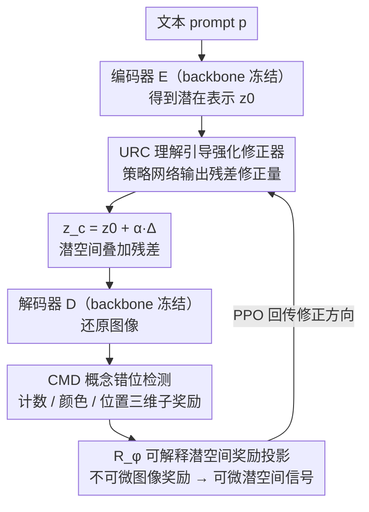

# Self-Corrected Image Generation with Explainable Latent Rewards

**会议**: CVPR 2026  
**arXiv**: [2603.24965](https://arxiv.org/abs/2603.24965)  
**代码**: [https://yinyiluo.github.io/xLARD/](https://yinyiluo.github.io/xLARD/)  
**领域**: 图像生成 / 扩散模型  
**关键词**: 文生图自修正, 潜空间奖励, 可解释生成, 语义对齐, 强化学习

## 一句话总结

提出 xLARD 框架，在文生图生成过程中通过一个轻量残差修正器在潜空间进行语义自修正，利用可解释的潜空间奖励信号（计数/颜色/位置）引导生成，在 GenEval 上提升 +4.1%，DPGBench 上提升 +2.97%，且以即插即用方式适配多种 backbone。

## 研究背景与动机

1. **领域现状**：多模态大模型（如 GPT-4V、Qwen2.5-VL）在视觉语言理解方面表现卓越，但在图像生成时，经常无法忠实表达其理解内容，特别是在计数、空间关系和颜色组合等细粒度语义上。

2. **现有痛点**：存在一个核心不对称性——模型"能理解对但生成错"。例如提示词"六只企鹅排队走在雪地上"，模型理解了却生成了错误的数量和排列。原因在于理解组件和生成组件在推理时功能解耦。

3. **核心矛盾**：现有三类解决方案各有局限——(1) 后训练方法（RL/指令微调）需要大量监督和重训练；(2) 后处理方法在生成过程中无控制力；(3) 免训练方法依赖临时规则，缺乏语义透明度。

4. **本文目标**：如何在生成过程中利用模型自身的理解能力作为实时指导信号来修正生成结果。

5. **切入角度**：评估生成图像比直接生成正确内容更容易——利用这个不对称性，让模型先生成再自我评估修正。

6. **核心 idea**：冻结 backbone，训练一个轻量残差修正器在潜空间中根据可解释的多维奖励信号（计数、颜色、位置）修正潜在表示。

## 方法详解

### 整体框架

xLARD 想解决的是一个很具体的尴尬：模型「理解对、生成错」——给它"六只企鹅排队走在雪地上"，它能读懂这句话，画出来却是五只、排得乱七八糟。论文的赌注是，**评估一张图对不对，比一次性生成对，要容易得多**，所以与其重训 backbone，不如让它先生成、再回看自己的潜在表示并修一刀。

整条链路是这样转的：文本 prompt $p$ 经编码器得到潜在表示 $z_0 = \mathcal{E}(p)$；一个轻量残差修正器 $\Delta_\theta$ 读入 $z_0$ 和 prompt 嵌入 $e_p$，吐出一个修正量，叠加回去得到 $z_c = z_0 + \alpha \cdot \Delta_\theta(z_0, e_p)$；解码器再把修好的潜在表示还原成图像 $\hat{x} = \mathcal{D}(z_c)$。修正量怎么知道往哪个方向修，靠的是三块东西协作：URC 是那个动手修的策略网络，CMD 负责在计数/颜色/位置三个维度上盯出哪里和 prompt 不一致，$R_\phi$ 则把这些图像级的判断翻译成修正器能直接学的潜空间信号。回到企鹅的例子：CMD 数出图里只有五只、与目标的六只不符，把这个偏差折成奖励，$R_\phi$ 把它投回潜空间，URC 据此在 $z_0$ 上加一笔残差，让解码出来的企鹅补到六只——整个过程 backbone 一个参数都没动。

### 关键设计

**1. 理解引导强化修正器（URC）：在潜空间里只修一刀，而不动 backbone**

针对的痛点是后训练类方法动辄要微调上百亿参数、代价太高。URC 的做法是把修正器 $\Delta_\theta$ 当成一个策略网络：输入当前潜在表示 $z_0$ 和 prompt 嵌入 $e_p$，输出一个残差修正量，整个 backbone 冻结不动。它绕开的关键障碍是「图像级奖励不可微分」——直接拿生成图去算奖励，梯度回不到潜空间；URC 改用一个可学习的奖励投影器 $R_\phi$ 把图像级奖励映射回潜空间，$r_{\text{latent}} = R_\phi(z_c, e_p) \approx r_{\text{image}}(\hat{x}, p, x^*)$，这样修正器就能端到端地学。因为只是在已有潜在表示上叠一个残差，可训练参数压到 <50M（不到基础模型的 1%），且推理时只跑一次前向就把 $\Delta_\theta$ 应用上，不需要额外采样或在线算奖励，等于零额外开销。

**2. 概念错位检测模块（CMD）：把"对不对"拆成三个人能看懂的维度**

如果奖励信号是个黑盒分数，修正过程就无从解释、也难定位错在哪。CMD 因此把语义对齐拆成三个正交、可解释的子奖励。**计数奖励**对 token 注意力图做连通域分析，估出物体数量 $\hat{n}_t$ 再和目标数量 $n_t$ 比，$r_{\text{count}} = \exp(-|\hat{n}_t - n_t|/n_t)$，差得越多奖励衰减越快。**颜色奖励**算 patch 级图像特征与颜色词嵌入的余弦相似度，对每个颜色取最匹配的 patch 再平均，$r_{\text{color}} = \frac{1}{|\mathcal{C}|}\sum_{c} \max_i s_{i,c}$。**位置奖励**用注意力加权质心定位实体落点，再用 sigmoid 评估它和 prompt 里方位词的一致性。三者按

$$r_{\text{task}} = \lambda_{\text{count}}r_{\text{count}} + \lambda_{\text{color}}r_{\text{color}} + \lambda_{\text{pos}}r_{\text{pos}}$$

加权合成联合奖励，其中权重 $\lambda$ 不是写死的，而是由一个置信度头按当前 prompt 动态调节——提示词强调数量时计数那一项就被抬高。和那些靠临时规则做免训练修正的方法相比，这套分解的价值在于每一笔修正都能追溯到某个具体维度，而不是一个说不清的总分。

**3. 可解释潜空间奖励投影（$R_\phi$）：把不可微的评估翻译成可微的优化目标**

这一块是 URC 能训起来的关键。$R_\phi(z_c, e_p) \in \mathbb{R}^3$ 是个被训练去近似 CMD 那三个子奖励的投影器，一旦它学好，修正器的优化目标就变成纯潜空间内、处处可微的形式，用 PPO 直接最大化：

$$\theta^* = \arg\max_\theta \mathbb{E}_{p}\big[R_\phi(z_0 + \Delta_\theta(z_0, e_p), e_p)\big]$$

它顺带还提供了一层可视化解释——Latent Activation Maps（LAM）把修正量在各通道上的绝对值沿空间聚合，$\text{LAM}(h,w) = \sum_c |\Delta_\theta(z_0, e_p)[c,h,w]|$，高激活的区域就是修正器实际下手改的地方，让人能直接看到它是在补企鹅还是在改颜色，而不只是相信一个数字变好了。

### 损失函数 / 训练策略

修正器用 PPO 优化，梯度形式为 $\nabla_\theta \mathcal{L} = -(R_\phi - b)\nabla_\theta \log \pi_\theta(\Delta_\theta | z_0, e_p)$，其中 $b$ 是学习得到的 baseline，用来降低策略梯度方差。Backbone 全程冻结，只训练修正器 $\Delta_\theta$ 和奖励投影器 $R_\phi$。训练很省：单张 H100 上每 epoch 约 7–8 分钟，15 个 epoch 共约 2 小时即可完成。

## 实验关键数据

### 主实验

| 方法 | 类型 | 参数量 | DPG-Bench | GenEval |
|------|------|--------|-----------|---------|
| FLUX-dev | Diffusion | 12B | 84.00 | 0.68 |
| Janus-pro | AR | 7B | 84.19 | 0.80 |
| BAGEL | AR+RAG | 14B | 84.07 | 0.79 |
| OmniGen2 | Diffusion+AR | 7B | 83.48 | 0.77 |
| **xLARD** | - | - | **86.45** | **0.81** |

GenEval 细分指标（OmniGen2 backbone）：

| 指标 | OmniGen2 | + xLARD | 提升 |
|------|----------|--------|------|
| Counting | 69.12% | 78.44% | +9.3% |
| Colors | 85.88% | 92.11% | +6.2% |
| Position | 45.52% | 48.75% | +3.2% |
| Overall | 77.03% | 81.29% | +4.3% |

### 消融实验

| 变体 | GenEval (%) | DPG-Bench (%) |
|------|-------------|---------------|
| Full model | 81.29 | 86.45 |
| Without RL | 77.68 | 83.84 |
| Without Confidence Map | 77.94 | 84.21 |
| Without Latent Anchor | 76.90 | 83.56 |

### 关键发现

- **计数改善最显著**：GenEval 中 counting 提升 +9.3%，说明计数奖励对修正数量错误非常有效
- **跨 backbone 通用**：在 OmniGen2、BAGEL、Show-O 三个不同架构上均有一致提升
- **Latent Anchor 贡献最大**：去掉后 GenEval 下降 4.39%，说明结构化语义先验对布局和关系推理至关重要
- **可解释性信号忠实**：遮蔽 LAM 高激活区域后 CLIPScore 下降 6.3%，token 贡献与奖励增益的 Spearman 相关系数 ρ=0.71
- **数据效率高**：与后训练方法相比，用更少的数据就能达到更高的增益（见 Figure 1 右图）

## 亮点与洞察

- **评估比生成容易这个 insight 很关键**：利用理解/生成之间的不对称性做自修正，这个切入点比后训练或后处理更优雅
- **可解释性作为第一公民**：将可解释性内嵌在设计中而非后验分析，每一步修正都有语义依据（计数/颜色/位置），这是区别于其他对齐方法的核心亮点
- **极致轻量**：可训练参数不到基础模型的 1%，训练 2 小时，推理零额外开销——非常适合工业部署
- **潜空间奖励投影的技巧可迁移**：将不可微的图像级评估转化为可微的潜空间信号，这个思路可以迁移到其他需要从不可微评估中学习的场景

## 局限与展望

- **奖励函数局限**：当前仅覆盖计数/颜色/位置三个维度，对纹理、风格、动作等更复杂语义尚未建模
- **依赖参考图像**：训练时需要高质量参考图像来提供监督信号
- **仅针对英文 prompt 评估**：多语言和文化多样性场景未验证
- **美学质量未显式建模**：奖励函数可能无法捕捉审美或文化细微差别

## 相关工作与启发

- **vs HermesFlow/UniRL**：后训练方法需要微调数百亿参数的 backbone，计算成本高；xLARD 仅修改不到 50M 参数的修正器，效率高出数个数量级
- **vs CLIP-guided optimization**：CLIP 引导优化虽然免训练，但容易降低视觉质量或引入不稳定性；xLARD 通过潜空间残差修正保持了生成先验
- **vs 训练时对齐（RLHF for images）**：xLARD 在推理时零额外开销，而 RLHF 类方法需要改变整个模型分布

## 评分

- 新颖性: ⭐⭐⭐⭐ 潜空间可解释奖励驱动自修正的思路新颖，将可解释性内嵌在优化目标中
- 实验充分度: ⭐⭐⭐⭐⭐ 覆盖多个 benchmark（GenEval/DPGBench/ImgEdit/GEdit）和多个 backbone，消融全面
- 写作质量: ⭐⭐⭐⭐ 结构清晰，可解释性分析详实
- 价值: ⭐⭐⭐⭐ 即插即用的轻量修正器对实际应用很有价值，可解释性设计为领域树立了良好范例

<!-- RELATED:START -->

## 相关论文

- [\[CVPR 2026\] SOLACE: Improving Text-to-Image Generation with Intrinsic Self-Confidence Rewards](solace_self_confidence_rewards_t2i.md)
- [\[CVPR 2026\] PSR: Scaling Multi-Subject Personalized Image Generation with Pairwise Subject-Consistency Rewards](psr_scaling_multi-subject_personalized_image_generation_with_pairwise_subject-co.md)
- [\[CVPR 2026\] Self-Evaluation Unlocks Any-Step Text-to-Image Generation](self-evaluation_unlocks_any-step_text-to-image_generation.md)
- [\[CVPR 2026\] OSPO: Object-Centric Self-Improving Preference Optimization for Text-to-Image Generation](ospo_object-centric_self-improving_preference_optimization_for_text-to-image_gen.md)
- [\[CVPR 2026\] When Local Rules Create Global Order: Self-Organized Representation Learning for Latent Diffusion Models](when_local_rules_create_global_order_self-organized_representation_learning_for_.md)

<!-- RELATED:END -->
