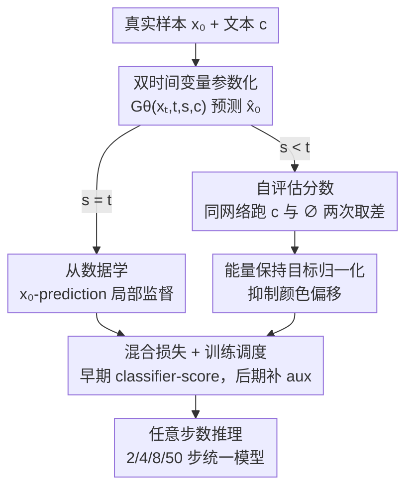

# Self-Evaluation Unlocks Any-Step Text-to-Image Generation

**会议**: CVPR 2026  
**论文**: [CVF Open Access](https://openaccess.thecvf.com/content/CVPR2026/html/Yu_Self-Evaluation_Unlocks_Any-Step_Text-to-Image_Generation_CVPR_2026_paper.html)  
**代码**: 无  
**领域**: 扩散模型 / 图像生成  
**关键词**: 任意步数生成、文生图、自评估、流匹配、少步采样

## 一句话总结
本文提出 Self-Evaluating Model（Self-E），让一个文生图模型在从零训练时一边像流匹配那样从数据学局部速度场、一边用自己当前的打分给自己生成的图打分作为"动态自教师"，从而无需预训练教师、无需蒸馏就能训出一个支持任意步数推理的模型——2 步就能出高质量图、50 步又能与顶级流匹配模型掰手腕。

## 研究背景与动机
**领域现状**：扩散模型和流匹配（Flow Matching）是当下文生图的主流，它们都去逼近一种**局部监督**——某个时刻噪声样本该往数据流形挪的瞬时速度（或等价的 score 函数）。

**现有痛点**：局部监督只提供"短程指引"，每一步只纠正一点点偏差，没有对目标分布的全局视野。结果是反向轨迹是弯的，模型必须串行走几十步才能从噪声可靠地走到数据，推理又慢又贵。

**核心矛盾**：要少步，就得有"全局视野"；而获得全局视野的主流办法——蒸馏（distillation）——必须先有一个强大的**预训练教师**来提供真实分布的 score。这违背了"自给自足、从零训练"的初衷。另一条从零训的路线（consistency / flow-map 类）则从头优化很不稳定、或质量退化，目前只在 ImageNet 这类简单 benchmark 上跑通，真正能在大规模文生图上成功的仍重度依赖蒸馏。

**本文目标**：在**从零预训练**的前提下，让模型既能少步（<8 步）出图、又能多步出高质量图，且不依赖任何外部教师。

**切入角度**：作者的关键观察是——蒸馏里那个"教师提供的真实 score"，其实可以由**模型自己当前学到的局部 score** 来近似。因为根据 Tweedie 公式，真实 score 和条件期望 $E[x_0|x_s,c]$ 直接挂钩，而模型本来就在从数据里学这个期望。即便早期估得不准，"学生"自己也还没收敛，这个粗糙的自评估信号仍足以有效引导训练。

**核心 idea**：用"模型评估自己生成的样本"代替"教师评估学生样本"，把瞬时局部学习与自驱动的全局分布匹配缝在一起，从而在一个从零训练的统一模型里解锁任意步数推理。

## 方法详解

### 整体框架
Self-E 训练一个网络 $G_\theta(x_t, t, s, c)$，它接收**两个时间变量** $s \le t$，直接预测干净样本 $\hat{x}_0 = x_t - t\,V_\theta(x_t, t, s, c)$。整套训练由两个互补目标驱动：当 $s=t$ 时只有"从数据学"的局部重建损失起作用；当 $s<t$ 时额外引入"自评估"目标做全局分布匹配。总损失为

$$L(\theta) = L_{\text{data}}(\theta) + \lambda L_{\text{self-evaluate}}(\theta).$$

自评估这一支的关键流程是：先用模型生成 $\hat{x}_0$，再把它加噪成 $\hat{x}_s$，然后用**同一个网络**（停梯度、评估模式）跑两次——一次带文本条件 $c$、一次带空提示 $\phi$，两者之差就是一个"自评估分数"，当作施加在 $\hat{x}_0$ 上的反馈梯度回传，从而在无教师的情况下把生成样本往真实分布密度高的区域推。

### 关键设计

**1. 双时间变量参数化：把目标从"学轨迹"换成"直接匹配边缘分布"**

痛点在于，consistency / flow-map 类方法虽然也用两个时间变量，但它们学的是反向轨迹上某段的**平均速度或 flow map**（即局部速度的积分），本质还是被绑死在某条特定轨迹上。本文的网络 $G_\theta(x_t, t, s, c)$ 同样吃 $(t, s)$ 两个时间，但目标根本不同：它直接预测样本，要求 $\hat{x}_0$ 加噪后的边缘分布 $p_\theta(x_s|c)$ 去匹配真实分布 $q(x_s|c)$，**不约束**反向转移走任何特定轨迹。当 $s=t$ 时模型退化为标准条件流匹配，$G_\theta(x_t,t,t,c)$ 估计条件期望 $E[x_0|x_t,c]$；这层"既能当单步预测器、又能当 score 估计器"的双重身份，正是自评估能成立的前提。

**2. 自评估分数：用模型自己近似真实 score，彻底甩掉教师**

要做全局分布匹配，需要反向 KL 散度 $D_{\text{KL}}(p_\theta(x_s|c)\,\|\,q(x_s|c))$ 的梯度，它涉及"假 score"$\nabla\log p_\theta$ 与"真 score"$\nabla\log q$ 之差。真 score 通常要靠预训练教师。本文的做法是：根据 Tweedie 公式 $\nabla_{x_s}\log q(x_s|c) = (\alpha_s E[x_0|x_s,c] - x_s)/\sigma_s^2$，而模型当前的 $G_\theta(x_s,s,s,c)$ 正在从数据学这个期望，于是直接拿它来近似真 score。具体实现里，作者把 KL 梯度拆成**classifier score 项**与**auxiliary 项**两部分；经验上只用 classifier score 项就足够有效、甚至更易收敛，于是早期省掉 auxiliary 项、避免再co-train一个估假 score 的模型。落地时构造一个伪目标

$$x_{\text{self}} := \mathrm{sg}\big[\hat{x}_0 - (G_\theta(\hat{x}_s, s, s, \phi) - G_\theta(\hat{x}_s, s, s, c))\big],$$

其中 $\mathrm{sg}$ 是停梯度。最小化 $\|G_\theta(x_t,t,s,c) - x_{\text{self}}\|^2$ 所诱导的梯度恰好对齐期望的 classifier score 方向——这就是"自评估"二字的全部机制：同一个网络既生成、又当裁判。

**3. 能量保持目标归一化：压住自评估带来的颜色偏移**

自评估项的权重 $\lambda_{s,t} = \sigma_t/\alpha_t - \sigma_s/\alpha_s$（$t=s$ 时为 0，损失退化为纯数据重建）。但 $\lambda_{s,t}$ 偏大时会盖过数据损失，导致输出颜色偏移。作者借鉴高 CFG 场景的处理思路，对隐式回归目标 $x_{\text{tar}} = (x_0 + \lambda_{s,t} x_{\text{self}})/(1+\lambda_{s,t})$ 做**能量保持归一化**：

$$x_{\text{renorm}} = \frac{x_0 + \lambda_{s,t} x_{\text{self}}}{\|x_0 + \lambda_{s,t} x_{\text{self}}\|_2}\,\|x_0\|_2,$$

让目标的能量与干净样本 $x_0$ 对齐。消融显示这能小幅提升画质与稳定性（除极端 2 步设置外）。

**4. 混合训练调度 + 任意步数推理：早期稳、后期精，单模型覆盖全步数预算**

auxiliary 项虽对应更精确的分布匹配，但从头就加入会显著拖垮训练（它主要防 mode collapse，而这件事"从数据学"那一支已经能兜住）。所以作者用**混合调度**：早期只用 classifier score（省算力、稳优化），后期再补回 auxiliary 项做精修，专治 2 步生成里的棋盘格/过饱和条纹伪影。推理端则天然支持任意步数：给定步数预算 $N$ 与时间表 $\{t_k\}$，每步按 $x_{t_{k+1}} = x_{t_k} - (t_k - t_{k+1})V_\theta(x_{t_k}, t_k, s_k, c)$ 迭代去噪，默认 $s_k = t_{k+1}$，并配合能量保持 CFG（$\omega=5$）。同一个模型既能 2 步极速出图、又能 50 步长轨迹精修。

### 损失函数 / 训练策略
最终每对 $(s,t)$ 的损失为 $L_{s,t}(\theta) = \|\hat{x}_0 - x_{\text{renorm}}\|_2^2$，整体损失对所有时间对加权平均 $L(\theta) = E_{s,t}[w_{s,t} L_{s,t}(\theta)]$。主实验用 2B 参数、512×512 的 latent transformer（架构仿 FLUX，仅为多吃一个时间输入 $s$ 做微调）；消融用 0.5B 模型、256×256、batch 1024。

## 实验关键数据

### 主实验
在 GenEval 基准上与覆盖各训练范式的方法对比（流匹配 FLUX/SANA/SDXL、蒸馏 LCM、并发 any-step 方法 TiM）。Self-E 在所有步数下 Overall 全面 SOTA，且随步数单调提升。

| 步数 | 指标 | Self-E | 次优方法 | 提升 |
|------|------|--------|----------|------|
| 2 步 | GenEval Overall | 0.753 | 0.634 (TiM) | +0.12 |
| 4 步 | GenEval Overall | 0.781 | 0.687 (TiM) | +0.09 |
| 8 步 | GenEval Overall | 0.785 | 0.779 (SANA-1.5) | +0.006 |
| 50 步 | GenEval Overall | 0.815 | 0.806 (SANA-1.5) | +0.009 |

少步区间优势尤其悬殊：2 步时 FLUX/SANA/SDXL 几乎完全崩（Overall 0.002~0.166），而 Self-E 已达 0.753；50 步时仍能反超 FLUX.1-dev（0.797）和 SANA-1.5。

### 消融实验
0.5B 模型，GenEval Overall（上块 100k 迭代看设计选择，下块 300k 迭代对比预训练范式）。

| 配置 | 2 步 | 4 步 | 8 步 | 50 步 | 说明 |
|------|------|------|------|------|------|
| w/o 目标归一化 | 0.5555 | 0.6156 | 0.6521 | 0.7018 | 去掉能量保持归一化，多数步数掉点 |
| 全程带 aux 项 | 0.3307 | 0.4304 | 0.5153 | 0.6166 | 从头加 auxiliary 项，严重退化 |
| Self-E（完整） | 0.5439 | 0.6381 | 0.6819 | 0.7160 | 完整模型 |
| Flow Matching | 0.2523 | 0.6075 | 0.7155 | 0.7311 | 标准流匹配，少步惨败 |
| IMM | 0.2617 | 0.5994 | 0.7112 | 0.7472 | 另一从零少步方法 |
| Self-E（300k） | 0.6097 | 0.7121 | 0.7490 | 0.7543 | 各步数全面领先 |

### 关键发现
- **auxiliary 项不能从头加**：全程带 aux 项 2 步只有 0.33，反而被完整模型（0.54）甩开——印证"早期靠 classifier score、后期再补 aux"的混合调度是必要的。
- **少步是真护城河**：Flow Matching / IMM 在 50 步能追平甚至略高，但 2 步直接崩到 0.25 左右，而 Self-E 仍有 0.61；自评估提供的全局视野主要在低步数预算下兑现价值。
- **目标归一化的代价**：它在多数步数提升画质稳定性，唯独极端 2 步设置略有损失，作者权衡后仍全局采用。
- aux 项在后期专治 2 步生成的棋盘格/过饱和条纹伪影（Fig. 6 定性可见）。

## 亮点与洞察
- **"自己当教师"的范式转换很巧**：蒸馏的全局监督一直被认为离不开外部教师，本文用 Tweedie 公式把"真 score"换成"模型自己当前学到的期望"，一举打通从零训练与全局匹配——这是整篇最让人"啊哈"的地方。
- **双时间变量复用得聪明**：同一组 $(t,s)$ 输入，consistency 类拿去学 flow map，本文拿去做边缘分布匹配，目标完全不同却共享同一套参数化，几乎零额外架构成本（仅多一个时间输入）。
- **单模型覆盖全步数预算**，且性能随步数单调提升，省去了"少步模型 / 多步模型分别训练部署"的工程负担，这个思路可迁移到文生视频等同样苦于步数的生成任务。

## 局限与展望
- 主结果集中在 GenEval（语义对齐/计数/位置等），缺少 FID、人类偏好等画质维度的系统量化，少步画质优势更多靠定性图支撑。
- 自评估早期用"未收敛模型"近似真 score，作者承认估计不准，虽辩称学生也没收敛故无碍，但这个近似的理论边界与失效情形未充分讨论（⚠️ 收敛性分析以原文/附录为准）。
- 混合调度何时切换、$\lambda_{s,t}$ 与 $s_k$ 的取值依赖经验调参（部分细节在补充材料），复现成本与敏感性需关注。
- 与并发的 TiM 属同期工作，二者优劣边界仍待更细的横向对比。

## 相关工作与启发
- **vs 蒸馏类（LCM / DMD 等）**：它们用预训练教师的分布/轨迹做全局监督，需要现成强教师；本文把教师换成"训练中的自己"，在预训练阶段就完成分布匹配，无教师依赖。
- **vs consistency / flow-map（MeanFlow / TiM）**：它们学反向轨迹的 flow map 或平均速度，从零优化不稳、难 scale 到大规模文生图；本文不绑轨迹、直接匹配边缘分布，少步质量更稳。
- **vs 标准流匹配 / 扩散（FLUX / SANA / SDXL）**：纯局部监督导致少步崩坏，本文在保留局部数据监督的同时叠加自驱动全局匹配，弥补了"短程指引"的全局盲区。

## 评分
- 新颖性: ⭐⭐⭐⭐⭐ "模型自评估代替教师 score"是干净有力的范式创新，首个从零训练的 any-step 文生图模型。
- 实验充分度: ⭐⭐⭐⭐ GenEval 多步数对比 + 范式/设计消融都到位，但缺 FID/人类偏好等画质量化。
- 写作质量: ⭐⭐⭐⭐ 动机推导（局部 vs 全局、Tweedie 近似）讲得清晰，公式与设计对应明确。
- 价值: ⭐⭐⭐⭐⭐ 单模型覆盖任意步数、少步大幅领先，对高效生成部署有直接意义。

<!-- RELATED:START -->

## 相关论文

- [\[CVPR 2026\] GenColorBench: A Color Evaluation Benchmark for Text-to-Image Generation](gencolorbench_a_color_evaluation_benchmark_for_text-to-image_generation.md)
- [\[CVPR 2026\] OSPO: Object-Centric Self-Improving Preference Optimization for Text-to-Image Generation](ospo_object-centric_self-improving_preference_optimization_for_text-to-image_gen.md)
- [\[CVPR 2026\] OctoT2I: A Self-Evolving Agentic Text-to-Image Router](octot2i_a_self-evolving_agentic_text-to-image_router.md)
- [\[CVPR 2026\] LeapAlign: Post-Training Flow Matching Models at Any Generation Step by Building Two-Step Trajectories](leapalign_post_training_flow_matching_models_at_any_generation_step.md)
- [\[CVPR 2026\] SOLACE: Improving Text-to-Image Generation with Intrinsic Self-Confidence Rewards](solace_self_confidence_rewards_t2i.md)

<!-- RELATED:END -->
