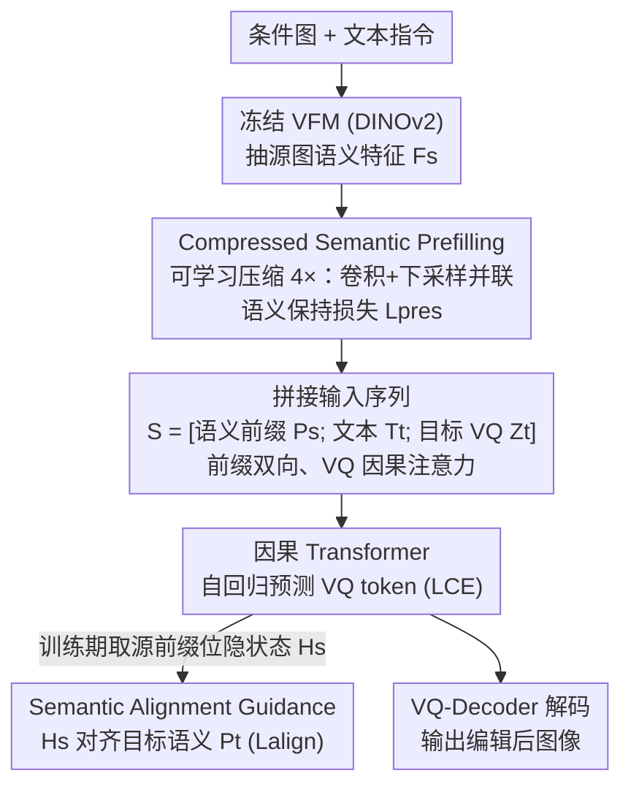

# Semantic Context Matters: Improving Conditioning for Autoregressive Models

**会议**: CVPR 2026  
**论文**: [CVF Open Access](https://openaccess.thecvf.com/content/CVPR2026/html/Jin_Semantic_Context_Matters_Improving_Conditioning_for_Autoregressive_Models_CVPR_2026_paper.html)  
**代码**: https://github.com/AMAP-ML/SCAR （论文称将开源）  
**领域**: 图像生成 / 自回归模型 / 可控编辑  
**关键词**: 自回归图像编辑, 前缀条件, 语义压缩, DINOv2, 隐状态对齐

## 一句话总结
SCAR 把自回归图像编辑的"前缀条件"从冗长、语义稀疏的 VQ token 换成由冻结视觉基础模型抽取、再经可学习模块压缩 4× 的稠密语义前缀（Compressed Semantic Prefilling），并在解码时用一项辅助损失把模型对源图的"内部隐状态"对齐到目标图语义（Semantic Alignment Guidance），从而在 next-token 与 next-set 两种 AR 范式上都拿到更高的视觉质量与指令一致性，同时把训练显存降约 24%、速度提升约 1.4×。

## 研究背景与动机

**领域现状**：图像编辑目前有两条主线——扩散模型和自回归（AR）模型。AR 模型（如 next-token 的 LlamaGen、next-set 的 VAR）因为天然契合统一多模态架构、采样/部署更高效，被视为很有前景的方向，生成质量已逼近顶尖扩散模型。

**现有痛点**：但把 AR 模型扩展到"通用图像编辑"时，条件注入（conditioning）又弱又低效，导致指令遵循差、出现伪影。现有 AR 编辑方案分两类，各有硬伤：(1) **解码阶段注入**（如 ControlAR）把控制信号塞进中间层，对像素级可控生成很强，但这种强空间引导会**打断自回归过程**，做通用指令编辑时反而把不该改的地方也改了；(2) **前缀阶段条件**（如 EditAR、多数 UMM）把条件图的视觉 token 拼到输入序列前面，简单且模型无关，但它**把序列长度几乎翻倍**，注意力开销暴涨；而且用的是 VQ token——业界公认 VQ token "语义稀疏"，缺少复杂编辑所需的高层表示。

**核心矛盾**：前缀条件这条路本来更通用、更兼容各种 AR 范式，但卡在"前缀既冗长又语义浅"这一个瓶颈上：要语义就得用长序列（贵），要便宜就只能用 VQ（语义不够）。

**本文目标**：拆成两个子问题——(a) 怎么造一个"短而语义丰富"的条件前缀；(b) 怎么把稀疏的文本指令真正翻译成对几千个稠密视觉 token 的有效引导。

**切入角度**：作者从"语义"视角重新审视前缀条件，主张用冻结的视觉基础模型（VFM，实践用 DINOv2）抽取的高层特征替代 VQ token，并额外给解码过程一个稠密的、在上下文里就能学到的对齐信号。

**核心 idea**：用"压缩后的 VFM 语义前缀"替换"原始 VQ 前缀"，再用"隐状态↔目标语义对齐"补上文本指令引导不够稠密的缺口——两者合称 SCAR（Semantic-Context-driven AutoRegressive）。

## 方法详解

### 整体框架
SCAR 是一个**前缀式**（prefilling-based）的 AR 图像编辑/可控生成框架，输入是一张条件图（源图或控制图，如 Canny/Depth）加一段文本指令，输出是编辑后的目标图。它不改 AR 主干的生成范式，只在两个地方动手：**进入序列前**怎么把条件图编码成前缀，**训练时**怎么再给一个对齐约束。整条流水线是：冻结 VFM 把条件图编码成语义特征 → 可学习压缩模块把它压短 → 和文本嵌入、目标图 VQ token 拼成一条序列喂给因果 Transformer → 正常自回归预测 VQ token，同时训练期额外用"源图隐状态对齐目标图语义"的辅助损失监督。整个设计对 next-token（LlamaGen）和 next-set（VAR）都适用，只需极小改动。

### 关键设计

**1. Compressed Semantic Prefilling：把冗长 VQ 前缀换成"短而语义浓"的 VFM 前缀**

直接的痛点是：前缀条件要么用 VQ token（语义稀疏、编辑做不好），要么用 VFM 特征（语义够但太长，512×512 输入会产生 1024 个 token，显存与注意力开销爆炸）。SCAR 想"既要语义又要短"，于是用冻结的 DINOv2 抽源图特征 $F_s = E(I_s)$，再用一个可学习压缩模块 $P_k(\cdot)$ 把它压缩 $k$ 倍。压缩不是简单池化，而是**并联两条下采样路径再相加**：一条带步长的卷积 $C_k$，一条空间重采样 $R_k$：

$$F_c = P_k(F_s) = C_k(F_s) + R_k(F_s)$$

得到 $F_c \in \mathbb{R}^{\frac{h}{k}\times \frac{w}{k}\times d}$，序列长度从 $h\times w$ 降到 $\frac{h\times w}{k^2}$，相当于 $k^2\times$ 压缩（默认 4×，即 1024→256）。为保证压缩不丢关键语义，训练时额外挂一个轻量上采样模块 $U_k$（pixel shuffle 实现）和一个**语义保持损失**：

$$L_{pres} = \lVert F_s - U_k(F_c)\rVert_2^2$$

这个损失在视觉特征空间里逼模型"压缩完还能重建回原语义"，从而学会丢冗余、留高层信息；推理时 $U_k$ 直接丢弃，不增加成本。压缩后的前缀 $P_s$ 与文本嵌入 $T_t$、目标图 VQ 序列 $Z_t$ 拼成 $S=[P_s;T_t;Z_t]$，注意力掩码也改过：$P_s$ 与 $T_t$ 之间**双向**注意（让视觉与文本语义深度交互），$Z_t$ 对前缀和已生成 token **因果**注意（保住自回归性质）。之所以有效：DINO 特征本身就携带结构与语义线索，比 VQ token 信息密度高得多；而消融显示这种语义前缀在压缩下依然稳健，VQ 前缀在同等压缩下性能会急剧掉点——这正是"语义浓"带来的鲁棒性。

**2. Semantic Alignment Guidance：用目标图语义在解码前就把模型"内部理解"掰向编辑目标**

第二个痛点是语义鸿沟：文本指令只给了稀疏、高层的引导，不足以指挥几千个稠密低层 VQ token 的生成；标准自回归交叉熵损失 $L_{CE}$ 只监督输出 token $Z_t$，并没教模型"怎么用上下文 $[P_s;T_t]$ 去完成这次编辑"。SCAR 的做法是给一个**稠密、在上下文内的对齐信号**：用同一个冻结 VFM 和同一个压缩器算出目标图 $I_t$ 的语义表示作为监督目标 $P_t = P_k(E(I_t))$（保证源/目标前缀落在同一空间）；训练时把序列 $S$ 过因果 Transformer，取出**对应源语义前缀那段位置**的最后隐状态 $H_s = G_\theta(S)[1:L_c,:]$——这代表"模型读完指令后对源图的内部推理"，再用一个 $\ell_2$ 约束逼它向目标语义靠：

$$L_{align} = \lVert H_s - P_t\rVert_2^2$$

为什么这样有效：它不像 EditAR 那样把监督蒸馏到**输出 VQ token** 上，而是直接作用在**因果隐状态**上，形式上更贴合因果解码过程；相当于在模型还没吐出第一个 VQ token 之前，就提供了一个稠密的"目标长什么样"的 in-context 先验，让后续逐 token 预测有据可依。整体训练目标是三项之和：自回归 $L_{CE}$ + 语义保持 $L_{pres}$ + 加权对齐 $\delta L_{align}$；消融发现 $\delta$ 越大指令越贴合，但太大（$\delta=1.0$）会引入结构扭曲、颜色溢出，$\delta=0.5$ 是质量与一致性的最佳权衡。

### 损失函数 / 训练策略
总损失为 $L = L_{CE} + L_{pres} + \delta\, L_{align}$，其中 $\delta=0.5$。图像编码器用冻结的 DINOv2-B；C2I 可控生成在 ImageNet-256 上分别训 VAR 10 epoch、LlamaGen 20 epoch，T2I 可控生成（LlamaGen-XL + T5，512×512）训 4 epoch，指令编辑（SEED-Edit-Unsplash）训 2 epoch；全部在 8 张 NVIDIA H20 上训练。默认压缩比 4×，相比无压缩节省约 23.9% 显存（56.6→43.1GB）、训练加速约 1.42×。

## 实验关键数据

### 主实验

**C2I 可控生成（ImageNet-256，FID↓ / 一致性）**：SCAR 在五种控制条件下大幅领先此前 AR 方法，且对 next-token、next-set 两种范式都成立。

| 方法 | 主干 | Canny FID↓ | Depth FID↓ | HED FID↓ | Sketch FID↓ |
|------|------|-----------|-----------|----------|-------------|
| ControlAR | LlamaGen-L | 7.69 | 4.19 | - | - |
| ControlVAR | VAR-d30 | 7.85 | 6.50 | - | - |
| CAR | VAR-d30 | 8.30 | 6.90 | 5.60 | 10.20 |
| **SCAR (Ours)** | VAR-d20 | **1.97** | 3.29 | **1.51** | 3.39 |
| **SCAR (Ours)** | LlamaGen-L | 2.69 | **2.50** | 2.67 | 3.04 |

**T2I 可控生成（MultiGen-20M，512×512，LlamaGen-XL）**：FID 全面优于扩散与 AR 基线。

| 方法 | Depth FID↓ | HED FID↓ | Canny FID↓ | Lineart FID↓ |
|------|-----------|----------|-----------|--------------|
| ControlNet++ | 16.66 | 15.01 | 18.23 | 13.88 |
| ControlAR | 14.61 | 10.53 | 17.51 | 12.41 |
| EditAR | 15.97 | - | - | - |
| **SCAR (Ours)** | **13.77** | **8.41** | **10.82** | **8.91** |

**指令编辑（PIE-Bench，LlamaGen-XL）**：在结构保持、背景重建、图文一致上多数指标最优。相比 EditAR，结构距离降 21.4%、LPIPS 降 10.3%、MSE 降 35.9%、PSNR 提升 1.27 dB。注意：解码阶段注入的 ControlAR* 在此任务上表现很差（Structure 116.99），印证"强空间引导打断 AR 编辑"的判断。

| 方法 | Structure Dist.↓ | PSNR↑ | LPIPS↓ | MSE↓ |
|------|------------------|-------|--------|------|
| ControlAR* | 116.99 | 14.63 | 289.34 | 590.63 |
| EditAR | 39.43 | 21.32 | 117.15 | 130.27 |
| **SCAR (Ours)** | **30.98** | **22.59** | **105.09** | **83.47** |

### 消融实验
（下表均训 1 epoch，MultiGen-20M。）

| 配置 | HED FID↓ | HED SSIM↑ | Depth FID↓ | 说明 |
|------|----------|-----------|-----------|------|
| Resize | 10.07 | 80.15 | 15.78 | 仅空间重采样压缩 |
| PixelUnshuffle | 9.82 | 81.65 | 15.48 | 像素重排压缩 |
| Ours（无 $L_{pres}$） | 9.89 | 81.47 | 15.21 | 卷积+重采样并联 |
| **Ours + $L_{pres}$** | **9.43** | **81.76** | **14.70** | 加语义保持损失，最佳 |

| 压缩比 $k^2$ | HED FID↓ | HED SSIM↑ | Depth FID↓ |
|------|----------|-----------|-----------|
| 1×（不压缩） | 9.29 | 81.95 | 14.61 |
| **4×（默认）** | 9.43 | 81.76 | 14.70 |
| 16× | 10.74 | 79.66 | 16.10 |

### 关键发现
- **压缩到 4× 几乎不掉点，16× 才明显下滑**：4× 把 token 从 1024 降到 256，质量与不压缩持平，但速度接近 16×，是效率/质量的甜点；说明 VFM 语义前缀对压缩很鲁棒（VQ 前缀在同等压缩下会大幅掉点，是本文核心卖点之一）。
- **语义保持损失 $L_{pres}$ 是压缩有效的关键**：去掉它 HED FID 从 9.43 退到 9.89，它逼压缩模块"留语义、丢噪声"。
- **图像编码器选 DINOv2 最好**：在同体量下 DINOv2-B（FID 9.43）显著优于 ViT-B、SAM-B、CLIP-B（CLIP-B SSIM 仅 55.43，最差）；且编码器越大越好，故选 DINOv2-B；全程冻结以保留大规模预训练的鲁棒特征。
- **对齐权重 $\delta=0.5$ 最优**：$\delta$ 越大指令越贴合，但 $\delta=1.0$ 会出结构扭曲/颜色溢出，去掉 $L_{align}$ 则有时完全不跟指令。

## 亮点与洞察
- **"前缀该装语义而不是像素"这个重定位很关键**：作者没有发明新结构，而是指出前缀条件的真正瓶颈是"用 VQ token 当前缀"，换成压缩后的 VFM 语义特征就同时解决了"长"和"浅"两个问题——这种把问题归因到正确位置的洞察比堆模块更值钱。
- **对齐放在隐状态而非输出 token 上，形式更自洽**：把监督打在因果隐状态 $H_s$ 上，相当于在生成第一个 token 前就给了稠密 in-context 先验，比 EditAR 蒸馏到输出 VQ token 更贴合自回归解码机制，这个 trick 可迁移到其他"文本指令稀疏、需要稠密目标引导"的序列生成任务。
- **并联卷积+重采样 + 重建损失的压缩器**是个轻巧可复用的组件：用一个推理时丢弃的上采样头 + $\ell_2$ 重建损失来约束压缩质量，思路类似自编码器瓶颈，可直接搬到其他需要"压视觉 token 又不丢语义"的场合。
- **同一套方法同时吃 next-token 和 next-set**：只靠改前缀和加损失，不动主干，就在 LlamaGen 与 VAR 上都验证有效，通用性强。

## 局限与展望
- **依赖冻结 DINOv2 的表征上限**：方法效果直接受 VFM 质量限制，消融已显示换成 CLIP/SAM 明显变差；对 DINO 覆盖不好的域（如特殊医学/遥感图像）可能失灵。
- **作者承认的方向**：(1) 把 SCAR 扩到更大参数量，按 AR 缩放律进一步提升语义理解与可控性；(2) 从通用图像编辑扩到统一多模态模型与视频编辑。
- **训练期额外开销与目标图依赖**：$L_{align}$ 需要在训练时对目标图也跑一遍 VFM+压缩器拿 $P_t$，增加训练成本，且依赖成对的源/目标图监督；推理虽不需要，但数据构造门槛仍在。
- **$\delta$ 偏敏感**：对齐权重过大就出结构扭曲/颜色溢出，说明这条对齐约束与生成保真之间存在 trade-off，换数据集/任务时可能要重新调 $\delta$。

## 相关工作与启发
- **vs ControlAR（解码阶段注入）**：ControlAR 把控制信号注入中间层，像素级可控生成强，但强空间引导会打断 AR 的指令编辑（PIE-Bench 上 Structure 116.99，远差于 SCAR 的 30.98）；SCAR 走前缀路线，可控性仍有竞争力但指令编辑明显更好。
- **vs EditAR（前缀条件 + 输出蒸馏）**：两者都走前缀路线，但 EditAR 用 VQ token 当前缀且把监督蒸馏到输出 VQ token；SCAR 改用压缩 VFM 语义前缀、并把对齐打在因果隐状态上，PIE-Bench 全面更优（结构距离 30.98 vs 39.43）。
- **vs ControlVAR / CAR（next-set AR 可控生成）**：它们在 VAR 上做可控生成，FID 普遍在 6~8；SCAR 在更小的 VAR-d20 上把 Canny FID 压到 1.97，说明语义前缀对 next-set 范式同样大幅有效。
- **vs 扩散可控方法（ControlNet++ / T2I-Adapter）**：扩散方法在控制精度（如 SSIM）上仍有优势，但 SCAR 在视觉质量 FID 上更好且更高效，体现 AR 路线在统一多模态架构下的潜力。

## 评分
- 新颖性: ⭐⭐⭐⭐ 把前缀瓶颈精准归因到"VQ 语义稀疏"，用压缩 VFM 前缀 + 隐状态对齐解决，思路清晰、定位漂亮，但两个组件本身属于已知技术的巧妙组合。
- 实验充分度: ⭐⭐⭐⭐ 覆盖 C2I/T2I 可控生成 + 指令编辑三类任务、两种 AR 范式，消融完整（压缩策略/比例/编码器/对齐权重都做了）。
- 写作质量: ⭐⭐⭐⭐ 动机推导和图 1 的成本对比讲得很清楚，公式与符号自洽。
- 价值: ⭐⭐⭐⭐ 给 AR 图像编辑提供了一个高效、通用、易接入现有 AR 主干的条件化方案，实用性强且兼容统一多模态趋势。

<!-- RELATED:START -->

## 相关论文

- [\[ICLR 2026\] MVAR: Visual Autoregressive Modeling with Scale and Spatial Markovian Conditioning](../../ICLR2026/image_generation/mvar_visual_autoregressive_modeling_with_scale_and_spatial_markovian_conditionin.md)
- [\[CVPR 2025\] Conditional Balance: Improving Multi-Conditioning Trade-Offs in Image Generation](../../CVPR2025/image_generation/conditional_balance_improving_multi-conditioning_trade-offs_in_image_generation.md)
- [\[CVPR 2026\] High-Fidelity Diffusion Face Swapping with ID-Constrained Facial Conditioning](high-fidelity_diffusion_face_swapping_with_id-constrained_facial_conditioning.md)
- [\[CVPR 2026\] Understanding, Accelerating, and Improving MeanFlow Training](understanding_accelerating_and_improving_meanflow_training.md)
- [\[CVPR 2026\] Causal Motion Diffusion Models for Autoregressive Motion Generation](causal_motion_diffusion_models_for_autoregressive_motion_generation.md)

<!-- RELATED:END -->
