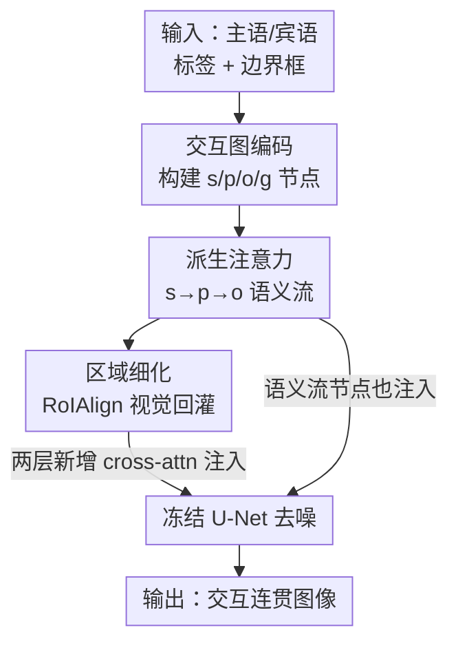

# Semantic Derivative Flow: Graph-Guided Diffusion for Controllable Instance Interactions

**会议**: CVPR 2026  
**论文**: [CVF Open Access](https://openaccess.thecvf.com/content/CVPR2026/html/Mei_Semantic_Derivative_Flow_Graph-Guided_Diffusion_for_Controllable_Instance_Interactions_CVPR_2026_paper.html)  
**代码**: 无  
**领域**: 图像生成 / 可控扩散  
**关键词**: 交互生成, 图引导扩散, 派生注意力, 人-物交互, 布局可控

## 一句话总结
把"主语→谓词→宾语"的交互关系建成一张有向无环交互图，提出"派生注意力"强制让谓词语义从主语派生、宾语语义从谓词派生，再用区域细化模块把视觉特征实时回灌图节点，从而在 HICODet 上生成语义连贯、空间合理的人-物交互图像，FID 与 HOI 检测 mAP 同时刷到 SOTA。

## 研究背景与动机

**领域现状**：文生图扩散模型（Stable Diffusion、SDXL）已经能产出高保真图像，加上 GLIGEN、InteractDiffusion 这类"额外条件"方法后，还能用边界框精确控制每个实例摆在哪里，布局可控这一层基本被解决了。

**现有痛点**：但"把人和箱子分别放对位置"和"让人真的在搬箱子"是两回事。现有方法把实例当成各自独立、各自条件于自己框的个体，能保证空间临近，却经常生成物理上不合理、语义上不连贯的交互——人和箱子挨在一起但姿态完全不像在搬。InteractDiffusion 虽然把交互形式化成 (主语, 谓词, 宾语) 三元组注入扩散，但它只是把三个 embedding 拼接或相加，没有真正建模交互内在的语义依赖链条。

**核心矛盾**：问题有两层。其一，CLIP 这类预训练文本编码器是"名词中心"的，谓词（动词如 carrying）的表征天然偏弱，常常和它的主语、宾语在语义上脱节。其二，更根本地，现有条件范式缺少一种机制去强制"一个实例的生成过程在功能和语义上依赖于另一个实例"——逻辑链断了，模型只能统计式地近似交互，而不是结构化地推理交互。

**本文目标**：让生成过程沿着交互的逻辑链走，把"谁对谁做了什么"的依赖关系直接编码进扩散过程，既保真又可控，尤其要在长尾稀有交互上不崩。

**切入角度**：作者提出一个理论假设——一个连贯的交互可以形式化为跨结构图的"语义派生流"（Semantic Derivative Flow）。谓词的语义表征应当从主语函数式地派生而来，宾语的表征又从谓词派生而来，构成有向无环图 $s \rightarrow p \rightarrow o$，边代表可微的语义依赖。

**核心 idea**：用一个"派生注意力"机制在交互图上做结构化消息传递，强制谓词 = f(主语)、宾语 = f(谓词)，再加全局上下文节点和实时区域反馈，把抽象的语义图落地到扩散去噪过程里。

## 方法详解

### 整体框架

SDF 建立在冻结的潜空间扩散模型（SD1.5 / SDXL）之上，只训练新插入的图条件注入层。给定一条交互（主语标签+框、宾语标签+框），方法分三步：先把主语 $s$、谓词 $p$、宾语 $o$ 和一个全局节点 $g$ 编码成交互图的初始节点特征；再用派生注意力沿 $s\rightarrow p\rightarrow o$ 的边做自顶向下的语义传递，得到语义流过后的节点表征 $f_I$；最后用区域细化模块从当前去噪潜变量里抠出每个节点框对应的视觉特征，自底向上回灌节点，得到既懂语义计划、又看到当前画面的节点表征 $k_I$。两套图节点（语义流后的 $e_I$ 和视觉细化后的 $k_I$）各通过一层新增的 cross-attention 注入去噪 U-Net，与原始文本条件协同指导生成。

整体上这是一个"自顶向下语义计划 + 自底向上视觉反馈"双向闭环的 pipeline：

### 关键设计

**1. 交互图编码：把 (主语,谓词,宾语) 变成带框、带角色的图节点**

现有方法把谓词当成和主、宾平级的另一个 token 注入，但谓词没有自己的边界框、语义又弱，模型很难把"动作"落到画面具体哪块区域。SDF 先给整张交互图搭骨架：顶点集 $V=\{s,p,o,g\}$ 含主语、谓词、宾语和一个全局上下文节点，边集定义了语义流通路 $s\rightarrow p\rightarrow o$ 以及各节点到全局节点的边。谓词没有标注框，作者用主、宾框做"between"运算取中间区域再按比例 $\zeta$ 外扩得到 $b_p=\mathrm{Expand}(\mathrm{BBox\text{-}Between}(b_s,b_o),\zeta)$，让谓词区域和主、宾框充分重叠（直觉是：动作发生处必然和两个参与者有交叠，画面才真实）；全局框 $b_g$ 取包住三者的最小外接框。每个节点用 CLIP 文本编码标签、用 Fourier 编码框坐标，再过按节点类型分化的 MLP 融合，得到初始节点特征 $f_s,f_p,f_o,f_g$（其中 $f_g$ 拼接了三个标签的文本嵌入以刻画整体交互语义）。

**2. 派生注意力：用门控消息传递强制"谓词从主语派生、宾语从谓词派生"**

这是全文核心，针对的就是"谓词表征弱、和主宾脱节"的痛点。标准 cross-attention 是对称交换信息，而这里要的是**有方向的函数依赖**：目标节点 $v$ 的表征必须由源节点 $u$ 引导出来。对一条有向边 $(u\rightarrow v)$，从源节点取 query、从目标节点取 key/value：$Q=W_Q f_u,\ K=W_K f_v,\ V=W_V f_v$，再用一个以源-目标兼容性为条件的门控函数调制 value：

$$\mathrm{Guide}(f_u,f_v)=\sigma\!\big(\mathrm{MLP}_{gate}([Q,K])\big)\odot V$$

其中 $\sigma$ 是 sigmoid、$\odot$ 是逐元素乘。这个门学会**选择性放大 $v$ 中那些语义上依赖于 $u$ 的特征**，等于在 $v$ 上注入"我应该跟着 $u$ 走"的先验。沿派生链顺序施加：$f^{Gs}_{p}=\mathrm{Guide}(f_s,f_p)$（主语引导谓词），$f^{Gp}_{o}=\mathrm{Guide}(f'_p,f_o)$（谓词再引导宾语），全局节点则聚合所有节点 $f'_g=\mathrm{MLP}_{agg}([f_s,f^{Gs}_p,f^{Gp}_o,f_g])$。最后再像 InteractDiffusion 那样加上实例嵌入 $q_I$ 和角色嵌入 $r$，得到交互关联 token $e_I=f_I+q_I+r$。作者用信息论给了理论支撑（Thm 4.1）：派生后 $I(f_s;f'_p)\ge I(f_s;f_p)$、$I(f'_p;f'_o)\ge I(f_p;f_o)$，即这套机制确实提升了链条上相邻节点的互信息，补偿了文本编码器给出的弱谓词表征。

**3. 区域细化 + 双路注入：把自顶向下的语义计划锁回当前画面**

光有语义计划还不够——计划是静态的，而去噪过程中的画面在不断变化，二者可能渐渐脱节。区域细化模块给出一个自底向上的反馈回路：对节点 $v$ 及其框 $b_v$，从当前噪声潜变量 $z_t$ 用 RoIAlign 抠出区域特征 $z_{b_v}=\mathrm{RoIAlign}(z_t,b_v)$，全局平均池化后与语义细化嵌入 $f'_v$ 融合成视觉感知表征 $k_v=\mathrm{MLP}_{region}([f'_v,\mathrm{GAP}(z_{b_v})])$。于是每个去噪 block 里向 U-Net 注入两套图条件：先注语义流节点 $e_I$、再注视觉感知节点 $k_I$，配合可学习门控 $\gamma_1,\gamma_2$ 和全局强度 $\eta$：

$$v \leftarrow v+\eta\tanh(\gamma_1)\,\mathrm{TS}(\mathrm{CrossAttn}(v,e_I)),\quad v \leftarrow v+\eta\tanh(\gamma_2)\,\mathrm{TS}(\mathrm{CrossAttn}(v,k_I))$$

其中 $\mathrm{TS}$（token selection）保证只更新图像 token、不污染其它条件信号。原 U-Net 权重全程冻结，只训这两层注入，既稳定又保住了预训练先验。推理时还有个小技巧：前 $\tau T$ 步令 $\eta=1$ 用 grounding 引导，之后 $\eta=0$ 只靠文本，权衡画质与可控性。

### 损失函数 / 训练策略

训练目标仍是标准 LDM 的噪声预测损失 $L=\mathbb{E}\,\|\epsilon-\epsilon_\theta(z_t,t,\tau(c))\|_2^2$，作者证明加入图条件后它仍是合法的变分下界（Thm 4.3），收敛性不受影响。冻结 U-Net，只训练语义图注入层和视觉图注入层，在 HICODet 上跑 500k 步；Adam，学习率 $5\times10^{-5}$，前 10k 步线性 warmup，H800 训练。默认谓词框外扩比 $\zeta=0.1$、RoIAlign 输出尺寸 $1\times1$。

## 实验关键数据

### 主实验

在 HICODet 上评测保真度（FID/KID）与可控性（用预训练 FGAHOI 检测器测 HOI mAP）。下表为 FGAHOI Swin-Large、Default 设定下的对比（mAP 越高越好，FID/KID 越低越好）：

| 方法 | FID ↓ | KID ↓ | mAP-Full ↑ | mAP-Rare ↑ |
|------|-------|-------|-----------|-----------|
| SDXL（纯文本） | 30.43 | 0.01018 | 1.38 | 1.24 |
| GLIGEN | 18.82 | 0.00694 | 26.45 | 18.93 |
| InteractDiffusion | 18.69 | 0.00676 | 31.56 | 26.09 |
| SDF (Ours, SD1.5) | 18.58 | 0.00668 | 32.20 | 26.84 |
| **SDF (Ours, SDXL)** | **18.42** | **0.00656** | **33.55** | **28.03** |

可见 SDF 在保真和可控两端都领先；相比最接近的 InteractDiffusion，SDXL 版在 Full mAP 上 +1.99、Rare mAP 上 +1.94，**长尾稀有交互上的增益尤其明显**，印证了图结构先验对长尾的正则作用。和近期一批纯布局控制方法（TFLC / NoiseCollage / MIGC / ControlNet++ / BuildAScene）相比（Tab.2），它们 FID 在 18.6~18.9、Full mAP 仅 21~28，SDF SDXL 的 30+ mAP 大幅胜出，说明"精确摆位"必要但不足以生成合理交互。10 人主观打分（Tab.3）也是 SDF 最高：保真 8.8、可控 8.6，优于 InteractDiffusion 的 8.2 / 8.0。

### 消融实验

逐个移除组件（FGAHOI Swin-Large、Default、Full）：

| 配置 | FID ↓ | KID ↓ | HOI Score ↑ | 说明 |
|------|-------|-------|------------|------|
| Full model | 18.58 | 0.00668 | 32.20 | 完整模型 |
| w/o 全局节点 | 18.64 | 0.00671 | 32.08 | 缺整体语境，一致下降 |
| w/o 谓词框外扩 | 18.61 | 0.00669 | 32.16 | 用未扩框，交互区重叠不足 |
| w/o 派生注意力 | 18.65 | 0.00673 | 31.87 | 改回独立编码 s/p/o，掉点最多 |
| w/o 区域细化 | 18.61 | 0.00671 | 32.02 | 没视觉反馈，语义流与画面脱节 |

⚠️ 表中各行与具体组件的对应是按原文描述与数值推断的，确切勾选以原表为准。

### 关键发现
- **派生注意力贡献最大**：把它换回对 s/p/o 的独立编码后，FID 升到 18.65、HOI Score 掉到 31.87（全表最差），直接验证了 Thm 4.1 关于互信息提升的论断——强制派生关系是语义连贯的关键。
- **区域细化不可省**：去掉后明显退化，说明只有静态语义计划、没有去噪过程中的实时视觉反馈，计划会和不断变化的画面脱节。
- **谓词框外扩比 $\zeta$ 适中最好**：$\zeta=0.1$ 时 Full mAP 30.14；外扩过大（0.20）会稀释交互信号反而掉点；RoIAlign 输出尺寸 $1\times1$ 到 $3\times3$ 几乎无差别，默认用 $1\times1$ 省参数。

## 亮点与洞察
- **把语言学的"依存方向"搬进扩散条件**：用有向无环图 $s\rightarrow p\rightarrow o$ 显式刻画交互的派生链，并用门控注意力把"对称交换"改成"有方向的函数派生"，是个干净且可迁移到任意结构化条件生成（场景图、布局图）的思路。
- **理论与工程闭环**：门控 $\mathrm{Guide}$ 既是一个轻量实现，又被信息论分析（互信息单调不减、泛化界、收敛保持）撑住，少见地把"为什么有效"讲到了可证的程度。
- **谓词框的 between+expand 构造**很实用：在没有谓词标注框的情况下，用主宾框中间区域并外扩来定位"动作发生处"，可直接复用到其它需要给关系/动作定位的任务。
- **自顶向下计划 + 自底向上反馈的双向回路**：RoIAlign 把当前去噪潜变量回灌图节点，让条件随生成进程动态更新，是比"一次性注入静态条件"更鲁棒的范式。

## 局限与展望
- 依赖 (主语, 谓词, 宾语, 框) 形式的交互标注，这类细粒度数据获取成本高，限制了适用范围。
- 作者承认生成的交互可能"过于理想化"，缺少真实世界的多样性与噪声。
- 当前图只建模两个交互实例（一对 s-o），扩展到多关系、多实例的复杂场景是明确的未来工作。
- ⚠️ 理论部分（泛化界、收敛性）只给了定理陈述，证明在补充材料中，正文无法核验其严谨度。

## 相关工作与启发
- **vs InteractDiffusion**：两者都用 (主语,谓词,宾语) 三元组，但 InteractDiffusion 只是拼接/相加三个 embedding，SDF 用派生注意力强制谓词从主语派生、宾语从谓词派生，建模了三元组内部的依赖方向；实验上 Full/Rare mAP 都明显更高，长尾增益更大。
- **vs GLIGEN / 布局控制方法（MIGC、ControlNet++ 等）**：它们解决"实例摆在哪"，但把实例当独立个体，不建模实例间关联；SDF 论证了"空间可控是必要非充分条件"，补上语义关系 grounding 后 mAP 大幅领先。
- **vs 标准 cross-attention 条件注入**：标准注意力对称交换信息，SDF 的门控 $\mathrm{Guide}$ 是非对称的、带方向的派生，更契合"交互有逻辑链"这一结构先验。

## 评分
- 新颖性: ⭐⭐⭐⭐ 把交互的语义派生方向显式建成图+门控注意力，角度新且有理论包装。
- 实验充分度: ⭐⭐⭐⭐ HICODet 上主对比/布局方法对比/主观评测/多项消融齐全，但只在单一基准、两实例设定下验证。
- 写作质量: ⭐⭐⭐⭐ 动机—方法—理论—实验链条清晰，公式与图示完整。
- 价值: ⭐⭐⭐⭐ 为可控交互生成提供了可迁移的图引导范式，对结构化条件生成有借鉴意义。

<!-- RELATED:START -->

## 相关论文

- [\[CVPR 2026\] Semantic Scale Space: A Framework for Controllable Image Abstraction](semantic_scale_space_a_framework_for_controllable_image_abstraction.md)
- [\[CVPR 2026\] Breaking Semantic Boundaries: Distribution-Guided Semantic Exploration for Creative Generation](breaking_semantic_boundaries_distribution-guided_semantic_exploration_for_creati.md)
- [\[CVPR 2026\] GrOCE: Graph-Guided Online Concept Erasure for Text-to-Image Diffusion Models](groce_graph-guided_online_concept_erasure_for_text-to-image_diffusion_models.md)
- [\[ICLR 2026\] HOG-Diff: Higher-Order Guided Diffusion for Graph Generation](../../ICLR2026/image_generation/hog-diff_higher-order_guided_diffusion_for_graph_generation.md)
- [\[CVPR 2026\] Few-Step Diffusion Sampling Through Instance-Aware Discretizations](few-step_diffusion_sampling_through_instance-aware_discretizations.md)

<!-- RELATED:END -->
