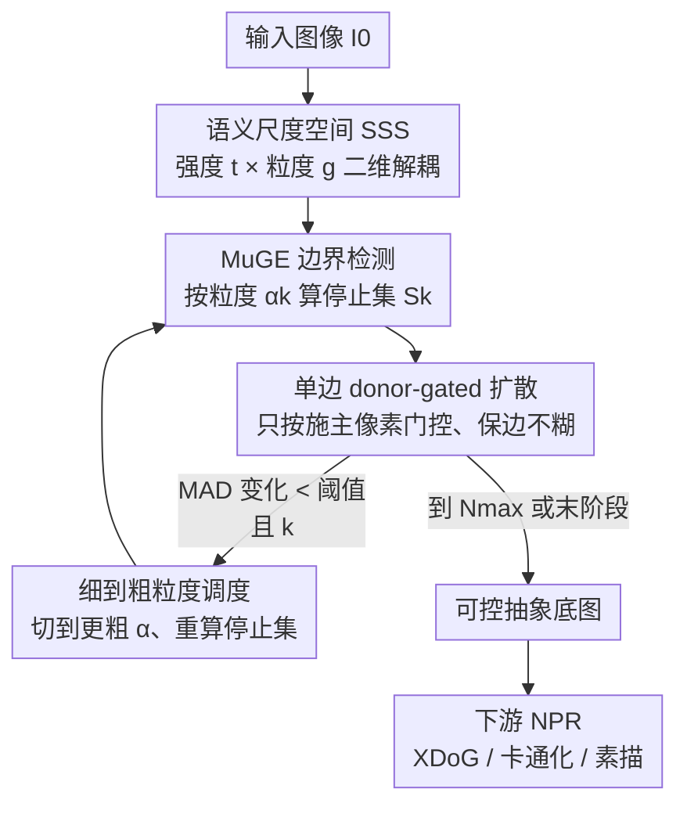

# Semantic Scale Space: A Framework for Controllable Image Abstraction

**会议**: CVPR 2026  
**论文**: [CVF Open Access](https://openaccess.thecvf.com/content/CVPR2026/html/Mishiba_Semantic_Scale_Space_A_Framework_for_Controllable_Image_Abstraction_CVPR_2026_paper.html)  
**代码**: 无  
**领域**: 图像生成 / 非真实感渲染（NPR）  
**关键词**: 图像抽象, 可控平滑, 语义边界, 各向异性扩散, 风格化

## 一句话总结
本文把"图像抽象"重新表述成一个由**平滑强度** $t$ 和**语义粒度** $g$ 张成的二维空间（Semantic Scale Space, SSS），用一个可控边界检测器把"该保留哪些结构"这件事从平滑过程里**外化**出来，并给出一个具体的遍历策略 AGSS（单边 donor-gated 扩散 + 细到粗粒度调度），在等量平滑下比经典基线保留更多语义边界、几何漂移更小，下游 NPR 风格化结果也被用户显著更偏好。

## 研究背景与动机
**领域现状**：非真实感渲染（NPR）/ 图像抽象的目标是把照片简化成"干净"的风格化底图——去掉细碎纹理、保留人眼觉得重要的轮廓。主流做法分三类：经典保边滤波（双边滤波、引导滤波、各向异性扩散）、全局优化平滑（WLS、L0 梯度最小化、RTV），以及端到端学习模型。

**现有痛点**：这些方法暴露给用户的控制都太"纠缠"。通常只有一两个像"强度旋钮"的耦合参数：你想多去纹理，就只能把旋钮往大拧，结果连带把重要轮廓也磨没了。换句话说，**"平滑要进行到多深"和"哪些结构必须保住"这两件事被绑死在同一个标量里**，用户没法分开指定。

**核心矛盾**：根本原因是这些方法的"停止集"（stopping set——决定哪些边界会阻止平滑扩散）要么来自低层图像统计（梯度大小），要么是一张固定的语义边图。低层线索分不清"高对比度纹理"和"语义边界"，固定边图又不能让用户调节保留结构的粗细。于是平滑强度和被保留结构的尺度始终耦合，只能走一条一维的抽象路径。

**本文目标**：把抽象过程拆成两个**可独立调节**的坐标轴——强度（平滑走多远）和粒度（保留哪些边界）——并给出一个能真正在这个二维空间里游走、且对下游风格化友好的具体算法。

**切入角度**：作者注意到，与其在风格化算子内部硬调参数，不如**在输入端**先准备一张"被选择性抽象过的底图"，让任意下游 NPR 管线直接消费。这样风格化阶段看到的是干净输入、行为更可预测，用户也能在风格化前就调好"想要多简化"。

**核心 idea**：用一个带连续粒度参数的现代语义边界检测器（MuGE）把"停止集"外化出来，从而把"保留什么（停止集）"和"平滑多少（强度）"彻底解耦；再配一个细到粗的遍历策略，先去纹理、再合并区域、始终保住显著轮廓。

## 方法详解

### 整体框架
方法分两层：**SSS 是空间定义，AGSS 是在这个空间里的一条具体行走路线**。SSS 把从输入 $I_0$ 出发生成的一族图像写成 $I(t,g)$，$(t,g)$ 就是二维抽象空间的坐标——$t\ge 0$ 控制平滑进度，$g\in G$ 通过参数化一个边界检测器产生停止集 $S_g$，决定哪些结构充当"扩散的墙"。作者还为这个空间提出四条良态性质：P1 连续性、P2 区域单调平滑（非边界区局部方差不随 $t$ 增大）、P3 语义选择性（细纹理先于主结构被抹掉、边界位移有界）、P4 接地性（从原图出发、向简化态收敛）。

AGSS 则给出在该空间里"怎么走"：预设一个**细到粗的粒度调度** $G=[\alpha_1,\dots,\alpha_K]$，每到一个粒度阶段就用 MuGE 从原图算一张边界图、固定住，然后在该粒度下反复做**单边 donor-gated 平滑更新**推进强度 $t$；当某阶段平滑趋于停滞（用 MAD 变化量判据）就切到更粗的粒度。最终产出的抽象底图喂给下游 XDoG 线稿、白盒卡通化、艺术素描等 NPR 管线。

### 关键设计

**1. 语义尺度空间 SSS：把"保留什么"从"平滑多少"里外化出来**

痛点很直接：旧方法的停止集藏在算子内部，平滑强度一调、被保留结构的尺度也跟着变，用户无从分开控制。SSS 的做法是显式引入两个坐标轴——强度 $t$ 在固定算子下控制平滑进度，粒度 $g$ 则去**参数化一个生成停止集 $S_g$ 的过程**（即边界检测器）。关键点在于：改变 $g$ 改变的是"哪些边界算墙"这件事本身，而不是平滑走多远。于是抽象被写成连续族 $I(t,g)$，"保留什么（停止集 $S_g$）"和"平滑多少（强度 $t$）"被放到正交的两个轴上。作者用四条性质 P1–P4 给这个空间立规矩，其中 P3 语义选择性（细纹理的去除应**先于**主结构退化，边界位移有界）正是整套框架想要争取、而旧方法只能部分满足的东西。

**2. 单边 donor-gated 更新：打破对称权重，扩散到边界就"踩刹车"**

一个自然的实现是把语义抽象建成各向异性扩散 PDE $\frac{\partial I}{\partial t}=\nabla\cdot\!\big(D_g(x)\nabla I\big)$，其中传导场 $D_g$ 在语义区内高（允许扩散）、在边界处低（阻止扩散），数值上就退化成"加权邻域平均"。但标准离散化得到的是**对称**权重 $w(x,y)=w(y,x)$，对称平均天生会糊边——哪怕强度不大，也会跨边界混合、把结构边界软化，强度越大越糊。

本文的关键是**打破这个对称性**：权重只由"提供数值的那个像素（施主 donor）"的性质来门控，定义单边权重

$$\omega_g(y\to x)=\eta(x,y)\,A_g(y),\quad A_g(y)=1-S_g(y)$$

其中 $\eta(x,y)$ 是支撑在 9 点邻域 $N_8^+(x)$（自身 + 8 邻接）上的空间核（实现里就取固定 $3\times3$ 均匀核），$A_g(y)$ 是施主位置的"语义通行权重"——边界似然 $S_g$ 越高、通行权重越低。逐像素归一化更新为

$$I^{(t+1)}(x)=\frac{\sum_{y\in N_8^+(x)}\omega_g(y\to x)\,I^{(t)}(y)+\xi\,I^{(t)}(x)}{Z_g(x)},\quad Z_g(x)=\sum_{y\in N_8^+(x)}\omega_g(y\to x)+\xi$$

为什么有效：只有处于连贯区域内（$A_g(y)$ 高）的施主才显著贡献；一旦施主落在强边界上，它的低 $A_g(y)$ 就压住了它对接收像素 $x$ 的影响，从而**最小化跨边界混合**。加一个极小自权重 $\xi=10^{-6}$ 相当于每个像素一个微小自环，保证当邻居通行权重全为零时更新接近恒等，且整个算子是非负系数、和为一的凸组合——因此稳定、非膨胀（永不放大变化）。由于 $Z_g$ 只依赖 $A_g$，每个粒度阶段只需预计算一次。

**3. AGSS 遍历策略：细到粗的粒度调度 + MAD 自适应换挡**

有了空间和算子，还得规定"怎么在空间里走"。AGSS 沿预设的细到粗调度 $G=[\alpha_1,\dots,\alpha_K]$（实验里固定为 MuGE 的 $\alpha$ 取值 $[3,2,1,0]$）逐阶段推进：阶段 $k$ 用原图算 $S_k=\text{MuGE}(I_0;\alpha_k)$、令 $A_k=1-S_k$，固定该粒度反复做上面的 donor-gated 更新。

阶段切换由一个**自适应判据**驱动：设 $\text{MAD}_t$ 为相邻两次迭代 $I^{(t)}$ 与 $I^{(t-1)}$ 的平均绝对差，$\Delta\text{MAD}_t=|\text{MAD}_t-\text{MAD}_{t-1}|$；阶段阈值取衰减形式 $\delta_{\text{target}}(k)=\delta_{\text{base}}\,r_{\text{decay}}^{\,k-1}$（$r_{\text{decay}}\in(0,1)$，随 $k$ 减小）。当 $\Delta\text{MAD}_t<\delta_{\text{target}}(k)$ 且 $k<K$ 时切到更粗粒度。这个衰减阈值不是装饰——因为粒度越粗、更新本身就越小，若用固定阈值，后期阶段几次迭代就触发停止；衰减让停止判据在后期不至于"几乎立刻满足"。到最后阶段 $k=K$ 时只监测不触发，整个过程靠全局迭代上限 $N_{\max}$ 收尾。这条"先细后粗"的路线正好对应 P3：先抹掉细纹理，再逐步合并区域，同时把显著边界一直留在原地。

**4. RHI effect-matched 评测协议：在"等量平滑"下才公平比选择性**

不同方法的"强度"参数语义各异，直接对比谁保边好是不公平的——可能只是一方平滑得更狠。本文引入一个**与方法无关的区域同质性指数（Region Homogeneity Index, RHI）**，从线性亮度的局部方差计算，用来量化"到底平滑了多少"。评测时对每张图、每个目标平滑档（弱/中/强），**只调每个方法的强度参数**去匹配同一个 RHI 目标，其余粒度相关参数固定。如此一来，所有方法都在"平滑效果对齐"的前提下比较边界保留和几何保真，选择性的差异才真正归因于算子本身、而非平滑量多寡。作者还特意为每个基线分离出"强度参数"与"粒度参数"（如 WLS 的正则权重 $\lambda$ 当强度、空间亲和 $\alpha_{\text{wls}}$ 当粒度固定），让对比尽量偏向基线。

## 实验关键数据

### 主实验（E1：SBD 上的 effect-matched 选择性）
在 SBD 测试集（650 张）上，在弱/中/强三个对齐的 RHI 档下报告边界保留 F1（BPF-ODS↑）和几何漂移（对称 Chamfer 距离 Drift, px↓）。AGSS 在中、强档全面领先；弱档与基线相当。

| 方法 | 弱 BPF↑ | 弱 Drift↓ | 中 BPF↑ | 中 Drift↓ | 强 BPF↑ | 强 Drift↓ |
|------|---------|-----------|---------|-----------|---------|-----------|
| WLS | 0.529 | 86.61 | 0.541 | 84.92 | 0.545 | 85.65 |
| PM | 0.529 | 86.78 | 0.533 | 86.92 | 0.526 | 85.85 |
| GF-it | 0.529 | 87.51 | 0.538 | 87.77 | 0.542 | 87.89 |
| DT+MuGE | 0.497 | 92.45 | 0.535 | 89.04 | 0.555 | 88.97 |
| **AGSS（本文）** | **0.535** | **86.76** | **0.575** | **83.91** | **0.594** | **82.98** |

强档下 AGSS 的 BPF 达 0.594（相对三个经典基线均值 +10.5%），Drift 降低 4.0%。

### 关键对照与下游用户研究（E2）

| 对比项 | 结果 | 说明 |
|--------|------|------|
| AGSS 自身随强度变化 | BPF 从 0.535→0.594（+11.0%） | 基线在强档停滞甚至退化，AGSS 反而**越平滑越保边**，印证"先去纹理后并区域"的调度 |
| vs DT+MuGE | 强档 0.594 vs 0.555 | 二者用**同一套** MuGE 边界线索，差距只能归因于平滑算子（donor-gating），而非边界质量 |
| 下游 2AFC 用户偏好 | **72.9%** 选 AGSS（95% CI [68.5, 76.9], $p<.001$） | DIV2K 上把弱/强抽象底图喂给 XDoG / 白盒卡通化 / 艺术素描，24 名被试、432 次选择，三个应用、每个基线上都显著偏好 AGSS |

### 关键发现
- **最反直觉的一点**：基线随着抽象变强、保边分数停滞或下滑，而 AGSS 的 BPF 随强度单调上升——这是细到粗调度的直接证据，说明它确实在"先抹纹理、再合并、保住主轮廓"。
- **donor-gating 的贡献被干净地隔离**：DT+MuGE 用了相同的 MuGE 边界，但仍落后，证明增益来自"停止集如何被使用"而非"边界检测本身"。
- 有些方法（L0 平滑、部分推理期可控性弱的学习型平滑器）因为**够不到目标 RHI 档**被排除在主对比外——侧面说明强度可控范围本身就是这类任务的难点。

## 亮点与洞察
- **把"抽象"重写成二维空间是最漂亮的一步**：强度 × 粒度的解耦不只是工程参数拆分，而是配上 P1–P4 四条性质后成了一个有定义、可分析的框架，旧方法都能被映射进来打分（Table 1），这种"统一坐标系"的视角很有迁移价值。
- **单边 donor-gated 更新是个可复用的小 trick**：对称邻域平均必糊边，只用施主侧门控就破了对称、且保证凸组合稳定非膨胀——任何基于邻域平均的平滑/扩散都能借这招少糊边界。
- **"先准备干净底图、再交给任意风格化器"的范式**很实用：它把可控性挪到输入端，下游 NPR 不用改，用户在风格化前就能调好简化程度，对创意工具链友好。
- **effect-matched + RHI 的评测思路值得借鉴**：凡是"强度语义不一致"的方法对比（去噪、平滑、压缩），都可以用一个方法无关的效果指标对齐后再比质量，避免"谁平滑得狠谁占便宜"。

## 局限与展望
- 作者自承：可达到的语义选择性**取决于边界检测质量**——MuGE 漏检或误检会直接传导到停止集，整条管线的上限被边界检测器锁死。
- 粒度调度 $G=[3,2,1,0]$ 是**固定预设**、对所有图像一视同仁，没有内容自适应；复杂场景可能需要不同的细到粗节奏。作者把"内容自适应遍历策略"列为未来工作。
- 评测里 P1/P2/P4 的验证放在补充材料、属于"sanity check"性质，正文主打 P3；几何漂移用 Canny 边图 + Chamfer 距离衡量，本身也受 Canny 参数影响。
- 方法定位是"为下游风格化造底图"，本身不产出最终风格，价值高度依赖与下游 NPR 管线的配合；脱离风格化场景时单独的"抽象底图"实用性有限。

## 相关工作与启发
- **vs 经典保边滤波（双边/引导滤波、各向异性扩散、Semantic Filtering）**：它们提供连续强度（P1）、非边界区方差递减（P2），但停止判据绑在低层统计或单张固定语义边图上，分不清高对比纹理与语义边界，用户也调不了保留结构的粒度，语义选择性（P3）弱。本文把停止集外化并加上独立粒度轴。
- **vs 全局优化平滑（WLS / L0 / RTV）**：用单个标量权重隐式决定"哪算结构、哪算纹理"，去纹理越多就越伤细结构，且只有一维抽象路径（只沿强度满足 P1，没有独立粒度轴）。本文是真正的二维空间 + 显式遍历策略。
- **vs 学习型抽象/风格化（神经风格迁移、卡通化、可控平滑器）**：多为黑盒一次性映射，控制限于少数纠缠超参，推理期没有可遍历的抽象轨迹。本文与之**互补**——SSS 定义可控抽象空间，AGSS 给出风格无关的遍历，产出干净底图供任意下游模型消费。
- **vs 语义/粒度边界检测（HED / BDCN / MuGE）**：这些是 AGSS 的"零件"而非抽象方法本身——它们只给边界似然、不规定怎么平滑、怎么跨粒度推进。本文把可控边界图用作框架里的停止集，平滑动力学交给 AGSS。

## 评分
- 新颖性: ⭐⭐⭐⭐ 把图像抽象重述为"强度×粒度"二维空间并外化停止集，配 donor-gated 单边更新，框架视角清晰且确有新意。
- 实验充分度: ⭐⭐⭐⭐ effect-matched 协议设计严谨，DT+MuGE 消融干净隔离了算子贡献，用户研究统计显著；但缺与更多学习型方法的正面对比（部分因够不到 RHI 档被排除）。
- 写作质量: ⭐⭐⭐⭐ P1–P4 性质化表述把框架讲得很有条理，公式与算法清楚，图示直观。
- 价值: ⭐⭐⭐⭐ 给 NPR 创意工具链提供了实用的"可控底图"范式，框架与 RHI 评测思路均可迁移，受限于依赖边界检测质量。

<!-- RELATED:START -->

## 相关论文

- [\[CVPR 2026\] Scale Space Diffusion：把尺度空间塞进扩散过程](scale_space_diffusion.md)
- [\[CVPR 2026\] Unified Latent Space for Understanding and Generation via Semantic Auto-encoder](unified_latent_space_for_understanding_and_generation_via_semantic_auto-encoder.md)
- [\[CVPR 2026\] PortraitDirector: A Hierarchical Disentanglement Framework for Controllable and Real-time Facial Reenactment](portraitdirector_a_hierarchical_disentanglement_framework_for_controllable_and_r.md)
- [\[CVPR 2026\] Semantic Derivative Flow: Graph-Guided Diffusion for Controllable Instance Interactions](semantic_derivative_flow_graph-guided_diffusion_for_controllable_instance_intera.md)
- [\[CVPR 2026\] RDF-MIG: A Robust Diffusion Framework for Masked Image Generation to Augment Semantic Segmentation and Change Detection](rdf-mig_a_robust_diffusion_framework_for_masked_image_generation_to_augment_sema.md)

<!-- RELATED:END -->
