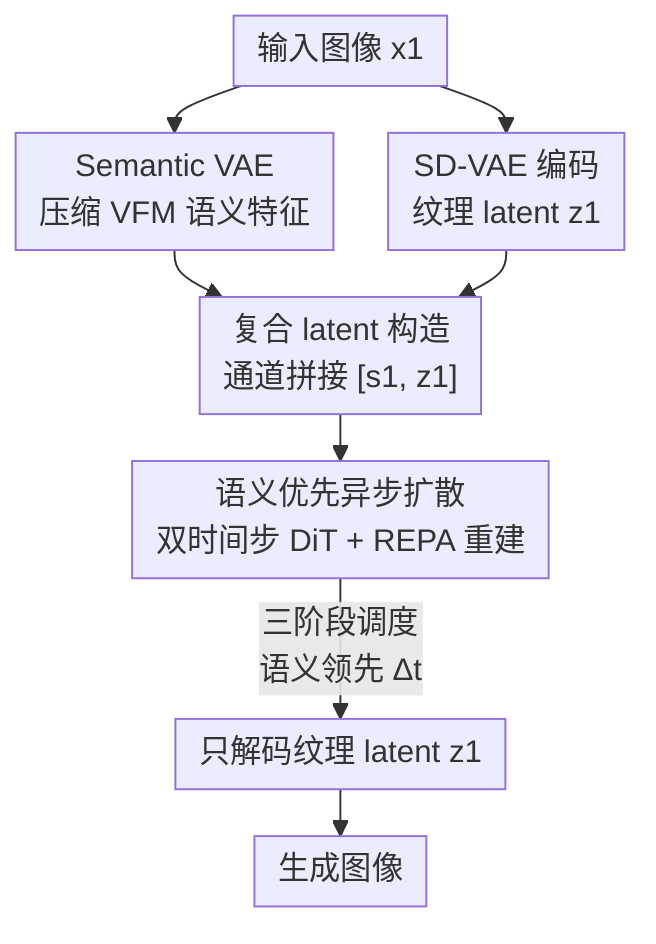

# Semantics Lead the Way: Harmonizing Semantic and Texture Modeling with Asynchronous Latent Diffusion

**会议**: CVPR 2026  
**论文**: [CVF Open Access](https://openaccess.thecvf.com/content/CVPR2026/html/Pan_Semantics_Lead_the_Way_Harmonizing_Semantic_and_Texture_Modeling_with_CVPR_2026_paper.html)  
**代码**: https://yuemingpan.github.io/SFD.github.io/ (项目页)  
**领域**: 扩散模型 / 图像生成  
**关键词**: 潜在扩散, 语义优先, 异步去噪, 语义VAE, 收敛加速

## 一句话总结
SFD 把潜在扩散里的语义和纹理拆成两路 latent，用各自独立的噪声调度让语义比纹理"早一步"去噪、充当结构蓝图来引导纹理细化，在 ImageNet 256×256 上把 FID 推到 1.04，并把训练收敛速度相比 DiT 加快约 100×。

## 研究背景与动机

**领域现状**：潜在扩散模型（LDM）是当前图像生成的主力——VAE 先把图像压成 latent，再让扩散 Transformer（DiT/SiT 等）在 latent 空间里建模分布。最近一批工作发现，给扩散注入预训练视觉编码器（DINOv2 等）的判别性语义先验能显著加速收敛、提升质量，做法包括把语义和 VAE latent 对齐（REPA / REPA-E）、或把语义和纹理拼起来联合建模（REG / ReDi）。

**现有痛点**：标准 VAE 是为像素级重建优化的，latent 里塞满了低层纹理特征。于是扩散模型背上一个互相打架的目标——既要在同一个 latent 里学会高层语义结构，又要保住低层纹理细节，结果就是收敛慢、生成质量打折。而上面那些注入语义的方法，虽然引入了语义先验，却仍然让语义和纹理在**同一噪声水平上同步去噪**，没有区别对待。

**核心矛盾**：扩散本质是 coarse-to-fine 的——它天然先生成低频结构、再补高频纹理，语义结构本就比细节纹理"稍微早一点"成形。但"同步去噪"的范式无视了这个时间顺序，等于让蓝图和精装修同时从混沌里冒出来。

**本文目标**：把"语义先成形、再引导纹理"这件事显式地写进生成流程，同时避免硬性"先生成完语义再生成纹理"带来的训练-推理失配（类似 teacher forcing 的 exposure bias——训练时喂真值语义，推理时只能靠自己不完美的预测，性能崩）。

**切入角度**：作者从扩散的 coarse-to-fine 本性出发——既然语义本来就该领先，那就让语义 latent 在一个**更干净的噪声水平**上演化，始终领先纹理一个固定的时间偏移 $\Delta t$，而不是要么完全同步、要么完全串行。

**核心 idea**：构造"语义 + 纹理"的复合 latent，并让两路 latent 用**错开的噪声调度异步去噪**（语义领先纹理 $\Delta t$），语义当蓝图引导纹理细化，既保留早期语义稳定的好处，又维持两者协同优化。

## 方法详解

### 整体框架

SFD（Semantics-First Diffusion）的输入是一张图像（训练时）/ 类别标签（推理时），输出是生成图像。它由两大件拼起来：① **复合 latent 构造**——用一个专门的 Semantic VAE（SemVAE）把视觉基座模型的语义特征压成紧凑 latent，和 SD-VAE 编出的纹理 latent 沿通道拼接；② **语义优先的异步扩散**——一个 DiT 骨干同时吃带不同噪声水平的语义/纹理 latent 和它们各自的时间步，预测两路速度场，推理时按三阶段调度让语义先于纹理去噪。整条流程在标准 flow-matching 框架下训练，最后**只解码纹理 latent** 得到图像，语义 latent 用完即弃。

### 关键设计

**1. Semantic VAE：把高维语义特征压成与扩散兼容的紧凑 latent**

直接把 DINOv2 这类视觉基座模型（VFM）的 patch 特征塞进扩散并不划算——维度高、噪声调度不友好。SemVAE 用一个 Transformer 结构的 VAE 专门解决"语义压缩但不丢信息"：冻结的 VFM $f(\cdot)$ 抽出 patch 级语义特征 $f_s = f(x_1) \in \mathbb{R}^{L\times C_{in}}$，编码器（线性投影 + 4 个 Transformer block + LayerNorm + 输出线性层）映射到低维高斯分布参数 $h_s = E_s(f_s) \in \mathbb{R}^{L\times 2C_s}$，再切成均值方差、用重参数化采样得到语义 latent $s_1 = \mu + \sigma \odot \epsilon$。解码器镜像结构把 $s_1$ 重建回 VFM 特征 $\hat f_s$。

训练目标兼顾保真和方向对齐：MSE 损失 $L_{MSE} = \|\hat f_s - f_s\|^2$ 管重建精度，余弦相似损失 $L_{cos} = 1 - \frac{\hat f_s \cdot f_s}{\|\hat f_s\|\|f_s\|}$ 管特征方向一致，再加一个很轻的 KL 正则 $L_{KL}$（权重 $\lambda_{kl}=10^{-7}$）约束 latent 空间，总损失 $L_{SemVAE} = L_{MSE} + L_{cos} + \lambda_{kl}L_{KL}$。SemVAE 仅 29M 参数，DINOv2-B 特征被压到 16 通道，且消融显示它显著好于 ReDi 用的 PCA 降维（FID 3.03 vs 4.06）——因为 VAE 比线性 PCA 更能保住语义完整性和空间布局。训练完后 SemVAE 冻结。

**2. 异步去噪 + 双时间步 DiT：让语义始终在更干净的噪声水平上领先纹理**

这是 SFD 的核心，直接对症"同步去噪无视 coarse-to-fine 顺序"的痛点。复合 latent $c = [s_1, z_1]$ 拼好后，训练时给语义和纹理**分配不同的时间步**：先从扩展区间采样语义时间步 $t_s \sim U(0, 1+\Delta t)$，纹理时间步由减去固定偏移得到 $t_z = \max(0, t_s - \Delta t)$，再把 $t_s$ 截断到 $\min(t_s, 1)$，保证 $t_s, t_z \in [0,1]$ 且 $t_s \ge t_z$。这就让语义 latent 在每一步都比纹理受更少噪声污染，从而能给纹理去噪提供更清晰的结构引导。

DiT 骨干 $v_\theta$ 一次吃进带各自噪声的复合 latent $[s_{t_s}, z_{t_z}]$、两个时间步 $[t_s, t_z]$ 和类别标签 $y$，同时预测两路速度 $[\hat v_s, \hat v_z] = v_\theta([s_{t_s}, z_{t_z}], [t_s, t_z], y)$。训练损失把语义、纹理两路的 flow-matching velocity loss 加权相加：$L_{vel} = \mathbb{E}[\|\hat v_z - (z_1 - z_0)\|^2 + \beta\|\hat v_s - (s_1 - s_0)\|^2]$（$\beta=2.0$）。这种"软异步"巧妙绕开了硬串行的麻烦——$\Delta t=1$ 时退化成 teacher-forcing 串行生成、出现训练-推理失配，$\Delta t=0$ 时退回普通同步去噪，而 $\Delta t=0.3$ 这个适中偏移取得最好 trade-off（FID 3.03）。

**3. REPA 重建对齐：把语义先验当成"可重建目标"而非外部蒸馏信号**

作者额外引入 REPA 表示对齐损失，但用法和原版不同。它把扩散 Transformer 的隐状态 $h_t = f_\psi([s_{t_s}, z_{t_z}], [t_s, t_z])$ 经投影头 $h_\phi$ 后，去对齐 VFM 输出 $y^* = f(x_1)$：$L_{REPA} := -\mathbb{E}[L_{sim}(y^*, h_\phi(h_t))]$。关键在于 $y^*$ 恰恰就是喂给 SemVAE 的那份语义表示，于是 $L_{REPA}$ 可以理解为把带噪语义 latent $s_{t_s}$ 重建回干净表示 $y^*$。相比原版 REPA 去蒸馏 VFM 的判别能力，这种从语义 latent 显式重建是个更可解的学习目标，更好地保住语义完整性、也更有效地利用语义知识。最终目标 $L_{total} = L_{vel} + \lambda L_{REPA}$（$\lambda=1.0$）。消融里 REPA 把 baseline 从 FID 8.17 拉到 7.08，再叠 SemVAE 到 5.24，最后叠语义优先机制到 3.03，逐项都有贡献。

**4. 三阶段去噪调度：用二值掩码切换"谁在去噪"，且不增加推理步数**

推理时 SFD 按三个阶段走（用两组二值掩码 $M_s, M_z$ 控制每一步更新哪路 latent）：① **语义初始化**（$t_s \in [0, \Delta t)$，$t_z=0$，掩码 $[1,0]$）——只去噪语义，先立起全局结构骨架；② **异步生成**（$t_s \in [\Delta t, 1]$，$t_z \in [0, 1-\Delta t)$，掩码 $[1,1]$）——语义纹理联合去噪但语义领先，持续给纹理提供更清晰引导；③ **纹理补全**（$t_s=1$，$t_z \in [1-\Delta t, 1]$，掩码 $[0,1]$）——语义已完全去噪，只让纹理继续抠细节。掩码后的更新速度 $\hat v = [M_s \odot \hat v_s, M_z \odot \hat v_z]$。值得注意：虽然把时间步范围扩了 $\Delta t$，但作者按比例拉大相邻步间隔、保持总扩散步数不变，所以**推理不需要额外步数**；最终也只把完全去噪的纹理 latent $z_1$ 解成图像。

## 实验关键数据

### 主实验

ImageNet 256×256，无 guidance 时的收敛对比（节选 Table 1，FID↓）：

| 模型 | 参数量 | 迭代数 | FID |
|------|--------|--------|------|
| DiT-XL/2 | 675M | 7M | 9.62 |
| LightningDiT-XL/1 + REPA | 675M | 4M | 5.84 |
| LightningDiT-XL/1 + SFD | 675M | 400K | **3.53** |
| LightningDiT-XL/1 + SFD | 675M | 4M | **2.54** |
| LightningDiT-B/1 + REPA | 130M | 400K | 21.45 |
| LightningDiT-B/1 + SFD | 130M | 400K | **10.40** |

SFD 在 400K 迭代就拿到 FID 3.53，比 REPA 跑满 4M 迭代（5.84）还低 2.31 分，训练成本仅 10%；要追平 DiT-XL@7M 和 LightningDiT-XL@4M，SFD 分别只需 70K / 120K 迭代，即 **100× / 33.3× 加速**。

带 guidance 的系统级对比（节选 Table 2，ImageNet 256×256）：

| 模型 | Epochs | 参数量 | FID↓ | sFID↓ | IS↑ |
|------|--------|--------|------|-------|------|
| DiT-XL | 1400 | 675M | 2.27 | 4.60 | 278.2 |
| REPA-E | 800 | 675M | 1.12 | 4.09 | 302.9 |
| ReDi | 800 | 675M | 1.61 | 4.66 | 295.1 |
| SFD (XL) | 80 | 675M | 1.30 | 3.87 | 233.4 |
| SFD (XL) | 800 | 675M | 1.06 | 3.89 | 267.0 |
| SFD (XXL) | 800 | 1.0B | **1.04** | 3.75 | 264.2 |

SFD 仅训 80 epoch 就（FID 1.30）超过 DiT-XL 训 1400 epoch（2.27），XXL 跑满 800 epoch 拿下 SOTA FID 1.04。

### 消融实验

| 配置 | FID↓ | 说明 |
|------|------|------|
| baseline | 8.17 | LightningDiT-XL@400K |
| + REPA | 7.08 | 仅加表示对齐 |
| + REPA + SemVAE | 5.24 | 引入语义 latent |
| + REPA + SemVAE + Semantic-First | **3.03** | 完整 SFD |

另外两组关键消融：① 语义压缩方式——SemVAE（FID 3.03）显著优于 ReDi 的 PCA（4.06）；② 时间偏移 $\Delta t$——$\Delta t=0$（同步）退化、$\Delta t=1.0$（串行 teacher-forcing）失配，$\Delta t=0.3$ 取得最低 FID 3.03。

### 关键发现
- **语义优先机制贡献最大**：从 SemVAE（5.24）到加上 Semantic-First（3.03）单这一步就降 2.21 分，证明"让语义早去噪"本身才是涨点核心，而不只是引入语义特征。
- **泛化性**：把语义优先机制塞进 ReDi，FID 从 5.33 降到 4.41，说明该机制对其他"语义-纹理拼接"类方法也通用。
- **不牺牲重建保真**：纹理仍用 SD-VAE（rFID 0.26 / PSNR 28.59），优于 VA-VAE（0.28 / 27.96）和 RAE（0.57 / 18.86）——把语义单独走一条通路，纹理 VAE 不被语义对齐拖累，因此重建质量不掉。

## 亮点与洞察
- **"异步去噪"把 coarse-to-fine 从隐式变显式**：以往方法只是隐含地依赖扩散的 coarse-to-fine 本性，SFD 用一个固定时间偏移 $\Delta t$ 直接把"语义领先纹理"写进噪声调度，思路非常干净，且能无缝套到现有 DiT 骨干上。
- **软异步绕开 exposure bias**：硬串行（先语义后纹理）会撞上 teacher-forcing 式训练-推理失配，SFD 用"两路同时去噪、只是噪声水平错开"这种软方案，既拿到早期语义引导的好处，又保住联合优化的稳定性——$\Delta t$ 成了一个可调的"领先程度"旋钮。
- **语义用完即弃，纹理单独解码**：复合 latent 只在去噪阶段需要语义引导，最终只解码纹理 latent，既享受语义先验又不让语义污染像素重建，这个解耦设计可迁移到文生图、图像编辑等对一致性要求高的任务。
- **REPA 的"重建式"复用**：把语义先验当成可重建目标而非外部蒸馏信号，是个更可解的学习目标，这种"把外部表示内化成自重建任务"的思路在表示增强生成里值得借鉴。

## 局限与展望
- 实验只在 ImageNet 256×256 类别条件生成上验证，文生图、更高分辨率、复杂版面等场景尚未实测（作者把"适合复杂合成任务"列为展望而非已验证结论）。
- $\Delta t=0.3$ 这个最优偏移是在特定骨干/数据上调出来的，换数据集或骨干是否仍最优、是否需要重新搜索，文中未给出敏感性边界。⚠️ 多数细粒度消融（VFM 选择与缩放、SemVAE bottleneck 维度、$\beta$、REPA 参数）被放到附录，正文只给了主结论。
- 方法引入了额外的 SemVAE（虽仅 29M）和双时间步设计，相比纯单 latent 扩散增加了一定工程复杂度；语义 latent 最终被丢弃，也意味着这部分算力没直接产出像素。

## 相关工作与启发
- **vs REPA / REPA-E**：它们把扩散特征与 VFM 表示做特征空间对齐（REPA-E 还端到端联合优化 VAE 和扩散），但语义和纹理仍同步去噪；SFD 既保留 REPA 对齐（且改成重建式用法），又额外加上异步噪声调度让语义领先，FID 从 REPA 的 1.42 / REPA-E 的 1.12 进一步推到 1.04。
- **vs ReDi / REG**：两者都把 DINOv2 语义和 VAE 纹理拼起来联合建模（ReDi 用 PCA 压缩 patch embedding，REG 用 class token），但都是同步去噪；SFD 指出"拼接还不够、顺序才是关键"，并证明把语义优先机制塞回 ReDi 即可涨点（5.33→4.41）。
- **vs Diffusion Forcing / AsynDM**：这些异步去噪工作让 token 或 pixel 各自有独立噪声调度；SFD 把异步粒度落在"语义子空间 vs 纹理子空间"，在保持统一简洁的 latent 扩散架构下实现早期语义引导，是异步去噪在"表示层级"的一个新落点。

## 评分
- 新颖性: ⭐⭐⭐⭐⭐ 把"语义领先纹理"从隐式 coarse-to-fine 升级成显式异步噪声调度，角度新且自洽
- 实验充分度: ⭐⭐⭐⭐ 多尺度收敛、系统级 SOTA、组件/偏移/泛化消融齐全，但只覆盖 ImageNet 类别条件生成
- 写作质量: ⭐⭐⭐⭐⭐ 动机推导清晰（蓝图先于精装修的比喻贴切），三阶段调度和掩码定义交代到位
- 价值: ⭐⭐⭐⭐⭐ 100× 收敛加速 + SOTA FID 1.04，且机制可迁移到其他语义-纹理拼接方法，实用价值高

<!-- RELATED:START -->

## 相关论文

- [\[CVPR 2026\] Unified Latent Space for Understanding and Generation via Semantic Auto-encoder](unified_latent_space_for_understanding_and_generation_via_semantic_auto-encoder.md)
- [\[CVPR 2026\] Texvent: Asynchronous Event Data Simulation via Text Prompt](texvent_asynchronous_event_data_simulation_via_text_prompt.md)
- [\[CVPR 2026\] Refaçade: Editing Object with Given Reference Texture](refacade_editing_object_with_given_reference_texture.md)
- [\[CVPR 2026\] FaithFusion: Harmonizing Reconstruction and Generation via Pixel-wise Information Gain](faithfusion_harmonizing_reconstruction_and_generation_via_pixel-wise_information.md)
- [\[ICLR 2026\] Asynchronous Denoising Diffusion Models for Aligning Text-to-Image Generation](../../ICLR2026/image_generation/asynchronous_denoising_diffusion_models_for_aligning_text-to-image_generation.md)

<!-- RELATED:END -->
