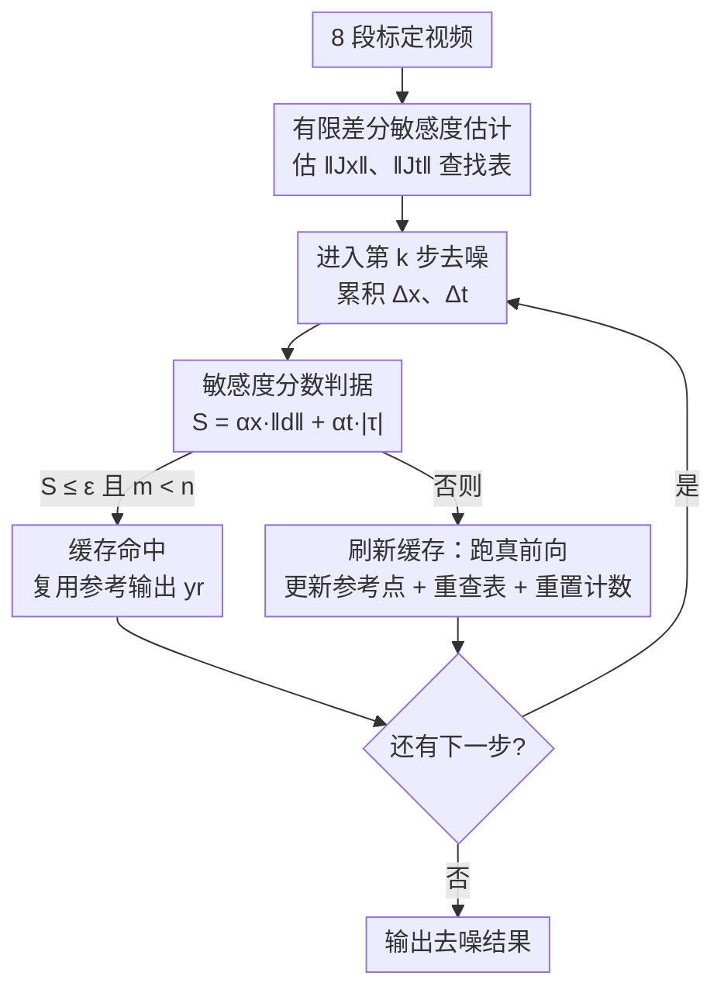

# SenCache: Accelerating Diffusion Model Inference via Sensitivity-Aware Caching

**会议**: CVPR 2026  
**论文**: [CVF Open Access](https://openaccess.thecvf.com/content/CVPR2026/html/Haghighi_SenCache_Accelerating_Diffusion_Model_Inference_via_Sensitivity-Aware_Caching_CVPR_2026_paper.html)  
**代码**: https://github.com/vita-epfl/SenCache  
**领域**: 扩散模型  
**关键词**: 扩散模型加速, 训练无关缓存, 网络敏感度, 视频生成, 自适应缓存

## 一句话总结
SenCache 把扩散模型的"哪一步可以复用缓存"这件事，从过去靠经验启发式的拍脑袋，换成对去噪网络**局部敏感度**（输出对 latent 和 timestep 扰动的雅可比范数）的一阶估计：只有当预测的输出变化低于容差 $\varepsilon$ 时才复用缓存，从而在不重训、不改架构的前提下逐样本自适应地跳过冗余的网络前向，在 Wan 2.1 / CogVideoX / LTX-Video 上以相同算力换得更高的视觉质量。

## 研究背景与动机

**领域现状**：视频扩散模型（DiT 架构）画质很强，但推理极贵——一段 5 秒视频要跑几十上百步去噪，每步都是一次数十亿参数网络的完整前向。在不重训、不改架构的"训练无关"加速路线里，**缓存（caching）**最受欢迎：相邻 timestep 的去噪输出往往足够相似，于是把某一步算出的输出存下来、在后续几步直接复用，跳过昂贵的前向。

**现有痛点**：现有缓存方法（TeaCache、MagCache 等）全靠**经验启发式**决定哪些步该缓存、哪些步该刷新。TeaCache 用时间嵌入差异建模输出残差，MagCache 用残差幅值比触发跳过。它们有两个根本缺陷：(1) 没有理论依据，需要大量超参调试；(2) 产出的是**静态**缓存时间表——所有样本共用一套跳步策略，无法适应每个样本各自的生成难度。结果就是对难样本"过度缓存"（掉质量）、对易样本"缓存不足"（白白浪费算力）。

**核心矛盾**：输出在相邻两步之间到底变了多少，取决于**两个**来源——latent 漂移 $\|\Delta x_t\|$ 和 timestep 间隔 $|\Delta t|$。而现有启发式各自只盯住其中一个信号：TeaCache 主要看 timestep 维度，MagCache 主要看 latent 残差幅值。任一方法都会在"自己没建模的那一项变大"时严重低估真实输出变化，从而错误地复用缓存、留下伪影。

**切入角度**：作者从一个朴素但被忽视的观察出发——一步去噪输出的变化，本质就是网络对输入扰动的**局部响应**，可以用网络对 latent 和 timestep 的**雅可比范数（敏感度）**来刻画。雅可比范数小的区域，网络"平坦"、输出对扰动不敏感，正是安全复用缓存的地方。

**核心 idea**：用去噪网络的局部敏感度 $\|J_x\|$、$\|J_t\|$ 作为局部 Lipschitz 常数，把"一步输出会变多少"写成一阶上界 $\|J_x\|\|\Delta x_t\| + \|J_t\||\Delta t|$，只有这个**敏感度分数**低于容差 $\varepsilon$ 时才复用缓存——一条有理论支撑、逐样本自适应、且天然解释了旧启发式为何"有时灵有时翻车"的缓存判据。

## 方法详解

### 整体框架

SenCache 是一个"全前向缓存"（缓存的是整个去噪网络的输出 $f_\theta(x_t,t,c)$，而非中间特征）的训练无关推理加速框架。它要解决的核心问题是：在逐步去噪的过程中，**何时复用上一次算好的输出是安全的**。整体分两段：**离线一次性标定**敏感度曲线（每个模型只需 8 段视频，估出 $\|J_x\|$、$\|J_t\|$ 随 $t$ 的分布并缓存成查找表），然后在**在线推理**时，每一步累积当前的 latent 漂移和 timestep 间隔，算出敏感度分数 $S$，若 $S\le\varepsilon$ 且尚未超出最大连续缓存长度 $n$ 就走"缓存命中"（直接复用参考输出、零网络前向），否则刷新缓存（跑一次真前向，并把当前状态设为新的参考点、重新查表）。整个判据只依赖网络的局部敏感度和真实的输入变化量，因此与模态、架构、采样器都无关。

### 关键设计

**1. 敏感度缓存判据：把"何时该复用"写成一条一阶上界**

这是全文的理论核心，针对的痛点是旧启发式"只看单一信号"导致的误判。作者采用 flow-matching 视角，去噪网络 $f_\theta(x_t,t,c)$ 在相邻两步之间做一阶泰勒展开：$f_\theta(x_{t+\Delta t},t+\Delta t,c)-f_\theta(x_t,t,c)\approx J_x\,\Delta x_t + J_t\,\Delta t$，其中 $J_x=\partial f_\theta/\partial x_t$、$J_t=\partial f_\theta/\partial t$。取范数得到输出变化的上界 $\|J_x\|\|\Delta x_t\| + \|J_t\||\Delta t| + O(\|\Delta x_t\|^2+|\Delta t|^2)$，雅可比范数在这里扮演**局部 Lipschitz 常数**的角色。据此定义**敏感度分数**

$$S_t = \|J_x\|\,\|\Delta x_t\| + \|J_t\|\,|\Delta t|$$

并采用判据：当且仅当 $S_t\le\varepsilon$ 时在第 $t$ 步缓存复用。$\varepsilon$ 直接控制速度–质量权衡。它之所以比旧方法稳，是因为同时显式建模了 latent 漂移和 timestep 间隔两项——作者在 SiT-XL/2 上的敏感度分析（Fig. 3）发现 $\|J_t\|$ 在很宽的 $t$ 区间都不可忽略，意味着只看 latent 变化（如 MagCache）会在大 $\Delta t$ 步漏判，而只看时间嵌入（如 TeaCache）会在 latent 大幅漂移时漏判。这条判据把两者统一了起来。

**2. 有限差分敏感度估计 + 小标定集：让昂贵的雅可比变得几乎免费**

精确算雅可比范数代价极高（要对大网络求导），直接放进推理回路完全划不来。作者改用**方向有限差分（割线）**来近似：固定 $t$、沿采样器步进方向施加小扰动 $\Delta x$，得 $\|J_x\|\approx \frac{\|f_\theta(x_t+\Delta x,t,c)-f_\theta(x_t,t,c)\|_2}{\|\Delta x\|_2}$；固定 $x_t$、扰动时间，得 $\|J_t\|\approx \frac{\|f_\theta(x_t,t+\Delta t,c)-f_\theta(x_t,t,c)\|_2}{|\Delta t|}$。关键在于这两组敏感度**每个模型只需离线标定一次**：作者用仅 8 段运动/场景多样的视频就估出了与 4096 段视频几乎重合的敏感度曲线（Fig. 4），说明该量对样本不敏感、不需要大标定集。标定结果缓存成按 $t$ 查的 $(\alpha_x,\alpha_t)$ 查找表，在线时只需查表 + 两个内积，开销可忽略。这与 MagCache 报告的"缓存质量基本与 prompt 内容无关"现象一致——因为一阶变化只依赖 $\Delta x_t$、$\Delta t$，与条件 $\Delta c=0$ 无关。

**3. 缓存寿命上限 $n$：给"一阶近似只在局部成立"上保险**

一阶展开只在参考点附近精确，连续复用太多步后轨迹会漂离参考点，近似失效、误差累积。作者引入超参 $n$ 限制**最大连续缓存步数**：算法中维护计数器 $m$，缓存命中条件是 $S\le\varepsilon$ **且** $m<n$；一旦命中就累加漂移 $d\mathrel{+}=\Delta x$、$\tau\mathrel{+}=\Delta t$、$m\mathrel{+}=1$，并按 $S=\alpha_x\|d\|+\alpha_t|\tau|$ 重新判断；连续复用满 $n$ 次后强制刷新——跑一次真前向、把当前状态设为新参考点、重查表、清零 $d,\tau,m$。$n$ 调的是稳定性与激进度的平衡：小 $n$ 保守但稳，大 $n$ 更省算力但当一阶近似失准时质量会塌。消融显示 $n$ 增到 4 时 NFE 饱和，再大只掉质量不省算力。

### 损失函数 / 训练策略

SenCache 是**纯推理期、训练无关**的方法：不引入任何新的损失、不微调或重训去噪网络、不改架构。唯一的"离线开销"是用 8 段视频做一次有限差分敏感度标定（生成 $(\alpha_x,\alpha_t)$ 查找表），之后即插即用。实践中作者对生成前期更谨慎：因为前 20% 去噪步对整体生成最关键，这些早期步用极严容差 $\varepsilon=0.01$（1% 误差），其余步按模型放宽（Wan slow 0.1 / fast 0.2、CogVideoX 0.6、LTX 0.5），slow 版 $n=2$、fast 版 $n=3$。

## 实验关键数据

在三个 SOTA 视频扩散模型（Wan 2.1、CogVideoX、LTX-Video）上，对比 TeaCache 与 MagCache，沿用 MagCache 的评测协议报告 LPIPS / PSNR / SSIM（画质）与 NFE / Cache Ratio（效率），prompt 取自 VBench 全集。

### 主实验

| 模型 / 设置 | 方法 | NFE ↓ | Cache% ↑ | LPIPS ↓ | PSNR ↑ | SSIM ↑ |
|------|------|------|------|------|------|------|
| Wan 2.1 fast | TeaCache | 25 | 50% | 0.0966 | 25.07 | 0.8697 |
| Wan 2.1 fast | MagCache | 21 | 58% | 0.0603 | 28.37 | 0.9143 |
| Wan 2.1 fast | **SenCache** | 21 | 58% | **0.0540** | **29.14** | **0.9219** |
| CogVideoX | MagCache | 23 | 54% | 0.1952 | 21.85 | 0.7332 |
| CogVideoX | **SenCache** | 22 | 56% | **0.1901** | **22.09** | **0.7786** |
| LTX-Video | MagCache | 28 | 44% | 0.1795 | 23.37 | 0.8224 |
| LTX-Video | **SenCache** | 27 | 46% | **0.1625** | **23.67** | **0.8293** |

在 Wan 2.1 的 fast（激进复用）区间，SenCache 与 MagCache 算力相同（NFE=21）时画质全面更优（PSNR +0.77 dB，SSIM +0.0076）；在更难容忍近似的 CogVideoX / LTX-Video 上，即便要逼近 baseline 的低 NFE 需放大 $\varepsilon$，SenCache 仍在更低或相当 NFE 下取得相等或更好的画质。在 slow（保守）区间各方法画质接近，差距主要体现在 TeaCache 的 NFE 偏高，说明保守复用时不同判据选出的"安全区"趋同。

### 消融实验

| 配置 | NFE ↓ | LPIPS ↓ | PSNR ↑ | SSIM ↑ | 说明 |
|------|------|------|------|------|------|
| $n=1$ | 32 | 0.0223 | 32.82 | 0.9583 | 几乎不复用，质量最好但最慢 |
| $n=3$ | 25 | 0.0454 | 28.99 | 0.9301 | 速度/质量较平衡 |
| $n=4$ | 23 | 0.0558 | 28.09 | 0.9195 | NFE 在此饱和 |
| $n=7$ | 23 | 0.0760 | 26.53 | 0.8991 | NFE 不再降，质量持续塌 |

（Wan 2.1，$\varepsilon=0.05$）$n$ 从 1 增到 4 时 NFE 由 32 降到 23，之后**饱和**：再增大不省算力，只让质量单调下降——印证连续复用过长会使一阶近似失准。

| $\varepsilon$ | NFE ↓ | LPIPS ↓ | PSNR ↑ | SSIM ↑ |
|------|------|------|------|------|
| 0.04 | 25 | 0.0455 | 29.01 | 0.9301 |
| 0.06 | 23 | 0.0472 | 28.93 | 0.9287 |
| 0.07 | 22 | 0.0485 | 28.92 | 0.9277 |
| 0.13 | 21 | 0.0513 | 28.72 | 0.9244 |

（Wan 2.1，$n=3$）$\varepsilon$ 从 0.04 增到 0.13，NFE 由 25 降到 21，画质近似**线性**缓降，说明 $\varepsilon$ 是一个直接、可解释的速度–质量旋钮；$\varepsilon\in[0.06,0.07]$ 已吃下大部分算力收益（NFE 25→22~23）而质量几乎不掉。

### 关键发现
- 敏感度分析（Fig. 3）证实 **latent 和 timestep 两项都重要**：$\|J_t\|$ 在宽 $t$ 区间持续较大，纯看 latent 的判据会在大 $\Delta t$ 处翻车——这正是 SenCache 同时建模两项的实证依据。
- 敏感度估计**对标定集大小极不敏感**：8 段视频与 4096 段视频估出的敏感度曲线几乎重合，让"昂贵的雅可比"落地为可忽略的一次性离线开销。
- 同一框架能解释旧启发式：TeaCache≈只用 $\|J_t\||\Delta t|$ 项、MagCache≈只用 $\|J_x\|\|\Delta x_t\|$ 项，二者的失败区恰好是各自漏掉的那一项变大之处。

## 亮点与洞察
- **把启发式问题"理论化"**：用一阶泰勒上界 + 雅可比范数把"何时复用"变成一个有明确容差的判据，顺带统一解释了 TeaCache / MagCache 为何"半灵半翻车"——它们是该上界各取一项的特例。这种"先给统一框架、再证明旧方法是退化情形"的叙事很有说服力。
- **逐样本自适应**：判据依赖每步真实的 $\Delta x_t$、$\Delta t$，所以同一套 $\varepsilon$ 在难样本上自然少缓存、易样本上自然多缓存，避免了静态时间表的"一刀切"。
- **可迁移性强**：判据与模态/架构/采样器无关，作者指出原理可推广到音频、人体动作等其他扩散生成域——"用网络敏感度当复用代理"是一个通用思路。

## 局限与展望
- 仅做了一阶近似，并靠 $n$ 硬性封顶来防漂移；当采样轨迹高度非线性时，一阶上界可能仍偏松/偏紧，二阶或自适应 $n$ 或许更稳。
- 早期步用 $\varepsilon=0.01$、各模型 $\varepsilon$ 取值差异较大（0.1~0.6），说明容差仍需按模型挑选，并非完全免调参 ⚠️（以原文为准）。
- CogVideoX / LTX-Video 在激进设置下画质明显比 Wan 2.1 掉得多，提示该方法的收益对"模型本身对近似的容忍度"较敏感，不同 backbone 上的可压缩空间差异很大。
- 实验集中在视觉域，跨模态推广只是展望、未给实证。

## 相关工作与启发
- **vs TeaCache**：TeaCache 用时间嵌入差异建模残差来定跳步规则，本质只逼近敏感度上界里的 $\|J_t\||\Delta t|$ 项；SenCache 显式补上被它忽略的 $\|J_x\|\|\Delta x_t\|$ 项，因此在 latent 大幅漂移处不会漏判。
- **vs MagCache**：MagCache 靠残差幅值比触发跳过，主要对应 $\|J_x\|\|\Delta x_t\|$ 项，且假设跨模型/prompt 存在一致"幅值律"；SenCache 不依赖该假设，并补上 timestep 项，在大 $\Delta t$ 或网络对 $t$ 敏感时更稳。
- **vs 蒸馏类少步生成（Progressive Distillation / LCM）**：那类方法要额外训练学一个少步生成器；SenCache 完全训练无关、不改模型，是即插即用的推理期加速，定位互补。
- **vs 特征级缓存（DeepCache / Δ-DiT / FORA / PAB / AdaCache）**：它们缓存的是注意力/MLP 等中间特征并多用固定或内容自适应时间表；SenCache 属"全前向缓存"，缓存整个去噪输出，并以理论敏感度判据替代手工调度。

## 评分
- 新颖性: ⭐⭐⭐⭐⭐ 把缓存判据从启发式提升为有理论支撑的敏感度上界，并统一解释旧方法
- 实验充分度: ⭐⭐⭐⭐ 三个 SOTA 视频模型 + $n$/$\varepsilon$/标定集三组消融，但缺与更多缓存方法（AdaCache 等）的直接对比
- 写作质量: ⭐⭐⭐⭐⭐ 从观察到上界到算法层层递进，公式与图表配合清晰
- 价值: ⭐⭐⭐⭐⭐ 训练无关、即插即用、可迁移，对视频扩散落地的推理成本有直接帮助

<!-- RELATED:START -->

## 相关论文

- [\[AAAI 2026\] SpecDiff: Accelerating Diffusion Model Inference with Self-Speculation](../../AAAI2026/image_generation/specdiff_accelerating_diffusion_model_inference_with_self-speculation.md)
- [\[CVPR 2026\] SeaCache: Spectral-Evolution-Aware Cache for Accelerating Diffusion Models](seacache_spectral-evolution-aware_cache_for_accelerating_diffusion_models.md)
- [\[CVPR 2026\] Forecast the Principal, Stabilize the Residual: Subspace-Aware Feature Caching for Diffusion Transformers](forecast_the_principal_stabilize_the_residual_subspace-aware_feature_caching_for.md)
- [\[NeurIPS 2025\] Tortoise and Hare Guidance: Accelerating Diffusion Model Inference with Multirate Integration](../../NeurIPS2025/image_generation/tortoise_and_hare_guidance_accelerating_diffusion_model_inference_with_multirate.md)
- [\[CVPR 2026\] D2C: Accelerating Diffusion Model Training under Minimal Budgets via Condensation](d2c_diffusion_dataset_condensation.md)

<!-- RELATED:END -->
