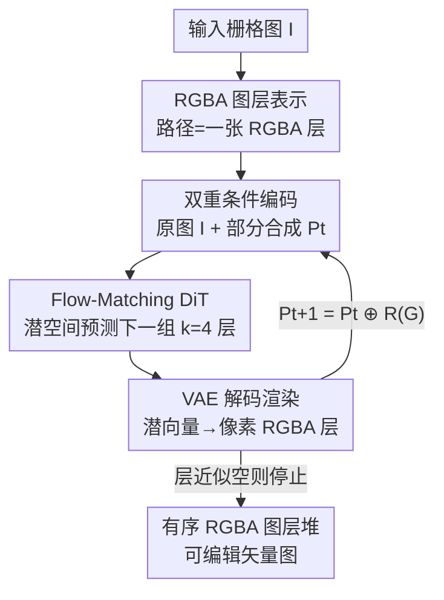

# ShapeAR: Generating Editable Shape Layers via Autoregressive Diffusion

**会议**: CVPR 2026  
**论文**: [CVF Open Access](https://openaccess.thecvf.com/content/CVPR2026/html/Chakraborty_ShapeAR_Generating_Editable_Shape_Layers_via_Autoregressive_Diffusion_CVPR_2026_paper.html)  
**代码**: 无  
**领域**: 图像生成 / 矢量图形生成  
**关键词**: 矢量化, 图层分解, 自回归扩散, Flow Matching, RGBA 图层

## 一句话总结
ShapeAR 把"栅格图 → 可编辑矢量图"重新表述为一个生成式的分层堆叠任务：用潜空间的 flow-matching 扩散，在原图（全局上下文）和已生成图层的部分合成图（局部上下文）双重条件下，自回归地一次生成一组互不重叠的 RGBA 形状图层，从而恢复出"艺术家手画风格"的、完整且可重排的闭合形状，在多个矢量化指标上超过此前 SOTA。

## 研究背景与动机
**领域现状**：把栅格图转成 SVG 的传统做法分两类——一类是边界追踪（boundary tracing），沿可见轮廓描边；另一类是可微栅格化驱动的联合路径优化（如 LIVE、O&R），用"分析-综合"在像素损失上反传，迭代细化一堆 SVG 路径。它们追求的是像素级保真。

**现有痛点**：这些方法把输入图当成一张被拍平的像素图，只追踪**可见的**边界，而不去恢复"被遮挡部分本应是什么"。于是被部分遮挡的形状被切成互不相连的碎片——一个被挡住的圆只会被描成残缺弧线，而不是完整的圆。结果是 Z-order 和图层关系被破坏，得到一堆互相重叠、结构不一致、难以编辑的扁平路径（cutout 拼贴感）。此外联合优化对初始化敏感、易陷局部极小，规模一上去推理成本很高。

**核心矛盾**：矢量化被当成"逆渲染"问题（恢复轮廓/控制点去最小化重建误差），而艺术家其实是**组合式**地作画——一层层把完整的形状叠上去。前者的目标函数里根本没有"形状要完整、图层要分明"这件事，所以再准也长不出艺术家那种结构。

**本文目标**：(1) 让每条路径恢复成一个**完整闭合**的形状（即使被遮挡）；(2) 保持图层不重叠 + 正确的深度堆叠顺序；(3) 不靠重型联合优化就能扩展到含大量形状的复杂场景。

**切入角度**：作者重新设计了表示——把单条矢量路径表示成一张 **RGBA 图层**（RGB 编码颜色，alpha 编码透明度与叠放位置）；一整幅矢量图就是一摞按 z-order 排好的 RGBA 图层。这样矢量化天然变成了一个**生成**问题：学着合成并叠放这些形状去重建图像。

**核心 idea**：用潜空间自回归扩散"逐层画"代替"描边/优化"——每步在原图和已画部分的条件下生成下一组不重叠 RGBA 图层，像艺术家一样把图一层层堆出来。

## 方法详解

### 整体框架
ShapeAR 把输入栅格图 $I \in \mathbb{R}^{4\times H\times W}$（RGBA）分解为一串图层 $\{L_1,\dots,L_N\}$，使其依次 alpha-over 合成能重建原图：$I \approx L_1 \oplus L_2 \oplus \cdots \oplus L_N$。其中合成算子定义为 $I \oplus I' := (1-\alpha_{I'})\cdot I + \alpha_{I'}\cdot I'$（从右往左求值，新层叠在上面）。每个图层内部塞进多个**互不重叠**的形状（同层两形状 alpha 无公共非零像素 $\alpha_{S_a}\cdot\alpha_{S_b}=0$），而层间顺序保持原始深度序。

这个分解问题本身是严重欠约束的（一张图能拆出无数种合法图层），所以作者不去解析地求解，而是**从约 90 万张 SVG 数据里学**一个分解器，让生成的形状落在艺术家形状的分布上。整条管线是一个潜扩散：用 VAE 把一摞 RGBA 图层压进 16× 下采样的潜空间，用一个 SD3 风格的 Diffusion Transformer（DiT）在潜空间做条件生成，再用冻结的 VAE 解码器渲染回像素层。关键在于**自回归**：不一次性出全部图层，而是每步只出 $k=4$ 个图层，把这一步的渲染结果叠进"部分合成图" $P_t$，作为下一步的局部上下文。

### 关键设计

**1. RGBA 图层表示 + 不重叠分组：把矢量化变成可学的生成任务**

针对"描边只能得到碎片化、扁平、难编辑路径"的痛点，作者放弃显式描轮廓，改用 RGBA 图层作为路径的代理表示：每条矢量路径栅格化成一张 $\mathbb{R}^{4\times H\times W}$ 的形状 $S$，RGB 是颜色、alpha 是透明度兼叠放位置。由于单条路径数量庞大，又把互不重叠的形状打包成"图层" $L_i := S_{i_1}\oplus\cdots\oplus S_{i_k}$，要求同层形状 alpha 不冲突、层间顺序保留原始 z-order。这样做的好处是把"恢复一条路径"从几何描边问题变成"预测一片连续的颜色-alpha 场"，路径从场里自然浮现，因此模型能给出**完整闭合**的形状（连被遮挡部分一起补全），而不是只描可见轮廓——这正是它和所有边界追踪/优化方法的根本区别，也是后续可重排、可复用、好编辑的来源。

**2. 双重条件自回归生成：全局图 + 局部合成图驱动逐层堆叠**

针对"复杂场景形状太多、一次性生成或联合优化都扛不住"的痛点，作者把分解写成自回归过程。学到的分解器 $f_\theta: \mathbb{R}^{4\times H\times W}\times\mathbb{R}^{4\times H\times W}\to\mathbb{R}^{k\times4\times H\times W}$ 在第 $t$ 步同时吃两个条件：原图 $I$（全局上下文，告诉模型"最终要长成什么样"）和部分合成图 $P_t$（局部上下文，告诉模型"哪些区域已经画好了"）。$t=0$ 时 $P_0=0$（空画布），每步预测 $k=4$ 个新层 $G(t)=f_\theta(I,P_t)$，渲染合成函数 $R(G(t))=L_{kt+1}\oplus\cdots\oplus L_{k(t+1)}$，再更新 $P_{t+1}=P_t\oplus R(G(t))$ 把新层叠到上面。推理时一直迭代到达最大步数 $T$，或新层几乎为空（$\sum_i\lVert\alpha_{L_{kt+i}}\rVert_1<\epsilon$）即停止。这个"看着已画的部分决定下一笔"的回环，强制了跨层的空间一致性，并且天生支持**任意数量**形状、不需要预设图层上限——这就是它能扩展到复杂场景的关键。

**3. Flow-Matching DiT + 4 轴 RoPE：在潜空间高效预测下一组图层**

针对"分层输出是结构化、多模态分布、直接在像素空间建模代价高"的问题，作者沿用 SD3 的潜扩散设计。先用卷积 VAE（编码器含 ResNet 块 + 步进下采样 + 瓶颈处单个注意力块，解码器纯卷积）把一摞 $d$ 层 RGBA 压成 16× 下采样的潜 $z\in\mathbb{R}^{c\times d\times H_\ell\times W_\ell}$，并沿 $(d,H_\ell,W_\ell)$ 序列化成 token。DiT（宽度 1024、12 个双注意力块 + 24 个单注意力块）在潜空间预测一个时间相关的速度场：定义线性桥 $z_s=(1-s)z_0+s z_1$（$z_1\sim\mathcal N(0,I)$），用 flow-matching 损失 $L_{flow}=\mathbb{E}\lVert v_s-(z_1-z_0)\rVert_2^2$ 训练，推理时从噪声出发用 Euler 积分 ODE 回到 $\hat z_0$ 再解码出 $k$ 层。为了让模型分清"这是条件 token 还是第几层、第几行第几列的潜 token"，作者用了一个 **4 轴 RoPE**：把每个注意力头通道切成四份，分别对 (条件序号 / 层 / 高 / 宽) 做独立旋转再拼回——条件 token 取 $(\tau{=}j,\ell{=}0,y{=}0,x{=}0)$，潜 token 取 $(\tau{=}0,\ell,y,x)$，让位置相位在四个轴上解耦。

**4. 几何感知的 VAE 损失与数据筛选：偏向"细、薄、规则"的艺术家形状**

矢量形状常有又细又薄的高频结构（细线、发丝），普通重建损失会把它们当噪声忽略掉。VAE 损失因此组合了三项：对 RGBA 四通道的 Charbonnier 回归项 $L_{ch}(x)=\sqrt{x^2+\varepsilon^2}-\varepsilon$（$\varepsilon=0.1$，像 L1 一样不偏置大幅值、保高频）、只作用于 alpha 通道的 focal BCE（类权 $\gamma=0.75$、聚焦参数 $\beta=2$，把训练重心拉向少数难正例即细线），以及退火的 KL 项（$\lambda_{KL}$ 在 $10^5$ 步后升到 0.001）。数据侧则用论文自定义的几何指标做筛选：保留一个形状的概率等于其**对称分数 $S_{sym}$ 与凸度 $C_{conv}$ 的调和平均**，从而只留下简单、规整的"设计基元"；同时把描边转成填充路径、复合路径只留最外边界、删掉小于 16 像素的过细路径——这一整套筛选保证模型学的是艺术家会画的基本形状，而非杂乱碎片。

### 损失函数 / 训练策略
训练对从 SVG 构造：把 $n$ 条路径各自栅格化成形状序列，合成得到全局图 $I$；由于同一组不重叠形状可有多种分层方式，每个训练实例随机采一种分层 $\{L_1,\dots,L_N\}$。设每步 $k$ 层、共 $T=\lceil N/k\rceil$ 步，均匀采一个步号 $t$，构造部分合成 $P_t=L_1\oplus\cdots\oplus L_{kt}$（$t=0$ 时为 0）和目标层 $G(t)=\{L_{kt+1},\dots,L_{k(t+1)}\}$，得到监督对 $(I,P_t)\mapsto G(t)$。目标层经 VAE 编码成 $z_0$，DiT 用 flow-matching 目标在 $(I,P_t)$ 条件下学预测。只训练 DiT 与图像编码器（AdamW），其余模块冻结；作者强调衰减学习率对稳定收敛很关键。

## 实验关键数据

评测在 256×256 栅格图上进行，测试图由 MMSVG、OmniSVG 留出集渲染得到，与训练无重叠。除 L1、1-SSIM、LPIPS 外，作者引入了 4 个几何指标：形状混合误差 $E_{blend}$（衡量单形状错误融合多种颜色）、冗余形状数 $N_{red}$（全遮挡无贡献的层）、对称分数 $S_{sym}$、凸度 $C_{conv}$。

### 主实验

矢量化质量对比（100 张多样图像基准，越低越好）：

| 方法 | L1 ↓ | 1-SSIM ↓ | LPIPS ↓ |
|------|------|----------|---------|
| LIVE | 0.524 | 0.631 | 0.440 |
| O&R | 0.102 | 0.350 | 0.342 |
| SGLIVE | 0.142 | 0.285 | 0.243 |
| LIVSS（前 SOTA） | 0.008 | 0.057 | 0.049 |
| **ShapeAR（本文）** | **0.005** | **0.020** | **0.014** |

相比前 SOTA LIVSS，ShapeAR 把 L1 降 37.5%（0.005 vs 0.008）、1-SSIM 降 64.9%（0.020 vs 0.057）、LPIPS 降 71.4%（0.014 vs 0.049），对更早的方法优势更悬殊。

形状几何质量对比（vs Adobe Illustrator 非 ML 基线）：

| 方法 | $C_{conv}$ ↑ | $S_{sym}$ ↑ | KID ↓ |
|------|----------|---------|-------|
| **Ours** | **0.88 ± 0.09** | **0.49 ± 0.22** | **0.374 ± 0.003** |
| Baseline | 0.68 ± 0.10 | 0.29 ± 0.22 | 0.388 ± 0.002 |

本文形状更凸、更对称，且对约 3000 个设计师形状算的 KID 更低，说明生成形状的分布更接近真实艺术家形状。

### 消融实验

图层数（即上下文长度）消融，越低越好：

| 图层数 | L1 ↓ | 1-SSIM ↓ | 冗余 ↓ | 混合 ↓ |
|--------|------|----------|--------|--------|
| 4 | 3.1e−5 | 0.027 | 0.0101 | 0.0511 |
| 8 | 2.7e−5 | 0.0239 | 0.0077 | 0.0327 |
| 12 | **2.2e−5** | **0.0144** | 0.0078 | **0.0013** |

### 关键发现
- **图层预算越大重建越好**：4→12 层，L1 与 1-SSIM 单调下降，混合误差从 0.0511 大幅降到 0.0013（层分得更干净）。代价是 12 层时冗余形状略升（轻微过分割），凸度/对称无显著变化；综合下作者采用受算力限制的 12 层配置。
- **完整形状是真正的杀手锏**：相比 LIVE/O&R/SGLIVE/LIVSS 只描可见边界、遮挡处给出残缺路径，ShapeAR 即使在被遮挡时也能生成完整连贯的闭合形状（图 6），每层是一个语义完整、可操控的对象而非断裂曲线碎片——这对编辑工作流价值最大。
- **场景越复杂越能体现结构优势**：随路径数增加，两类方法 L1/SSIM 误差都升（受栅格分辨率限制），但本文 SSIM 持续更优，归因于它能把形状拆成更平滑连贯的层、避开边界追踪的轮廓畸变。

## 亮点与洞察
- **把"逆渲染"重述成"组合式生成"**：最 aha 的一点是表示层面的转换——一条路径 = 一张 RGBA 层、一幅图 = 一摞 z-order 层，使得"补全被遮挡部分"成了生成任务的自然产物，而不是描边方法永远做不到的事。
- **双重条件 = 全局意图 + 局部进度**：原图给"要画成什么"，部分合成图给"已经画到哪"，这套自回归回环既保证跨层一致，又解锁了无上限的形状数量，思路可迁移到任何"逐元素堆叠重建"的结构化生成（如分层场景、UI 控件分解）。
- **用几何指标反过来当数据筛选器**：把对称/凸度的调和平均当作保留概率，等于让"什么是好形状"的先验直接塑形训练分布，是一个轻量但有效的数据工程 trick。

## 局限与展望
- **受栅格分辨率约束**：输入是固定分辨率栅格图，图越复杂细节越难重建，提高训练分辨率只能缓解、不能根除对栅格化的依赖。
- **依赖中间隐式表示 + 后处理转换**：模型不直接生成矢量，而是先出隐式形状再经 shape-to-SVG 转换阶段，引入后处理依赖；且路径被建模为连续的 in-out 标量场，**无法表示自相交（non-embeddable）几何**。
- **不支持复合路径/可变透明度**：当前无法表达带负空间的复合路径与变 opacity；作者提出未来把部分 alpha 纳入隐式表示，并深挖 flow-matching 潜空间结构以解耦"拓扑"与"不透明度"因子。
- ⚠️（自己发现）主表与形状质量表用的基线不同（矢量化对比是 LIVE/O&R/SGLIVE/LIVSS，几何质量对比是 Adobe Illustrator），跨表数字不宜直接横比；评测集偏向"简单规整形状"，对照片级复杂纹理的泛化未充分验证。

## 相关工作与启发
- **vs 边界追踪 / 传统矢量化（多边形、gradient-mesh、拓扑驱动）**：它们把图当几何分割、只描可见轮廓，擅长清晰曲线但难扩展到带阴影纹理的内容，且破坏图层关系；本文用学到的生成器补全完整形状并保 z-order。
- **vs 可微/优化式矢量化（LIVE、O&R、SGLIVE）**：通过可微栅格化在像素损失上迭代优化路径，编辑性好但对初始化敏感、易陷局部极小、推理重；ShapeAR 用前馈式自回归扩散一次出一组层，避开逐图优化。
- **vs LIVSS（前 SOTA，simplify-then-vectorize 的逐层重建）**：同样走分层路线，但仍是先简化后描边的栅格层思路；本文是端到端学习的结构化矢量层生成，在 L1/1-SSIM/LPIPS 上全面更优。
- **vs 栅格层分解（palette/RGBXY、gradient-layer）**：它们产出可重着色的 RGBA/渐变层，但停留在栅格层而非结构化矢量；ShapeAR 把分层分解和矢量生成桥接起来。

## 评分
- 新颖性: ⭐⭐⭐⭐⭐ 把矢量化从描边/优化重述为"RGBA 层的自回归生成"，补全完整闭合形状的视角很新。
- 实验充分度: ⭐⭐⭐⭐ 多基线 + 多指标 + 图层数消融较扎实，但基线口径不统一、复杂自然图泛化验证偏少。
- 写作质量: ⭐⭐⭐⭐ 问题表述清晰、公式完整；自定义几何指标定义到位。
- 价值: ⭐⭐⭐⭐ 直接服务设计编辑工作流，完整可编辑图层比碎片路径实用得多。

<!-- RELATED:START -->

## 相关论文

- [\[CVPR 2026\] PhysGen: Physically Grounded 3D Shape Generation for Industrial Design](physgen_physically_grounded_3d_shape_generation_for_industrial_design.md)
- [\[CVPR 2026\] 3D Space as a Scratchpad for Editable Text-to-Image Generation](3d_space_as_a_scratchpad_for_editable_text-to-image_generation.md)
- [\[CVPR 2026\] MoCoDiff: A Controllable Autoregressive Diffusion Model for Expressive Motion Generation](mocodiff_a_controllable_autoregressive_diffusion_model_for_expressive_motion_gen.md)
- [\[CVPR 2026\] FG-Portrait: 3D Flow Guided Editable Portrait Animation](fg-portrait_3d_flow_guided_editable_portrait_animation.md)
- [\[ICCV 2025\] Efficient Autoregressive Shape Generation via Octree-Based Adaptive Tokenization](../../ICCV2025/image_generation/efficient_autoregressive_shape_generation_via_octree-based_adaptive_tokenization.md)

<!-- RELATED:END -->
