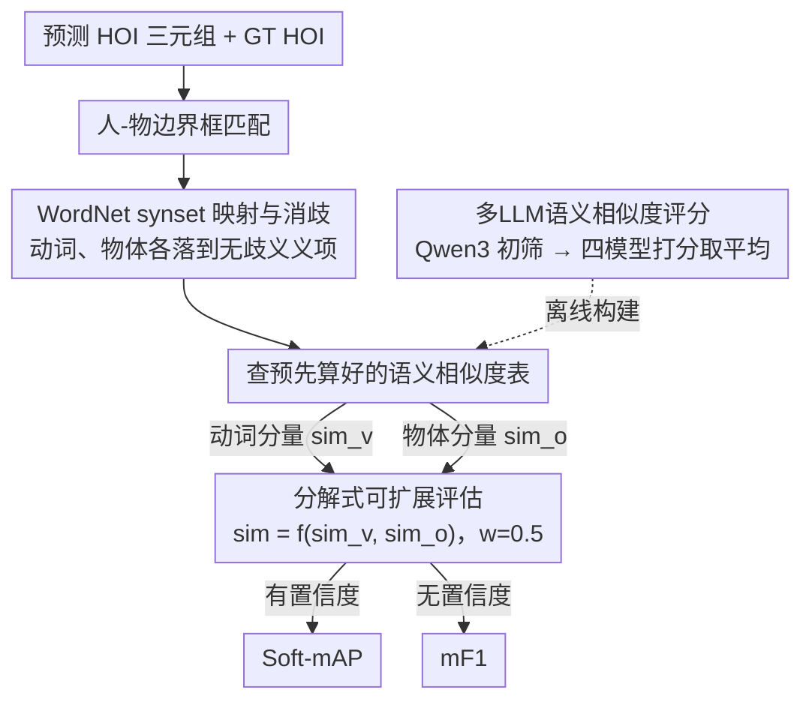

# SHOE: Semantic HOI Open-Vocabulary Evaluation Metric

**会议**: CVPR 2026  
**arXiv**: [2604.01586](https://arxiv.org/abs/2604.01586)  
**代码**: [https://github.com/majnoa/SHOE](https://github.com/majnoa/SHOE)  
**领域**: 图像生成  
**关键词**: 开放词汇HOI检测, 语义相似度评估, LLM评分, WordNet, 评估指标

## 一句话总结

提出SHOE评估框架，通过将HOI预测分解为动词和物体分别计算LLM驱动的语义相似度，替代传统mAP的精确匹配方式，在开放词汇HOI检测评估中达到85.73%的人类判断一致性，超过人类标注者之间78.61%的平均一致性。

## 研究背景与动机

1. **领域现状**：人体-物体交互（HOI）检测是视觉理解的基础任务，标准评估指标为mAP，依赖于预测与标签的精确分类匹配。
2. **现有痛点**：mAP将HOI类别视为离散标签，语义相近但词汇不同的预测（如"lean on couch"和"sit on couch"）会被判为错误；同时数据集标注不完整，合理但未标注的预测被惩罚为假阳。
3. **核心矛盾**：随着VLM和MLLM的崛起，模型能生成超越固定标签集的开放词汇预测，但现有评估协议无法公正衡量这些灵活输出的质量。
4. **本文目标**：设计一个语义感知的柔性评估框架，支持开放词汇HOI预测的分级匹配评估。
5. **切入角度**：将HOI分解为动词和物体两个独立组件，分别用多个LLM的平均评分计算语义相似度，避免全HOI对组合爆炸。
6. **核心 idea**：通过WordNet消歧 + 多LLM语义评分实现HOI分解式柔性匹配评估。

## 方法详解

### 整体框架

SHOE想解决的是mAP在开放词汇HOI上的"精确匹配暴政"：只要预测的动词或物体词面对不上标签就判错，哪怕语义几乎一样。它的整条路径是这样转的——拿到预测的HOI三元组$(b_h, b_o, v, o)$和GT HOI后，先做常规的人-物边界框匹配；匹配上的预测，把它的动词和物体各自送进WordNet查到对应的同义词集（synset），再到一张**预先算好的LLM语义相似度表**里查出"预测动词↔GT动词""预测物体↔GT物体"的分数；两个分数合成一个实例级相似度，最后按mAP的排序逻辑聚合成Soft-mAP，或在无置信度时聚合成mF1。关键在于真正昂贵的语义打分被前置成一张离线查找表，评估时只查不算。

### 关键设计

**1. WordNet synset映射与消歧：让"比词"变成"比义"**

直接拿原始词汇比较会被一词多义坑——同一个"bat"既是球棒也是蝙蝠。SHOE先把每个动词/物体落到一个 sense-specific 的 WordNet synset 上，比较的是确切含义而非字符串。物体这一侧好办，WordNet 名词层级完整，可以顺着上位词/下位词做邻域扩展；动词这一侧麻烦，WordNet 的动词分类既浅又碎，覆盖不住 HOI 里的交互动词，所以作者手动整理了约 7,150 个 HOI 相关的动词 synset 来兜底匹配。这一步本质是给后面的语义打分提供一个干净、无歧义的比较单位。

**2. 多LLM语义相似度评分：用模型平均代替单一裁判**

有了 synset 还需要一个"这两个义项有多近"的分数，SHOE 为每一对动词-动词、物体-物体打一个 0–4 分的语义相似度。单个 LLM 当裁判会有系统偏差，于是分两步走：先用 Qwen3-32B 对全量对（动词侧约 850K 对比较）做一次廉价初筛，把语义为零的对直接剔除；剩下的非零对再交给 DeepSeek-V3、Llama-4-Maverick-17B、Yi-1.5-34B-Chat、Gemini-2.5-Pro 四个模型，各自依据 synset 的 gloss 定义在五分制上打分，取平均。多模型平均不仅压偏差，还顺带量出了一个有意思的事实：动词侧模型间的 Pearson 相关偏低（0.50–0.72），物体侧高得多（最高 $r=0.84$），说明动词语义确实更难取得共识、更值得用平均来稳一稳。

**3. 分解式可扩展评估：把 HOI 拆成动词×物体，躲开组合爆炸**

如果对每一对完整 HOI 都算相似度，规模随词表二次膨胀——$(V \times O)^2$ 次，词表一大就算不动。SHOE 的核心取巧是把 HOI 相似度分解成动词分量和物体分量的合成：

$$\text{sim}(p,g) = f\big(\text{sim}_v(v^p, v^g),\ \text{sim}_o(o^p, o^g)\big)$$

合成函数 $f$ 默认取权重 $w=0.5$ 的算术平均。这样相似度表只需分别算 $V^2 + O^2$ 次（动词两两、物体两两），而不是把每一对 HOI 都枚举一遍。代价换来的收益很夸张：HICO-DET 原本 600 个固定 HOI 类，靠分解能扩到 3800 万个语义相关 HOI 仍可评估——这正是"开放词汇"评估在算力上能落地的前提。

### 损失函数 / 训练策略

SHOE 不训练任何模型，是一套纯评估框架，按被评模型是否给置信度提供两种聚合模式。**有置信度**时兼容 mAP 的排序逻辑，算 Soft-AP 与 Soft-mAP；**无置信度**时（如直接生成的 VLM）对所有预测平等地算 soft precision/recall/F1。

## 实验关键数据

### 主实验

| 方法 | 类型 | mAP | SHOE mAP |
|------|------|-----|----------|
| HOLA (ViT-L) | Default | 39.05 | 39.92 |
| LAIN (ViT-B) | Zero-shot | 34.60 | 35.37 |
| THID | Open-Vocab | 22.01 | 22.04 |
| GPT-4.1 + DETR | VLM | 49.50 | 61.67 |
| InternVL3-38B + DETR | VLM | 42.00 | 58.03 |
| Qwen2.5-VL-32B + DETR | VLM | 34.83 | **66.03** |

### 消融实验

| 评估指标 | 与人类判断一致性(%) |
|----------|---------------------|
| SHOE (Standard, 算术平均) | **85.73** |
| SHOE (几何平均) | 84.29 |
| SHOE (最小值) | 84.01 |
| DeepSeek-V3 (直接LLM评分) | 83.34 |
| Gemini-2.5-Pro | 77.52 |
| CLIP-ViT-B (gloss) | 59.11 |
| WordNet WUP | 57.09 |
| SentenceBERT | 54.09 |
| mAP direct-match | 38.90 |

### 关键发现

- Qwen2.5-VL-32B标准mAP最低(34.83)但SHOE mAP最高(66.03)，说明该模型有很强的语义理解但不完全复现HICO-DET的精确标签
- VLM类方法在SHOE mAP下显著优于传统方法，揭示了mAP无法捕捉的真实能力差异
- 超参数调优显示"同动词不同物体"场景下最优权重$w^*=0.267$偏向物体相似度，"不同动词同物体"下$w^*=0.733$偏向动词，但因用户研究规模有限仍用$w=0.5$
- 用Qwen3-32B筛掉的零相似动词对，其他LLM不同意率仅0.245%~1.318%，验证了筛选策略的可靠性

## 亮点与洞察

- **分解思路极其优雅**：将HOI相似度拆为动词和物体独立比较，计算复杂度从$(V \times O)^2$降到$V^2 + O^2$，使HICO-DET的600类扩展到3800万类成为可能。这个思路可以推广到任何需要组合语义比较的评估场景
- **超越人类一致性**：SHOE达到85.73%与平均人类评分的一致性，而人类标注者之间平均一致性仅78.61%。这说明多LLM平均确实能产生比单个人类更稳定的语义判断
- **评估指标即基础设施**：相似度查找表只需构建一次，后续评估直接查表，极大降低了重复使用成本

## 局限与展望

- 目前仅在HICO-DET上验证，其他HOI数据集（如SWIG-HOI）也存在标注不完整问题，需要扩展验证
- 用户研究规模偏小（500对，5位标注者），在更大规模人类评估中的稳定性需要进一步验证
- 对VLM的置信度代理（token概率）可能不可靠，如何更好地为开放式生成模型获取校准的置信度仍是开放问题
- 语义相似度的"黄金标准"本身因人而异，特定领域（如医疗、法律场景）的HOI评估可能需要领域定制

## 相关工作与启发

- **vs mAP (标准评估)**: mAP执行严格精确匹配，SHOE引入语义梯度匹配，两者互补——mAP衡量精确再现能力，SHOE衡量语义理解能力
- **vs CLIP-based相似度**: CLIP在HOI对比较中仅59.11%一致性，说明通用视觉-语言嵌入不足以捕捉HOI语义的细微差异
- **vs 直接LLM评分**: 直接用LLM评整个HOI对最高达83.34%，但SHOE分解策略达85.73%且更可扩展

## 评分

- 新颖性: ⭐⭐⭐⭐ 分解式语义评估思路新颖，但核心仍是用LLM评分+平均
- 实验充分度: ⭐⭐⭐⭐ 用户研究、多基线对比、Qwen筛选验证等都比较完备
- 写作质量: ⭐⭐⭐⭐⭐ 动机清晰，图表专业，公式表达完整
- 价值: ⭐⭐⭐⭐ 为开放词汇HOI评估提供了实用工具，但影响范围限于HOI社区

<!-- RELATED:START -->

## 相关论文

- [\[CVPR 2026\] Omni-Attribute: Open-vocabulary Attribute Encoder for Visual Concept Personalization](omni-attribute_open-vocabulary_attribute_encoder_for_visual_concept_personalizat.md)
- [\[CVPR 2026\] OpenDPR: Open-Vocabulary Change Detection via Vision-Centric Diffusion-Guided Prototype Retrieval for Remote Sensing Imagery](opendpr_open-vocabulary_change_detection_via_vision-centric_diffusion-guided_pro.md)
- [\[ICML 2026\] Conformal Reliability: A New Evaluation Metric for Conditional Generation](../../ICML2026/image_generation/conformal_reliability_a_new_evaluation_metric_for_conditional_generation.md)
- [\[ICML 2026\] Self-Prompting Diffusion Transformer for Open-Vocabulary Scene Text Editing via In-Context Learning](../../ICML2026/image_generation/self-prompting_diffusion_transformer_for_open-vocabulary_scene_text_editing_via_.md)
- [\[NeurIPS 2025\] Seg4Diff: Unveiling Open-Vocabulary Segmentation in Text-to-Image Diffusion Transformers](../../NeurIPS2025/image_generation/seg4diff_unveiling_open-vocabulary_segmentation_in_text-to-image_diffusion_trans.md)

<!-- RELATED:END -->
