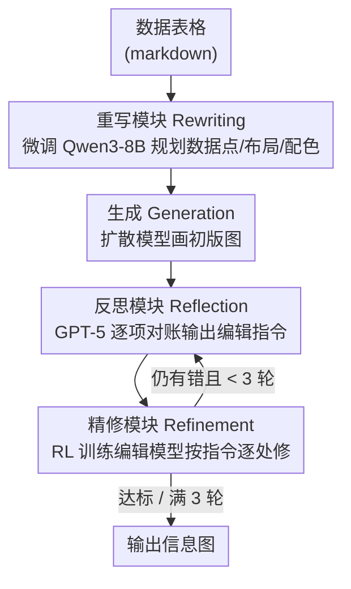

# ShowTable: Unlocking Creative Table Visualization with Collaborative Reflection and Refinement

**会议**: CVPR 2026  
**arXiv**: [2512.13303](https://arxiv.org/abs/2512.13303)  
**代码**: [https://lntzm.github.io/showtable-page/](https://lntzm.github.io/showtable-page/)  
**领域**: 扩散模型 / 图像生成  
**关键词**: 表格可视化, 自纠错, MLLM推理, 扩散模型, 强化学习

## 一句话总结
ShowTable 提出了"创意表格可视化"这一新任务（将数据表格生成为信息图），并设计了一个 MLLM（推理+反思）与扩散模型（生成+精修）协同的渐进式自纠错 pipeline，通过针对性训练的重写模块和用 RL 优化的精修模块，在自建的 TableVisBench 基准上显著提升所有基线模型的可视化质量。

## 研究背景与动机

1. **领域现状**：图像生成模型在通用场景下质量已很高，近期研究逐步转向更复杂的结构化生成，如海报设计、文字渲染等。然而，数据驱动的可视化（如从表格生成图表/信息图）对现有模型来说仍是巨大挑战。

2. **现有痛点**：直接将 markdown 表格作为 prompt 输入生成模型，模型倾向于"渲染表格文本"而非"可视化数据"。现有统一模型在数据准确性（Data Accuracy）上几乎为零（如 Bagel 仅 0.1，Blip3o-Next 仅 0.4），无法正确将数据点映射为视觉元素（柱高、饼图角度等）。

3. **核心矛盾**：创意表格可视化要求两个看似矛盾的能力——创意美学设计（需要自由度）和严格数据保真映射（需要精确度）。生成模型擅长前者但在后者上频繁出错。

4. **本文目标** 如何让生成模型将结构化表格数据准确且美观地可视化为信息图，同时能自动检测和修复生成错误。

5. **切入角度**：用 MLLM 做推理规划（重写）和错误审计（反思），用扩散模型做执行（生成+精修），形成迭代自纠错闭环。针对重写和精修两个瓶颈分别训练专用模块。

6. **核心 idea**：用"MLLM 协调 + 扩散模型执行"的协作模式，通过 Rewriting→Generation→Reflection→Refinement 的自纠错循环，实现从表格到美观信息图的高保真生成。

## 方法详解

### 整体框架
ShowTable 想解决的是：把一张数据密集的 markdown 表格，画成既好看又数据准确的信息图。难点在于生成模型拿到表格 prompt 时往往去"抄写表格文字"而不是"把数字翻译成柱高、饼图角度"，而且一旦画错也没人纠正。它的思路是让 MLLM 当"指挥+审计"、扩散模型当"执行+修补"，两端配合走一个自纠错闭环。

整个流程分四步首尾相接：**重写（Rewriting）** 先让 MLLM 把表格读懂、规划好数据点/布局/配色/背景，写成一段详细的描述性 prompt；**生成（Generation）** 把这段 prompt 交给扩散模型画出初版图；**反思（Reflection）** 再让 MLLM 拿原始表格逐项对账，挑出哪根柱子高了、哪个数字渲染错了、哪个比例不对，写成可执行的编辑指令；**精修（Refinement）** 由图像编辑模型照着指令逐处修。反思与精修之间最多循环 3 轮，每轮把上一轮的图越改越准。论文真正发力的地方，是把这条链上最容易卡壳的两环——重写和精修——各自训练成专用模块。

### 关键设计

**1. 重写模块：把"渲染表格"扭转成"规划可视化"**

直接喂 markdown 表格时，模型会把表格当文本去渲染，数据准确性几乎为零（Bagel 仅 0.1）。这一步要先在文字层面把"画什么"想清楚。作者基于 Qwen3-8B 微调出一个专用重写模型，训练数据这样造：先用 Gemini-2.5-pro 对收集到的可视化 ground-truth 图像写出详细描述，再补一段 chain-of-thought 解释"为什么这张表该这么画"，凑成 30K 条 {table, rationale} → {description} 的 SFT 样本（来源 SlideVQA / OpenImages / Cambrian-10M，经双审核一致性筛选），用标准 next-token 预测训练。通用大模型（GPT-5、Gemini）在面对复杂多层表格时仍会漏数据点、规划失当，而专门训练的重写模块在 Data Accuracy 上甚至反超了人工的 Reference-Caption 上界（51.2 vs 50.3），说明"为生成模型量身规划"比"人话描述"更有用。

**2. 反思模块：让 MLLM 当审计员而不是画师**

MLLM 自己画不出完美可视化，但它"看图对账"的能力很强——这一步就是把生成和审计拆开，各取所长。作者用表现最好的 GPT-5 做反思模型，拿原始表格对照生成图逐维度核查：数据点对不对、文字清不清晰、比例关系准不准、附加信息合不合理，然后输出精确、可操作的编辑指令（如"第三根柱子高度应降低 20%"）。这些指令越具体，下一步精修就越好落地。

**3. 精修模块：用 RL 把"越修越差"扭成"越修越准"**

作者做了个对照实验：同样的编辑指令，base 编辑模型 Qwen-Image-Edit 多轮精修反而越改越糟（54.3 → 49.4），换成 Wan2.5-I2I-Preview 却能稳步变好（54.3 → 63.4）。这说明 pipeline 逻辑没问题，瓶颈在精修模型本身——现成编辑模型不适应"迭代纠错"这种场景，会累积错误。于是他们用 RL 专门训练精修模块：先基于 Qwen2.5-VL-3B、用 Bradley-Terry 损失在 30K 偏好对（GPT-5 + Gemini 投票生成）上训出一个输出标量质量分的奖励模型 RM，再把 RM 与 ImageReward 组成复合奖励，用 GRPO 算法在 5K 条精修样本上训练（基于 Qwen-Image-Edit-2509 蒸馏版）。这 5K 样本是为每个 case 生成 5 个精修候选、再筛掉"全好/全差"的极端样本、只留有区分度的那批——目的是让 RL 看到"改对"和"改坏"的差别。训练后开源模型也从越修越差逆转成持续改善（54.3 → 54.9）。RL 在这里比 SFT 更合适，因为目标是平衡数据保真、文字、比例、美学等多维度质量，没有单一"正确答案"可监督。

### 一个完整示例

以一张"各品牌季度销量"表为例走一遍闭环：Rewriting 把表读成"画一张分组柱状图，4 个品牌 × 3 个季度，A 品牌 Q3 最高、用暖色系、浅灰背景"这样的详细 prompt；Generation 出一张初版图，但 B 品牌 Q2 的柱子画得偏高、第三季度标签糊了。进入第 1 轮 Reflection，GPT-5 对账后给出"B-Q2 柱高降约 15%、重绘 Q3 文字标签"两条编辑指令；Refinement 照着修一版。第 2 轮 Reflection 发现柱高已对但配色对比度不足，再给一条调色指令，Refinement 修完比例与文字都对上，Score 从初版的 ~44 抬到 ~55。三轮以内若已无可挑剔即提前停。这样一条"规划→画→对账→修补"的链，把生成模型不擅长的精确性交给了 MLLM 的审计与专训精修来兜底。

## 实验关键数据

### 主实验（TableVisBench, Score 越高越好）

| 基线模型 | 原始 Score | +RW Score | +RW+REF Score | 提升 |
|---------|----------|-----------|---------------|------|
| Flux | 29.3 | 32.1 | 36.4 | +7.1 |
| Bagel | 10.1 | 19.5 | 32.7 | **+22.6** |
| Blip3o-Next | 10.8 | 14.1 | 34.8 | **+24.0** |
| UniWorld-V1 | 14.8 | 18.6 | 33.5 | +18.7 |
| OmniGen2 | 14.4 | 21.9 | 29.9 | +15.5 |
| Qwen-Image | 44.3 | 54.3 | 54.9 | +10.6 |

### 消融实验

**重写模块**:

| 配置 | DA | RR | Score |
|------|----|----|-------|
| 无重写 | 47.5 | 26.1 | 44.3 |
| Qwen3-8B | 30.6 | 46.6 | 46.8 |
| GPT-5 | 35.9 | 47.8 | 51.2 |
| Gemini-2.5-pro | 40.8 | 53.9 | 53.3 |
| Qwen3-8B* (微调) | **51.2** | 50.1 | **54.3** |

**精修模块（多轮效果）**:

| 精修模型 | Round 0 | Round 1 | Round 2 | Round 3 |
|---------|---------|---------|---------|---------|
| Qwen-Image-Edit (base) | 54.3 | 51.8 | 50.1 | 49.4 ↓ |
| Qwen-Image-Edit* (我们训练) | 54.3 | 53.7 | 54.8 | **54.9** ↑ |
| Wan2.5-I2I-Preview | 54.3 | 61.3 | 62.8 | **63.4** ↑ |

### 关键发现
- 弱基线模型受益最大——Bagel 从 10.1 提升到 32.7（+22.6），Blip3o-Next 从 10.8 到 34.8（+24.0）
- 重写模块贡献最大的维度是 Relative Relationship（RR），QI 从 26.1 跳到 50.1
- Base 精修模型越修越差（54.3→49.4）证实精修能力是瓶颈，RL 训练后逆转为持续改善（54.3→54.9）
- 微调重写模块的 Data Accuracy（51.2）甚至超过 Reference-Caption（50.3），说明专门训练的规划比人工描述更适合生成模型
- 使用 Wan2.5 作为精修器可达 63.4，但开源模型通过 RL 训练也能明显提升（+5.5）

## 亮点与洞察
- **精修瓶颈的发现与解决**：通过替换精修模型的对照实验，证明了 pipeline 正确而模型能力不足，然后有针对性地用 RL 解决，方法论很清晰
- **奖励模型的构建思路可复用**：MLLM 直接打分不稳定，改用偏好对训练小型 RM 作为中间桥梁，这个模式适用于任何需要 MLLM 评估的 RL 场景
- **提出了一个实用且有挑战的新任务**：创意表格可视化直接关联海报/幻灯片/报告自动生成，实用价值明确

## 局限与展望
- Reflection 依赖 GPT-5，成本高且不可开源复现
- 迭代精修最多 3 轮，对于非常复杂的表格可能不够
- 当前评估维度中 Aesthetic Quality（AQ）分数各方法差异不大（4.3-4.6），说明美学评估粒度可能不够
- 仅支持静态信息图生成，不支持交互式图表或动画
- 数据筛选依赖 GPT-5 和 Gemini 的共识，可能存在偏见

## 相关工作与启发
- **vs AnyText/Glyph-ByT5**: 这些工作聚焦文字渲染准确性，ShowTable 任务更复杂——不仅要渲染文字还要正确映射数据比例关系
- **vs AutoPoster/PosterMaker**: 海报生成侧重美学布局，ShowTable 额外要求数据保真度
- **vs RPG/SynTalker 等反思-精修工作**: 已有的反思循环主要用于通用场景的指令跟随。ShowTable 首次将此范式应用于高信息密度的结构化数据可视化

## 评分
- 新颖性: ⭐⭐⭐⭐ 新任务定义有价值，MLLM+扩散模型协同的自纠错框架有见地，精修的 RL 训练有创意
- 实验充分度: ⭐⭐⭐⭐⭐ 6 个基线模型 × 3 种配置、详细消融、5 维度评估体系、丰富案例分析
- 写作质量: ⭐⭐⭐⭐ 图表丰富直观，pipeline 描述清晰，问题发现→解决的逻辑链完整
- 价值: ⭐⭐⭐⭐ 任务本身有明确应用场景（幻灯片/报告自动生成），benchmark 和训练管线可供社区使用

<!-- RELATED:START -->

## 相关论文

- [\[CVPR 2026\] ViStoryBench: Comprehensive Benchmark Suite for Story Visualization](vistorybench_comprehensive_benchmark_suite_for_story_visualization.md)
- [\[CVPR 2026\] PSDesigner: Automated Graphic Design with a Human-Like Creative Workflow](psdesigner_automated_graphic_design_with_a_human-like_creative_workflow.md)
- [\[CVPR 2026\] ProcessMaker: A Generalized Process Visualization Framework with Adaptive Sequence Steps on Diffusion Transformers](processmaker_a_generalized_process_visualization_framework_with_adaptive_sequenc.md)
- [\[CVPR 2025\] Redefining <Creative> in Dictionary: Towards an Enhanced Semantic Understanding of Creative Generation](../../CVPR2025/image_generation/redefining_creative_in_dictionary_towards_an_enhanced_semantic_understanding_of_.md)
- [\[CVPR 2026\] A Style is Worth One Code: Unlocking Code-to-Style Image Generation with Discrete Style Space](a_style_is_worth_one_code_unlocking_code-to-style_image_generation_with_discrete.md)

<!-- RELATED:END -->
