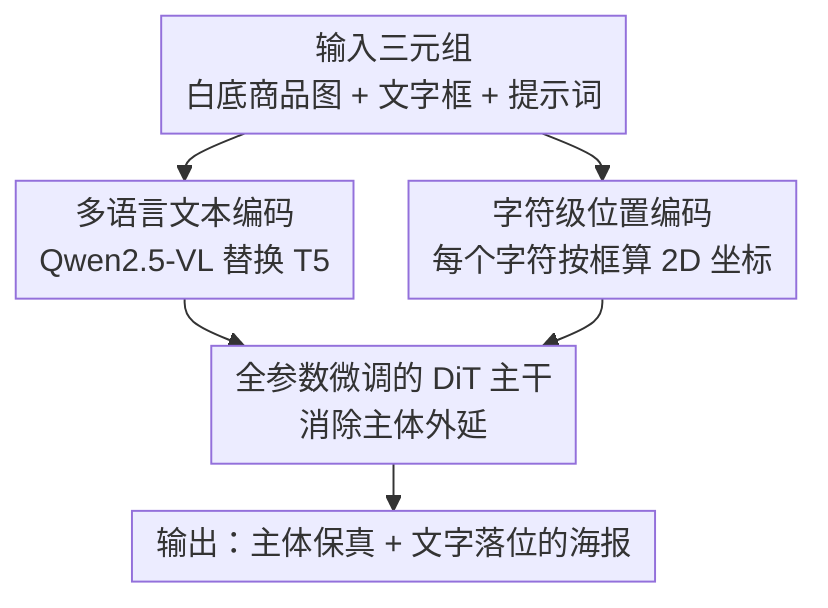

# SimplePoster: A Simple Baseline for Product Poster Generation

**会议**: CVPR 2026  
**arXiv**: [2605.08784](https://arxiv.org/abs/2605.08784)  
**代码**: https://github.com/Alibaba-YuFeng/SIMPLEPOSTER (有)  
**领域**: 扩散模型 / 图像生成  
**关键词**: 商品海报生成, inpainting, 全参数微调, 主体保真, 字符级位置编码

## 一句话总结
针对电商商品海报生成的两大刚需——主体不能变形、多行文字要落到指定位置，SimplePoster 把现有方法堆叠的 ControlNet / OCR 编码器全部砍掉，只靠「对 FLUX-Fill 做全参数微调」消除主体外延、靠「零成本的字符级位置编码」实现版面可控文字，主体保持率从 PosterMaker 的 85.3% 提到 98.7%，文字准确率也全面领先。

## 研究背景与动机
**领域现状**：商品海报生成的主流范式是 inpainting：先把商品从原图抠出来贴到白底上、固定商品区域不动，让模型只合成背景和促销文字。相比通用文生图编辑模型（FLUX-Kontext、SeedEdit、Gemini 2.5 Flash、GPT-4o 等），inpainting 理论上能保住商品不被改动。当前 SOTA 的 PosterMaker 在这个范式上加了一堆辅助模块：用 ControlNet 做结构约束、注入字符级 OCR 特征提升文字渲染、再训练一个「主体外延检测器」当强化学习的奖励模型。

**现有痛点**：两条路都不干净。通用编辑模型走文生图框架，没有显式的主体保持机制，频繁出现纹理崩坏、结构变形、颜色漂移、文字坍塌——电商场景里商品哪怕轻微失真都会误导消费者。专用 inpainting 方法虽然锁住了商品区域，却仍有「主体外延」（subject extension）伪影：模型会在固定商品边缘往外续画出多余结构（比如给茶壶凭空加底座、把吸顶灯接出一截杆变成吊灯）。而 PosterMaker 这类方案为了压制外延堆了 ControlNet + 奖励模型，架构复杂、训练开销大、推理变慢，可复现性还差。

**核心矛盾**：现有工作默认「要控制结构/文字就得加外挂模块」。但作者质疑：主体外延的根因不是缺控制器，而是**域差**——标准 inpainting 模型是在「随机抠小块补全」的数据上训练的，而海报生成要补的是商品旁边的**大片背景区域**，两种任务分布差太远。在这个错位的基模型上再叠 ControlNet，相当于给走偏的模型打补丁，治标不治本。

**本文目标**：用最简架构同时解决（1）主体严格保真、（2）多行文字的精确空间定位，且不引入任何外部控制器、不做多阶段训练。

**切入角度**：与其加模块，不如直接改基模型的内部表示去弥合域差；与其用 glyph 图 / OCR 特征 / 版面编码器去控制文字位置，不如直接给文字 token 一个有意义的空间坐标，让 DiT 自己学会「把这个字画到这里」。

**核心 idea**：用「全参数微调 + 字符级位置编码」这两个零额外模块的改动，替代「ControlNet + OCR 编码器 + 奖励模型」的复杂管线。

## 方法详解

### 整体框架
SimplePoster 建立在现成的 inpainting 模型 FLUX-Fill 之上（由 VAE + DiT + T5 文本编码器组成），任务设定沿用 PosterMaker：输入三元组 $(I, \mathcal{P}, \mathcal{B})$——白底商品图 $I$、每行文字的边界框集合 $\mathcal{B}=\{b_i=(x_l,y_t,x_r,y_b)\}$、描述背景场景与文字内容的提示词 $\mathcal{P}$——输出一张保住商品原貌、且每行文字落在指定框内的写实商品海报，即学习生成函数 $G(I,\mathcal{P},\mathcal{B}) \to I^*$。

整个方法的精髓是「做减法」：相比 PosterMaker 那套带 ControlNet 和 OCR 编码器的管线，SimplePoster 只对 FLUX-Fill 做了三处改动，**不增加任何新模块、不增加推理开销**：(1) 把只懂英文的 T5 换成支持中英双语的 Qwen2.5-VL 当文本编码器；(2) 全参数端到端微调整个 DiT 主干（而非冻结基模型只训外挂控制器），用来消除主体外延；(3) 把文字 token 的位置编码从「全部固定为 (0,0)」改成「按目标边界框算出每个字符的真实坐标」，实现版面可控的文字渲染。训练上是单阶段端到端，用标准 flow matching 目标，不加任何辅助损失。

### 关键设计

**1. 全参数微调消除主体外延：根因是域差，不是缺控制器**

作者先用一节实验把「该不该加 ControlNet」这个问题拆开。以 FLUX-Fill 为基线，benchmark 上主体外延率高达 41%。按 PosterMaker 的做法接入 ControlNet、冻结 DiT 只训控制器，外延率只降到 23.6%，改善有限。作者的判断是：标准 inpainting 训练时 mask 的是随机小块，而海报生成要合成商品旁的大片背景，二者分布存在根本性域差，光加控制器无法弥合，必须直接调整基模型。为验证这点，他们换成 LoRA 微调——参数更少，外延率却降到 2.8%，明显优于冻结基模型 + ControlNet 的方案；进一步做全参数微调，外延率压到 0.6%，近乎完全消除。结论是：与其给错位的模型加复杂度，不如精炼它的内部表示，从根上解决外延。这条洞察直接否定了「专用海报方法必须靠 ControlNet 做结构约束」的隐含假设。

**2. 字符级位置编码（CPE）：零成本把文字 token 接到空间坐标上**

原始 FLUX-Fill 里，RoPE 会把每个图像 token 的空间坐标 $(x,y)$ 转成位置感知的注意力嵌入，但**所有文字 token（包括要渲染成图像的字符）都被赋予固定坐标 $(0,0)$**，与它们的目标版面无关——这让模型无法把文字生成锚定到具体空间区域。CPE 的改法极简：给第 $i$ 个字符 token 一个有意义的 2D 坐标。具体地，对一行含 $n$ 个字符、边界框为 $(x_l,y_t,x_r,y_b)$ 的文字，把框水平均分成 $n$ 个子区，按从左到右的书写顺序，取第 $i$ 个子区的中心作为第 $i$ 个字符的坐标：

$$\left(x_c^{i}, y_c^{i}\right) = \left(x_l + \frac{i-0.5}{n}(x_r - x_l),\; \frac{y_t + y_b}{2}\right)$$

这些坐标照常经 RoPE 进入 DiT 的注意力计算，于是每个字符都被引导到用户指定的位置去合成。它不改任何架构、推理零额外开销，却不需要 glyph 图、OCR 特征或版面编码器就实现了几何感知的文字生成。更妙的是，这种显式坐标监督还让模型能在**单一训练阶段**内学会新字符集（如中文）——而以往方法要专门的多阶段训练才能获得跨语言文字能力。

**3. 单阶段端到端训练：把多阶段管线压成一步**

以往工作常把「文字生成」和「背景合成」拆成多个训练阶段。SimplePoster 直接对预训练 DiT 做单阶段端到端微调，用标准 flow matching 目标、不加任何辅助损失。作者发现模型收敛得又快又稳，无需多阶段，并把这归功于 CPE：精确的逐字符坐标消除了「文字位置」的空间歧义（文字提示里「居中顶部」这种粗描述对应无数种合法版面，会拖慢学习），从而让结构约束（来自全参数微调）和版面控制（来自 CPE）能在一次训练里同时学好。

### 损失函数 / 训练策略
- **损失**：仅用 SD3 / FLUX 采用的标准 flow matching 目标，不引入任何辅助损失。
- **训练数据**：约 150 万张真实电商商品图（鞋、玩具、包、化妆品、家具等），其中约 30 万张含中文促销文字。每个样本构造成三元组：用分割 + 抠图模型把商品放到纯白底；用 OCR 引擎检出各行文字的框与内容（排除印在商品本体上的 logo/标签，避免与生成的促销文字冲突）；用 Qwen2.5-VL-72B 生成描述性 caption 当提示词，并加入各行文字的粗略空间描述。
- **主实验配置**：在 128 张 NVIDIA H20 上（总 batch 512）对 FLUX-Fill 的 DiT 主干跑 3 个 epoch（约 40 小时），AdamW、学习率 5e-5、weight decay 1e-2，训练/推理均为 1024×1024。

## 实验关键数据

### 主实验
基准为自建 500 张测试图（含 200 张密集多行中文促销文字），评测四个维度：主体保持率 SPR（人工判定，零几何形变/材质改动/品牌失真才算保住）、文字句准确率 Sen. Acc、归一化编辑距离 NED、提示遵循度和视觉吸引力（5 名标注员 5 分 Likert）。

| 方法 | 主体保持率 SPR↑ | Sen. Acc↑ | NED↑ | 提示遵循↑ | 视觉吸引力↑ |
|------|------|------|------|------|------|
| FLUX-Kontext (pro) | 36.27% | 0.076 | 0.146 | 3.02 | 3.21 |
| Step1x-Edit | 28.8% | 0.094 | 0.313 | 2.55 | 3.08 |
| Gemini 2.5 Flash | 51.4% | 0.323 | 0.630 | 3.82 | 4.12 |
| SeedEdit 3.0 / DreamPoster | 55.2% | 0.643 | 0.783 | 3.73 | **4.22** |
| PosterMaker (前SOTA) | 85.3% | 0.576 | 0.739 | 3.32 | 3.74 |
| **SimplePoster (本文)** | **98.7%** | **0.713** | **0.806** | 3.55 | 4.03 |

主体保持率从 PosterMaker 的 85.3%、最强通用编辑模型 SeedEdit 的 55.2%，提到 98.7%，近乎完美；文字渲染也全面领先（Sen. Acc 0.713 vs PosterMaker 0.576）。提示遵循和视觉吸引力上优于 PosterMaker，但略逊于 Gemini / SeedEdit——作者归因于电商训练数据偏重商品清晰度、背景多样性和美学不足。

### 消融实验
| 配置 | Sen. Acc↑ | NED↑ | 说明 |
|------|------|------|------|
| Full setting | 0.7133 | 0.8062 | 完整模型 |
| w/o Character PE | 0.2494 | 0.5484 | 去掉字符级位置编码，文字准确率崩塌 |

去掉 CPE 后 Sen. Acc 从 71.33% 暴跌到 24.94%、NED 从 0.806 降到 0.548；更关键的是，没有显式坐标监督，模型在 3 个 epoch 内**无法收敛到中文字符生成**，而有 CPE 时能在单阶段内同时学会版面控制和多语言。

消除主体外延的策略对比（Section 3，只用 30 万无促销文字子集隔离分析）：

| 策略 | 主体外延率↓ |
|------|------|
| FLUX-Fill 基线 | 41% |
| + ControlNet（冻结 DiT） | 23.6% |
| LoRA 微调（rank 64） | 2.8% |
| 全参数微调 | 0.6% |

### 关键发现
- **贡献最大的是「微调方式」而非加模块**：ControlNet 只把外延从 41% 降到 23.6%，而同样不加新模块的 LoRA 就降到 2.8%、全参数微调降到 0.6%——印证「域差需要直接适配基模型」的判断。
- **CPE 是文字渲染的命门**：去掉它文字准确率近乎腰斩，且无法在单阶段内学会中文。
- **数据效率惊人**：仅 3K 训练图就能把外延率从 41% 降到 3.6%，优于用 300K 图训练的 ControlNet（消融见附录 D，固定总迭代数变数据规模）。
- **CPE 可泛化到通用文生图**：在 FLUX.1-dev 上加 CPE 扩展日/韩文，多行文字 Sen. Acc 从 4.6% 提到 25.7%（相对提升 458%），说明 CPE 对空间歧义最严重的复杂版面尤其关键。

## 亮点与洞察
- **「做减法」反而超越「做加法」**：在一个大家都在堆 ControlNet + OCR + 奖励模型的方向上，作者用「全参数微调 + 一个坐标公式」就拿到 SOTA，证明很多复杂度其实是给错位基模型打的补丁——这是很有说服力的反直觉结论。
- **把「文字定位」问题转化为「位置编码」问题**：原本要靠 glyph 图/OCR/版面编码器解决的事，本质只是 FLUX-Fill 把文字 token 坐标偷懒设成了 (0,0)。CPE 用一行均分公式补上这个坐标，零架构改动、零推理开销——是典型「找到病根后极简一刀」的设计，很容易迁移到任何需要空间可控文字的 DiT 生成任务。
- **诊断先行**：Section 3 没有直接上方法，而是先做对照实验（baseline→ControlNet→LoRA→全参数）定位主体外延的根因是域差，再据此选型。这种「先把问题量化清楚再设计方案」的写法很值得学。

## 局限性 / 可改进方向
- **依赖分割/抠图质量**：框架假设输入是干净白底商品图，遇到非白底要靠现成分割+抠图模型，过/欠分割（尤其原图含密集文字时）会污染 mask，迫使 inpainting 重建缺失商品内容，损伤结构保真。
- **inpainting 范式天然无法改商品属性**：未 mask 的商品区域被严格保留，无法满足「把装满水的瓶子改成空瓶」这类需要修改商品本体状态/颜色/风格的指令——这是范式的根本约束。
- **文字准确率仍受限于基模型**：尽管用了精确坐标，SimplePoster 在整体文字质量上仅略胜只靠粗略提示的 SeedEdit 3.0，作者认为进一步提升要靠更强的多语言预训练。
- **视觉美学偏弱**：电商数据重清晰度轻美学，导致视觉吸引力落后于 Gemini / SeedEdit，构图和背景多样性不够丰富。

## 相关工作与启发
- **vs PosterMaker（前 SOTA）**: 二者任务设定相同（输入商品图 + 文字框 + 提示）。PosterMaker 靠 ControlNet 做结构约束、注入 OCR 特征做文字、再训练外延检测器当奖励模型；SimplePoster 把这些全砍掉，只用全参数微调消外延、CPE 控文字。本文优势是架构极简、推理无额外开销、单阶段训练、SPR 98.7% vs 85.3%；代价是依赖良好分割、无法编辑商品本体。
- **vs 通用编辑模型（SeedEdit / Gemini / FLUX-Kontext / GPT-4o）**: 它们走文生图框架、靠参考图 + 文字提示控制，没有显式主体保持机制，主体保持率仅 28–55%，且只能用粗略文字描述定位文字。SimplePoster 的 inpainting + CPE 在保真和定位上完胜；但通用模型不需要显式 mask、视觉美学更强。
- **vs 视觉文字生成方法（AnyText / GlyphControl 等）**: 它们普遍依赖 glyph 图或字符级 OCR 特征注入。SimplePoster 用一个坐标公式 + RoPE 就实现几何感知文字，不需要任何 glyph/OCR 输入，更轻量且能单阶段跨语言适配。

## 评分
- 新颖性: ⭐⭐⭐⭐ 单看组件都不新（全参微调、RoPE 坐标），但「诊断出外延根因是域差 + 用零成本 CPE 替代整套外挂」的组合很有洞察力。
- 实验充分度: ⭐⭐⭐⭐⭐ 主实验覆盖 6 个强基线、四维度评测，外延消除有完整对照，还有数据效率和跨语言泛化的额外验证。
- 写作质量: ⭐⭐⭐⭐⭐ 「先诊断后设计」叙事清晰，把「为什么简单方法就够」论证得很扎实。
- 价值: ⭐⭐⭐⭐⭐ 给商品海报生成立了一个强且极简的新 baseline，且开源代码/模型/benchmark，工业落地价值高。

<!-- RELATED:START -->

## 相关论文

- [\[CVPR 2026\] PosterIQ: A Design Perspective Benchmark for Poster Understanding and Generation](posteriq_a_design_perspective_benchmark_for_poster_understanding_and_generation.md)
- [\[CVPR 2026\] InnoAds-Composer: Efficient Condition Composition for E-Commerce Poster Generation](innoads-composer_efficient_condition_composition_for_e-commerce_poster_generatio.md)
- [\[CVPR 2026\] HiFi-Inpaint: Towards High-Fidelity Reference-Based Inpainting for Generating Detail-Preserving Human-Product Images](hifi-inpaint_towards_high-fidelity_reference-based_inpainting_for_generating_det.md)
- [\[CVPR 2026\] PosterOmni: Generalized Artistic Poster Creation via Task Distillation and Unified Reward Feedback](posteromni_generalized_artistic_poster_creation_via_task_distillation_and_unifie.md)
- [\[CVPR 2026\] SkyReels-Text: Fine-Grained Font-Controllable Text Editing for Poster Design](skyreels-text_fine-grained_font-controllable_text_editing_for_poster_design.md)

<!-- RELATED:END -->
